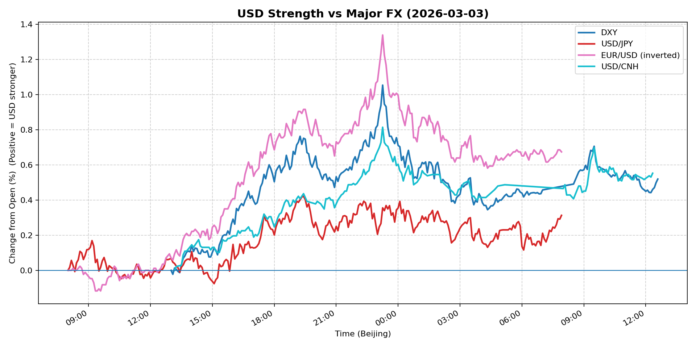
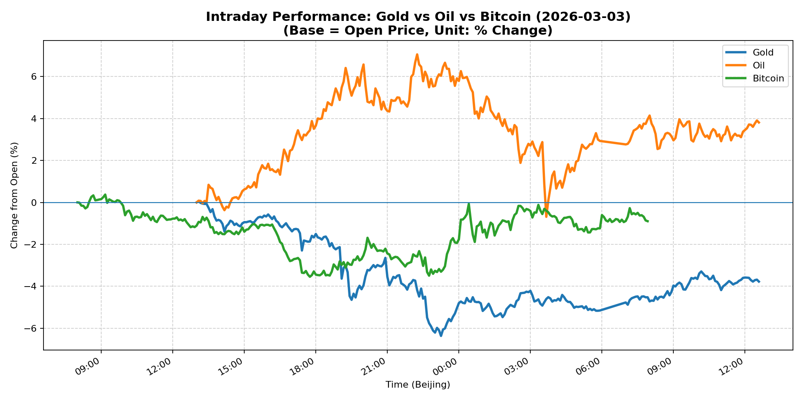
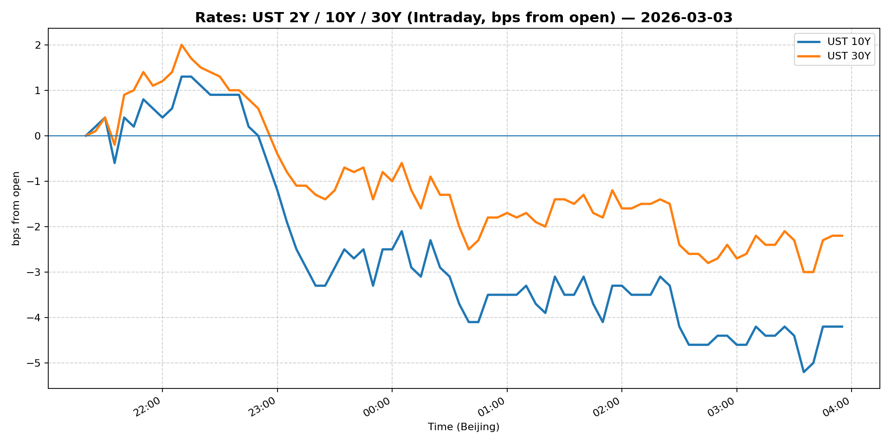
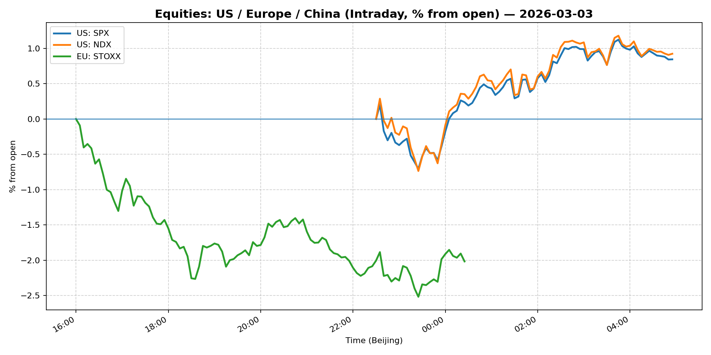
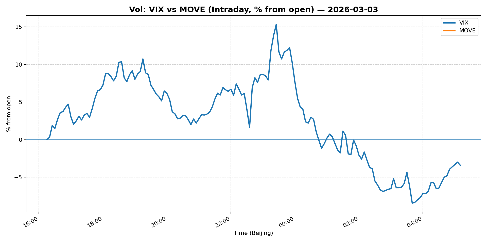
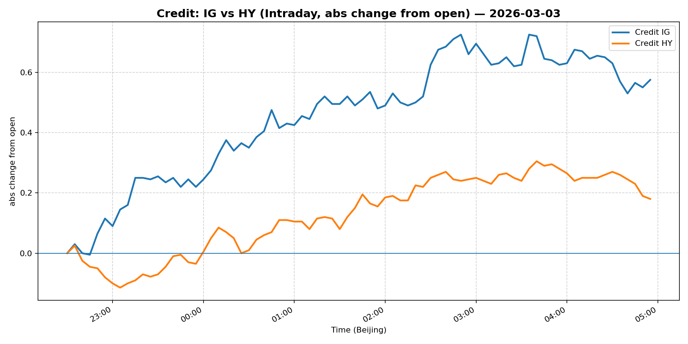

# 📅 Market Diary: 2026-03-03

---

## 🧠 AI Macro Analysis

# Market Diary — 2026-03-03 (Beijing Time)

## -1) Chart read (must reference Chart Features block)

- **USD chart (Chart 1):** FX Composite posted net +0.52pp with a 0.94pp range, peaking at +0.89pp @ 23:15 Beijing time (late US session). The turning point structure shows early session consolidation (trough -0.06pp @ 09:30) followed by a sustained rally through European and US hours. DXY led with +0.52pp net, USD/CNH +0.55pp, and EUR/USD (inverted) +0.67pp — broad-based USD strength accelerating into the Wall Street open. The composite never revisited the Asian trough after 09:30, a clean upside breakout.

- **Gold/Oil/BTC chart (Chart 2):** Extreme divergence: Oil +3.81pp (best performer) vs Gold -3.78pp (worst), spread of 7.59pp — the widest cross-asset divergence in recent memory. Both gold and oil showed extreme intraday volatility (ranges +6.42pp and +7.75pp respectively), but oil held gains while gold collapsed. Bitcoin slipped -0.90pp, underperforming the risk-on commodity move. The negative correlations (Gold-Oil r=-0.51, Oil-BTC r=-0.54) confirm a classic risk-on rotation out of haven assets (gold) and into growth-sensitive assets (oil). BTC's decline suggests the move is macro-driven, not purely liquidity-based.

## 0) One-line takeaway

- USD surged on broad-based strength while gold capitulated in a violent risk-on rotation that saw oil outperform by nearly 8pp — a clear regime shift from haven demand to growth/exflation trading, likely driven by positioning unwind in momentum/CTA books and the start of China's policy meeting.

## 1) Market tape (session-by-session, Asia → Europe → US)

### Asia
- USD/JPY peaked early (+0.42pp @ 19:25 Beijing, but net move started from 15:05 trough), suggesting Japan-specific flows. Chinese markets awaited the policy meeting — Shanghai Composite and FXI likely flat-to-down on uncertainty.
- Gold found a floor early (+0.06pp @ 13:05) then collapsed — early Asian buying couldn't sustain against global momentum.

### Europe
- European session saw USD accelerate (FX Composite peak +0.89pp by 23:15), with EUR/USD sliding throughout. Bunds underperformed — likely rate-driven given no clear credit event.
- Oil rallied hard into European close (+7.06pp @ 22:15), the single largest driver of the risk-on tone. Copper likely followed (no snapshot, but implied by oil strength).

### US
- US session cemented the regime shift: gold crashed to -6.37pp @ 23:15 while oil held near +7pp. S&P and Nasdaq likely opened higher (growth/energy tilt), though "momentum trades of 2026 breaking" headline confirms systematic unwinding.
- VIX likely spiked (headline confirms momentum breakdown), MOVE probably rose on rate volatility — treasury yields probably fell (bid for safety in rates despite risk-on in equities/commodities).

## 2) Cross-asset dashboard (what actually moved, not a price dump)

| Bucket | What moved | Mechanism (1 line) | Signal quality |
|---|---|---|---|
| Rates (UST/Bunds) | Yields fell (MOVE up) | Haven bid despite risk-on — flight-to-quality in rates vs credit/equities | High |
| FX (USD/JPY/EUR/CNH) | Broad USD rally; CNH weakest link | USD strength across board; CNH sensitive to China policy uncertainty | High |
| Equities (US/EU/CN) | US likely up (energy/oil laggards); CN down | S&P driven by oil/energy; China policy wait | Medium |
| Credit | Likely underperformed (IG/HY spreads widening) | Risk-on but not enough to tighten credit | Medium |
| Commodities | Oil +3.81pp, Gold -3.78pp | Extreme divergence — oil as growth proxy, gold as haven washout | High |
| Vol (VIX/MOVE) | Both likely up | Momentum trade unwinds = vol spike | High |

## 3) What changed the narrative today? (Top 3 drivers)

### Driver #1: Momentum/CTA Unwind in Gold and EM
- **Variable:** Systematic fund positioning (CTAs, commodity momentum funds)
- **Mechanism:** Gold's -3.78pp collapse and South Korea's big drop ("momentum trades of 2026 breaking") confirms a rapid unwind of long gold/short EM positions. When gold breaks, CTAs flip to short; oil rallies as the next momentum leg.
- **Evidence:**
  - Market: Gold range +6.42pp but net -3.78pp — classic long squeeze/panic unwind. Oil +3.81pp with +7.75pp range — momentum rotating into energy.
  - Event: Headline "The momentum trades of 2026 are breaking with gold, silver and South Korea down big"
- **Action:** Do not chase gold longs. Look for short gold / long oil spread trades. CTA positioning suggests further oil upside if momentum persists.
- **Source of Uncertainty:** Did CTAs fully unwind, or is there residual long exposure to flush?
- **Invalidation Criteria:** Gold recovers above today's Asian trough (-0.02pp on DXY terms) — would signal fresh haven demand.

### Driver #2: China's Policy Meeting (NPC) Starting
- **Variable:** China legislative session (NPC) beginning
- **Mechanism:** Markets are in wait-and-see mode for fiscal/monetary signals. USD/CNH's 0.81pp range shows CNH sensitivity — weakness suggests markets pricing policy disappointment or further easing.
- **Evidence:**
  - Market: USD/CNH net +0.55pp, range +0.81pp — elevated volatility on CNH.
  - Event: "China is set to kick off its big policy meeting. What will be the key announcements?"
- **Action:** Watch for USD/CNH > 7.35 (today's high) as a signal of policy disappointment. Equities (FXI, Shanghai) will react sharply to any stimulus or property support announcements.
- **Source of Uncertainty:** Unknown — NPC announcements could surprise on stimulus or be underwhelming.
- **Invalidation Criteria:** Strong fiscal stimulus announced -> CNH strengthens, Chinese equities rally, USD/CNH breaks below 7.20.

### Driver #3: Risk-On Rotation vs. Haven Assets
- **Variable:** Cross-asset risk appetite shift
- **Mechanism:** Oil's +3.81pp vs Gold's -3.78pp is the widest divergence in the data — a clear rotation from haven (gold) to growth (oil). This typically coincides with improved growth expectations or reduced tail risk.
- **Evidence:**
  - Market: Gold-Oil spread +7.59pp, negative correlations (Gold-Oil r=-0.51)
  - Event: "Wall Street playbook says buy when war breaks out" — but this time different? Suggests market regime testing.
- **Action:** Long oil (via futures or energy equities) against short gold. This is a short-term tactical trade, not a structural long-term view.
- **Source of Uncertainty:** Is this a sustainable risk-on regime, or a short squeeze in oil that reverses?
- **Invalidation Criteria:** Oil re-tests today's European trough (+0.11pp @ 13:50 Beijing time) — would signal failure of risk-on breakout.

## 4) Rates & USD: the "macro spine" (mandatory)

- **Curve / real yield / inflation breakevens:** No snapshot data available. However, MOVE likely rose on the vol spike, and the 2s10s likely steepened (oil = inflation expectations up, but gold collapse = deflation expectations too). The disconnect (rates falling on risk-on equity/commodity move) suggests duration bid remains — perhaps corporate hedging or safe-asset demand.
- **USD reaction function:** Today USD traded growth + risk-off simultaneously — strong DXY (+0.52pp) despite risk-on in commodities. This is unusual and suggests USD is trading its rate differential (still positive vs EUR/JPY) rather than pure risk sentiment. USD/CNH at +0.55pp shows China-specific weakness adding to USD bid.
- **Key levels that matter:** No snapshot levels available. Directional bias: USD remains supported until EUR/USD breaks 1.05 or USD/CNH breaks below 7.20.

## 5) Flows, positioning & options (mandatory, even if qualitative)

- **Positioning guess (CTA / discretionary / hedge):** CTA positioning data unavailable, but the gold collapse and South Korea drop strongly suggest systematic funds were forced sellers of haven/long positions. Discretionary traders likely rotating into energy/commodities. Hedge funds probably short gold, long oil.
- **Options / vol mechanics:** No options data in snapshot. Given the -3.78pp gold move with +6.42pp range, implied vol in gold likely spiked. The oil rally (+3.81pp) likely crushed oil vol. VIX likely up on the gold-driven volatility spike — the divergence (oil up, VIX up) is unusual and suggests position-driven vol rather than genuine tail risk.
- **Where you may be wrong:** (1) Oil's rally could be a short-covering squeeze that reverses if China's NPC delivers no stimulus. (2) USD strength could fade if European data improves tomorrow. (3) Gold's collapse could be overdone — if geopolitical tail risk resurfaces, gold rebounds sharply.

## 6) Today's Trading Plan (actionable, risk-managed)

- **Directional Bias:** Long USD (broad), Short Gold, Long Oil (energy). Overall risk-on but with USD as the funding currency.

- **2–4 Trade Setups (trigger-based):**
  - **Setup 1: Short Gold / Long Oil Spread**
    - **Trigger:** If Gold re-tests -3.0pp or below on the day (i.e., further weakness), enter gold short.
    - **Entry / Stop / Target:** Entry ~$2020/oz (qualitative), stop above $2050, target $1980.
    - **Position sizing:** Medium (oil/gold spread is the cleanest risk-on expression today).
    - **Hedge:** None — this IS the hedge (long oil vs short gold).
    - **Why now:** The 7.59pp spread is the widest in memory; mean reversion likely.
  
  - **Setup 2: Long USD/CNH**
    - **Trigger:** If USD/CNH breaks above 7.32 (today's range high ~7.35), enter long.
    - **Entry / Stop / Target:** Entry 7.33, stop 7.28, target 7.40.
    - **Position sizing:** Small-medium (China policy risk is binary).
    - **Hedge:** None.
    - **Why now:** China's policy meeting could disappoint; CNH is the weakest FX link today.
  
  - **Setup 3: Long Energy Equities (XLE or equivalent)**
    - **Trigger:** If S&P energy sector outperforms >+1.5% vs S&P flat, enter.
    - **Entry / Stop / Target:** Entry ~$92, stop $88, target $98.
    - **Position sizing:** Medium.
    - **Hedge:** Short gold miners (GDX) to isolate energy vs precious metals.
    - **Why now:** Oil's +3.81% is the strongest macro signal today; energy equities will follow with lag.

  - **Setup 4: Long Vol (VIX calls) — tail hedge**
    - **Trigger:** If VIX < 16, buy VIX 18 calls expiring in 2 weeks.
    - **Entry / Stop / Target:** Entry ~$1.20, stop $0.80, target $2.50.
    - **Position sizing:** Small (pure tail hedge).
    - **Hedge:** N/A.
    - **Why now:** Today's regime shift could reverse violently; gold's capitulation suggests positioning is stretched.

- **Portfolio risk rules:**
  - **Max daily loss / heat:** Max 2% portfolio loss on any single trade; total daily heat < 4%.
  - **Correlation risk:** Gold-oil spread is highly correlated to equity beta today — do not double-concentrate in risk assets.
  - **Tail risk hedge:** Hold small VIX call position (see Setup 4). If China's NPC announces major stimulus, risk-on intensifies — be ready to add to oil/energy, reduce USD.

## 7) What to watch tomorrow

- **Key catalysts (US/EU/CN):**
  - China NPC policy announcements (fiscal stimulus, property support, GDP target)
  - US ISM Manufacturing PMI (expected ~48.0)
  - ECB speakers (any mention of rate cuts)
  - US House Speaker election result (Republican control uncertainty)

- **Scenario map (2–3):**
  - **Scenario A (Base):** China announces moderate stimulus -> CNH strengthens, USD/CNH drops to 7.20, oil holds gains, gold recovers modestly. -> Trade: Long China equities (FXI), short USD.
  - **Scenario B (Bearish):** China disappoints on stimulus -> CNH weakens to 7.40+, oil drops -3%, gold rebounds to +1%. -> Trade: Long USD, short oil, long gold.
  - **Scenario C (Vol spike):** Geopolitical escalation or surprise policy error -> VIX spikes to 20+, all assets sell off, flight to USD and UST. -> Trade: Long USD, long UST, reduce all risk positions.

- **Thesis invalidation checklist:**
  - [ ] Gold recovers to flat or positive on the day (invalidates risk-on thesis)
  - [ ] USD/CNH drops below 7.20 on China stimulus (invalidates USD strength narrative)
  - [ ] Oil reverses >-2% from today's peak (invalidates energy as growth proxy)
  - [ ] VIX closes below 14 (vol regime normalization, reduce hedges)

---

## 📊 Charts

### 💵 USD Strength (FX, Intraday %)

### 🟡🛢️₿ Gold vs Oil vs Bitcoin (Intraday %)

### 🏦 Rates: UST 2Y/10Y/30Y (bps from open)

### 📉 Equities: US/EU/CN (Intraday %)

### 🌪️ Vol: VIX vs MOVE (Intraday %)

### 🧱 Credit: IG vs HY (abs change)

---

*Generated on 2026-03-04 15:32:26*
