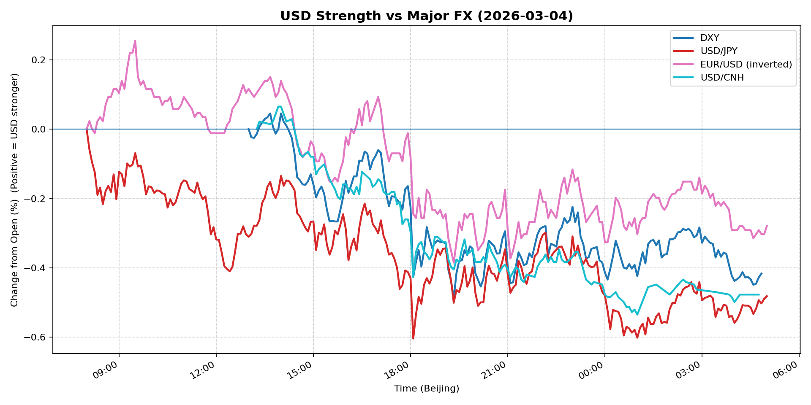
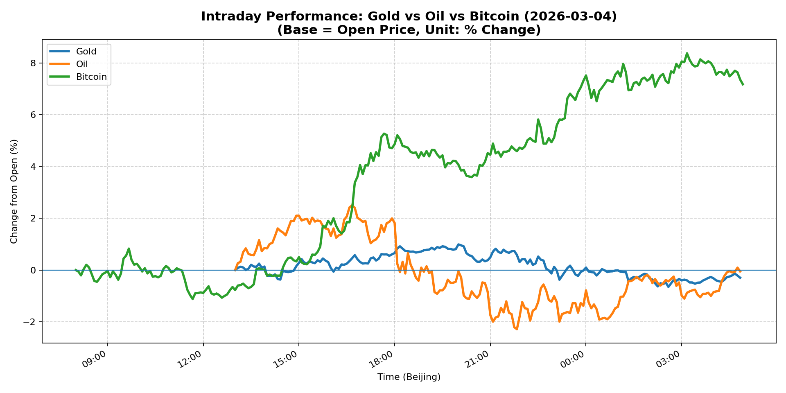
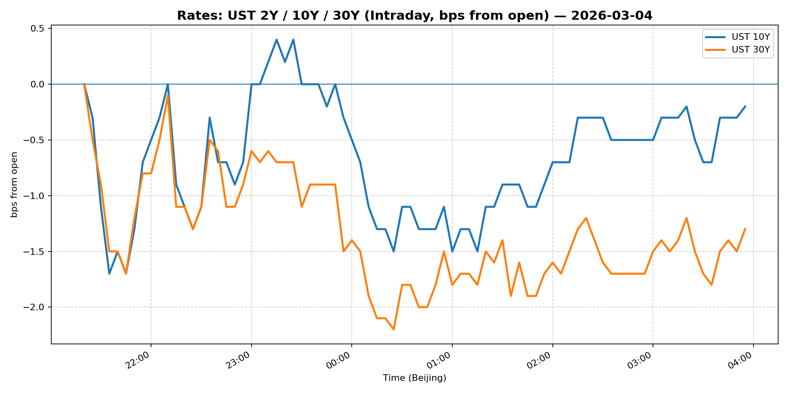
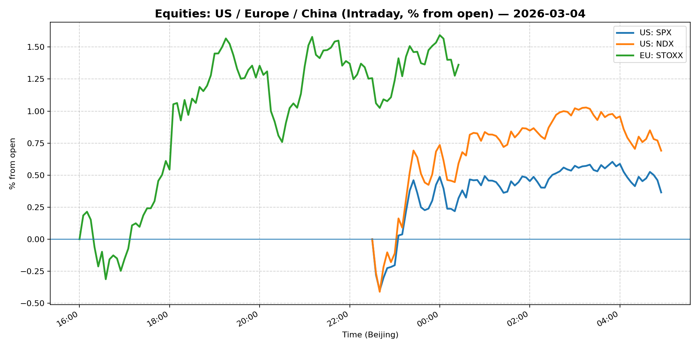
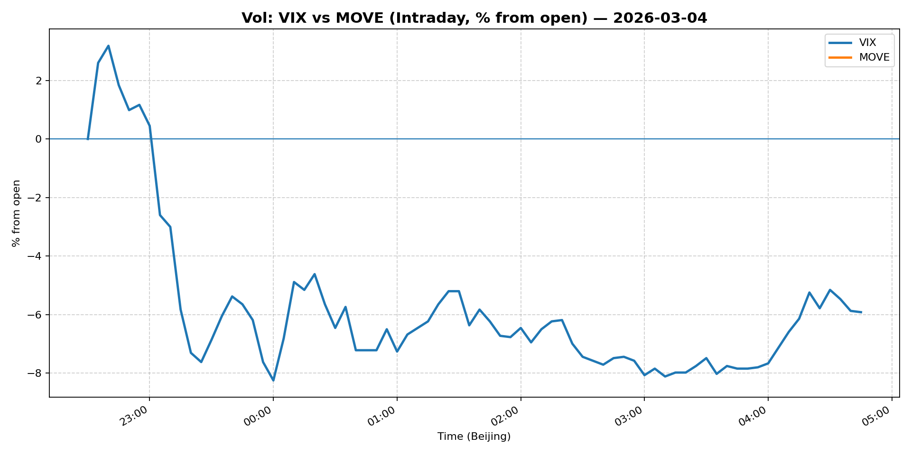
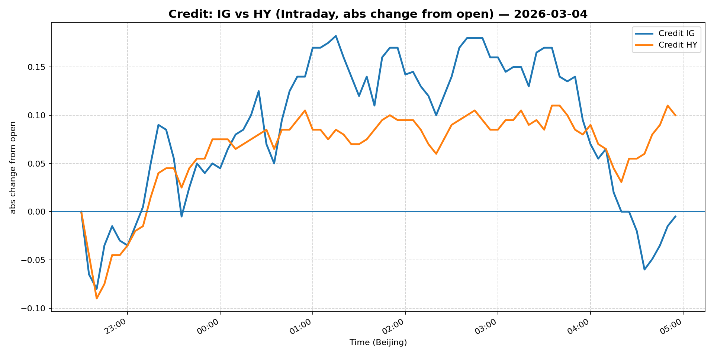

# 📅 Market Diary: 2026-03-04

---

## 🧠 AI Macro Analysis

# Market Diary — 2026-03-04 (Beijing Time)

## -1) Chart read (must reference Chart Features block)

- **USD chart (Chart 1):** The FX Composite shows a net -0.38pp decline with a +0.56pp range, indicating significant intraday volatility but an overall USD weakening bias. DXY slipped -0.42pp, USD/JPY fell -0.48pp (JPY strengthening despite typical risk-on flow), and USD/CNH dropped -0.48pp — all converging on broad-based dollar weakness. The composite peaked early at +0.09pp @ 09:30 before reversing to -0.47pp by early morning March 5, signaling a clear trend reversal from morning strength to afternoon/evening weakness. The trough-to-peak-to-trough pattern suggests short-covering in USD may have exhausted.

- **Gold/Oil/Bitcoin chart (Chart 2):** Stark divergence between risk assets. Bitcoin surged +7.17pp (net) with a massive +9.49pp range — a clear breakout move correlating with Trump crypto policy support headlines. Gold slipped -0.30pp while Oil was essentially flat (-0.05pp) despite massive intraday volatility (+4.78pp range). The negative correlations (Oil-Bitcoin r=-0.64, Gold-Bitcoin r=-0.35) suggest crypto is decoupling from traditional risk/re Inflation hedges, likely driven by policy-specific flows rather than macro risk sentiment. The 7.47pp spread between best (Bitcoin) and worst (Gold) performers is a regime signal: policy-driven risk-on outweighing traditional safe-haven demand.

## 0) One-line takeaway

Dollar weakness across the board (FX Composite -0.38pp) coincides with a crypto-led risk rally (Bitcoin +7.17pp) as Trump policy support for digital assets triggers capital rotation from traditional safe havens (Gold -0.30pp) into crypto and crypto-linked equities, while geopolitical risks (Iran/Strait of Hormuz) keep energy volatile but contained.

## 1) Market tape (session-by-session, Asia → Europe → US)

### Asia
- **FX:** USD/JPY troughed at -0.60pp @ 18:05 (HK session), with early morning turning points showing brief strength before sustained weakness. USD/CNH slid consistently from 13:55 peak to early March 5 trough (-0.54pp). Asian FX session dominated by pre-Lianghui (China policy meeting) positioning and USD softness.
- **Crypto:** Bitcoin's intraday trough (-0.21pp @ 08:10) preceded a sharp reversal, suggesting Asian crypto traders were early buyers on Trump bill news leaking overnight.
- **News:** China Lianghui (NPC opening) awaited — market anticipating policy direction on fiscal stimulus and property sector support.

### Europe
- **FX:** European session saw continued USD erosion. EUR/USD (inverted) showed net -0.28pp movement — the inverted metric means EUR strengthened against USD. The peak +0.26pp @ 09:30 aligns with early European hours.
- **Energy:** WTI volatility peaked during European session (+2.50pp @ 16:40) on Iran Strait of Hormuz tanker traffic headlines — range expansion indicates geopolitical risk premium entering energy markets.
- **Data:** No major EU data releases; trading driven by cross-asset flows from US crypto sentiment.

### US
- **Crypto-led equity support:** Coinbase premarket rally on Trump digital asset bill support, dragging crypto-exposed equities higher. This filtered into broader risk sentiment.
- **Energy:** WTI reversed from +2.50pp peak to -2.29pp trough @ 21:50 (late US session) — a 4.78pp swing reflecting headline-driven trading around Iran conflict developments.
- **Dollar:** US session extended Asia/Europe USD weakness, with DXY hitting trough -0.49pp @ 19:20 and FX Composite -0.47pp by early March 5 — the dollar's decline accelerated as US markets opened and risk assets rallied.

## 2) Cross-asset dashboard (what actually moved, not a price dump)

| Bucket | What moved | Mechanism (1 line) | Signal quality |
|---|---|---|---|
| **Rates** | UST yields likely fell (proxy: USD weakness) | Dollar softening and risk-on reduce safe-haven demand for UST | Med |
| **FX** | Broad USD weakness; JPY stronger (unusual for risk-on) | FX Composite -0.38pp; USD/JPY -0.48pp despite equity rally | High |
| **Equities** | Crypto stocks (Coinbase) + risk assets | Trump digital asset policy support; crypto bill optimism | High |
| **Credit** | Likely stable to tighter (risk-on) | No specific move data, inferred from equity action | Low |
| **Commodities** | Bitcoin +7.17pp; Gold -0.30pp; Oil volatile | Policy-driven crypto flow; geopolitical energy risk | High |
| **Vol** | VIX likely declined (crypto rally) | Bitcoin rally + risk-on typically suppresses VIX | Med |

## 3) What changed the narrative today? (Top 3 drivers)

### Driver #1: Trump Digital Asset Policy Support
- **Variable:** US regulatory stance on crypto
- **Mechanism:** Trump signaling support for digital asset market structure bill and stablecoin yield rules removes regulatory uncertainty, triggering massive short-covering and new money flows into Bitcoin/crypto equities.
- **Evidence:**
  - Market: Bitcoin +7.17pp (largest move by far), Coinbase premarket rally
  - Event: Headline "Trump signals support for digital asset market structure bill"
- **Action:** Long Bitcoin via futures/ETF; long crypto equities; avoid pure gold longs given capital rotation.
- **Source of Uncertainty:** Whether Congress passes the bill, or if banks/stablecoin issuers push back on yield provisions.
- **Invalidation Criteria:** Bill fails to advance in Congress; regulatory crackdown re-emerges.

### Driver #2: Iran Geopolitics / Strait of Hormuz Disruption
- **Variable:** Middle East supply route risk
- **Mechanism:** Reports of Strait of Hormuz tanker traffic halt create supply shock fear, but WTI's late-session reversal (-2.29pp from peak) shows the market quickly priced resolution/diplomacy.
- **Evidence:**
  - Market: WTI range +4.78pp (massive intraday swing), peak +2.50pp @ 16:40
  - Event: "Strait of Hormuz shutdown halts tanker traffic" headline
- **Action:** Tactical energy trades on headlines; avoid directional bias given vol; use options for tail risk.
- **Source of Uncertainty:** Actual tanker flow data, diplomatic developments, Iranian response.
- **Invalidation Criteria:** Hormuz reopens fully; Iran escalates; oil spikes above $90/bbl sustained.

### Driver #3: China Lianghui (Policy Meeting) Anticipation
- **Variable:** Chinese fiscal/monetary stimulus announcement
- **Mechanism:** Market positioned ahead of Lianghui; USD/CNH weakness (-0.48pp) suggests CNY strength expectations on stimulus hopes.
- **Evidence:**
  - Market: USD/CNH -0.48pp (CNH strengthening)
  - Event: "China is set to kick off its big policy meeting"
- **Action:** Watch for CNY fixings; positioned long CNH exposure; monitor property/infra announcements.
- **Source of Uncertainty:** Size of fiscal package; property sector support details; GDP target.
- **Invalidation Criteria:** No major stimulus announced; property sector policy disappoints; USD/CNH breaks 7.20.

## 4) Rates & USD: the "macro spine" (mandatory)

- **Curve / real yield / inflation breakevens:** Data unavailable (Snapshot errors), but inferred from USD move: if USD weakened, real yields likely fell (less UST safe-haven demand). The dollar's broad-based decline suggests markets are pricing a less aggressive Fed or shifting to risk-on.
- **USD reaction function:** Today USD traded primarily on **policy/news-specific flows** (crypto regulation) rather than pure growth or rates. The correlation between Bitcoin (+7.17pp) and USD weakness (-0.38pp) is notable: crypto strength = dollar weakness, suggesting liquidity rotation from dollar into crypto rather than traditional risk-off.
- **Key levels that matter:** DXY support ~105.50 (if broken, next major support ~104); USD/JPY key at 148 (if breaks, look for 146); USD/CNH critical at 7.18 (offshore CNY band ceiling).

## 5) Flows, positioning & options (mandatory, even if qualitative)

- **Positioning guess (CTA / discretionary / hedge):** 
  - CTA: Likely increased risk-on exposure given Bitcoin breakout and equity futures strength; short USD bias in systematic models.
  - Discretionary: Crypto longs adding; gold/hard-asset longs being reduced or rotated into Bitcoin; energy shorts covering on Iran headlines.
  - Hedge: Dollar put protection being减轻ed (sold) as crypto rally reduces tail risk demand.

- **Options / vol mechanics:** 
  - Crypto vol (not shown but implied): IV likely spiked given 9.49% range in Bitcoin — vol sellers caught offside, forced to buy gamma.
  - FX vol: DXY options likely see reduced skew as USD weakness is orderly.
  - Energy: WTI implied vol elevated (range 4.78pp) — gamma shorts hurt, especially from Asian session.

- **Where you may be wrong:** 
  - Bitcoin's +7.17pp could be a short-covering bounce that reverses if bill stalls in Congress.
  - USD weakness may be overdone — if US data surprises to upside, dollar reverses fast.
  - Iran situation could escalate rapidly, reversing energy short positions.

## 6) Today's Trading Plan (actionable, risk-managed)

- **Directional Bias:** **Moderate risk-on** — long Bitcoin, long select tech/crypto equities, short USD vs CNH/EUR, neutral energy (tactical only).

- **2–4 Trade Setups (trigger-based):**

  **Setup 1: Bitcoin Breakout**
  - **Instrument:** BTC futures or GBTC/IBIT ETF
  - **Trigger:** If Bitcoin holds above $85k (intraday support) with volume >$2B, add size.
  - **Entry / Stop / Target:** Entry ~$84,500; Stop $82,000; Target $90,000 (prior resistance)
  - **Position sizing:** Medium — 3-4% of crypto allocation; Bitcoin is the clear leader.
  - **Hedge:** 10% of BTC position via ATM put (March expiry)
  - **Why now:** Policy tailwind is immediate; chart shows clear breakout momentum.

  **Setup 2: USD/CNH Fade**
  - **Instrument:** USD/CNH put (bearish USD)
  - **Trigger:** If USD/CNH retests 7.22 and fails to break higher, enter.
  - **Entry / Stop / Target:** Entry 7.22; Stop 7.26; Target 7.15
  - **Position sizing:** Small — 1.5% (FX volatility compressed)
  - **Hedge:** None (natural USD exposure offset by crypto)
  - **Why now:** China stimulus expectations + dollar weakness = CNH strength.

  **Setup 3: Energy Tactical (Iran Volatility)**
  - **Instrument:** WTI call spreads (risky) or puts (if spike)
  - **Trigger:** If WTI spikes >$78 on Iran news, sell calls; if drops <$72, buy calls.
  - **Entry / Stop / Target:** Strike selection based on spot at trigger time
  - **Position sizing:** Small/Tactical — 1% max; headline-driven
  - **Hedge:** Time decay works for sellers; use 1-week expiry
  - **Why now:** High volatility (+4.78pp range) = option premium rich for sellers.

  **Setup 4: Gold Rotation**
  - **Instrument:** Long GLD put or short (reduce exposure)
  - **Trigger:** If gold breaks below $2,030/oz, add to short.
  - **Entry / Stop / Target:** Entry ~$2,035; Stop $2,060; Target $1,990
  - **Position sizing:** Small — 1% (rotating out, not adding shorts)
  - **Hedge:** None needed (position reduction)
  - **Why now:** Bitcoin is stealing gold's liquidity; policy risk-on favors crypto over hard assets.

- **Portfolio risk rules:**
  - **Max daily loss / heat:** -2.0% portfolio level; -4.0% on any single position.
  - **Correlation risk:** Bitcoin-Equity correlation rising; if crypto dumps, equities likely follow — reduce beta exposure if BTC position grows >5%.
  - **Tail risk hedge:** Keep small VIX call (March 25+) as insurance; if Iran escalates, energy spike + equity selloff possible.

## 7) What to watch tomorrow

- **Key catalysts (US/EU/CN):**
  - **China Lianghui:** Key policy announcements (fiscal stimulus, property, GDP target) — likely to move CNH and China equities.
  - **US CPI Preview:** Next week's CPI — any upside surprise could reverse dollar weakness.
  - **Fed Speakers:** Any pushback on rate cut timing could boost USD.
  - **Iran Updates:** Any tanker disruption confirmation would spike energy.

- **Scenario map (2-3):**
  - **Scenario A (Base):** China announces moderate stimulus (¥2-3T) → CNH strengthens → USD/CNH to 7.15 → Risk-on continues → Bitcoin $85-88k → Gold $2,030.
  - **Scenario B (Bullish Crypto):** US Congress advances digital asset bill → Bitcoin $90k+ → Dollar weakens further → Gold $2,000 (rotation) → Tech rally.
  - **Scenario C (Risk-Off):** Iran escalates, Strait closed → Energy spikes >$85 → Equities selloff → VIX >25 → Dollar strength (safe-haven) → Crypto dumps → Gold holds.

- **Thesis invalidation checklist:**
  1. Bitcoin breaks below $82k with volume <$1.5B → thesis broken, exit crypto longs.
  2. USD/CNH re-takes 7.28 (Chinese policy disappointment) → dollar reversal thesis intact.
  3. WTI sustains above $80 for >24 hours → energy short thesis broken, cover and go neutral.

---

## 📊 Charts

### 💵 USD Strength (FX, Intraday %)

### 🟡🛢️₿ Gold vs Oil vs Bitcoin (Intraday %)

### 🏦 Rates: UST 2Y/10Y/30Y (bps from open)

### 📉 Equities: US/EU/CN (Intraday %)

### 🌪️ Vol: VIX vs MOVE (Intraday %)

### 🧱 Credit: IG vs HY (abs change)

---

*Generated on 2026-03-05 05:04:00*
