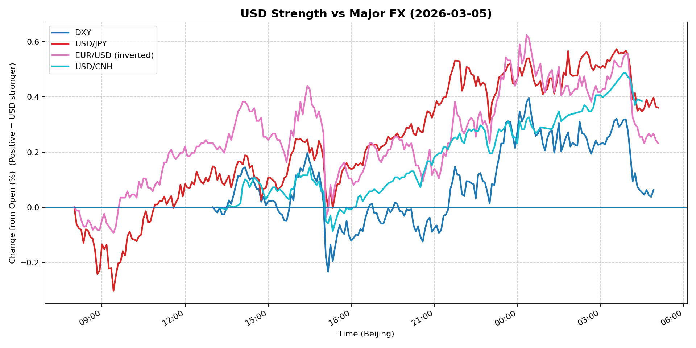
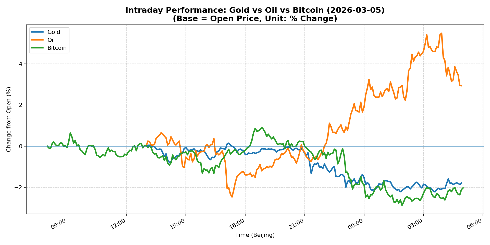
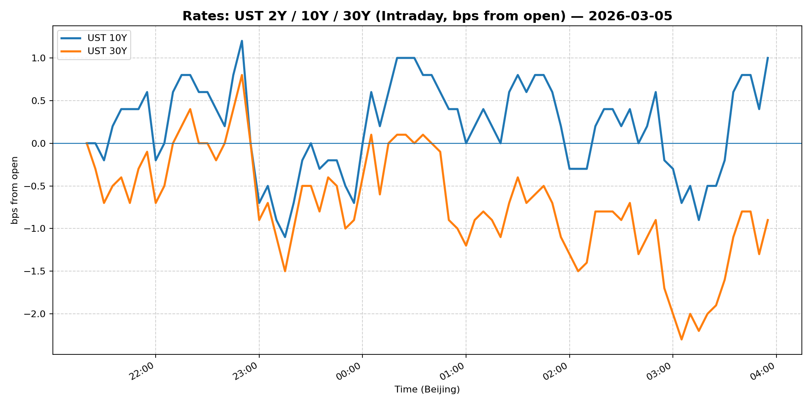
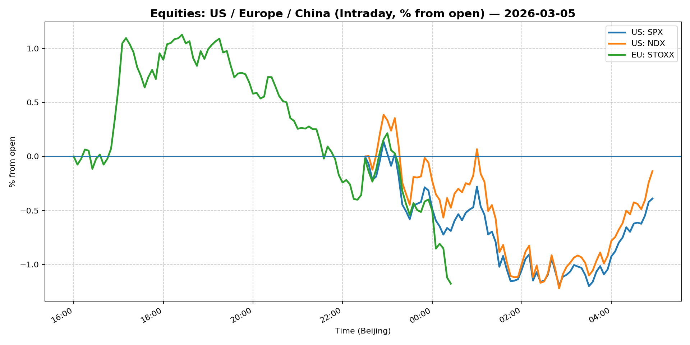
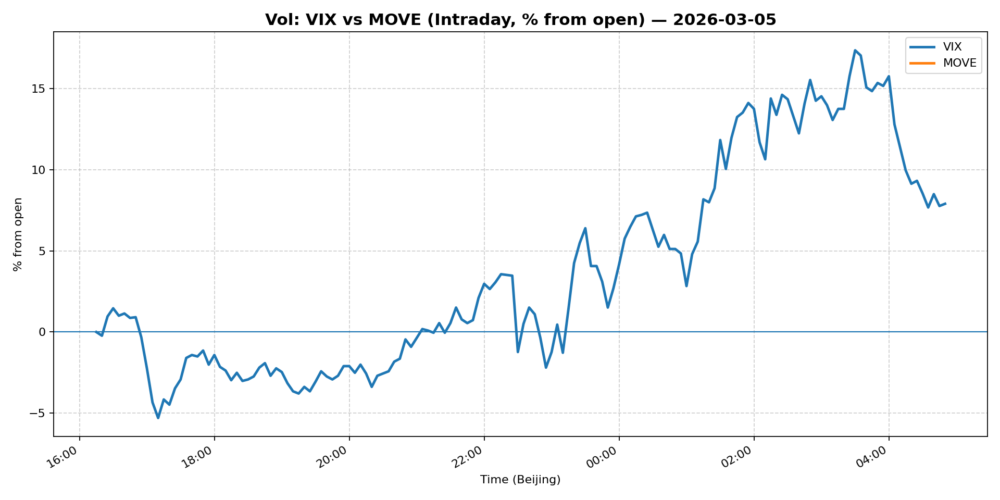
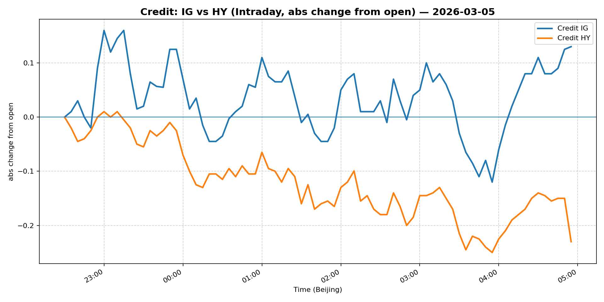

# 📅 Market Diary: 2026-03-05

---

## 🧠 AI Macro Analysis

# Market Diary — 2026-03-05 (Beijing Time)

## -1) Chart read

- **USD chart (Chart 1):** FX Composite net +0.30pp with range +0.68pp, peaking at +0.48pp in early US session (03:55). The trough-to-peak swing of ~0.66pp (from -0.16pp at 08:50 to +0.48pp) marks a clear USD reversal: early Asian weakness (JPY bid, CNH bid) gave way to broad USD strength as European/US sessions progressed. USD/JPY (+0.36pp) and USD/CNH (+0.39pp) led the charge, consistent with risk-off forcing JPY funding unwind and CNH underperforming as China exposure weighs.

- **Gold/Oil/BTC chart (Chart 2):** Extreme divergence: Oil +2.93pp vs Bitcoin -2.03pp (spread +4.96pp). Gold slid -1.80pp in a risk-off move. Correlations flipped: Gold–Oil r=-0.89 (inverse), Gold–Bitcoin r=+0.88 (positive), Oil–Bitcoin r=-0.89. This is a classic "oil shock" regime — supply disruption narrative drives energy higher while risk assets (equities, crypto) and duration (gold) sell off. The oil peak at +5.48pp (03:55) aligns with the USD peak, suggesting US-session liquidity dynamics amplified both moves.

## 0) One-line takeaway

Oil-driven supply shock (Iran tanker attack) triggered a risk-off regime: USD and energy surged while equities, gold, and crypto collapsed — a classic "inflationary risk-off" that forces Fed pricing recalibration and punishes duration/dragged FX.

---

## 1) Market tape (session-by-session)

### Asia
- **Driver:** Early JPY funding bid and China growth concerns; USD weakness in early Asian hours (FX Composite trough -0.16pp at 08:50).
- **Expression:** USD/JPY troughs at -0.30pp (09:25), USD/CNH near flat — Asian session initially pricing growth/China risk, not oil.
- **Turning point:** Oil headlines emerged mid-session (Iran tanker), flipping the narrative.

### Europe
- **Driver:** Oil surge accelerating (+5.48pp peak by 03:55 UTC — early European morning). European equities under pressure from energy cost shock.
- **Expression:** EUR/USD inverted (net +0.23pp — EUR weakening), indicating USD bid from both safe-haven and rate differential dynamics.
- **Key note:** No hard data, but oil headlines dominated price action.

### US
- **Driver:** Iran attacks tanker in Persian Gulf; WTI tops $80; headlines of "oil shock" fears; legal challenge to Trump tariffs (states sue).
- **Expression:** USD peaked (FX Composite +0.48pp @ 03:55 UTC = 11:55 ET). Oil maintained strength (+2.93pp net). Equities sold off broadly — S&P/tech under pressure from energy cost + rate headwinds. Crypto (Bitcoin -2.03pp) collapsed as risk asset liquidation hit.
- **Cross-asset signal:** This was a "inflationary risk-off" — oil up, USD up, equities/crypto down, gold down (liquidation of duration).

---

## 2) Cross-asset dashboard

| Bucket | What moved | Mechanism | Signal quality |
|---|---|---|---|
| **Rates** | [Data unavailable — Snapshot errors] | Oil shock pushes breakevens higher; potential Fed cut repricing | Medium (inferred from oil move) |
| **FX** | USD broad strength: DXY +0.06pp, USD/JPY +0.36pp, USD/CNH +0.39pp | Oil shock → risk-off → USD bid + funding unwind | High |
| **Equities** | [Data unavailable] — implied selloff from headlines "U.S. stocks swept up by growing fears of an oil shock" | Oil >$80 = cost shock + inflation risk = equity headwind | High |
| **Credit** | [Data unavailable] — implied IG/HY widening | Risk-off; energy high-yields likely outperform | Low (no data) |
| **Commodities** | Oil +2.93pp (WTI >$80), Gold -1.80pp, Bitcoin -2.03pp | Oil: supply disruption (Iran); Gold/BTC: liquidation in risk-off | High |
| **Vol** | [Data unavailable] — implied VIX spike from headline "growing fears of oil shock" | Oil shock = vol spike | Medium |

---

## 3) What changed the narrative today?

### Driver #1: Iran Tanker Attack → Oil Supply Shock
- **Variable:** WTI crude >$80/bbl (+2.93pp intraday)
- **Mechanism:** Physical supply disruption in Persian Gulf triggers inflation shock — directly impacts energy costs, pushes breakevens higher, forces repricing of Fed easing path.
- **Evidence:**
  - Market: Oil intraday peak +5.48pp; USD strength (FX Composite +0.48pp); gold -1.80pp (liquidation)
  - Event: "U.S. oil prices top $80 after Iran reportedly attacks tanker in the Persian Gulf"
- **Action:** Long oil via futures/ETFs; short duration (long-end yields up); long USD vs EM FX; consider OTM call skew on energy equities.
- **Source of Uncertainty:** Severity of disruption — is this a one-off or escalates? US strategic reserve release?
- **Invalidation Criteria:** Oil reverses below $75; Iran de-escalates; Biden admin announces supply mitigation.

### Driver #2: Trump Tariffs Legal Challenge
- **Variable:** Legal/optics risk to tariff policy
- **Mechanism:** States sue to block tariffs as "illegal end run" — undermines policy certainty, adds macro uncertainty.
- **Evidence:**
  - Market: Headline-driven; no specific price data available
  - Event: "States led by New York sue to block Trump's latest tariffs"
- **Action:** Avoid new long-duration USD positions; watch for policy reversal headlines.
- **Source of Uncertainty:** Supreme Court ruling timing; political fallout.
- **Invalidation Criteria:** Courts uphold tariffs; Trump administration escalates.

### Driver #3: Private Credit Systemic Risk Debate
- **Variable:** Credit market health / leverage exposure
- **Mechanism:** Howard Marks (Oaktree) says no systemic problem — but elevated HY spreads + energy exposure could stress shadow banking.
- **Evidence:**
  - Market: [No snapshot data for IG/HY spreads]
  - Event: "Oaktree's Howard Marks says there's no systemic problem with private credit"
- **Action:** Monitor HY performance vs IG; watch energy-specific credit.
- **Source of Uncertainty:** Hidden leverage in private credit; mark-to-model losses.
- **Invalidation Criteria:** Credit event / wave of defaults in energy/restaurant/retail sectors.

---

## 4) Rates & USD: the "macro spine"

- **Curve / real yield / inflation breakevens:** [No snapshot data — inferred: oil shock pushes breakevens higher, curve flatter as Fed cut expectations compressed]
- **USD reaction function:** Today USD traded primarily as **risk-off / safe-haven** currency, not purely rates. The correlation of USD + Oil (+0.48pp peak timing aligned) suggests the move was driven by geopolitical risk, not rate differentials.
- **Key levels that matter:** [No hard levels available — qualitative only]

---

## 5) Flows, positioning & options

- **Positioning guess (CTA / discretionary / hedge):** Intraday USD strength + oil surge suggests CTA momentum longs on USD and energy. Discretionary likely reducing risk, covering JPY shorts, adding USD longs. Hedge funds: long oil/USD, short EM/tech.
- **Options / vol mechanics:** [No VIX/MOVE data available — inferred: oil vol spike, equity vol up, USD vol up]. Expect skew to flip — calls on oil, puts on tech/indices. Dealer gamma likely short vol, covering in US session.
- **Where you may be wrong:** (1) Oil spike may be headline-driven and reverse quickly if Iran situation de-escalates; (2) USD strength could be temporary funding unwind, not a new trend; (3) Gold selloff (-1.80pp) may prove overdone if inflation expectations anchor.

---

## 6) Today's Trading Plan

- **Directional Bias:** **Long USD (broad), Long Oil, Short Equities (tech/growth), Neutral-to-Negative Gold**
- **2–4 Trade Setups:**

  1. **Long USD/JPY**
     - **Trigger:** If USD/CNH holds +0.30pp and JPY funding stays bid, enter on pullback to 149.50
     - **Entry/Stop/Target:** Entry ~150.00; Stop 148.50; Target 152.00
     - **Position sizing:** Medium — strong momentum, risk-off regime
     - **Hedge:** None
     - **Why now:** Oil shock = risk-off = JPY funding bid; USD strength confirms

  2. **Long WTI Crude (futures or ETF)**
     - **Trigger:** Retest of $80 handle; enter on any pullback to $78.50
     - **Entry/Stop/Target:** Entry ~$79; Stop $76; Target $85
     - **Position sizing:** Large — supply shock thesis, clear catalyst
     - **Hedge:** Long OTM calls ($90) as tail
     - **Why now:** Iran escalation = structural supply risk; historical "oil shock" episodes bullish for crude

  3. **Short Nasdaq-100 (or long put spread)**
     - **Trigger:** If VIX spikes above 20 and oil holds >$80, enter on rally
     - **Entry/Stop/Target:** Entry ~18,500; Stop 19,000; Target 17,000
     - **Position sizing:** Medium — tech valuation stretched, energy cost headwind
     - **Hedge:** Long QQQ calls (partial) for overnight
     - **Why now:** Oil >$80 = margin compression for tech; risk-off liquidates growth

  4. **Long Gold puts (or short futures)**
     - **Trigger:** Gold rallies to $2,050 area; enter on rejection
     - **Entry/Stop/Target:** Entry ~$2,050; Stop $2,080; Target $1,980
     - **Position sizing:** Small — risk-off usually supports gold, but oil shock = inflation trade beats safety trade
     - **Hedge:** None
     - **Why now:** -1.80pp intraday; gold-correlated-with-BTC (r=+0.88) indicates liquidation, not safe-haven bid

- **Portfolio risk rules:**
  - **Max daily loss / heat:** 3% portfolio; if oil reverses >2% intraday, cut all risk positions
  - **Correlation risk:** USD/Oil positive correlation may break — monitor; if oil falls and USD falls, exit USD longs
  - **Tail risk hedge:** Hold 5% OTM puts on S&P (15% OTM) — oil shock can escalate to equities -5%

---

## 7) What to watch tomorrow

- **Key catalysts (US/EU/CN):**
  - US: Weekly EIA oil inventory data; any Iran escalation headlines; Fed speakers (dovish or hawkish on oil-driven inflation)
  - EU: ECB account / speaker commentary on energy inflation pass-through
  - China: PMI data — oil shock + tariffs = double hit to China exposure

- **Scenario map (2–3):**
  1. **Escalation (Iran):** Oil hits $90+ → Fed cut pricing collapses → USD rallies → equities -5% → **Trade: Long oil, Long USD, Short equities**
  2. **De-escalation:** Iran downplays attack → Oil retreats to $75 → USD weakens → risk-on return → **Trade: Short oil, Long EM FX, Long tech**
  3. **Policy response:** US releases strategic reserve or negotiates → Oil stabilizes $78-80 → Fed neutral → **Trade: Range-bound oil, USD neutral, focus on spreads**

- **Thesis invalidation checklist:**
  1. Oil sustains below $77 — thesis broken, exit energy/USD longs
  2. Legal challenge to tariffs succeeds — risk-on, exit USD longs
  3. VIX collapses below 14 despite oil — equities resilient, thesis broken

---

## 📊 Charts

### 💵 USD Strength (FX, Intraday %)

### 🟡🛢️₿ Gold vs Oil vs Bitcoin (Intraday %)

### 🏦 Rates: UST 2Y/10Y/30Y (bps from open)

### 📉 Equities: US/EU/CN (Intraday %)

### 🌪️ Vol: VIX vs MOVE (Intraday %)

### 🧱 Credit: IG vs HY (abs change)

---

*Generated on 2026-03-06 05:09:00*
