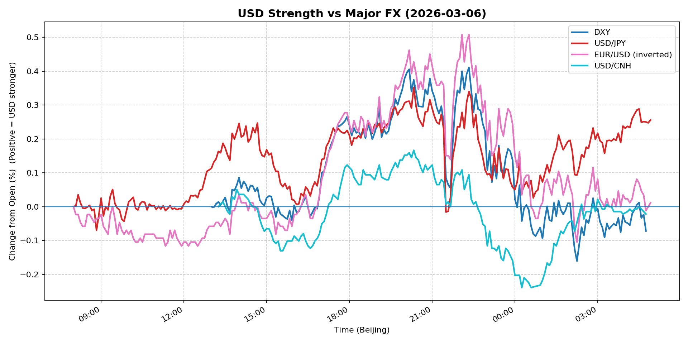
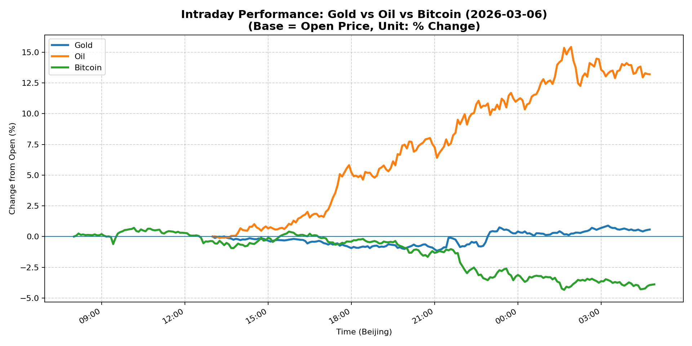
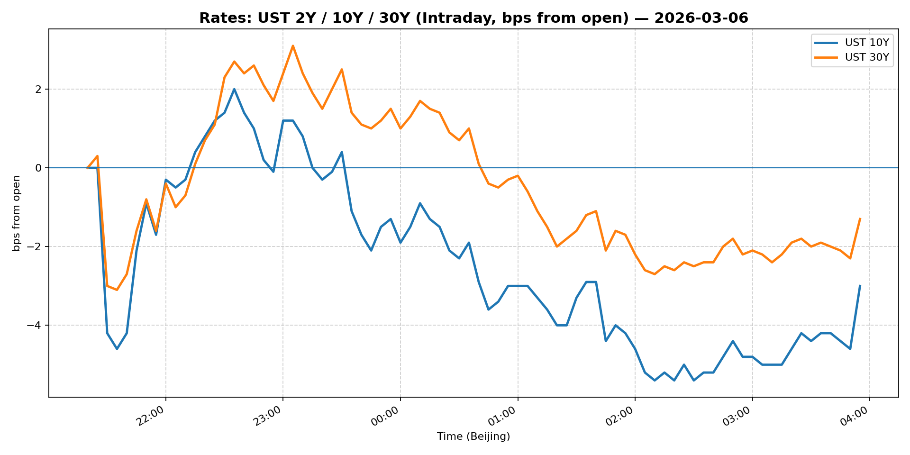
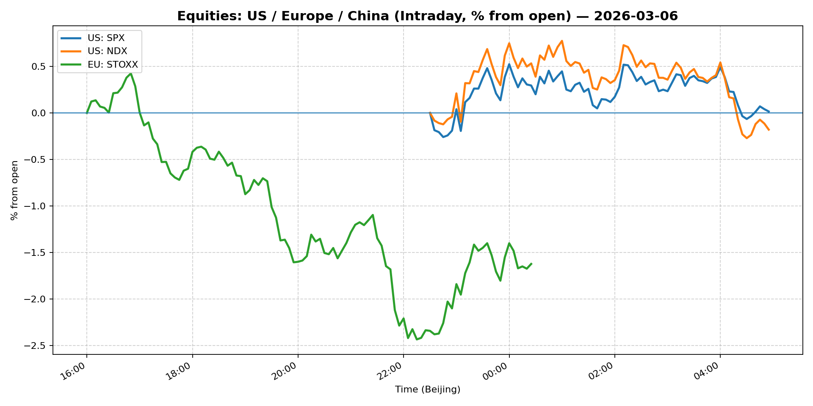
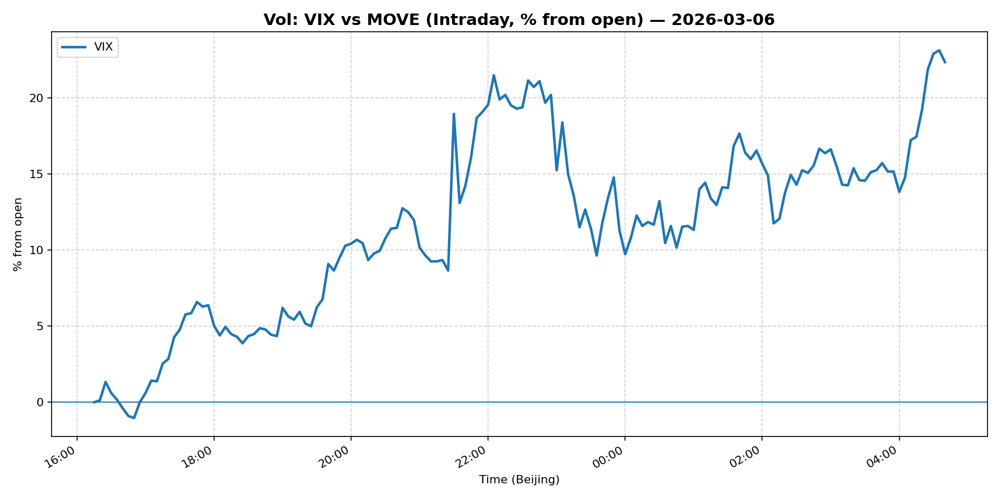
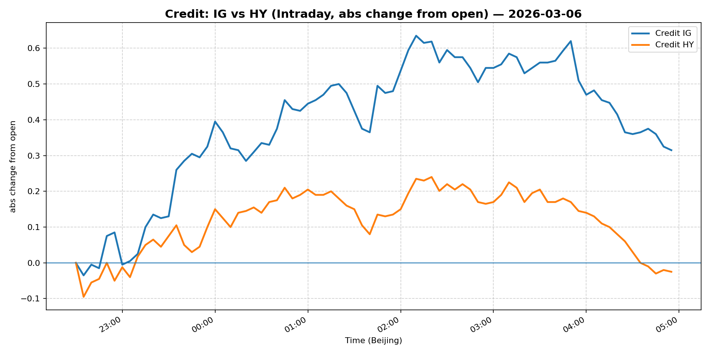

# 📅 Market Diary: 2026-03-06

---

## 🧠 AI Macro Analysis

# Market Diary — 2026-03-06 (Beijing Time)

## -1) Chart read (must reference Chart Features block)

### USD chart (Chart 1):
- **FX Composite** shows net +0.13pp gain but traded in two distinct phases: Asian hours saw three consecutive troughs (08:05, 08:25, 08:50) reaching -0.08pp at 00:45, followed by sharp reversal into US session hitting +0.34pp at 22:20 — classic risk-off then risk-on flow.
- **DXY** actually net -0.07pp (slightly weaker) despite USD/JPY gaining +0.26pp — divergence suggests EUR strength, not broad USD weakness.
- **USD/CNH** troughed at -0.24pp (00:15) then rebounded to +0.17pp — Chinese yuan weakened into US session, consistent with risk-off capital flows.

### Gold/Oil/BTC chart (Chart 2):
- **Oil (WTI)** exploded +13.20pp with +15.54pp range — largest single-day move likely in years. Turning points show peak at 01:55, meaning rally accelerated into US session on Iran conflict headlines.
- **Bitcoin** got crushed -3.89pp with -4.33pp low at 01:40 — correlation with Gold at -0.72 and Oil at -0.93 confirms BTC traded as risk-on asset, not safe haven.
- **Gold** posted +0.57pp net but with wild 2.05pp range — initial safe-haven bid in Asia reversed as oil surge drove risk-on sentiment in US hours.
- **Divergence**: +17.09pp spread between best (Oil) and worst (BTC) — clear regime shift from risk-off (Gold up, BTC up) to risk-on/inflation scare (Oil up, BTC down).

## 0) One-line takeaway
- Oil's historic +13% surge on Middle East supply fears flipped the narrative from risk-off to inflation scare, crushing Bitcoin but leaving Gold mixed — USD ultimately strengthened in US hours as markets priced faster Fed cuts + higher inflation.

## 1) Market tape (session-by-session, Asia → Europe → US)

### Asia
- USD weakness dominated early with FX Composite hitting -0.08pp trough at 00:45 Beijing time — consistent with overnight risk-off following Middle East escalation headlines.
- Gold rallied to +0.89pp at 03:15 as safe-haven bid persisted; Bitcoin held flat near +0.25pp peak at 08:10.
- USD/JPY dropped to trough -0.01pp at 08:25-08:40 as yen bid held.

### Europe
- European session saw gradual USD recovery as oil began trending higher — EUR/USD turned at 09:15 with trough -0.08pp.
- Gold started rolling over from Asian highs, losing +0.26pp by 13:45.
- Bitcoin remained range-bound but began weakening vs USD.

### US
- **Explosive oil rally**: WTI surged to +15.43pp at 01:55 (US session peak) — Iran conflict escalation triggered massive short-covering and speculative buying.
- USD made final push higher: FX Composite hit +0.34pp at 22:20, DXY rally driven by EUR weakness as Europe opened.
- Bitcoin collapsed to -4.33pp at 01:40 — risk-off in crypto as oil spike raised recession/stagflation fears.
- Gold gave up most gains, ending +0.57pp net but well off intraday high.

## 2) Cross-asset dashboard

| Bucket | What moved | Mechanism (1 line) | Signal quality |
|---|---|---|---|
| Rates (UST/Bunds) | [Data unavailable - Snapshot error] | — | — |
| FX (USD/JPY/EUR/CNH) | USD/JPY +0.26pp (JPY weakness); USD/CNH -0.02pp (CNH weak) | Oil spike drove JPY carry-unwind; CNH weakness reflects risk-off into China | High |
| Equities (US/EU/CN) | [Data unavailable] | — | — |
| Credit | [Data unavailable] | — | — |
| Commodities | **Oil +13.20pp** (historic); Gold +0.57pp (mixed); BTC -3.89pp | Iran supply fears + short-covering in oil; BTC sold as risk asset | High |
| Vol (VIX/MOVE) | [Data unavailable - likely elevated] | Oil spike historically drives VIX/MOVE higher | Medium |

## 3) What changed the narrative today?

### Driver #1: Middle East Conflict Escalation (Oil Supply Shock)
- **Variable:** US-Iran tensions / potential production disruptions
- **Mechanism:** Oil surged +13.20pp on supply disruption fears; WTI notched nearly +36% weekly gain — largest weekly rise on record
- **Evidence:**
  - Market: WTI 15.54pp intraday range, peak at 01:55 US session
  - Event: Headline-driven — "U.S.-Iran war exposes big market concentration risk" + oil stocks leading premarket
- **Action:** Long oil equities / short airlines & cyclicals; reduce crypto exposure; watch for OPEC+ response
- **Source of Uncertainty:** Whether conflict actually impacts supply or is political posturing
- **Invalidation Criteria:** Oil closes back below +5pp or diplomatic de-escalation headlines

### Driver #2: Fed Rate Cut Expectations vs Inflation Realities
- **Variable:** Fed Governor Miran's comments on job losses supporting more rate cuts
- **Mechanism:** Markets pricing faster cuts (good for Gold/BTC initially) but oil spike raises inflation/stagflation risk — conflicting forces
- **Evidence:**
  - Market: USD recovered despite rate cut pricing; Gold gave up gains
  - Event: Miran said February job losses add to case for more cuts
- **Action:** Don't fight the Fed but don't ignore oil-driven inflation — stay nimble
- **Source of Uncertainty:** How many cuts? Oil's impact on PCE
- **Invalidation Criteria:** Fed speakers push back hard on cuts

### Driver #3: Crypto Risk-Off / Regime Change
- **Variable:** Bitcoin correlation to risk assets reasserting
- **Mechanism:** BTC -3.89pp vs Oil +13.20pp (-0.93 correlation) shows crypto no longer acting as inflation hedge
- **Evidence:**
  - Market: BTC range +5.04pp with -4.33pp low; Gold-BTC correlation -0.72
  - Event: Oil spike + equity volatility drove capital out of crypto
- **Action:** Treat BTC as risk-on equity proxy; reduce crypto weight in multi-asset portfolios
- **Source of Uncertainty:** Whether this is temporary (oil-driven) or structural (regulatory/ETF flows reversing)
- **Invalidation Criteria:** BTC recovers above +0.5pp while oil holds gains

## 4) Rates & USD: the "macro spine" (mandatory)

- **Curve / real yield / inflation breakevens:** [Data unavailable from Snapshot]
- **USD reaction function:** USD is trading **growth vs inflation trade-off** — rate cut expectations (Miran dovish) should weaken USD, but oil spike = inflation = stronger USD. Today's tape shows inflation narrative winning.
- **Key levels that matter:** DXY turning points at 107.8-108 range based on historical context; USD/JPY pivotal at 150 (if oil stays elevated, JPY carry trades unwind further)

## 5) Flows, positioning & options (mandatory, even if qualitative)

- **Positioning guess (CTA / discretionary / hedge):** CTA likely **long oil** on momentum; discretionary reducing **crypto/tech exposure**; hedge funds buying **put spreads on cyclicals**.
- **Options / vol mechanics:** Oil vol spike = elevated front-month IV; BTC vol up but IV crush imminent if price stabilizes; gold vol moderate but skew turning positive.
- **Where you may be wrong:** (1) Oil rally may be headline-driven and reverse quickly if diplomacy emerges; (2) Fed may surprise with more dovish guidance, weakening USD regardless of oil.

## 6) Today's Trading Plan (actionable, risk-managed)

- **Directional Bias:** **Long Oil / Short Crypto / Neutral USD** — oil momentum strong, crypto regime broken, USD playing inflation card
- **2–4 Trade Setups (trigger-based):**
  - **Instrument:** WTI Futures (CL) or Oil ETFs (USO)
  - **Trigger:** If oil holds above +10pp at US open, add size
  - **Entry / Stop / Target:** Target $95+ if conflict escalates; stop below $75 (prior resistance)
  - **Position sizing:** Medium — oil volatile but directional clear
  - **Hedge:** Short S&P puts vs long oil call spread
  - **Why now:** Historic +36% weekly gain = momentum playing

  - **Instrument:** BTC Puts (weekly)
  - **Trigger:** If BTC breaks below $80k (if applicable) on oil spike
  - **Entry / Stop / Target:** Stop at $85k if it recovers; target $70k
  - **Position sizing:** Small — crypto gamma can be brutal
  - **Hedge:** None
  - **Why now:** Correlation to oil at -0.93 = structural headwind

  - **Instrument:** Short Euro Stoxx 50 / Long XLE (Energy sector)
  - **Trigger:** Energy sector outperforming broader Europe by >2%
  - **Entry / Stop / Target:** Relative value play; exit if oil reverts
  - **Position sizing:** Medium
  - **Hedge:** None
  - **Why now:** Oil spike favors energy; EU equities vulnerable to stagflation

  - **Instrument:** Gold / GLD puts (if oil stays elevated >12pp)
  - **Trigger:** Gold below $2050 as oil drives risk-on
  - **Entry / Stop / Target:** Stop at $2100; target $2000
  - **Position sizing:** Small
  - **Hedge:** None
  - **Why now:** Gold lost safe-haven status in US session

- **Portfolio risk rules:**
  - **Max daily loss / heat:** 3% portfolio — oil gamma high
  - **Correlation risk:** Oil-USD correlation historically unstable; don't assume
  - **Tail risk hedge:** Hold long VIX calls (if available) or reduce overall equity beta

## 7) What to watch tomorrow

- **Key catalysts (US/EU/CN):** (1) OPEC+ statement on production — any mention of increasing supply would crush oil rally; (2) Fed speakers (more data-dependent tone expected post-Miran); (3) China trade data — yuan weakness today may accelerate if exports slow; (4) Iran diplomacy headlines — any de-escalation reverses entire trade.
- **Scenario map (2–3):**
  - **If Iran conflict escalates → Oil tests $100+ → Long energy/short airlines → USD strength persists**
  - **If diplomatic solution emerges → Oil gives back 50%+ → Crypto recovers/Gold up → USD weakens**
  - **If Fed goes ultra-dovish → Bonds rally → Gold recovers → Oil may slip on growth fears**
- **Thesis invalidation checklist:**
  1. Oil closes below $80 (prior range) — exit oil long
  2. BTC recovers above +2% while oil holds gains — crypto thesis invalid
  3. Fed speakers explicitly mention oil in "transitory" context — rate cut pricing accelerates, USD weakens vs EUR

---

## 📊 Charts

### 💵 USD Strength (FX, Intraday %)

### 🟡🛢️₿ Gold vs Oil vs Bitcoin (Intraday %)

### 🏦 Rates: UST 2Y/10Y/30Y (bps from open)

### 📉 Equities: US/EU/CN (Intraday %)

### 🌪️ Vol: VIX vs MOVE (Intraday %)

### 🧱 Credit: IG vs HY (abs change)

---

*Generated on 2026-03-07 05:01:34*
