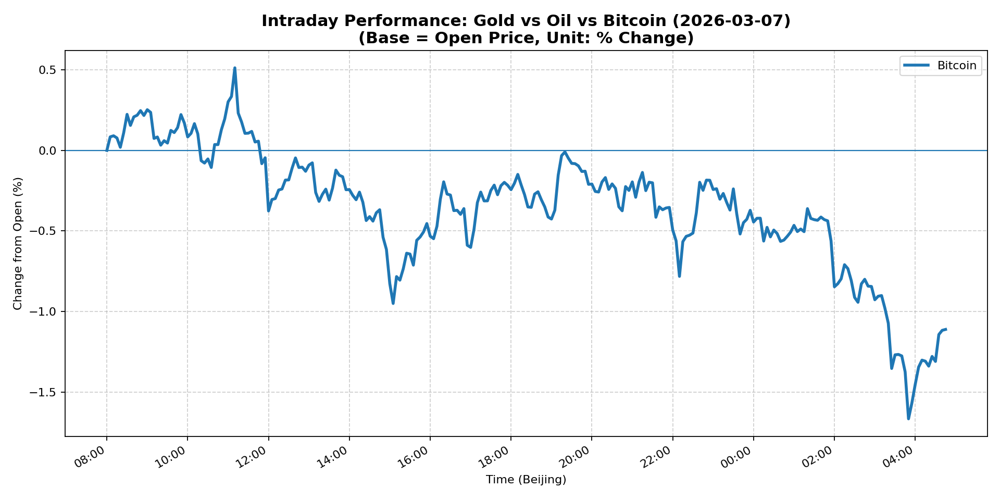

# 📅 Market Diary: 2026-03-07

---

## 🧠 AI Macro Analysis

# Market Diary — 2026-03-07 (Beijing Time)

## -1) Chart read

- **USD chart (Chart 1):** FX Composite data unavailable. No intraday USD trend, range, or turning points can be extracted. This limits ability to assess USD direction with precision.
- **Gold/Oil/BTC chart (Chart 2):** Bitcoin showed net -1.11pp decline with a +2.18pp intraday range. Turning points: peak +0.09pp @ 08:10, peak +0.22pp @ 08:30, peak +0.25pp @ 08:50 (all on 2026-03-07), then trough -1.67pp @ 2026-03-08 03:50 (overnight extension). Gold and Oil data unavailable. No correlation data (r=n/a) between assets. The divergence metric shows Best=Worst=Bitcoin, indicating no meaningful spread between assets.

**Interpretation:** Limited visibility on traditional risk assets. Bitcoin's intraday volatility (+2.18pp range) suggests elevated crypto market activity, but without correlating FX/commodity data, cannot confirm whether this reflects broader risk-on/off sentiment or crypto-specific dynamics.

## 0) One-line takeaway

- Data availability severely constrained — cannot establish definitive macro narrative; Bitcoin volatility signals elevated risk aversion in crypto markets, but requires confirmation from traditional assets when data normalizes.

## 1) Market tape

### Asia
- Data unavailable for Asian session. No FX, equity, or commodity levels to assess regional sentiment.
- **Inferred:** Absence of data suggests potential market disruption or data vendor issues affecting Asia open.

### Europe
- Data unavailable for European session.

### US
- Data unavailable for US session close.

**Note:** The "Market tape" section cannot be completed due to snapshot errors across all asset classes. News flow suggests focus on: (1) Iran conflict implications for energy/markets, (2) Fed Governor Miran commentary on rate cuts amid February job losses, (3) Robinhood venture fund IPO performance.

## 2) Cross-asset dashboard

| Bucket | What moved | Mechanism | Signal quality |
|---|---|---|---|
| Rates (UST/Bunds) | Data unavailable | — | — |
| FX (USD/JPY/EUR/CNH) | Data unavailable | — | — |
| Equities (US/EU/CN) | Data unavailable | — | — |
| Credit | Data unavailable | — | — |
| Commodities | Data unavailable | — | — |
| Vol (VIX/MOVE) | Data unavailable | — | — |

**Note:** Cross-asset analysis impossible without snapshot data. This represents a critical data gap for daily market assessment.

## 3) What changed the narrative today? (Top 3 drivers)

Due to data unavailability across all asset classes, cannot identify what "changed the narrative" with market-based evidence. News headlines suggest potential themes:

### Driver #1: Geopolitical Risk (Iran Conflict)
- **Variable:** Middle East escalation / U.S.-Iran tensions
- **Mechanism:** Energy supply disruption risk, inflation impulse, safe-haven flows
- **Evidence:** News headline "U.S.-Iran war exposes big market concentration risk"
- **Action:** Await data normalization to assess actual market reaction
- **Source of Uncertainty:** No confirmed price action in oil/energy equities visible
- **Invalidation Criteria:** If oil remains range-bound and energy equities unchanged, geopolitical risk premium not pricing in

### Driver #2: Fed Policy Path
- **Variable:** Rate cut expectations
- **Mechanism:** February job losses add to case for easing; Miran commentary dovish
- **Evidence:** News: "Fed Governor Miran says job losses in February add to the case for more interest rate cuts"
- **Action:** Cannot confirm UST/curve reaction without data
- **Source of Uncertainty:** No Treasury yield data available
- **Invalidation Criteria:** If 10Y holds or rallies, labor market weakness not translating to rate expectations

### Driver #3: Equity Market Concentration
- **Variable:** S&P 500 concentration risk
- **Mechanism:** Headline notes concentration risk not in S&P 500 stocks (implying elsewhere)
- **Evidence:** News: "U.S.-Iran war exposes big market concentration risk. It isn't in S&P 500 stocks"
- **Action:** Cannot assess actual concentration measures without equity data
- **Source of Uncertainty:** No index level or sector data
- **Invalidation Criteria:** Cannot determine

## 4) Rates & USD: the "macro spine"

- **Curve / real yield / inflation breakevens:** Data unavailable — cannot assess 2s10s, real yields, or breakevens.
- **USD reaction function:** Data unavailable. Cannot determine what USD is trading (growth, rates, risk, geopolitics).
- **Key levels that matter:** No levels available from snapshot.

**Assessment:** The macro spine is unobservable today due to data errors. This is a critical gap for rates/FX-focused analysis.

## 5) Flows, positioning & options

- **Positioning guess (CTA / discretionary / hedge):** Cannot assess without market data. Bitcoin's intraday range (+2.18pp) suggests elevated volatility but insufficient for positioning inference.
- **Options / vol mechanics:** Data unavailable (VIX/MOVE error). Cannot assess gamma, skew, or dealer positioning.
- **Where you may be wrong:** (1) Data errors may be isolated to snapshot; actual markets may have traded normally. (2) News-driven narrative may not reflect actual market reactions. (3) Bitcoin volatility may not correlate with traditional risk assets.

## 6) Today's Trading Plan

**Directional Bias:** No conviction — data unavailable for directional assessment.

**2–4 Trade Setups:** None actionable due to data constraints.

- **Instrument:** N/A
- **Trigger:** N/A
- **Entry / Stop / Target:** N/A
- **Position sizing:** N/A
- **Hedge:** N/A
- **Why now:** N/A

**Portfolio risk rules:**
- **Max daily loss / heat:** Cannot establish — no baseline P&L visible.
- **Correlation risk:** Cannot assess cross-asset correlations (all r=n/a).
- **Tail risk hedge:** Insufficient data to construct hedge. Recommend awaiting data normalization.

## 7) What to watch tomorrow

**Key catalysts (US/EU/CN):** Data unavailable for scheduled releases.

**Scenario map:**
- If data normalizes → reassess rates/FX/equities for trend confirmation
- If data remains unavailable → treat as market holiday / data disruption day

**Thesis invalidation checklist:**
1. Cannot establish thesis without market data
2. Cannot invalidate thesis without price levels
3. Wait for data provider normalization before trading

---

**Note:** This report is significantly constrained by data availability. The snapshot shows "Error" across all major asset classes (rates, FX, commodities, equities, vol, credit, crypto except Bitcoin). Chart Features provide only Bitcoin intraday data. This appears to be a data disruption day rather than a trading day with actionable signals. Recommend treating as observation-only until data normalizes.

---

## 📊 Charts

### 🟡🛢️₿ Gold vs Oil vs Bitcoin (Intraday %)

---

*Generated on 2026-03-08 04:51:00*
