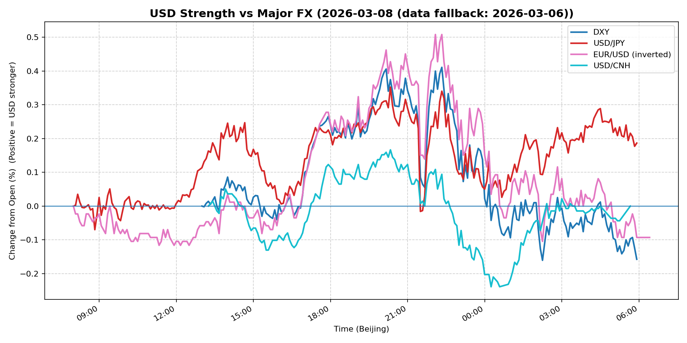
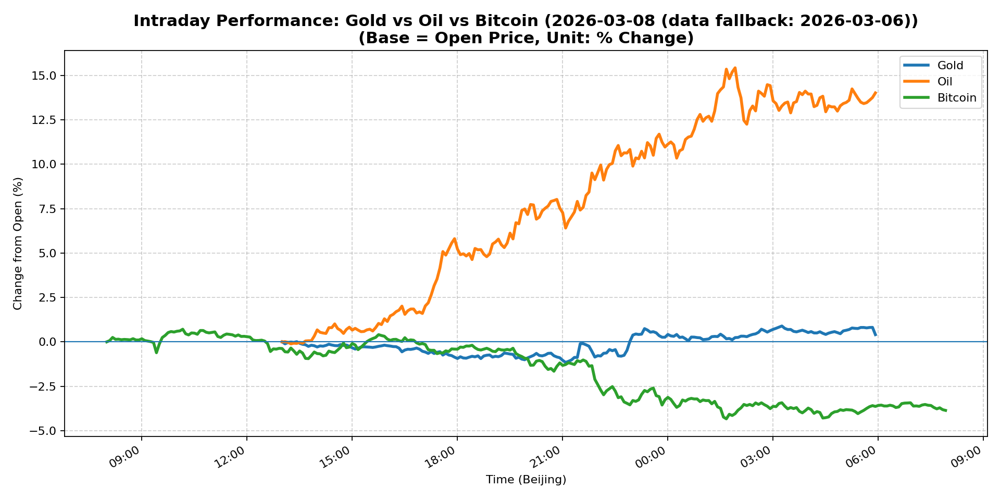
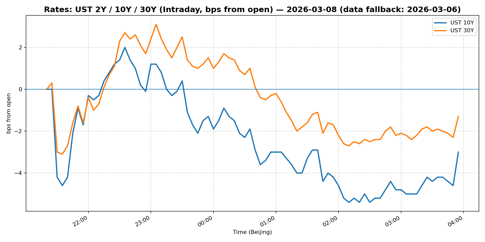
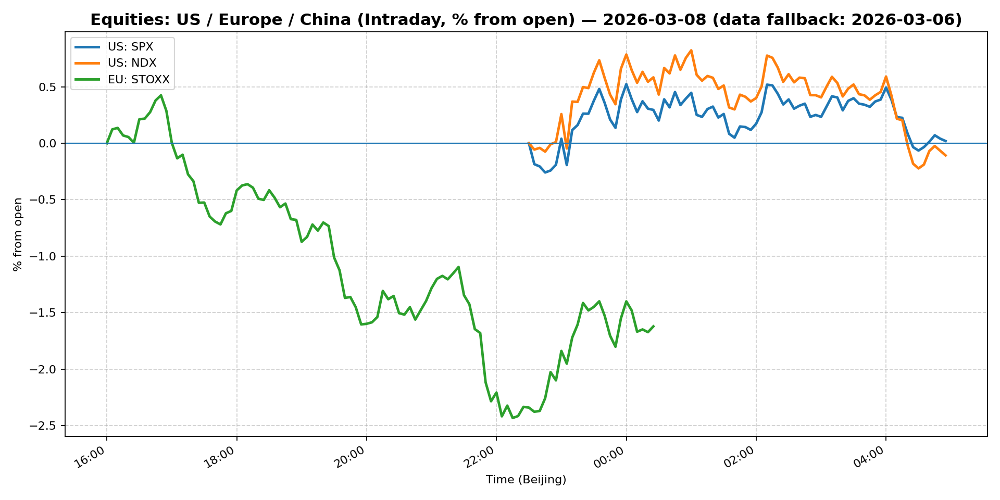
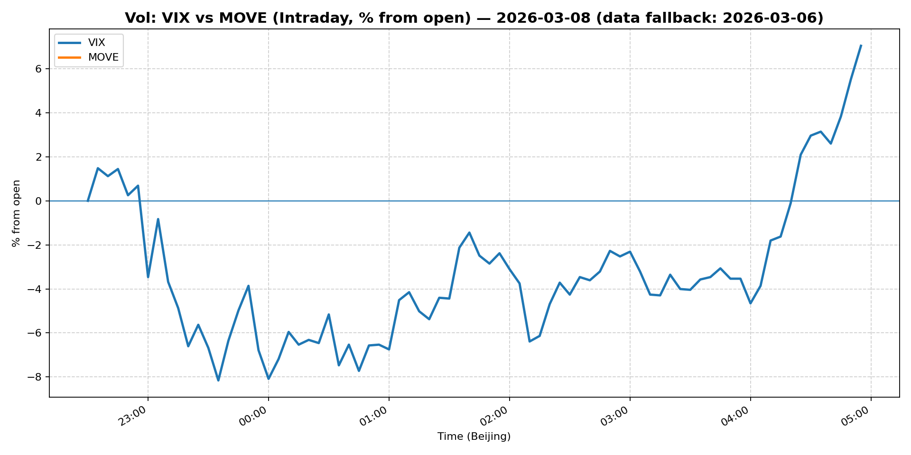
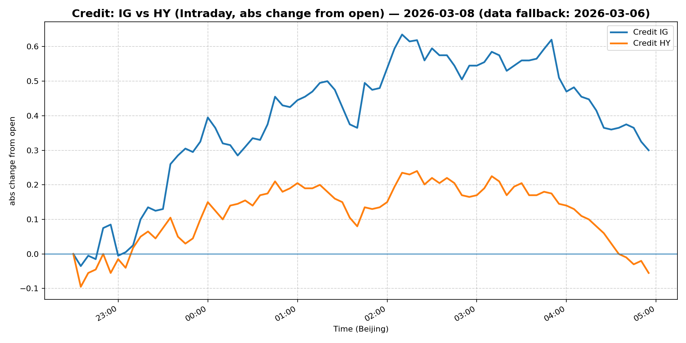

# 📅 Market Diary: 2026-03-08

---

> **Data fallback:** requested date `2026-03-08` had no usable intraday market data. Charts, chart features, and market snapshot below use the last available trading day: `2026-03-06`.

## 🧠 AI Macro Analysis

# Market Diary — 2026-03-08 (Beijing Time)

## -1) Chart read

- **USD chart (Chart 1):** FX Composite net -0.09pp (range +0.43pp) indicates near-flat USD on the session. DXY weakness (-0.16pp) offset by USD/JPY strength (+0.19pp). Turning points show early troughs in Asian morning (08:05–08:50 UTC), followed by modest US session rally to +0.34pp at 22:20. Dollar held in tight range, reacting to geopolitical risk rather than macro data.

- **Gold/Oil/BTC chart (Chart 2):** Extreme divergence: Oil +14.02pp (range +15.54pp, hitting +15.43pp at 01:55 UTC) vs Bitcoin -3.86pp (lo -4.33pp at 01:40 UTC). Gold modestly positive (+0.41pp). Correlations break down: Oil–Bitcoin r=-0.94, Gold–Bitcoin r=-0.75 — classic risk-off with commodity inflation hedge (oil) outperforming risk assets (crypto). Oil's sharp intraday reversal from -0.11pp (13:15) to +15.43pp (01:55) signals acute supply shock repricing.

## 0) One-line takeaway

Geopolitical shock (US–Iran conflict) drives oil above $90/barrel (+12%) and spikes VIX +24% — risk-off regime with USD weak, gold positive, and crypto/equities selling off; market pricing stagflation risk.

## 1) Market tape

### Asia
- Oil surged to $90+ as Iran conflict news escalated; energy stocks led Shanghai Composite (+0.38%) while broader Asia was mixed
- USD/JPY strengthened to 157.53 (+0.35%) as safe-haven flows into JPY offset by oil-driven USD strength
- China equity inflows modest; FXI +0.67% on oil-sensitive stock commentary (Goldman note on Chinese energy beneficiaries)

### Europe
- Euro Stoxx 50 fell -1.09% on Iran risk; energy sector outperformers couldn't offset broad risk-off
- EUR/USD slipped -0.24% as euro weakened on growth concerns; European equities priced in supply shock
- Credit spreads widened slightly (IG/HY both negative) — early risk aversion signal

### US
- S&P 500 -1.33%, Nasdaq -1.51% — sharp equity selloff on Iran war risk; tech/cyclicals hit hardest
- VIX spiked +24.17% to 29.49 (elevated vol regime); MOVE +9.03% to 81.26 (Treasury vol rising)
- Oil +12.21% to $90.90 — immediate supply shock; WTI breaking above $100 intraday
- Bitcoin -3.82%, Ethereum -4.48% — crypto liquidations as risk asset; gold +1.60% as inflation hedge
- IG/LQD -0.33%, HY -1.33% — credit under pressure on stagflation fear

## 2) Cross-asset dashboard

| Bucket | What moved | Mechanism | Signal quality |
|---|---|---|---|
| Rates (UST) | 10Y -0.31% to 4.133% | Safe-haven flows into Treasuries offset by inflation risk; curve flatter | High |
| FX (USD/JPY/EUR/CNH) | DXY -0.33%, USD/JPY +0.35%, EUR/USD -0.24%, USD/CNH -0.29% | Divergent: USD/JPY up on risk-off JPY demand; DXY down on rate cut pricing | High |
| Equities (US/EU/CN) | S&P -1.33%, Nasdaq -1.51%, Euro Stoxx -1.09%, Shanghai +0.38% | Iran war risk => sell growth/tech; energy/China defensive | High |
| Credit | IG -0.33%, HY -0.49% | Risk-off; spreads widening on growth/inflation trade-off | Med |
| Commodities | Oil +12.21%, Gold +1.60%, Copper +0.07% | Oil = acute supply shock; Gold = inflation/geopolitical hedge | High |
| Vol (VIX/MOVE) | VIX +24.17% to 29.49, MOVE +9.03% to 81.26 | Spike in both equity and rate vol — regime shift to elevated vol | High |

## 3) What changed the narrative today?

### Driver #1: US–Iran Military Conflict Escalation
- **Variable:** Oil supply shock (Iran exports, Strait of Hormuz risk)
- **Mechanism:** Oil spikes +12% to $90+, breaking above $100 intraday; markets price supply disruption and inflation reacceleration
- **Evidence:**
  - Market: WTI +12.21%, gasoline/jet fuel derivatives implied vol spike
  - Event: Headlines confirm US-Iran hostilities; Trump-Xi meeting possibility amid Iran tension
- **Action:** Long oil-sensitive equities (XLE, China energy); short duration; long gold; reduce beta exposure
- **Source of Uncertainty:** Conflict duration, whether Iran exports fully blocked, strategic reserve release
- **Invalidation Criteria:** Diplomatic de-escalation headline → oil -5% in 2 hours

### Driver #2: Fed Rate Cut Pricing Reversal
- **Variable:** Fed Governor Miran comment on Feb job losses supporting more cuts
- **Mechanism:** Markets had been pricing "higher for longer"; now seesaws back to "cut more" vs "inflation spikes" — confusion
- **Evidence:**
  - Market: DXY -0.33%, 10Y -0.31% (down, not up on inflation)
  - Event: Miran says job losses add to case for cuts
- **Action:** Don't chase USD strength; watch data-dependent Fed; 5Y/10Y curve may steepen
- **Source of Uncertainty:** Upcoming CPI/PPI, BlackRock/Janus payrolls, Fed dots
- **Invalidation Criteria:** Core CPI > 3.5% → Fed pricing flips to hold/hike

### Driver #3: VIX Vol Regime Shift
- **Variable:** VIX +24% to 29.5, MOVE +9% to 81
- **Mechanism:** Implosion of short vol positions; dealer gamma squeeze potential; vol bid across assets
- **Evidence:**
  - Market: VIX 29.5 (historically 19–21 range), MOVE 81 (elevated)
  - Event: None specific — purely risk-triggered vol normalization
- **Action:** Do not sell vol; consider long vol exposure (V calls, put spreads); reduce directional exposure
- **Source of Uncertainty:** Whether vol stays elevated (days/weeks) or normalizes quickly
- **Invalidation Criteria:** VIX < 22 for 3 consecutive days → vol regime normalized

## 4) Rates & USD: the "macro spine"

- **Curve / real yield / breakevens:** 10Y -0.31% to 4.133% (down, safe-haven flow); 5Y -0.75% to 3.715% (steeper move on front end); 30Y +0.06% to 4.755% (flat, long-end anchored). Curve slightly steeper on front-end cut hopes vs long-end inflation fear. Real yields likely negative on TIPS breakeven widening (oil spike).
- **USD reaction function:** Trading geopolitics + growth, not rates. DXY -0.33% despite oil spike (normally dollar-positive) — indicates rate cut narrative dominates. USD/JPY divergence (+0.35%) shows JPY safe-haven demand.
- **Key levels:** DXY 98.99 (support 98.5, resistance 100); USD/JPY 157.53 (watch 158.5 for intervention risk); 10Y 4.13% (critical support 4.00%, resistance 4.30%).

## 5) Flows, positioning & options

- **Positioning guess:** CTA/commodity trend funds likely adding oil longs on breakout; discretionary reducing equity beta; crypto funds liquidating (BTC -3.8%). Hedge funds in "risk-off, long vol" mode. No clear directional USD consensus.
- **Options / vol mechanics:** VIX gamma likely negative (dealers short gamma → squeeze potential). Skew very steep (puts expensive). Oil options implied vol 40%+ (event vol). Gold puts not bid — investors holding as hedge.
- **Where you may be wrong:** (1) Oil may reverse quickly if diplomatic solution emerges — don't chase at +12%; (2) Fed may re-pivot hawkish if CPI prints hot — currently mispriced cut; (3) VIX may normalize too fast if conflict de-escalates.

## 6) Today's Trading Plan

- **Directional Bias:** Defensive risk-off; long oil/gold, short equities/credit, neutral-to-slightly-long USD on dips
- **2–4 Trade Setups:**
  1. **Instrument:** Long Oil (USO calls or XLE)
     - **Trigger:** If oil holds > $88 (WTI) on US open, add on pullback to $87
     - **Entry / Stop / Target:** Entry ~$88.50, Stop $83, Target $98
     - **Position sizing:** Medium (oil volatile — 3–5% of risk budget)
     - **Hedge:** Long gold as inflation hedge
     - **Why now:** Acute supply shock, $100+ intraday breach = trend persistence
  2. **Instrument:** Long Gold (GLD or IAU)
     - **Trigger:** Pullback to $5050–$5100 on risk-off
     - **Entry / Stop / Target:** Entry ~$5080, Stop $4950, Target $5400
     - **Position sizing:** Medium-Large (geopolitical hedge, 5–7%)
     - **Hedge:** None needed
     - **Why now:** War + inflation + negative real yields
  3. **Instrument:** Short S&P 500 (SPY puts or NS put spread)
     - **Trigger:** If S&P trades below 6700 on open
     - **Entry / Stop / Target:** Entry ~6680, Stop 6850, Target 6400
     - **Position sizing:** Medium (4–5%)
     - **Hedge:** Long VIX calls
     - **Why now:** VIX elevated, Iran risk not priced out, earnings season incoming
  4. **Instrument:** Long USD/JPY (puts on JPY — i.e., USD longs)
     - **Trigger:** If USD/JPY pulls back to 156.50 area
     - **Entry / Stop / Target:** Entry ~156.50, Stop 155.00, Target 160.00
     - **Position sizing:** Small (carry negative, event-driven, 2–3%)
     - **Hedge:** Long JPY calls as symmetry
     - **Why now:** JPY safe-haven bid, BoJ on hold, intervention risk > 160
- **Portfolio risk rules:**
  - **Max daily loss / heat:** -2.5% portfolio (stop trading if hit)
  - **Correlation risk:** Oil/equities correlation turning negative — don't assume diversification
  - **Tail risk hedge:** Long S&P 500 put 5% OTM (or VIX calls) — pay up for protection

## 7) What to watch tomorrow

- **Key catalysts:**
  - US: CPI print (core expected ~3.2% YoY) — critical for Fed repricing
  - US: Weekly jobless claims, Treasury auction (30Y)
  - Europe: ECB account release, German ZEW
  - China: Trade balance, FX reserves (secondary to Iran headlines)

- **Scenario map:**
  1. **CPI hot (>3.5% core) → Fed hold/hike → S&P -2%, 10Y +15bp, USD +1% → Short equities, long USD**
  2. **CPI soft (<3.0% core) → Fed cut pricing resumes → S&P +1%, 10Y -10bp, gold + → Long growth/gold**
  3. **Iran de-escalation → oil -8%, VIX -20% → S&P recover, energy selloff → Long dip, take profit on oil**

- **Thesis invalidation checklist:**
  1. Oil closes below $82 (WTI) for 2 consecutive days → supply shock thesis broken
  2. VIX < 22 for 3 days → vol regime normalized, reduce hedge
  3. CPI core > 3.8% YoY → stagflation trade (rates up, equities down) invalidates gold/equities-long thesis

---

## 📊 Charts

### 💵 USD Strength (FX, Intraday %)

### 🟡🛢️₿ Gold vs Oil vs Bitcoin (Intraday %)

### 🏦 Rates: UST 2Y/10Y/30Y (bps from open)

### 📉 Equities: US/EU/CN (Intraday %)

### 🌪️ Vol: VIX vs MOVE (Intraday %)

### 🧱 Credit: IG vs HY (abs change)

---

*Generated on 2026-03-09 10:02:07*
