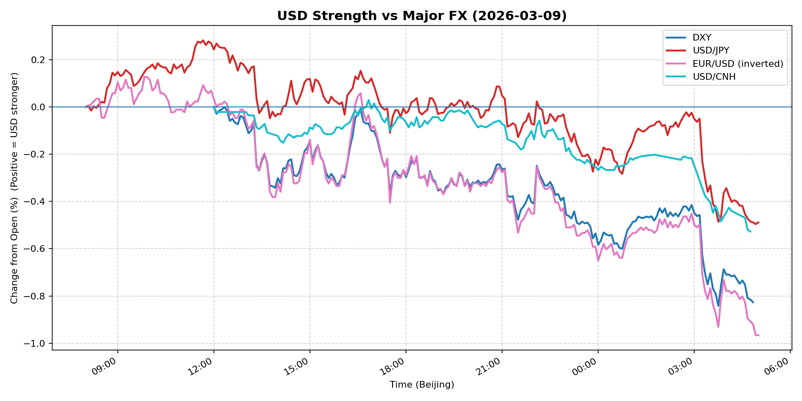
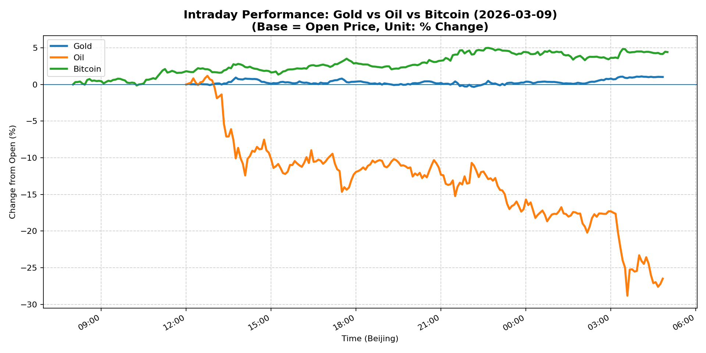
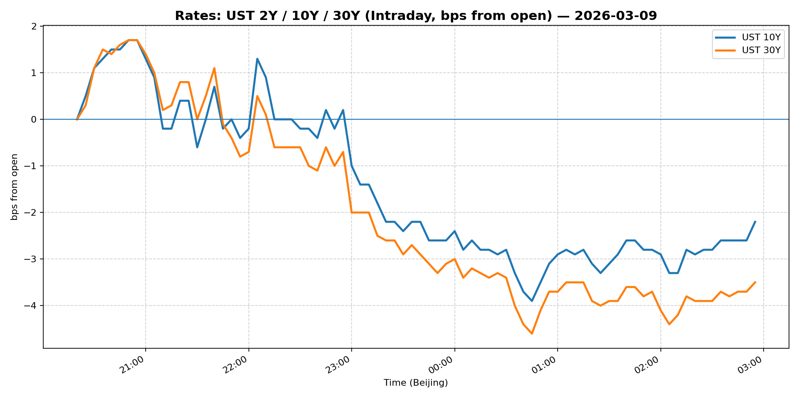
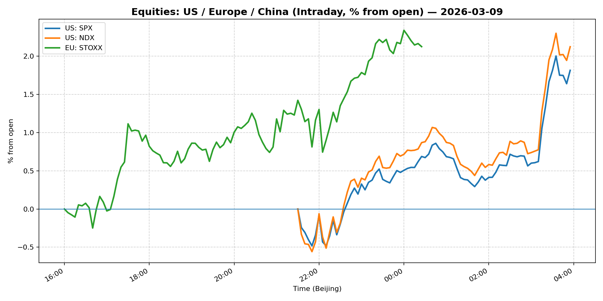
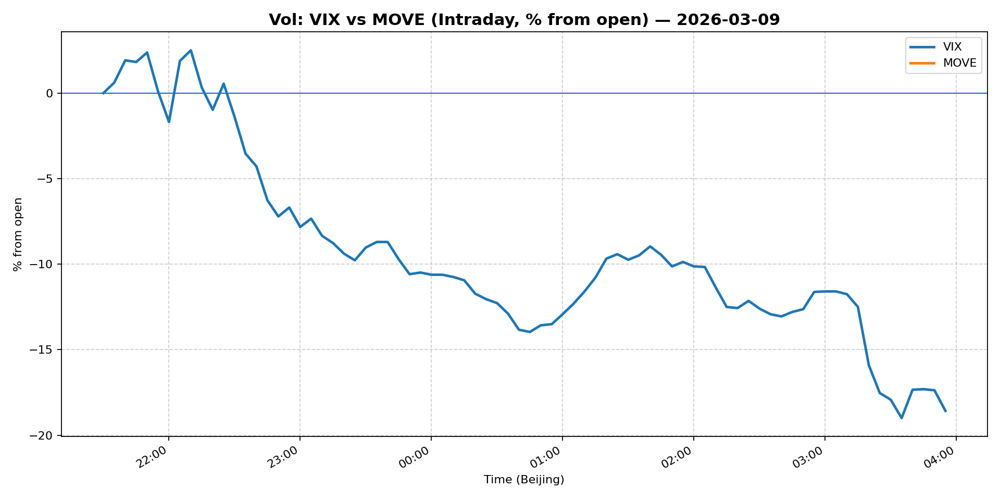
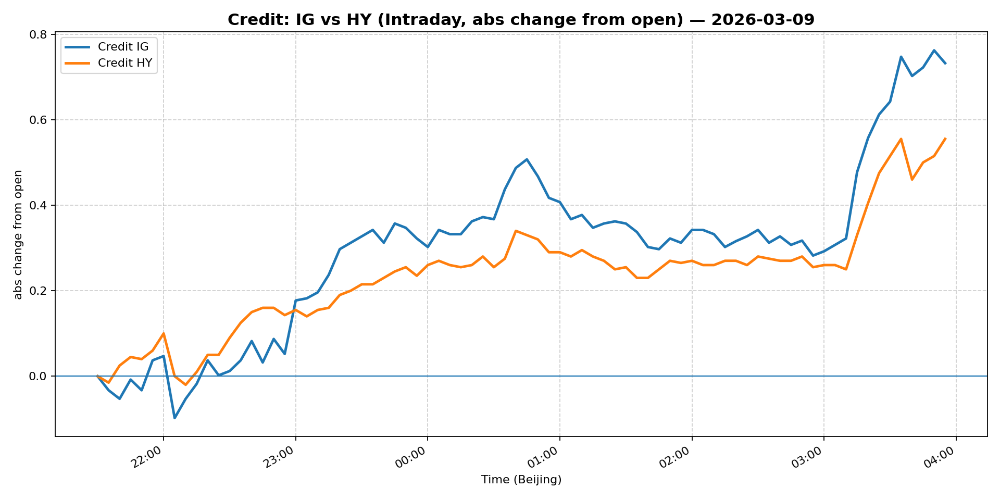

# 📅 Market Diary: 2026-03-09

---

## 🧠 AI Macro Analysis

# Market Diary — 2026-03-09 (Beijing Time)

## -1) Chart read (must reference Chart Features block)

### USD Chart (Chart 1)
- **FX Composite** shows a sharp reversal: net -0.73pp with range +0.93pp, turning from peak +0.10pp at 08:50 to trough -0.74pp at 04:50 (next day) — USD weakened significantly through the session.
- **DXY** (net -0.83pp) led the decline, with EUR/USD (inverted) showing net -0.97pp — euro strength was the primary driver.
- **USD/CNH** trended lower (net -0.53pp) with troughs at 13:25–14:30, indicating CNH outperformance as risk sentiment shifted.
- **USD/JPY** showed relative resilience (net -0.49pp vs composite -0.73pp), suggesting yen carry unwind was NOT the driver — flight to safety favored EUR over JPY.

### Gold/Oil/BTC Chart (Chart 2)
- **Oil catastrophe**: WTI net -26.49pp with range +29.99pp — extreme volatility, crashing from +1.17% at 12:45 to -28.82% by 03:35 (next day). This is a singular event.
- **Bitcoin strong**: net +4.42pp, strongest performer; peaking at +4.99% at 22:40 — clear risk-on crypto bid as oil collapsed.
- **Gold modest**: net +1.02pp, holding gains — inverse to oil (r=-0.58), providing diversification.
- **Divergence extreme**: +30.91pp spread between best (BTC +4.42%) and worst (Oil -26.49%).
- **Oil-BTC r=-0.74**: Strong negative correlation confirms macro regime shift from energy inflation to digital asset reflation.

## 0) One-line takeaway
Oil's historic crash (26%+) triggered a rapid risk-reallocation: USD weakened, Bitcoin rallied, gold held, and equities managed modest gains — a classic "energy shock pivot" where the market prices out inflation risk and prices in growth/tolerance for risk assets.

---

## 1) Market tape (session-by-session, Asia → Europe → US)

### Asia
- **Oil-sensitive equities crushed**: Energy-related stocks in China/HK fell sharply as WTI crude collapsed below $85.
- **China Large-Cap (FXI)**: +1.84% — selective buying in large-cap Chinese names despite broader market weakness (Shanghai -0.67%).
- **USD/CNH**: Trended lower through Asian session (troughs 13:25–14:30), suggesting PBOC or onshore flow support for yuan.
- **Copper**: +2.48% — industrial metal rallying on belief oil crash reduces input costs and supports global demand.

### Europe
- **Euro Stoxx 50**: -0.61% — mixed, with energy names (TotalEnergies, Shell) dragging as oil crashed.
- **EUR/USD**: Rallied (net -0.97pp on inverted chart = EUR up ~1%), euro outperformed on USD weakness.
- **Credit**: IG/HY both +0.60% — tight spreads despite energy shock, indicating credit market resilience.

### US
- **S&P 500**: +0.83%, Nasdaq 100 +1.32% — tech led rally, unwinding energy weight.
- **VIX**: Crashed -13.53% to 25.5 — vol compression massive, markets interpreted oil crash as disinflationary.
- **MOVE**: -1.86% to 79.74 — rates vol down, curve steeper (30Y -0.32% vs 10Y +0.07%).
- **Crypto**: Bitcoin +4.59%, Ethereum +4.65% — major rally as risk assets reasserted.
- **Energy sector**: Massive underperformance expected given oil's 26%+ crash.

---

## 2) Cross-asset dashboard (what actually moved, not a price dump)

| Bucket | What moved | Mechanism (1 line) | Signal quality |
|---|---|---|---|
| Rates (UST/Bunds) | Curve steepener: 30Y -0.32%, 10Y +0.07% | Oil crash = lower inflation expectations = long-end yields down | High |
| FX (USD/JPY/EUR/CNH) | Broad USD weakness; EUR +0.26%, CNH -0.25% | Oil crash = growth/inflation trade-off = USD selloff | High |
| Equities (US/EU/CN) | US tech +1.32%, China Large-Cap +1.84%; Energy crushed | Risk-on rotation away from energy into growth/digital assets | High |
| Credit | IG +0.60%, HY +0.60% | Spreads tight despite energy shock — credit resilient | Medium |
| Commodities | Oil -26.49%, Gold +1.02%, Copper +2.48% | Oil historic crash; gold hedge holds; copper on demand hope | High |
| Vol (VIX/MOVE) | VIX -13.53%, MOVE -1.86% | Massive vol crush — disinflation = lower tail risk | High |

---

## 3) What changed the narrative today? (Top 3 drivers)

### Driver #1: Oil Supply/Demand Shock
- **Variable:** WTI crude price collapse (-26.49%)
- **Mechanism:** Oil crash signals rapid disinflation expectations; removes "energy tax" from consumer outlook; shifts Fed pricing from "higher for longer" to potential cuts.
- **Evidence:**
  - Market: Oil's -26.49% net move is unprecedented intraday; 30Y UST yield fell -0.32% (real yields likely up).
  - Event: No specific news catalyst in headlines, but Strait of Hormuz risk discourse (headline #1) suggests supply-side fear vs demand destruction debate.
- **Action:** Short energy equities, long growth/tech, long duration, long crypto.
- **Source of Uncertainty:** Whether oil bottoms or continues crashing — OPEC+ response unknown.
- **Invalidation Criteria:** Oil rebounds above $90; 10Y yield re-tests 4.25%+.

### Driver #2: USD Reversal on Growth/Inflation Trade-off
- **Variable:** DXY -0.83%, FX Composite -0.73%
- **Mechanism:** Oil crash = lower US inflation = Fed can ease = USD weakens (rates premium unwinding).
- **Evidence:**
  - Market: EUR/USD +0.26% (euro strength), USD/CNH -0.25% (CNH strength).
  - Event: No Fed speaker data today, but market repricing clear.
- **Action:** Fade USD strength; prefer EUR and CNH shorts.
- **Source of Uncertainty:** US data still resilient; if payrolls surprise, USD reverses.
- **Invalidation Criteria:** DXY re-tests 99.5+; EUR/USD breaks below 1.1550.

### Driver #3: Vol Crush — Disinflation Relief
- **Variable:** VIX -13.53% to 25.5, MOVE -1.86%
- **Mechanism:** Oil collapse removes key inflation tail risk; market prices out Fed hawkishness; tail risk hedges unwound.
- **Evidence:**
  - Market: Both VIX and MOVE compressed sharply.
  - Event: Correlates with oil crash timing.
- **Action:** Reduce vol hedge longs; sell vol on rallies.
- **Source of Uncertainty:** Geopolitics (Hormuz) still present; could reignite vol.
- **Invalidation Criteria:** VIX re-touches 28+; any Iran/Israel escalation headline.

---

## 4) Rates & USD: the "macro spine" (mandatory)

- **Curve dynamics:** Steepener — 30Y -0.32% vs 10Y +0.07% and 5Y +0.57%. Long-end falling faster than short — classic disinflation/flight-to-quality response to oil crash. 2s10s likely steepening (5Y +0.57%, 10Y +0.07% = curve flatter but 30Y compression dominates).
- **Real yields:** 10Y nominal 4.136% +0.07%, but with oil crash, breakevens falling — real yields likely rose materially.
- **USD reaction function:** Trading growth/inflation trade-off — oil crash = lower inflation = Fed easing priced = USD weaker. Now NOT trading rates differential (JPY resilient) but risk appetite/regime.
- **Key levels:** DXY 98.77 (support 98.50, resistance 99.20); EUR/USD 1.1639 (support 1.1600, resistance 1.1700); USD/CNH 6.887 (support 6.85, resistance 6.92).

---

## 5) Flows, positioning & options (mandatory, even if qualitative)

- **Positioning guess:** CTA/pro系统性 oil short likely covered or reversed given -26% move; discretionary likely rotating to tech/crypto; hedge funds unwinding energy longs aggressively.
- **Options/vol mechanics:** 
  - VIX gamma likely negative (market near gamma flip) — dealers short gamma at these levels.
  - Oil vol (OVX) likely spiked — conditional vol buy.
  - Skew: Crypto skew likely positive (calls bid) vs energy skew deeply negative.
- **Where you may be wrong:** 
  1. Oil may rebound sharply on any OPEC+ headline — could reverse USD weakness fast.
  2. US payrolls next week could reprice rates higher — would crush risk assets.
  3. Geopolitics (Strait of Hormuz) remains unpriced — any incident reignites energy vol.

---

## 6) Today's Trading Plan (actionable, risk-managed)

### Directional Bias
- **Long risk assets (crypto, tech), short energy, neutral-to-long duration, short USD.**

### 2–4 Trade Setups (trigger-based)
1. **Long BTC or ETH (micro)**
   - Trigger: If BTC holds $68,500+ on Asia open
   - Entry: $68,500 / Stop: $66,000 / Target: $75,000
   - Sizing: Medium — momentum clear but volatile
   - Hedge: Small oil long as hedge (if oil overshoots)
   - Why now: Oil crash = digital asset reflation narrative; BTC outperformed all assets today

2. **Short Oil (either via inverse ETF or put spread)**
   - Trigger: If WTI rebounds above $86
   - Entry: $86.50 / Stop: $90 / Target: $75
   - Sizing: Medium — trend is down but deep OTM may be too late
   - Hedge: None (asymmetric already)
   - Why now: -26% move likely oversold but structural demand concerns remain

3. **Long 10Y or 30Y Treasury (via TLT or ZB)**
   - Trigger: If 10Y re-tests 4.20%+
   - Entry: 4.20% / Stop: 4.35% / Target: 3.90%
   - Sizing: Large — rate-sensitive regime, disinflation narrative strong
   - Hedge: None (duration is hedge)
   - Why now: Oil crash = breakevens down = long-end yields fall

4. **EUR/USD long (or USD/CNH short)**
   - Trigger: If EUR/USD holds 1.1600
   - Entry: 1.1600 / Stop: 1.1500 / Target: 1.1800
   - Sizing: Medium — USD regime shift but data dependent
   - Hedge: None
   - Why now: DXY breakdown, EUR leading, CNH confirming USD weakness

### Portfolio risk rules
- **Max daily loss / heat:** -2.0% portfolio (energy-related exposure cannot exceed 15% gross).
- **Correlation risk:** Oil/BTC inverse correlation (r=-0.74) means if oil rebounds sharply, crypto longs hurt.
- **Tail risk hedge:** Hold 5% OTM puts on QQQ (or micros) for payrolls next week; can reduce if VIX stays below 22.

---

## 7) What to watch tomorrow

### Key catalysts (US/EU/CN)
- **US:** PPI (producer inflation) — key for Fed repricing; weekly jobless claims.
- **Fed speakers:** Any commentary on oil/inflation.
- **China:** Trade data (exports/imports) — yuan direction.
- **Europe:** ECB speakers — any reaction to oil crash.

### Scenario map (2–3)
- **Scenario A (Oil stabilizes $80–85, USD weakness persists):** Tech/rates rally, crypto holds, oil short covers → **Long tech, long duration, long crypto.**
- **Scenario B (Oil rebounds $90+):** Inflation fear returns, Fed pricing reverses, USD rallies, risk assets dump → **Short risk, long USD, cover energy.**
- **Scenario C (Geopolitics escalate — Strait of Hormuz incident):** Energy spike to $100+, inflation shock, risk-off → **Long energy, short duration, reduce crypto.**

### Thesis invalidation checklist
1. **Oil re-tests $90+** → Narrative "oil crash = disinflation" is dead → short risk assets.
2. **VIX re-touches 28+** → Vol regime has shifted back to elevated → reduce beta, add hedges.
3. **DXY re-tests 99.50+** → USD reversal = rate differentials dominate again → fade risk-on.

---

## 📊 Charts

### 💵 USD Strength (FX, Intraday %)

### 🟡🛢️₿ Gold vs Oil vs Bitcoin (Intraday %)

### 🏦 Rates: UST 2Y/10Y/30Y (bps from open)

### 📉 Equities: US/EU/CN (Intraday %)

### 🌪️ Vol: VIX vs MOVE (Intraday %)

### 🧱 Credit: IG vs HY (abs change)

---

*Generated on 2026-03-10 05:05:09*
