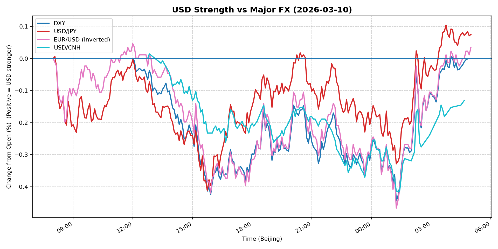
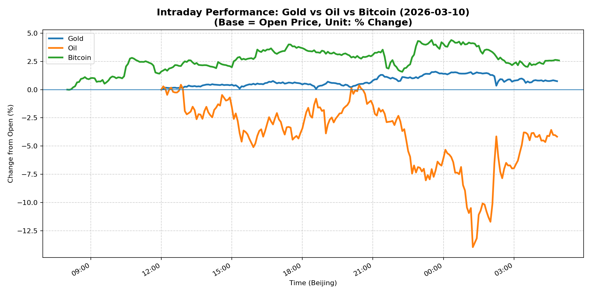
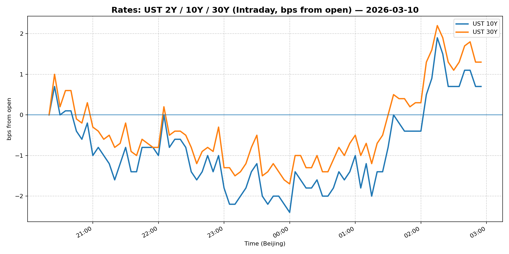
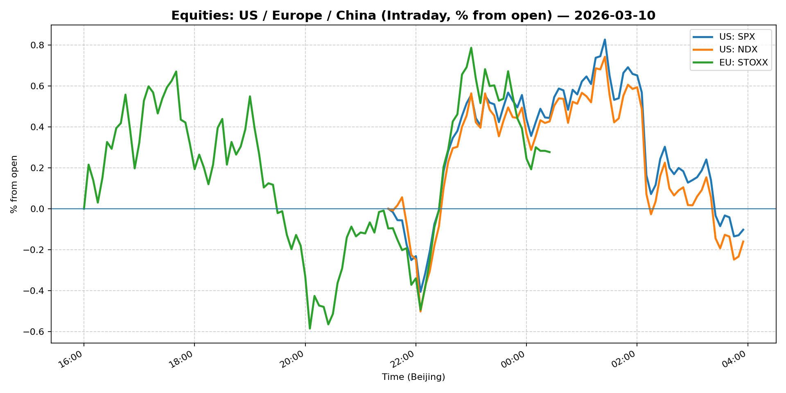
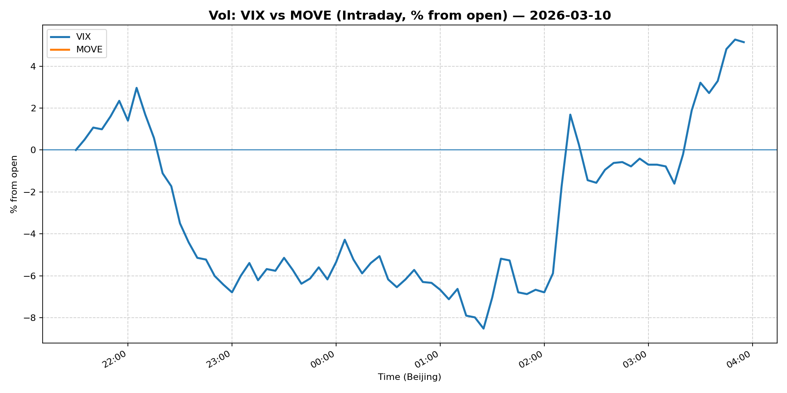
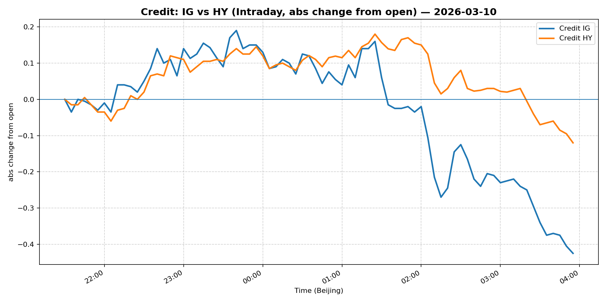

# 📅 Market Diary: 2026-03-10

---

## 🧠 AI Macro Analysis

# Market Diary — 2026-03-10 (Beijing Time)

## -1) Chart read (must reference Chart Features block)

- **USD chart (Chart 1):** FX Composite net +0.06pp with range +0.47pp shows USD essentially flat on the day. Turning points reveal a trough sequence at -0.14pp → -0.20pp → -0.16pp between 08:25–08:55 (Asia session), followed by a deeper trough of -0.41pp at 01:15 (US session). USD/JPY showed two-way volatility (range +0.52pp) with troughs in Asian morning, while USD/CNH declined -0.13pp net, breaking below the 6.90 level. The pattern suggests USD losing grip into the US session after Asian weakness.

- **Gold/Oil/BTC chart (Chart 2):** Dramatic divergence: Bitcoin led +2.58pp, Gold followed +0.75pp, while Oil collapsed -4.17pp (intraday range +14.39pp). The Gold-Oil correlation turned strongly negative at r=-0.80, a classic risk-off / geopolitical stress signal. BTC's +2.58pp gain alongside Gold's +0.75pp indicates capital rotating into hard assets and crypto as alternative stores. The 6.75pp spread between best and worst performers is a red-flag divergence.

## 0) One-line takeaway

Oil's 8.56% collapse (energy ministers considering SPR release) triggered a classic risk-off rotation: gold and bitcoin rallied, the USD weakened, Treasury yields fell, but equities held up—suggesting markets price a temporary supply shock relief rather than recession.

## 1) Market tape (session-by-session, Asia → Europe → US)

### Asia
- Oil opened sharply lower after weekend headlines on Strait of Hormuz tensions and SPR speculation
- USD/JPY troughed at 08:20–08:40 (JST), dragging the FX Composite to its deepest Asian trough (-0.20pp)
- Shanghai Composite +0.65%, China Large-Cap +0.30%—APAC equities relatively resilient despite energy shock
- Gold rallied through Asian session, peaking +0.17pp around 12:10–12:50 local time

### Europe
- Euro Stoxx 50 surged +2.67%, outperforming globally—energy price relief a major tailwind for import-heavy EU
- EUR/USD inverted chart shows EUR gaining +0.77% on the day (peak +0.05pp at 12:00 UTC)
- European credit (IG/HY) held relatively stable vs US counterparts despite risk-on equity move
- Bund yields likely fell in sympathy with US Treasuries as oil-driven inflation fears eased

### US
- S&P 500 (-0.21%) and Nasdaq (-0.04%) barely budged—the energy sector collapse was offset by other sectors
- 10Y Treasury broke below key 4.14% level, a technical break lower on oil-driven inflation relief
- MOVE index fell -4.27% to 76.33—vol compression as oil shock subsided
- Bitcoin peaked +4.39% at 23:30 UTC, continuing its Asia-session momentum into US hours

## 2) Cross-asset dashboard (what actually moved, not a price dump)

| Bucket | What moved | Mechanism (1 line) | Signal quality |
|---|---|---|---|
| Rates (UST/Bunds) | 5Y -56bp, 10Y flat, 30Y +65bp; curve steepened on oil collapse | Oil crash → inflation expectations crater → long-end yields fall despite growth concerns | High |
| FX (USD/JPY/EUR/CNH) | DXY -0.25%, USD/CNH -0.44%, EUR +0.77% | Oil collapse + lower US yields = USD weakness across board | High |
| Equities (US/EU/CN) | S&P -0.21%, Nasdaq flat, Euro Stoxx +2.67%, Shanghai +0.65% | EU imported inflation drop = massive EU rally; US mixed as energy weighs | Medium |
| Credit | IG -0.69%, HY -0.16% | Risk-off but contained; IG more exposed to rate sensitivity than HY | Medium |
| Commodities | Oil -8.56%, Gold +2.17%, Copper +1.98% | Oil supply shock fear reversed; Gold/BTC = safe-haven rotation | High |
| Vol (VIX/MOVE) | VIX -2.24%, MOVE -4.27% | Oil-driven vol spike reversed; markets repricing lower tail risk | High |

## 3) What changed the narrative today? (Top 3 drivers)

### Driver #1: Oil Supply Shock Fear Reversal
- **Variable:** Crude Oil (-8.56%, intraday -14% at worst)
- **Mechanism:** Energy ministers publicly discussing SPR release + de-escalation rhetoric on Strait of Hormuz = market pricing out worst-case supply disruption
- **Evidence:** 
  - Market: WTI from +0.43pp intraday peak to -13.96pp trough (14.39pp range)
  - Event: Headline "Oil futures lose more than 11%" + "energy ministers consider release of emergency crude reserves"
- **Action:** Short oil via futures or puts; long energy-consuming sectors (airlines, industrials); avoid energy equities
- **Source of Uncertainty:** Iran conflict escalation still unresolved; SPR release amount unclear; OPEC+ response unknown
- **Invalidation Criteria:** Oil re-tests $95+ on new supply disruption headline or geopolitical escalation

### Driver #2: Inflation Expectations Crumble → Yields Plunge
- **Variable:** 10Y Treasury yield breaking below 4.14%
- **Mechanism:** Oil crash directly reduces gasoline/energy input costs → CPI expectations fall → Fed easing probability rises
- **Evidence:** 
  - Market: 10Y flat (0.00%) but broke below key technical level; 5Y -56bp (biggest mover)
  - Event: Headline "10-year Treasury yield trades below key level after a drop in oil prices eases inflation fears"
- **Action:** Long duration; short breakevens; position for steeper curve (5s30s or 2s10s steepeners)
- **Source of Uncertainty:** Core inflation (ex-energy) still sticky; services inflation undented by oil
- **Invalidation Criteria:** Oil rebounds + core CPI spikes >0.3% MoM → yields reverse higher

### Driver #3: Alternative Asset Rotation (Gold + Bitcoin)
- **Variable:** Gold +2.17%, Bitcoin +2.71%, spread vs oil +6.75pp
- **Mechanism:** Oil collapse + geopolitical uncertainty = flight to hard assets; crypto seen as uncorrelated reserve asset
- **Evidence:** 
  - Market: Gold-Oil correlation r=-0.80 (extreme negative); Bitcoin outperformed all assets
  - Event: Headline "Trump's new world order is taxing your portfolio as diplomacy fades and uncertainty reigns"
- **Action:** Add gold exposure (phys or ETFs); maintain Bitcoin as portfolio hedge; reduce oil-linked exposure
- **Source of Uncertainty:** Bitcoin still a risk asset; correlation to equities can snap back in true crisis
- **Invalidation Criteria:** Broad risk-off (VIX >35) where everything correlates down except cash/UST

## 4) Rates & USD: the "macro spine" (mandatory)

- **Curve / real yield / inflation breakevens:** The 5Y dropped 56bp—massive move—while 30Y rose 65bp. This is NOT a parallel shift; it's a steepener driven by long-end inflation expectations holding up while short-end rates price more Fed cuts. Real yields likely fell on the margin. Breakevens compressed on oil but remain elevated in core.

- **USD reaction function:** USD is trading "growth + rates" today. Oil crash → lower US inflation expectations → Fed pricing more cuts → USD weakness. The DXY -0.25% and USD/CNH -0.44% confirm this. However, EUR also rallied (+0.77%), suggesting it's relative rather than absolute USD weakness.

- **Key levels that matter:** DXY 98.937 (support at 98.50), USD/CNH 6.8785 (critical 6.90 level breached), 10Y 4.136% (now below 4.14% technical level = next support ~4.00%).

## 5) Flows, positioning & options (mandatory, even if qualitative)

- **Positioning guess (CTA / discretionary / hedge):** CTA likely reduced energy longs aggressively; discretionary players adding duration and gold; macro funds likely short oil/long euro-stoxx. The divergence between oil (-8.56%) and S&P (-0.21%) suggests energy weighting in S&P masked broad strength.

- **Options / vol mechanics:** MOVE -4.27% (76.33) suggests vol short-squeeze reversed. VIX down -2.24% to 24.93—still elevated but not stressed. Skew likely flipped to put-wing as oil crash created tail risk. Dealer gamma likely light after vol comedown.

- **Where you may be wrong:** (1) Oil rebound if Iran situation escalates—this thesis breaks hard. (2) US equities hold up while Europe rips: energy weighting explains S&P resilience, but if oil stays low, US cyclical names may catch up. (3) USD weakness may be overdone if Fed pushback on cuts materializes.

## 6) Today's Trading Plan (actionable, risk-managed)

- **Directional Bias:** Long Duration (long 10Y or 30Y), Long Gold, Long Bitcoin, Short Oil, Slightly Long Euro Stoxx, Short USD vs CNH/EUR

- **2–4 Trade Setups (trigger-based):**
  - **Setup 1:** Long 10Y Treasury (TY)
    - **Trigger:** If 10Y re-tests 4.10% level and holds (no reversal on oil bounce)
    - **Entry:** 4.10% region / Stop: 4.25% / Target: 3.85%
    - **Position sizing:** Medium (add to existing duration)
    - **Hedge:** Short breakevens (breakeven compression if oil stays low)
    - **Why now:** Oil crash creates clear path to lower inflation expectations

  - **Setup 2:** Long Gold (GLD or physically)
    - **Trigger:** Gold holds above $5,150 (prior resistance becomes support)
    - **Entry:** $5,150 area / Stop: $5,000 / Target: $5,500
    - **Position sizing:** Medium
    - **Hedge:** None (natural hedge to USD weakness + geopolitical risk)
    - **Why now:** Gold-Oil divergence at r=-0.80 signals strong macro tailwind

  - **Setup 3:** Short Oil (USO puts or WTI futures)
    - **Trigger:** WTI re-tests $88–90 zone on any bounce
    - **Entry:** $88.50 / Stop: $92 / Target: $80
    - **Position sizing:** Small-Medium (vol elevated, events fluid)
    - **Hedge:** Long OTM call (Iran escalation)
    - **Why now:** SPR discussion + demand fears = structural headwind

  - **Setup 4:** Long Euro Stoxx / Short US Energy-heavy Equities
    - **Trigger:** Euro Stoxx breaks 5,850 with volume
    - **Entry:** 5,850 / Stop: 5,700 / Target: 6,100
    - **Position sizing:** Medium
    - **Hedge:** Hedge FX via EURUSD longs
    - **Why now:** Oil relief = EU import inflation drop = massive relative outperformance

- **Portfolio risk rules:**
  - **Max daily loss / heat:** 2% portfolio-level max; individual trade max 1%
  - **Correlation risk:** Gold/BTC correlation positive today but can invert in acute risk-off; reduce correlated longs if VIX spikes >30
  - **Tail risk hedge:** Keep OTM puts on S&P (15-delta); maintain small VIX call wing

## 7) What to watch tomorrow

- **Key catalysts (US/EU/CN):** US CPI print (core expected ~0.2–0.3% MoM)—oil crash may not show in headline but will be watched; Fed speakers (any Powell remarks on oil/inflation); China trade data; EU industrial production
- **Scenario map (2–3):**
  - If CPI comes in hot (>0.3% core) + oil rebounds → 10Y re-tests 4.30%, duration shorts, USD rallies
  - If CPI soft + oil stays low → 10Y breaks 4.00%, steepening continues, EUR strength
  - If Iran escalation news hits → Oil spikes >$95, vol spikes, risk-off, USDJPY weakens (carry unwind)
- **Thesis invalidation checklist:**
  - [ ] Oil re-tests $95+ on supply news → Kill duration longs, go risk-off
  - [ ] CPI core >0.3% MoM + sticky services → Fed cut pricing reverses, USD strengthens
  - [ ] VIX spikes above 30 without clear catalyst → Reduce all risk, go cash/UST

---

## 📊 Charts

### 💵 USD Strength (FX, Intraday %)

### 🟡🛢️₿ Gold vs Oil vs Bitcoin (Intraday %)

### 🏦 Rates: UST 2Y/10Y/30Y (bps from open)

### 📉 Equities: US/EU/CN (Intraday %)

### 🌪️ Vol: VIX vs MOVE (Intraday %)

### 🧱 Credit: IG vs HY (abs change)

---

*Generated on 2026-03-11 05:05:17*
