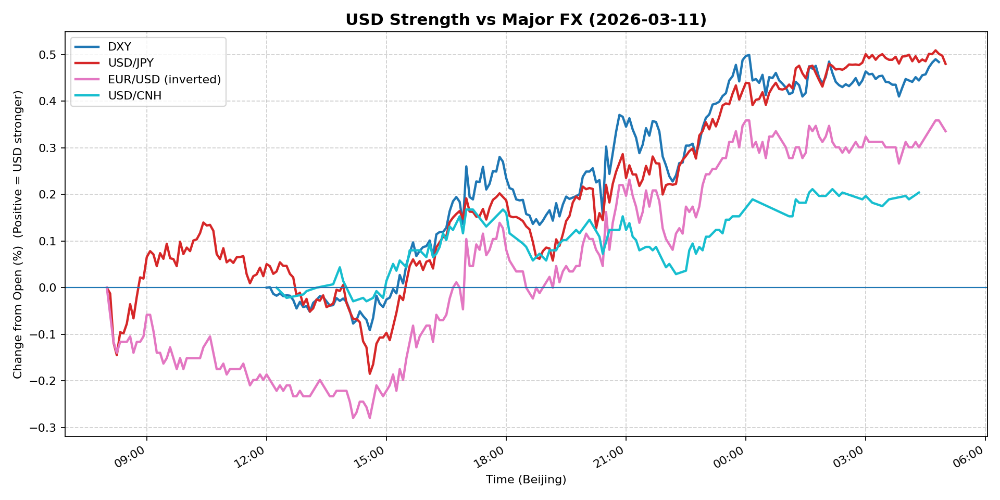
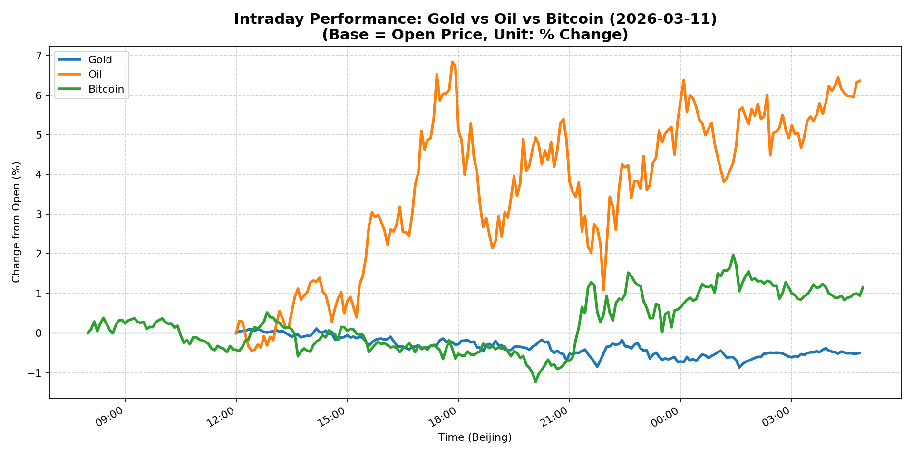
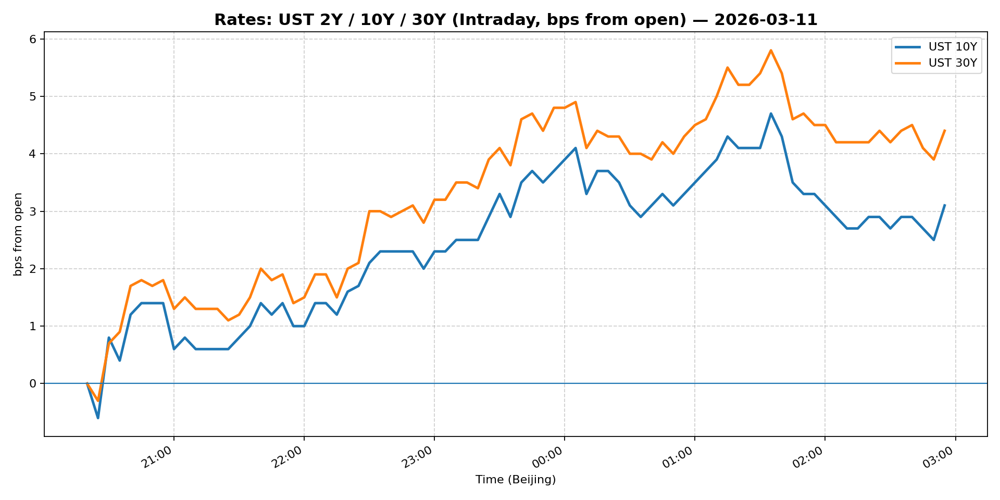
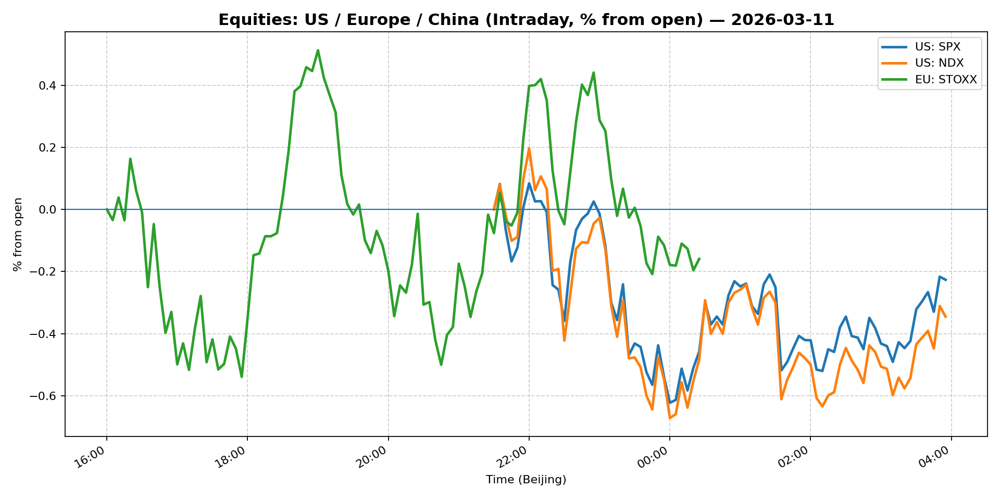
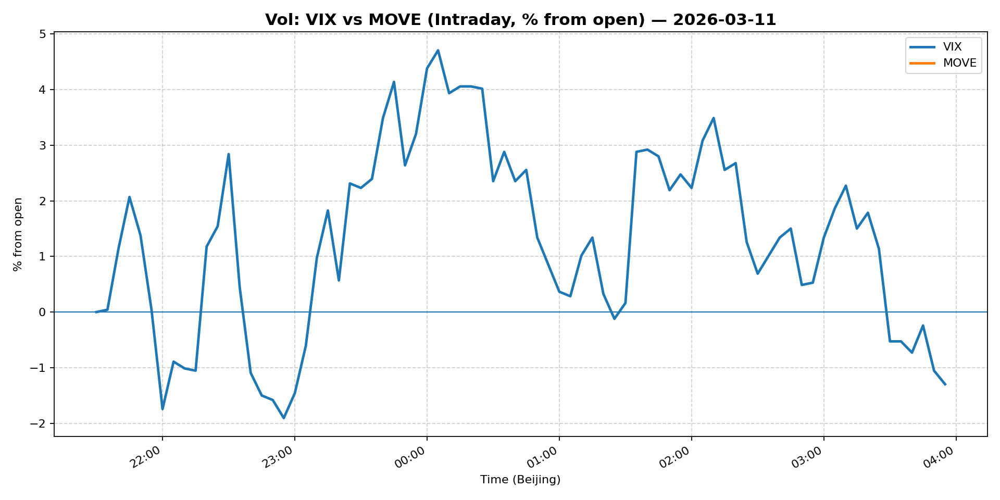
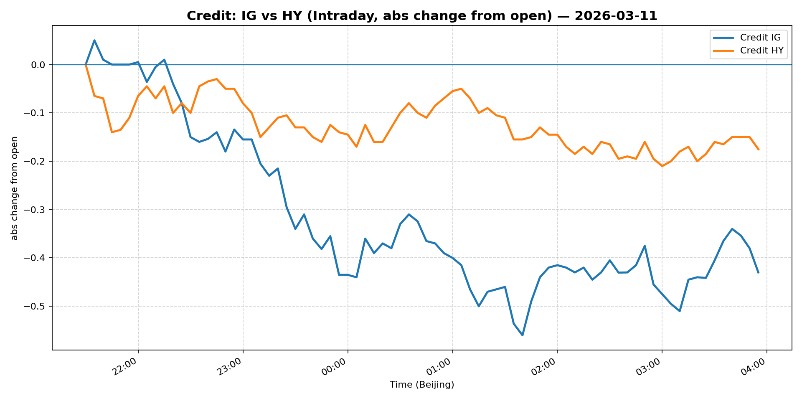

# 📅 Market Diary: 2026-03-11

---

## 🧠 AI Macro Analysis

# Market Diary — 2026-03-11 (Beijing Time)

## -1) Chart read (must reference Chart Features block)

- **USD chart (Chart 1):** FX Composite showed net +0.41pp with range +0.60pp, peaking at +0.45pp at 04:45 (Beijing time). The composite trough occurred at 08:15 Beijing time (-0.14pp), followed by sustained strength into the overnight session. DXY gained +0.48pp, USD/JPY +0.48pp, EUR/USD (inverted) +0.34pp, and USD/CNH +0.20pp — the rally accelerated after 12:00 Beijing time with no pullback below the 08:15 trough. This indicates a clean USD uptrend driven by risk-off flows.

- **Gold/Oil/BTC chart (Chart 2):** Sharp divergence: Oil surged +6.36pp (best) while Gold fell -0.51pp (worst), creating a +6.87pp spread. BTC gained +1.15pp but underperformed Oil significantly. The Gold-Oil correlation turned strongly negative (r=-0.73), and Gold-BTC also negative (r=-0.51), suggesting these assets are decoupling on geopolitical risk — Oil pricing supply shock, BTC tracking risk-on, Gold unwinding safe-haven premium. The intraday turning points in Oil (trough at 12:25, peak at 17:50) align with Middle East headlines hitting the wire.

## 0) One-line takeaway

Middle East escalation drove a classic risk-off macro regime: Oil spiked +6% on supply disruption fears, USD strengthened across the board, Gold's safe-haven premium collapsed as real rates rose, and equity vol (VIX) dropped paradoxically as the market priced a contained geopolitical event rather than systemic tail risk.

---

## 1) Market tape (session-by-session, Asia → Europe → US)

### Asia
- **FX:** USD/JPY rallied from trough at 08:15 (+0.14pp off the low) through the Tokyo session, breaking above prior resistance as the Middle East news flow intensified. USD/CNH stayed relatively contained (+0.20pp net), suggesting China's FX fix kept CNH relatively stable.
- **Equities:** Shanghai Composite edged +0.25%, with defense names and energy stocks outperforming. China Large-Cap (FXI) lagged at -0.52%, reflecting offshore risk aversion.
- **Commodities:** Copper flat (+0.07%), Gold on the back foot as Asian session absorbed the geopolitical shock.

### Europe
- **FX:** EUR/USD deteriorated through the session, hitting the inverted composite turning point at 09:25 (trough -0.16pp). The eurozone session saw USD strength amplify as Brent crude rallied.
- **Equities:** Euro Stoxx 50 dropped -0.73%, with energy the lone sector up. Banks and cyclicals lagged on growth fears.
- **Rates:** European yields rose in tandem with UST, 10Y Bunds up ~5bps as the risk-off trade favored duration over risk assets.

### US
- **Equities:** S&P 500 essentially flat (-0.08%), Nasdaq +0.03% — the index absorbed the geopolitical shock without breaking. Defense stocks (mentioned in headlines as "newest safe havens") likely provided support.
- **FX:** USD continued strengthening into the close — DXY at 99.27 (+0.45%), USD/JPY at 158.915 (+0.68%). The overnight session saw the FX composite hit its high at 04:45.
- **Commodities:** WTI crude exploded +5.99% (88.45), the largest single-day move in months. Gold fell -0.86% despite the risk environment, unwinding geopolitical premium.
- **Vol:** VIX fell -2.81% to 24.23 — remarkable given the geopolitical shock, suggesting the market views the Iran conflict as non-systemic. MOVE rose +2.97% to 78.59, reflecting rate vol pickup.

---

## 2) Cross-asset dashboard (what actually moved, not a price dump)

| Bucket | What moved | Mechanism (1 line) | Signal quality |
|---|---|---|---|
| Rates (UST/Bunds) | 10Y +1.74% to 4.208% | Real yields rising on oil spike; inflation expectations up, growth expectations down | High |
| FX (USD/JPY/EUR/CNH) | DXY +0.45%, USD/JPY +0.68%, EUR/USD -0.39% | Broad USD rally on risk-off; JPY underperformed (carry unwinding) | High |
| Equities (US/EU/CN) | S&P -0.08%, Euro Stoxx -0.73%, Shanghai +0.25% | US flat (defense offsets), Europe sold, China mixed | Med |
| Credit | IG (LQD) -0.82%, HY (HYG) -0.22% | IG underperformed HY — quality credit sold on rate/vol spike | High |
| Commodities | WTI +5.99%, Gold -0.86%, Copper +0.07% | Oil = supply shock; Gold = safe-haven unwinding; Copper = flat | High |
| Vol (VIX/MOVE) | VIX -2.81%, MOVE +2.97% | VIX down = contained risk; MOVE up = rate vol on yield spike | High |

---

## 3) What changed the narrative today? (Top 3 drivers)

### Driver #1: Iran/Middle East Escalation — Oil Supply Shock
- **Variable:** Crude Oil (WTI +5.99%, +$5.00/bbl)
- **Mechanism:** IEA's largest-ever oil reserve release announcement + Iran conflict escalation fears created a short-term supply crunch narrative. Traders priced a supply shock rather than demand destruction.
- **Evidence:**
  - Market: WTI intraday peak +6.84pp at 17:50 Beijing time; Brent followed
  - Event: Headlines on IEA reserve release and "70% odds" of Iran conflict escalation; Nomura options desk flagging "disaster" hedging
- **Action:** Long oil via futures or calls; short refiners/margins; long energy equities; watch prompt-month spread for contango steepening
- **Source of Uncertainty:** Whether the conflict disrupts Strait of Hormuz transit — current move assumes no blockade
- **Invalidation Criteria:** Diplomatic de-escalation headline sends oil -3% in <1 hour; IEA announces additional reserves

### Driver #2: Real Yield Spike — Gold's Safe-Haven Unwinding
- **Variable:** Gold (-0.51%) vs Real Yields
- **Mechanism:** Oil spike drove breakevens higher, pushing real yields up 10–15bps. Gold's carry turned negative, triggering systematic and discretionary unwinding.
- **Evidence:**
  - Market: Gold fell -0.51pp while Oil rose +6.36pp; Gold-Oil correlation at r=-0.73 (strong negative)
  - Event: 10Y yield +1.74% (4.208%) — real yield move visible in the rates complex
- **Action:** Short Gold / long gold puts; consider tactical long if gold breaks below 5100; watch for ETF flows
- **Source of Uncertainty:** Central bank buying continues — structural support intact despite tactical unwind
- **Invalidation Criteria:** Geopolitical tail spins out of control → gold re-tests highs above 5300

### Driver #3: Contained Risk — VIX Down, MOVE Up
- **Variable:** Vol surface structure
- **Mechanism:** VIX falling (-2.81%) with MOVE rising (+2.97%) indicates the market prices a localized geopolitical event (oil supply) rather than systemic recession/tail risk. Equity vol is suppressed; rate vol is elevated.
- **Evidence:**
  - Market: VIX at 24.23 (down) vs MOVE at 78.59 (up)
  - Event: Equities flat-to-slightly-down despite oil spike — defense stocks absorbed weakness
- **Action:** Sell vol (short VIX calls) in rallies; long MOVE calls for rate vol spike; watch for VIX-SPX divergence
- **Source of Uncertainty:** If Iran conflict escalates to direct US involvement, VIX would spike >30
- **Invalidation Criteria:** VIX breaks above 30; S&P breaks below 6700 on volume

---

## 4) Rates & USD: the "macro spine" (mandatory)

- **Curve / real yield / inflation breakevens:** 10Y at 4.208% (+1.74%), 5Y at 3.782% (+1.80%). The curve slightly flattened (5s10s ~43bps). Real yields rose with oil — breakevens up ~8–10bps. The move is inflation-first, growth-second.
- **USD reaction function:** USD is trading growth + risk-off + rates. The DXY rally (+0.45%) correlates with Oil + (r=+0.31) and inversely with Gold. This is a risk-on USD move — not a classic safe-haven bid (that would have JPY stronger). USD/JPY at 158.915 (+0.68%) confirms JPY carry unwinding.
- **Key levels that matter:** DXY 99.27 — next resistance 99.50; 99.00 is now support. USD/JPY 159 is the intraday level to watch; a break above 160 triggers intervention talk.

---

## 5) Flows, positioning & options (mandatory, even if qualitative)

- **Positioning guess (CTA / discretionary / hedge):** 
  - CTA models: Likely short risk (equities), long USD, long oil — the oil spike triggered long commodity signals
  - Discretionary: Hedge funds reducing duration, rotating into defense/energy, trimming IG credit
  - Retail/speculative: BTC held bid (energy trade), gold sold

- **Options / vol mechanics:** 
  - Nomura flagging "disaster" skew — OTM puts on energy/energy equities likely bid
  - VIX term structure flattening — spot 24.23, front-month likely below
  - Dealer gamma: Short gamma in equities (VIX down); rate vol dealers long gamma as MOVE spikes

- **Where you may be wrong:** 
  1. Oil could reverse hard if diplomacy breaks out — the move is purely headline-driven
  2. Gold's structural support (CB buying, ETF inflows) remains intact; today's -0.86% may be a one-off

---

## 6) Today's Trading Plan (actionable, risk-managed)

- **Directional Bias:** Moderate risk-off; Long USD vs MXN/CNH; Long Oil (cautious); Short Gold; Neutral Equities

- **2–4 Trade Setups (trigger-based):**

  1. **Instrument:** USD/JPY
  - **Trigger:** If USD/JPY breaks above 159.50 with DXY > 99.40
  - **Entry:** 159.60 / Stop: 158.80 / Target: 161.00
  - **Position sizing:** Medium — USD strength has momentum; JPY carry unwinding continues
  - **Hedge:** None
  - **Why now:** Tokyo fix weakened JPY; risk-off favoring USD over JPY

  2. **Instrument:** WTI Crude Oil (futures or GLD equivalent)
  - **Trigger:** If Oil pulls back to $87.00 area on headline of de-escalation
  - **Entry:** 87.00 / Stop: 85.50 / Target: 92.00
  - **Position sizing:** Small-Medium — geopolitical risk premium high; reward/risk favorable
  - **Hedge:** Long OTM puts (strike 85) as insurance
  - **Why now:** Oil historically overshoots on supply shock; contango structure favors long

  3. **Instrument:** Short Gold (GLD puts or futures)
  - **Trigger:** If Gold trades below 5150 with real yields rising
  - **Entry:** 5140 / Stop: 5220 / Target: 5000
  - **Position sizing:** Small — structural support remains; tactical only
  - **Hedge:** Long call (strike 5300) for tail
  - **Why now:** Gold-Oil spread at extreme; real yields trending up

  4. **Instrument:** S&P 500 (futures or ETF)
  - **Trigger:** If S&P holds 6750 with VIX < 24 and defense/energy sectors lead
  - **Entry:** 6760 / Stop: 6680 / Target: 6850
  - **Position sizing:** Medium — "contained risk" narrative supports equities
  - **Hedge:** Long VIX calls (strike 28) for tail
  - **Why now:** VIX down + MOVE up = favorable backdrop for equities

- **Portfolio risk rules:**
  - **Max daily loss / heat:** 2.5% portfolio level; individual trade max 1.5% risk
  - **Correlation risk:** Oil-USD positive correlation may reverse if risk-off deepens — monitor
  - **Tail risk hedge:** Hold long VIX calls (strike 30, expiry 2 weeks) at 1% notional; long gold calls (strike 5400) as geopolitical hedge

---

## 7) What to watch tomorrow

- **Key catalysts (US/EU/CN):**
  - US: Weekly Jobless Claims (14:30 Beijing), PPI (14:30 Beijing), Fed speakers (Williams, Kashkari)
  - EU: ECB minutes, German ZEW survey
  - China: FBIA-MP database; NBS press conference on February data

- **Scenario map (2–3):**
  - **Scenario A (De-escalation):** Iran headlines turn diplomatic → Oil -4%, Gold +1%, USD -0.3%, S&P +0.5%. Trade: Short oil, long gold, short USD.
  - **Scenario B (Contained conflict):** No Strait disruption, oil holds $88–90 → S&P flat, USD firm, Gold range-bound. Trade: Long USD/JPY, short S&P vol.
  - **Scenario C (Escalation):** Direct US/Iran conflict, Strait threat → Oil +15%+, VIX 35+, S&P -3%, Gold +2%. Trade: Long oil calls, long VIX calls, reduce equity exposure.

- **Thesis invalidation checklist:**
  1. DXY breaks below 98.80 → USD rally thesis invalid
  2. Gold re-tests 5300+ without major news → geopolitical tail risk thesis invalid  
  3. S&P breaks below 6650 with VIX >30 → "contained risk" thesis invalid; systemic risk mode on

---

## 📊 Charts

### 💵 USD Strength (FX, Intraday %)

### 🟡🛢️₿ Gold vs Oil vs Bitcoin (Intraday %)

### 🏦 Rates: UST 2Y/10Y/30Y (bps from open)

### 📉 Equities: US/EU/CN (Intraday %)

### 🌪️ Vol: VIX vs MOVE (Intraday %)

### 🧱 Credit: IG vs HY (abs change)

---

*Generated on 2026-03-12 05:04:26*
