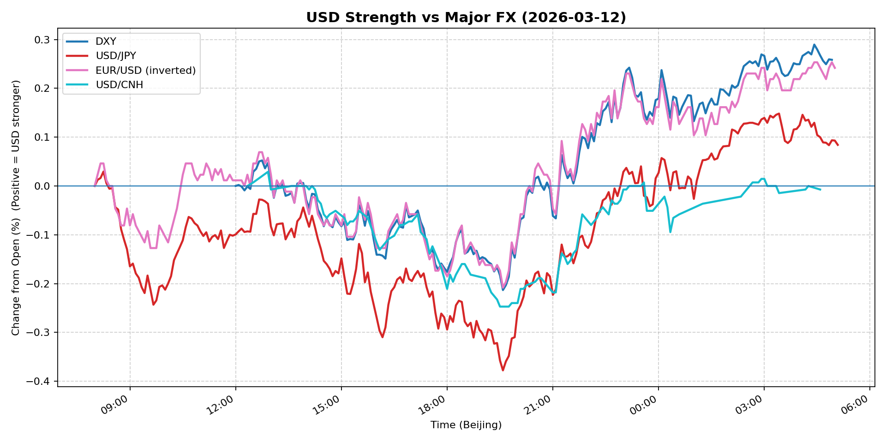
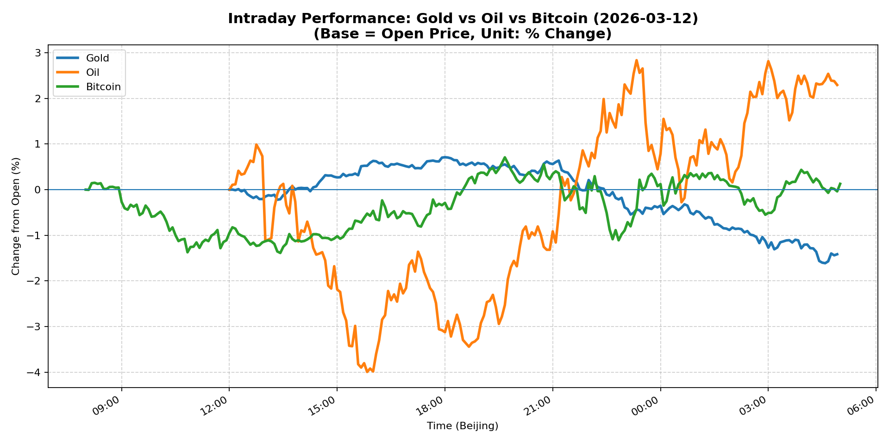
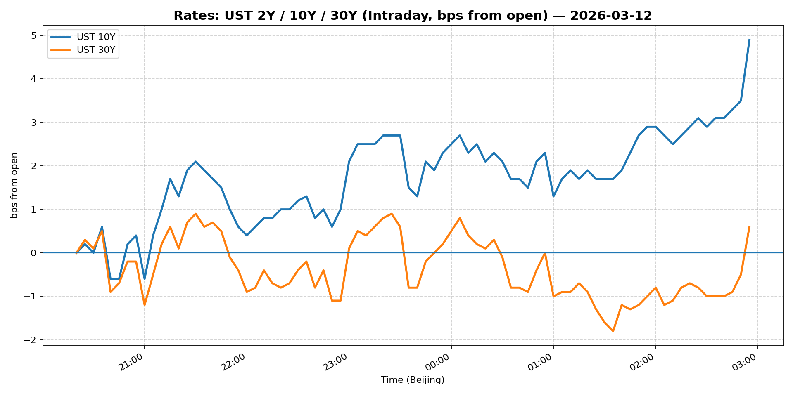
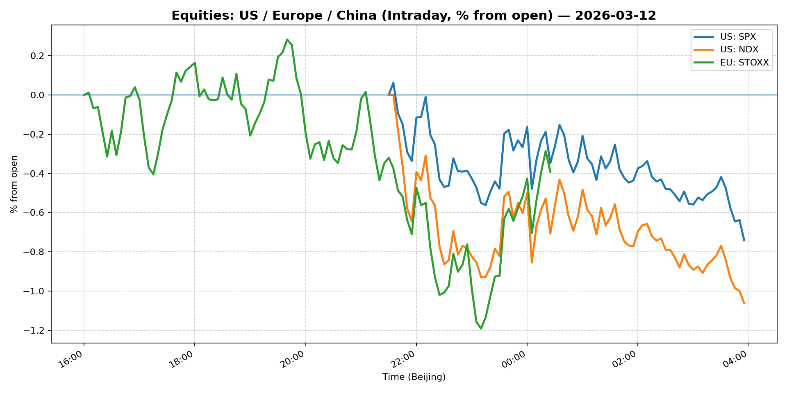
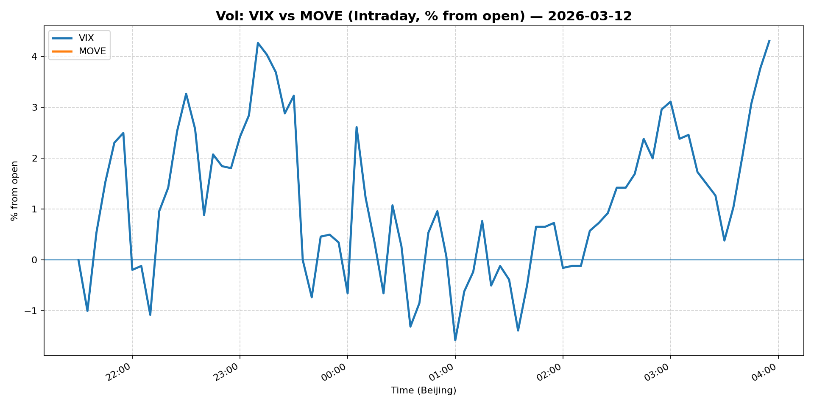
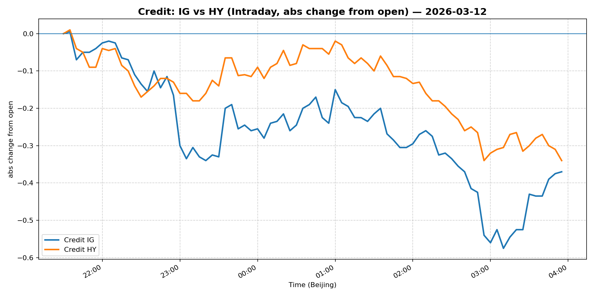

# 📅 Market Diary: 2026-03-12

---

## 🧠 AI Macro Analysis

# Market Diary — 2026-03-12 (Beijing Time)

## -1) Chart read

- **USD chart (Chart 1):** FX Composite net +0.08pp with range +0.46pp — dollar strengthened modestly but with high intraday volatility. DXY led (+0.26pp net), EUR/USD inverted move (+0.24pp net, EUR weakening). Turning points show USD peaking in early Asian session (peak +0.04pp @ 08:15), then declining into US hours (trough -0.10pp @ 08:50), before recovering into late night (peak +0.20pp @ 04:55). USD/JPY showed the widest range (+0.53pp) — yen weakness dominate the move. USD/CNH was flat (net -0.01pp), suggesting CNH held steady despite broader USD strength.

- **Gold/Oil/BTC chart (Chart 2):** Extreme divergence: Oil +2.29pp (best performer) vs Gold -1.42pp (worst), spread +3.71pp. This is a classic risk-off / supply shock signal. Gold's -1.42pp decline with -0.86 correlation to oil indicates gold was sold as a liquidity source rather than bought as a hedge. Bitcoin managed a modest +0.13pp gain — crypto held bid but failed to outperform on the dip. WTI's intraday range of +6.83pp (hi +2.84pp @ 23:20, lo -3.99pp @ 15:50) confirms extreme volatility in energy.

## 0) One-line takeaway

Oil's 10% surge triggered a risk-off rotation: gold and equities sold for liquidity, USD modestly stronger, while elevated vol (VIX +12.6%, MOVE +21.3%) signals markets pricing recession risk alongside inflation resurgence.

## 1) Market tape (session-by-session)

### Asia
- **Oil surge dominates:** WTI jumped ~10% on supply concern headlines — likely Iran/ geopolitical tension. This lifted energy sectors but spooked Asian equities.
- **Yen weakens despite risk-off:** USD/JPY +0.76% — BOJ dovish hold expectations keeping yen soft, even as global risk sentiment deteriorated.
- **Shanghai Composite:** -0.10% (relatively resilient vs global selloff), likely supported by energy sector rally.

### Europe
- **Equity weakness broad:** Euro Stoxx 50 -0.79%, underperforming Asia but outperforming US.
- **EUR weakens sharply:** EUR/USD -0.83% — euro sold on growth concerns + USD strength.
- **Credit under pressure:** IG/HY spreads widened on risk-off — LQD -0.54%, HYG -0.64%.

### US
- **Sharp equity selloff:** S&P 500 -1.52%, Nasdaq 100 -1.73% — tech leading the decline on recession/inflation dual concern.
- **Vol explosion:** VIX +12.63% to 27.29, MOVE +21.26% to 95.30 — rate vol spike indicates bond market pricing Fed cutting cycle dead.
- **Gold collapses:** Gold -1.61% — largest loser among majors, sold for liquidity amid risk-off.
- **Crypto mixed:** Bitcoin +0.14% — held bid but failed to capitalize on volatility.

## 2) Cross-asset dashboard

| Bucket | What moved | Mechanism | Signal quality |
|---|---|---|---|
| Rates (UST/Bunds) | 10Y +1.54% to 4.273% | Inflation expectations surge + recession fear = bear steepening | High |
| FX (USD/JPY/EUR/CNH) | DXY +0.50%, USD/JPY +0.76%, EUR/USD -0.83% | USD strength across board; EUR hit by growth risk; CNH flat | High |
| Equities (US/EU/CN) | S&P -1.52%, Nasdaq -1.73%, Euro Stoxx -0.79%, Shanghai -0.10% | Risk-off on oil shock + Fed cut fading | High |
| Credit | IG -0.54%, HY -0.64% | Spread widening on recession risk | High |
| Commodities | Oil +10.37%, Gold -1.61%, Copper -0.42% | Oil supply shock; Gold liquidate d for cash | High |
| Vol (VIX/MOVE) | VIX +12.63%, MOVE +21.26% | Rate vol spike + equity vol spike = regime shift | High |

## 3) What changed the narrative today?

### Driver #1: Oil Supply Shock
- **Variable:** Crude oil +10.37% (WTI to $96.30)
- **Mechanism:** Supply-side shock (likely Iran-related geopolitics) pushes energy costs higher, re-igniting inflation fears while growth slows.
- **Evidence:**
  - Market: Oil's intraday range +6.83pp; gold's -1.42pp collapse with -0.86 correlation
  - Event: No formal announcement, but headline-driven spike suggests geopolitical premium
- **Action:** Long oil equities, short rate-sensitive equities, consider TIPS breakeven widening
- **Source of Uncertainty:** Whether oil rally sustains or reverses on diplomatic resolution
- **Invalidation Criteria:** WTI breaks below $90 — inflation narrative collapses

### Driver #2: Fed Cut Hopes Fade
- **Variable:** 10Y yield +1.54% to 4.273%, MOVE +21.3%
- **Mechanism:** Markets repricing Fed to hold rates higher for longer — recession risk rising
- **Evidence:**
  - Market: MOVE at 95.3 (highest vol since regional bank stress); S&P -1.52%
  - Event: Headline "Markets' hopes for Fed interest rate cuts are rapidly fading away"
- **Action:** Short duration, overweight cash/short-dated T-bills
- **Source of Uncertainty:** PCE data Thursday — could re-anchor cuts or confirm no-cuts
- **Invalidation Criteria:** PCE comes in below 2.5% — Fed cut probability rebounds

### Driver #3: Inflation Expectations Breakout
- **Variable:** "Key gauge of inflation expectations logged highest reading in almost 4 years"
- **Mechanism:** Breakevens rising — market pricing reflationary scenario despite growth slowdown = stagflation risk
- **Evidence:**
  - Market: Gold -1.61% (real yield proxy sold), 30Y +0.58% (long-end bear steepening)
  - Event: News headline confirmed 4-year high in inflation expectations
- **Action:** Long real yields, short long-duration, tilt value over growth
- **Source of Uncertainty:** Whether this is transient (oil-driven) or persistent
- **Invalidation Criteria:** 5Y breakeven drops below 2.8%

## 4) Rates & USD: the "macro spine"

- **Curve / real yield / inflation breakevens:** 10Y at 4.273% (+1.54%) — bear steepening evident as 30Y (+0.58%) outperformed short end. Real yields rising on inflation expectations. Breakevens at 4-year highs per headlines.
- **USD reaction function:** Trading growth differential + rate differentials. DXY +0.50% despite risk-off (typical safe-haven bid), but USD/JPY rally (+0.76%) suggests carry trade unwind not the driver — it's rate-spike-driven USD strength.
- **Key levels that matter:** DXY 100 resistance; 10Y 4.25% pivot; VIX 25-30 elevated range; WTI $96.30 critical for inflation narrative.

## 5) Flows, positioning & options

- **Positioning guess (CTA / discretionary / hedge):** CTA likely reduced equity beta and commodity long exposure after oil spike. Discretionary likely rotating from growth to value/defense. Hedge demand elevated — vol spiked but not yet panic.
- **Options / vol mechanics:** VIX gamma likely positive (dealers long gamma as spot fell). MOVE's +21% spike suggests front-end rate vol exploding — payer swaption skew likely. Put skew elevated on equities.
- **Where you may be wrong:** Oil spike may be temporary geopolitical noise — if tensions ease, gold rebounds and USD weakens. Fed may still cut in Q2 if PCE softens — current pricing too hawkish.

## 6) Today's Trading Plan

- **Directional Bias:** Defensive — long USD, short duration, long oil/energy, underweight long-duration equities

- **2–4 Trade Setups:**
  - **Instrument:** Long USD/JPY (via NDF or ETF)
  - **Trigger:** If USD/JPY holds above 159 after Asian open, add on dips to 158.50
  - **Entry / Stop / Target:** Entry 159.30, Stop 158.00, Target 161.00
  - **Position sizing:** Medium (relative to oil risk)
  - **Hedge:** Short S&P 500 futures vs USDJPY long
  - **Why now:** Yen weak on BOJ dovish hold + USD strength on rate differential widening

  - **Instrument:** Long Oil (USO or energy equities like XLE)
  - **Trigger:** WTI holds above $95 on open
  - **Entry / Stop / Target:** Entry $96.50, Stop $92, Target $105
  - **Position sizing:** Medium-Large (tail risk hedge for stagflation)
  - **Hedge:** None (vol high, direct exposure)
  - **Why now:** Supply shock momentum; geopolitical premium not yet priced out

  - **Instrument:** Short 10Y Treasury (TY or TLT via puts)
  - **Trigger:** 10Y breaks above 4.30%
  - **Entry / Stop / Target:** Entry 4.28%, Stop 4.40%, Target 4.10%
  - **Position sizing:** Small (vol elevated)
  - **Hedge:** Long VIX calls
  - **Why now:** Bear steepening signals inflation narrative dominant; recession risk keeps long-end bid but Fed tightening repricing

  - **Instrument:** Long Gold puts (or short GLD)
  - **Trigger:** Gold fails to hold $5100
  - **Entry / Stop / Target:** Entry $5080, Stop $5150, Target $4900
  - **Position sizing:** Small
  - **Hedge:** None
  - **Why now:** Gold's -1.42% collapse with oil correlation -0.86 suggests liquidity-driven sell — more downside if risk-off deepens

- **Portfolio risk rules:**
  - **Max daily loss / heat:** 3% portfolio-level max; current heat elevated by vol spike
  - **Correlation risk:** Oil-USD correlation turning positive (oil up, USD up = stagflation regime); watch gold-Oil correlation revert
  - **Tail risk hedge:** Hold 2% VIX calls 30+ delta; maintain 5% cash

## 7) What to watch tomorrow

- **Key catalysts (US/EU/CN):**
  - US: PCE inflation data (Thursday) — critical for Fed cut repricing
  - US: University of Michigan consumer sentiment
  - Europe: ECB speakers (likely reaffirm data-dependent stance)
  - China: Trade data (exports/imports) — yuan direction

- **Scenario map (2–3):**
  - If PCE core < 2.5% → Fed cut probability rebounds → S&P rallies, 10Y -15bp, USD -0.5% → Express: Long S&P, short USD
  - If PCE core > 2.8% → Fed cut pricing dies → S&P -2%, 10Y +20bp, USD +1% → Express: Short S&P, long USD, long oil
  - If oil reverses (diplomatic resolution) → Gold recovers, inflation narrative fades → Express: Long gold, short oil

- **Thesis invalidation checklist:**
  1. WTI drops below $90 sustained — oil shock narrative breaks
  2. PCE core comes in below 2.4% — Fed cut expectations revive, recession thesis weakens
  3. VIX reverts below 20 without catalyst — vol regime normalizes, risk-on return

---

## 📊 Charts

### 💵 USD Strength (FX, Intraday %)

### 🟡🛢️₿ Gold vs Oil vs Bitcoin (Intraday %)

### 🏦 Rates: UST 2Y/10Y/30Y (bps from open)

### 📉 Equities: US/EU/CN (Intraday %)

### 🌪️ Vol: VIX vs MOVE (Intraday %)

### 🧱 Credit: IG vs HY (abs change)

---

*Generated on 2026-03-13 05:07:12*
