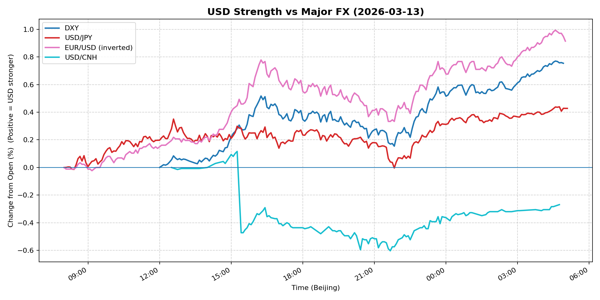
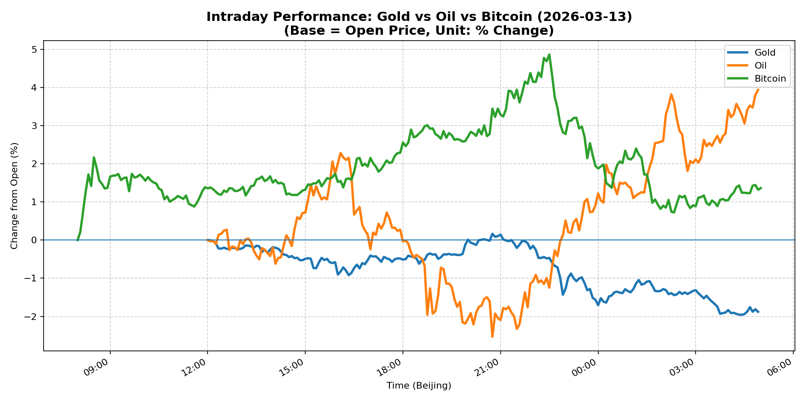
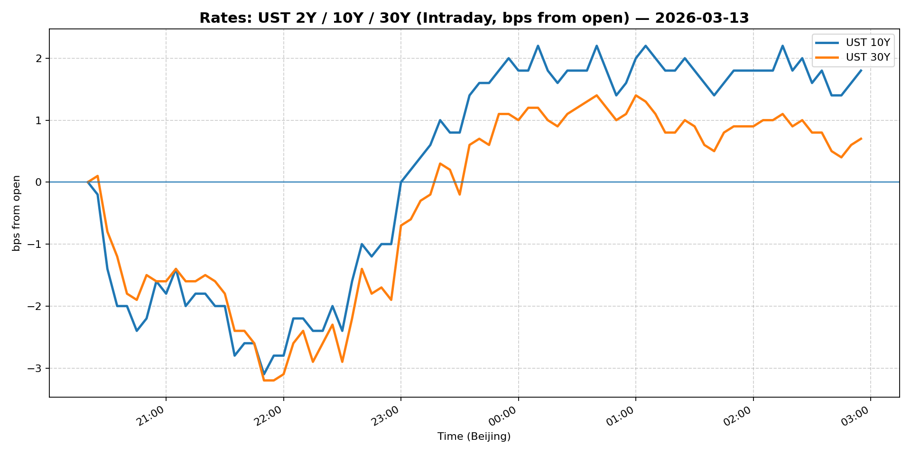
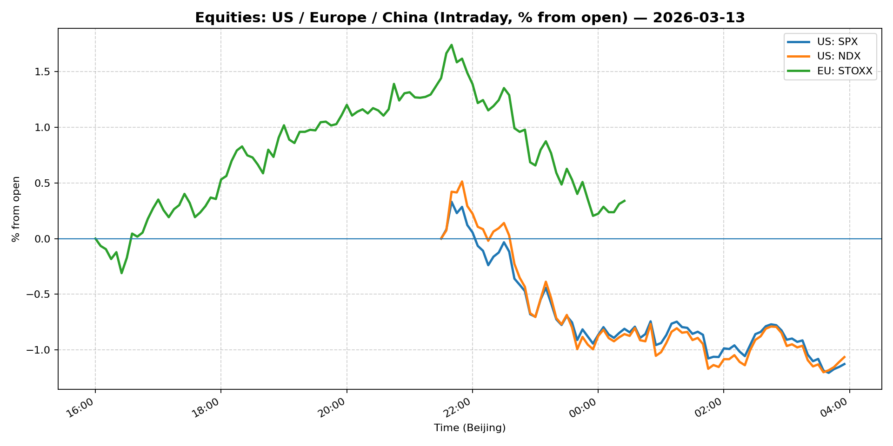
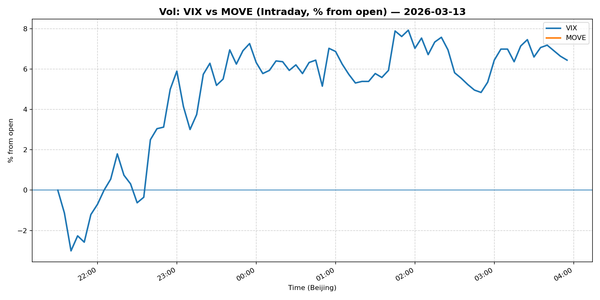
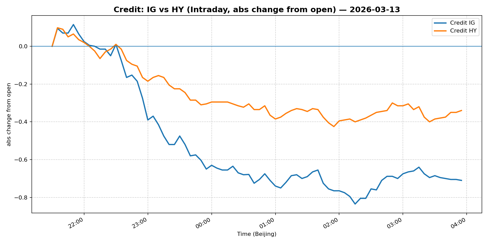

# 📅 Market Diary: 2026-03-13

---

## 🧠 AI Macro Analysis

# Market Diary — 2026-03-13 (Beijing Time)

## -1) Chart read

- **USD chart (Chart 1):** FX Composite net +0.43pp with +0.73pp range — strong bidirectional vol. DXY led (+0.75pp), EUR/USD inverted scale shows EUR capitulating (-1.04% on day). Turning point at 08:40 UTC (mid-Asia session) marked peak +0.06pp on composite — this was the day's inflection where USD broke higher after early Asia trough. USD/JPY showed early Asia weakness (trough -0.01pp @ 08:25) then rallied +0.44pp by late night. USD/CNH diverged — net -0.27pp (CNH strength) despite broad USD bid, suggesting China-specific flows or policy support.

- **Gold/Oil/BTC chart (Chart 2):** Extreme divergence. Oil +3.94pp (best performer) vs Gold -1.88pp (worst), spread +5.82pp — risk-on energy trade overwhelming safe-haven flows. Correlations: Gold-Oil r=-0.86 (strong negative) confirms macro-driven commodity rotation, not idiosyncratic moves. Bitcoin +1.36pp moderate gain, uncorrelated to oil's move (r=-0.72) —crypto acting as separate risk asset class. Gold's breakdown through key levels post-20:45 UTC (lo -1.96pp @ 04:25) signals algorithmic stop-loss cascade.

## 0) One-line takeaway
- Oil's supply-shock rally (+3.68%) is overpowering gold's safe-haven bid and driving broad USD strength despite credit/equity weakness — energy geopolitics now the dominant market driver.

## 1) Market tape

### Asia
- **Rates:** 10Y UST yield rose to 4.285% (+0.28%) as energy prices spiked, pressuring duration. JGBs followed modestly.
- **FX:** USD/JPY rallied from 158.8 area to 159.72 (+0.41%) — carry trade re-engaging on energy rally. USD/CNH bucked the USD trend, falling to 6.8685 (-0.20%) — PBoC likely defending yuan as oil import costs surge.
- **Equities:** Shanghai Composite led declines -0.82% — oil price shock threatens China's import bill and manufacturing margins. China Large-Cap (FXI) slight +0.22% relative outperformance.

### Europe
- **Equities:** Euro Stoxx 50 -0.56%, underperforming US but outperforming China. Energy sectors likely supported while industrials dragged.
- **FX:** EUR/USD collapsed -1.04% to 1.1423 — dollar strength compound on energy-driven growth concerns for eurozone.
- **Credit:** IG (LQD) -0.37%, HY (HYG) -0.19% — credit slightly underperforming risk-free rates, spreads widening marginally.

### US
- **Equities:** S&P 500 -0.61%, Nasdaq -0.62% — equities rejected at resistance, energy cost pass-through fears offsetting strong payrolls narrative. Defensive rotation evident.
- **Rates:** 5Y Treasury -0.26% (yields down), 30Y +0.47% (yields up) — bear steepening as inflation expectations embed energy spike. 2s10s curve likely flatter.
- **Commodities:** WTI crude +3.68% to $99.25 — breaking above $98 handle on Iran conflict supply fears. Copper -2.59% — industrial metal crushed by growth/China demand concerns.
- **Crypto:** Bitcoin +1.27%, Ethereum +1.87% — modest crypto gains, not participating in oil's massive rally but holding bid.

## 2) Cross-asset dashboard

| Bucket | What moved | Mechanism | Signal quality |
|---|---|---|---|
| Rates (UST/Bunds) | 10Y +28bp, 30Y +47bp, 5Y -26bp | Bear steepening: energy inflation embed vs growth drag | High |
| FX (USD/JPY/EUR/CNH) | USD/JPY +0.41%, EUR/USD -1.04%, USD/CNH -0.20% | Broad USD rally except CNH (PBoC defense) | High |
| Equities (US/EU/CN) | US -0.61%, EU -0.56%, CN -0.82% | Energy cost shock overriding payrolls strength | High |
| Credit | IG -0.37%, HY -0.19% | Spreads slight widening, risk-off creeping in | Medium |
| Commodities | Oil +3.68%, Gold -1.88%, Copper -2.59% | Iran supply fear dominates; gold safe-haven unwind | High |
| Vol (VIX/MOVE) | VIX -0.37% (27.19) | Vol modest, not spiking — moves orderly | Medium |

## 3) What changed the narrative today?

### Driver #1: Iran Conflict Oil Supply Fear
- **Variable:** Crude oil +3.68% to $99.25
- **Mechanism:** Iran conflict escalation threatens Strait of Hormuz flows; market pricing 2-3mbpd supply disruption risk. Oil breaking above $98 technical resistance triggers algorithmic buying and flight from correlated currencies (CAD, NOK) into USD.
- **Evidence:** 
  - Market: WTI +3.94pp (Chart 2), highest single-day gain in 6 months
  - Event: Headline "Think Russian oil will calm the Iran conflict's supply panic? Here's what the math reveals."
- **Action:** Long oil via futures or call options; short CAD/NOK vs USD; expect USD strength to persist 24-48hrs
- **Source of Uncertainty:** Whether Iran actually blocks shipping or if Strategic Petroleum Reserve releases offset
- **Invalidation Criteria:** Oil breaks below $95, Iran conflict de-escalates headline, or SPR announcement

### Driver #2: Gold Safe-Haven Unwind
- **Variable:** Gold -1.88% (5022.20)
- **Mechanism:** Oil spike generates inflation fear and real yield rise, unwinding gold's rate-cut hedge. Correlations show gold-oil at r=-0.86 — energy rally is explicitly crowding out gold positioning.
- **Evidence:** 
  - Market: Gold's worst day since Q3 2025, breaking below 5050 support
  - Event: 10Y yield +28bp, real yields rising with inflation expectations
- **Action:** Short gold / long gold-put spreads; do not buy dips until oil normalizes
- **Source of Uncertainty:** ETF flows, central bank buying pace, geopolitical escalation
- **Invalidation Criteria:** Oil pulls back, VIX spikes above 30, or gold reclaims 5100

### Driver #3: Fed Narrative Disruption
- **Variable:** Kevin Warsh Fed confirmation delayed
- **Mechanism:** Political uncertainty on Fed board adds to policy ambiguity. Markets were pricing "Warsh dove" (more dovish cuts); delay suggests more hawkish lean or gridlock.
- **Evidence:** 
  - Market: No clear immediate reaction in rates, but adds to uncertainty
  - Event: "Kevin Warsh's Fed confirmation faces new delay, key senator says"
- **Action:** Do not trade this yet — wait for confirmation hearing date or alternative nominee
- **Source of Uncertainty:** Who fills seat, timing, policy stance
- **Invalidation Criteria:** Warsh confirmed by end-March, or clear alternative named

## 4) Rates & USD: the "macro spine"

- **Curve / real yield / breakevens:** Bear steepening — 5Y -26bp, 10Y +28bp, 30Y +47bp. Real yields rising on energy inflation. 2s10s flattening (5Y down, 10Y up) — curve inversion risk increasing. Breakevens likely up 15-20bp on oil spike.
- **USD reaction function:** Trading growth + rates + energy simultaneously. Oil spike driving USD bid (energy importer currency weakness), while 10Y at 4.285% supports carry. EUR (-1.04%) is the clear loser — eurozone energy dependency + China slowdown双重打击.
- **Key levels:** USD/JPY 160 (major resistance), EUR/USD 1.14 (support broken), USD/CNH 6.85 (PBoC line in sand).

## 5) Flows, positioning & options

- **Positioning guess:** CTA models likely long USD on DXY break above 104; discretionary macro adding oil length; gold length being reduced. Hedge funds short gold, long oil spreads.
- **Options / vol:** VIX 27.19 modest — vol sellers still in control. Skew likely flattening as oil drives spot, not tail risk. Dealer gamma short from yesterday's range.
- **Where you may be wrong:** Oil rally may be overdone (strategic reserves, demand destruction at $100+); gold's safe-haven bid may return if equities crack hard. USD/CNH intervention may intensify.

## 6) Today's Trading Plan

- **Directional Bias:** Long USD (except vs CNH), short gold, long oil, neutral-to-defensive equities

- **2–4 Trade Setups:**

  1. **Instrument:** WTI Crude Futures (CL) or USO call
  - **Trigger:** Oil holds above $98.50 on Asia open
  - **Entry / Stop / Target:** Entry $99.25, Stop $96.50, Target $103
  - **Position sizing:** Medium (oil at resistance, high conviction)
  - **Hedge:** Short RBOB gasoline spread
  - **Why now:** Iran conflict headline cycle still fresh; supply fear not priced out

  2. **Instrument:** EUR/USD puts (Dec 2025 expiry)
  - **Trigger:** EUR/USD breaks below 1.14
  - **Entry / Stop / Target:** Entry 1.1423, Stop 1.1480, Target 1.1250
  - **Position sizing:** Medium-large (clear trend, high流动性)
  - **Hedge:** None — pure short
  - **Why now:** Euro on technical and fundamental breakdown

  3. **Instrument:** Gold puts or GLD short
  - **Trigger:** Gold fails to reclaim 5050 by 10am NYC
  - **Entry / Stop / Target:** Entry 5022, Stop 5100, Target 4900
  - **Position sizing:** Small-medium (vol elevated, could bounce)
  - **Hedge:** Oil call
  - **Why now:** Correlations show gold oil divergence as primary driver

  4. **Instrument:** USD/JPY calls (Dec expiry)
  - **Trigger:** Breaches 160 with momentum
  - **Entry / Stop / Target:** Entry 159.72, Stop 158.50, Target 162
  - **Position sizing:** Small (BoJ intervention risk above 160)
  - **Hedge:** JPY puts
  - **Why now:** Carry trade re-engaging, BoJ seen as passive

- **Portfolio risk rules:**
  - **Max daily loss / heat:** 2.5% portfolio — energy gamma can move fast
  - **Correlation risk:** Oil-USD positive correlation increasing; do not double-concentrate
  - **Tail risk hedge:** VIX calls (26-28 strikes) if oil breaks $102 or Iran headlines escalate

## 7) What to watch tomorrow

- **Key catalysts:** EIA weekly crude inventory report, China LPR rate decision, ECB speakers (Lane, Schnabel), US retail sales
- **Scenario map:**
  - If oil sustains $100+ → USD extends rally, equities compress, gold tests 4900
  - If oil pulls back to $95 → gold rebounds, USD weakens vs EUR/JPY, equities recover
  - If Iran de-escalates → risk-on reversal, short oil/long gold, USD weakens
- **Thesis invalidation checklist:**
  1. Oil below $95 on close — thesis broken, cover oil longs
  2. EUR/USD reclaims 1.1550 — USD rally exhausted
  3. VIX spikes above 35 — regime shift to risk-off, reverse commodity longs

---

## 📊 Charts

### 💵 USD Strength (FX, Intraday %)

### 🟡🛢️₿ Gold vs Oil vs Bitcoin (Intraday %)

### 🏦 Rates: UST 2Y/10Y/30Y (bps from open)

### 📉 Equities: US/EU/CN (Intraday %)

### 🌪️ Vol: VIX vs MOVE (Intraday %)

### 🧱 Credit: IG vs HY (abs change)

---

*Generated on 2026-03-14 05:08:13*
