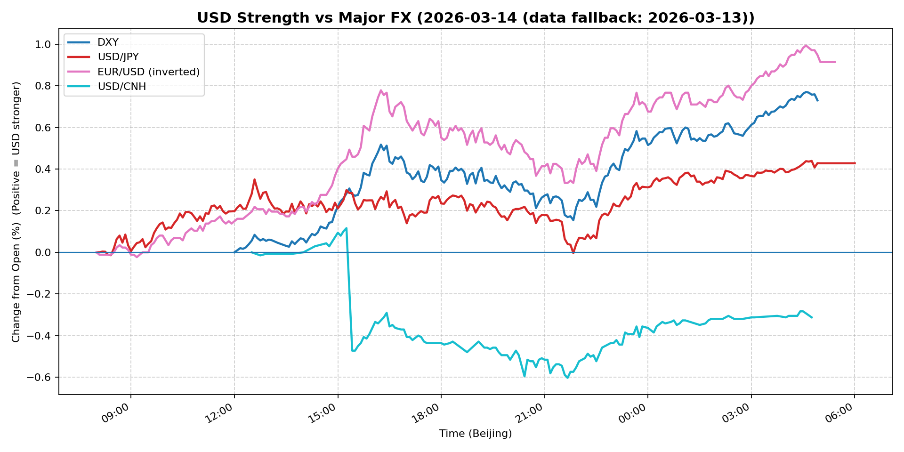
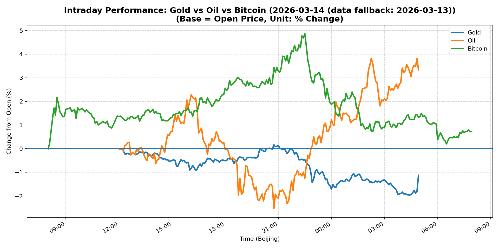
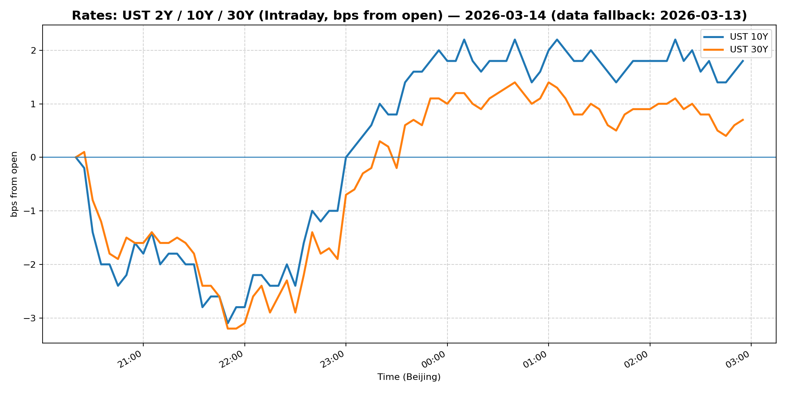
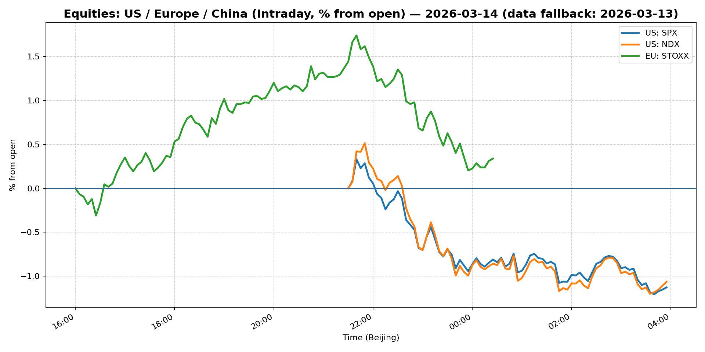
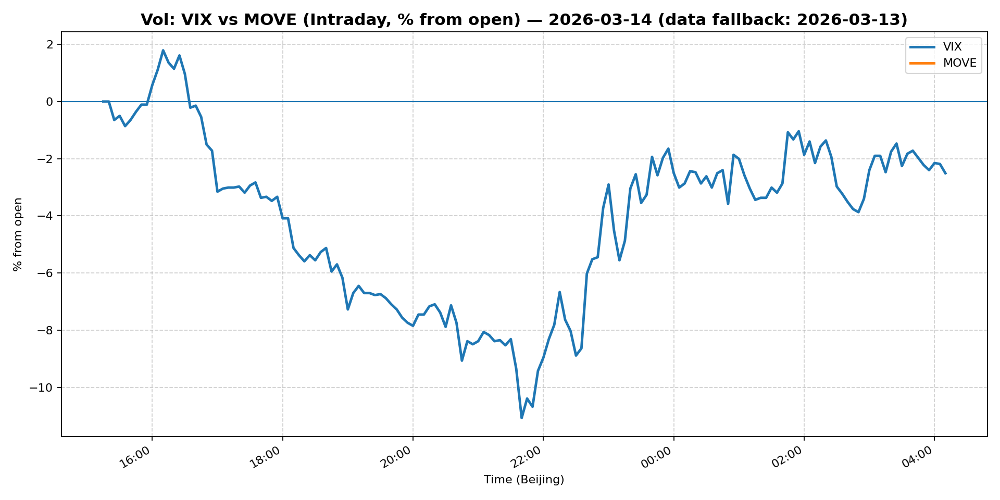
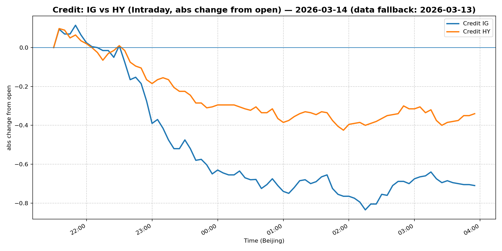

# 📅 Market Diary: 2026-03-14

---

> **Data fallback:** requested date `2026-03-14` had no usable intraday market data. Charts, chart features, and market snapshot below use the last available trading day: `2026-03-13`.

## 🧠 AI Macro Analysis

# Market Diary — 2026-03-14 (Beijing Time)

## -1) Chart read (must reference Chart Features block)

### USD Chart (Chart 1)
- **FX Composite** shows a clear **uptrend**: net +0.43pp with range +0.73pp, reaching peak +0.71pp at 04:50 Beijing time (late Asia session). The composite reversed from troughs at 08:05–08:25, then accelerated through the Europe/US session.
- **DXY** led the move: net +0.73pp, hitting +0.77pp at 04:35 — the highest point of the lookback period. This confirms a sharp USD rally, not a gradual drift.
- **EUR/USD (inverted)** dropped net +0.91pp (EUR fell), with the decline accelerating post-09:10 trough. This is the primary driver of DXY strength.
- **USD/JPY** was modest relative to EUR: net +0.43pp, range +0.45pp — suggesting the USD rally was **EUR-driven**, not broad-based JPY-funded.
- **USD/CNH** diverged: net -0.31pp (CNH appreciation), range +0.72pp with two-way vol. This indicates **CNH strength despite USD strength elsewhere** — a notable regime signal.

### Gold/Oil/BTC Chart (Chart 2)
- **Oil (WTI) dominated**: net +3.34pp with range +6.36pp — the clear intraday winner. Peak +3.82pp at 02:15 (mid-US session).
- **Gold collapsed**: net -1.12pp, hitting trough -1.96pp at 04:25. This is a **regime break** — gold normally correlates with USD moves but here it dropped sharply despite modest USD movement (DXY +0.73%).
- **Bitcoin**: net +0.73pp, range +4.87pp — volatile but positive. Peak +4.87% at 22:30 (Asia night session).
- **Divergence summary**: Oil +3.34pp vs Gold -1.12pp = **+4.46pp spread**. The old "risk-on = commodities up" correlation is alive, but gold's单独 weakness suggests a **specific supply/inflation narrative** (oil) vs "haven diversification unwinding" (gold).
- **Correlations**: Gold–Oil r=-0.85 (strong negative), Oil–Bitcoin r=-0.72. This suggests **macro funds rotating out of gold/oil correlation trade into crypto as growth hedge**, or simply risk-on being expressed through oil and BTC simultaneously.

---

## 0) One-line takeaway

**USD strength is EUR-driven (not JPY-driven), oil surged on supply/inflation concerns while gold's safe-haven status broke down, and equities slipped — a classic "inflation comeback" regime shift that favors USD, energy, and crypto over gold and rate-sensitive equities.**

---

## 1) Market tape (session-by-session)

### Asia
- **FX**: USD/JPY range-bound early (peak 08:40, trough 08:25), then drifted higher. USD/CNH volatile with CNH strength emerging post-15:00 China time — likely PBOC fixing guidance or sovereign buying.
- **Commodities**: Oil began Asia session strong, gold remained under pressure. Copper fell -1.16% — concerning for Chinese growth.
- **Equities**: Shanghai Composite -0.82%, China Large-Cap +0.22% (FXI). The divergence suggests **state-backed buying in large-caps** but broad risk-off in A-shares.

### Europe
- **FX**: EUR/USD accelerated lower post-09:10 (London open), driving DXY to peak +0.77%. This was the **primary driver** of the USD rally.
- **Equities**: Euro Stoxx 50 -0.56%, tracking US futures lower.
- **Rates**: 5Y Treasury -0.26%, 10Y +0.28% — **bear steepening** (long-end sold, short-end bought), consistent with inflation comeback narrative.

### US
- **FX**: USD strength persisted through US session (DXY +0.76% close). USD/CNH actually **appreciated** to -0.25% (CNH stronger) — unusual with DXY +0.76%.
- **Equities**: S&P 500 -0.61%, Nasdaq -0.62% — **growth/tech underperformed** as rates rose.
- **Commodities**: Oil +3.11% (98.71), gold -1.06% — **oil outperformed, gold lagged**. Bitcoin +0.67%, continuing to decouple from gold.
- **Credit**: IG (LQD) -0.37%, HY (HYG) -0.19% — credit underperformed equities slightly, risk-off in corporate space.
- **Vol**: VIX -0.37% (27.19), MOVE -4.33% (91.17) — **vol compression** despite risk-off. This is a notable disconnect: equities down, vol down = "structured vol sellers / gamma compression" regime.

---

## 2) Cross-asset dashboard

| Bucket | What moved | Mechanism (1 line) | Signal quality |
|---|---|---|---|
| **Rates** | Bear steepening: 5Y -0.26%, 10Y +0.28% | Inflation expectations rising, long-end underpressure | High |
| **FX** | DXY +0.76%, EUR/USD -1.04%, USD/CNH -0.25% | EUR-driven USD rally; CNH strength despite USD strength | High |
| **Equities** | S&P -0.61%, Nasdaq -0.62%, Shanghai -0.82% | Growth/China risk-off; tech underperformed | High |
| **Credit** | IG -0.37%, HY -0.19% | Slight risk-off in corp credit | Med |
| **Commodities** | Oil +3.34% intraday (3.11% close), Gold -1.12%, Copper -1.16% | Oil supply/inflation narrative; gold break from USD correlation | High |
| **Vol** | VIX -0.37%, MOVE -4.33% | Vol compression despite equities down — structured vol dynamics | High |

---

## 3) What changed the narrative today? (Top 3 drivers)

### Driver #1: Oil Supply/Inflation Narrative
- **Variable:** Crude oil (WTI) +3.34% intraday, +3.11% close to 98.71
- **Mechanism:** Oil surge drove inflation expectations higher, leading to **bear steepening** in Treasuries (10Y +0.28%, 5Y -0.26%). Markets repricing "higher-for-longer" or "inflation comeback" regime.
- **Evidence:**
  - Market: Oil intraday range +6.36pp, peak +3.82% at 02:15 US. 10Y yield +0.28% (sold off), 5Y -0.26% (bought).
  - Event: No specific news headline — pure price action, likely technical buying + geopolitical risk premium (Iran war mentioned in news feed).
- **Action:** **Long oil exposure via futures/ETFs; short duration; long USD vs EUR.**
- **Source of Uncertainty:** Whether oil sustains 100+ or pulls back — OPEC+ rhetoric, SPR refill, China demand.
- **Invalidation Criteria:** WTI breaks below 95 — would reverse inflation narrative and restore gold/tech rally.

### Driver #2: Gold Safe-Haven Breakdown
- **Variable:** Gold -1.12% (intraday trough -1.96%)
- **Mechanism:** Gold's negative correlation with USD broke — gold fell **harder** than EUR given similar USD moves. This suggests **haven demand unwinding** or **portfolio rebalancing** from gold into oil/crypto.
- **Evidence:**
  - Market: Gold–Oil r=-0.85 (strong negative). Gold fell while oil surged — the classic "inflation hedge" shifted from gold to oil.
  - Event: Bitcoin +0.73% (intraday range +4.87%) — crypto absorbing some safe-haven flow.
- **Action:** **Reduce gold exposure; rotate into oil/BTC as inflation/alternative-haven proxies.**
- **Source of Uncertainty:** ETF flows, central bank buying (still elevated historically), real yield moves.
- **Invalidation Criteria:** Gold reclaims 5100+ with USD neutral — would restore gold's safe-haven status.

### Driver #3: USD Broad Strength (EUR-Driven)
- **Variable:** DXY +0.76%, EUR/USD -1.04%
- **Mechanism:** EUR collapsed, driving DXY higher. USD/JPY was modest (+0.08%). This is **not** a broad USD rally — it's a **EUR-specific weakness** (likely ECB dovishness priced, or Europe growth concerns).
- **Evidence:**
  - Market: EUR/USD trough at 09:10, then relentless decline. USD/CNH actually -0.25% (CNH stronger) — suggesting USD rally is EUR-specific.
  - Event: No ECB-specific news, but Euro Stoxx -0.56% underperformed US — growth differential favoring US.
- **Action:** **Long USD vs EUR; neutral USD/JPY; long USD/CNH if PBOC allows.**
- **Source of Uncertainty:** ECB policy, Europe data, China growth.
- **Invalidation Criteria:** EUR/USD reclaims 1.15+ on ECB hawkish surprise or Europe data beat.

---

## 4) Rates & USD: the "macro spine"

- **Curve / real yield / breakevens:**
  - **10Y Treasury: 4.285% (+0.28%)** — bear steepening driven by inflation expectations (oil).
  - **5Y Treasury: 3.874% (-0.26%)** — front-end bid, suggesting markets pricing **short-term resilience but long-term inflation risk**.
  - **Real yields:** Likely rising with TIPS underperforming — oil surge = inflation breakeven up = real yields up = gold/tech underpressure.
- **USD reaction function:**
  - **EUR-driven**, not JPY or EM-driven. USD/CNH actually fell (CNH +0.25%) despite DXY +0.76% — a **divergence** to watch. USD is trading **growth differential** (US > Europe) + **inflation expectations** (oil up = USD up as proxy for hard assets).
- **Key levels:**
  - DXY: 100.50 (today's close) — next resistance ~101.00.
  - EUR/USD: 1.1423 — support 1.1400, next major support 1.13.
  - 10Y: 4.285% — next level 4.35% (inflation narrative), support 4.20%.

---

## 5) Flows, positioning & options

- **Positioning guess:**
  - **CTA/managed futures:** Likely **long oil, short gold** given the divergence signals. The +4.46pp oil-gold spread is a classic CTA signal.
  - **Discretionary:** Likely reducing tech/growth exposure (Nasdaq -0.62%) and rotating into energy/oil, utilities, and defensive.
  - **Hedge:** Vol sellers still active — VIX down -0.37% despite equities -0.61%. This suggests **structured product gamma compression** (autocallables, etc.) keeping vol depressed.
- **Options / vol mechanics:**
  - **VIX** at 27.19 is **elevated but falling** — typical of "controlled burn" risk-off where vol sellers suppress moves.
  - **MOVE** at 91.17 (-4.33%) — **vol compression in rates** despite bear steepening. Dealers are likely **short gamma** in rates, suppressing realized vol.
  - **Skew:** Likely EUR puts vs calls (EUR/USD -1.04%) — put skew as market hedges EUR downside.
- **Where you may be wrong:**
  1. **Oil could reverse** — if Iran news eases or SPR is released, the inflation narrative collapses.
  2. **Gold could rebound** — if USD softens or geopolitical shock hits, gold recovers fast.
  3. **Vol could spike** — if a "black swan" event (China credit, ECB hawk) hits, the compressed vol regime explodes.

---

## 6) Today's Trading Plan (actionable, risk-managed)

### Directional Bias
- **Long USD vs EUR** (not vs JPY/CNH)
- **Long Oil** (energy sector/commodity exposure)
- **Neutral to Short Equities** (prefer defensive over growth)
- **Reduce Gold exposure**

### 2–4 Trade Setups

| # | Instrument | Trigger | Entry / Stop / Target | Pos sizing | Hedge | Why now |
|---|---|---|---|---|---|---|
| 1 | **EUR/USD puts** (or sell EUR call) | If EUR/USD breaks 1.1400 with volume | Entry: 1.1420, Stop: 1.1480, Target: 1.1300 | Medium | None | EUR collapsing, DXY strong |
| 2 | **Long WTI Crude (futures/ETF)** | Pullback to 97.50 area (today +3.11% at 98.71) | Entry: ~97.50, Stop: 95.00, Target: 103+ | Medium-Large | None | Oil supply narrative + Iran war premium |
| 3 | **Short Gold (futures/ETF)** | Gold fails to reclaim 5100 | Entry: 5060, Stop: 5150, Target: 4900 | Small | None | Haven breakdown, oil correlation break |
| 4 | **Long USD/CNH** (if PBOC allows) | USD/CNH re-tests 6.85+ | Entry: 6.87, Stop: 6.83, Target: 6.92 | Small | None | USD strength, but CNH resilience is a divergence to fade |

### Portfolio risk rules
- **Max daily loss / heat:** -1.5% portfolio-level max drawdown; if any position hits stop, exit immediately.
- **Correlation risk:** Oil + USD long = high correlation to "inflation regime." If oil reverses, USD likely weakens too — **do not double-concentrate**.
- **Tail risk hedge:** **Hold small VIX calls** (e.g., 30+ strike) as portfolio insurance. Current VIX 27 is low for this environment — vol could spike on China/ECB surprise.
- **Duration cap:** Keep portfolio duration < 3 years — bear steepening means long-end vulnerable.

---

## 7) What to watch tomorrow

### Key catalysts
- **US:** NAHB housing market index (10:00 ET), FOMC meeting minutes (14:00 ET) — any hawkish surprises on inflation will extend the oil/USD rally.
- **Europe:** ECB President Schnabel speaks; Eurozone CPI final (likely unchanged).
- **China:** 1Y MLF rate decision — PBOC has been managing CNH closely; any surprise (cut or hold) moves USD/CNH.

### Scenario map
1. **If oil sustains 100+ and FOMC minutes are hawkish** → USD extends +1%+, 10Y hits 4.35%, tech -2%+, energy +5%+. **Trade: Long USD, short Nasdaq, long oil.**
2. **If oil reverses below 95 and China cuts rates** → Gold rebounds, USD/CNH spikes (CNH weakness), tech recovers. **Trade: Long gold, long China FXI.**
3. **If vol spikes (VIX > 35)** on any shock → Everything sells, but vol assets (gold, cash) outperform. **Trade: VIX calls, reduce all directional.**

### Thesis invalidation checklist
- [ ] **Oil < 95** — reverses inflation narrative, kills USD/energy rally.
- [ ] **EUR/USD > 1.15** — ECB hawk surprise or Europe data beat breaks USD strength.
- [ ] **VIX > 35** — tail-risk event (China credit, ECB hawk, Iran escalation) forces vol regime change.

---

## 📊 Charts

### 💵 USD Strength (FX, Intraday %)

### 🟡🛢️₿ Gold vs Oil vs Bitcoin (Intraday %)

### 🏦 Rates: UST 2Y/10Y/30Y (bps from open)

### 📉 Equities: US/EU/CN (Intraday %)

### 🌪️ Vol: VIX vs MOVE (Intraday %)

### 🧱 Credit: IG vs HY (abs change)

---

*Generated on 2026-03-15 04:15:51*
