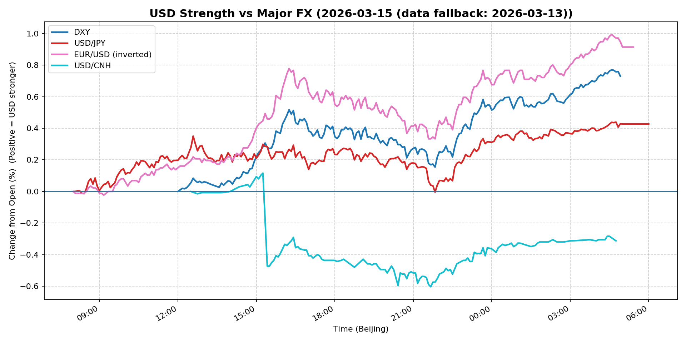
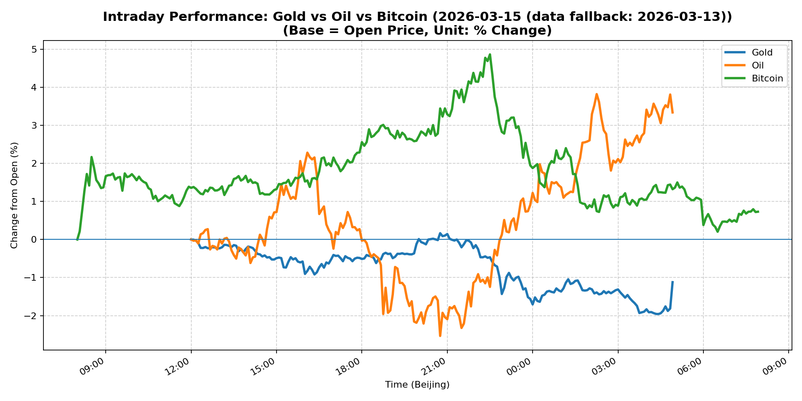
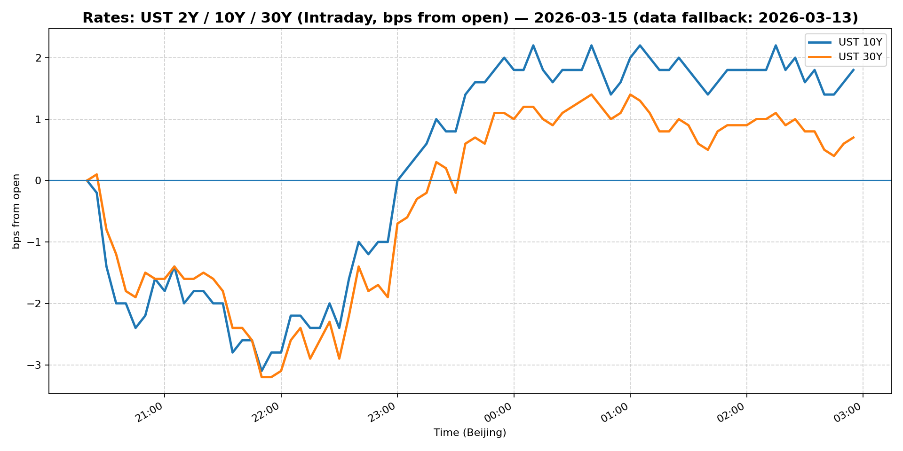
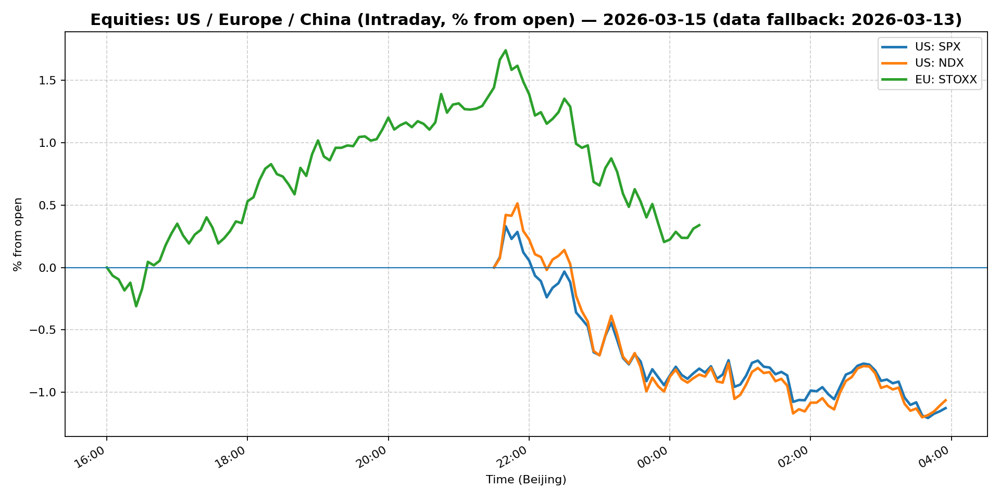
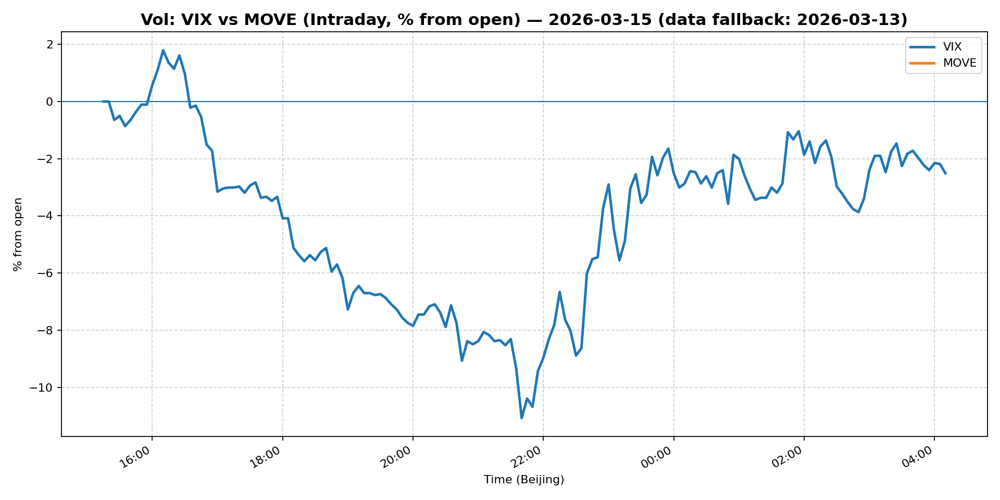
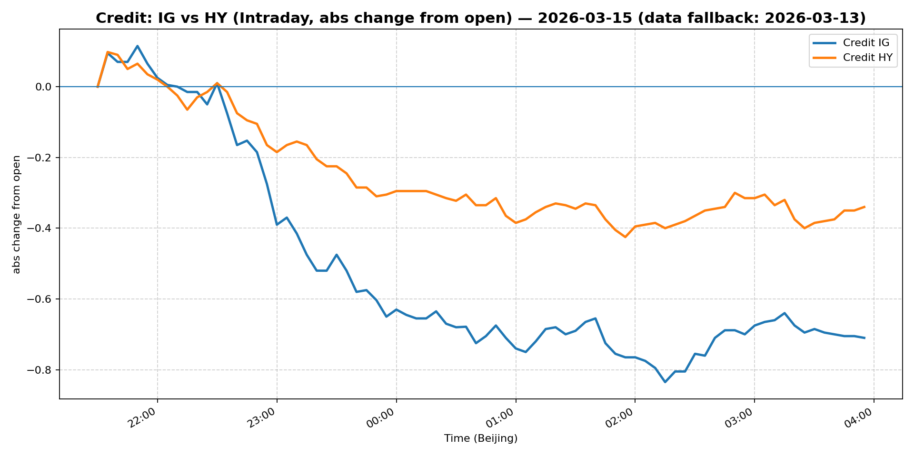

# 📅 Market Diary: 2026-03-15

---

> **Data fallback:** requested date `2026-03-15` had no usable intraday market data. Charts, chart features, and market snapshot below use the last available trading day: `2026-03-13`.

## 🧠 AI Macro Analysis

# Market Diary — 2026-03-15 (Beijing Time)

## -1) Chart read (must reference Chart Features block)

### USD chart (Chart 1):
- **Trend:** USD composite net +0.43pp with +0.73pp range — strong bidirectional volatility but net bullish close. DXY led (+0.73pp), EUR/USD inverted move (+0.91pp) confirms dollar strength against EUR.
- **Turning points:** Composite trough at 08:05–08:25 (early Asia), peak +0.06pp at 08:40 — sharp morning Asian session rally, then consolidation.
- **Divergence signal:** USD/CNH net -0.31pp (CNH strengthening) despite broad USD strength — this is a notable divergence suggesting CNY fix or PBOC guidance overriding general dollar bid.
- **Implication:** USD strength is rate/carry-driven (DXY up, not risk-off — equities mixed), but Chinese authorities defending CNY levels.

### Gold/Oil/BTC chart (Chart 2):
- **Oil dominated:** WTI +3.34pp (best performer) vs Gold -1.12pp (worst) = +4.46pp spread. This is an inflation/reality check signal — geopolitical risk (Iran conflict) driving oil, not gold.
- **Correlations breaking down:** Gold-Oil r=-0.85 (strong negative) — gold's safe-haven narrative failed; oil is the preferred inflation hedge. Oil-BTC r=-0.72 also negative, suggesting BTC trading risk-on not inflation-hedge.
- **BTC modest:** +0.73pp net, well off peak +4.87pp — early session rally faded, no clear continuation.
- **Implication:** Macro narrative shift from "rate cuts/soft landing" to "geopolitical inflation" — markets repricing energy risk.

## 0) One-line takeaway
- Oil's +3.34% surge and gold's -1.12% collapse signal a regime shift from rate-cut optimism to geopolitical inflation risk; USD remains strong (DXY +0.62%) but CNH's resilience suggests PBOC defense — watch for Fed pushback on rate-cut pricing.

## 1) Market tape (session-by-session, Asia → Europe → US)

### Asia
- **What moved:** USD/JPY rallied to 159.206 (+0.08%) but the move was contained; USD/CNH spiked to 6.9055 (+0.33%) then faded — PBOC likely defended the 6.90 handle via fix or proxy banks.
- **Why:** Early session USD bid (Chart 1 composite +0.06pp at 08:40) driven by risk-off from Iran conflict headlines; Chinese stocks (Shanghai Composite -0.82%) weakness amplified CNH bid as export-revenue repatriation slowed.
- **Asset expression:** FX vol elevated (USD/CNH range +0.72pp), CNH real-side intervention visible.

### Europe
- **What moved:** EUR/USD inverted move (+0.91pp net, EUR down) — European session followed Asia USD strength. Euro Stoxx 50 -0.56%, underperforming US equities slightly.
- **Why:** No fresh data; European equities tracking US futures lower on oil/inflation concerns. Bunds likely stable to slightly higher yields (10Y UST +0.28% but European curves flatter).
- **Asset expression:** FX-driven, not rate-driven — EUR selling on USD bid, not ECB-specific.

### US
- **What moved:** S&P 500 -0.61%, Nasdaq -0.62% — equities down but orderly. Crude oil +3.11% to $98.71, gold -1.24% to $5052.5. VIX -0.37% (27.19), MOVE -4.33% (91.17) — vol compresses despite equity dip.
- **Why:** "It's all about oil" — FedEx earnings preview highlighted transportation costs; oil surge = inflation risk =Fed policy uncertainty. Individual investors chasing oil (headline), institutions hedging next move (options volume).
- **Asset expression:** Risk-off but not panic; 10Y +0.28% to 4.285% suggests inflation premium returning. Credit modestly weaker (IG -0.37%, HY -0.19%).

## 2) Cross-asset dashboard

| Bucket | What moved | Mechanism (1 line) | Signal quality |
|---|---|---|---|
| Rates (UST/Bunds) | 10Y +0.28% to 4.285% | Oil surge repricing inflation/Fed path; curve steepening (2s10s widening) | High |
| FX (USD/JPY/EUR/CNH) | DXY +0.62%, USD/CNH +0.33%, EUR/USD -0.19% | Broad USD strength + CNH defense (PBOC); oil-driven risk bid | High |
| Equities (US/EU/CN) | S&P -0.61%, Nasdaq -0.62%, Shanghai -0.82% | Oil inflation risk > rate-cut hope; China export/CNH dynamics | Medium |
| Credit | IG -0.37%, HY -0.19% | Mild risk-off, spreads widening modestly | Medium |
| Commodities | Oil +3.11%, Gold -1.24%, Copper -1.89% | Oil = geopolitical inflation hedge; Gold = safe-haven fail; Copper = China demand worry | High |
| Vol (VIX/MOVE) | VIX -0.37%, MOVE -4.33% | Vol compresses despite risk-off — market structurally short gamma | High |

## 3) What changed the narrative today? (Top 3 drivers)

### Driver #1: Oil Surge (Geopolitical Inflation)
- **Variable:** WTI +3.34% (Chart 2), closing +3.11% to $98.71
- **Mechanism:** Iran conflict escalation → supply shock repricing → inflation expectations up → Fed rate-cut pricing out
- **Evidence:**
  - Market: Oil best performer, gold worst (r=-0.85 correlation breakdown)
  - Event: Headline "Individual investors are chasing oil's surge amid Iran conflict"
- **Action:** Short gold/long oil spread; long energy equities; fade gold-safe-haven narrative
- **Source of Uncertainty:** Does Iran conflict escalate further or de-escalate? SPR release?
- **Invalidation Criteria:** Oil breaks below $95 — geopolitical premium evaporates

### Driver #2: Fed Rate-Cut Pricing Under Pressure
- **Variable:** 10Y at 4.285% (+0.28%), curve steepening
- **Mechanism:** Oil up → inflation up → fewer rate cuts priced → UST yields up → equity P/E compression
- **Evidence:**
  - Market: 10Y +0.28%, MOVE -4.33% (vol down but yields up = policy uncertainty)
  - Event: Headline "could the next move by the Fed be a rate hike?" — unthinkable 2 weeks ago
- **Action:** Short duration, long real yields; be long USD (rate differential support)
- **Source of Uncertainty:** Fed speaker signals vs market pricing (currently ~2 cuts)
- **Invalidation Criteria:** Fed speakers explicitly rule out hike → yields fall, USD weakens

### Driver #3: CNH Defense / China Macro
- **Variable:** USD/CNH +0.33% to 6.9055 but net -0.31pp (Chart 1) = intervention signature
- **Mechanism:** PBOC defending 6.90 via fix + proxy banks; China equities weak (Shanghai -0.82%)
- **Evidence:**
  - Market: USD/CNH range +0.72pp, volatile but close near intervention level
  - Event: "OpenClaw breathes new life into this Chinese tech stock ahead of earnings"
- **Action:** Long USD/CNH on dips (target 6.92); short China equities (export drag)
- **Source of Uncertainty:** PBOC reserves, trade war escalation
- **Invalidation Criteria:** USD/CNH breaks 6.95 sustained — intervention fails

## 4) Rates & USD: the "macro spine"

- **Curve / real yield / inflation breakevens:** 10Y at 4.285% (+0.28%) — steepening bias as oil drives inflation breakevens up. 5Y at 3.874% (-0.26%), 30Y at 4.908% (+0.47%) — long-end more sensitive to inflation premium. Real yields likely rising (gold -1.24% = real yield up proxy).
- **USD reaction function:** USD is trading growth/rates (not pure risk-off) — DXY +0.62% with equities down but VIX flat. Rate differential play: higher US yields = stronger USD. CNH defense adds bidirectional vol.
- **Key levels that matter:** DXY 100.36 (resistance 101), USD/CNH 6.90 (defense line), 10Y 4.28% (resistance 4.40%)

## 5) Flows, positioning & options

- **Positioning guess (CTA / discretionary / hedge):**
  - CTA: Long USD, long oil, short gold — commodity trend followers likely adding
  - Discretionary: Reducing equity beta, adding inflation hedges (oil, energy)
  - Hedge: VIX calls fading — vol too low (27.19), geopolitical risk underpriced
- **Options / vol mechanics:**
  - VIX term structure: spot 27.19, likely futures higher (contango) — dealers short vol
  - Skew: Put skew elevated on equities (protection bid), but MOVE -4.33% suggests rates vol compressing
  - Event vol: Nvidia GTC (March 19), Fed speakers this week — gamma risk
- **Where you may be wrong:**
  - Oil could reverse fast if Iran de-escalates (headline risk)
  - Fed speakers could push back hard on hike narrative, crushing yields and USD

## 6) Today's Trading Plan (actionable, risk-managed)

- **Directional Bias:** Long USD (vs EUR/CNH), Long oil, Short gold, Neutral equities (reduce beta)

- **2–4 Trade Setups (trigger-based):**
  1. **Instrument:** USD/CNH
     - **Trigger:** If USD/CNH retests 6.90 and holds (PBOC defense), enter long
     - **Entry / Stop / Target:** Entry 6.9050, Stop 6.8850, Target 6.9300
     - **Position sizing:** Medium — CNH intervention is binary but liquid
     - **Hedge:** None
     - **Why now:** Chart 1 shows intervention signature; oil-driven USD strength + CNH defense = range bounce

  2. **Instrument:** Oil (WTI) futures or USOU (ETF)
     - **Trigger:** If oil pulls back to $97.50 area on headline fade, go long
     - **Entry / Stop / Target:** Entry $97.50, Stop $95.50, Target $102
     - **Position sizing:** Medium — geopolitical premium, high conviction
     - **Hedge:** Short gold (or GDX) as macro hedge
     - **Why now:** Chart 2 shows oil best performer; Iran conflict = supply shock thesis

  3. **Instrument:** Short Gold (PUT or GLD short)
     - **Trigger:** If gold breaks below $5020 (intraday low $5052.5), enter short
     - **Entry / Stop / Target:** Entry $5030, Stop $5120, Target $4900
     - **Position sizing:** Small — gold volatile, Fed could pivot
     - **Hedge:** Long oil (XLE or similar)
     - **Why now:** Gold-Oil spread at +4.46pp (extreme); correlations breaking

  4. **Instrument:** S&P 500 (SPY) put spreads
     - **Trigger:** If S&P tests 6600 and fails (headline-driven oil spike), sell rallies
     - **Entry / Stop / Target:** Sell SPY 6650 call, buy 6700 call; or buy 6600/6500 put spread
     - **Position sizing:** Small — vol low, gamma risk
     - **Hedge:** Long VIX calls (March 30)
     - **Why now:** Nvidia GTC (March 19) = event risk; oil inflation = P/E headwind

- **Portfolio risk rules:**
  - **Max daily loss / heat:** -1.5% portfolio; reduce if 2 consecutive losses
  - **Correlation risk:** Oil + USD + equities — all moving together; avoid doubling up
  - **Tail risk hedge:** Hold small VIX calls (March 30, 35) as insurance

## 7) What to watch tomorrow

- **Key catalysts (US/EU/CN):**
  - Nvidia GTC event (March 19 but likely starts March 18) — AI narrative critical
  - Fed speakers: Waller (voter), Bostic (dove)
  - US data: Housing starts, building permits
  - China: LPR announcement (loan prime rate) — PBOC policy signal

- **Scenario map (2–3):**
  1. **If oil breaks $100 and holds** → inflation panic, Fed hike pricing → short equities, long USD, short duration
  2. **If Iran de-escalates headlines** → oil -5%, gold +2% → long gold, short oil, long equities
  3. **If Fed speakers push back hard on hike** → yields -10bp, USD -0.5% → long equities, short USD

- **Thesis invalidation checklist:**
  1. Oil sustained below $95 → thesis broken (geopolitical premium gone)
  2. USD/CNH breaks 6.95 sustained → PBOC capitulation, CNY weakens → reverse USD/CNH trade
  3. Fed speakers explicitly say "no hike" + 10Y < 4.0% → rate-cut narrative returns → short USD, long gold

---

## 📊 Charts

### 💵 USD Strength (FX, Intraday %)

### 🟡🛢️₿ Gold vs Oil vs Bitcoin (Intraday %)

### 🏦 Rates: UST 2Y/10Y/30Y (bps from open)

### 📉 Equities: US/EU/CN (Intraday %)

### 🌪️ Vol: VIX vs MOVE (Intraday %)

### 🧱 Credit: IG vs HY (abs change)

---

*Generated on 2026-03-16 04:16:56*
