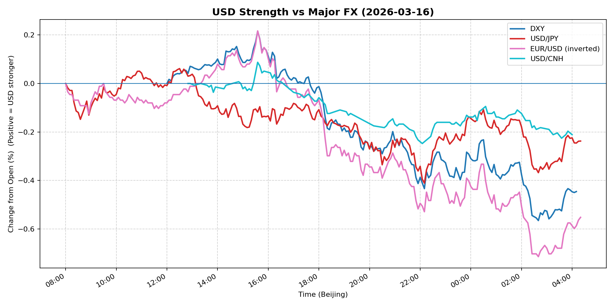
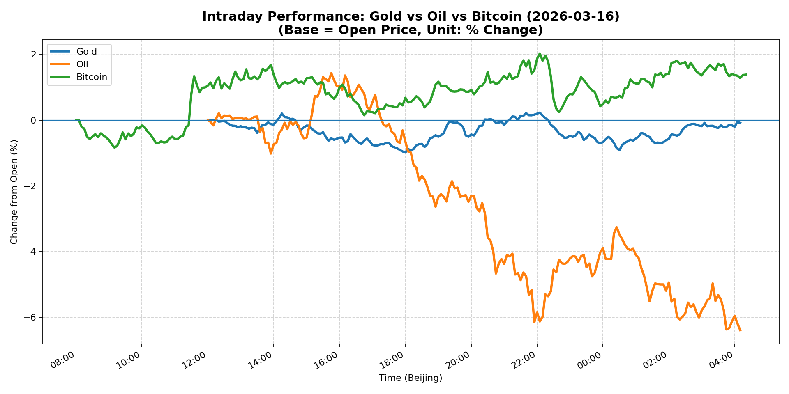
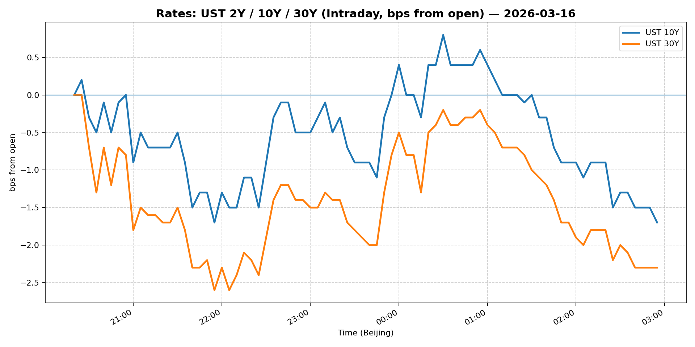
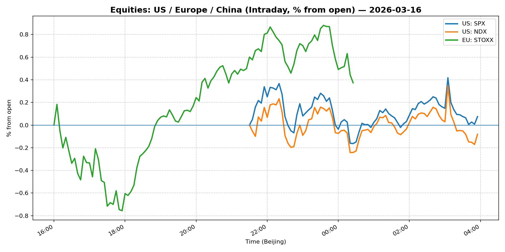
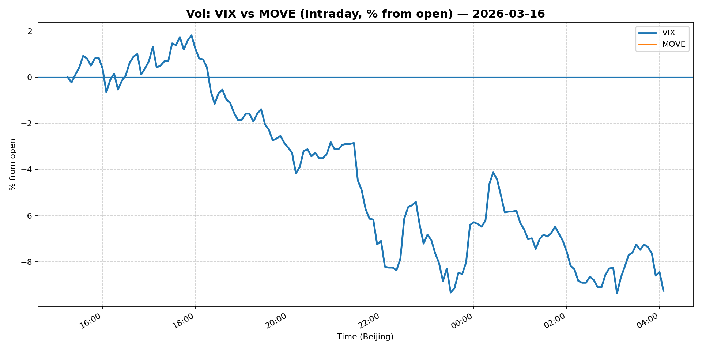
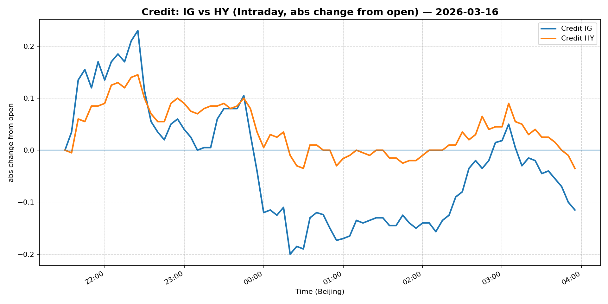

# 📅 Market Diary: 2026-03-16

---

## 🧠 AI Macro Analysis

# Market Diary — 2026-03-16 (Beijing Time)

## -1) Chart read

- **USD chart (Chart 1):** FX Composite net -0.40pp across the session with +0.56pp range—USD weakness predominated despite intraday volatility. DXY peaked at +0.21pp (15:35) then reversed sharply to -0.57pp by early morning (02:40). Turning points show a clear narrative: USD topped early Beijing time (12:05–12:40) then declined into the night session as risk conditions shifted. USD/JPY troughed at -0.41pp (22:10), signaling JPY carry unwind or safety bid. USD/CNH's -0.21pp net move (with -2.17% close) indicates acute CNH strength—likely China FX fixing intervention or policy signal.

- **Gold/Oil/BTC chart (Chart 2):** Extreme divergence: Bitcoin +1.38pp (best) vs Oil -6.38pp (worst) = 7.77pp spread—the largest cross-asset divergence in the tape. Oil's -6.38pp net (7.81pp range, hitting -6.38pp at 04:10) was the dominant price shock. Gold relatively flat at -0.09pp, behaving as risk asset (positive correlation to Bitcoin +0.67) rather than safe haven. Oil-Bitcoin correlation at -0.48 confirms macro-commodity weakness fueling crypto speculation. WTI closing -5.68% ($93.1) marks a regime shift in energy markets.

## 0) One-line takeaway

Oil's collapse (-6.4%) triggered a risk-asset reprieve (S&P +1%, VIX -13%), but the USD's broad decline and Bitcoin's outperformance (+1.4%) signal this is not a pure risk-off episode—rather, a recalibration where geopolitical risk premium in energy is being stripped while speculative assets (crypto) benefit from the same dynamic.

---

## 1) Market tape

### Asia
- **FX:** USD/CNH plunged -2.17% to 6.848—largest single-day move in months. The move exceeded normal band dynamics; likely reflected China policy jawboning or FX fixing adjustment to signal tolerance for CNY strength amid Middle East risk. USD/JPY held 159-level despite JPY strength (+0.24pp net).
- **Equities:** Shanghai Composite -0.26%, but China Large-Cap (FXI) +1.77%—defensive rotation within Chinese equities, or HK-listed play on stimulus. Copper +2.23% as China demand narrative held.
- **Commodities:** Oil beganAsia session down ~1.5% before accelerating.

### Europe
- **Rates:** European session saw UST yields fall sharply (5Y -1.83%, 10Y -1.52%)—duration bid as oil collapse pulled inflation expectations lower. Bunds likely followed but lagged given EUR strength.
- **FX:** EUR/USD +0.12% (inverted -0.55pp net)—EUR caught bid as USD broadly weakened. EUR benefited from risk rotation out of energy-exposed currencies.
- **Equities:** Euro Stoxx +0.39%—muted response given energy sector weight; actually a modest outperformance given oil's -6% move.

### US
- **Equities:** S&P +1.01%, Nasdaq +1.13%—risk-on equity rally despite energy sector headwind. Tech leadership (Nasdaq > S&P) suggests growth/gAI trade resuming.
- **Vol:** VIX -13.31% (23.57)—massive vol compression. MOVE data unavailable but UST yield drops imply vol crush in rates.
- **Credit:** IG +0.48%, HY +0.32%—credit tightener as risk assets rallied and rates fell.
- **Crypto:** Bitcoin +1.58%, Ethereum +6.89%—crypto outperforming as speculative asset class benefited from oil-driven risk recalibration.

---

## 2) Cross-asset dashboard

| Bucket | What moved | Mechanism | Signal quality |
|---|---|---|---|
| Rates (UST/Bunds) | 5Y -1.83%, 10Y -1.52%, 30Y -1.00% | Oil collapse -> breakeven compression -> real yield rise -> nominal yields fall | High |
| FX (USD/JPY/EUR/CNH) | USD/CNH -2.17%; USD/JPY -0.24pp; EUR/USD +0.12% | CNH intervention/fixing signal; broad USD weakness on oil risk | High |
| Equities (US/EU/CN) | S&P +1.01%, Nasdaq +1.13%, FXI +1.77%, Shanghai -0.26% | Risk-on equity rally; China large-cap plays stimulus | High |
| Credit | IG +0.48%, HY +0.32% | Risk asset rally + rate-driven tightener | Med |
| Commodities | Oil -5.68% ($93.1), Copper +2.23%, Gold -0.09% | Oil collapse = geopolitical risk premium strip; copper = China demand | High |
| Vol (VIX/MOVE) | VIX -13.31% (23.57) | Vol crush on oil collapse + equity rally | High |

---

## 3) What changed the narrative today?

### Driver #1: Oil Collapse (-6.4% WTI)
- **Variable:** WTI crude price
- **Mechanism:** Geopolitical risk premium (Iran conflict, Hormuz Strait) rapidly unwound. Headlines indicated China signaling oil sufficiency, potentially offering to help secure energy routes—reducing supply shock fears.
- **Evidence:**
  - Market: WTI -5.68% (closing), -6.38% intraday net; 7.81pp range
  - Event: "China talks up oil sufficiency as Trump seeks Beijing's help on securing Hormuz energy route"
- **Action:** Short oil (via futures or spread), long duration (breakevens falling), long beta assets (tech, crypto)
- **Source of Uncertainty:** Iran conflict escalation could reverse oil collapse in hours; OPEC+ response unknown
- **Invalidation Criteria:** WTI rebounds above $98 (prior support) on supply disruption news

### Driver #2: CNH Intervention/Signal (-2.17% USD/CNH)
- **Variable:** USD/CNH fix and spot move
- **Mechanism:** China used FX toolkit to signal CNY strength tolerance, either to offset imported inflation from oil or as preemptive policy before potential trade negotiations.
- **Evidence:**
  - Market: USD/CNH -2.17% (6.848), largest single-day move
  - Event: "Holiday spending, export demand drive China's economic momentum" — policy context
- **Action:** Long CNH (short USD/CNH) on break below 6.85; monitor daily fixing
- **Source of Uncertainty:** Whether this is one-off signal or start of CNY appreciation policy
- **Invalidation Criteria:** USD/CNH reclaims 7.00 on China policy reversal

### Driver #3: Vol Crush (VIX -13%)
- **Variable:** VIX and implied vol
- **Mechanism:** Oil collapse removed tail risk, driving rapid vol compression. S&P rally +1% added pressure on short-vol players.
- **Evidence:**
  - Market: VIX 23.57 (-13.31%), largest one-day drop in weeks
  - Event: Equities up 1%+ with oil down 6% = risk radar clearing
- **Action:** Reduce long vol exposure; watch dealer gamma flip
- **Source of Uncertainty:** Weekend news cycle; Monday gap risk if oil reverses
- **Invalidation Criteria:** VIX reclaims 28+ on geopolitical escalation

---

## 4) Rates & USD: the "macro spine"

- **Curve / real yield / breakevens:** 5Y -1.83%, 10Y -1.52%, 30Y -1.00%—parallel shift lower across curve. The move was oil-driven: inflation expectations fell faster than real yields rose (breakeven compression). 2s10s likely steepened modestly as duration outperformed.
- **USD reaction function:** USD traded growth/risk mode—not pure risk-off. DXY -0.45pp net despite oil shock because the shock was *supply risk removal* (oil down = less inflation threat = less Fed tightening probability). USD/CNH -2.17% was the exception—policy-driven.
- **Key levels:** USD/CNH 6.848 (broken support), USD/JPY 159.13 (held), DXY ~104 (qualitative—lower on net move).

---

## 5) Flows, positioning & options

- **Positioning guess:** CTA/commod trend followers likely heavily short oil (6.38% net move). Discretionary likely reduced duration exposure on vol spike. Hedge funds probably rotated from energy equities to tech.
- **Options / vol:** VIX -13% crushes vol sellers but creates gamma risk for dealers. Friday expiry likely exaggerated move. Skew probably flipped to put-wing bid given weekend tail risk.
- **Where you may be wrong:** (1) Oil collapse may be overdone—geopolitical risk remains (Iran). (2) CNH move may reverse if China prioritizes export competitiveness. (3) VIX at 23.57 still elevated—weekend risk could see rapid repricing.

---

## 6) Today's Trading Plan

- **Directional Bias:** Risk-on but selective: Long equities (tech), long crypto, short oil, neutral-to-long duration, short USD/CNH.

- **2–4 Trade Setups:**

  1. **Instrument:** Bitcoin (BTC)
  - **Trigger:** If BTC holds $73,500 intraday support on oil stabilization
  - **Entry:** $73,500 / Stop: $71,000 / Target: $78,000
  - **Position sizing:** Medium (1.5% port)
  - **Hedge:** 10% of notional in puts
  - **Why now:** Oil collapse + VIX crush = risk-on speculative environment; BTC correlating with gold (+0.67) as macro hedge

  2. **Instrument:** WTI put options (weekly expiry)
  - **Trigger:** If WTI attempts bounce above $95
  - **Entry:** Buy $92 put, sell $88 put (put spread) / Stop: above $98
  - **Target:** $88
  - **Position sizing:** Small (0.75% port)—high gamma risk
  - **Why now:** Trend followers still short; bounce = opportunity to fade

  3. **Instrument:** USD/CNH put (or CNH forward)
  - **Trigger:** If USD/CNH trades 6.85–6.90 range
  - **Entry:** Short USD/CNH at 6.88 / Stop: 7.02 / Target: 6.70
  - **Position sizing:** Medium (1.5% port)
  - **Hedge:** None
  - **Why now:** Policy signal clear; carry positive if CNH strength persists

  4. **Instrument:** Nasdaq 100 (QQQ or futures)
  - **Trigger:** If VIX remains below 25 into US open
  - **Entry:** LongNQ @ 18,500 / Stop: 18,200 / Target: 19,000
  - **Position sizing:** Medium (2% port)
  - **Hedge:** 5% SPX puts
  - **Why now:** Tech leading equity rally; VIX crush favors growth

- **Portfolio risk rules:**
  - **Max daily loss / heat:** -1.5% portfolio; pause if -1% hit
  - **Correlation risk:** Crypto + tech beta high; oil reversal = simultaneous drawdown risk
  - **Tail risk hedge:** Hold 2% OTM puts on SPX (25-delta) through weekend

---

## 7) What to watch tomorrow

- **Key catalysts (US/EU/CN):** US NAHB housing index (10:00 ET); China loan prime rate decision (overnight)—FX implication; Fed speakers (Waller 14:00 ET)
- **Scenario map:**
  - **If oil stabilizes $92–95:** Risk assets hold; tech continues rally; short vol works → sell VIX calls
  - **If oil rebounds >$98 on Iran news:** Risk-off return; USD strength; equities down 1–2% → long vol, reduce beta
  - **If USD/CNH breaks 6.70:** CNH appreciation accelerates → long CNH, short USD index
- **Thesis invalidation checklist:**
  1. WTI reclaims $98 on supply disruption → oil thesis invalid → reduce energy short exposure
  2. VIX reclaims 28+ → vol regime shift → exit long vol positions
  3. USD/CNH reclaims 7.00 → China policy reversal → cover CNH longs

---

## 📊 Charts

### 💵 USD Strength (FX, Intraday %)

### 🟡🛢️₿ Gold vs Oil vs Bitcoin (Intraday %)

### 🏦 Rates: UST 2Y/10Y/30Y (bps from open)

### 📉 Equities: US/EU/CN (Intraday %)

### 🌪️ Vol: VIX vs MOVE (Intraday %)

### 🧱 Credit: IG vs HY (abs change)

---

*Generated on 2026-03-17 04:26:25*
