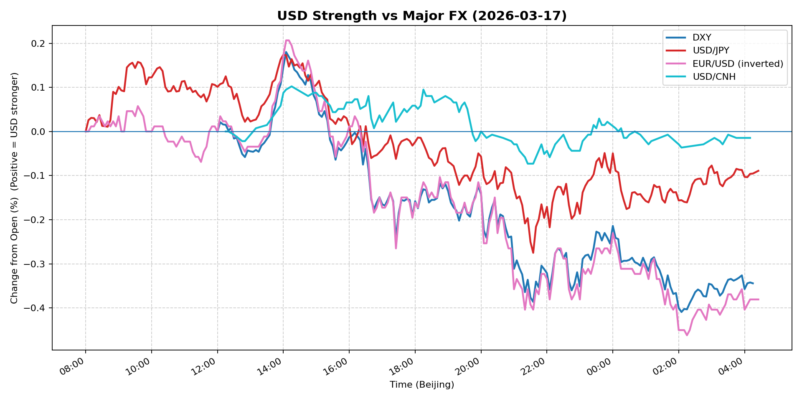
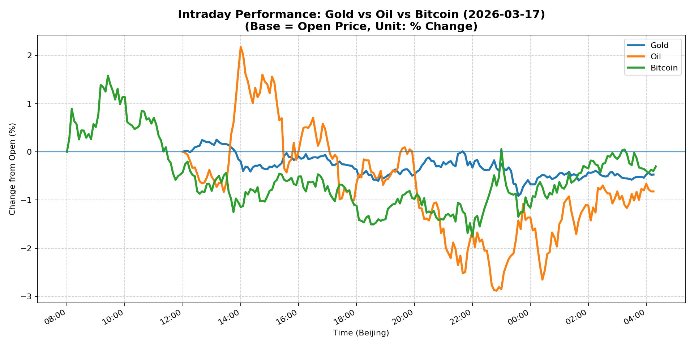
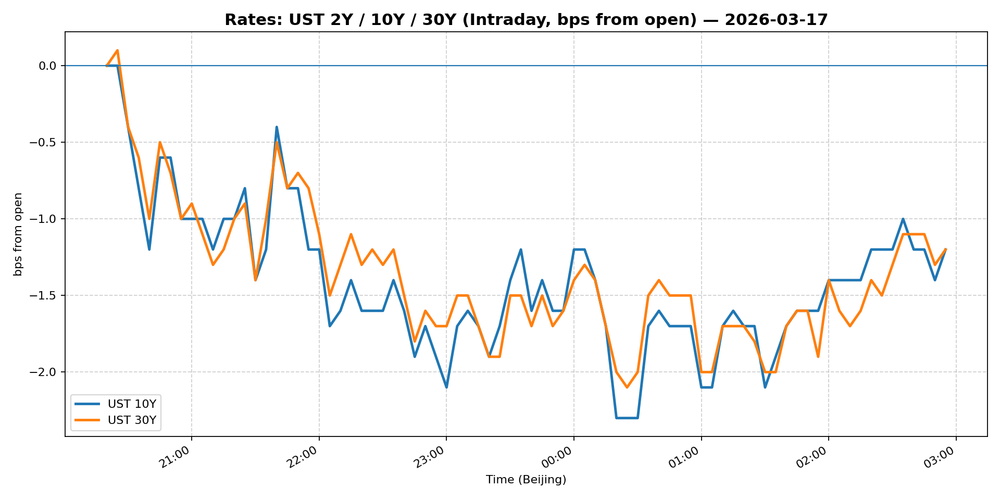
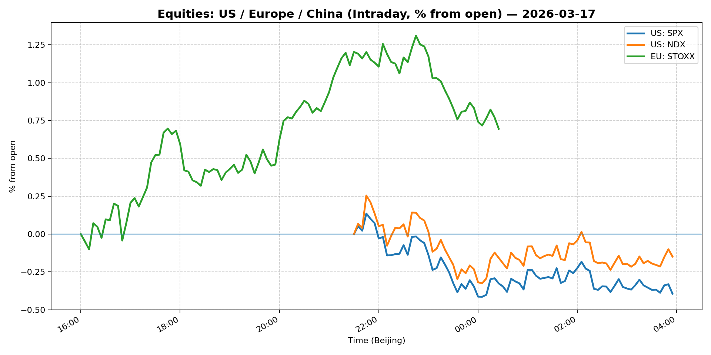
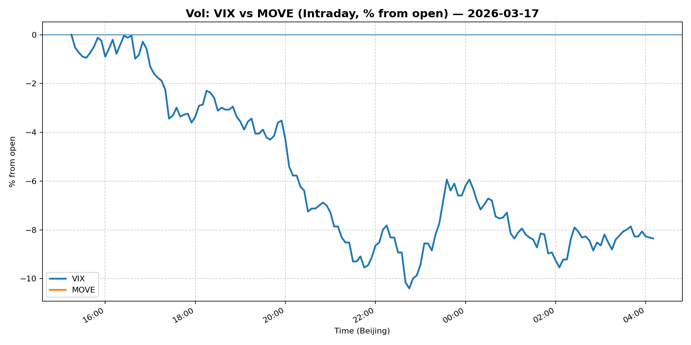
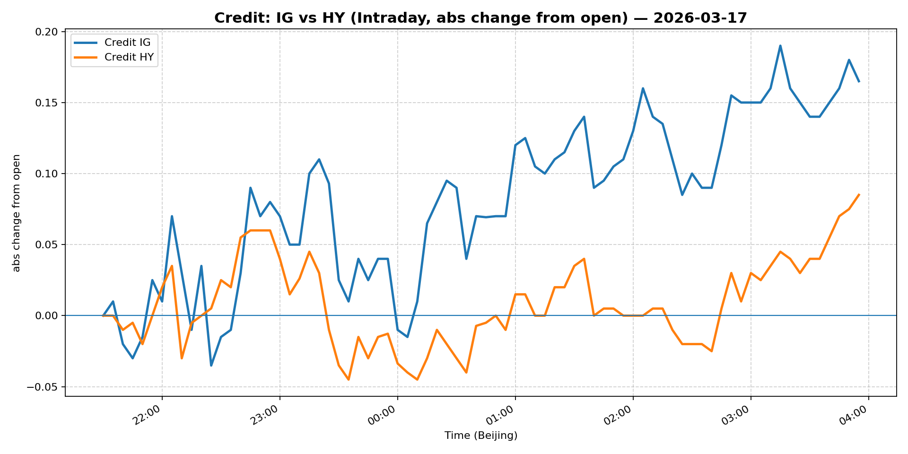

# 📅 Market Diary: 2026-03-17

---

## 🧠 AI Macro Analysis

# Market Diary — 2026-03-17 (Beijing Time)

## -1) Chart read (must reference Chart Features block)

- **USD chart (Chart 1):** FX Composite shows net -0.23pp decline with range +0.45pp, indicating moderate USD weakness intraday. DXY net -0.34pp and USD/JPY net -0.09pp both trended lower after morning peaks around 08:10-08:50. EUR/USD net -0.38pp (inverted) confirms euro strength. USD/CNH net -0.01pp held relatively stable. The composite hit high +0.16pp at 14:05 before declining to low -0.28pp by 21:35 — suggesting USD lost momentum through the session.

- **Gold/Oil/BTC chart (Chart 2):** Clear divergence: Bitcoin performed best (net -0.30pp), Gold intermediate (net -0.47pp), Oil worst (net -0.82pp despite +2.04% price gain — likely referring to intraday swing). The 0.52pp spread between best/worst signals regime shift from commodity-linked risk to digital/property assets. Correlations remain low (Gold-Oil r=+0.24, Gold-BTC r=+0.03), confirming divergent driver sets.

## 0) One-line takeaway

USD weakness, falling Treasury yields, and surging oil (Strait of Hormuz risk) created a mixed macro environment — equities and credit rallied on risk-on, while gold/BTC corrected, signaling a rotation from safe-haven digital assets into traditional risk assets.

## 1) Market tape (session-by-session, Asia → Europe → US)

### Asia
- **FX:** USD/JPY fell -0.33% to 159.04 as early session risk-on persisted; USD/CNH slid -2.22% to 6.8445, unusual move suggesting CNY strength or PBOC guidance.
- **Equities:** Shanghai Composite fell -0.85% (outlier to global rally), China Large-Cap flat. Taiwan/Korea markets likely followed tech momentum.
- **Commodities:** Copper -0.31%, modest pullback after recent strength.

### Europe
- **Equities:** Euro Stoxx 50 +0.53%, continuing overnight US rally.
- **FX:** EUR/USD +0.92%, major driver of USD weakness.
- **Credit:** European IG/HY spreads likely tightened in sympathy with US credit.

### US
- **Equities:** S&P 500 +0.25%, Nasdaq 100 +0.51% — tech-led rally continuing, supported by falling VIX (-4.81%).
- **Rates:** 5Y -0.45%, 10Y -0.43%, 30Y -0.14% — yields fell sharply, indicating safe-haven flows or post-FOMC positioning.
- **Credit:** LQD +0.56%, HYG +0.45% — credit tightener on risk-on.
- **Crypto:** Bitcoin -0.42%, Ethereum -1.12% — digital assets corrected as risk sentiment improved.

## 2) Cross-asset dashboard

| Bucket | What moved | Mechanism (1 line) | Signal quality |
|---|---|---|---|
| Rates (UST/Bunds) | 5Y/10Y/30Y fell 14-45bp | Flight to safety or post-FOMC positioning ahead of Wednesday decision | High |
| FX (USD/JPY/EUR/CNH) | Broad USD weakness; EUR +0.92%, JPY -0.33%, CNH -2.22% | Risk-on + ECB hawkish signals; CNH outlier (PBOC?) | High |
| Equities (US/EU/CN) | US/EU up +0.25-0.53%, China down -0.85% | Global risk-on except China (stimulus disappointment?) | Med |
| Credit | IG +0.56%, HY +0.45% | Risk-on equity rally drives spread compression | Med |
| Commodities | Oil +2.04% to 3yr high; Gold +0.29%, Copper -0.31% | Strait of Hormuz disruption; gold profit-taking | High |
| Vol (VIX/MOVE) | VIX -4.81% | Significant vol collapse signals reduced tail risk pricing | High |

## 3) What changed the narrative today?

### Driver #1: Strait of Hormuz Oil Supply Disruption
- **Variable:** Global oil supply shock risk
- **Mechanism:** Shipping activity limited through Strait of Hormuz drives WTI to 3-year high (+2.04%), creating inflation shock and risk-off hedge demand
- **Evidence:**
  - Market: Oil +2.04% to 95.41, 3-year high
  - Event: News headline confirmed Strait of Hormuz shipping disruption
- **Action:** Long oil-exposed equities (energy majors) short-term; watch for inflation expectations lifting UST real yields
- **Source of Uncertainty:** Duration of disruption; US/Iran diplomatic response
- **Invalidation Criteria:** Oil re-tests 93.50 area; Strait reopens

### Driver #2: Fed Meeting Eve Positioning
- **Variable:** Anticipation of Wednesday Fed decision
- **Mechanism:** Market positions for potential hold/cut; yields fall on dovish expectations
- **Evidence:**
  - Market: 10Y -0.43%, VIX -4.81%
  - Event: Fed decision Wednesday highlighted in newswires
- **Action:** Neutral duration; wait for Fed signal; play vol crush post-FOMC
- **Source of Uncertainty:** Fed dot plot, Powell press conference tone
- **Invalidation Criteria:** Surprise 25bp hike; hawkish forward guidance

### Driver #3: China Stimulus Disappointment
- **Variable:** Chinese economic support adequacy
- **Mechanism:** Shanghai Composite -0.85% underperforms global rally on perceived insufficient stimulus
- **Evidence:**
  - Market: China equities down while US/EU up
  - Event: No concrete stimulus announcement materializing
- **Action:** Underweight China exposure; long US/EU equities relative
- **Source of Uncertainty:** Potential late-week stimulus announcement
- **Invalidation Criteria:** Major PBOC easing or fiscal package

## 4) Rates & USD: the "macro spine"

- **Curve / real yield / inflation breakevens:** UST curve flattened as 5Y/10Y fell 43-45bp while 30Y held better (-14bp). Real yields likely fell on safe-haven flows. Breakevens may have widened on oil spike.
- **USD reaction function:** USD is trading growth/dovish-Fed expectations + risk-on. The broad -0.23pp FX composite decline reflects markets pricing reduced Fed tightening probability. USD/CNH -2.22% is anomalous — may reflect PBOC fix or capital flow dynamics.
- **Key levels that matter:** USD/JPY 158 (major support), EUR/USD 1.15 (major resistance), 10Y 4.20% (critical level).

## 5) Flows, positioning & options

- **Positioning guess (CTA / discretionary / hedge):** CTA likely reduced USD longs; discretionary rotating from safe-haven (gold/BTC) to risk (equities/credit). Hedge funds likely net long equities, short duration.
- **Options / vol mechanics:** VIX -4.81% suggests vol crush beginning. Wednesday Fed event may see gamma scalping. Skew likely bid on puts forFed meeting.
- **Where you may be wrong:** Oil spike could reignite inflation fears, reversing rate cut expectations; China could announce stimulus overnight, reversing equity divergence.

## 6) Today's Trading Plan (actionable, risk-managed)

- **Directional Bias:** Moderate risk-on; long US/EU equities, neutral-to-short duration, underweight China

- **2–4 Trade Setups (trigger-based):**
  - **Instrument:** Nasdaq 100 (NDX) futures
    - **Trigger:** If holds 24750 intraday, add size on dip
    - **Entry / Stop / Target:** 24750 / 24500 / 25100
    - **Position sizing:** Medium — tech momentum intact
    - **Hedge:** Optional small HYG short vs QQQ long for carry
    - **Why now:** VIX collapse signals bull continuation; earnings season approaching

  - **Instrument:** 10Y Treasury (ZN) futures
    - **Trigger:** If 10Y yield re-tests 4.25% area
    - **Entry / Stop / Target:** 4.25% / 4.35% / 4.00%
    - **Position sizing:** Small — range-bound post-FOMC
    - **Hedge:** None
    - **Why now:** Yield attractive vs inflation; Fed may signal cuts

  - **Instrument:** EUR/USD
    - **Trigger:** If EUR/USD holds 1.1550, target 1.16
    - **Entry / Stop / Target:** 1.1550 / 1.1480 / 1.1650
    - **Position sizing:** Medium — ECB hawkish, USD weak
    - **Hedge:** None
    - **Why now:** Divergence thesis intact

  - **Instrument:** Oil (UCO or direct WTI)
    - **Trigger:** If WTI holds 95, target 98
    - **Entry / Stop / Target:** 95.00 / 92.50 / 98.00
    - **Position sizing:** Small — geopolitical risk premium
    - **Hedge:** XOM/OXY put spreads
    - **Why now:** Strait disruption = supply shock

- **Portfolio risk rules:**
  - **Max daily loss / heat:** -1.5% portfolio; reduce exposure if oil >5% move
  - **Correlation risk:** Oil/equities correlation turning positive — monitor
  - **Tail risk hedge:** Hold small VIX calls expiring post-FOMC; reduce if VIX <20

## 7) What to watch tomorrow

- **Key catalysts (US/EU/CN):** Fed interest rate decision (Wednesday US), Powell press conference, any China stimulus updates
- **Scenario map (2–3):**
  - If Fed signals 2+ cuts in 2026 → equities +++, USD --, rates fall → play long duration, long risk assets
  - If Fed holds or hawkish → equities --, USD +++, rates rise → short duration, long USD, reduce equity beta
  - If China announces stimulus → China equities +++ → long FXI/ASHR vs SPY
- **Thesis invalidation checklist:**
  1. Oil reverses below 93.50 → remove energy exposure
  2. VIX re-tests 25+ → reduce equity risk
  3. USD/JPY breaks 160 → USD rally invalidates weak-USD thesis

---

## 📊 Charts

### 💵 USD Strength (FX, Intraday %)

### 🟡🛢️₿ Gold vs Oil vs Bitcoin (Intraday %)

### 🏦 Rates: UST 2Y/10Y/30Y (bps from open)

### 📉 Equities: US/EU/CN (Intraday %)

### 🌪️ Vol: VIX vs MOVE (Intraday %)

### 🧱 Credit: IG vs HY (abs change)

---

*Generated on 2026-03-18 04:28:13*
