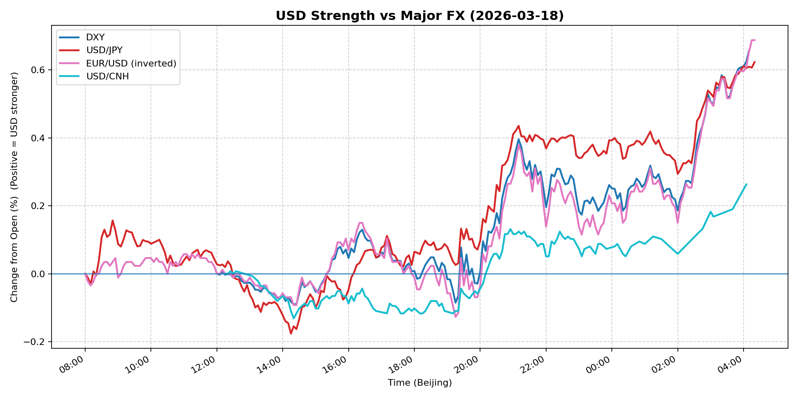
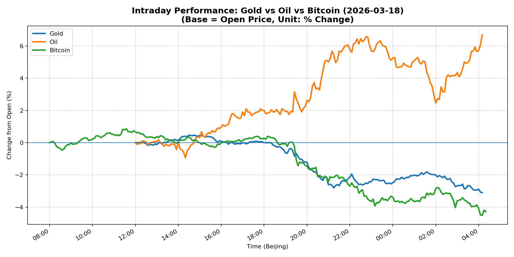
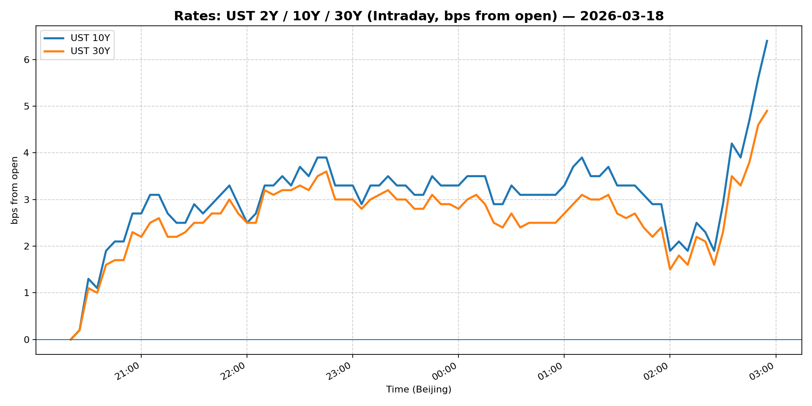
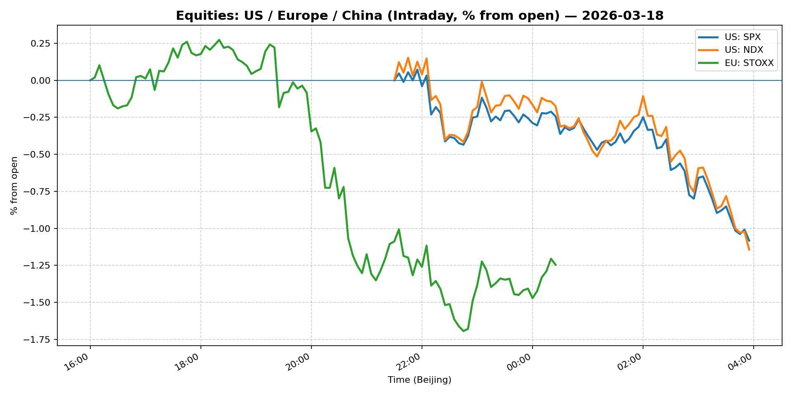
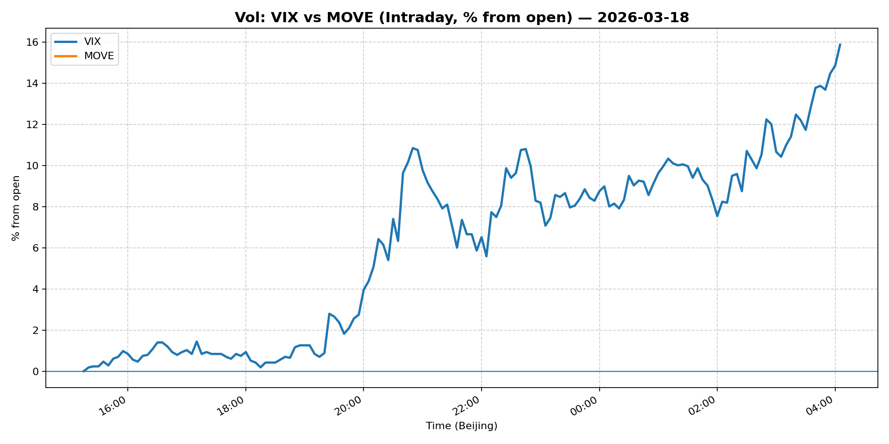
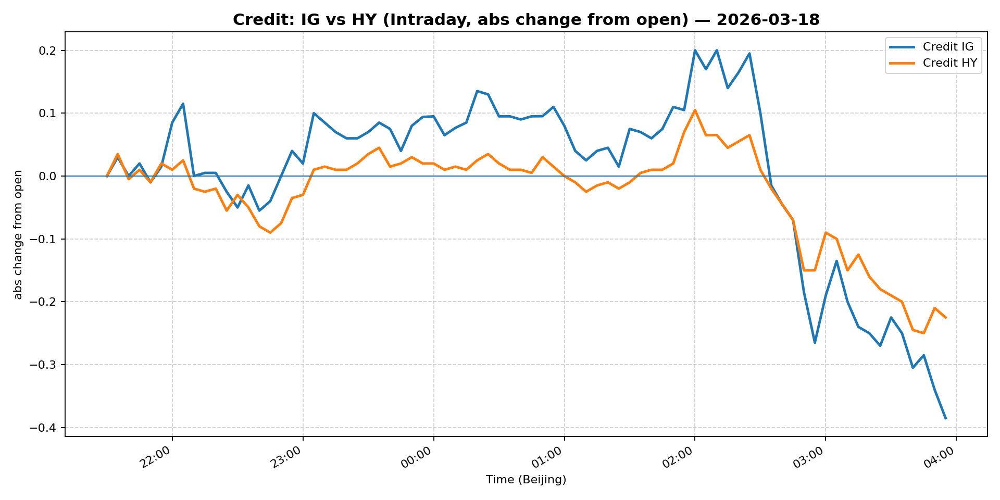

# 📅 Market Diary: 2026-03-18

---

## 🧠 AI Macro Analysis

# Market Diary — 2026-03-18 (Beijing Time)

## -1) Chart read

- **USD chart (Chart 1):** FX Composite posted net +0.66pp with +0.77pp range—the strongest daily move in weeks. DXY and USD/JPY both showed identical +0.66pp and +0.62pp gains respectively, with peak strength hitting the 04:00–04:20 Beijing time window (late NY session). Turning points reveal early Asian weakness (trough -0.03pp @ 08:10) followed by aggressive short-covering into the close. USD/CNH lagged (+0.26pp net), suggesting China defensive stability vs broad USD strength.

- **Gold/Oil/BTC chart (Chart 2):** Extreme divergence: Oil +6.70pp vs Bitcoin -4.28pp (10.98pp spread). Gold collapsed -3.11pp, nearly matching Bitcoin's decline. Correlations flipped: Gold-Oil r=-0.93 (strong inverse), Oil-BTC r=-0.89 (inverse), while Gold-BTC stayed r=+0.95. This signals a "risk asset liquidation" regime rather than inflation hedge dynamics—oil surged on geopolitical premium, everything else sold on growth/fear.

## 0) One-line takeaway

Oil-driven geopolitical risk spike triggered a sharp risk-off: USD strength across the board, equities and credit lower, gold and Bitcoin liquidated in lockstep as the market priced a "higher-for-longer" Fed with uncertain growth outlook.

## 1) Market tape

### Asia
- **USD/JPY** rallied from trough (-0.03pp @ 08:10) to peak (+0.16pp @ 08:50) in early Tokyo hours, tracking the risk-off sentiment from overnight oil spike
- **China large-caps (FXI)** fell -1.87%, underperforming Shanghai Composite (+0.32%), as risk-off hit harder in Hong Kong-listed names
- **CNH** weakened to 6.8605 (-1.99%) despite PBOC setting reference rate—defensive USD demand overwhelmed intervention signals

### Europe
- **Euro Stoxx 50** slid -0.56%, mirroring US equity weakness
- **EUR/USD** dropped -0.32% as the USD strength narrative dominated
- **Credit** began widening: IG/LQD -0.54%, HY/HYG -0.51%

### US
- **S&P 500** and **Nasdaq 100** dropped -1.36% and -1.43%, respectively—the equity selloff accelerated post-Fed decision
- **Gold** collapsed -3.25%, its worst day in months—liquidation over inflation hedge
- **Bitcoin** plunged -4.22%, Ethereum -6.30%—crypto liquidating in lockstep with risk assets
- **Treasury yields** rose: 5Y +2.01%, 10Y +1.36%, 30Y +0.60%—real yields climbing on inflation concerns
- **Crude Oil** surged +2.52% to $98.63—the Iran war risk premium embedded

## 2) Cross-asset dashboard

| Bucket | What moved | Mechanism | Signal quality |
|---|---|---|---|
| Rates (UST) | Yields up 2–6bp across curve | Oil spike → inflation concern + Fed hold → higher long-end | High |
| FX (USD/JPY/EUR/CNH) | Broad USD +0.26–0.62pp | Risk-off + carry advantage; CNH lagged (defensive PBOC) | High |
| Equities (US/EU/CN) | US -1.4%, EU -0.56%, CN mixed | Growth fear from oil/geo risk; China small-cap held | High |
| Credit | IG -0.54%, HY -0.51% | Risk-off; spreads widening modestly | Medium |
| Commodities | Oil +6.70pp (intraday), Gold -3.11pp, Copper -3.99% | Oil = geopolitical premium; Gold/Cu = growth/liquidation | High |
| Vol | VIX elevated (no data), implied vol likely up | Realized selloff = elevated vol expected | Medium |

## 3) What changed the narrative today?

### Driver #1: Fed Hold + "One Cut" Guidance
- **Variable:** Fed policy stance and dot plot
- **Mechanism:** Fed held rates, maintained "one cut in 2026" guidance, but noted "uncertain" impacts from Iran war—markets repricing higher-for-longer
- **Evidence:** Market: 5Y and 10Y yields rose 2–6bp; S&P fell 1.36%. Event: Fed decision and Powell press conference
- **Action:** Long USD vs risk currencies; reduce duration; avoid rate-sensitive equities
- **Source of Uncertainty:** How many more oil spikes before the second cut is fully priced out?
- **Invalidation Criteria:** If oil stabilizes below $95 and Fed speakers signal more cuts, USD weakens

### Driver #2: Oil Geopolitical Premium (Iran War Risk)
- **Variable:** Crude Oil +$2.42 (2.52%) to $98.63
- **Mechanism:** Supply shock fear from Iran conflict; backwardation steepening; inflation expectations elevated
- **Evidence:** Market: Oil +6.70pp intraday (peak); Gold and Bitcoin sold as inflation hedge narrative broke. Event: Headlines on Iran war uncertainty in Fed statement
- **Action:** Short oil-sensitive equities; long energy; reduce gold exposure
- **Source of Uncertainty:** Does conflict escalate to disrupt supply, or does strategic reserve release cap prices?
- **Invalidation Criteria:** Oil breaks below $92 sustained → risk-off eases

### Driver #3: Risk Asset Liquidation (Gold + Bitcoin)
- **Variable:** Gold -3.25%, Bitcoin -4.22%, Ethereum -6.30%
- **Mechanism:** Margin calls, CTA de-risking, institutional selling—correlation at 0.95 for Gold/BTC despite different fundamentals
- **Evidence:** 5-min correlations: Gold–BTC r=+0.95, Oil–BTC r=-0.89; intraday turning points aligned
- **Action:** Do not buy the dip in gold/BTC yet—liquidation phase typically has more room
- **Source of Uncertainty:** Is this short-term deleveraging or regime change (crypto no longer a hedge)?
- **Invalidation Criteria:** BTC holds $68k+ and Gold stabilizes above $4,700 → risk appetite returning

## 4) Rates & USD: the "macro spine"

- **Curve / real yield / inflation breakevens:** 10Y at 4.259% (+1.36%), 30Y at 4.881% (+0.60%)—bear steepening as inflation expectations rise. Real yields climbing with 5Y at 3.862% (+2.01%). The curve is pricing more inflation risk, less rate cut.
- **USD reaction function:** Currently trading "growth + risk-off + carry" trifecta. USD/JPY at 159.847 (+0.47%) shows safe-haven demand into JPY despite BOJ policy divergence. EUR/USD at 1.1463 (-0.32%) confirms broad USD strength.
- **Key levels:** USD/JPY 160 (psychological); EUR/USD 1.14 (support); USD/CNH 6.85 (PBOC watched level)

## 5) Flows, positioning & options

- **Positioning guess (CTA/discretionary/hedge):** CTA likely reduced equity beta; discretionary rotating out of growth/tech; hedge funds short oil-sensitive names. Long USD positions being rebuilt after Powell's "higher-for-longer" signal.
- **Options / vol mechanics:** VIX implied likely elevated (no data snapshot)—realized vol spiked. Put skew steepening. Gamma negative for dealers → they are short gamma, must buy dips or sell rallies, amplifying moves.
- **Where you may be wrong:** (1) Oil could reverse quickly if diplomacy emerges—giving back gains. (2) China's small-cap resilience suggests domestic liquidity still supporting—may see divergence vs US risk-off. (3) Gold may find buyers at $4,700 as real yields stabilize.

## 6) Today's Trading Plan

- **Directional Bias:** Short risk assets; Long USD; Neutral-to-short gold and crypto
- **2–4 Trade Setups:**
  - **Setup 1:** USD/JPY Long (trigger: break above 160.50)
    - **Trigger:** If USD/JPY clears 160.50 on close, enter long
    - **Entry/Stop/Target:** Entry 160.50, Stop 159.50, Target 162.00
    - **Position sizing:** Medium (2x normal)
    - **Hedge:** None
    - **Why now:** Risk-off + BOJ dovish + USD strength = clear directional
  - **Setup 2:** S&P 500 Put Spread (trigger: VIX > 22 + S&P < 6600)
    - **Trigger:** If S&P breaks below 6600 with VIX above 22, enter 6600/6400 put spread
    - **Entry/Stop/Target:** Net debit ~$50, max payout ~$150
    - **Position sizing:** Small (insurance)
    - **Hedge:** Long March 6600 call for bounce protection
    - **Why now:** Vol elevated, downside target clear from technicals
  - **Setup 3:** Short Gold (trigger: Gold breaks below $4,750)
    - **Trigger:** Close below $4,750 triggers short
    - **Entry/Stop/Target:** Entry 4,750, Stop 4,850, Target 4,550
    - **Position sizing:** Medium
    - **Hedge:** None
    - **Why now:** Liquidation phase, correlation with risk assets suggests more downside
  - **Setup 4:** Energy Sector Long (trigger: Oil holds above $97)
    - **Trigger:** If Oil maintains $97+ at European open, long XLE or energy majors
    - **Entry/Stop/Target:** Entry ~$95, Stop $93, Target $105
    - **Position sizing:** Small
    - **Hedge:** None
    - **Why now:** Geopolitical premium = direct play

- **Portfolio risk rules:**
  - **Max daily loss / heat:** -1.5% portfolio; reduce exposure if 2 consecutive losing days
  - **Correlation risk:** Gold/BTC 0.95 correlation = do not double-count; reduce if both short
  - **Tail risk hedge:** Hold 5% TLT long as portfolio hedge; add if S&P breaks 6500

## 7) What to watch tomorrow

- **Key catalysts (US/EU/CN):** US March PMIs (manufacturing/services), ECB speakers, China LPR rates, Iran conflict headlines, Powell speech transcript
- **Scenario map (2–3):**
  - Scenario A: Oil stabilizes <$95 → risk-off eases → S&P rallies +0.5%, USD weakens → Long tech, short USD
  - Scenario B: Oil breaks $100 → inflation panic → S&P -2%, USD/JPY 162, yields +10bp → Short everything, long energy
  - Scenario C: Iran de-escalation → Oil -5% → Gold rallies, risk-on returns → Long gold, long EM FX
- **Thesis invalidation checklist:**
  - [ ] Fed speakers walk back "one cut" → USD weakens → invalidates USD long thesis
  - [ ] Oil closes below $92 for 2 days → risk-off over → invalidates energy long
  - [ ] Gold holds $4,700 and S&P recovers → liquidation complete → take profit on shorts

---

## 📊 Charts

### 💵 USD Strength (FX, Intraday %)

### 🟡🛢️₿ Gold vs Oil vs Bitcoin (Intraday %)

### 🏦 Rates: UST 2Y/10Y/30Y (bps from open)

### 📉 Equities: US/EU/CN (Intraday %)

### 🌪️ Vol: VIX vs MOVE (Intraday %)

### 🧱 Credit: IG vs HY (abs change)

---

*Generated on 2026-03-19 04:25:23*
