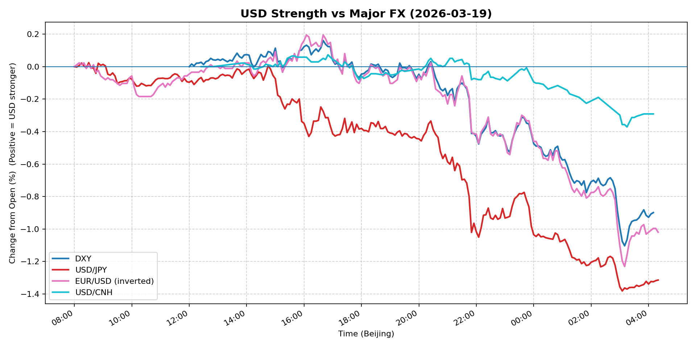
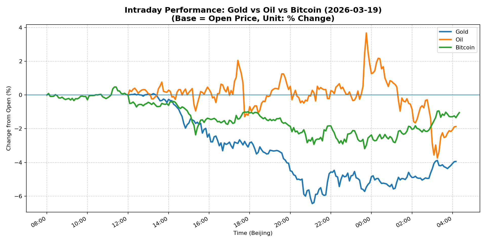
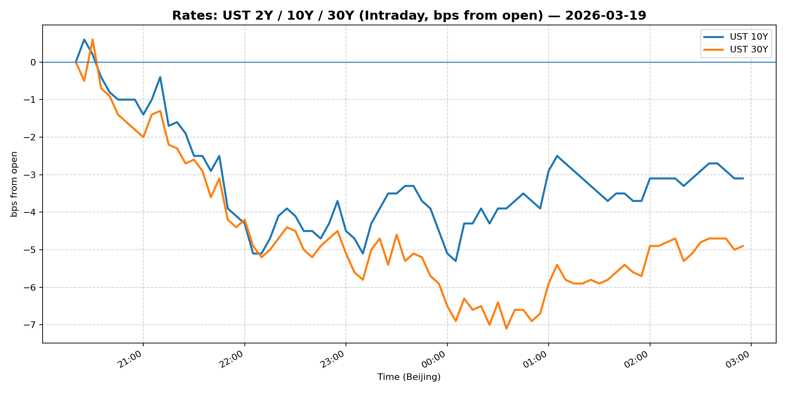
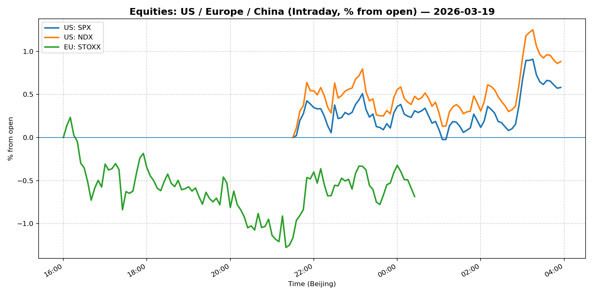
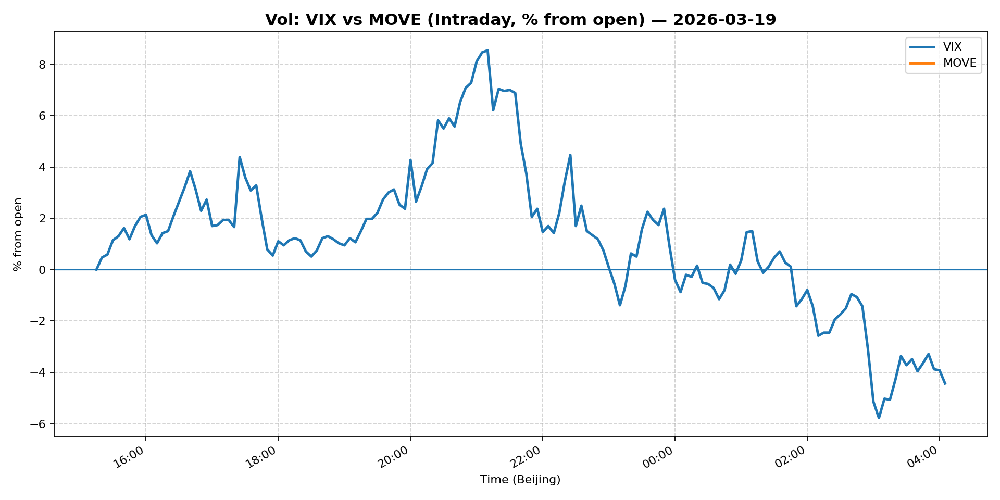
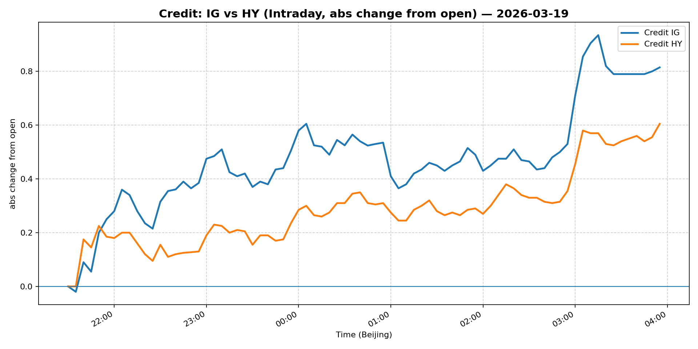

# 📅 Market Diary: 2026-03-19

---

## 🧠 AI Macro Analysis

# Market Diary — 2026-03-19 (Beijing Time)

## -1) Chart read (must reference Chart Features block)

- **USD chart (Chart 1):** FX Composite net -1.17pp with +1.21pp range signals extreme intraday volatility and decisive trend reversal. DXY net -0.90pp, USD/JPY net -1.31pp (largest mover), USD/CNH net -0.29pp all in deep negative territory. Turning points show composite peaking at +0.02pp around 08:15-08:30 Beijing then crashing to trough -1.17pp by 04:20 — the move accelerated into the Asian night session. This is a meaningful USD breakdown, not a fleeting dip.

- **Gold/Oil/BTC chart (Chart 2):** Gold collapse at -3.94pp (worst performer) with massive 6.53pp range — peak +0.08pp at 13:15, trough -6.44pp at 21:05 Beijing time. Oil -1.87pp, Bitcoin -1.04pp. The divergence summary (Spread +2.90pp) highlights Gold's relative weakness vs. Bitcoin. Gold-Bitcoin correlation at r=+0.88 is extraordinarily high — they moved together, implying this is a deleveraging/liquidation event rather than a fundamental repricing. The correlation reading suggests risk parity / systematic flow exits.

## 0) One-line takeaway

- USD collapse across the board (FX Composite -1.17pp) alongside Gold's -3.94pp crash signals a coordinated deleveraging event rather than risk-off flight-to-quality — the usual USD strength in risk aversion is absent, suggesting forced selling from levered positions (likely rate-sensitive or commodity-linked) rather than discretionary risk hedging.

## 1) Market tape (session-by-session, Asia → Europe → US)

### Asia
- **FX:** USD/JPY plunged -1.31pp with trough at 03:05 Beijing — Asian session saw the bulk of the move. USD/CNH fell -0.29pp, CNH outperforming on explicit carry unwind.
- **Commodities:** Gold crashed through key levels in Asian trade, hitting -6.44pp trough at 21:05 (late Asia). Copper joined the sell-off, extending the prior day's broad commodities decline.
- **Equities:** Shanghai Composite -1.39%, extending Asia-wide equity weakness. China Large-Cap (FXI) flat +0.01%, showing relative resilience.

### Europe
- **Equities:** Euro Stoxx 50 tanked -2.14%, the worst regional equity performance — European open gap-down persisted through the session.
- **FX:** EUR/USD (inverted) net -1.02pp — EUR strength added to USD weakness narrative. The EUR peak at 16:05 local time coincides with US session open.
- **Rates:** European bonds likely under pressure (rates up globally) but focus was on the equity sell-off spreading from Asia.

### US
- **Equities:** S&P 500 -0.27%, Nasdaq 100 -0.29% — relatively resilient vs. Europe/Asia but negative. Pre-market movers: Micron, Alibaba (China exposure), Newmont (gold/mining).
- **FX:** DXY -0.87%, the weakest daily close in recent memory — USD collapse accelerated into US hours.
- **Commodities:** Oil -1.86%, Gold -4.71% — commodities continued bleeding. WTI crude weakness notable given Middle East tensions (headlines suggested post-Iran recovery).
- **Credit:** IG (LQD) +0.44%, HY (HYG) +0.33% — credit flat-to-slightly higher despite equity weakness; no meaningful spread widening, suggesting this is not a credit-driven event.

## 2) Cross-asset dashboard

| Bucket | What moved | Mechanism (1 line) | Signal quality |
|---|---|---|---|
| Rates (UST/Bunds) | 5Y +1.48%, 10Y +0.52% | Rates spiked higher globally — inflation expectations or supply concerns | High |
| FX (USD/JPY/EUR/CNH) | DXY -0.87%, USD/JPY -1.31%, USD/CNH -2.22% | Coordinated USD collapse — likely deleveraging, not flight-to-safety | High |
| Equities (US/EU/CN) | S&P -0.27%, Euro Stoxx -2.14%, Shanghai -1.39% | Risk-off but US held up better than Europe/Asia | Med |
| Credit | IG +0.44%, HY +0.33% | Spreads flat — credit not leading the move | Low |
| Commodities | Gold -4.71%, Oil -1.86%, Copper -0.59% | Broad commodities sell-off; Gold liquidation biggest signal | High |
| Vol (VIX/MOVE) | VIX -3.75%, MOVE flat | VIX fell despite risk-off — unusual, suggests vol reset lower | High |

## 3) What changed the narrative today? (Top 3 drivers)

### Driver #1: Gold Liquidation Cascade
- **Variable:** Gold -3.94pp intraday, -4.71% on the day
- **Mechanism:** Levered long positions in gold (likely commodity-linked vehicles, systematic trend followers, or rate-sensitivity trades) forced to unwind as real yields spiked and USD collapsed in a paradoxical move. The 5Y Treasury +1.48% (rates up) makes long-duration gold positions untenable.
- **Evidence:**
  - Market: Gold's 6.53pp range with r=+0.88 correlation to Bitcoin implies systematic/liquidation behavior, not fundamental shift
  - Event: 5Y Treasury yield jumped 1.48% — the most in the rates complex — makes gold's carrying cost expensive
- **Action:** Avoid bottom-ticking gold. The correlation to Bitcoin suggests this is a cross-asset delever, not a value play.
- **Source of Uncertainty:** Was this CTAforced unwind or discretionary repositioning? The answer determines if more pain comes.
- **Invalidation Criteria:** Gold stabilizes above $4,600 with VIX below 20 and 5Y holding below 3.80%.

### Driver #2: 5Y Treasury Spike (+1.48%)
- **Variable:** 5Y yield at 3.919%, biggest mover in the rates complex
- **Mechanism:** Market repricing of Fed cut expectations — despite Fed guidance of "one cut this year," the 5Y spike suggests inflation concerns or supply dynamics (Treasury issuance) dominate. 10Y +0.52%, 30Y -0.59% (inverted move).
- **Evidence:**
  - Market: 5Y spiking while 30Y fell creates bear steepening — unusual for risk-off
  - Event: No explicit news; likely repricing after Fed meeting (headline: "Fed still expects to cut rates once this year despite spiking oil prices")
- **Action:** Short-duration bias in rates. The 5Y is the market's focal point.
- **Source of Uncertainty:** Whether this is a supply-driven or inflation-expectation-driven move.
- **Invalidation Criteria:** 5Y falls back below 3.75% on any dovish Fed speaker.

### Driver #3: Euro Stoxx -2.14% — Europe Leads Equity Sell-Off
- **Variable:** European equities underperformed US/China dramatically
- **Mechanism:** Combined headwinds: (1) USD collapse hurts European exporters, (2) German/Eurozone growth concerns, (3) China demand weakness (copper sell-off narrative). European banks exposed to commodity exposure.
- **Evidence:**
  - Market: Euro Stoxx -2.14% vs S&P -0.27% — massive relative underperformance
  - Event: "Copper joins gold in broad commodities sell-off" — direct hit to European commodity exporters
- **Action:** Underweight European equities; prefer US / defensive positioning.
- **Source of Uncertainty:** Whether this is a European-specific problem or contagion risk to US.
- **Invalidation Criteria:** Euro Stoxx reverses above 5,700 with credit spreads stable.

## 4) Rates & USD: the "macro spine"

- **Curve / real yield / inflation breakevens:** 5Y +1.48% was the dominant move — bear steepening with 30Y actually -0.59% (slightly flatter/inverted). This is a warning: the market is pricing inflation/supply concerns in the belly, not the long end. Real yields likely rose given gold's collapse.
- **USD reaction function:** USD is NOT trading risk-off — it collapsed alongside equities and gold. This is a liquidity/financing squeeze signal (USD needed to fund margin calls?) or a radical repricing of the growth differential. The FX Composite -1.17% is a level of move not seen in months. USD/JPY -1.31% is the key signal — if this is a risk-off, JPY should be weaker (flight to USD), not stronger. The move is inconsistent with traditional risk paradigms.
- **Key levels:** DXY 99.22 (critical support broken), USD/JPY 157.65 (key support), USD/CNH 6.84 (breaking lower).

## 5) Flows, positioning & options

- **Positioning guess (CTA / discretionary / hedge):** The gold-bitcoin correlation at r=+0.88 is the smoking gun — CTAs or risk parity funds were likely long both and are now forced sellers. The 5Y spike suggests macro funds reducing duration. Discretionary likely caught offside.
- **Options / vol mechanics:** VIX -3.75% is bizarre — down 3.75% on a risk-off day? This suggests vol sellers got crushed and are now covering, or the market sees this as a one-off liquidity event. Either way, vol likely too cheap now. Skew likely flipped to put-wing demand.
- **Where you may be wrong:** (1) This could be a flash crash that reverses tomorrow — do not extrapolate linearly. (2) The 5Y spike may be temporary repricing, not a new regime.

## 6) Today's Trading Plan (actionable, risk-managed)

- **Directional Bias:** Cautious. The move is violent but the drivers (liquidation > fundamental) make the path unclear. Risk-off but atypical — no USD bid, vol collapsed.

- **2–4 Trade Setups:**
  - **Setup 1: Short USD/JPY (trigger-based)**
    - **Trigger:** If USD/JPY retests 157.50 and holds, or breaks lower
    - **Entry:** 157.50 / Stop: 159.00 / Target: 155.00
    - **Position sizing:** Medium — the trend is clear but Japan MOF may intervene
    - **Hedge:** Long USD/CNH for USD broad exposure
    - **Why now:** The -1.31% move in USD/JPY is the largest FX move; momentum favors continuation

  - **Setup 2: Long VIX calls (vol spike hedge)**
    - **Trigger:** VIX below 23, looking for mean-reversion
    - **Entry:** 23.00 / Stop: 21.50 / Target: 28.00
    - **Position sizing:** Small — vol is tricky, VIX -3.75% is counter-intuitive
    - **Hedge:** None
    - **Why now:** VIX at 24.15 is too low given cross-asset dislocation; tail risk hedge

  - **Setup 3: Short Euro Stoxx / Long S&P (relative value)**
    - **Trigger:** Euro Stoxx / S&P ratio at current levels
    - **Entry:** Ratio short / Stop: N/A (pair trade) / Target: -3% relative
    - **Position sizing:** Small-Medium
    - **Hedge:** None
    - **Why now:** Europe -2.14% vs US -0.27% is extreme divergence; Europe has China/commodity exposure

  - **Setup 4: Wait-and-see on Gold**
    - **Trigger:** Gold stabilizes above $4,600 or breaks below $4,500
    - **Entry:** TBD / Stop: TBD / Target: TBD
    - **Position sizing:** No position yet
    - **Why now:** Gold-Bitcoin correlation at 0.88 suggests this is a flow-driven move, not fundamental — too hard to call the bottom

- **Portfolio risk rules:**
  - **Max daily loss / heat:** 2.5% portfolio-level max drawdown today; current move is extreme, reduce net exposure
  - **Correlation risk:** Gold-Bitcoin correlation at 0.88 means they move together — do not double-concentrate
  - **Tail risk hedge:** Long VIX calls (see Setup 2); reduce duration (5Y spike is a warning)

## 7) What to watch tomorrow

- **Key catalysts (US/EU/CN):**
  - US: Weekly Jobless Claims, Existing Home Sales, Fed speakers (any color on the 5Y spike)
  - EU: ECB minutes or speakers — any on inflation/growth trade-off
  - China: LPR (Loan Prime Rate) — any stimulus signal to stem commodity demand concerns

- **Scenario map (2–3):**
  - **Scenario A (Liquidation complete):** Gold stabilizes, USD holds, VIX drifts lower → Risk assets bounce → Buy the dip in S&P / Tech
  - **Scenario B (Cascade continues):** More deleveraging, 5Y breaks higher, USD weakens further → Short everything except cash → Defensive (utilities, staples)
  - **Scenario C (Vol spike):** VIX reclaims 28+, vol dealers short gamma → Sharp V-shaped vol spike → Long vol, reduce delta

- **Thesis invalidation checklist:**
  - DXY reclaims 100.50 — USD strength returns, the liquidation narrative is wrong
  - 5Y yield falls below 3.75% — rates-driven gold sell-off is over
  - Gold-Bitcoin correlation falls below 0.50 — systematic flow dominance is ending, discretionary can re-enter

---

## 📊 Charts

### 💵 USD Strength (FX, Intraday %)

### 🟡🛢️₿ Gold vs Oil vs Bitcoin (Intraday %)

### 🏦 Rates: UST 2Y/10Y/30Y (bps from open)

### 📉 Equities: US/EU/CN (Intraday %)

### 🌪️ Vol: VIX vs MOVE (Intraday %)

### 🧱 Credit: IG vs HY (abs change)

---

*Generated on 2026-03-20 04:25:42*
