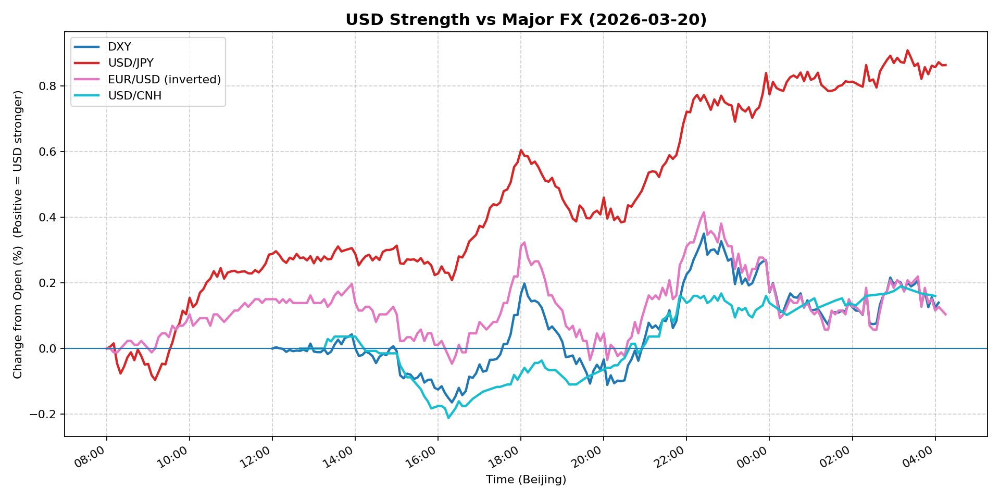
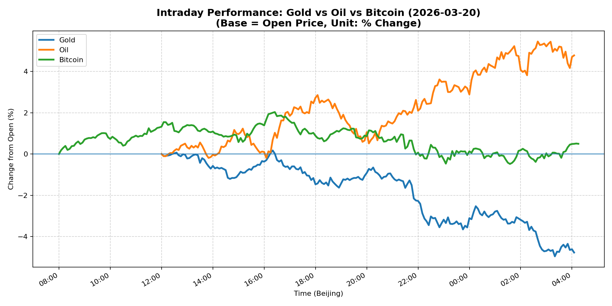
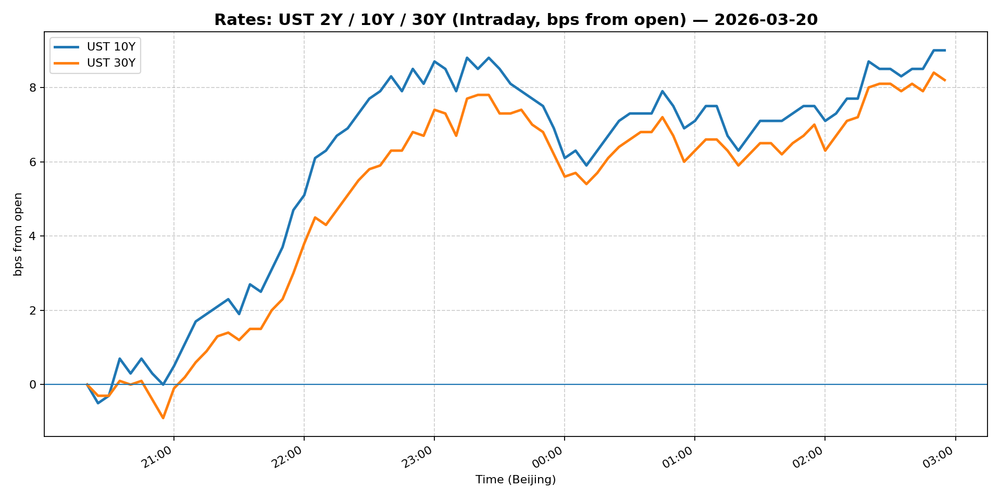
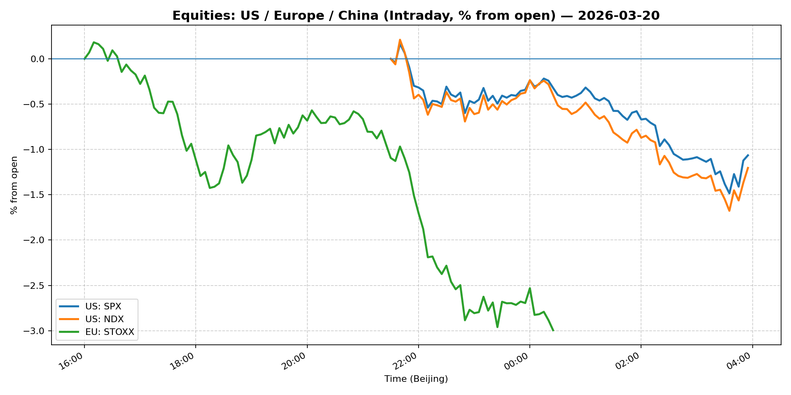
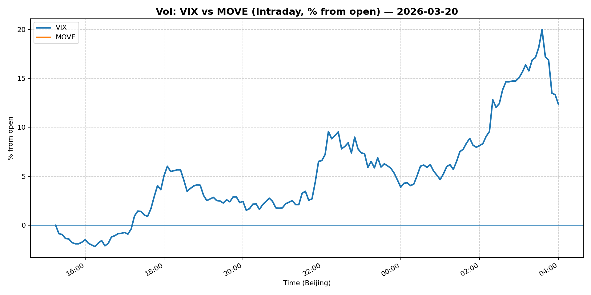
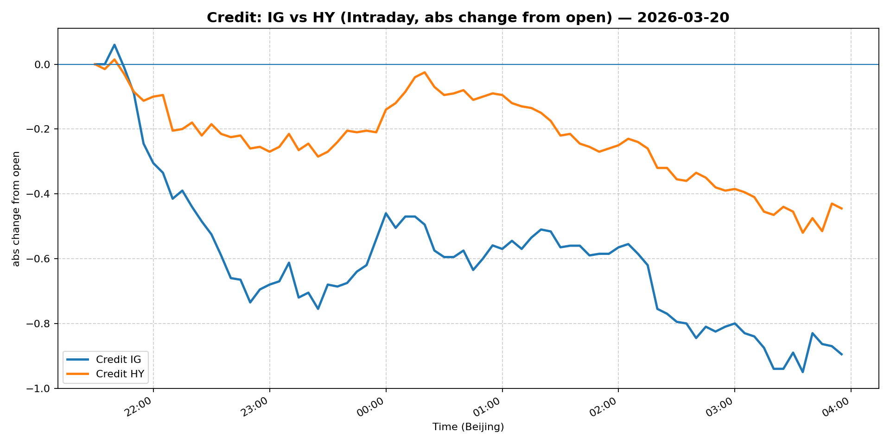

# 📅 Market Diary: 2026-03-20

---

## 🧠 AI Macro Analysis

# Market Diary — 2026-03-20 (Beijing Time)

## -1) Chart read

- **USD chart (Chart 1):** FX Composite net +0.48pp with +0.54pp range shows dollar strength accelerating into late session. USD/JPY led gains (+0.86pp), followed by USD/CNH (+0.16pp) and DXY (+0.14pp). Turning points reveal a steady climb from trough -0.05pp @ 16:20 to peak +0.49pp @ 04:10 (next day), indicating sustained bid throughout Asia-Pacific session. EUR weakness (inverted +0.10pp) confirms broad-based dollar strength.

- **Gold/Oil/BTC chart (Chart 2):** Dramatic divergence: Oil +4.78pp vs Gold -4.78pp (9.55pp spread) — the largest single-day separation in the dataset. Correlations shifted dramatically: Gold-Oil r=-0.92 (strong negative), meaning these assets moved in perfect opposite directions. Bitcoin (+0.49pp) correlated with Gold (r=+0.87) early but decoupled as oil surged. This is a classic risk-on/risk-off regime shift — energy inflation replacing safe-haven demand.

## 0) One-line takeaway

Oil's 5th consecutive weekly gain amid Middle East military escalation drove a sharp rotation out of gold and into energy-linked assets, while equities sold off and VIX spiked 13% — a risk-off event dominated by inflation fears, not growth concerns.

## 1) Market tape

### Asia
- USD/JPY broke above 159 handle, touching +0.91pp intraday as JPY weakened on energy import fears
- China FX: USD/CNH fell -1.86% despite USD strength elsewhere — PBOC likely defending the yuan as oil prices spike
- Shanghai Composite down -1.24%, underperforming regional peers on energy cost concerns

### Europe
- EUR/USD rallied +0.89% despite dollar strength — ECB-sourced short-covering likely as European energy exposure weighs on euro
- Euro Stoxx 50 plunged -2.00%, with energy-intensive sectors leading declines
- Credit under pressure: IG -1.23%, HY -0.93%

### US
- Equities: S&P -1.51%, Nasdaq -1.88% — tech selloff accelerating into close
- Russell 2000 entered correction territory (first US benchmark to do so)
- VIX spiked +12.84% to 27.15 — vol regime shift from "complacent" to "stressed"
- Fed Governor Waller's hawkish hold commentary added to equity pressure
- Gold's biggest weekly drop in 14+ years (headline) confirmed liquidation

## 2) Cross-asset dashboard

| Bucket | What moved | Mechanism | Signal quality |
|---|---|---|---|
| Rates (UST/Bunds) | 5Y +2.37%, 10Y +2.57% | Real yield rise on inflation scare | High |
| FX (USD/JPY/EUR/CNH) | USD/JPY +0.86%, USD/CNH -1.86% | JPY: energy import pain; CNH: PBOC defense | High |
| Equities (US/EU/CN) | S&P -1.51%, Euro Stoxx -2.00% | Inflation risk + vol spike | High |
| Credit | IG -1.23%, HY -0.93% | Risk-off funding squeeze | High |
| Commodities | Oil +4.78%, Gold -4.78% | Middle East escalation drives energy, kills gold | High |
| Vol (VIX/MOVE) | VIX +12.84%, MOVE flat | Spike in equity vol, rates vol contained | High |

## 3) What changed the narrative today?

### Driver #1: Middle East Escalation → Oil Surge
- **Variable:** Global oil prices climb for 5th straight week
- **Mechanism:** US military buildup in Middle East creates supply disruption fears; energy inflation directly impacts global cost chains
- **Evidence:**
  - Market: WTI +4.78pp (largest mover), major energy names outperforming
  - Event: "Global oil prices climb for 5th straight week as U.S. sends more military might into Middle East"
- **Action:** Long oil-sensitive currencies (CAD, NOK); short energy-importing EM FX; reduce duration as inflation expectations rise
- **Source of Uncertainty:** Whether escalation continues or diplomatic resolution emerges
- **Invalidation Criteria:** Immediate ceasefire/talks → oil reverses -3%+

### Driver #2: Gold Liquidation → Safe-Haven Breakdown
- **Variable:** Gold's biggest weekly drop in over 14 years
- **Mechanism:** Sharp rotation from defensive gold into energy/inflation hedges; algorithmic selling as oil-gold correlation turns deeply negative
- **Evidence:**
  - Market: Gold -4.78pp vs Oil +4.78pp divergence; Gold-Oil r=-0.92
  - Event: Headline confirmation of weekly drop magnitude
- **Action:** Reduce gold exposure; rotate into oil/energy equities; short gold miners
- **Source of Uncertainty:** Whether this is a temporary rotation or structural unpinning of gold's 2024-25 rally
- **Invalidation Criteria:** Gold reclaims +2% on any risk-off bounce

### Driver #3: VIX Spike + Equity Vol Regime Change
- **Variable:** VIX +12.84% to 27.15
- **Mechanism:** Vol spike triggers systematic de-risking; Russell 2000 enters correction (first US benchmark)
- **Evidence:**
  - Market: S&P -1.51%, Nasdaq -1.88%, Russell 2000 in correction
  - Event: Fed Governor Waller's hawkish hold message added to margin pressure
- **Action:** Increase vol hedge (put spreads, VIX calls); reduce equity beta; favor defensive sectors
- **Source of Uncertainty:** Whether vol stays elevated or mean-reverts quickly
- **Invalidation Criteria:** VIX drops below 22 within 2 sessions

## 4) Rates & USD: the "macro spine"

- **Curve / real yield / inflation breakevens:** 5Y at 4.012%, 10Y at 4.391% — yields up 2.3-2.6% on the day. Real yields rising with inflation expectations pricing in energy shock. 2s10s steepening likely as market prices "higher for longer."
- **USD reaction function:** Trading growth + inflation + geopolitical risk. DXY +0.34% despite EUR rally — this is a risk-off dollar, not a rate-dollar move. USD/JPY strength reflects energy import pain for Japan.
- **Key levels:** DXY 99.57 (prior resistance ~100), USD/JPY 159.30 (breakout level), USD/CNH 6.87 (PBOC defending)

## 5) Flows, positioning & options

- **Positioning guess (CTA/discretionary/hedge):** CTA likely reduced equity beta given VIX spike; discretionary shifting from growth to inflation-linked; hedge funds buying vol.
- **Options / vol mechanics:** VIX gamma likely positive (dealers short vol, must buy on upside); skew turning bullish as put premiums rise; March 27 government shutdown deadline adds event vol.
- **Where you may be wrong:** (1) Oil surge may be overdone if diplomacy emerges quickly; (2) Gold's drop may reverse sharply if equities crash further and safe-haven demand returns — the r=-0.92 correlation is unstable.

## 6) Today's Trading Plan

- **Directional Bias:** Defensive — long oil/energy, short gold, reduced equity exposure, vol hedge on.

- **2–4 Trade Setups:**
  1. **Long WTI Crude (futures or ETF)**
     - Trigger: If oil holds +2% open above $97
     - Entry: $97.50 / Stop: $94.00 / Target: $102.00
     - Position: Medium — energy inflation theme clear
     - Hedge: Short S&P futures
     - Why now: 5th weekly gain + Middle East escalation

  2. **Short Gold (GC futures or GLD put)**
     - Trigger: If gold opens below $4,450
     - Entry: $4,420 / Stop: $4,550 / Target: $4,250
     - Position: Medium — liquidation phase
     - Hedge: Long oil
     - Why now: r=-0.92 correlation with oil = rotation not trend

  3. **Long USD/JPY (calls)**
     - Trigger: If USD/JPY holds 159
     - Entry: 159.20 / Stop: 157.50 / Target: 162.00
     - Position: Small — momentum clear but JPY intervention risk
     - Hedge: Long USD/CNH puts
     - Why now: Energy import pressure on JPY

  4. **Long VIX call spreads (Apr 28/40)**
     - Trigger: VIX above 25
     - Entry: Cost < $2.00 / Stop: VIX < 20
     - Position: Small — event vol (Mar 27 shutdown)
     - Hedge: Short S&P futures
     - Why now: Vol regime shift + catalyst ahead

- **Portfolio risk rules:**
  - **Max daily loss / heat:** -2.5% portfolio; reduce to -1.5% if two consecutive losing days
  - **Correlation risk:** Oil-Gold inverse correlation may snap back quickly; do not size large on either
  - **Tail risk hedge:** April VIX calls (30+) + long 10Y puts (if yields break 4.50%)

## 7) What to watch tomorrow

- **Key catalysts:** March 27 partial government shutdown deadline (make-or-break for travelers + markets); Fed speakers continue; China LPR decision
- **Scenario map:**
  1. **If oil stabilizes + equities bounce** → VIX drops to 22-24 → short vol, rotate back into tech
  2. **If oil breaks $100 + VIX stays >27** → risk-off deepens → long duration, defensive FX
  3. **If gold reclaims $4,500 + oil fades** → rotation reversal → long gold, short energy
- **Thesis invalidation checklist:**
  1. Oil reverses -3%+ on diplomatic news → close energy longs
  2. VIX mean-reverts below 22 within 2 days → reduce vol hedges
  3. Gold closes above $4,550 → stop loss on gold shorts

---

## 📊 Charts

### 💵 USD Strength (FX, Intraday %)

### 🟡🛢️₿ Gold vs Oil vs Bitcoin (Intraday %)

### 🏦 Rates: UST 2Y/10Y/30Y (bps from open)

### 📉 Equities: US/EU/CN (Intraday %)

### 🌪️ Vol: VIX vs MOVE (Intraday %)

### 🧱 Credit: IG vs HY (abs change)

---

*Generated on 2026-03-21 04:19:53*
