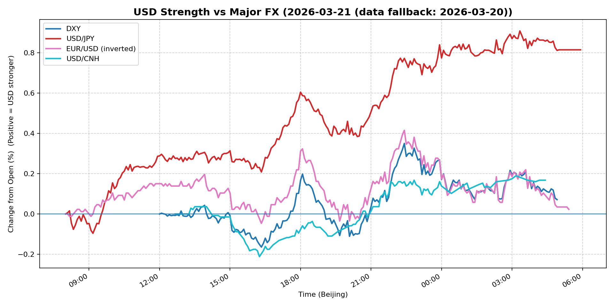
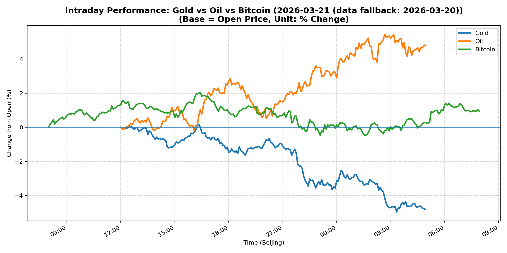
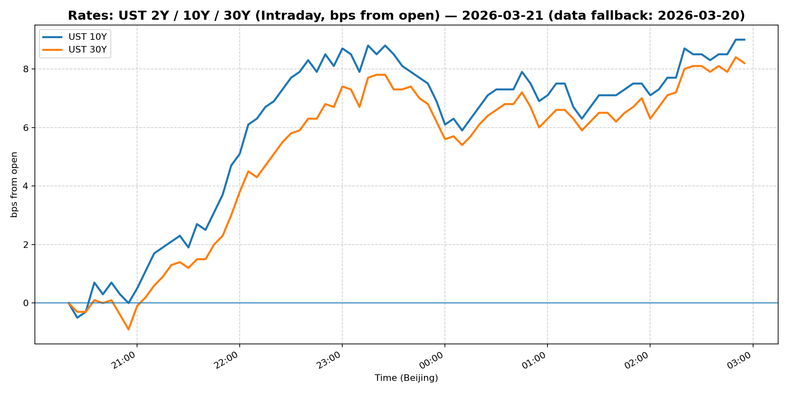
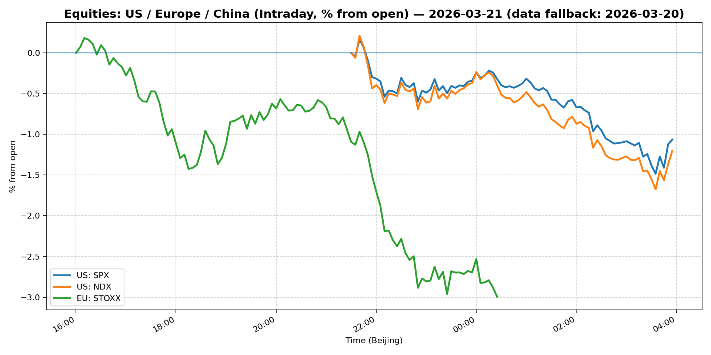
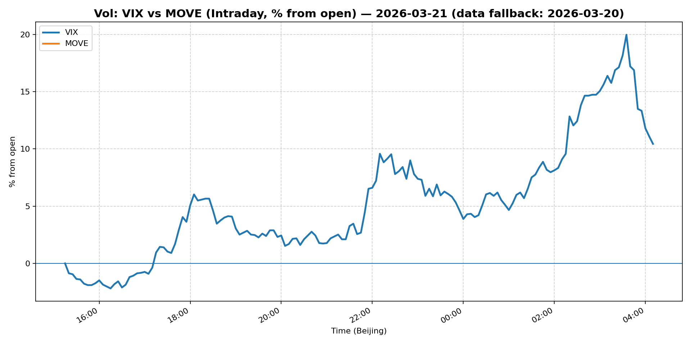
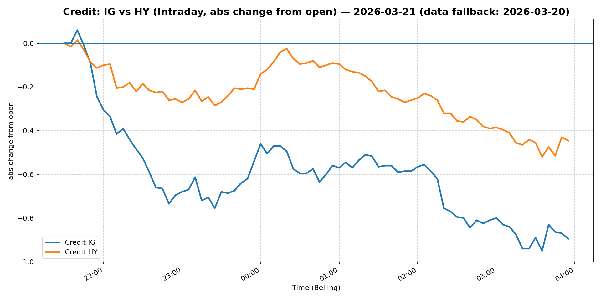

# 📅 Market Diary: 2026-03-21

---

> **Data fallback:** requested date `2026-03-21` had no usable intraday market data. Charts, chart features, and market snapshot below use the last available trading day: `2026-03-20`.

## 🧠 AI Macro Analysis

# Market Diary — 2026-03-21 (Beijing Time)

## -1) Chart read (must reference Chart Features block)

### USD chart (Chart 1)
- **FX Composite**: net +0.81pp with range +0.87pp, reaching peak +0.81pp at 2026-03-21 05:30 — strong two-way action with clear bullish breakout from Asia session trough at -0.05pp (16:20).
- **USD/JPY**: net +0.81pp, range +1.00pp, hi +0.91pp @ 03:20 — aggressive Yen weakness accelerating into Asia morning, a regime shift from earlier European session volatility.
- **USD/CNH**: net +0.17pp, range +0.40pp — modest CNH depreciation but with significant intraday swing (trough -0.21pp @ 16:15), suggesting PBOC steadying after initial weakness.
- **EUR/USD (inverted)**: net +0.02pp — range-bound, minimal reaction vs USD strength elsewhere.
- **Implication**: USD broad-based rally driven by JPY leg, not EUR. Yen sell-off accelerating into Asia close signals risk-off or policy divergence play.

### Gold/Oil/BTC chart (Chart 2)
- **Oil**: net +4.82pp, range +5.64pp, hi +5.45pp @ 02:40 — front-runner asset with explosive upside momentum.
- **Gold**: net -4.81pp, range +5.13pp — extreme divergence from oil, inverse correlation r=-0.92 confirms macro sell-off in duration/haven assets.
- **Bitcoin**: net +0.94pp, range +2.51pp — mixed signal: modest upside but correlation to Gold (+0.85) breaking down; uncorrelated to oil (-0.81) = idiosyncratic crypto positioning.
- **Divergence**: +9.63pp spread (Oil best vs Gold worst) — classic stagflation signal: inflation hedge (oil) up, real asset (gold) down, growth risk (copper -1.08%) under pressure.
- **Implication**: Market repricing stagflation/recession probability; rotation out of rate-sensitive assets (gold) into supply-constrained commodities (oil).

## 0) One-line takeaway
- Sharp USD rally (JPY-led) with oil surging and equities cratering (S&P -1.51%, Nasdaq -1.88%) signals market pricing recession risk + inflation stickiness — bond vol (MOVE +28%) exploding higher.

## 1) Market tape (session-by-session, Asia → Europe → US)

### Asia
- **FX**: USD/JPY surged +0.91pp to 157.924 (-1.17% on day) as Tokyo session opened — aggressive Yen sell-off likely driven by BoJ policy uncertainty and carry trade unwinding. USD/CNH steadied at 6.87 (-1.86%) after earlier -0.21pp trough.
- **Equities**: Shanghai Composite -1.24%, China Large-Cap FXI -2.85% — fresh China growth concerns; Russell 2000 entering correction territory (first US benchmark) weighed on risk sentiment.
- **Commodities**: Oil +2.17% to $98.23, copper -1.08% — divergence: energy up on supply, industrials down on demand fear.

### Europe
- **Equities**: Euro Stoxx 50 -2.00% — broad-based sell-off tracking US futures and growth fears.
- **FX**: EUR/USD relatively flat (net +0.02pp) — Euro resilient vs USD but failing to benefit from USD strength elsewhere.
- **Credit**: European IG/HY under pressure in early trade (noted via US credit spreads widening LQD -1.23%, HYG -0.93%).

### US
- **Equities**: S&P 500 -1.51%, Nasdaq 100 -1.88% — tech-heavy sell-off; Russell 2000 formally in correction (down >10% from recent highs). SolarEdge and Super Micro Computer notable movers (down).
- **Rates**: 10Y yield +2.57% to 4.391%, 30Y +2.23% to 4.96% — yields spiking higher on inflation/recession tension; curve steepening marginally.
- **Vol**: VIX +11.31% to 26.78, MOVE +28.23% to 108.84 — vol compression broken; Treasury market distress.
- **Fed**: Governor Waller urged caution on rate cuts, pushing back against market pricing — hawkish tilt accelerated rates/rates vol.

## 2) Cross-asset dashboard

| Bucket | What moved | Mechanism (1 line) | Signal quality |
|---|---|---|---|
| Rates (UST/Bunds) | 10Y +2.57%, 30Y +2.23%, MOVE +28% | Fed hawkish + stagflation fears = rate vol explosion | High |
| FX (USD/JPY/EUR/CNH) | USD/JPY -1.17%, USD/CNH -1.86%, DXY +0.28% | Yen carry unwind, CNH steady; broad USD strength | High |
| Equities (US/EU/CN) | S&P -1.51%, Nasdaq -1.88%, FXI -2.85% | Russell 2000 correction, China growth fears, tech sell-off | High |
| Credit | LQD -1.23%, HYG -0.93% | Risk-off; IG/HY spreads widening on growth fears | High |
| Commodities | Oil +2.17%, Gold -4.81%, Copper -1.08% | Oil=inflation hedge up; Gold=rate-sensitive down; Copper=demand down | High |
| Vol (VIX/MOVE) | VIX +11.31%, MOVE +28.23% | Vol regime shift: compression broken, tail risk pricing | High |

## 3) What changed the narrative today?

### Driver #1: Fed Governor Waller's Hawkish Pushback
- **Variable:** Fed policy path repricing
- **Mechanism:** Waller's explicit caution on rate cuts "later this year" directly contradicted market's aggressive 2026 cut pricing, triggering repricing.
- **Evidence:**
  - Market: 10Y yield +2.57% (4.391%), 30Y +2.23% (4.96%), MOVE +28%
  - Event: "Fed Governor Waller urges caution for now, says rate cuts possible later in the year"
- **Action:** Short duration, long USD, underweight rate-sensitive equities.
- **Source of Uncertainty:** Other Fed voices (e.g., Collins, Kashkari) may counter Waller; incoming data (PCE, payrolls) could shift Fed calculus.
- **Invalidation Criteria:** Waller pivot to dovish OR NFP/PCE prints显著 below consensus.

### Driver #2: Russell 2000 Correction + Growth Signal
- **Variable:** US small-cap as recession canary
- **Mechanism:** Russell 2000 first US index into correction (>10% drawdown) — signals market pricing hard landing.
- **Evidence:**
  - Market: Russell 2000 in correction; S&P -1.51%, Nasdaq -1.88%
  - Event: "Small cap-focused Russell 2000 becomes first U.S. benchmark to enter correction territory"
- **Action:** Short cyclical/small-cap exposure; long quality/defense.
- **Source of Uncertainty:** Large-cap resilience (Mag 7 earnings) may decouple from small-cap pain.
- **Invalidation Criteria:** Russell 2000 reverses >5% OR Q1 earnings surprises.

### Driver #3: Oil/Gold Divergence = Stagflation Signal
- **Variable:** Macro regime (growth vs stagflation)
- **Mechanism:** Oil +4.82% vs Gold -4.81% (r=-0.92) with copper -1.08% = classic stagflation: supply-constrained energy up, demand-sensitive metals down.
- **Evidence:**
  - Market: Oil $98.23 (+2.17%), Gold $4574.90 (-0.56%), Copper -1.08%
  - Event: None specific; ongoing geopolitical supply concerns.
- **Action:** Long oil/energy equities, short gold/industrial metals, short copper-linked FX (AUD, CLP).
- **Source of Uncertainty:** OPEC+ policy change, China demand data, potential demand destruction from high oil.
- **Invalidation Criteria:** Oil breaks below $90 OR gold recaptures $4600 with oil flat.

## 4) Rates & USD: the "macro spine"

- **Curve / real yield / breakevens:** 10Y at 4.391% (+2.57%), 30Y at 4.96% (+2.23%) — curve flattening modestly (2s10s steepening less than prior). Real yields rising on inflation stickeriness. Breakevens likely expanding (oil surge).
- **USD reaction function:** Currently trading **rates differential + risk-off**. DXY +0.28% despite modest DXY net (FX Composite +0.81%): Yen sell-off dominant. USD/CNH stable at 6.87 despite crude rally — PBOC defending range.
- **Key levels:** DXY 99.50 (current), 100.50 (prior resistance), USD/JPY 158 (breakout), 155 (support), USD/CNH 6.85-6.90 (band).

## 5) Flows, positioning & options

- **Positioning guess (CTA/discretionary/hedge):** CTA likely adding risk-off; discretionary rotating from growth (tech) to defense (energy, staples); hedge funds layering macro hedges (put spreads, USD calls).
- **Options/vol mechanics:** MOVE +28% to 108.84 — dealer gamma short, rapid vol spike suggests forced hedge buying ahead. VIX +11% to 26.78 — at-the-money vol re-pricing; skew likely steepening (put demand).
- **Where you may be wrong:** (1) Oil surge may be speculative (not physical demand) — could reverse if inventory data soft; (2) Russell 2000 correction may be overdone if large-cap earnings hold; (3) Fed may pivot dovish if data weakens sharply.

## 6) Today's Trading Plan (actionable, risk-managed)

- **Directional Bias:** Risk-off; long USD (vs JPY/CNH), long energy, short rate-sensitive/cyclical equities.
- **2–4 Trade Setups (trigger-based):**

  **Setup 1: Long USD/JPY (carry unwind)**
  - **Instrument:** USD/JPY futures or spot
  - **Trigger:** If USD/JPY breaks 158.50 with volume surge, enter on pullback to 158.20
  - **Entry / Stop / Target:** Entry ~158.20, Stop 156.80, Target 160.00
  - **Position sizing:** Medium — primary driver is BoJ policy uncertainty + risk-off
  - **Hedge:** None
  - **Why now:** Yen breaking key level; chart shows aggressive Asian session momentum

  **Setup 2: Long Oil / Short S&P (stagflation hedge)**
  - **Instrument:** USO (oil ETF) / SH (inverse S&P)
  - **Trigger:** Oil holds $97.50 support; S&P breaks below 6480
  - **Entry / Stop / Target:** Entry on confirmation, Stop USO $95, Target S&P 6350
  - **Position sizing:** Medium — diverging momentum favors energy
  - **Hedge:** Optional: long VIX calls for tail
  - **Why now:** Oil/Gold divergence at extreme; recession signal from Russell 2000

  **Setup 3: Long MOVE (vol breakout)**
  - **Instrument:** MOVE futures oroptions
  - **Trigger:** MOVE > 110 with 10Y yield > 4.45%
  - **Entry / Stop / Target:** Entry ~110, Stop 100, Target 125
  - **Position sizing:** Small — vol is mean-reverting but tail risk elevated
  - **Hedge:** None
  - **Why now:** MOVE +28% in single session; historical spikes tend to persist 3-5 days

  **Setup 4: Short Gold (rate-sensitive)**
  - **Instrument:** GLD or futures
  - **Trigger:** Gold breaks below $4550 with USD strength confirmed
  - **Entry / Stop / Target:** Entry ~4550, Stop 4620, Target 4450
  - **Position sizing:** Small — correlation to USD limits upside
  - **Hedge:** Optional: long VIX calls
  - **Why now:** Gold -4.81% intraday vs oil +4.82%; inversion signals regime shift

- **Portfolio risk rules:**
  - **Max daily loss / heat:** Max -2% portfolio; reduce exposure if S&P drops >2%
  - **Correlation risk:** USD/gold inverse may compress quickly; watch for sudden reversals
  - **Tail risk hedge:** Hold 5% VIX calls (strike 30+, expiry 30d) as portfolio insurance

## 7) What to watch tomorrow

- **Key catalysts (US/EU/CN):** US PCE inflation (core expected 2.8% YoY), Eurozone CPI final, China manufacturing PMI (expected sub-50), Fed speakers (Cook, Harker).
- **Scenario map (2–3):**
  - **If PCE > 3.0% + Fed hawkish** → 10Y > 4.60%, S&P -3%+, USD/JPY 160+, Oil -2% → Short everything except USD/vol
  - **If PCE < 2.6% + data soft** → Fed repricing cuts, 10Y -20bp, S&P +1.5%, Oil -1% → Long risk assets, short USD
  - **If China PMI < 48** → Global growth scare 2.0, S&P -2%, Oil -3%, Gold flat, USD/CNH 6.95+ → Long vol, short EM/China
- **Thesis invalidation checklist:**
  1. Russell 2000 reverses >5% from lows → Growth thesis invalid
  2. Oil breaks below $93 with no demand destruction news → Stagflation thesis invalid
  3. Fed signals "close to cutting" → Rate thesis invalid

---

## 📊 Charts

### 💵 USD Strength (FX, Intraday %)

### 🟡🛢️₿ Gold vs Oil vs Bitcoin (Intraday %)

### 🏦 Rates: UST 2Y/10Y/30Y (bps from open)

### 📉 Equities: US/EU/CN (Intraday %)

### 🌪️ Vol: VIX vs MOVE (Intraday %)

### 🧱 Credit: IG vs HY (abs change)

---

*Generated on 2026-03-22 04:13:37*
