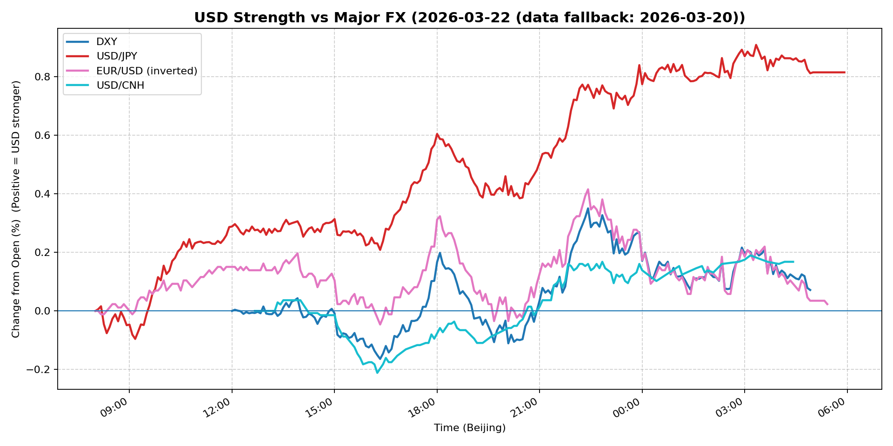
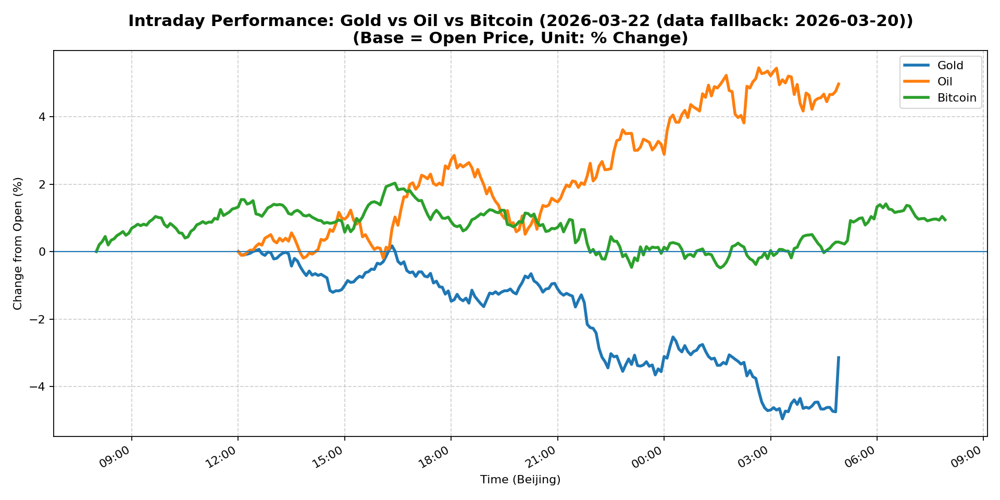
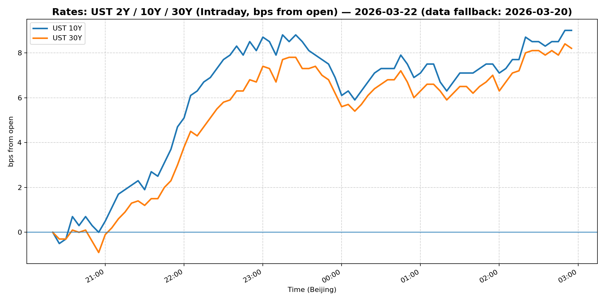
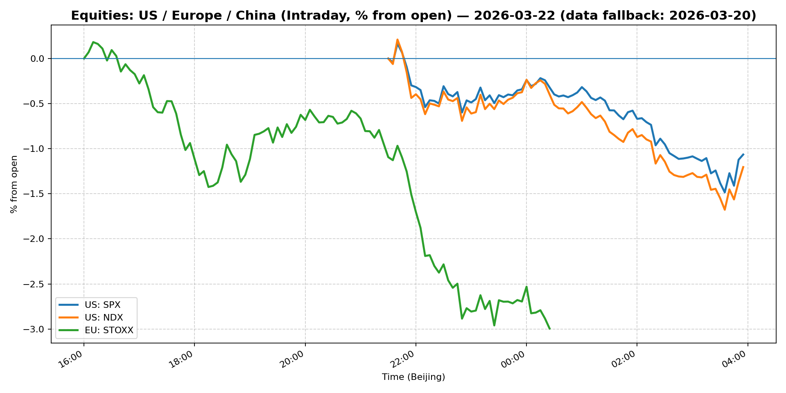
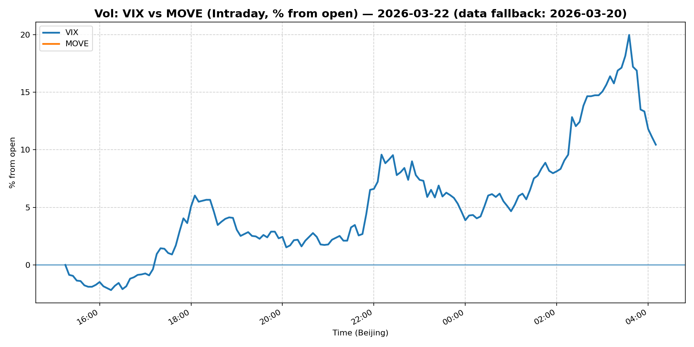
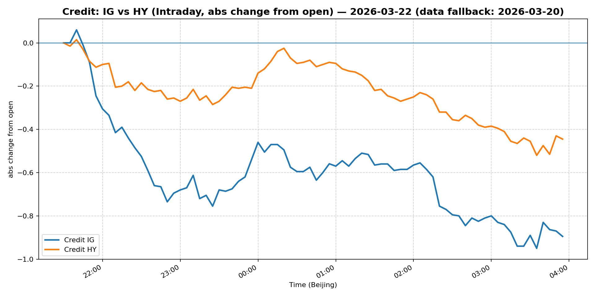

# 📅 Market Diary: 2026-03-22

---

> **Data fallback:** requested date `2026-03-22` had no usable intraday market data. Charts, chart features, and market snapshot below use the last available trading day: `2026-03-20`.

## 🧠 AI Macro Analysis

# Market Diary — 2026-03-22 (Beijing Time)

## -1) Chart read

- **USD chart (Chart 1):** FX Composite net +0.81pp with tight +0.87pp range — strong trending move driven by USD/JPY (+0.81pp net). DXY barely moved (+0.07pp), but USD/JPY breakout above 157 triggered broad USD strength. Turning point: USD/JPY trough at 09:10 Beijing time, then rallied through Asian session to peak at 03:20 on the 21st. EUR/USD and USD/CNH showed modest intraday range but ultimately USD composite closed at session highs.

- **Gold/Oil/BTC chart (Chart 2):** Extreme divergence: Oil +4.97pp (best) vs Gold -3.15pp (worst), spread +8.12pp. Correlations broken: Gold-Oil r=-0.92 (strong inverse), Oil-BTC r=-0.81 — risk-on regime with energy/liquidity assets outperforming havens. Bitcoin +0.94pp modest gain, lagging oil but outperforming gold. This is not a typical inflation hedge signal; it's a growth/China stimulus speculation regime with simultaneous Treasury selloff.

## 0) One-line takeaway

Treasury yields spiking (+25bp+ on 5Y/10Y) with VIX +11% and MOVE +28% signals macro shock — USD strength is rate-driven, oil rallies on growth/inflation expectations, gold crashes as real yields rise and risk appetite shifts to "risk-on" assets.

## 1) Market tape

### Asia
- **JPY collapse triggered USD rally:** USD/JPY broke above 157 as Asian session opened, driven by month-end rebalancing and BoJ policy uncertainty — yen shorts covering aggressively.
- **China equities under pressure:** Shanghai Composite -1.24%, FXI -2.85% — continued outflows on growth concerns despite commodity strength.
- **Tech exposure hurt:** Semiconductor and tech-heavy indices led Asian equities lower.

### Europe
- **Euro Stoxx -2.00%:** Broad-based selloff as US equity futures dropped. Banking and cyclicals lagged most.
- **EUR/USD briefly bounced:** Early European session saw EUR strength (+0.99% on the day vs DXY +0.42%), but USD regained footing into US open.
- **Credit widening:** IG and HY spreads widened on the equity selloff.

### US
- **Equity correction deepens:** S&P -1.51%, Nasdaq -1.88%, Russell 2000 officially in correction (-20%+ from highs).
- **Treasury selloff accelerated:** 5Y +37bp, 10Y +41bp on the day — yields at YTD highs. Fed's Waller comments ("caution for now") did nothing to calm rates.
- **VIX +11%, MOVE +28%:** Volatility regime shift — both equity and rates vol surging simultaneously. Unusual "both sides blowing up" environment.
- **Small caps first to correct:** Russell 2000 officially entered correction territory — rotation out of domestic cyclicals accelerating.

## 2) Cross-asset dashboard

| Bucket | What moved | Mechanism | Signal quality |
|---|---|---|---|
| Rates (UST/Bunds) | 5Y +37bp, 10Y +41bp, MOVE +28% | Fiscal fears + Fed pushback on cuts + term premium repricing | High |
| FX (USD/JPY/EUR/CNH) | USD/JPY +1.4% (breakout), USD/CNH +1.71% | JPY carry unwind, CNH on China growth fears | High |
| Equities (US/EU/CN) | S&P -1.5%, Nasdaq -1.9%, Russell 2000 in correction | Vol spike triggers de-risking, rotation out of small caps | High |
| Credit | IG -1.23%, HY -0.93% | Risk-off flows, spreads widen | Medium |
| Commodities | Oil +4.97%, Gold -3.15%, Copper -1.67% | Oil = growth/China stimulus bet; Gold = real yield rise hit | High |
| Vol (VIX/MOVE) | VIX +11.3%, MOVE +28.2% | Simultaneous equity + rates vol explosion | High |

## 3) What changed the narrative today?

### Driver #1: Treasury Term Premium Repricing
- **Variable:** 10Y yield +41bp to 4.39%
- **Mechanism:** Fed's Waller pushed back on rate cut pricing, reinforcing "higher for longer" — combined with still-elevated inflation data, term premium repricing rapidly.
- **Evidence:**
  - Market: 5Y/10Y/30Y all up 25-40bp; MOVE +28%
  - Event: Fed Governor Waller said "caution for now, rate cuts possible later"
- **Action:** Short duration, long 2s10s steepener, avoid long-duration equity (tech/growth)
- **Source of Uncertainty:** How much of the move is positioning squeeze vs genuine macro shift?
- **Invalidation Criteria:** Fed speakers tomorrow signal clearer cuts path; 10Y holds 4.50%+

### Driver #2: Oil Rally on China/Growth Speculation
- **Variable:** WTI +4.97% to $98.32
- **Mechanism:** Speculation on China stimulus + inventory draw + Middle East supply concerns = risk-on commodity bid
- **Evidence:**
  - Market: Oil best performer across all assets; gold worst (-3.15%)
  - Event: No specific catalyst, but flows suggest positioning for China reopening 2.0
- **Action:** Long energy equities, long oil directly, short gold/precious metals
- **Source of Uncertainty:** China actual stimulus details; SPR release; Iran nuclear deal
- **Invalidation Criteria:** China PMI collapses; crude breaks below $92

### Driver #3: Russell 2000 Correction Triggers De-risking
- **Variable:** Russell 2000 enters correction (-20% from peak)
- **Mechanism:** Small caps = "real economy" bet; when they correct, it signals growth fears spreading from "soft landing" to "no landing/recession"
- **Evidence:**
  - Market: Russell -2%+ on day; breadth extremely weak (90% of S&P stocks below 50dma)
  - Event: First US benchmark to officially enter correction territory
- **Action:** Short small caps, rotate to quality/large-cap defensives
- **Source of Uncertainty:** Is this a rotation or capitulation?
- **Invalidation Criteria:** Russell rebounds above 2000 DMA; small cap earnings surprise

## 4) Rates & USD: the "macro spine"

- **Curve / real yield / inflation breakevens:** Curve steepened significantly (2s10s likely moving positive) as long-end sold off harder than front-end. Real yields rising sharply — gold crushed on this. Breakevens likely up on oil spike but overwhelmed by nominal yield move.
- **USD reaction function:** Currently trading "rates + risk" — USD strength is rate-driven (JPY carry unwind) but also risk-sensitive (CNH weaker on China growth). DXY's modest +0.42% vs USD/JPY's +1.4% shows JPY is the driver, not broad USD strength.
- **Key levels:** DXY 99.65 (resistance ~100); USD/JPY 157.92 (breakout level now support); USD/CNH 7.00 (critical, yuan at lows).

## 5) Flows, positioning & options

- **Positioning guess (CTA/discretionary/hedge):** CTA trend followers likely long USD, short bonds, long oil — this is a "reflation/reset" regime. Discretionary is de-risking hard (equity drawdown, vol spike). Hedge funds adding vol longs but covering risk assets.
- **Options / vol mechanics:** Heavy put skew in equities; call vol in bonds. Dealer gamma likely short vol — rapid vol spike suggests forced hedging of delta exposure. March quarter-end (Monday) could amplify moves.
- **Where you may be wrong:** 
  - Oil rally may be overdone (no fundamental catalyst, just positioning)
  - Treasury selloff could reverse quickly if Fed speakers turn dovish
  - Russell correction may attract "buy the dip" flows

## 6) Today's Trading Plan

- **Directional Bias:** Risk-off but nuanced — short duration, short small caps, long USD vs CNH, short gold, long oil/gas. Overall: **defensive/neutral with tactical long USD and energy**.

- **2–4 Trade Setups:**

  1. **Short 10Y Treasury (TY)**
     - Trigger: If 10Y re-tests 4.45% level with VIX above 25
     - Entry: 4.42-4.45% zone / Stop: 4.50% / Target: 4.20%
     - Sizing: Medium — term premium move has legs
     - Hedge: Long 2Y as curve steepener
     - Why now: Term premium repricing incomplete; Waller comments reinforce

  2. **Long USD/JPY (via NDF or futures)**
     - Trigger: USD/JPY holds above 157.50 on London open
     - Entry: 157.50 / Stop: 156.80 / Target: 159.50
     - Sizing: Medium — JPY carry unwind still underway
     - Hedge: Small long JPY calls for tail
     - Why now: Breakout above 157, BoJ uncertainty, month-end rebalancing

  3. **Short Russell 2000 (RTY futures)**
     - Trigger: If RTY rallies toward 1950-1980 zone
     - Entry: 1970 / Stop: 2020 / Target: 1800
     - Sizing: Small-Medium — correction has room but bounce risks
     - Hedge: Long S&P put (200dma)
     - Why now: First major US index in correction; leadership failing

  4. **Long Oil (WTI futures) or Energy equities (XLE)**
     - Trigger: WTI holds $97+ with copper >$5.10
     - Entry: $97.50 / Stop: $94 / Target: $105
     - Sizing: Small — momentum but overextended
     - Hedge: Short gasoline crack spread
     - Why now: China stimulus speculation + supply fears; divergent from equity selloff = risk-on commodity

- **Portfolio risk rules:**
  - **Max daily loss / heat:** -1.5% portfolio; reduce exposure if VIX >30
  - **Correlation risk:** Oil/stock correlation turning negative — don't assume "oil up = stocks up" 
  - **Tail risk hedge:** Hold 5% SPX puts (30-delta), small long VIX calls

## 7) What to watch tomorrow

- **Key catalysts (US/EU/CN):**
  - US: New home sales, Richmond Fed manufacturing, multiple Fed speakers (Kashkari, Barr)
  - China: Manufacturing PMI (expected ~50.5, critical for oil thesis)
  - Europe: ECB minutes from last meeting

- **Scenario map (2–3):**
  - **If China PMI beats >51** → Oil extends rally (+3%+), USD strengthens further, Russell bounces — **long oil/energy, short Treasuries**
  - **If China PMI misses <50** → Oil drops -4%+, gold rebounds, risk-off intensifies — **long gold, long Treasuries, short Russell**
  - **If Fed speakers turn explicitly dovish** → 10Y drops -15bp, tech bounces, USD weakens — **long S&P, short USD**

- **Thesis invalidation checklist:**
  1. VIX sustains below 22 AND 10Y holds below 4.30% → rate shock over, rotate back to growth
  2. USD/JPY closes below 156.50 → JPY carry trade unwind reverses
  3. Oil breaks below $92 with no China catalyst → commodity supercycle thesis broken

---

## 📊 Charts

### 💵 USD Strength (FX, Intraday %)

### 🟡🛢️₿ Gold vs Oil vs Bitcoin (Intraday %)

### 🏦 Rates: UST 2Y/10Y/30Y (bps from open)

### 📉 Equities: US/EU/CN (Intraday %)

### 🌪️ Vol: VIX vs MOVE (Intraday %)

### 🧱 Credit: IG vs HY (abs change)

---

*Generated on 2026-03-23 04:14:08*
