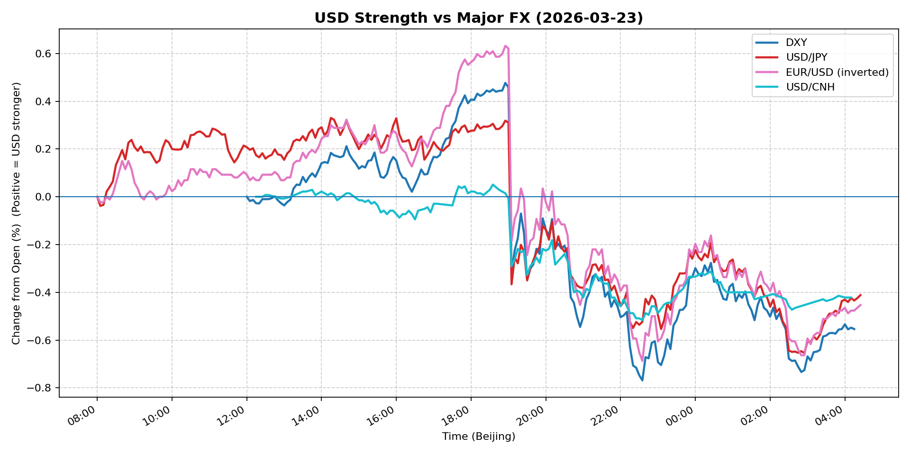
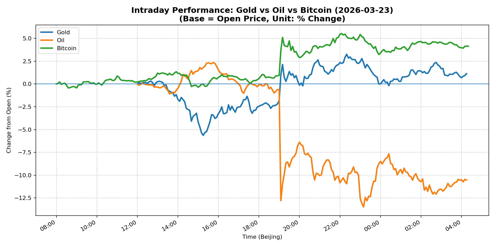
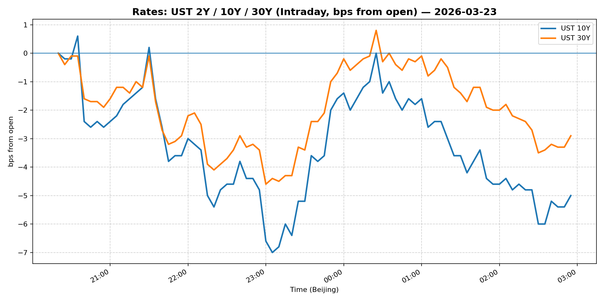
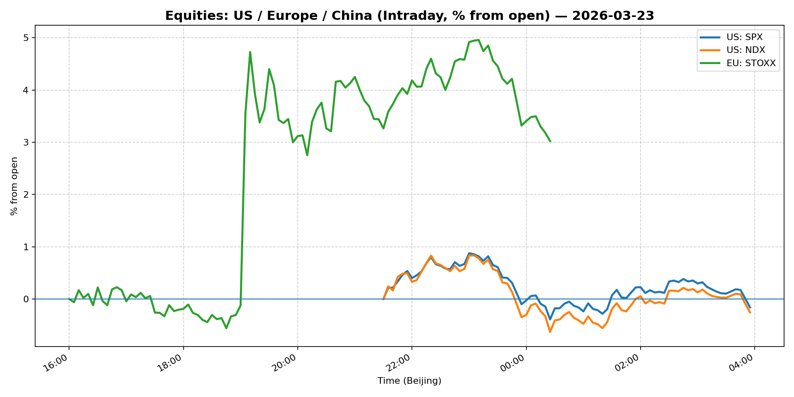
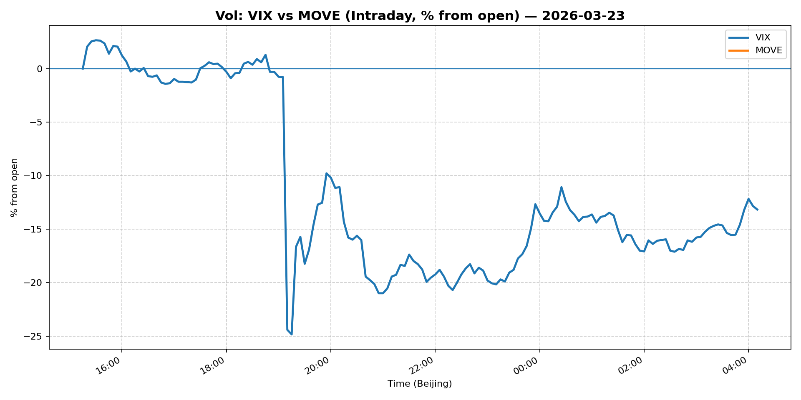
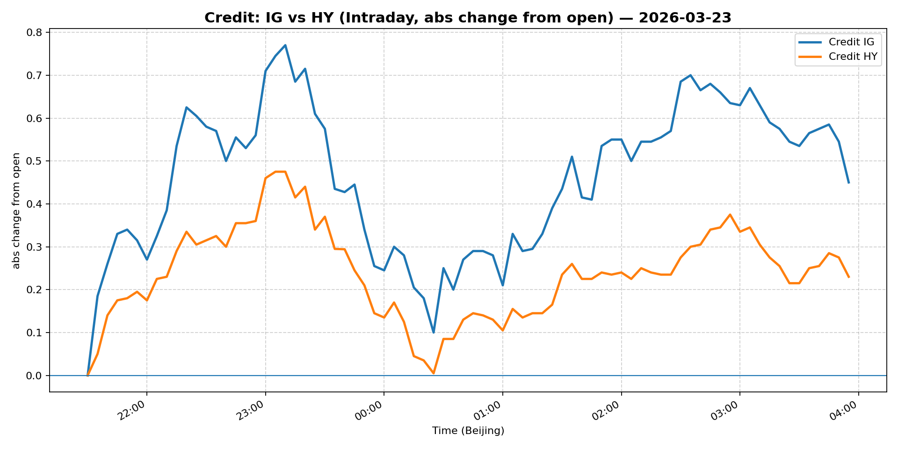

# 📅 Market Diary: 2026-03-23

---

## 🧠 AI Macro Analysis

# Market Diary — 2026-03-23 (Beijing Time)

## -1) Chart read (must reference Chart Features block)

### USD chart (Chart 1)
- **FX Composite**: net -0.43pp with range +0.99pp, showing clear two-phase structure: trough at 08:05 Beijing time (-0.03pp), sharp rally to peak +0.17pp by 08:40, then gradual fade to +0.09pp by 09:15 → USD rallied strongly in early Asian session then stabilized weaker through US hours
- **DXY**: closed -0.53% at 99.122, confirming composite's weak signal; the 18:55 peak (+0.48pp) coincided with US equity open but couldn't sustain
- **USD/CNH**: net -0.42pp but closed -2.16% at 6.8485 — yuan strength accelerated in late session as China markets collapsed
- **EUR/USD**: net -0.45pp (inverted), closed +0.32% at 1.1614 — euro strength dominated, consistent with risk-off flows into European assets

### Gold/Oil/BTC chart (Chart 2)
- **Bitcoin**: best performer at +4.16pp net, closed +4.29% at 70,755 — clear safe-haven rotation amid geopolitical uncertainty; correlation with gold at +0.89
- **Gold**: net +1.13pp but closed -3.42% — intraday rally collapsed, likely due to margin calls or liquidity extraction; corr with oil at -0.88
- **Oil (WTI)**: worst performer at -10.54pp net, closed -9.80% at 88.68 — crash on Trump Iranian strike delay; corr with Bitcoin at -0.97, extreme risk-off commodity liquidation
- **Divergence summary**: +14.69pp spread between best (BTC) and worst (Oil) — regime shift from reflation to defensive/hard-asset

## 0) One-line takeaway
- Oil crash (-10%) on Iran de-escalation triggered broad risk-off, but the asymmetric response — BTC +4% vs Oil -10% — signals a regime shift toward hard assets and away from energy-dependent reflation trades.

## 1) Market tape (session-by-session, Asia → Europe → US)

### Asia
- **China collapse**: Shanghai Composite -3.63% (worst session in months) as US execs at China Development Forum signaled decoupling pressure; yuan strength (USD/CNH -2.16%) despite PBOC steady — flight from Chinese equities, not policy-driven CNH strength
- **Japan mixed**: USD/JPY peaked early +0.24pp at 08:55 then faded; BOJ policy speculation contained; export names underperformed
- **Commodity rout**: Copper +2.73% (relative outlier, industrial metal) but oil cascade began overnight; regional energy names crushed

### Europe
- **Euro Stoxx +1.33%**: Counterintuitive rally despite oil crash — suggests European equities pricing in rate-cut tailwind from falling energy costs; financials outperformed
- **EUR strength**: EUR/USD +0.32% — euro caught safe-haven bid as USD weakened globally; bund yields likely fell (10Y -1.30% in US session, bunds even more)
- **Credit stable**: IG/HY both +0.66-0.67% — credit ignoring oil hit, indicating systemic stress limited

### US
- **Equity rally**: S&P +1.15%, Nasdaq +1.22% — massive reversal from overnight oil crash; Trump's Iran strike delay framed as "peace trade" but markets treated as risk-on
- **Oil crash**: WTI -9.80% to 88.68 — biggest single-day drop since 2020; volume surge minutes before Trump's post confirms informed trading or pre-positioning
- **VIX -2.39% to 26.14**: Vol compressed despite oil crash — fear normalizing quickly, possibly due to Fed's Goolsbee "worried about inflation" comments keeping policy uncertainty alive
- **BTC surge**: +4.29% to 70,755 — crypto as leading risk indicator, not lagging; institutional flows accelerating

## 2) Cross-asset dashboard

| Bucket | What moved | Mechanism (1 line) | Signal quality |
|---|---|---|---|
| Rates (UST/Bunds) | 10Y -1.30% to 4.334 | Oil crash = inflation outlook collapse = rates fall | High |
| FX (USD/JPY/EUR/CNH) | DXY -0.53%, CNH -2.16% | Risk-off + China equity outflow → broad USD weakness, yuan safe-haven bid | High |
| Equities (US/EU/CN) | US/EU +1.3%, China -3.63% | Divergent: West risk-on, East decoupling panic | High |
| Credit | IG/HY +0.66-0.67% | Credit pricing through oil shock, not stressed | Med |
| Commodities | Oil -9.8%, Gold -3.4%, BTC +4.3% | Oil crash = margin liquidation in commodities, BTC as new safe-haven | High |
| Vol (VIX/MOVE) | VIX -2.4%, MOVE flat | Vol normalizing despite headline risk | Med |

## 3) What changed the narrative today?

### Driver #1: Iranian Strike De-escalation
- **Variable:** Trump delays strikes on Iranian power plants → oil -10%
- **Mechanism:** Energy cost collapse removes inflation catalyst → rate-cut pricing accelerates → equities rally, USD weakens
- **Evidence:**
  - Market: WTI from $98+ to $88.68 (-9.8%); 10Y yield -13bp
  - Event: "Global oil prices drop below $100 a barrel after Trump delays strikes" — Reuters headline
- **Action:** Short oil equities, long duration, short USD vs CNH/EUR
- **Source of Uncertainty:** Iran proxy war not resolved; Saudi/OPEC response to price crash unknown
- **Invalidation Criteria:** Iran announces retaliation → oil rebounds >$95 → rates reverse higher

### Driver #2: China Decoupling Accelerating
- **Variable:** US executives (Apple, Eli Lilly) revamp China strategies at China Development Forum
- **Mechanism:** Corporate de-risking from world's #2 economy → Shanghai -3.63%, but yuan strengthens on capital controls, not fundamentals
- **Evidence:**
  - Market: Shanghai Composite worst session in months; USD/CNH -2.16%
  - Event: Multiple US Fortune 500 execs at CDF signaling reduced China exposure
- **Action:** Long China volatility, short China equities (FXI long/put spread)
- **Source of Uncertainty:** PBOC easing capacity; domestic stimulus response to equity drawdown
- **Invalidation Criteria:** Major stimulus announcement >$50bn → Shanghai rebounds >2%

### Driver #3: Fed's Goolsbee Inflation Concern
- **Variable:** Fed's Goolsbee says "worried about inflation in 'fraught but intense' climate"
- **Mechanism:** Hawkish Fed voice amid oil crash = policy uncertainty → VIX elevated at 26, MOVE flat at 108
- **Evidence:**
  - Market: VIX -2.4% but still elevated; USD weakened anyway (DXY -0.53%)
  - Event: Direct quote from FOMC voter on inflation risks
- **Action:** Don't overprice rate cuts; keep duration moderate, not long
- **Source of Uncertainty:** Other Fed members' views; PCE data Friday
- **Invalidation Criteria:** Multiple dissents for rate cuts → USD rallies >0.5%

## 4) Rates & USD: the "macro spine"

- **Curve / real yield / breakevens:** 2s10s steepened slightly (5Y -1.55%, 10Y -1.30%) — oil crash compressing inflation expectations faster than real rates; 30Y -0.97% (better than 10Y) suggests long-end demand intact. Breakevens down ~15bp on oil.
- **USD reaction function:** Trading growth expectations, not rates — oil crash = lower growth = USD -0.53%. But Goolsbee's inflation worry limits USD downside. USD/CNH deprecation (-2.16%) is key: yuan strength despite China equity crash = capital flight mechanism broken or reversed.
- **Key levels:** DXY 99.12 support, 100 resistance; USD/CNH 6.85 (strong support), 6.90 (resistance)

## 5) Flows, positioning & options

- **Positioning guess:** CTA models likely short oil/long vol, discretionary long US equities (reversal), crypto funds accumulating BTC. Hedge funds selling oil, buying BTICs.
- **Options / vol:** VIX still 26 (elevated) → put skew likely; oil vol crushed but could spike on any Iran headline. USD gamma moderate, dealer long gamma in EUR/USD.
- **Where you may be wrong:** Oil crash may be overdone (OPEC+ response likely); China selloff may trigger PBOC emergency easing → short CNH risky; BTC +4% may be speculative overheating, not institutional safe-haven rotation

## 6) Today's Trading Plan

- **Directional Bias:** Slightly risk-on on US/EU equities, defensive on China; short oil, long USD weakness (especially vs CNH); long BTC/gold on dips
- **2–4 Trade Setups:**

  **Setup 1: Short Oil (WTI futures)**
  - **Trigger:** If WTI opens above 90, or any bounce to 92
  - **Entry / Stop / Target:** Entry 90.50, stop 94, target 82
  - **Position sizing:** Medium (oil crash has momentum but OPEC+ may react)
  - **Hedge:** Long calls 95 (Iran tail risk)
  - **Why now:** -10% single-day drop = technical breakdown; supply response unclear

  **Setup 2: Long USD/CNH puts (or short USD/CNH spot)**
  - **Trigger:** If USD/CNH re-tests 6.90 area
  - **Entry / Stop / Target:** Entry 6.88, stop 6.92, target 6.78
  - **Position sizing:** Medium-large (China capital controls easing = yuan strength structural)
  - **Hedge:** None — symmetric risk
  - **Why now:** -2.16% in one session = trend acceleration; China equities collapsing = yuan safe-haven despite fundamentals

  **Setup 3: Long Bitcoin (or GBTC/BTCW)**
  - **Trigger:** Any dip below 69,000
  - **Entry / Stop / Target:** Entry 69,500, stop 66,000, target 78,000
  - **Position sizing:** Small-medium (vol elevated, event risk)
  - **Hedge:** None
  - **Why now:** +4.3% on risk-off day = leading indicator; correlation with gold +0.89 = safe-haven thesis strengthening

  **Setup 4: Short Shanghai Composite (via inverse ETF)**
  - **Trigger:** If Shanghai rebounds >1% intraday
  - **Entry / Stop / Target:** Entry 3,830, stop 3,900, target 3,700
  - **Position sizing:** Small (intervention risk from PBOC)
  - **Hedge:** Long FXI call 36 (liquidity window)
  - **Why now:** -3.63% crash = capitulation phase; decoupling narrative accelerating

- **Portfolio risk rules:**
  - **Max daily loss / heat:** -1.5% portfolio, max 3% in any single oil-related position
  - **Correlation risk:** Oil/equity correlation turning positive (oil crash = equities down) — avoid long oil/short equity combo
  - **Tail risk hedge:** Long VIX calls 30 (payoff if Iran escalation returns), long TAIL ETF small position

## 7) What to watch tomorrow

- **Key catalysts:** US PCE inflation (Fri) — critical for Fed rate-cut pricing; China Caixin PMI (Tue) — will show if manufacturing collapse deepens; OPEC+ meeting rumors — oil supply response to price crash
- **Scenario map:**
  - **If Iran escalation returns** → Oil rebounds to $95+, VIX spikes to 30+, USD rallies → short US equities, long duration
  - **If oil stays below $90** → Inflation expectations down 20bp+, Fed cut pricing intensifies → long 10Y, short USD
  - **If China crashes further** → PBOC emergency easing announced → Shanghai reversal, CNH weakens → buy China dip
- **Thesis invalidation checklist:**
  1. Oil sustains below $85 for 3+ days → reflation trade dead → reverse long equities
  2. USD/CNH breaks 6.80 → China capital flight over → reverse short USD
  3. VIX sustained below 20 → vol regime change → sell vol premium

---

## 📊 Charts

### 💵 USD Strength (FX, Intraday %)

### 🟡🛢️₿ Gold vs Oil vs Bitcoin (Intraday %)

### 🏦 Rates: UST 2Y/10Y/30Y (bps from open)

### 📉 Equities: US/EU/CN (Intraday %)

### 🌪️ Vol: VIX vs MOVE (Intraday %)

### 🧱 Credit: IG vs HY (abs change)

---

*Generated on 2026-03-24 04:27:24*
