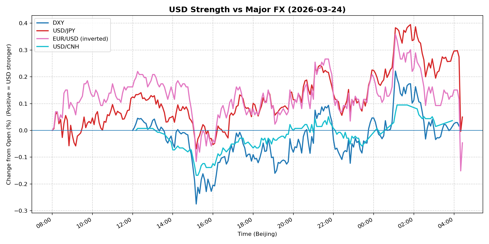
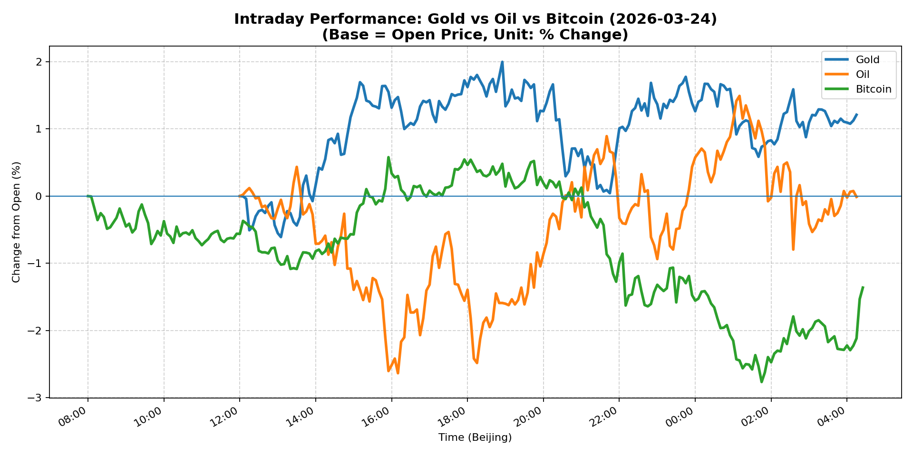
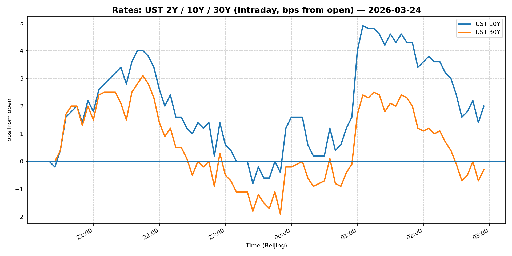
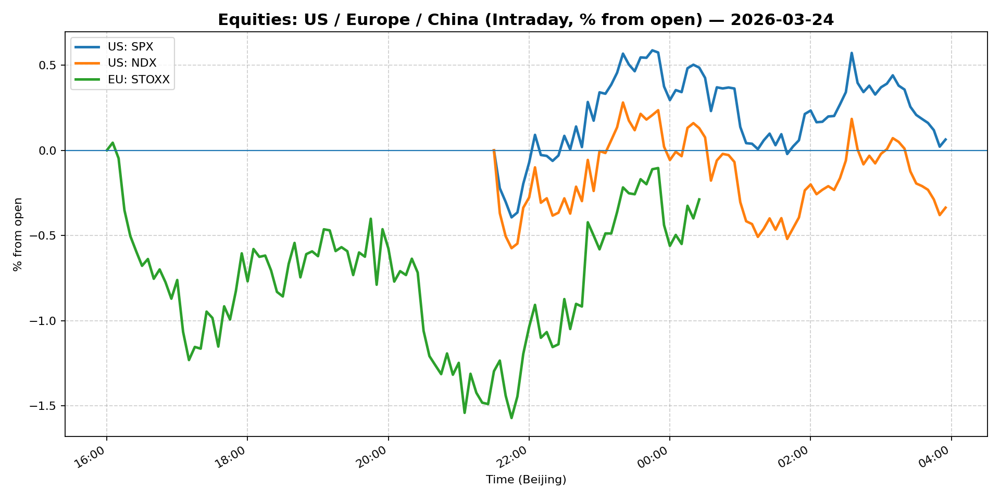
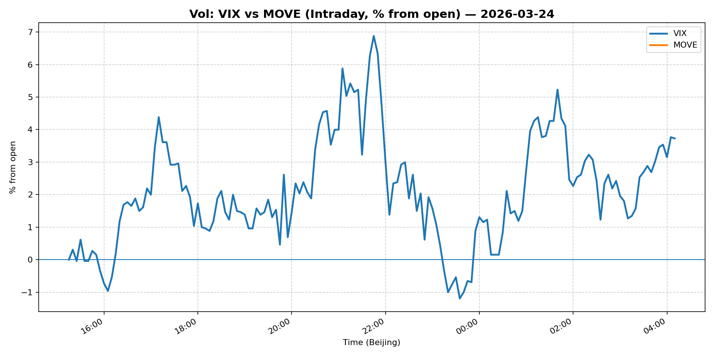
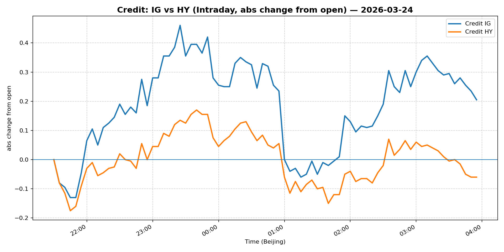

# 📅 Market Diary: 2026-03-24

---

## 🧠 AI Macro Analysis

# Market Diary — 2026-03-24 (Beijing Time)

## -1) Chart read

- **USD chart (Chart 1):** FX Composite net +0.00pp masked significant intraday volatility (range +0.41pp). The composite printed a clear peak at 08:15 Beijing time (+0.07pp) before resetting to flat. DXY showed late-session strength, peaking at 01:05. USD/JPY was the driver—rallying +0.40pp at 01:50 Beijing after Asian session weakness. The pattern suggests a shift from Asia-driven USD weakness to US session strength.
- **Gold/Oil/BTC chart (Chart 2):** Extreme divergence: Gold +1.21pp vs Bitcoin -1.36pp (spread 2.57pp). Gold's trough was at 12:15 (-0.51pp) with recovery into the evening. WTI was volatile (range +4.13pp) but ended flat despite Middle East tensions. The Gold–Oil correlation turned negative (-0.41), breaking their typical positive relationship, while Oil–Bitcoin correlation was strongly negative (-0.73)—risk-off in crypto but bid in gold.

## 0) One-line takeaway

Gold's safe-haven bid and oil's geopolitical spike (troop deployment) competed with crypto risk-off, while USD held firm into the US close—the market is pricing a "new normal" of geopolitical risk without abandoning dollar dominance.

## 1) Market tape (session-by-session)

### Asia
- **FX:** USD/JPY rallied +0.40pp in the final hour of the Tokyo session (01:50 Beijing), erasing earlier -0.07pp weakness. USD/CNH was flat at 6.862 despite PBOC guidance.
- **Equities:** Shanghai Composite +1.78%, driven by domestic policy support and risk-on in Chinese assets. China Large-Cap (FXI) slipped -0.11%, showing divergence between A-shares and H-shares.
- **Commodities:** Copper +0.29% as China demand hopes persisted.

### Europe
- **Equities:** Euro Stoxx 50 +0.13%, muted open.
- **FX:** EUR/USD inverted metric shows -0.05pp (EUR stronger), with EUR finding bids on the troughs at 08:20 and 08:50 Beijing.
- **Rates:** European yields likely followed US Treasury higher (10Y at 4.392%).

### US
- **Equities:** S&P 500 -0.37%, Nasdaq 100 -0.77%—tech under pressure from AI disruption fears. Crypto selloff (BTC -1.36%) added to risk-off.
- **Credit:** IG (LQD) -0.20%, HY (HYG) -0.34%—spreads widened modestly on equity weakness.
- **Vol:** VIX +3.17% to 26.98, indicating elevated uncertainty. MOVE flat at 98.15.
- **Commodities:** WTI spiked to +4.19% ($91.82) on Pentagon troop deployment news—geopolitical risk premium reasserted.

## 2) Cross-asset dashboard

| Bucket | What moved | Mechanism | Signal quality |
|---|---|---|---|
| Rates (UST/Bunds) | 10Y +1.34% to 4.392% | Fed pricing + growth uncertainty | High |
| FX (USD/JPY/EUR/CNH) | USD/JPY late rally (+0.40pp), EUR flat | Geopolitics + yield differential | Med |
| Equities (US/EU/CN) | Tech selloff (Nasdaq -0.77%); China +1.78% | AI disruption fears vs China stimulus | High |
| Credit | IG/HY spreads wider | Equity correlation selloff | Med |
| Commodities | WTI +4.19%, Gold +0.03%, Copper +0.29% | Middle East troops + safe-haven | High |
| Vol (VIX/MOVE) | VIX +3.17%, MOVE flat | Uncertainty spike | High |

## 3) What changed the narrative today?

### Driver #1: Pentagon Middle East Troop Deployment
- **Variable:** Geopolitical risk premium in oil
- **Mechanism:** 3,000 troops to Middle East = direct supply threat premium
- **Evidence:**
  - Market: WTI +4.19% ($91.82), largest single-day move
  - Event: Pentagon announcement mid-session
- **Action:** Long WTI calls; short oil-sensitive equities; use gold as hedge
- **Source of Uncertainty:** Diplomatic resolution, Iranian response, SPR release
- **Invalidation Criteria:** Peace talks headline, Iran nuclear deal progress

### Driver #2: AI Disruption Fear in Software Sector
- **Variable:** Tech sector earnings/valuation pressure
- **Mechanism:** Fear that AI replaces software business models = multiple compression
- **Evidence:**
  - Market: Nasdaq 100 -0.77%, software names underperform
  - Event: Broad narrative shift in market commentary
- **Action:** Short software/long hardware; use semicon as relative play
- **Source of Uncertainty:** Actual AI product cycles, earnings beats/misses
- **Invalidation Criteria:** Major software earnings beat, clear AI revenue lift

### Driver #3: Crypto Risk-Off vs Gold Safe-Haven
- **Variable:** Regime shift in alternative assets
- **Mechanism:** BTC drawdown (-1.36%) amid broader risk-off; gold catches bid (+1.21%)
- **Evidence:**
  - Market: Gold–BTC spread +2.57pp; Oil–BTC correlation -0.73
  - Event: Combined geopolitical + tech selloff
- **Action:** Long gold/short BTC spread; use gold as portfolio hedge
- **Source of Uncertainty:** BTC ETF flows, institutional adoption pace
- **Invalidation Criteria:** BTC reclaiming $72K+ on volume

## 4) Rates & USD: the "macro spine"

- **Curve / real yield / inflation breakevens:** 10Y at 4.392% (+1.34%), 5Y at 4.03% (+2.03%). Curve steepening continues—long-end yields rising faster than short. Real yields likely positive given breakeven movement. The "5% threshold" narrative in headlines suggests bond market pain trade persists.
- **USD reaction function:** USD is trading primarily on geopolitics (Middle East risk) and yield differential. DXY +0.47% to 99.414—the recent range breakout higher. USD/JPY at 158.634 (-0.38%) shows JPY weakness despite risk-off (unusual).
- **Key levels:** DXY 99.4 (breakout), USD/JPY 158 (resistance), 10Y 4.40% (critical level).

## 5) Flows, positioning & options

- **Positioning guess (CTA / discretionary / hedge):** CTA likely USD long given trend continuation; discretionary rotating from tech to value; hedge funds adding gold/short crypto.
- **Options / vol mechanics:** VIX +3.17% to 26.98—elevated but not crisis. Put skew likely rising given tech selloff. March expiry proximity may amplify gamma. Dealer positioning probably short gamma ( sellers of vol) after recent rally.
- **Where you may be wrong:** (1) Oil spike may be temporary headline-driven rather than structural supply; (2) China's equity rally may be transient policy-driven without fundamental support.

## 6) Today's Trading Plan (actionable, risk-managed)

- **Directional Bias:** Long USD (selective), Long Gold, Short Tech/Long Energy, Neutral Equities.

- **2–4 Trade Setups:**
  1. **Instrument:** USD/JPY calls (or NDF)
    - **Trigger:** If USD/JPY breaks 159.50 with volume
    - **Entry / Stop / Target:** Entry 158.80, Stop 157.50, Target 161.00
    - **Position sizing:** Medium—yield differential + risk-off supports
    - **Hedge:** None needed
    - **Why now:** Late-session strength + geopolitical risk = USD bid

  2. **Instrument:** Gold (GC futures or GLD)
    - **Trigger:** If gold holds $4400, add on pullback to $4380
    - **Entry / Stop / Target:** Entry 4405, Stop 4350, Target 4500
    - **Position sizing:** Medium—safe-haven bid clear
    - **Hedge:** Small short BTC position as hedge
    - **Why now:** Divergence from crypto + geopolitical risk premium

  3. **Instrument:** WTI calls (or US Oil ETF)
    - **Trigger:** If WTI re-tests $90 on upward momentum
    - **Entry / Stop / Target:** Entry 91.50, Stop 88.00, Target 97.00
    - **Position sizing:** Small—geopolitical premium volatile
    - **Hedge:** Use puts to cap upside if troops撤回
    - **Why now:** Troop deployment is direct supply risk

  4. **Instrument:** Nasdaq 100 puts (or QQQ puts)
    - **Trigger:** If Nasdaq breaks 23800 on tech selloff
    - **Entry / Stop / Target:** Entry 24000, Stop 24300, Target 23200
    - **Position sizing:** Small to medium—AI fear not yet bottom
    - **Hedge:** Long semicon (SMH) relative hedge
    - **Why now:** AI disruption narrative just beginning

- **Portfolio risk rules:**
  - **Max daily loss / heat:** 2.5% portfolio; cap sector exposure at 30%
  - **Correlation risk:** Oil–USD correlation can flip; monitor gold–spx
  - **Tail risk hedge:** Hold 5% short VIX calls; maintain 3% cash

## 7) What to watch tomorrow

- **Key catalysts (US/EU/CN):** US manufacturing PMI (final), ECB speakers, China manufacturing PMI (final), Middle East news wires.
- **Scenario map (2–3):**
  - If Middle East escalation → expect WTI $95+, USD strength, tech further selloff → play: long energy, short S&P
  - If diplomatic de-escalation → expect oil -5%, gold -2%, risk-on → play: long tech, short energy
  - If US data soft → expect Fed cut pricing, USD weakness → play: long bonds, short USD
- **Thesis invalidation checklist:**
  - [ ] WTI sustains above $93—thesis holds
  - [ ] VIX stays above 25—vol regime elevated
  - [ ] Gold stays above $4380—safe-haven demand intact

---

## 📊 Charts

### 💵 USD Strength (FX, Intraday %)

### 🟡🛢️₿ Gold vs Oil vs Bitcoin (Intraday %)

### 🏦 Rates: UST 2Y/10Y/30Y (bps from open)

### 📉 Equities: US/EU/CN (Intraday %)

### 🌪️ Vol: VIX vs MOVE (Intraday %)

### 🧱 Credit: IG vs HY (abs change)

---

*Generated on 2026-03-25 04:30:21*
