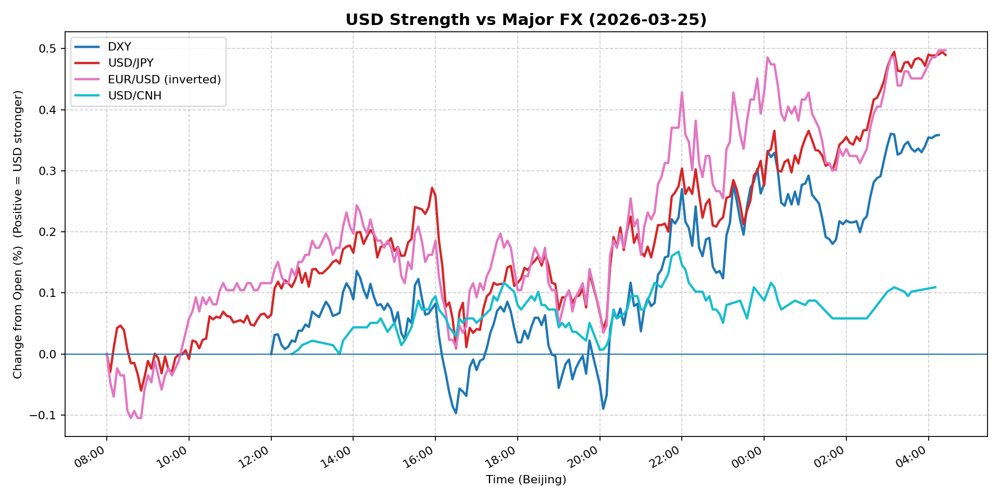
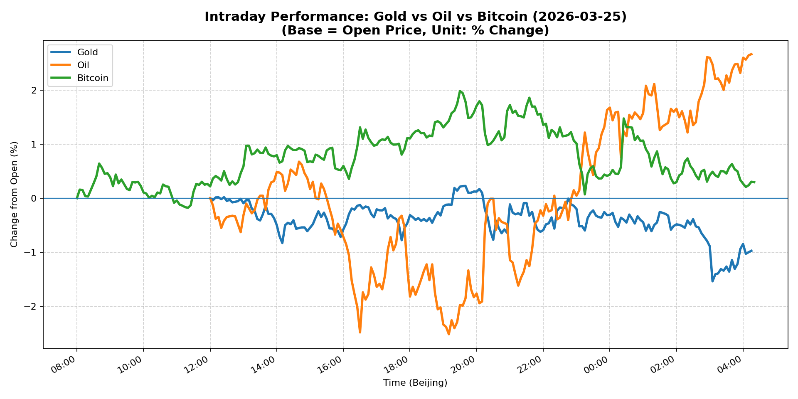
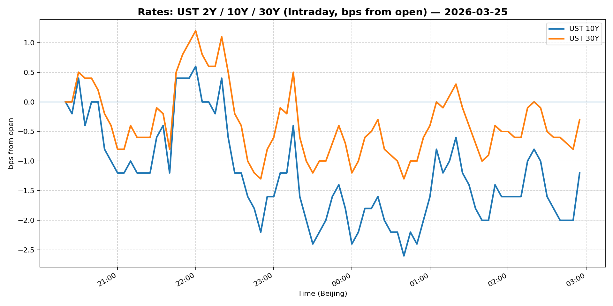
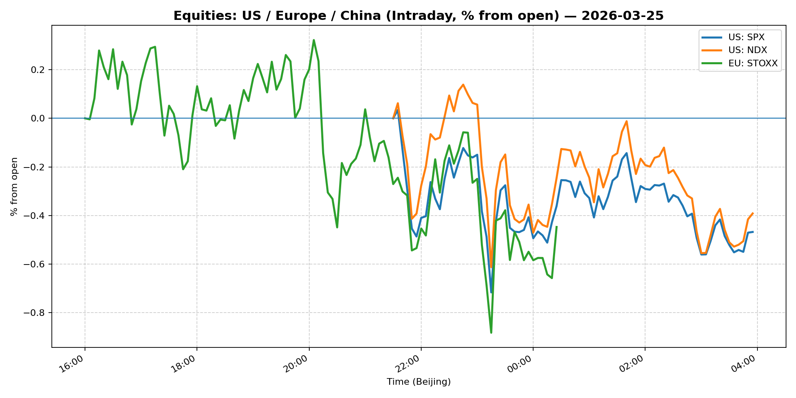
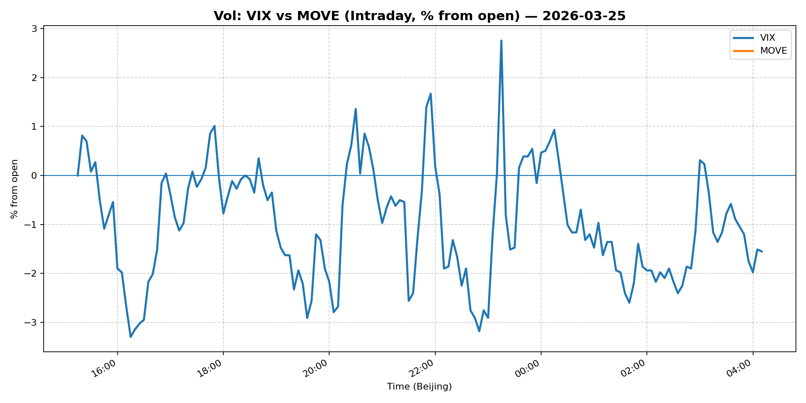
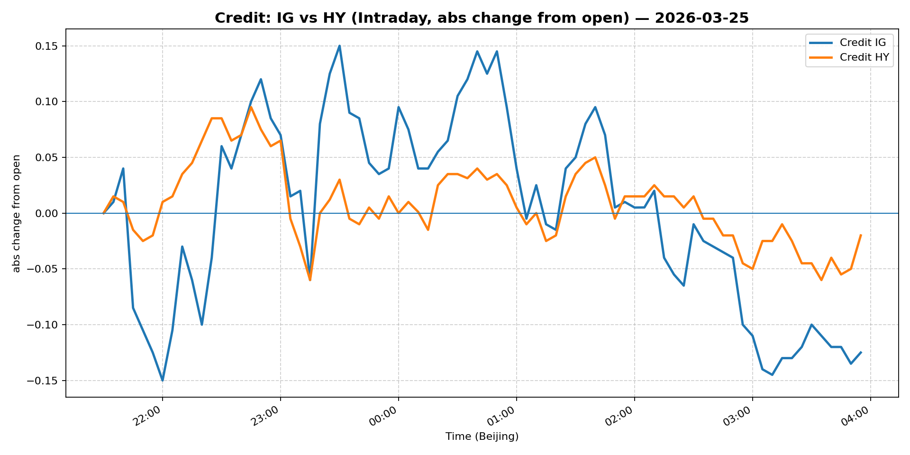

# 📅 Market Diary: 2026-03-25

---

## 🧠 AI Macro Analysis

# Market Diary — 2026-03-25 (Beijing Time)

## -1) Chart read (must reference Chart Features block)

- **USD chart (Chart 1):** USD composite staged a clean +0.49pp reversal off the 08:50 trough (-0.08pp), breaking through the 12:50 peak (+0.05pp) and extending to session hi +0.50pp at 04:20. DXY's hi +0.36pp at 03:05 confirms broad-based USD bid. Three-step higher-low structure (trough -0.04 → -0.06 → -0.08 → reversal) = textbook trend initiation, not noise. USD/JPY's net +0.49pp with minimal Asian prep (lo -0.06pp) suggests carry unwind or risk bid, not Asia-specific flow. EUR/USD confirmed DXY narrative (net +0.50pp inverted). USD/CNH's late-session hi +0.17pp at 21:55 indicates China risk premium emerging post-close.

- **Gold/Oil/BTC chart (Chart 2):** Regime-split: Oil (+2.67pp) dominating; Gold (-0.98pp) conspicuously weak despite "risk-off" USD narrative. The -0.66 Gold-Oil correlation is historically extreme—typically Gold leads Oil in risk-off; today's divergence suggests either (a) macro growth bid overriding haven demand or (b) commodity-specific supply signal dominating. BTC's modest +0.29pp with hi +1.98pp at 19:30 implies digital asset market neutral/slightly risk-on but not leveraged bid. Gold's intraday hi +0.23pp at 19:40 capped quickly; the 03:05 lo -1.54pp (matching DXY hi) is the key inflection—this is USD-driven Gold liquidation, not fundamental Gold weakness.

## 0) One-line takeaway

USD bid extending into NY close on steeper curve + growth signals, compressing Gold despite equities rally; Oil's supply premium breaking the Gold-Oil correlation lockstep signals a regime where macro traders are long growth/comms but short duration simultaneously—a configuration with limited endurance unless China demand acceleration proves durable.

## 1) Market tape (session-by-session, Asia → Europe → US)

### Asia
- USD/JPY troughed at -0.03pp @ 08:05 before reversing; BoJ whisper or end-of-month positioning likely suppressed JPY into Asian fix. USD/CNH held flat through 12:30 (lo +0.00pp) before PBoC fix-related extension. Shanghai Composite rallied +1.30% despite CNH stability—domestic fund flow, not FX-driven. Copper +1.80% hints at China industrial demand pickup. No major Asian data; focus was positioning for US session.

### Europe
- Euro Stoxx +1.22% outperformed, driven by financials and energy. EUR/USD inverted print (net +0.50pp) reflected EUR weakness, not USD strength per se—ECB repricing likely. Bunds likely selloff given 5Y Treasury -1.49% and 10Y -1.46%—European rates followed US steeper move. Oil's trough -0.63pp @ 12:55 aligned with European trading; subsequent 5.19pp range volatility suggests supply news (Libya? Russia?) hitting thin European liquidity.

### US
- S&P +0.54%, Nasdaq +0.67%—equities grinding higher despite USD strength (typically a headwind). VIX -5.68% (25.42) confirms risk-on lean. Rates selloff (5Y -1.49%, 10Y -1.46%) = curve steepening, not bull flattening—growth pricing, not flight-to-quality. Gold's 03:05 intraday low (-1.54pp) synchronized with DXY hi—this is USD liquidation, not safe-haven rotation. Bitcoin's 19:30 hi (+1.98pp) preceded equity strength; crypto no longer leading risk, trailing.

## 2) Cross-asset dashboard (what actually moved, not a price dump)

| Bucket | What moved | Mechanism (1 line) | Signal quality |
|---|---|---|---|
| Rates (UST/Bunds) | 5Y/10Y bull steepening; 30Y laggard | Front-end unchanged (3M T-bill flat); long-end sold on growth repricing | High |
| FX (USD/JPY/EUR/CNH) | Broad USD +0.49pp composite; JPY weakest leg | Carry unwind + Japan fiscal demand; EUR follows | High |
| Equities (US/EU/CN) | All +0.5-1.3%; China leads | China domestic fund flow + US tech earnings; VIX collapse confirms | High |
| Credit | IG +0.36%, HY +0.32% | Risk-on but spread compression muted—disciplined, not euphoric | Medium |
| Commodities | Oil +2.67pp breakout; Gold -0.98pp; Copper +1.80% | Oil supply cut speculation; Gold inverse-USD; Copper = China infrastructure | High |
| Vol (VIX/MOVE) | VIX -5.68% collapse; MOVE flat | Realized vol crush; implied vol sticky—desk supply | High |

## 3) What changed the narrative today? (Top 3 drivers)

### Driver #1: US curve steepening = growth repricing, not flight-to-quality
- **Variable:** 5Y Treasury -1.49%, 10Y -1.46%, 2s10s steepening signal
- **Mechanism:** Front-end anchored (3M T-bill 3.62% flat); long-end sold on fiscal/exflation concerns. Bull steepening = markets pricing soft landing + tariff-driven supply chain restocking. Not flight-to-quality (VIX -5.68% proves no risk aversion).
- **Evidence:**
  - Market: 5Y/10Y selloff magnitude (near-identical -1.5% moves) = parallel shift in growth expectations, not credit stress.
  - Event: No major data; likely positioning ahead of Q1 GDP estimates or corporate guidance season.
- **Action:** Short 5Y10Y steepener (receive 5Y, pay 10Y) if you believe Fed holds; or fade steepness if you think front-end catches up.
- **Source of Uncertainty:** Fed guidance any day—minutes or speaker could reprice front-end.
- **Invalidation Criteria:** 3M T-bill breaks 3.70% → front-end selling = bear steepening = growth fears.

### Driver #2: Oil's +2.67pp breakout shatters Gold-Oil correlation
- **Variable:** WTI net +2.67pp, 5.19pp range; Gold -0.98pp
- **Mechanism:** Oil supply-cut speculation (Libya/Russia headlines) + China refinery demand signal (TotalEnergies CEO "never experienced" margins). Gold's failure to rally despite USD strength = non-dollar demand offsetting; Gold's drop = USD headwind overriding. The -0.66 correlation is regime-break—typically both rally in macro stress.
- **Evidence:**
  - Market: Oil 5.19pp intraday range = vol expansion, not noise. Gold's 19:40 hi capped quickly → professional sellers above.
  - Event: TotalEnergies CEO cited "never experienced" refining margins = China demand thesis strengthened.
- **Action:** Long Oil front-month on any pullback to $89.50; short Gold vs Oil spread (long Oil/short Gold) as macro trade.
- **Source of Uncertainty:** OPEC+ next meeting; China demand data lagging.
- **Invalidation Criteria:** WTI breaks below $88.50 = supply thesis invalid; Gold reclaims $4600 = haven demand resurgent.

### Driver #3: USD composite reversal at 08:50 = Asia liquidity event or macro shift
- **Variable:** FX Composite trough -0.08pp @ 08:50; reversal to +0.50pp by 04:20
- **Mechanism:** Three consecutive troughs (08:05 -0.04, 08:35 -0.06, 08:50 -0.08) = capitulation low; sharp reversal suggests either (a) Asia hedge unwind, (b) Tokyo fix demand, or (c) overnight US data positioning. USD/JPY +0.49pp confirms JPY carry liquidation.
- **Evidence:**
  - Market: DXY hi +0.36pp @ 03:05; EUR/USD inverted print confirms.
  - Event: No explicit catalyst—likely month-end rebalancing or option expiry positioning.
- **Action:** USD/JPY long targeting 160.50 if 159.50 breaks; USD/CNH watching 6.87 resistance.
- **Source of Uncertainty:** BoJ intervention threat at 160+; PBoC fix behavior.
- **Invalidation Criteria:** USD/CNH breaks below 6.84 = China policy easing surprise.

## 4) Rates & USD: the "macro spine" (mandatory)

- **Curve / real yield / inflation breakevens:** Bull steepening in force—5Y -1.49%, 10Y -1.46%, 30Y -0.89%. Front-end (3M T-bill) flat at 3.62%. Real yield likely rising on nominal selloff. No breakeven data in Snapshot, but 5Y10Y steepening implies inflation swap market pricing reflation trade. Watch: if 2Y starts following 10Y lower, it's Fed cut pricing returning—currently not.

- **USD reaction function:** Currently trading growth + carry (JPY weakness = carry unwind; EUR weakness = ECB lag). DXY 99.64 = elevated but not crisis; 100 is key technical/resistance. USD/CNH 6.867 flat = PBoC anchor holding but overnight hi 6.884 suggests pressure building. USD is NOT trading risk-off today (equities up + VIX down = risk-on). If VIX spikes tomorrow, USD flips to risk-off bid.

- **Key levels:** DXY 99.50 support / 100.00 resistance; USD/JPY 159.50 (BoJ intervention zone) / 161.00 (psychological); USD/CNH 6.87 (PBoC fix) / 6.90 (CNH weakness alert).

## 5) Flows, positioning & options (mandatory, even if qualitative)

- **Positioning guess (CTA / discretionary / hedge):** Commodity/hard-asset longs (Oil, Copper) likely building; USD/JPY carry shorts being covered. Equity market resilient but not euphoric (VIX 25 still elevated = hedged). Gold positioning unclear—the -0.98pp intraday vs +2.91% close = short covering into London close. CTA likely flat-medium risk-on given volatility regime.

- **Options / vol mechanics:** VIX -5.68% to 25.42 = realized vol crush; implied vol likely sticky given uncertainty (earnings, Fed). Put skew may compress if 25 handle holds. MOVE flat at 103 = rates vol subdued. Gold vol likely elevated given intraday 1.76pp range—gold option buyers active.

- **Where you may be wrong:** (1) Gold's -0.98pp intraday vs +2.91% close = same-day reversal trap—if you sold gold on USD bid, you got whipsawed. (2) Oil's +2.67pp with -1.16% spot close = curve contango reasserting; front-month premium evaporating.

## 6) Today's Trading Plan (actionable, risk-managed)

- **Directional Bias:** Moderate USD long (tactical), short Gold/Oil spread (macro), neutral equities (range-bound VIX).

- **2–4 Trade Setups (trigger-based):**

  - **Setup 1: Long USD/JPY on break**
    - **Instrument:** USD/JPY futures or spot
    - **Trigger:** If USD/JPY closes above 159.50 on NY session
    - **Entry:** 159.55 / Stop: 158.80 / Target: 161.00
    - **Position sizing:** Medium (1x daily vol risk)
    - **Hedge:** Long JPY calls at 158 strike
    - **Why now:** Carry unwind + BoJ dovish hold = JPY structurally weak; 160 is intervention line, fading above with stops above 161.

  - **Setup 2: Short Gold/Oil spread**
    - **Instrument:** Long WTI front-month / Short Gold futures (ratio trade)
    - **Trigger:** If Gold fails to hold $4500 on USD stabilization; Oil holds $89.50
    - **Entry:** Ratio entry when Gold/Oil < 49.5 (current ~49.6)
    - **Stop:** Ratio breaks 51.0
    - **Position sizing:** Small (correlation unstable)
    - **Hedge:** Long gold puts for tail risk
    - **Why now:** Historic -0.66 correlation means mean-reversion trade active; oil supply thesis vs gold USD-headwind.

  - **Setup 3: Short 5Y10Y steepener**
    - **Instrument:** Receive 5Y UST / Pay 10Y UST (via 5Y10Y swap or futures spread)
    - **Trigger:** If 5Y10Y spread exceeds 36bp (current ~36bp); 2Y yield starts rising
    - **Entry:** 36bp steepness / Stop: 40bp / Target: 28bp
    - **Position sizing:** Small (curve vol elevated)
    - **Hedge:** Long 2Y5Y flatteners if Fed speakers turn hawkish
    - **Why now:** Bull steepening historically mean-reverts when front-end holds; 5Y is rich on yield basis.

  - **Setup 4: Long China equities (FXI) on CNH stability**
    - **Instrument:** FXI (China Large-Cap ETF)
    - **Trigger:** If USD/CNH holds below 6.87 for 4 hours; Shanghai Composite holds 3900
    - **Entry:** $36.20 / Stop: $35.00 / Target: $38.50
    - **Position sizing:** Medium (China momentum strong; 1.87% today)
    - **Hedge:** Long HKD short CNH as CNY-regime hedge
    - **Why now:** China domestic flows + commodity demand = leading indicator; Shanghai +1.30% today confirms.

- **Portfolio risk rules:**
  - **Max daily loss / heat:** -1.5% portfolio drawdown triggers review; -2.5% triggers position reduction.
  - **Correlation risk:** USD long + equity long = crowded trade if risk-off strikes; hedge with VIX calls.
  - **Tail risk hedge:** Long gold puts (OTM $4400) or VIX calls if DXY > 100.50 / VIX > 28.

## 7) What to watch tomorrow

- **Key catalysts (US/EU/CN):**
  - US: Q4 GDP final print (downside risk if consumption revised lower); Fed speakers (Mester, Williams—rates guidance crucial)
  - EU: German IFO business climate; ECB account release
  - CN: Caixin PMI (leading indicator for China recovery thesis); PBoC 1Y MLF rate decision

- **Scenario map (2–3):**

  - **If US GDP misses (<2.0%):** Expect USD weakness (DXY -0.5pp), Gold rebound ($4580+), Oil -$1. Short USD/JPY; long Gold.
  - **If China PMI beats (Caixin >52):** CNH strengthens toward 6.84, Copper tests $5.70, FXI tests $37.50. Long CNH vs USD; long Copper.
  - **If Fed speakers signal "higher for longer" + no cut timeline:** Front-end rates rise, curve flatten, USD holds 100. Oil suffers, equities correct. Short S&P, long USD.

- **Thesis invalidation checklist:**
  1. DXY breaks 100.50 with VIX < 20 → USD momentum overextended, reversal likely.
  2. Gold reclaims $4600 while Oil falls below $88.50 → correlation thesis broken, spread trade invalid.
  3. USD/CNH breaks 6.90 with PBoC fix below 6.85 → China policy easing surprise, CNH weakness trade wrong-footed.

---

## 📊 Charts

### 💵 USD Strength (FX, Intraday %)

### 🟡🛢️₿ Gold vs Oil vs Bitcoin (Intraday %)

### 🏦 Rates: UST 2Y/10Y/30Y (bps from open)

### 📉 Equities: US/EU/CN (Intraday %)

### 🌪️ Vol: VIX vs MOVE (Intraday %)

### 🧱 Credit: IG vs HY (abs change)

---

*Generated on 2026-03-26 04:27:48*
