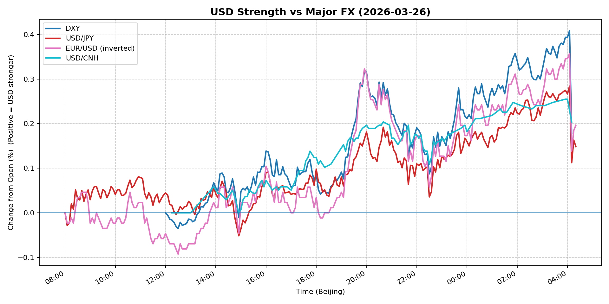
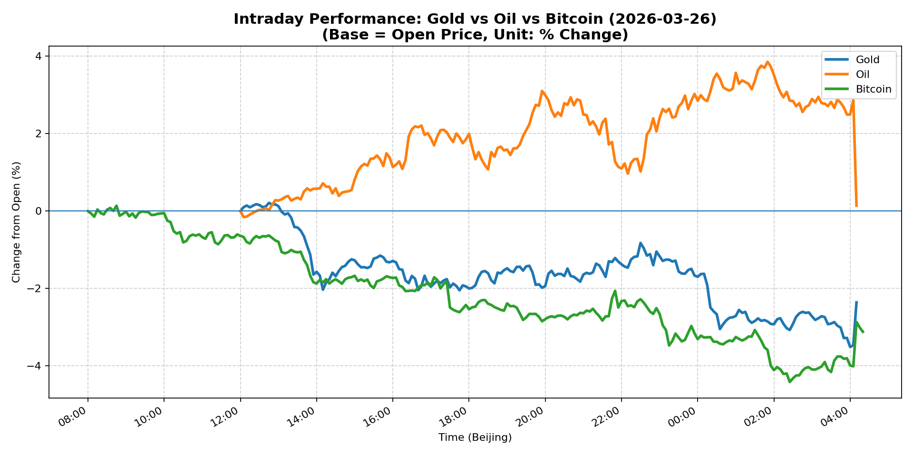
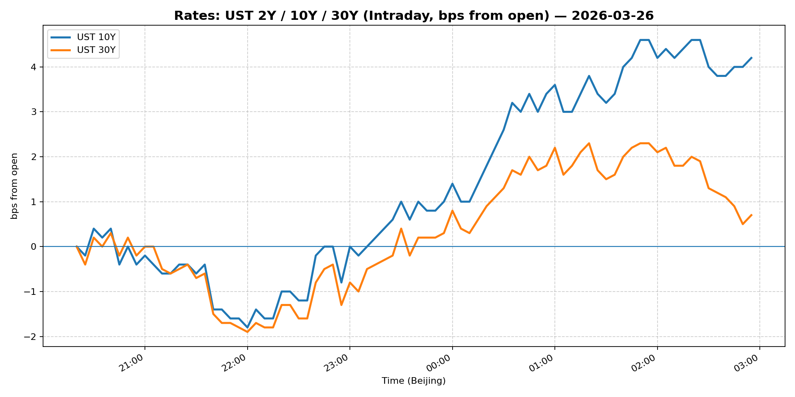
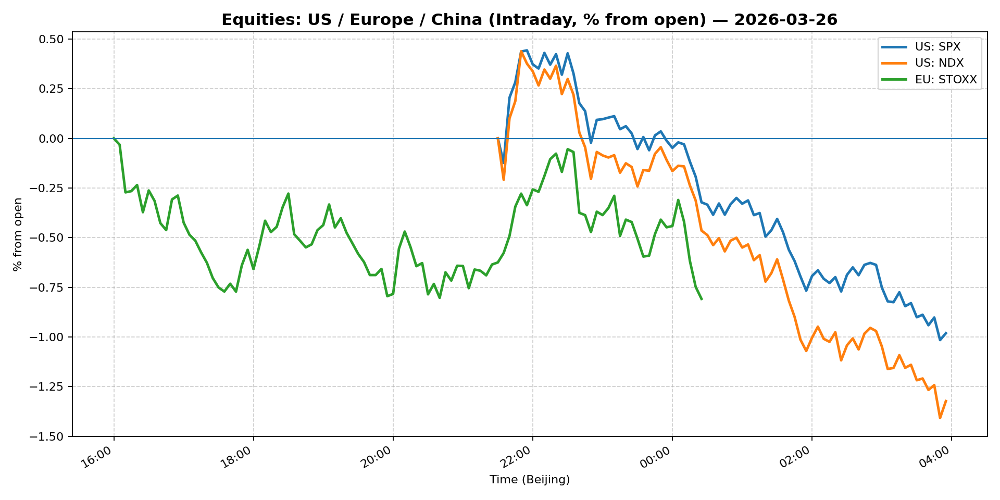
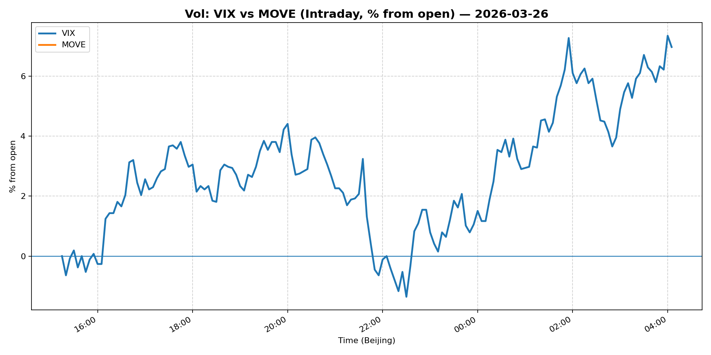
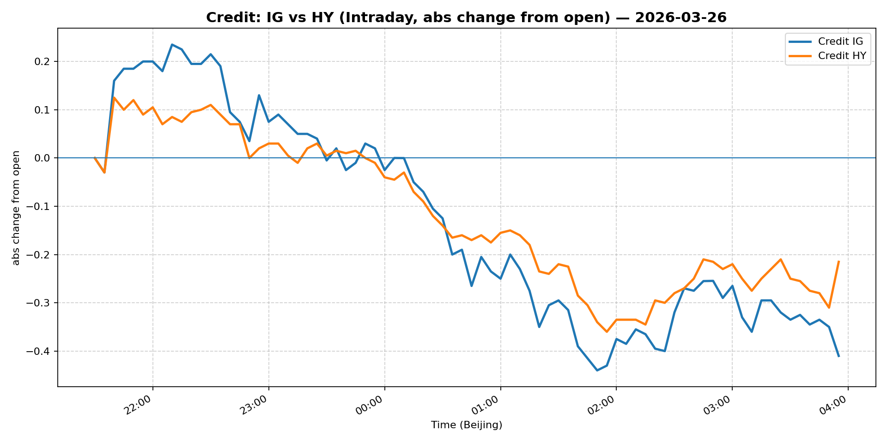

# 📅 Market Diary: 2026-03-26

---

## 🧠 AI Macro Analysis

# Market Diary — 2026-03-26 (Beijing Time)

## -1) Chart read (must reference Chart Features block)

- **USD chart (Chart 1):** The FX Composite printed a net +0.17pp gain with a +0.36pp intraday range, confirming a late-session USD bid. The DXY made a marginal low of -0.04pp at 12:30 Beijing time, then carved higher through the afternoon with a clean +0.41pp spike to 04:05 (the following morning). USD/JPY showed a three-trough reversal pattern (08:05, 08:20, 08:35) before reversing sharply higher, suggesting a BoJ- or event-related capitulation in JPY shorts. USD/CNH similarly ran from a flat open (+0.00pp) to a +0.26pp high at 03:55, indicating sustained CNH pressure. The pattern—early Asia weakness reversed into a US-hours USD surge—is consistent with a risk-off trigger hitting during the European/US crossover.
- **Gold/Oil/BTC chart (Chart 2):** Gold saw a sharp intraday reversal: +0.21pp peak at 12:45 followed by a brutal -3.51pp trough at 04:00, net -2.36pp. This is a momentum breakdown, not a orderly pullback. Oil held a modest +0.14pp net gain but with a +4.01pp range, spiking +3.86pp at 01:50—late-session buying consistent with geopolitical risk premium repricing (Iran headlines). Bitcoin collapsed -3.12pp net with a -4.41pp intraday low at 02:25, the worst performer. The correlation structure is telling: Gold–Bitcoin r=+0.86 means both crashed together on the same risk-off signal, while Oil–Bitcoin r=-0.86 shows oil held bid as a distinct geopolitical hedge. The spread between best (Oil +0.14pp) and worst (BTC -3.12pp) is +3.26pp—a significant cross-asset dislocation.

## 0) One-line takeaway

Risk-off triggered by geopolitical escalation (Iran) and an AI-sector research downgrade caused simultaneous USD bid, equity selloff, and a rare Gold-BTC decoupling that favored oil as the only positive-performing risk asset.

## 1) Market tape (session-by-session, Asia → Europe → US)

### Asia
- Early session: FX Composite printed multiple troughs (-0.03pp, -0.01pp) at 08:05–08:20 Beijing time, suggesting mild USD profit-taking or position squaring after the prior session's move. USD/JPY troughed three times in rapid succession (08:05, 08:20, 08:35), consistent with short covering ahead of scheduled event risk.
- Mid session: Gold peaked at +0.21pp at 12:45, establishing a local high before reversing sharply—earliest sign that geopolitical headlines were not being absorbed as durable gold catalysts. Shanghai Composite drifted -1.09%, underperforming other EM, while USD/CNH remained flat through 14:55, suggesting China fixed-income flows were not a driver.
- Risk-off acceleration: Bitcoin made an early high at +0.14pp (08:45) then rolled over, anticipating the US-session catalyst. Asia's equity weakness was orderly but set up a fragile backdrop.

### Europe
- EUR/USD pivoted around a peak of -0.01pp at 08:15 and trough of -0.02pp at 09:00, indicating two-way flow with a slight EUR bid that ultimately gave way to USD strength.
- Euro Stoxx 50 opened sharply lower (-1.48% at close), tracking US futures weakness from the research firm's AI downgrade. The move was synchronized with S&P/Nasdaq futures deterioration, confirming the catalyst was US-originated, not Europe-specific.
- USD/CNH broke higher post-13:55 peak (+0.06pp), indicating CNH-specific weakness during the London-NY crossover, likely related to risk-off CNY repatriation flows.

### US
- US cash open: S&P 500 -1.74%, Nasdaq 100 -2.38%—a meaningful gap down consistent with the research firm's AI sector call. VIX surged +12.08% to 28.39, the highest close reading in the recent regime, signaling a move from "elevated" to "stress" vol.
- USD surged: DXY hit +0.41pp at 04:05 Beijing time (late NY session), USD/JPY broke to +0.28pp, EUR/USD inverted metric hit +0.36pp—all confirming a broad USD bid driven by safe-haven demand, not rate differentials.
- Gold crashed -3.51pp to a 04:00 trough; Bitcoin collapsed -4.41pp at 02:25. The simultaneous crash of both "risk-off" assets suggests forced liquidation (margin calls, CTA de-risking) rather than a fundamental re-pricing of safe haven demand.
- WTI staged a late +3.86pp spike at 01:50, the sole positive performer—pure geopolitical risk premium from Iran conflict headlines, not a growth signal.

## 2) Cross-asset dashboard (what actually moved, not a price dump)

| Bucket | What moved | Mechanism (1 line) | Signal quality |
|---|---|---|---|
| Rates (UST/Bunds) | 5Y +3.15%, 10Y +2.03%, 30Y +0.80%—curve steepened | Geopolitical risk shifted duration demand to long end; flight-to-quality bid on 10Y/30Y partially offset by growth fears on 5Y | High |
| FX (USD/JPY/EUR/CNH) | DXY +0.19%, USD/JPY +0.57%, EUR/USD -0.63%, USD/CNH flat | Broad USD bid from safe-haven flows; JPY shorts capitulated; EUR sold on growth fears | High |
| Equities (US/EU/CN) | SPX -1.74%, NDX -2.38%, SX5E -1.48%, Shanghai -1.09%, FXI -2.93% | AI sector downgrade + geopolitical risk triggered systematic de-risking | High |
| Credit | IG (LQD) -0.78%, HY (HYG) -0.60% | Spreads widened on risk-off; IG underperformed proportionally, suggesting institution risk reduction | Medium-High |
| Commodities | Gold -3.16%, Oil +2.13%, Copper -0.75% | Gold/BTC liquidated (forced selling); Oil bid (Iran geopolitical risk); Copper weak (growth signal) | High |
| Vol (VIX/MOVE) | VIX +12.08% to 28.39; MOVE flat at 97.59 | VIX spike = equity vol surge; MOVE stability = rates vol not yet priced | High |

## 3) What changed the narrative today? (Top 3 drivers)

### Driver #1: AI Sector Research Downgrade
- **Variable:** Research firm's negative AI sector call (paper released pre-market)
- **Mechanism:** The downgrade triggered a broad re-rating of AI-adjacent technology names, cascading into S&P/Nasdaq futures, then into systematic vol and risk models. The -2.38% Nasdaq move is disproportionate to a single-sector call, suggesting it confirmed existing positioning vulnerability.
- **Evidence:**
  - Market: Nasdaq 100 -2.38%, S&P 500 -1.74%, VIX +12.08%—a correlated vol spike across equity complex
  - Event: Pre-market research release specifically targeting AI paper thesis; stocks making biggest moves included Meta, AppLovin (AI-adjacent)
- **Action:** Reduce long tech/vol exposure; avoid buying the dip in Nasdaq until vol mean-reverts; monitor semiconductors (MU, SWKS in premarket movers) as the canary
- **Source of Uncertainty:** Whether the research is a credible fundamental critique or a contrarian trade signal; market reaction may be overshooting
- **Invalidation Criteria:** Follow-up research confirming AI monetization thesis, or Fed pushback on growth concerns, that stabilizes Nasdaq futures above prior support

### Driver #2: Iran Geopolitical Escalation
- **Variable:** Kharg Island as potential battleground; Trump's 5-day pause ending this weekend
- **Mechanism:** Geopolitical risk premium bid drove WTI +2.13% and +3.86pp intraday spike. Concurrently, the Iran "economic heartbeat" narrative raised energy supply disruption fears, but the gold crash (-3.16%) and BTC crash (-3.12%) indicate this was not being priced as a durable safe-haven event—rather as a risk-reduction trigger causing forced liquidation.
- **Evidence:**
  - Market: WTI +2.13%, Oil intraday range +4.01pp, geopolitical headlines dominating news flow
  - Event: Trump pause ending weekend of March 26–27; Kharg Island escalation timeline maps to energy sector risk
- **Action:** Long WTI / Brent front-month as geopolitical hedge; monitor Iran-related shipping routs; be selective on gold (don't chase the crash until vol normalizes)
- **Source of Uncertainty:** Weekend outcome of pause expiry—de-escalation would crush oil; further escalation would extend oil bid
- **Invalidation Criteria:** Diplomatic de-escalation headline, ceasefire announcement, or Kharg Island not targeted → oil reverses, USD safe-haven bid fades

### Driver #3: Simultaneous Gold/Bitcoin Liquidation
- **Variable:** Gold -3.16%, Bitcoin -3.12% (net); correlation Gold-BTC r=+0.86
- **Mechanism:** The Gold-BTC correlation at +0.86 is abnormally high for a non-dollar environment. Both crashed together despite geopolitical risk (which typically bids gold). This pattern points to forced liquidation—margin calls, CTA de-risking, or stop-loss cascades—rather than fundamental re-pricing. The -3.51pp gold trough at 04:00 and -4.41pp BTC trough at 02:25 suggest systematic momentum unwinding.
- **Evidence:**
  - Market: Gold range +3.72pp, BTC range +4.55pp—massive intraday swings on low conviction
  - Event: No gold-specific fundamental negative; Iran headlines should have supported gold but instead triggered liquidation
- **Action:** Do not add to gold or crypto on this dip until forced selling clears (watch for volume normalization); if Iran escalation continues, gold will likely recover sharply as physical demand resurfaces
- **Source of Uncertainty:** Whether liquidation was CTA/margin-driven (temporary) or smart money rotating out of store-of-value assets (structural)
- **Invalidation Criteria:** Gold recovers above $4,450 and BTC above $71,000 on volume; or gold holds $4,350 level as new support

## 4) Rates & USD: the "macro spine" (mandatory)

- **Curve / real yield / inflation breakevens:** 5Y Treasury at 4.095% (+3.15% change—meaningful move up), 10Y at 4.416% (+2.03%), 30Y at 4.936% (+0.80%). The curve is steepening (5Y outperforming on the selloff), which is consistent with growth fears rather than inflation fears. No breakeven data provided, but the 5Y move relative to 30Y suggests the market is pricing growth downgrade, not fiscal risk.
- **USD reaction function:** DXY at 99.788 (+0.19%) is now bid on risk-off, not just rates. USD/JPY at 159.617 (+0.57%) broke higher despite BoJ speculation—the JPY bid from risk-off was overwhelmed by global deleveraging flows (JPY shorts covering, but USD moving faster). USD/CNH flat (6.8815, 0.00%) despite CNY repatriation flows suggests PBOC fixing is capping appreciation. EUR/USD at 1.1542 (-0.63%) confirms broad USD strength.
- **Key levels that matter:** DXY 99.50 (support), 100.50 (resistance); USD/JPY 160.00 (BoJ intervention risk zone); 10Y 4.50% (critical technical/resistance)

## 5) Flows, positioning & options (mandatory, even if qualitative)

- **Positioning guess (CTA / discretionary / hedge):** The VIX +12.08% spike to 28.39 is too large and too fast to be purely discretionary. CTA systematic de-risking is the most likely mechanism. The Gold/BTC crash with oil spike suggests commodity trading advisors reduced long positions across risk assets simultaneously. Discretionary macro likely adding USD long as a hedge. Hedge funds probably long vol (bought puts on SPX/NDX) going into the weekend Iran deadline.
- **Options / vol mechanics:** VIX at 28.39 implies elevated vol premium. Options dealers are likely short gamma in equities, which means any stabilization could trigger a sharp short-covering rally. MOVE flat at 97.59 suggests rates vol is not yet participating in the equity vol spike—watch for correlation breakdown to normalize. Risk reversals likely heavily bid on USDJPY upside (0.57% move attracting vol buyers at 160).
- **Where you may be wrong:** (1) The gold/BTC liquidation could be structural, not just forced selling—if macro funds are rotating out of store-of-value, the dip won't recover. (2) The Iran escalation could de-escalate over the weekend, crushing oil and reversing the USD safe-haven bid before Monday open.

## 6) Today's Trading Plan (actionable, risk-managed)

- **Directional Bias:** Short equities (Nasdaq > S&P), Long USD vs CNH/JPY, Long WTI crude as geopolitical hedge, Neutral-to-short gold until liquidation clears.

- **2–4 Trade Setups (trigger-based):**

  **Setup 1 — Short Nasdaq 100 via NQ futures or QQQ puts**
  - **Trigger:** If Nasdaq 100 futures fail to reclaim 23,700 on any bounce attempt on March 27 (UTC+8 session)
  - **Entry / Stop / Target:** Entry ~23,600, Stop above 23,900, Target 22,800 (prior support zone)
  - **Position sizing:** Medium (aggressive given VIX elevation)
  - **Hedge:** Buy 1x call spread (23,500/24,000) as weekend Iran news hedge
  - **Why now:** AI downgrade confirmed positioning fragility; VIX 28.39 means vol regime still expanding

  **Setup 2 — Long USD/JPY (fade the JPY bid)**
  - **Trigger:** USD/JPY holds above 159.50 through Tokyo open; BoJ Speaker (if scheduled) does not signal intervention
  - **Entry / Stop / Target:** Entry 159.60, Stop 158.80 (below recent range), Target 161.50 (near 160 psychological + intervention zone)
  - **Position sizing:** Small-medium (intervention risk limits size)
  - **Hedge:** Long JPY calls (160 strike) as tail risk hedge
  - **Why now:** BoJ adjustment expectations remain; risk-off is creating JPY volatility but not reversing the underlying rate differential thesis

  **Setup 3 — Long WTI front-month (geopolitical catalyst)**
  - **Trigger:** Iran headlines continue escalating through March 27; Kharg Island mentions intensify
  - **Entry / Stop / Target:** Entry on pullback to $90.50, Stop below $88.50, Target $96.00
  - **Position sizing:** Small (geopolitical events have binary outcomes)
  - **Hedge:** Short Brent/Dubai spread (to isolate Iran-specific supply risk)
  - **Why now:** Weekend pause expiry creates 48-hour event window; WTI the only asset with durable bid today

  **Setup 4 — Long Gold after liquidation clears**
  - **Trigger:** Gold reclaiming $4,400 on volume above $30B daily (or daily candle closing above $4,380)
  - **Entry / Stop / Target:** Entry ~$4,420, Stop $4,250, Target $4,650
  - **Position sizing:** Medium (gold is a core hedge position)
  - **Hedge:** None (gold is the hedge)
  - **Why now:** Iran risk premium will eventually support gold physically; liquidation overshoot creates mean-reversion opportunity

- **Portfolio risk rules:**
  - **Max daily loss / heat:** Max 2% portfolio loss on any single day; reduce gross exposure if any position moves more than 1.5% against entry
  - **Correlation risk:** USD/JPY long and WTI long are weakly correlated; Nasdaq short and gold long are negatively correlated (good hedge); monitor if all correlations collapse to 1.0 in full liquidation scenario
  - **Tail risk hedge:** Long VIX calls (22+ strike, April expiry) at 1-2% of notional; if Iran escalates violently over weekend, equity vol spikes will pay out

## 7) What to watch tomorrow

- **Key catalysts (US/EU/CN):**
  - **US:** No major data scheduled; Fed speakers (if any) to watch for response to vol spike; S&P 500 earnings focus (Micron, Sandisk earnings in focus)
  - **EU:** Eurozone sentiment data; ECB speakers in quiet period
  - **CN:** China PMI data (flash); PBOC fixing on CNH/USD to signal CNH policy response to risk-off
  - **Geopolitical:** Iran pause expiry outcome—this is the highest-impact event for the weekend risk/unwind

- **Scenario map (2–3):**

  **Scenario A — Iran de-escalation:**
  - If Trump extends pause or Iran agrees to talks → WTI drops -3 to -5%, USD safe-haven bid reverses, S&P/Nasdaq rally +1.5 to +2%, Gold recovers +1.5%
  - Trade expression: Long S&P (ESH3) on gap-up open; close WTI longs; reduce USD/JPY long

  **Scenario B — Iran escalation (military action on Kharg Island):**
  - Energy supply shock → WTI spikes +5 to +8%; S&P drops -2 to -3%; USD strengthens further; Gold rebounds as safe haven; Bitcoin continues liquidation on risk-off
  - Trade expression: Long WTI (CLJ3) on open; Long gold futures; Short Nasdaq aggressively; Long 2Y UST (flight-to-quality)

  **Scenario C — No Iran resolution (status quo):**
  - Markets remain elevated on geopolitical risk premium → S&P churns between 6,400–6,550; VIX stays 25–30; oil holds $90–$93; USD consolidates
  - Trade expression: Long vol (VIX calls), short gamma in equities, stay on sidelines with defined-risk setups only

- **Thesis invalidation checklist:**
  1. Gold reclaims $4,450 with volume → AI downgrade thesis is secondary to geopolitical; add gold
  2. WTI breaks below $88.50 → Iran risk premium fully priced out; exit oil long
  3. Nasdaq 100 holds 23,700 → research downgrade was a one-day overreaction; reduce short exposure
  4. USD/JPY breaks below 158.80 → intervention risk or BoJ hawkish signal; stop out USD/JPY long immediately

---

## 📊 Charts

### 💵 USD Strength (FX, Intraday %)

### 🟡🛢️₿ Gold vs Oil vs Bitcoin (Intraday %)

### 🏦 Rates: UST 2Y/10Y/30Y (bps from open)

### 📉 Equities: US/EU/CN (Intraday %)

### 🌪️ Vol: VIX vs MOVE (Intraday %)

### 🧱 Credit: IG vs HY (abs change)

---

*Generated on 2026-03-27 04:26:00*
