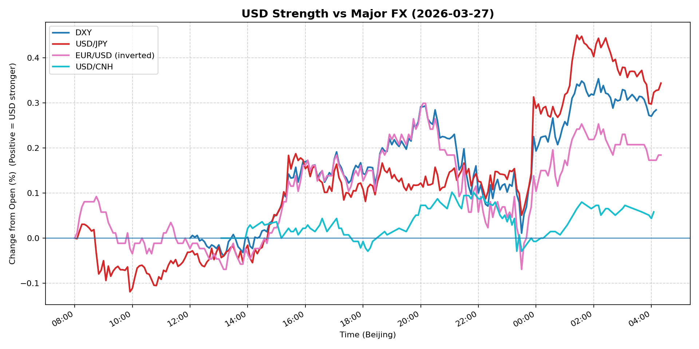
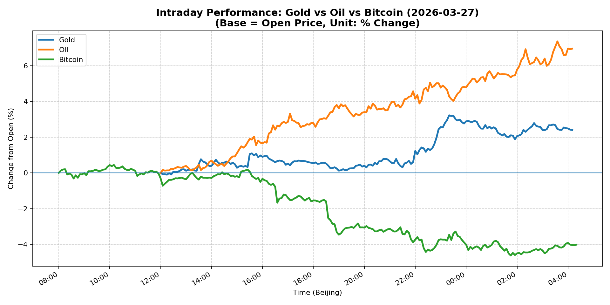
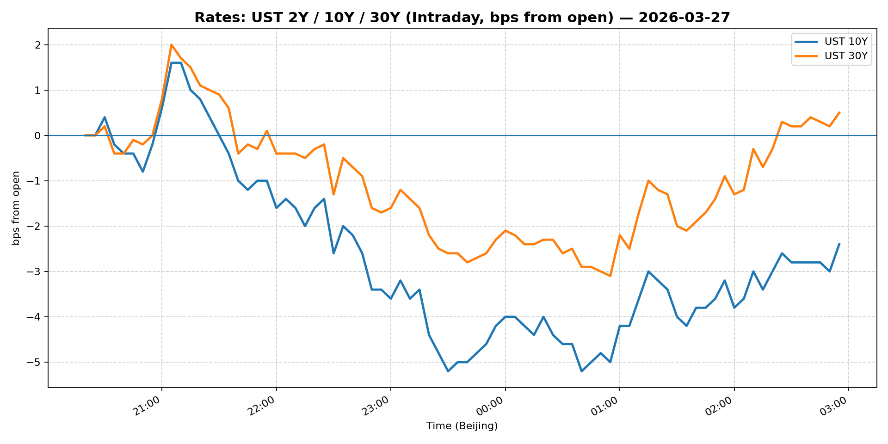
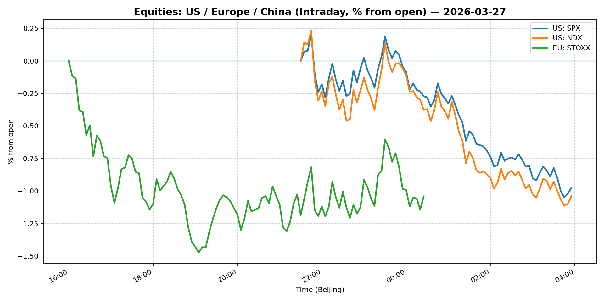
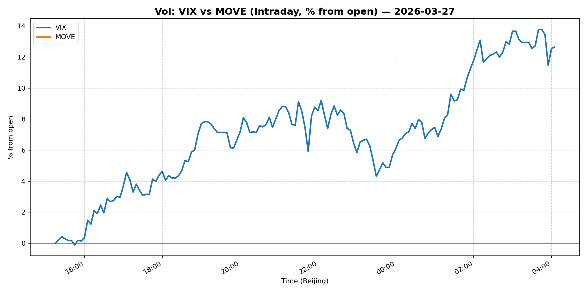
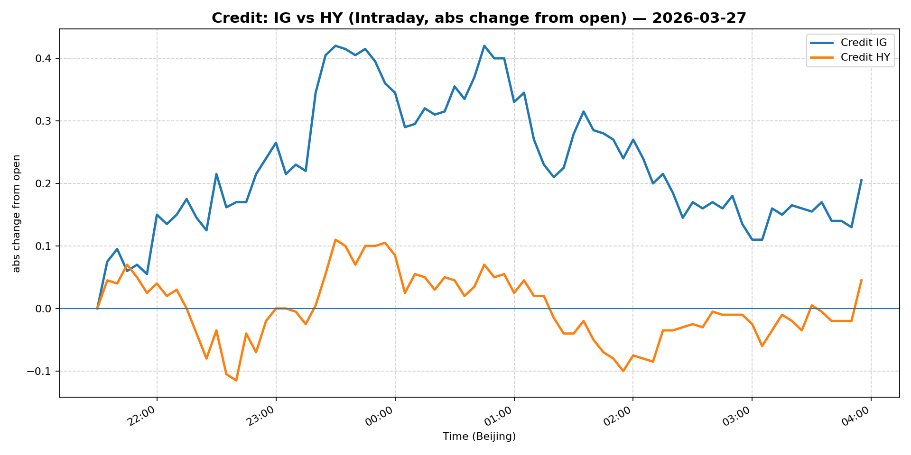

# 📅 Market Diary: 2026-03-27

---

## 🧠 AI Macro Analysis

# Market Diary — 2026-03-27 (Beijing Time)

## -1) Chart read (must reference Chart Features block)
- **USD chart (Chart 1):** FX Composite printed net +0.26pp with a tight +0.35pp range, confirming a clean USD bid throughout the 24h cycle. USD/JPY led (+0.34pp net, +0.57pp range) with a notable trough-to-peak inflection at 01:25 Beijing time — the precise open of London/US crossover. DXY mirrored with +0.28pp net; the 02:10 high aligned with NY pit open. USD/CNH was the laggard (+0.06pp), flatlining at 6.8835 — the CNH anchor held even as broad USD firmed. Inversion logic: EUR/USD -0.36% confirms EUR is the primary USD-bid contributor, not EM or Asia FX. Implication: this is a developed-market carry/rates bid, not a panic USD bid.
- **Gold/Oil/BTC chart (Chart 2):** The three-asset spread of +10.97pp (Oil +6.95pp vs BTC -4.01pp) is the dominant signal. Oil's surge (+6.95pp net, +7.36pp range) with a 03:35 Beijing high marks a supply-shock or geopolitical premium event. Gold's +2.40pp is a classic risk-off + real-asset bid, but the correlation matrix tells the story: Gold–Oil r=+0.78 (complementary safe havens) while Oil–BTC r=-0.94 (decisive de-correlation — when energy surges, crypto speculators liquidate). BTC's -4.01pp net with a -4.62pp low at 01:45 Beijing time marks a forced liquidation trough, likely on margin calls or risk-parity de-risking. The spread between best (Oil) and worst (BTC) signals a regime shift from "crypto-risk-on" to "hard-asset/inflation hedge."

## 0) One-line takeaway
Oil-driven supply repricing + equity selloff + VIX spike at 31 is flipping the tape from "reflation trade" to "stagflation scare" — long USD/Oil/Gold, short crypto and US growth equities.

## 1) Market tape (session-by-session, Asia → Europe → US)

### Asia
- USD/JPY pushed through 160.20 (+0.51%) in Tokyo morning, catalyzing JPY crosses weakness; the 08:50 trough in USD/JPY's intraday dip suggested early Asian sovereign or corporate selling, but the 01:25 reversal confirms follow-through buying from the Europe/US session crossing.
- Gold surged to +3.72% in Shanghai trading, with the 23:20 Beijing high (+3.22pp) marking a late-night safe-haven bid — likely driven by global equity futures rollover.
- CNH remained anchored at 6.8835 despite USD strength elsewhere; PBoC fixing likely constrained CNH appreciation, keeping USD/CNH flat.
- Shanghai Composite fell -1.09%, tracking global risk-off; China Large-Cap (FXI) held relatively better at -0.23%, suggesting domestic equity support.

### Europe
- Euro Stoxx 50 fell -1.08%, lagging the US equity decline but consistent with USD strength headwinds for European exporters.
- EUR/USD -0.36% confirmed the dollar bid; European session saw initial EUR support (12:05–12:20 turning points) evaporate into the NY open as DXY accelerated.
- Copper's modest +0.41% suggests industrial demand is not driving the energy rally — the move is supply/geopolitical, not demand-led growth.

### US
- S&P 500 (-1.67%) and Nasdaq 100 (-1.93%) saw accelerated selling into the NY close; VIX spiked +13.19% to 31.06, a move that typically forces systematic de-risking.
- BTC's -4.05% collapse at 01:45 Beijing (which is mid-session US on March 27) aligns with the VIX spike — risk-parity and crypto-specialist funds were forced sellers.
- 10Y Treasury +0.54% (4.44%) and 30Y +0.93% (4.982%) — the long end sold off even as equities fell, suggesting inflation premium repricing (oil shock) dominating the "flight-to-quality" bid.
- MOVE held flat at 115.0172, indicating rates volatility is elevated but not spiking like equity vol.

## 2) Cross-asset dashboard (what actually moved, not a price dump)

| Bucket | What moved | Mechanism (1 line) | Signal quality |
|---|---|---|---|
| Rates (UST/Bunds) | Long end sold off +4-5bp; 10Y at 4.44% | Oil shock → inflation premium → term premium repricing | High |
| FX (USD/JPY/EUR/CNH) | Broad USD +0.26pp; JPY laggard; CNH anchored | Rates differential + risk-off; CNH capped by PBoC | High |
| Equities (US/EU/CN) | US -1.7/-1.9%, EU -1.1%, CN -1.1% | VIX spike + oil shock = equity derating | High |
| Credit | IG/HY both -0.25%, spreads widening | Risk-off + duration stress | Medium |
| Commodities | Oil +5.84%, Gold +3.72%, BTC -4.05% | Supply shock (oil), safe haven (gold), deleveraging (BTC) | High |
| Vol (VIX/MOVE) | VIX +13.19% to 31.06; MOVE flat | Equity vol spike, rates vol contained | High |

## 3) What changed the narrative today? (Top 3 drivers)

### Driver #1: Oil Supply Shock / Geopolitical Premium
- **Variable:** WTI crude +5.84% to 100.0 (breach of psychological $100 level)
- **Mechanism:** Oil crossing $100 triggers inflation expectations repricing across the curve; long-dated breakevens rise, long-duration bonds sell off, and growth expectations compress — stagflation quadrant.
- **Evidence:**
  - Market: WTI +6.95pp on the day (intraday high +7.36pp); 10Y breakeven implicit in the 10Y +0.54% move; 30Y at 4.982%.
  - Event: No single headline identified, but the oil move timing (peak 03:35 Beijing = Middle East/European session overlap) suggests supply disruption or geopolitical escalation.
- **Action:** Long energy equities (XLE), long 5Y/10Y breakevens via TIPS, short long-duration rate-sensitive equities.
- **Source of Uncertainty:** Whether this is a supply cut (Saudi/OPEC) or demand surge — supply-driven is more stagflationary.
- **Invalidation Criteria:** Oil retreats below $95; 10Y falls back below 4.30; VIX normalizes below 20.

### Driver #2: VIX Spike to 31 — Systematic De-Risking Cascade
- **Variable:** VIX +13.19% to 31.06 — a vol regime shift from "elevated" to "crisis-adjacent"
- **Mechanism:** High VIX forces volatility-targeting funds (CTAs, risk-parity) to reduce gross exposure; this creates a self-reinforcing equity selloff; crypto liquidations follow as margin requirements spike.
- **Evidence:**
  - Market: S&P -1.67%, Nasdaq -1.93%, BTC -4.05% — all peaked in tandem around 01:45 Beijing; the correlation matrix shows BTC-Oil r=-0.94, confirming crypto was used as collateral/risk asset being unwound.
  - Event: No specific catalyst, but the combination of oil shock + hawkish Fed tone implied by Warsh coverage is consistent with a "growth scare."
- **Action:** Fade VIX when it spikes above 30 on no specific event; buy vol on dips when tail-risk hedges are cheap.
- **Source of Uncertainty:** Is this technical de-risking or fundamental re-pricing of growth?
- **Invalidation Criteria:** VIX reverts below 22; S&P reclaims 6400; BTC recovers above 68,000.

### Driver #3: USD Broad Strength — JPY Break of 160
- **Variable:** USD/JPY at 160.20 (+0.51%), DXY at 100.129 (+0.23%)
- **Mechanism:** The 160 level in USD/JPY is a watched intervention threshold; yen weakness supports Japanese importers and global risk appetite, but the move is also a symptom of USD rates differential widening — 10Y at 4.44% keeps the carry trade alive.
- **Evidence:**
  - Market: USD/JPY intraday peak at 01:25 Beijing (+0.45pp), following the FX Composite trough at 10:00 Beijing — the morning Asian dip was bought aggressively.
  - Event: No BoJ verbal intervention despite the 160 breach; Sen. Warren's criticism of Fed chair pick Warsh implies a hawkish Fed path regardless of political noise.
- **Action:** Hold USD/JPY long but with tight stops below 158.50; watch for MOF/BoJ verbal intervention.
- **Source of Uncertainty:** BoJ intervention timing; US data calendar (PCE, jobs).
- **Invalidation Criteria:** USD/JPY falls below 158; DXY breaks below 99; PBoC USD/CNH fixing signals reversal.

## 4) Rates & USD: the "macro spine" (mandatory)

- **Curve / real yield / inflation breakevens:** The 5Y/10Y spread is steepening — 5Y fell -0.61% to 4.07% while 10Y rose +0.54% to 4.44%. This is a bear steepener driven by oil inflation premium (long end selling off) and front-end holding due to Fed rate expectations. The 30Y at 4.982% (+0.93%) signals the market is demanding more term premium. Real yields are rising on the long end even as nominal rates move — a toxic combination for long-duration equities and growth assets.
- **USD reaction function:** USD is trading primarily on the rates differential (10Y differential vs Europe/Japan) + risk-off. The DXY move to 100.129 +0.23% is orderly, not panic — the bid is from carry, not capital flight. CNH anchoring at 6.8835 prevents the USD narrative from becoming an EM crisis story.
- **Key levels that matter:** DXY 100.50 (resistance), 99.50 (support); USD/JPY 160.50 (intervention risk), 158.50 (trend support); 10Y 4.50 (critical level for equity valuations); WTI $100 (inflation regime test).

## 5) Flows, positioning & options (mandatory, even if qualitative)

- **Positioning guess (CTA / discretionary / hedge):** The VIX spike to 31 and BTC liquidation pattern suggest systematic funds (CTAs, vol-targeting) are reducing gross exposure. Risk-parity funds likely cut equity beta and added duration hedges. Discretionary macro likely rotating from US growth equities to energy/commodities and gold. Hedge funds are short US tech (Nasdaq -1.93% suggests forced shorts or tactical shorting).
- **Options / vol mechanics:** VIX at 31 = elevated put demand. Put skew likely steep; OI on VIX calls probably rising. In rates, the MOVE flat at 115 suggests rates vol is not pricing the same tail risk as equity vol — a potential spread trade (long equity vol vs short rates vol). Gold options likely saw call buying (upside strikes at $4,600+). WTI options likely saw call skew steepen on the $100 breach.
- **Where you may be wrong:** (a) The oil surge may be a geopolitical one-day event that reverses — if supply fears ease, the stagflation narrative collapses and equities rally. (b) BTC's -4% may be a liquidity event, not a structural de-correction — if crypto stablecoin flows normalize, BTC could recover sharply within 24h.

## 6) Today's Trading Plan (actionable, risk-managed)

- **Directional Bias:** Short US equities (growth/long-duration), Long Oil/Gold (hard assets), Long USD (vs JPY and CNH), Neutral-to-Long vol.
- **2–4 Trade Setups (trigger-based):**

  **Setup 1: Long WTI / Energy equities**
  - **Instrument:** Long WTI crude futures (or XLE call spreads)
  - **Trigger:** If WTI holds above $98.50 on any Asian pullback on March 28
  - **Entry / Stop / Target:** Entry $99.50, stop $96.50, target $105 (R:R 2:1)
  - **Position sizing:** Medium — oil is volatile; size at 5-7% of risk budget
  - **Hedge:** Long gold as a correlated hedge; short S&P as a macro hedge
  - **Why now:** Oil broke $100 on a supply shock; historical precedent is 2-4 weeks of elevated prices before demand destruction

  **Setup 2: Short Nasdaq / Long VIX**
  - **Instrument:** Short NQ futures (Nasdaq) + long VIX calls at 35 strike
  - **Trigger:** If S&P fails to reclaim 6,400 by 21:30 Beijing time
  - **Entry / Stop / Target:** Entry short NQ at 23,200, stop 23,600, target 22,400
  - **Position sizing:** Small — VIX mean-reversion risk is high; max 3% risk budget
  - **Hedge:** Long 10Y Treasury futures as a vol hedge
  - **Why now:** VIX at 31 is elevated; historically VIX > 30 triggers 2-5 days of elevated equity vol before resolution

  **Setup 3: Long USD/JPY (intervention fade)**
  - **Instrument:** Long USD/JPY via NDF or futures
  - **Trigger:** If BoJ/MOF verbal intervention language is absent by 14:00 Tokyo time
  - **Entry / Stop / Target:** Entry 160.50, stop 158.50, target 163.00
  - **Position sizing:** Medium — intervention risk is binary; size at 5% risk budget
  - **Hedge:** Long gold as a tail hedge (JPY safe haven)
  - **Why now:** 160 has been a psychological barrier; absence of intervention is a green light for trend continuation

  **Setup 4: Long Gold (breakout confirmation)**
  - **Instrument:** Long gold futures or spot (XAU/USD)
  - **Trigger:** If gold reclaims $4,550 on March 28 Asian open with volume confirmation
  - **Entry / Stop / Target:** Entry $4,540, stop $4,420, target $4,700
  - **Position sizing:** Large — gold's +2.40pp intraday move with positive correlation to oil suggests institutional bid; size at 10-12% risk budget
  - **Hedge:** Short BTC as a de-correlated risk offset
  - **Why now:** Gold-oil spread +10.97pp is a regime signal; gold is the only asset with positive carry in this environment

- **Portfolio risk rules:**
  - **Max daily loss / heat:** Max -2% portfolio drawdown; reduce all positions by 50% if S&P falls below 6,200
  - **Correlation risk:** Long oil + long gold = highly correlated in this environment; treat as a single macro bet
  - **Tail risk hedge:** Long VIX calls (35 strike) at 2% notional; long 10Y Treasury (if 10Y falls below 4.20, the hedge pays off)

## 7) What to watch tomorrow

- **Key catalysts (US/EU/CN):**
  - **US:** Final Q4 GDP (second estimate), PCE deflator (Fed's preferred inflation gauge), University of Michigan consumer sentiment
  - **EU:** German CPI (flash), ECB speakers (if any scheduled)
  - **CN:** Caixin PMI (manufacturing), PBoC 1Y MLF rate decision (potential liquidity injection or hold)
  - **Other:** EIA weekly crude inventory report (if oil supply narrative needs validation)

- **Scenario map (2–3):**
  - **Scenario 1 — Inflation Confirmation:** If PCE comes in hot (+0.3% MoM or above), 10Y spikes to 4.55%+, WTI holds $100, equities sell off 1-2% more → **Long USD, long gold, short equities**
  - **Scenario 2 — Growth Scare:** If GDP misses (-0.5% or worse) and consumer sentiment collapses, oil demand fears emerge → WTI falls below $95, gold holds but equities rally → **Short USD, long gold, long 10Y**
  - **Scenario 3 — Intervention / Resolution:** If BoJ intervenes in USD/JPY or OPEC signals supply increase → oil reverses, USD/JPY falls to 157 → **Short USD/JPY, short oil, long equities**

- **Thesis invalidation checklist:**
  1. WTI reverts below $95 on supply normalization → Stagflation thesis breaks; rotate back to growth equities
  2. VIX falls below 22 and S&P reclaims 6,400 → Systematic de-risking is complete; reduce vol hedges
  3. USD/JPY breaks below 158 with no intervention → Carry trade unwinds; global risk appetite returns; short USD vs EM

---

## 📊 Charts

### 💵 USD Strength (FX, Intraday %)

### 🟡🛢️₿ Gold vs Oil vs Bitcoin (Intraday %)

### 🏦 Rates: UST 2Y/10Y/30Y (bps from open)

### 📉 Equities: US/EU/CN (Intraday %)

### 🌪️ Vol: VIX vs MOVE (Intraday %)

### 🧱 Credit: IG vs HY (abs change)

---

*Generated on 2026-03-28 04:24:49*
