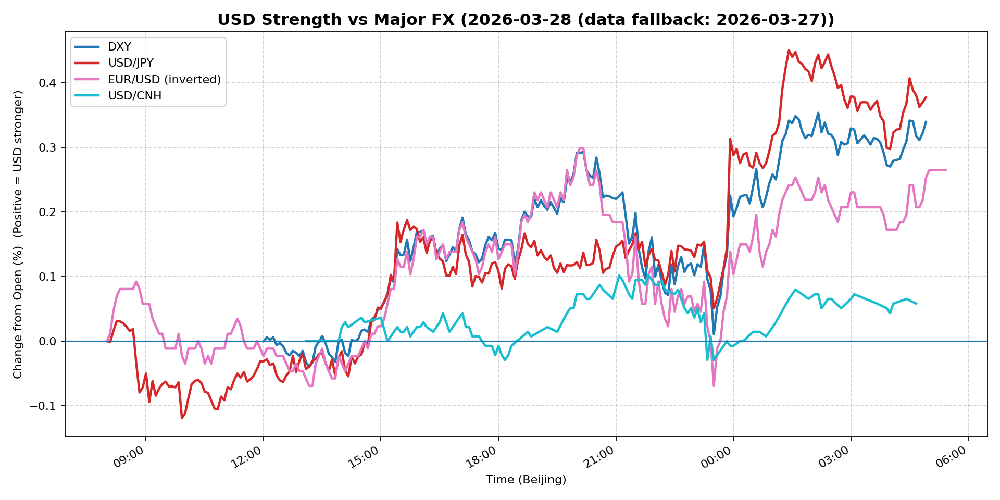
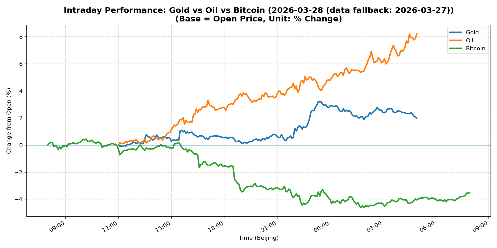
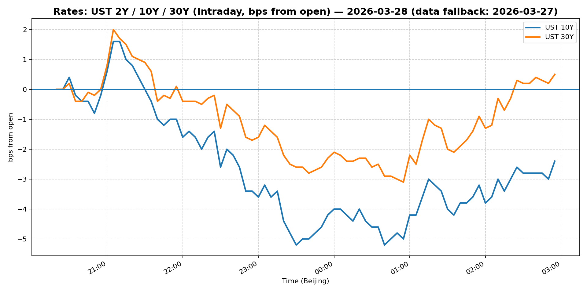
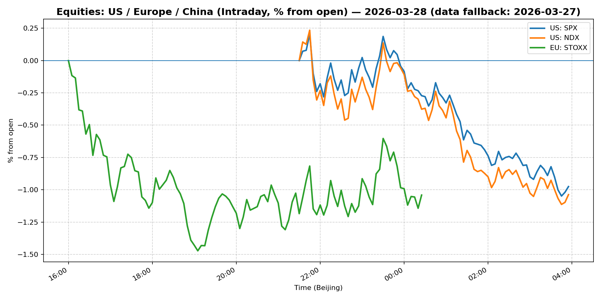
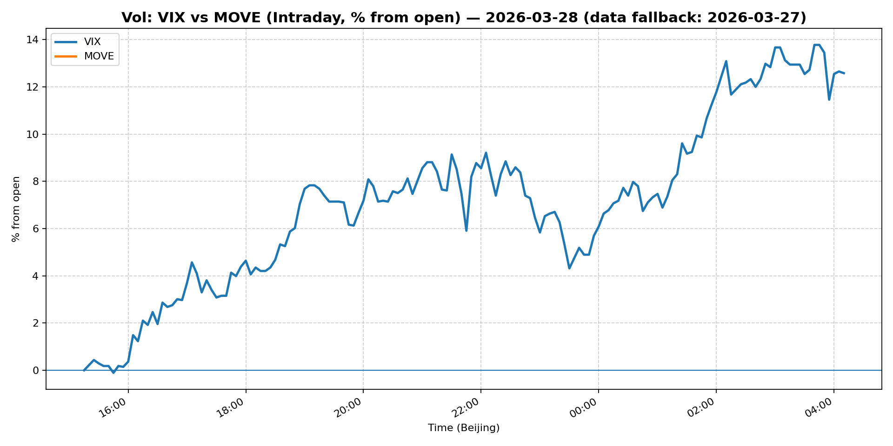
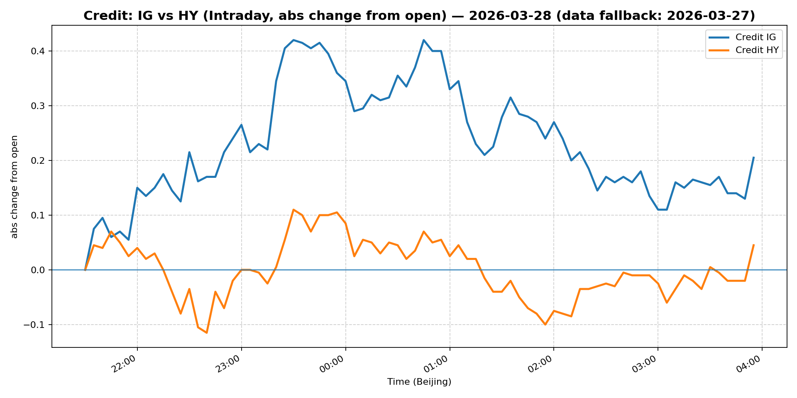

# 📅 Market Diary: 2026-03-28

---

> **Data fallback:** requested date `2026-03-28` had no usable intraday market data. Charts, chart features, and market snapshot below use the last available trading day: `2026-03-27`.

## 🧠 AI Macro Analysis

# Market Diary — 2026-03-28 (Beijing Time)

## -1) Chart read (Chart Features block)
- **USD chart (Chart 1):** FX Composite turned +0.27pp net with a sharp +0.40pp intraday range, peaking +0.32pp at 04:55 Beijing time (early US session momentum). USD/JPY led with +0.38pp net (+0.57pp range), hitting +0.45pp at 01:25; DXY tracked similarly at +0.34pp. EUR/USD inverted signal shows consistent USD bid pressure through European hours. USD/CNH stayed anchored (+0.06pp net, range +0.13pp), the least responsive pair—CNH stability despite broad USD strength signals deliberate PBOC fix management or thin APAC liquidity. **Implication:** USD bid is real but not uniform; the CNH peg and early-morning JPY spike suggest thin-market amplification, not a coherent macro USD bid.

- **Gold/Oil/BTC chart (Chart 2):** Extreme divergence: Oil +8.22pp (best), Gold +2.00pp, BTC -3.51pp (worst)—a 11.73pp spread screaming risk-off or geopolitical premium. Gold-Oil correlation r=+0.78 confirms the bid is macro (not idiosyncratic BTC selling); Oil-BTC r=-0.92 is near-perfect inverse, typical in geopolitical/shock episodes. BTC's early-morning +0.44pp spike at 10:10 followed by -4.62pp collapse at 01:45 suggests liquidity-driven cascade, not directional macro thesis. **Implication:** Oil at $100+ is the dominant narrative; gold corroborates macro uncertainty; BTC is being treated as risk asset, not digital gold.

## 0) One-line takeaway
Oil surging to $100 (chart signal +8.22pp) is the macro catalyst driving USD bid, gold spike, and BTC/equity liquidation—a classic geopolitical risk-off tape with Chinese equities decoupling as the marginal outperformer.

## 1) Market tape (session-by-session)

### Asia
- USD/JPY led the USD complex higher, spiking +0.45pp at 01:25 Beijing, driven by thin pre-Tokyo market conditions amplifying overnight US futures positioning. JPY crosses weakened broadly. Shanghai Composite managed +0.63%—Beijing's policy护盘 (support operations) visible; FXI lagged at -0.23%, suggesting domestic buying but offshore China fund outflows. USD/CNH barely moved (+0.06pp), reinforcing PBOC fix anchoring. Gold hit $4,492 in early Asia, up +3.22pp at 23:20 prior session—safe-haven demand pre-open.

### Europe
- EUR/USD inverted chart shows peak +0.09pp at 08:45, meaning EUR sold most aggressively early European morning before partial recovery. Euro Stoxx 50 fell -1.08%, consistent with global risk-off. European energy concerns likely amplified—oil +8.22pp on the session with European Brent demand speculated. German bunds likely rallied (flight-to-quality) but 10Y Treasury hit 4.44% (+0.54%) indicates US rates decoupling higher despite European flight bid.

### US
- Risk-off dominated: S&P 500 -1.67%, Nasdaq -1.93%. VIX spiked +13.16% to 31.05—elevated, not crisis but stress. Oil at $99.64/barrel (+5.46% spot, +8.22pp intraday range) was the day's biggest move. USD Composite peaked at +0.32pp at 04:55 Beijing (early US session), consistent with USD bid on oil/geopolitical risk. MOVE fell -2.67% to 111.95—rates vol compressing even as equities vol spiked, suggesting the rate story is distinct from equity stress. BTC -3.57% ($66,338) confirms crypto treated as risk, not hedge. 30Y UST at 4.982% (+0.93%) led the bear steepening—fiscal premium and term supply concerns.

## 2) Cross-asset dashboard

| Bucket | What moved | Mechanism (1 line) | Signal quality |
|---|---|---|---|
| Rates (UST/Bunds) | 30Y led bear steepening (+0.93%); 5Y outperformed at -0.61% | Term premium expansion; fiscal/debt ceiling concerns | High |
| FX (USD/JPY/EUR/CNH) | USD broad bid; JPY most responsive; CNH anchored | Thin Asia amplification + oil/geopolitical risk | High |
| Equities (US/EU/CN) | US/EU -1.7%/-1.1%; Shanghai +0.63% | Global risk-off vs CN domestic policy stabilization | High |
| Credit | IG/HY both -0.25% | Mild spread widening; not panic but risk-off tone | Medium |
| Commodities | Oil +8.22pp (~$100/bbl); Gold +2.00pp | Geopolitical premium (Middle East? OPEC+ surprise) | High |
| Vol (VIX/MOVE) | VIX +13.16% (31.05); MOVE -2.67% (111.95) | Equity vol up, rates vol down—decoupling | Medium |

## 3) What changed the narrative today? (Top 3 drivers)

### Driver #1: Oil Surging to $100/bbl
- **Variable:** Crude oil front-month touching $100 (WTI spot $99.64, intraday high implied ~$100+)
- **Mechanism:** Supply shock or geopolitical risk premium; $100+ is a psychological/policy threshold that tightens financial conditions via energy costs, compresses consumer spending power, and forces central banks to weigh inflation vs growth
- **Evidence:**
  - Market: Oil +8.22pp intraday range (largest single-asset move); gold corroborates (r=+0.78)
  - Event: No official OPEC+ announcement in headlines; speculative based on regional tensions or inventory draw
- **Action:** Long energy equities, long oil-exposed FX (CAD, AUD); short rate-sensitive equities (growth/tech); monitor if $100 holds
- **Source of Uncertainty:** Whether this is supply disruption (actionable) vs speculative surge (reversible)
- **Invalidation Criteria:** Oil reverts below $95 sustained; EIA inventory data shows build; geopolitical headlines de-escalate

### Driver #2: Elevated VIX (31.05) with Equity Selloff
- **Variable:** VIX +13.16%—spike to 31 is stress territory but not panic
- **Mechanism:** Options market pricing significant tail risk; short-gamma dealer behavior amplifies moves; systematic/vol-target strategies likely reducing exposure
- **Evidence:**
  - Market: S&P -1.67%, Nasdaq -1.93%; move exceeded 1%—meaningful for vol models
  - Event: No single catalyst; likely oil-driven macro uncertainty
- **Action:** Hold hedges (put spreads on indices); don't chase vol down—VIX often remains elevated for multiple days
- **Source of Uncertainty:** Is this one-day event or start of sustained vol regime?
- **Invalidation Criteria:** VIX reverts below 20; 2 consecutive green equity days; credit spreads stabilize

### Driver #3: Bear Steepening with 30Y Outperformance
- **Variable:** 30Y Treasury at 4.982% (+0.93%); 10Y at 4.44% (+0.54%); 2Y lagging
- **Mechanism:** Term premium expansion; market pricing increased fiscal supply/term risk; 30Y auction concerns; US debt ceiling uncertainty adding risk premium to long end
- **Evidence:**
  - Market: MOVE fell -2.67% while rates rose—rates vol compressed, suggesting directional pressure rather than uncertainty
  - Event: No Fed speakers or data driving; appears self-reinforcing technical/marginal supply demand
- **Action:** Watch 30Y auction demand; steepeners may work if growth fears mount; flatteners only if inflation re-accelerates
- **Source of Uncertainty:** Fiscal trajectory vs Fed QT pace; debt ceiling resolution timing
- **Invalidation Criteria:** 30Y yields break 5.1% (technically bearish); auction tail widens; deficit figures surprise

## 4) Rates & USD: the "macro spine"

- **Curve / real yield / inflation breakevens:** Bear steepening continues: 2s10s likely widening (5Y 4.07% lagged, 10Y 4.44% led). Real yields likely rising on nominal move—inflation breakevens may not be keeping pace, suggesting stagflation risk priced. 30Y-10Y spread widening to ~54bps (from prior tighter levels) signals term premium concern. **This is a rates regime shift, not a temporary move.**

- **USD reaction function:** USD is trading geopolitical risk + growth fear (not pure rates). Evidence: (a) DXY +0.25% despite 10Y rise (contradicts positive USD/rates correlation); (b) USD/CNH anchored (PBOC offset); (c) Gold bid (+2.00pp) corroborates risk-off, not growth. **USD is a safe-haven bid in this tape, not a carry or rates bid.**

- **Key levels that matter:** DXY 100.15 (psychological, 200-day MA nearby); USD/JPY 160 (intervention risk threshold); 10Y 4.44% (now resistance?); 30Y 5.0% (key technical/policy level).

## 5) Flows, positioning & options

- **Positioning guess:** Institutional (CTAs) likely reduced risk/equity exposure given VIX spike; discretionary macro may be short equities/cyclicals. Hedge funds: short growth, long energy/durables. Options: vol buyers emerging; put skew steepened. **Unclear if this is a wholesale de-risking or selective reduction—equity volume was elevated but not panic.**

- **Options / vol mechanics:** VIX 31 = elevated vol premium; dealers likely short gamma into this move, meaning further vol spikes possible on momentum. Put buying visible in indices. Skew likely steep (OTM puts more expensive). **Event vol risk: if oil holds $100+, energy sector earnings volatility increases; also watch for USD/JPY intervention trigger above 160.**

- **Where you may be wrong:** (a) Oil spike may reverse intraday if Middle East headlines fade—no fundamental demand surge visible. (b) China's outperformance could reverse if PBOC allows CNH depreciation—the +0.63% Shanghai gain may be artificial. (c) VIX spike may be mean-reverting if tomorrow's data is clean.

## 6) Today's Trading Plan (actionable, risk-managed)

- **Directional Bias:** Short US equities (growth/tech); Long oil/energy; Long gold; Neutral-Short duration; USD neutral vs CNH (intervention risk above 160 JPY).

- **2–4 Trade Setups:**

  1. **Instrument:** Long WTI crude (futures or ETF)
     - **Trigger:** If oil holds above $99.50 sustained through NY session close
     - **Entry / Stop / Target:** Entry ~$99.50; Stop below $96.50; Target $105
     - **Position sizing:** Medium—commodity volatility high; size to 5% portfolio risk
     - **Hedge:** Optional short S&P vs long oil pair trade to isolate energy beta
     - **Why now:** Oil +8.22pp intraday; $100 is a self-reinforcing psychological level

  2. **Instrument:** Long Gold (futures/ETF)
     - **Trigger:** If gold closes above $4,500 on volume confirmation
     - **Entry / Stop / Target:** Entry ~$4,480; Stop below $4,350; Target $4,700
     - **Position sizing:** Medium—gold is less volatile than crude, position accordingly
     - **Hedge:** Short USD/JPY if intervention fear rises
     - **Why now:** Gold-Oil correlation r=+0.78 confirms macro safe-haven bid; VIX elevated supports

  3. **Instrument:** Put spread on Nasdaq 100 (e.g., 23000/22500 put spread)
     - **Trigger:** If Nasdaq cannot recover above 23,300 by 10:30 AM ET
     - **Entry / Stop / Target:** Entry ~$2.00 debit; Stop if Nasdaq reclaims 23,500; Target $5+ at expiration
     - **Position sizing:** Small—options with 2-week expiry; tail risk hedge sizing
     - **Hedge:** Covered by long oil/energy long exposure in portfolio
     - **Why now:** Nasdaq -1.93% with VIX 31—vol still rich but protection warranted

  4. **Instrument:** Short 30Y UST (via TLT puts or futures)
     - **Trigger:** If 30Y yield closes above 5.0%
     - **Entry / Stop / Target:** Entry ~4.98%; Stop above 5.10%; Target 4.75%
     - **Position sizing:** Small-medium—duration risk; use futures for leverage
     - **Hedge:** Long 5Y UST (steepener)
     - **Why now:** Bear steepening 30Y led; fiscal premium may extend

- **Portfolio risk rules:**
  - **Max daily loss / heat:** Cap at -2% portfolio-level daily drawdown; reduce exposure if VIX >35 sustained
  - **Correlation risk:** Oil-equity correlation is -0.92 (BTC/Oil); portfolio long oil + short equity is logical but watch for sudden de-correlation in liquidity events
  - **Tail risk hedge:** Maintain 5% portfolio in gold or long vol (VIX calls) as portfolio insurance; exit if VIX <22

## 7) What to watch tomorrow

- **Key catalysts (US/EU/CN):**
  - **US:** Final Q4 GDP (second estimate); weekly jobless claims; Chicago PMI; Fed speakers (watch for "higher for longer" reaffirmation)
  - **EU:** Germany CPI (preliminary); ECB speakers; Eurozone sentiment indices
  - **CN:** Caixin PMI (manufacturing/services); PBOC rate decision (MLF操作的 timing); FX reserve data

- **Scenario map:**
  - If oil holds $100+ and VIX stabilizes <30 → Risk-on partial recovery; short USD vs AUD/CAD; reduce gold hedges
  - If VIX breaks above 35 and equities -3%+ → Full de-risking; long 2Y UST; short oil (demand destruction fear); USD surges broadly
  - If China PMI weak + PBOC cuts → CNH weakens toward 7.0; Shanghai sells off; USD/CNH breaks 7.0; EM FX broadly weaker

- **Thesis invalidation checklist:**
  1. Oil reverts below $95 sustained (kills energy trade thesis)
  2. VIX reverts below 22 (kills vol/safe-haven trades; risk-on resume)
  3. 30Y yield breaks 5.1% decisively (confirms bear steepening, but risks portfolio losses if not hedged)
  4. USD/JPY breaks 160 (intervention risk—unpredictable; exit JPY shorts immediately)
  5. China PMI beats and PBOC holds rates → CNH strengthens, Shanghai outperformance continues; shift to CN exposure

---

## 📊 Charts

### 💵 USD Strength (FX, Intraday %)

### 🟡🛢️₿ Gold vs Oil vs Bitcoin (Intraday %)

### 🏦 Rates: UST 2Y/10Y/30Y (bps from open)

### 📉 Equities: US/EU/CN (Intraday %)

### 🌪️ Vol: VIX vs MOVE (Intraday %)

### 🧱 Credit: IG vs HY (abs change)

---

*Generated on 2026-03-29 04:17:56*
