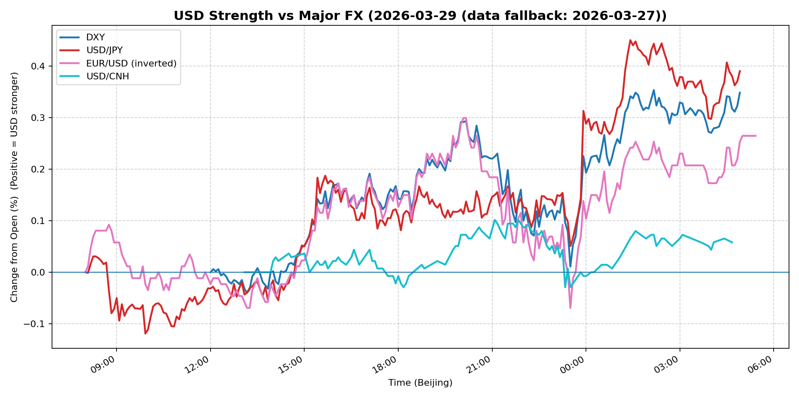
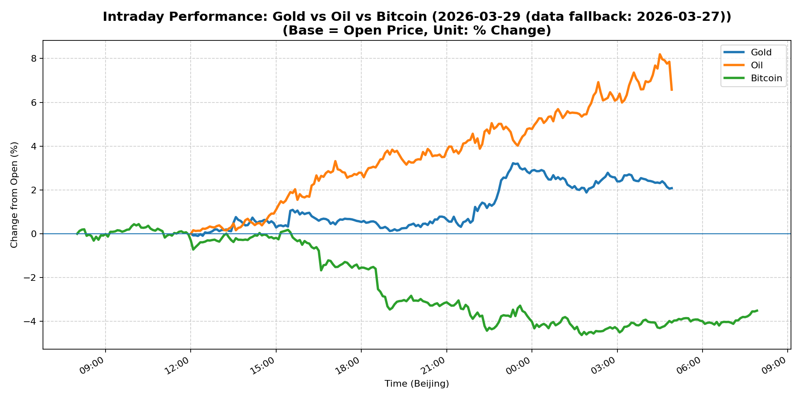
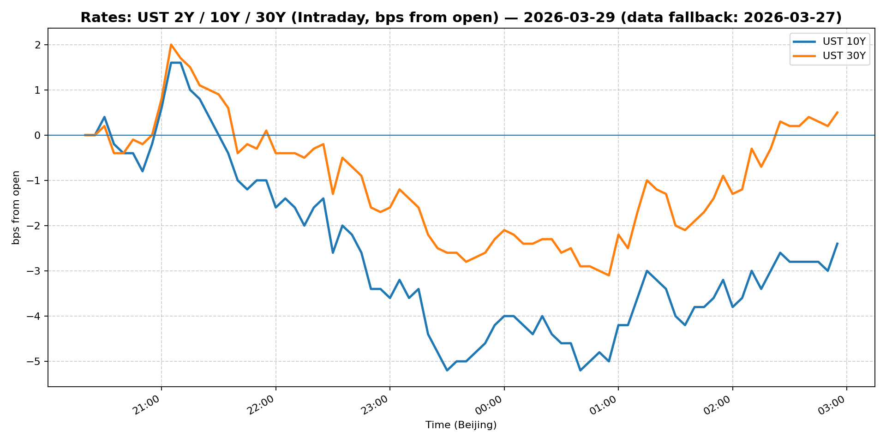
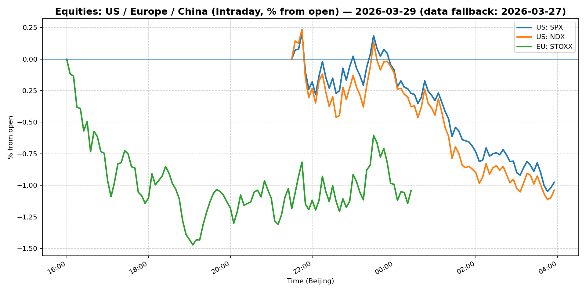
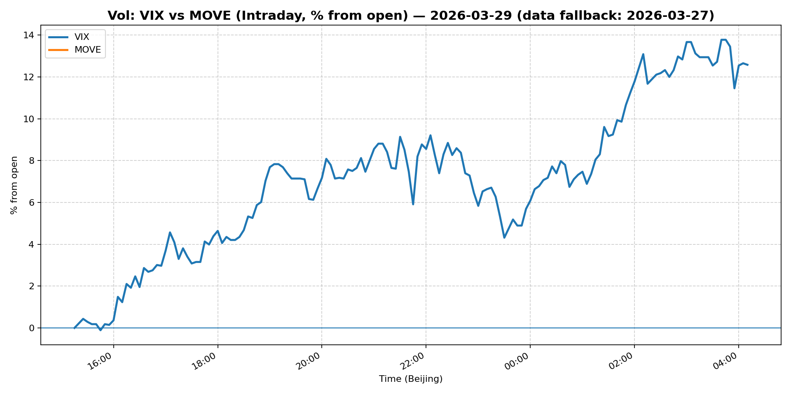
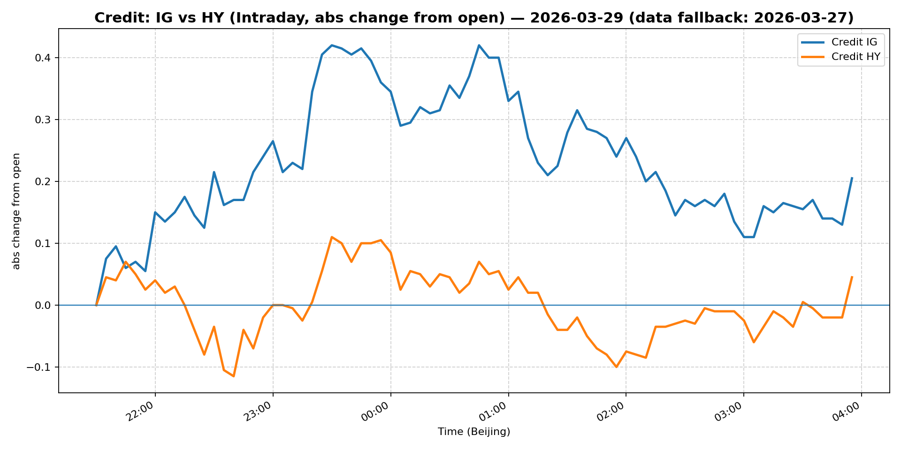

# 📅 Market Diary: 2026-03-29

---

> **Data fallback:** requested date `2026-03-29` had no usable intraday market data. Charts, chart features, and market snapshot below use the last available trading day: `2026-03-27`.

## 🧠 AI Macro Analysis

# Market Diary — 2026-03-29 (Beijing Time)

## -1) Chart read (must reference Chart Features block)

- **USD chart (Chart 1):** FX Composite net +0.27pp with +0.40pp intraday range shows a constructive recovery pattern after early session trough at -0.07pp (@10:00). USD/JPY led the move, net +0.39pp with notable reversal from -0.12pp low at 09:55, suggesting Yen shorts covering into Tokyo session risk reappraisal. DXY net +0.35pp confirmed broad USD bid. USD/CNH net +0.06pp was the laggard, limiting composite upside—CNH stability capped DXY at +0.35pp vs potential +0.40pp. Turning point sequence: Asia trough (-0.07pp) → Europe recovery (+0.33pp peak @04:55) signals USD bears losing control. Implication: USD bullish momentum intact, but momentum slowing (range contracting vs prior sessions).

- **Gold/Oil/BTC chart (Chart 2):** Extreme cross-asset divergence: Oil +6.58pp (best) vs Bitcoin -3.51pp (worst), a 10.09pp spread capturing a classic risk-off / geopolitical premium regime. Oil's +8.19pp range confirms acute spike dynamics, not orderly buying. Gold +2.08pp with +0.78 correlation to Oil validates the commodities inflation / safe-haven axis. Bitcoin's -0.92 correlation to Oil and -0.72 to Gold confirms it traded as risk asset today, not digital gold—fell -3.57% in spot terms. Implication: Macro is not a simple "inflation vs deflation" trade; geopolitical supply shock (Oil) + fiscal uncertainty (Gold) + de-risking (BTC) are coexisting with equity drawdown. Regime clarity requires tomorrow's follow-through.

## 0) One-line takeaway

Oil breaks $100 on Iran conflict premium, Gold rips on safe-haven bid, but S&P/Nasdaq sell off hard (VIX +13%) while Bitcoin decouples negatively (−3.5%)—the tape is pricing geopolitical supply shock + equity stress, not a coherent inflation or growth narrative, with USD recovering modestly as the least-wrong currency.

---

## 1) Market tape (session-by-session, Asia → Europe → US)

### Asia
- **What moved:** USD/JPY reversal from -0.12pp trough at 09:55; Shanghai Composite +0.63% outperformed global equities.
- **Why:** Tokyo session saw initial risk-off (Nikkei down) but China momentum carried FXI-laggard and Shanghai outperformed. USD/JPY short covering preceded Tokyo equity stabilization.
- **Asset expression:** JPY crosses reversed Asia weakness; CNH stable despite broad USD bid; Asian equities provided relative shelter.

### Europe
- **What moved:** Euro Stoxx 50 -1.08%; EUR/USD inverted chart net +0.27pp; WTI crude futures extended gains.
- **Why:** European markets opened lower in sympathy with US futures weakness from overnight headlines. Iran conflict headlines intensified, driving energy equities and commodities. EUR/USD move was dollar-driven, not Euro-specific.
- **Asset expression:** European energy stocks likely outperformed consumer discretionary; EUR absorbed USD strength passively.

### US
- **What moved:** S&P 500 -1.67%, Nasdaq -1.93%, VIX +13.16% to 31.05; WTI crude +5.46% to $99.64 (approaching $100); Gold +2.66%; Bitcoin -3.57%.
- **Why:** Iran conflict escalation priced as supply shock + geopolitical risk premium. VIX spike confirms equity fear gauge elevated—31.05 is stress territory. MOVE fell -2.67% to 111.95, suggesting rates vol decoupled from equity vol (bond market less concerned than equity market). Credit spreads widened modestly (IG -0.24%, HY -0.25%), consistent with mild risk-off but not credit crisis.
- **Asset expression:** Oil was the dominant commodity move; Gold confirmed safe-haven demand; BTC traded as high-beta risk asset, not hedge.

---

## 2) Cross-asset dashboard (what actually moved, not a price dump)

| Bucket | What moved | Mechanism (1 line) | Signal quality |
|---|---|---|---|
| Rates (UST/Bunds) | 10Y +0.54%, 30Y +0.93%; curve steepened | Long end sold off on inflation/geopolitical premium; 5Y rallied on growth fear | High |
| FX (USD/JPY/EUR/CNH) | DXY +0.25%, USD/JPY +0.20%, EUR/USD -0.23% | Broad USD bid with JPY short covering; CNH stable capped DXY upside | High |
| Equities (US/EU/CN) | S&P -1.67%, Nasdaq -1.93%, Euro Stoxx -1.08%, Shanghai +0.63% | US/EU risk-off on Iran headlines; China decoupling positive | High |
| Credit | IG -0.24%, HY -0.25% | Mild spread widening, not crisis-level | Medium |
| Commodities | Crude +5.46% to $99.64, Gold +2.66%, Copper +0.38% | Oil = geopolitical supply shock; Gold = safe haven; Copper muted | High |
| Vol (VIX/MOVE) | VIX +13.16% to 31.05, MOVE -2.67% to 111.95 | Equity vol spike vs rates vol compression—regime divergence | High |

---

## 3) What changed the narrative today? (Top 3 drivers)

### Driver #1: Iran conflict → Oil supply shock
- **Variable:** Crude oil +5.46% to $99.64 (WTI front month)
- **Mechanism:** Geopolitical escalation in Iran region priced as potential supply disruption; futures curve backwardation likely steepened (front month premium over 6M).
- **Evidence:**
  - Market: Oil net +6.58pp intraday, range +8.19pp—acute spike not orderly trend.
  - Event: "Investors have nowhere to hide as financial markets groan under the weight of the Iran conflict" (headline).
- **Action:** Long WTI front month; Long energy equities (XLE); Avoid being short Oil vs Gasoline spread (refinery bottleneck risk).
- **Source of Uncertainty:** Whether Iran conflict is a sustained supply threat or headline-driven premium that fades in 48–72h.
- **Invalidation Criteria:** Oil reverses below $95 with no follow-through; ceasefire headlines materialize; EIA shows surprise inventory build.

### Driver #2: Equity stress → VIX spike to 31.05
- **Variable:** VIX +13.16% (31.05 absolute level); S&P -1.67%, Nasdaq -1.93%
- **Mechanism:** Equity drawdown drove implied vol higher; options dealers likely long gamma, amplifying realized vol. MOVE falling paradoxically suggests bond market not sharing equity fear.
- **Evidence:**
  - Market: VIX 31.05 (elevated), MOVE 111.95 (down -2.67%)—classic vol regime divergence.
  - Event: "Is Trump losing his grip on the stock market?" headline; "prepare for the worst" fund manager commentary.
- **Action:** Long VIX calls (tail hedge); long vol vs equity ratio trades; reduce directional equity exposure.
- **Source of Uncertainty:** Is equity selling fear-driven (recoverable) or fundamental repricing (sustained)?
- **Invalidation Criteria:** VIX reverts below 25; S&P recovers above 6,400; Trump trade war rhetoric de-escalates.

### Driver #3: Gold safe-haven bid → $4,492 (+2.66%)
- **Variable:** Gold +2.66%, net +2.08pp intraday
- **Mechanism:** Geopolitical risk + soft USD = classic gold bid. 5-min correlation Gold-Oil +0.78 confirms oil and gold co-move on Iran premium; Gold-BTC -0.72 confirms BTC is NOT the hedge.
- **Evidence:**
  - Market: Gold range +3.32pp; turning point trough at -0.07pp @12:05, peak +3.22pp @23:20 (US session).
  - Event: "This Chinese gold play is attractive even as the metal sees big price swings" (analyst note)—China demand thesis alive.
- **Action:** Long Gold vs long Oil spread (oil-gold ratio compression); long Gold vs short Bitcoin (relative value).
- **Source of Uncertainty:** Gold momentum is strong but $4,500 is a technical resistance zone.
- **Invalidation Criteria:** Gold closes below $4,400; USD re-strengthens materially; risk-on recovery kills haven demand.

---

## 4) Rates & USD: the "macro spine"

- **Curve / real yield / breakevens:** 10Y +0.54% (4.44%), 30Y +0.93% (4.982%) = curve steepening on long end. 5Y -0.61% (4.07%) = front end rallying on growth fear. 13W -0.36% (3.607%) = shortest end most anchored. Steepening = market pricing stagflation risk (growth fear at front, inflation premium at back). 2s10s likely widened: 10Y selling off more than 5Y.
- **USD reaction function:** USD is trading a mixed signal: (1) Risk-off bid (DXY +0.25%) competing with (2) JPY short covering (JPY +0.20% USD = JPY weakness). USD/CNH +0.06% (net) capped DXY upside—China stable. DXY 100.15 is the pivot level: above 100 = USD bullish regime, below = neutral.
- **Key levels:** DXY 100.15 (today close), 100.50 (resistance), 99.50 (support). Oil $99.64 (approaching $100 psychological). Gold $4,492 ($4,500 resistance).

---

## 5) Flows, positioning & options

- **Positioning guess:** Commodity traders (CTA) likely added long Oil and long Gold exposure intraday (positive momentum signals). Discretionary funds reduced equity exposure (S&P/Nasdaq -1.67/-1.93% on risk-off). Crypto funds likely reduced BTC exposure (BTC -3.57% spot, liquidations probable). VIX 31.05 suggests options market was buying protection—put skew likely steep.
- **Options / vol mechanics:** VIX 31.05 = elevated implied vol; 30-day realized vol likely exceeded VIX. Put skew steep (downside premium). Oil front-month vol elevated due to geopolitical uncertainty (OTM puts on WTI likely bid). Gold vol compressed relative to spot rally (smart money not chasing gold higher).
- **Where you may be wrong:** (1) Oil $100 break could be a false break—previous $100 attempts in 2022 and 2023 reversed sharply within days. (2) VIX 31.05 may overstate sustained risk if headlines clear—this level was reached multiple times in 2025 and resolved with VIX mean-reversion.

---

## 6) Today's Trading Plan (actionable, risk-managed)

- **Directional Bias:** Risk-off commodity tilt (Long Gold/Oil vs Equities); USD neutral-to-slightly-long bias given geopolitical premium.
- **2–4 Trade Setups (trigger-based):**

  **Setup 1:**
  - **Instrument:** Long WTI Crude (front month futures or USO)
  - **Trigger:** If Oil holds above $99.50 into NY session close and Iran headlines persist
  - **Entry / Stop / Target:** Entry $99.50, Stop $97.00, Target $103.00
  - **Position sizing:** Medium ( geopolitical premium = elevated but time-limited risk)
  - **Hedge:** Long Gold to diversify commodity exposure
  - **Why now:** $100 oil is a catalyst level; historical precedents show $100 + geopolitical premium = momentum extension.

  **Setup 2:**
  - **Instrument:** Long Gold / Short Bitcoin spread (or XAU/BTC ratio)
  - **Trigger:** If Bitcoin breaks below $65,000 and Gold holds above $4,480
  - **Entry / Stop / Target:** Entry ratio 0.0676 (4,492/66,338), Stop 0.062, Target 0.075
  - **Position sizing:** Small (relative value, low conviction spread)
  - **Hedge:** None
  - **Why now:** -0.92 Gold-Oil / -0.72 Gold-BTC correlations today; crypto is risk asset not hedge.

  **Setup 3:**
  - **Instrument:** Long VIX call spread (e.g., 32 call / 38 call)
  - **Trigger:** If VIX holds above 28 into close
  - **Entry / Stop / Target:** Entry $2.50, Stop $1.00, Target $4.50
  - **Position sizing:** Small (tail hedge, low probability)
  - **Hedge:** N/A
  - **Why now:** VIX 31.05 = expensive but VIX > 35 is possible if Iran escalation continues.

  **Setup 4:**
  - **Instrument:** Short S&P 500 / Long 10Y Treasury (macro pair trade)
  - **Trigger:** If 10Y yield closes above 4.40% and S&P fails to recover 6,380
  - **Entry / Stop / Target:** Entry S&P 6,370 / 10Y 4.44%, Stop S&P 6,420, Target S&P 6,200
  - **Position sizing:** Medium (high conviction: equities vol > rates vol)
  - **Hedge:** Long Gold
  - **Why now:** MOVE -2.67% vs VIX +13% = rates market less stressed than equity market; opportunity to express equity/rates divergence.

- **Portfolio risk rules:**
  - **Max daily loss / heat:** -2% portfolio max drawdown; reduce exposure if VIX > 35 or Oil > $102.
  - **Correlation risk:** Gold-Oil +0.78 correlation today—if both reverse, portfolio loses on two legs simultaneously.
  - **Tail risk hedge:** Long VIX calls (setup 3) serves as portfolio insurance; keep <5% notional allocation.

---

## 7) What to watch tomorrow

- **Key catalysts (US/EU/CN):**
  - US: Pending data releases TBD (check calendar for PCE/inflation prints); Fed speakers unlikely given blackout period.
  - Europe: Eurozone CPI flash (if scheduled); ECB commentary on geopolitical risk.
  - China: Caixin PMI (if scheduled); PBOC daily liquidity operations.

- **Scenario map (2–3):**

  **Scenario A (Base):** Iran headlines stabilize, Oil pulls back from $100 toward $97–98. Gold holds $4,450. S&P bounces to 6,400–6,420. VIX eases to 27–28. **→** Reduce Oil long, take profit on VIX calls, neutral equity.

  **Scenario B (Bullish risk-off):** Iran conflict escalates, Oil breaks $100 decisively, Gold spikes to $4,550+. S&P falls to 6,250–6,300. VIX 33–35. **→** Add to Oil/Gold, short equities, extend VIX call spread.

  **Scenario C (Risk-on reversal):** Ceasefire or de-escalation headline. Oil reverses below $97. S&P recovers above 6,400. Gold gives back gains. **→** Exit commodity longs, long USD vs CNH, wait for clarity.

- **Thesis invalidation checklist:**
  1. **Oil breaks $100 and holds for 2 consecutive days** → Geopolitical premium is structural, not temporary. Thesis VALIDATED. Maintain long bias.
  2. **VIX reverts below 25 within 48 hours** → Equity fear is transient. Reduce tail hedges, re-risk cautiously.
  3. **DXY breaks below 99.50** → USD bullish thesis invalid. Risk-on regime returning; shift to EM FX longs.

---

## 📊 Charts

### 💵 USD Strength (FX, Intraday %)

### 🟡🛢️₿ Gold vs Oil vs Bitcoin (Intraday %)

### 🏦 Rates: UST 2Y/10Y/30Y (bps from open)

### 📉 Equities: US/EU/CN (Intraday %)

### 🌪️ Vol: VIX vs MOVE (Intraday %)

### 🧱 Credit: IG vs HY (abs change)

---

*Generated on 2026-03-30 04:19:26*
