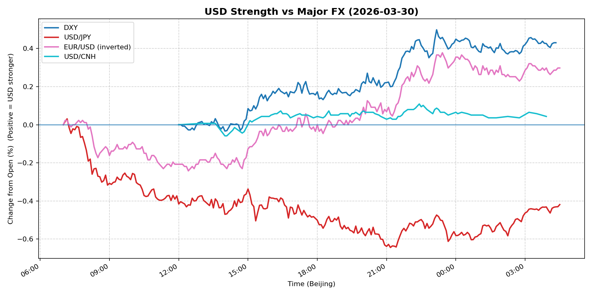
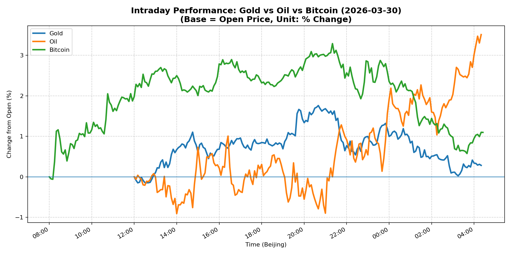
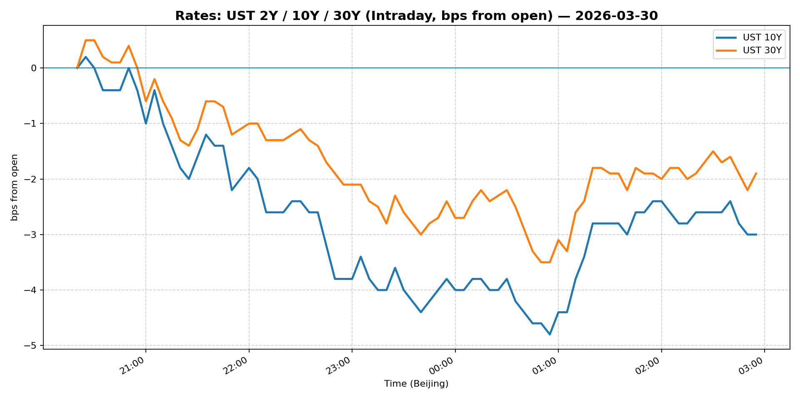
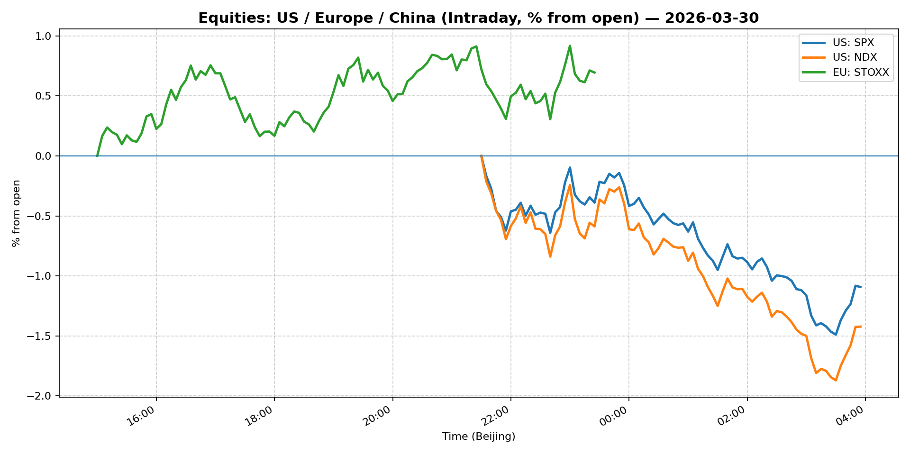
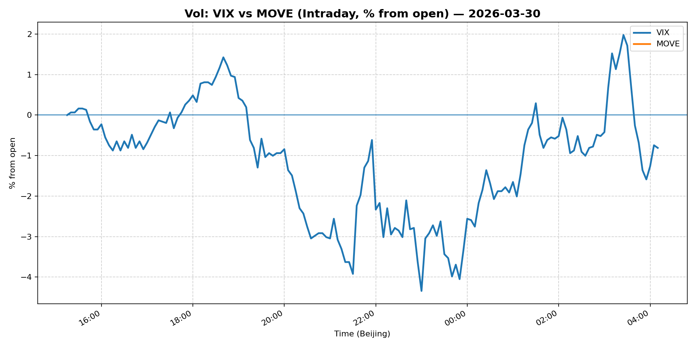
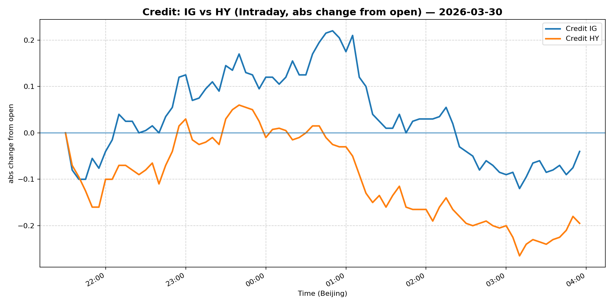

# 📅 Market Diary: 2026-03-30

---

## 🧠 AI Macro Analysis

# Market Diary — 2026-03-30 (Beijing Time)

## -1) Chart read (must reference Chart Features block)

- **USD chart (Chart 1):** DXY net +0.43pp with a tight +0.53pp intraday range reveals USD consolidation rather than directional conviction. The USD/JPY net -0.42pp (hi +0.03pp at 07:10, lo -0.64pp at 21:10) is the outlier—yen strength accelerating into NY close while DXY held bid signals a potential decoupling from broad USD. EUR/USD -0.64% confirms dollar bias to the upside, but the FX Composite mean net -0.06pp with +0.43pp range and multiple turning points at 07:10–07:40 suggest choppy, mean-reverting price action, not a clean trend. The divergence between DXY (+0.43) and USD/JPY (-0.42) is the key tell: if JPY is driving, risk sentiment (not rates) may be the USD driver today.

- **Gold/Oil/BTC chart (Chart 2):** Oil explosive at +3.51pp net (range +4.42pp), outperforming BTC (+1.10pp) and Gold (+0.28pp) by +323bps. The divergence sequence (Oil > BTC > Gold) and the strong negative correlation between Oil and BTC (r=-0.77) implies a risk-off / supply-shock regime, not a risk-on inflation hedge trade. Gold's muted +0.28pp despite oil surging +3.51pp breaks the typical co-movement, suggesting gold is capped by strong USD or is signaling the oil move may be idiosyncratic/geopolitical rather than broad inflation. BTC's +1.10pp is modest relative to its vol profile; the negative r=-0.77 vs oil hints some participants view crypto as risk asset being rotated out of rather than inflation hedge alongside oil.

## 0) One-line takeaway

Oil's +5.3% surge is testing Fed's "transitory" framing—Powell's dismissal of an oil-driven rate hike is being met with a rates rally (10Y -2.2%) that conflicts with the supply-shock signal from oil, leaving equities and USD in an ambiguous middle ground with positioning potentially too one-directional into this setup.

## 1) Market tape (session-by-session, Asia → Europe → US)

### Asia
- JPY weakness early (USD/JPY hi +0.03pp at 07:10) reversed sharply by 21:10 (lo -0.64pp) as participants positioned ahead of Powell's Harvard remarks. The PBOC fixing likely kept USD/CNH anchored near 6.88 (net +0.04pp). Shanghai Composite +0.63% and FXI +0.43% held steady despite oil surge, suggesting Chinese equities decoupled from the commodity shock—either domestic demand is perceived insulated or the market is front-running a potential CB response.

### Europe
- Euro Stoxx 50 +0.65% outperformed S&P futures despite oil at +5.3%, likely reflecting Europe's tighter energy market exposure (energy equities bid) and ECB staying data-dependent. EUR/USD -0.64% (net +0.30pp on inverted chart) accelerated into NY open as DXY bid on haven demand. Bunds likely rallied alongside Treasuries (2s10s steepening in progress).

### US
- Equities bled: S&P -0.39%, Nasdaq -0.78% as oil's inflation implication weighed on growth-exposed tech. VIX -1.42% (30.61) paradoxically declined despite equity weakness—possibly short covering or vol sellers fading the move. 5Y -2.24%, 10Y -2.21% was a sharp rates rally, inconsistent with "oil shock = stagflation = higher rates" narrative; Powell's "no need to hike" quote likely anchored front-end. MOVE flat at 111.95 signals rates vol is contained despite the large price move in bonds.

## 2) Cross-asset dashboard (what actually moved, not a price dump)

| Bucket | What moved | Mechanism (1 line) | Signal quality |
|---|---|---|---|
| Rates (UST/Bunds) | 5Y/10Y rally -2.2%, curve steepening | Powell "no need to hike" anchored front-end, oil shock priced as growth risk not inflation | High |
| FX (USD/JPY/EUR/CNH) | DXY +0.38%, EUR/USD -0.64%, USD/JPY flat | USD bid on haven demand; JPY decoupling from broad USD suggests idiosyncratic driver | High |
| Equities (US/EU/CN) | S&P/Nasdaq down, Euro Stoxx up, China small positive | Oil → stagflation fear hit US growth names; EU energy bid; CN decoupling | Medium |
| Credit | IG +0.64%, HY +0.11% | Credit tight on rate rally, risk-off in equities contradicts credit move—somewhat confused tape | Medium |
| Commodities | Oil +5.33%, Gold +1.00%, Copper +0.37% | Oil shock dominant; Gold muted (USD cap?), copper subdued despite oil | High |
| Vol (VIX/MOVE) | VIX -1.42% despite equity weakness | Vol sellers active, or equity buyers fading rather than hedging | Low confidence |

## 3) What changed the narrative today? (Top 3 drivers)

### Driver #1: Powell's "No Need to Hike" Comments
- **Variable:** Fed policy reaction function to oil shock
- **Mechanism:** Powell explicitly dismissed oil-driven rate hikes, anchoring front-end rates and compressing term premium. This triggered a relief rally in Treasuries (5Y/10Y -2.2%) and reduced the "stagflation premium" priced into equities.
- **Evidence:**
  - Market: 5Y Treasury -2.24%, 10Y -2.21%; S&P/Nasdaq initially bounced from session lows
  - Event: "Powell sees inflation outlook in check, no need to hike rates because of oil shock" (live Harvard remarks)
- **Action:** Rate rally likely overshoots if oil stays elevated; fade rate moves with tight stops if Powell walks back dovishness or oil breaks 110.
- **Source of Uncertainty:** Powell's credibility gap—oil +50% in a month contradicts "in check" framing; markets may not fully believe the Fed can ignore it.
- **Invalidation Criteria:** CPI print above 4.5% or Fed speakers (Miran dissenting aside) pivot to "vigilant on inflation"; WTI breaks above 108 with 10Y crossing 4.5%.

### Driver #2: Oil Surge +$5.3 ($104.95)
- **Variable:** Supply shock vs. demand shock; stagflation risk
- **Mechanism:** $105 WTI is a marginal consumer break-even pain point; historically triggers growth squeeze. However, Gold's muted response (+1% vs oil's +5.3%) and negative Gold-Oil correlation (r=-0.34) suggest the market is not fully pricing this as a persistent inflation regime—yet.
- **Evidence:**
  - Market: Oil +5.33% (WTI $104.95), EUR/USD -0.64% (energy importer pain), equities mixed
  - Event: "More than 50% rise in oil prices over the past month may be more than just a 'short-lived shock'" (headline)
- **Action:** Short equities on oil spikes if the move is confirmed with VIX not declining; monitor energy equities as leading indicator.
- **Source of Uncertainty:** Middle East supply disruption (Saudi/OPEC headlines referenced); Chinese demand signal unclear; US SPR release possibility.
- **Invalidation Criteria:** Oil reverts below $98 with concurrent equity rally (risk-on recovery); WTI front-month spread compresses (supply fear easing).

### Driver #3: Equity Market Divergence (US vs Europe vs China)
- **Variable:** Global equity positioning and risk appetite
- **Mechanism:** Nasdaq -0.78% vs Euro Stoxx +0.65% vs Shanghai +0.63% signals capital rotation away from US mega-cap tech (rate-sensitive) into European energy/industrial and China. The "US faring worse than past geopolitical shocks" headline may be self-reinforcing.
- **Evidence:**
  - Market: Nasdaq -0.78%, S&P -0.39% vs Euro Stoxx +0.65%, FXI +0.43%
  - Event: "Bill Ackman says it's one of the best times in a long time to buy quality stocks" (counter-narrative, not consensus yet)
- **Action:** Long Europe vs US equity pairs if this divergence persists; monitor CTA positioning.
- **Source of Uncertainty:** US tech earnings guidance; China stimulus timeline; EUR/USD move may reverse.
- **Invalidation Criteria:** Nasdaq recovers above 23,100 with strong breadth; Fed pivot narrative reasserts.

## 4) Rates & USD: the "macro spine" (mandatory)

- **Curve / real yield / inflation breakevens:** 13Q T-Bill 3.598% (-0.25%) vs 5Y 3.979% (-2.24%) vs 10Y 4.342% (-2.21%) vs 30Y 4.905% (-1.55%) signals a bull steepening—all tenors rallying, front-end less so (T-Bill only -0.25% vs 5Y -2.24%). This is a classic "growth fear" curve shape, not a "Fed cutting" shape. Breakevens likely compressed with the 10Y rally. Real yields fell, gold should have rallied harder—suggests USD strength is the competing force.
- **USD reaction function:** USD is trading "haven + growth fear" today—DXY +0.38% despite rates rallying (should be negative correlation). EUR/USD -0.64% is the clearest signal: euro weakness on energy shock. USD/JPY flat is the outlier that suggests JPY-specific flows (BOJ speculation?) rather than broad USD. USD/CNH anchored at 6.88 despite oil shock—PBOC fixing discipline holding.
- **Key levels:** DXY 100.53 (resistance 101, support 99.8); EUR/USD 1.1461 (support 1.14, resistance 1.155); 10Y 4.342% (support 4.25%, resistance 4.50%); WTI 104.95 (key level 108 for risk-off extension).

## 5) Flows, positioning & options (mandatory, even if qualitative)

- **Positioning guess (CTA / discretionary / hedge):** The 10Y -2.2% rally in one day suggests either (a) short positioning being squeezed or (b) genuine haven demand. Given VIX fell -1.42% despite equity weakness, vol sellers are active—risk is to the upside in rates vol. Oil positioning likely extended long after +5.3%. USD positioning mixed (DXY up but JPY down—conflicting signals). Equities: growth/tech likely underweight vs value/energy.
- **Options / vol mechanics:** MOVE flat at 111.95—rates vol suppressed despite big move; potential catch-up volatility if oil remains elevated. VIX 30.61 declining despite oil surge is a red flag—either the shock is priced as temporary or dealers are heavily short gamma into the weekend.
- **Where you may be wrong:** (1) The 10Y rally to 4.34% may reverse hard if oil breaks above 108 and Powell's "no need to hike" loses credibility. (2) The oil-equity divergence (both up?) may resolve with oil coming in rather than equities catching up.

## 6) Today's Trading Plan (actionable, risk-managed)

- **Directional Bias:** Neutral to risk-off; long USD vs CNH on PBOC fix differential; cautious on US equities with oil headwinds; selective long oil on breakout.

- **2–4 Trade Setups (trigger-based):**

  **Setup 1: Long Oil (WTI) on Break**
  - **Instrument:** WTI crude futures or USO 1x
  - **Trigger:** If WTI closes above $106.50 with equity vol spiking (VIX > 33)
  - **Entry / Stop / Target:** Entry $105.50, Stop $102.50, Target $112
  - **Position sizing:** Medium (1x beta, vol-adjusted)
  - **Hedge:** Optional: Short S&P if equity drawdown accompanies oil breakout
  - **Why now:** Oil +5.3% today on supply concerns; momentum in place but needs confirmation

  **Setup 2: Long 10Y Duration (Rates Rally)**
  - **Instrument:** TLT or 10Y futures
  - **Trigger:** If 10Y breaks below 4.25% with VIX below 28
  - **Entry / Stop / Target:** Entry 4.34%, Stop 4.50%, Target 4.10%
  - **Position sizing:** Small (curve signal mixed—bull steepening suggests caution)
  - **Hedge:** Short 2Y to isolate duration bet
  - **Why now:** Powell anchoring front-end; if he doubles down, rates rally has legs

  **Setup 3: Short Nasdaq / Long Energy Equity Pair**
  - **Instrument:** Short NQ futures, Long XLE or energy sector ETF
  - **Trigger:** If Nasdaq breaks below 22,800 with oil above $105
  - **Entry / Stop / Target:** Entry NQ 22,950, Stop 23,200, Target 22,500
  - **Position sizing:** Medium
  - **Hedge:** Long Gold as macro hedge
  - **Why now:** Stagflation narrative favors energy, hurts growth multiples

  **Setup 4: Long USD vs CNH (Carry/Sentiment)**
  - **Instrument:** USD/CNH spot or NDF
  - **Trigger:** If PBOC fix breaks 6.90 or DXY reclaims 101
  - **Entry / Stop / Target:** Entry 6.88, Stop 6.85, Target 6.95
  - **Position sizing:** Small (PBOC intervention risk)
  - **Hedge:** Long JPY as tail hedge
  - **Why now:** CNH anchored despite oil shock; PBOC fix lag is a potential break point

- **Portfolio risk rules:**
  - **Max daily loss / heat:** -1.5% portfolio loss triggers position review; -2.5% hard stop
  - **Correlation risk:** Oil-equity correlation has turned negative—if both sell off simultaneously, vol products may fail; hedge with long USD
  - **Tail risk hedge:** Long VIX calls (28 strike, 1-week) as weekend risk hedge given oil + geopolitical tension; cost ~0.3% of portfolio

## 7) What to watch tomorrow

- **Key catalysts (US/EU/CN):**
  - US: Powell live at Harvard (any unscripted Q&A—market will comb for hawkish pivot hints); ISM Manufacturing PMI (expected ~50, watch for energy-related contraction); Baker Hughes rig count (oil supply signal)
  - EU: German CPI (flash); ECB speakers (rate path clarity)
  - CN: Caixin PMI (domestic demand signal); PBOC fix behavior on CNH

- **Scenario map (2–3):**
  - **Bull rates (base case ~45%):** Powell doubles down on "oil transitory, no hike"; 10Y breaks 4.25%, equities stabilize → Long 10Y, Short USD vs JPY/CHF
  - **Bear rates / stagflation (~35%):** Oil holds $105+, PPI/CPI follow-through; Powell walks back dovishness; 10Y re-tests 4.50% → Short equities (Nasdaq), Long Oil, Long Gold
  - **Risk-off / correction (~20%):** Oil spike triggers demand destruction fear; equities sell 2%+; VIX > 35 → Long USD, Long VIX, Exit risk assets

- **Thesis invalidation checklist:**
  1. WTI reverts below $98 with S&P recovering +1% (oil is noise, not shock)
  2. 10Y breaks above 4.50% AND Powell signals openness to hikes (narrative flip)
  3. DXY breaks below 99.8 with VIX below 25 (risk-on resume, Fed pivot priced)
  4. China PMI below 48 with PBOC fix breaking 6.93 (CNH weakness, risk contagion)

---

## 📊 Charts

### 💵 USD Strength (FX, Intraday %)

### 🟡🛢️₿ Gold vs Oil vs Bitcoin (Intraday %)

### 🏦 Rates: UST 2Y/10Y/30Y (bps from open)

### 📉 Equities: US/EU/CN (Intraday %)

### 🌪️ Vol: VIX vs MOVE (Intraday %)

### 🧱 Credit: IG vs HY (abs change)

---

*Generated on 2026-03-31 04:34:01*
