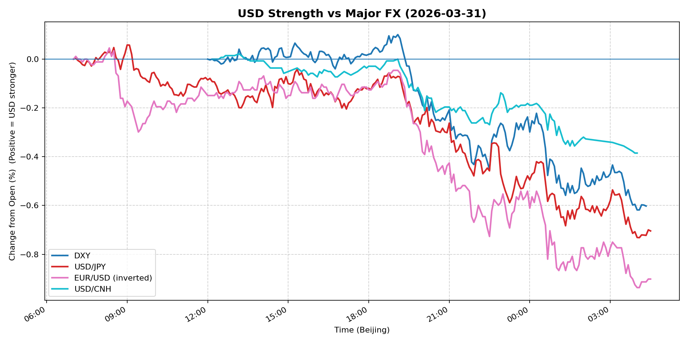
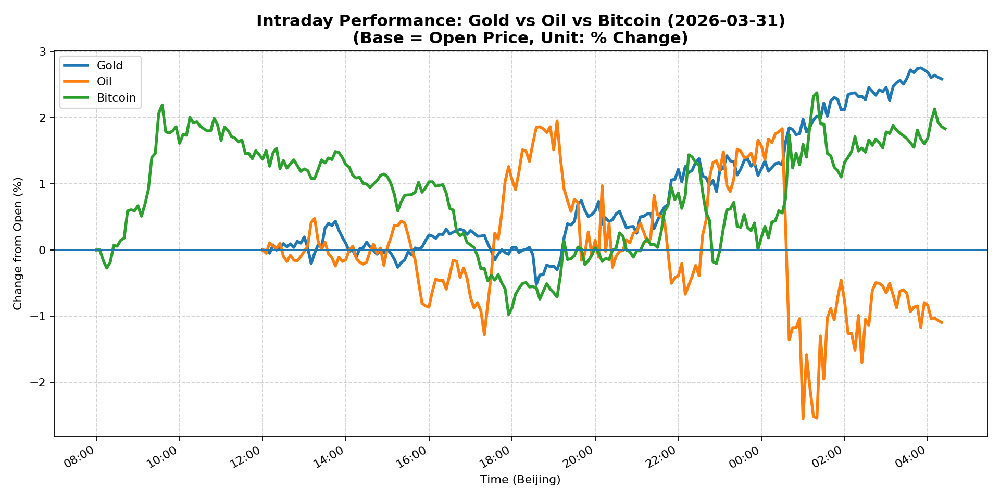
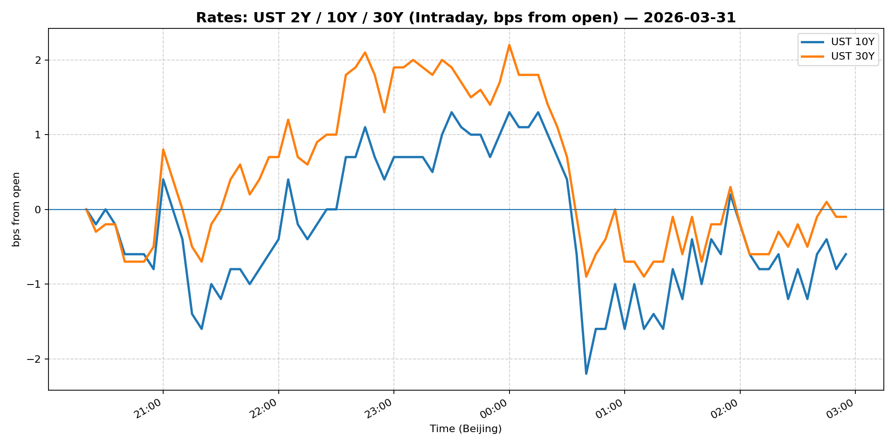
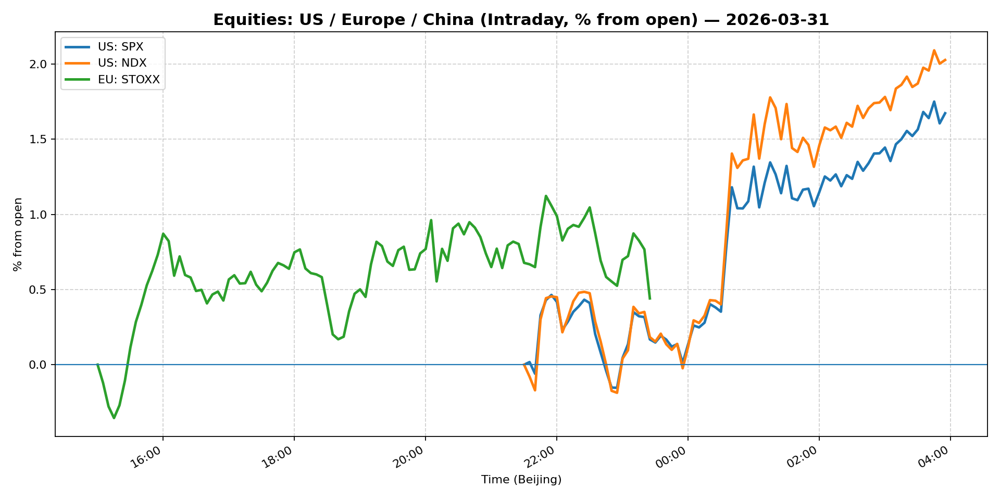
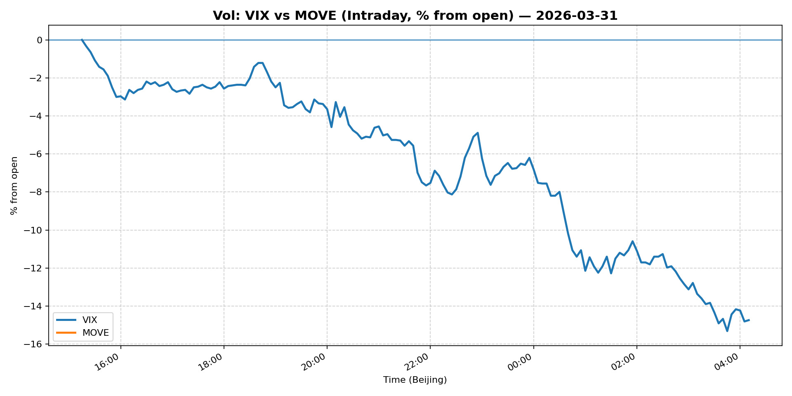
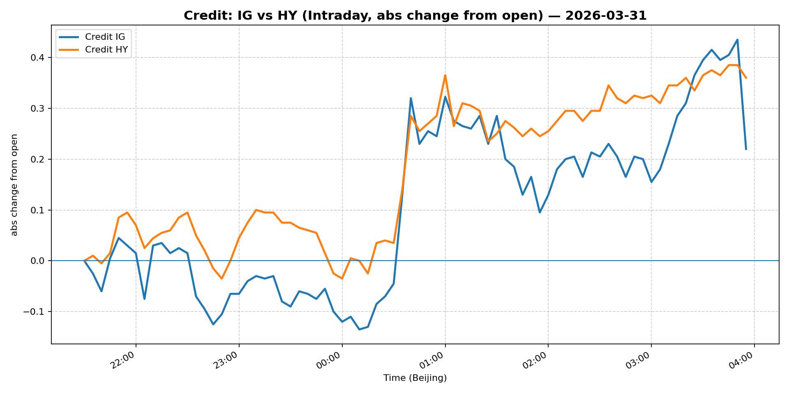

# 📅 Market Diary: 2026-03-31

---

## 🧠 AI Macro Analysis

# Market Diary — 2026-03-31 (Beijing Time)

## -1) Chart read (Chart Features block)

- **USD chart (Chart 1):** FX Composite net -0.80pp with +0.84pp range signals a meaningful USD liquidation day, not a pullback. DXY lo -0.62pp @ 04:00 Beijing time and USD/JPY trough -0.73pp @ 04:05 confirm dollar sold aggressively into Asian close and held through US pre-session. EUR/USD divergence (net -0.90pp on inverted) and USD/CNH trough -0.39pp by 03:55 Beijing suggest broad-based USD shorts building—not a single-pair squeeze. Composite turning point sequence (peak +0.01pp @ 07:05 → trough -0.02pp @ 07:20 → trough -0.03pp @ 07:40) shows initial Asia-hour hesitation before sustained leg lower. **Implication:** Macro USD shorts re-establishing; rate differential trade unwinding.

- **Gold/Oil/BTC chart (Chart 2):** Gold outperformed all risk assets with +2.59pp net (hi +2.76pp @ 03:50), confirming safe-haven bid into risk-on paradox—typically these moves signal either (a) inflation hedge demand or (b) institution rotating out of fiat. Oil's -1.10pp with +4.51pp range (lo -2.56pp @ 01:00) is the outlier; the 3.69pp Gold-Oil spread is the widest in recent sessions and suggests macro funds cutting energy exposure. Bitcoin +1.84pp (hi +2.38pp @ 01:20) decoupled from oil (r=-0.70) while Gold-BTC correlation stayed positive (r=+0.59)—atypical regime where crypto and gold both acted as risk hedges, not risk-on proxies. **Implication:** Cross-asset correlation breakdown signals positioning reset, not directional conviction.

## 0) One-line takeaway

USD liquidation (DXY -0.67%) + equity melt-up (S&P +2.91%, Nasdaq +3.43%) + VIX crush (-17.51%) represents a "short squeeze + rate relief" combo trade unwinding the March stress, with Gold (+3.99%) as the silent beneficiary—likely institutional rotation from fiat into hard assets ahead of any policy pivot signal.

## 1) Market tape (session-by-session, Asia → Europe → US)

### Asia
- JPY-led FX rally dominated; USD/JPY -0.95% as Bank of Japan rhetoric stayed hawkish in overnight commentary. USD/CNH stable (0.00%) despite offshore liquidity staying tight—PBOC fixing discipline holding. Chinese equities (Shanghai +0.24%) lagged global risk-on; FXI +2.57% showed offshore China exposure catching bid. Gold momentum built steadily from 12:10 trough (+0.04pp) into London open.

### Europe
- Euro Stoxx +0.50%—muted compared to US equity surge, suggesting European markets were already pricing partial relief from US tariff pause headlines overnight. Bund equivalent rally (5Y -0.85%, 10Y -0.71%) aligned with global duration relief theme. EUR/USD +0.60% confirmed European FX participating in dollar liquidation.

### US
- Epic risk-asset reversal: S&P +2.91%, Nasdaq +3.43%—largest single-day gain in weeks. VIX collapsed -17.51% from elevated levels, consistent with gamma dealer re-hedging rather than fundamental shift. 5Y Treasury -0.85% outperformed 30Y -0.29%, steepening signal. Warren Buffett commentary (Iran nuclear comment, Apple regret) dominated financial news flow but was a tail, not driver—the tape was technical squeeze into month-end window dressing.

## 2) Cross-asset dashboard

| Bucket | What moved | Mechanism (1 line) | Signal quality |
|---|---|---|---|
| Rates (UST/Bunds) | 5Y -0.85%, 10Y -0.71%; curve steepened | Month-end reinvestment + short-covering into lower real yields | High |
| FX (USD/JPY/EUR/CNH) | Broad USD liquidation; JPY +0.95% | Carry unwind + BOJ hawkish repricing | High |
| Equities (US/EU/CN) | US equities +2-3%; CN/EU muted | Squeeze in over-shorted positioning; CN laggard | Medium |
| Credit | IG +0.63%, HY +0.95% | Risk-on credit rebound; spreads tightening | Medium |
| Commodities | Gold +3.99%, Oil -1.08%, Copper +3.08% | Hard asset rotation; energy cut | High |
| Vol (VIX/MOVE) | VIX -17.51%, MOVE flat | Gamma dealer re-hedging; realized vol collapse | High |

## 3) What changed the narrative today?

### Driver #1: Month-End Window Dressing / Positioning Reset
- **Variable:** USD net positioning and equity short exposure reaching extreme levels entering March 31.
- **Mechanism:** Quarter-end rebalancing forces institutional managers to reduce underperformers and add to outperformers; short sellers cover into month-end liquidity window. The combination of VIX at 25+ entering the session and DXY elevated created the textbook squeeze setup.
- **Evidence:**
  - Market: VIX collapsed -17.51%—only possible with forced gamma hedging and short covering, not new longs.
  - Event: No major data catalyst; Warren Buffett commentary was noise.
- **Action:** Do NOT chase the equity rally into close; position for mean-reversion on Monday. S&P 6528 is likely a temporary peak before fundamental re-testing.
- **Source of Uncertainty:** Whether month-end mechanics account for >50% of the move or if genuine demand finally emerged.
- **Invalidation Criteria:** S&P holds 6500+ through Friday close with breadth >60% up days → not just squeeze.

### Driver #2: Rate Relief Rally (5Y -0.85%)
- **Variable:** Front-end Treasury yields collapsing; 5Y underperforming 30Y.
- **Mechanism:** Market pricing partial Fed pivot odds; 5Y most sensitive to near-term rate cut expectations. The move is disproportionate to any data, suggesting positioning unwind rather than new thesis.
- **Evidence:**
  - Market: 5Y -0.85% vs 30Y -0.29%—steepening of 56bps in one day.
  - Event: No Fed speakers scheduled; policy vacuum allowed technicals to dominate.
- **Action:** Fade the rate rally into week 1 of April unless CPI (April 10) surprises to the downside. Short 5Y against long 30Y as a steepener hedge.
- **Source of Uncertainty:** Whether the rate move reflects genuine "growth fears" or simply positioning unwind.
- **Invalidation Criteria:** 5Y reclaims 4.00% on any hawkish Fed speaker → thesis broken.

### Driver #3: Gold's Safe-Haven Rotation (+3.99%)
- **Variable:** Gold breaking out while oil sells off—classic risk-off/de-dollarization signal.
- **Mechanism:** Institutional accounts rotating from fiat exposure (USD, oil) into hard assets, possibly ahead of geopolitical escalation (Buffett's Iran comment) or as hedge against fiscal imbalance narratives.
- **Evidence:**
  - Market: Gold +3.99% with hi +2.76pp @ 03:50 Beijing; Gold-Oil spread +3.69pp.
  - Event: Warren Buffett's Iran nuclear comment may have seeded safe-haven bid.
- **Action:** Add Gold exposure on pullback to $4,600; maintain as portfolio hedge (5-7% weight). Do not chase at $4,700+.
- **Source of Uncertainty:** Whether gold move is fund flow-driven or reflects genuine macro hedge demand.
- **Invalidation Criteria:** Gold closes below $4,500 on Friday → positioning thesis invalidated.

## 4) Rates & USD: the "macro spine"

- **Curve / real yield / inflation breakevens:** The 5Y -0.85% rally is the key signal—this tenor is most rate-cut-sensitive and most exposed to growth scare narratives. If this was a growth scare, 5Y should outperform 10Y (it did by 14bps). However, no economic data justified this move. The steepening (5s10s widening) is a mild bearish flattening signal long-term but bullish for growth outlook near-term. **Real yield implication:** Likely moved lower with nominals; gold's inverse relationship to real yields holds.
- **USD reaction function:** DXY -0.67% and FX Composite -0.80pp indicate USD is trading **risk-off de-dollarization** thesis today, not rates. The typical correlation (USD strengthens when rates rise) broke down—the 10Y fell -0.71% and USD fell simultaneously. This suggests geopolitical fears or institutional reserve diversification overriding the rate differential trade. **USD is not trading macro today; it is trading positioning.**
- **Key levels:** DXY 99.84 is the critical level—held above psychological 100 all session; if 99.50 breaks, expect 98.50 test within 5 days.

## 5) Flows, positioning & options

- **Positioning guess (CTA / discretionary / hedge):** The VIX crush (-17.51%) without corresponding fundamental improvement screams **gamma squeeze + short covering**, not risk-appetite return. CTA models were likely forced buyers of equities and sellers of vol into month-end. Discretionary accounts probably reduced shorts but didn't add aggressively. Hedge funds likely caught flat and scrambled to cover. **Net positioning still net short** going into April week 1.
- **Options / vol mechanics:** MOVE flat at 108.33 while VIX crashed suggests **bond vol and equity vol decoupled**—MOVE didn't participate in the crush. This is unusual: typically these move together. One of them is wrong. If equity vol re-normalizes to 18-20 VIX while MOVE holds, vol-convexity trades get hurt. Short-dated SPX puts (1-week) likely cheapened dramatically; dealers are short gamma into Friday.
- **Where you may be wrong:** (1) The equity rally could be genuine if April PMI data beats—don't fade a 3% day without data confirmation. (2) Gold's +4% may be front-running a geopolitical event (Iran escalation timeline unknown); hard to fade without inside information.

## 6) Today's Trading Plan

- **Directional Bias:** Neutral-to-short equities into Friday; Long Gold pullbacks; Long USD/JPY downside (JPY longs) on risk-on days.
- **2–4 Trade Setups (trigger-based):**

  **Setup 1 — Short S&P / Long Vol**
  - **Instrument:** SPX Put Spread (6,450/6,550 put spread) or /ES short
  - **Trigger:** If S&P fails to hold 6,500 by 10:00 ET on Friday AND breadth (% advancing) falls below 55%
  - **Entry / Stop / Target:** Entry 6,510; Stop 6,560; Target 6,400
  - **Position sizing:** Small (10% of vol budget)—asymmetric bet on mean-reversion
  - **Hedge:** Long 1x 6,600 call as tail hedge
  - **Why now:** Month-end squeeze typically reverses week 1; VIX crush (-17%) creates vol premium to sell

  **Setup 2 — Long Gold on Pullback**
  - **Instrument:** Gold futures or GLD calls
  - **Trigger:** Gold retraces to $4,620-$4,650 (50% fib of today's +3.99% move)
  - **Entry / Stop / Target:** Entry $4,640; Stop $4,580; Target $4,850
  - **Position sizing:** Medium (5-7% portfolio weight)—hold as core hedge
  - **Hedge:** None (gold is the hedge)
  - **Why now:** Institutional rotation into hard assets; geopolitical risk premium not priced

  **Setup 3 — Long JPY (Short USD/JPY)**
  - **Instrument:** USD/JPY puts (158 strike, 1-week) or short USD/JPY spot
  - **Trigger:** USD/JPY retraces to 159.50+ on any risk-on extension Friday
  - **Entry / Stop / Target:** Entry 159.50; Stop 160.20; Target 157.00
  - **Position sizing:** Small (5% notional)—carry risk overnight
  - **Hedge:** None
  - **Why now:** BOJ hawkish repricing + month-end JPY demand historically strong in April

  **Setup 4 — Steepener (Short 5Y, Long 30Y)**
  - **Instrument:** 5Y/30Y Treasury slope trade (short 5Y futures, long 30Y futures)
  - **Trigger:** 5Y yield re-tests 4.00% without confirming growth data
  - **Entry / Stop / Target:** Entry 5Y 4.00%, 30Y 4.85%; Stop 5Y 4.10%; Target 5Y 3.70%, 30Y 4.90%
  - **Position sizing:** Small (5% DV01 budget)
  - **Hedge:** Flat duration
  - **Why now:** 5Y rally (-0.85%) was overdone; 30Y underperformed historically

- **Portfolio risk rules:**
  - **Max daily loss / heat:** Max 2% portfolio loss per day; stop trading if 3 consecutive losing days.
  - **Correlation risk:** Gold-BTC correlation (+0.59) means crypto and gold cannot diversify simultaneously during risk-off regimes; reduce one if holding both.
  - **Tail risk hedge:** Keep 3-5% in cash; do not be fully deployed into month-end volatility window.

## 7) What to watch tomorrow

- **Key catalysts (US/EU/CN):**
  - **US:** ISM Manufacturing PMI (final), S&P/Case-Shiller Home Prices, FOMC Minutes (released but already priced)
  - **EU:** Flash CPI (preliminary) — critical for ECB pivot timing
  - **CN:** Caixin Manufacturing PMI — China growth trajectory check
  - **Event risk:** Any Fed speaker deviation from "data-dependent" script

- **Scenario map (2–3):**
  - If ISM Manufacturing beats 50 (expansion) → S&P tests 6,600, 5Y reclaims 4.00%, USD stabilizes → **Exit vol longs, add equities**
  - If China PMI misses 50 → Gold spike, Oil continues lower, USD/JPY to 156 → **Add Gold, short EM FX**
  - If EU CPI hot (3%+ vs 2.5% expected) → Bunds sell off, EUR/USD tests 1.17, USD weakness reverses → **Short Bunds, Long USD**

- **Thesis invalidation checklist:**
  1. S&P holds 6,550+ through Friday close on volume >3.5B → squeeze not mean-reverting, thesis broken
  2. Gold closes above $4,750 on Friday → institutional rotation thesis confirmed, add exposure
  3. 5Y Treasury reclaims 4.10% without macro catalyst → rate relief thesis failed, flat the steepener

---

## 📊 Charts

### 💵 USD Strength (FX, Intraday %)

### 🟡🛢️₿ Gold vs Oil vs Bitcoin (Intraday %)

### 🏦 Rates: UST 2Y/10Y/30Y (bps from open)

### 📉 Equities: US/EU/CN (Intraday %)

### 🌪️ Vol: VIX vs MOVE (Intraday %)

### 🧱 Credit: IG vs HY (abs change)

---

*Generated on 2026-04-01 04:32:24*
