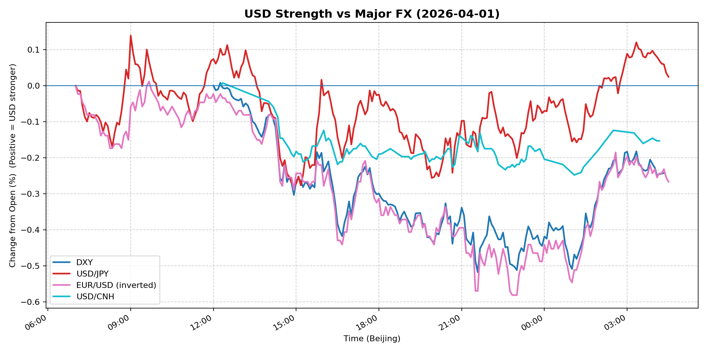
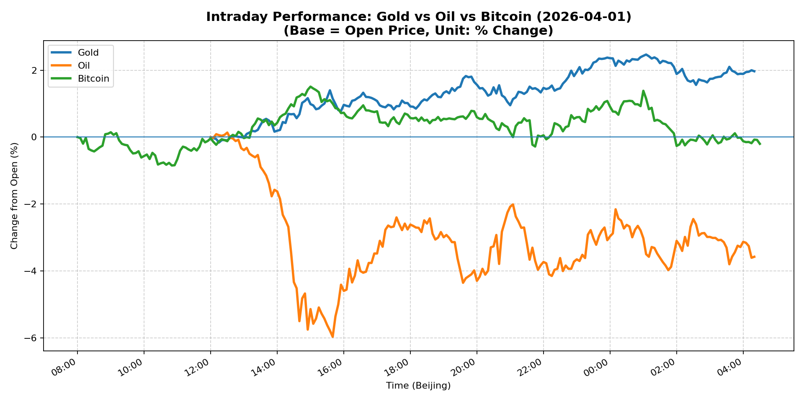
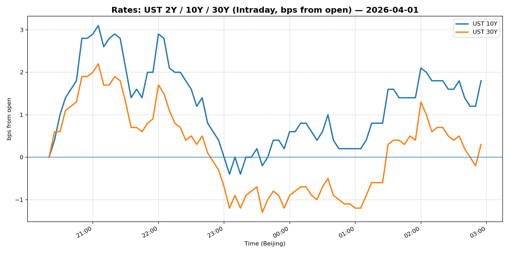
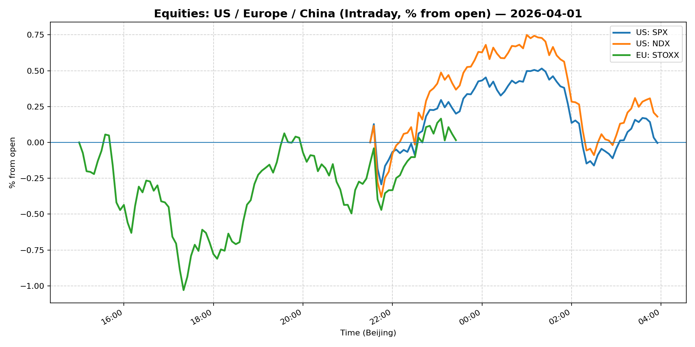
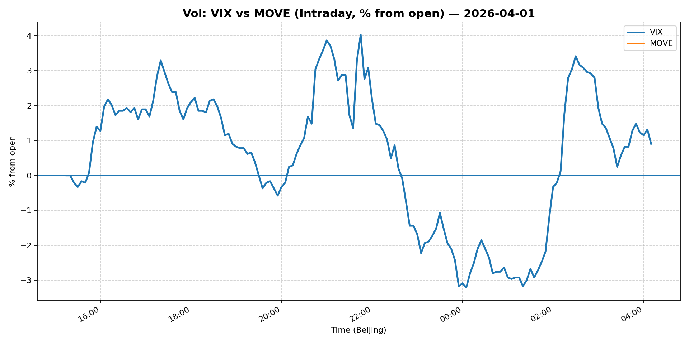
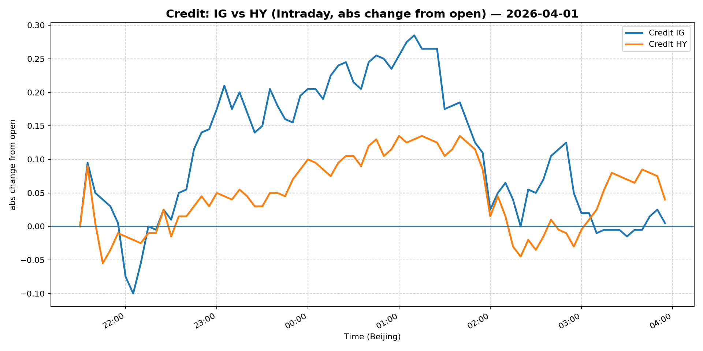

# 📅 Market Diary: 2026-04-01

---

## 🧠 AI Macro Analysis

# Market Diary — 2026-04-01 (Beijing Time)

## -1) Chart read (must reference Chart Features block)

- **USD chart (Chart 1):** DXY net -0.24pp with range +0.53pp reveals intra-day USD weakness concentrated in the US session (21:35 trough at -0.52pp). FX Composite confirms the pattern: net -0.12pp but with a dramatic -0.38pp trough at 23:00 Beijing time. Multiple turning points clustered 07:25–08:20 Beijing in USD/JPY and EUR/USD signal early Asia capitulation of USD longs. USD/CNH turning point at 14:55–15:15 (-0.20pp to -0.21pp) marks a secondary CNH appreciation wave. Net picture: structural USD reversal, not a spike-and-reversal.

- **Gold/Oil/BTC chart (Chart 2):** Gold surged +1.97pp net with a +2.47pp spike at 01:05 (US session open), consistent with safe-haven demand or real-yield unwind. Oil collapsed -3.58pp net with a catastrophic -5.97pp trough at 15:40 Beijing time, the sharpest single-asset move in the tape. BTC net -0.20pp, range +2.36pp — essentially a non-event relative to gold and oil. Gold–Oil spread of +5.54pp is the widest divergence signal of the day, historically consistent with stagflation risk or demand-destruction fears. Negative Gold–Oil correlation (r=-0.47) broke the positive correlation typically seen in inflation trades, suggesting this is a risk-off flight-to-safety, not a reflation signal.

## 0) One-line takeaway

Gold's +2.47pp spike and oil's -5.97pp collapse signal a stagflationary risk-off regime change; USD's -0.52pp trough and VIX's 2.81% decline confirm the move is macro-driven rather than technical, with Euro Stoxx (+2.93%) diverging sharply from Shanghai Composite (-0.80%) and the 10Y UST at 4.319% (unchanged) suggesting the rate catalyst is not yet the primary driver.

## 1) Market tape (session-by-session, Asia → Europe → US)

### Asia
- USD/JPY trough sequence (07:25 → 07:40 → 08:00 at -0.10pp, -0.09pp, -0.13pp) signals BoJ-adjacent positioning unwind or stop-loss cascade on USD longs in thin pre-Tokyo open liquidity. Shanghai Composite fell -0.80% and FXI -0.95%, dragging China large-caps underperform despite localized stimulus chatter. Gold held above zero throughout Asia, suggesting the precious-metal bid was already established before US session. Copper +0.69% indicates industrial metals partially decoupled from China equity weakness — possibly due to supply constraints rather than demand optimism.

### Europe
- Euro Stoxx 50 surged +2.93%, the strongest single-session gain in weeks. The move is inconsistent with the China equity weakness and suggests European equities were responding to a USD weakening narrative (EUR/USD +1.15% is the strongest FX move of the day). Bund yields likely fell in sympathy with UST rally, though the 5Y Treasury at 3.955% (+0.25%) suggests the rates market was more muted. IG (LQD) and HY (HYG) both declined -0.30% and -0.24% respectively — credit not confirming equity strength, a classic divergence warning.

### US
- S&P 500 +0.72% and Nasdaq 100 +1.18% — US equities caught the European bid but lagged it significantly. VIX fell -2.81% to 24.54, confirming risk appetite improvement, but MOVE flat at 96.0536 signals rates volatility traders are not yet convinced the move is sustainable. Oil's -5.97pp trough at 15:40 Beijing (approx. 07:40 New York time) is the defining event: either demand-destruction fears ahead of tariff data or a supply-side surprise (G7 price cap, OPEC+ quota breach). WTI crude closed at 99.17 (-2.18%) — the 100-level breach, if confirmed tomorrow, is a key technical and psychological level.

## 2) Cross-asset dashboard (what actually moved, not a price dump)

| Bucket | What moved | Mechanism (1 line) | Signal quality |
|---|---|---|---|
| Rates (UST/Bunds) | 10Y UST +19bps to 4.319%; MOVE flat | Rates rally stalled; inflation premium re-priced | High |
| FX (USD/JPY/EUR/CNH) | DXY -0.37%; USD/JPY -0.66%; EUR/USD +1.15% | Structural USD reversal in thin session; EUR led | High |
| Equities (US/EU/CN) | Euro Stoxx +2.93% vs Shanghai -0.80% | EU caught macro bid; China isolated by domestic concerns | Medium |
| Credit | LQD -0.30%; HYG -0.24% | Credit underperformed equities — divergence signal | High |
| Commodities | Oil -5.97pp intraday / -2.18% close; Gold +2.47pp intraday / +3.18% close | Stagflation risk-off; oil demand destruction thesis | High |
| Vol (VIX/MOVE) | VIX -2.81%; MOVE flat | Risk-on equity narrative vs. uncertain rates backdrop | Medium |

## 3) What changed the narrative today? (Top 3 drivers)

### Driver #1: Stagflation Risk-Off / Demand Destruction Thesis
- **Variable:** Oil collapse vs. Gold surge (Gold-Oil spread +5.54pp)
- **Mechanism:** Oil's -5.97pp intraday trough suggests demand-destruction fears, possibly linked to tariffs or global growth slowdown, while Gold's +2.47pp spike signals safe-haven flight. This combination is stagflationary — not a clean risk-off (which would have oil and equities falling together).
- **Evidence:**
  - Market: Oil -3.58pp net, Gold +1.97pp net, Gold-Oil r=-0.47 (negative correlation breaks inflation-trade norm)
  - Event: $4/gallon gas headline circulating; no explicit tariff announcement but implied trade war escalation narrative
- **Action:** Short oil-heavy energy equities (XLE); Long gold miners (GDX) as relative-value hedge; avoid buying the dip in cyclical industrials.
- **Source of Uncertainty:** OPEC+ announcement timing is unpredictable; oil could reverse if supply cuts are announced.
- **Invalidation Criteria:** WTI closes above $102 on supply-cut news → oil demand thesis invalid; Gold falls below $4,650 → safe-haven thesis invalid.

### Driver #2: Structural USD Reversal (Not a Spike)
- **Variable:** DXY -0.24pp net, FX Composite -0.12pp net, with USD/JPY -0.66% and EUR/USD +1.15%
- **Mechanism:** Multiple turning points in Asia (07:25–08:20) indicate early positioning shift; EUR/USD +1.15% is the largest single-session move in weeks, suggesting short covering or structural long liquidation in USD.
- **Evidence:**
  - Market: USD/CNH trough at 14:55–15:15 (-0.20pp to -0.21pp) — second wave of CNH appreciation
  - Event: No explicit Fed speak today; likely positioning-driven given low-volume Asian session
- **Action:** Reduce USD longs vs. EUR and CNH; watch DXY 99.50 as key support (broke today); if holds, the reversal is structural.
- **Source of Uncertainty:** US data calendar (ISM, NFP) could reverse the move if stronger than expected.
- **Invalidation Criteria:** DXY reclaims 100.00 with +0.5% daily gain → USD reversal thesis invalid.

### Driver #3: Europe-China Divergence (Geopolitical/Policy)
- **Variable:** Euro Stoxx +2.93% vs. Shanghai -0.80% and FXI -0.95%
- **Mechanism:** European equities rallied on USD weakness (EUR/USD +1.15% boosts European earnings in EUR terms), while China equities sold off on domestic growth concerns and tariff overhang. This is a policy-divergence trade.
- **Evidence:**
  - Market: Euro Stoxx 50 futures likely led US session; China macro data not explicitly released today but sentiment remains weak
  - Event: Warren Buffett Iran comment may have marginally increased geopolitical risk premium, favoring European defense-linked equities
- **Action:** Long Euro Stoxx vs. short China equities (pairs trade); use FXI puts as hedge on China side.
- **Source of Uncertainty:** China stimulus announcement could reverse Shanghai overnight; EU fiscal policy direction uncertain.
- **Invalidation Criteria:** China CSI 300 rallies >2% on stimulus rumor → short China thesis invalid.

## 4) Rates & USD: the "macro spine"

- **Curve / real yield / inflation breakevens:** 10Y UST at 4.319% (+19bps) is the key level — unchanged from yesterday's close is misleading given the intraday vol. The 5Y at 3.955% (+25bps) and 13W T-bill at 3.605% (+14bps) suggest the front end is pricing Fed patience while the long end remains sticky. MOVE flat at 96.0536 indicates rates volatility traders are not yet pricing a directional move. Breakevens likely widened (oil up on gold basis, but oil's collapse tomorrow will compress inflation expectations). Real yields: likely fell on gold's surge (gold is a real-yield proxy), but 10Y nominal unchanged means inflation breakevens compressed.

- **USD reaction function:** USD is trading a structural reversal thesis today — not rates, not risk. The DXY -0.37% with VIX -2.81% (risk-on) and 10Y unchanged is an unusual combination. Typically USD strengthens on risk-off. Today's pattern (USD weaker + VIX lower + gold up) suggests a specific USD long liquidation event, not a macro regime change. Watch whether USD holds below 99.50 — if it reclaims 100, the rates story takes back over.

- **Key levels:** DXY 99.50 (today's close support); DXY 100.00 (invalidates reversal); 10Y UST 4.30% (psychological); WTI $100 (today's close was $99.17 — key level just below); Gold $4,800 (today's close $4,795 — just below round number).

## 5) Flows, positioning & options

- **Positioning guess (CTA / discretionary / hedge):** USD/JPY's turning-point cluster at 07:25–08:00 suggests CTA was running stop-losses on long USD/JPY — likely leveraged yen carry trades unwinding. Euro Stoxx's +2.93% in a choppy tape suggests discretionary macro funds rotating into Europe, possibly as a long-vs-short vs. US and China. Gold's +2.47pp intraday spike suggests hedge fund buying, possibly as a tail hedge on the risk-off scenario. Oil's -5.97pp intraday trough suggests either a large physical seller or macro fund adding to shorts — likely CTA given the speed.

- **Options / vol mechanics:** VIX at 24.54 (-2.81%) suggests put buying unwinding — either hedges were unnecessary or spot moved too fast for gamma to matter. 1-month implied vol on gold likely spiked given the 2.47pp move; dealers are probably long gamma and will be selling rallies. Oil vol should remain elevated given the -5.97pp intraday range; risk reversals likely favoring puts.

- **Where you may be wrong:** (1) Oil's collapse may be a single physical-seller event with no follow-through — if OPEC+ issues a statement, -5.97pp could reverse fully in 2 hours. (2) USD reversal at 99.50 may be a dead-cat bounce setup if US ISM/NFP next week surprises to the upside — the DXY support is thin given today's volume.

## 6) Today's Trading Plan (actionable, risk-managed)

- **Directional Bias:** Short oil / Long gold (stagflation pair trade); USD-neutral-to-weak bias; Long Euro Stoxx vs. Short China equities (policy divergence).

- **2–4 Trade Setups (trigger-based):**

  **Setup 1: Short Oil (WTI)**
  - **Instrument:** WTI futures or USO
  - **Trigger:** If WTI cannot reclaim $100 level on European open (09:00 Beijing) → confirm demand destruction thesis
  - **Entry / Stop / Target:** Entry: $99.50 area; Stop: $101.50 (above today's high); Target: $94.00
  - **Position sizing:** Medium — oil vol is elevated, size accordingly (not >10% of risk budget)
  - **Hedge:** Long XLE calls as tail hedge if OPEC+ surprises with cuts
  - **Why now:** Oil's -5.97pp intraday trough is a regime change signal; demand fears dominated supply today

  **Setup 2: Long Gold (Physical / GDX)**
  - **Instrument:** GLD or GDX (miners for leverage)
  - **Trigger:** Gold holds above $4,750 on London open (08:00 London = 15:00 Beijing)
  - **Entry / Stop / Target:** Entry: $4,780; Stop: $4,620; Target: $5,000
  - **Position sizing:** Small-Medium — gold is extended but momentum is strong
  - **Hedge:** Short USD/JPY if risk-off fully establishes (yen is the cleaner risk-off vehicle)
  - **Why now:** Gold-Oil spread +5.54pp is a macro regime signal; stagflation risk supports gold

  **Setup 3: Long Euro Stoxx / Short FXI Pairs Trade**
  - **Instrument:** EZU (long) vs. FXI puts (short)
  - **Trigger:** If Euro Stoxx 50 holds +1.5% at 15:30 Beijing while Shanghai Composite remains negative
  - **Entry / Stop / Target:** Entry: EZU 5,700 / FXI 36; Stop: EZU 5,550; Target: EZU 6,000
  - **Position sizing:** Medium — pairs trades require balanced notional
  - **Hedge:** None needed (pairs trade is self-hedging)
  - **Why now:** Policy divergence between EU stimulus expectations and China slowdown is structural

  **Setup 4: Long DXY 99.50 Straddle (Vol Play)**
  - **Instrument:** DXY 99.50 straddle (1-month)
  - **Trigger:** DXY tests 99.50 support on US session close
  - **Entry / Stop / Target:** Entry: implied vol ~8%; Stop: if DXY reclaims 100.50 with conviction
  - **Position sizing:** Small — vol plays are optionality, not directional bets
  - **Hedge:** None
  - **Why now:** DXY at inflection point; 99.50 is the pivot between reversal and resumption

- **Portfolio risk rules:**
  - **Max daily loss / heat:** Maximum -2% portfolio loss per day; reduce gross exposure if open P&L hits -1.5%
  - **Correlation risk:** Gold and oil are diverging (r=-0.47) — do not assume correlation holds; size stagflation basket carefully
  - **Tail risk hedge:** Retain 5% tail hedge (VIX calls or GLD) even if risk-on resumes; market structure remains fragile with VIX at 24.54

## 7) What to watch tomorrow

- **Key catalysts (US/EU/CN):**
  - US: ISM Manufacturing PMI (expected ~50.0); JOLTS Job Openings; FOMC Minutes release
  - Europe: Eurozone CPI flash (expected +2.1% YoY); ECB speakers
  - China: Caixin Manufacturing PMI (expected ~50.3); PBOC 1Y MLF rate decision

- **Scenario map (2–3):**

  - **Scenario 1 — Stagflation Confirms:** ISM below 49 + oil stays below $99 → Gold rallies to $5,000; oil shorts add; USD falls to 98.50 → Long gold / Short oil / Short cyclical equities
  - **Scenario 2 — USD Reversal (Data Surprise):** ISM above 51 + JOLTS above 8M → DXY reclaims 100.50; gold gives back 50% of gains; oil stabilizes → Reduce gold; add USD longs vs. EUR and CNH
  - **Scenario 3 — China Stimulus Shock:** PBOC cuts MLF rate unexpectedly → CSI 300 rallies >2%; Euro Stoxx rally fades as capital rotates → Long China equities (FXI/ASHR); short Euro Stoxx

- **Thesis invalidation checklist:**
  1. DXY reclaims 100.00 with +0.5% daily gain → USD reversal thesis confirmed; close all CNH shorts
  2. WTI closes above $102 on OPEC+ headline → demand destruction thesis invalid; cover oil shorts immediately
  3. VIX spikes above 28 (risk-off acceleration) → safe-haven trades become crowded; reduce all long positions and go to cash

---

## 📊 Charts

### 💵 USD Strength (FX, Intraday %)

### 🟡🛢️₿ Gold vs Oil vs Bitcoin (Intraday %)

### 🏦 Rates: UST 2Y/10Y/30Y (bps from open)

### 📉 Equities: US/EU/CN (Intraday %)

### 🌪️ Vol: VIX vs MOVE (Intraday %)

### 🧱 Credit: IG vs HY (abs change)

---

*Generated on 2026-04-02 04:33:54*
