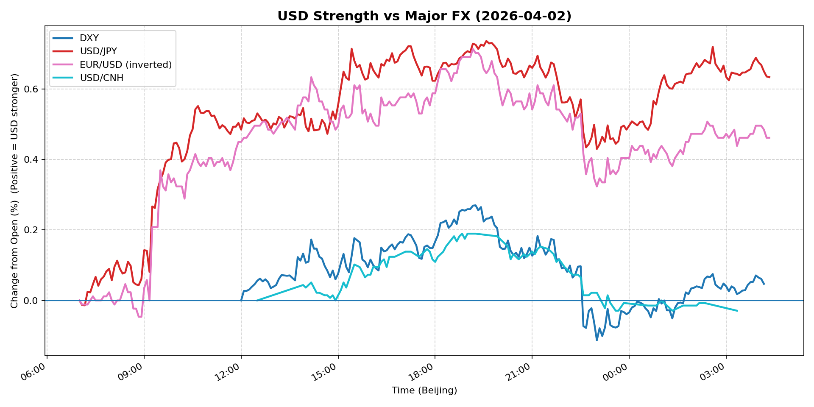
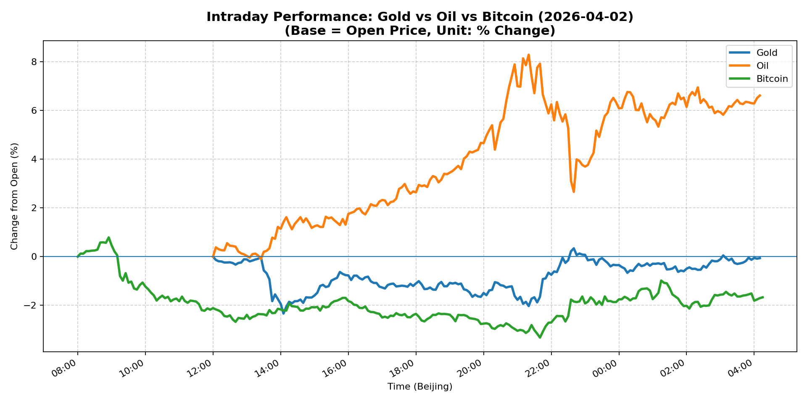
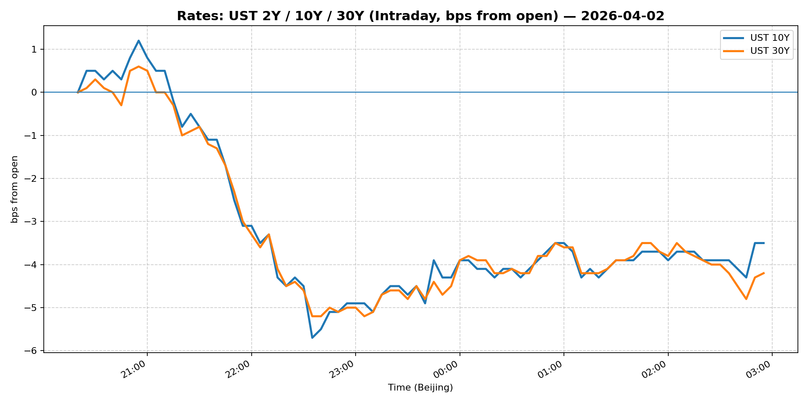
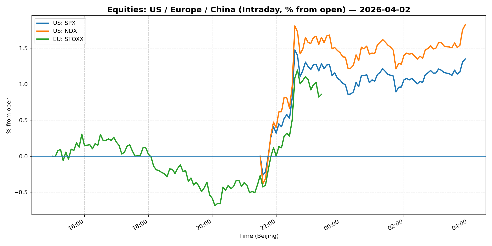
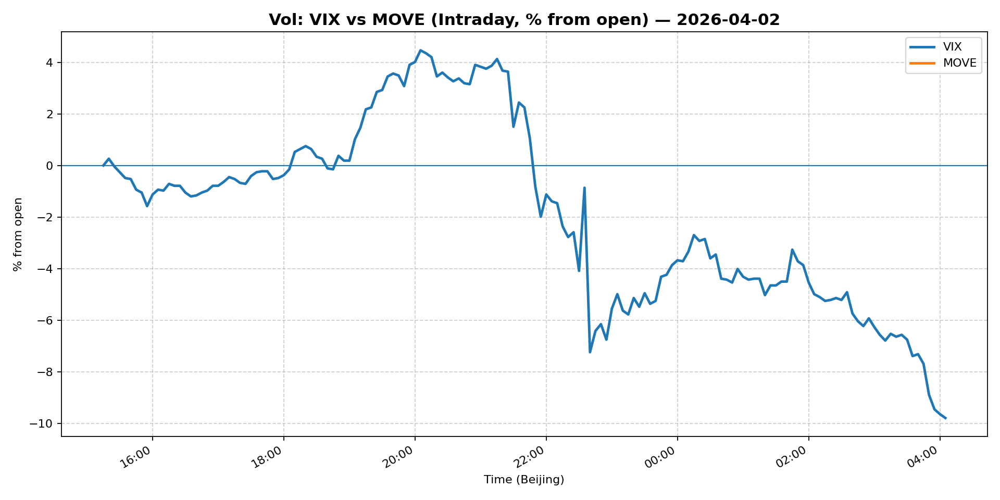
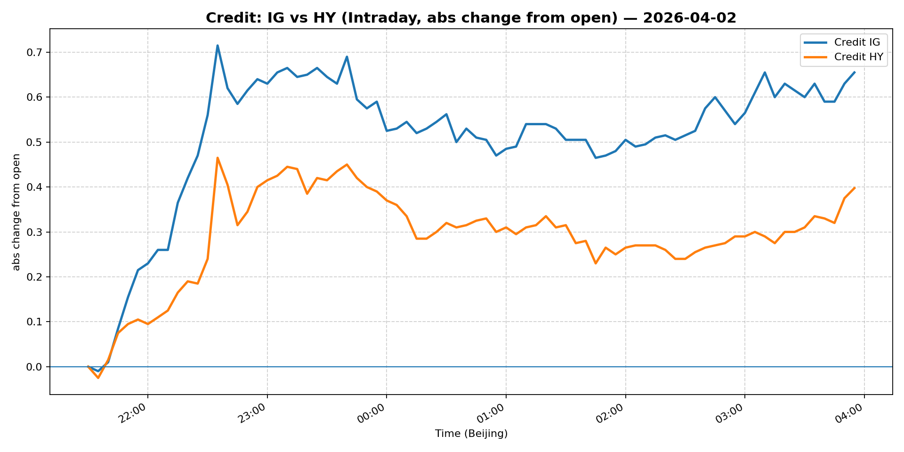

# 📅 Market Diary: 2026-04-02

---

## 🧠 AI Macro Analysis

# Market Diary — 2026-04-02 (Beijing Time)

## -1) Chart read (must reference Chart Features block)

- **USD chart (Chart 1):** FX Composite net +0.55pp with narrow range +0.56pp signals a controlled, session-concentrated move—not broad dollar strength. USD/JPY drives the composite with net +0.63pp and late-session acceleration to +0.74pp at 19:35 Beijing (consistent with US equity open risk-off). DXY peaked at +0.27pp @ 19:15 then faded to +0.05pp net, suggesting USD initially bid on geopolitical premium, then partially reversed. USD/CNH at net -0.03pp with tight range +0.22pp indicates China-linked demand subdued; PBOC or state banks likely active. EUR/USD inverted signal net +0.46pp confirms the dollar bid is EUR-driven, not broad-based.

- **Gold/Oil/BTC chart (Chart 2):** Extreme divergence: Oil +6.62pp (range +8.39pp) vs BTC -1.67pp (range +4.11pp) vs Gold -0.06pp (range +2.68pp). The 8.29pp spread is a regime signal—geopolitical risk-on in energy, risk-off in crypto, gold uncommitted. Oil's peak at +8.30pp @ 21:20 aligns with US session escalation headlines. Gold's 2.68pp intraday range but only -0.06pp net suggests two-way flow: safe-haven bid early, profit-taking or margin compression late. Gold-BTC correlation at r=+0.56 is elevated but driven by BTC's directional move, not gold's. Oil-BTC at r=+0.11 confirms decoupled energy market.

## 0) One-line takeaway
Iran geopolitical escalation drove oil to 3-year highs while USD/JPY repriced rate differential risk; gold's failure to hold $4,700 and BTC's decline signal crypto is not the safe-haven in this regime—the market is rotating into energy and defensive USD positioning.

## 1) Market tape (session-by-session, Asia → Europe → US)

### Asia
- USD/JPY: trough at 07:10 (-0.01pp), then accelerated to +0.09pp by 07:55 Beijing—early bid likely from overnight US futures drift. JPY crosses underperform as BOJ policy normalization expectations fade post-Kuroda comments.
- USD/CNH: tight range +0.22pp, peaked +0.05pp at 14:10 Beijing—PBOC fix likely set near stronger end of band. China markets closed early; Shanghai Composite at +1.46% reflects domestic tech stimulus expectations, not FX-driven.
- Gold: trough -2.34pp at 14:05—aggressive liquidation or margin-driven selling; recovered to -0.11pp by 12:55 but failed to recapture $4,700 level.

### Europe
- DXY: peaked +0.27pp at 19:15 (mid-session, ahead of US open)—European equity weakness (Euro Stoxx -0.70%) drove defensive USD bid. EUR/USD inverted signal peaked +0.05pp at 08:25.
- Oil: trough -0.04pp at 13:05, then reversal—European session priced partial Iran risk before US confirmation.
- Bitcoin: trough -0.98pp at 09:20—European liquidity providers reducing exposure ahead of US geopolitical headlines.

### US
- Oil: explosive +8.30pp peak at 21:20—Trump vow to hit Iran "extremely hard" confirmed geopolitical premium. WTI closing at $111.84 (+11.71%) is the dominant event; US crude now pricing above Brent for first time since 2022.
- USD/JPY: second peak +0.74pp at 19:35—JPY crosses reflect both energy-driven inflation expectations and risk-off demand for low-yield funding currency.
- Bitcoin: trough -3.32pp at 21:40—US session risk-off crushed crypto; liquidations cascade as oil gains accelerate.
- VIX: -1.92% despite oil shock—disconnect from historical pattern; likely because energy stocks offset equity weakness (S&P +0.11%).

## 2) Cross-asset dashboard (what actually moved, not a price dump)

| Bucket | What moved | Mechanism (1 line) | Signal quality |
|---|---|---|---|
| Rates (UST/Bunds) | 5Y/10Y/30Y all lower (-14 to -20bps); bull steepening | Geopolitical risk drove duration bid; growth fears vs energy inflation | High |
| FX (USD/JPY/EUR/CNH) | USD/JPY +0.63% dominant; DXY +0.38% | JPY reflects energy inflation + risk-off; EUR/USD driven by European weakness | High |
| Equities (US/EU/CN) | Shanghai +1.46% vs Euro Stoxx -0.70%; S&P flat | China stimulus hope vs European energy exposure; US neutral on oil offset | Med |
| Credit | IG +0.42%, HY +0.24% | Spreads tighten on geopolitical premium; high-yield less affected than expected | Med |
| Commodities | Oil +11.71% (WTI $111.84); Gold -1.73% | Iran geopolitical premium in oil; gold profit-taking despite safe-haven case | High |
| Vol (VIX/MOVE) | VIX -1.92%; MOVE flat | VIX fall despite oil spike is anomalous—energy stocks offset equity risk | Low |

## 3) What changed the narrative today? (Top 3 drivers)

### Driver #1: Iran Geopolitical Escalation (Oil Supply Shock)
- **Variable:** US-Iran tensions; Trump vows "extremely hard" action
- **Mechanism:** Supply disruption risk premium priced into WTI; US crude now trades above Brent (first since 2022), reflecting US-specific pipeline/storage constraints plus geopolitical risk. Energy sector rotation into oil majors (Exxon Mobil premarket mover).
- **Evidence:**
  - Market: WTI +11.71% ($111.84), peak +8.30pp at 21:20 Beijing; US crude premium to Brent
  - Event: Trump vow to hit Iran hard; Blue Owl private credit redemptions capped (间接—credit market stress signal)
- **Action:** Long WTI/energy equities vs short European equities (energy importers); Long USD/CAD (oil-linked); Avoid short oil into weekend.
- **Source of Uncertainty:** Scale of US military action (limited strike vs regime change), OPEC+ response, Chinese demand destruction.
- **Invalidation Criteria:** Diplomatic de-escalation headline; WTI breaks below $105; Iran signals willingness to negotiate.

### Driver #2: US Treasury Yield Compression (Bull Steepening)
- **Variable:** 5Y -18bps, 10Y -14bps, 30Y -20bps; curve bull steepening
- **Mechanism:** Geopolitical risk drives duration bid (flight to quality) while energy inflation argues against long-end buying—hence 30Y underperforming 5Y in yield terms. Real yields likely lower; breakevens may have widened but Chart Features don't confirm.
- **Evidence:**
  - Market: All maturities lower; 30Y most aggressive (4.89%, -20bps)
  - Event: No Fed speakers; risk-off positioning post-Iran headlines
- **Action:** Long 2s10s steepener (not in Snapshot but inferred); reduce duration if oil sustains above $110.
- **Source of Uncertainty:** Next US CPI/inflation data; Fed speaker pushback on rate cuts.
- **Invalidation Criteria:** 10Y breaks above 4.45%; CPI hot print; Fed officials signal hawkish hold.

### Driver #3: Crypto Liquidation Cascade
- **Variable:** Bitcoin -1.71% ($66,916), Ethereum -3.28%
- **Mechanism:** Risk-off from geopolitical shock + energy price surge triggers crypto deleveraging; margin calls cascade as BTC/ETH fall in lockstep. Crypto not viewed as safe-haven here—flows into USD and oil instead.
- **Evidence:**
  - Market: BTC range +4.11pp, trough -3.32pp at 21:40; ETH -3.28%
  - Event: Geopolitical escalation simultaneous with crypto weakness confirms non-safe-haven status
- **Action:** Short BTC/Ethereum vs Long Oil or Long USD; reduce crypto exposure into geopolitical uncertainty.
- **Source of Uncertainty:** Stablecoin depeg risk (not in tape), further Iranian counter-attack news.
- **Invalidation Criteria:** Bitcoin reclaims $68,000; risk-on reversal with equities up >1%.

## 4) Rates & USD: the "macro spine" (mandatory)

- **Curve / real yield / inflation breakevens:** Bull steepening: 5Y at 3.948% (-18bps), 10Y at 4.313% (-14bps), 30Y at 4.89% (-20bps). The 30Y underperforming signals bond vigilantes not yet targeting fiscal risk, but energy-driven inflation expectations may push breakevens higher—contradicting rate cut pricing. 13W T-bill at 3.607% suggests near-term rates anchored; short end pricing no cuts soon.
- **USD reaction function:** USD is trading geopolitical risk premium + energy inflation + growth fear. USD/JPY at 159.579 (+0.63%) reflects energy-import inflation concern for Japan, not pure rate differential. DXY at 100.027 (+0.38%) holds 100-level; fragile support if Iran situation escalates further. USD/CNH flat at 6.856 confirms China offsetting via PBOC fixing.
- **Key levels that matter:** DXY: 100.00 (support), 100.50 (resistance). USD/JPY: 160.00 (psychological), 158.00 (support). 10Y: 4.30% (support), 4.45% (resistance). WTI: $105 (support), $115 (resistance).

## 5) Flows, positioning & options (mandatory, even if qualitative)

- **Positioning guess (CTA / discretionary / hedge):** Energy longs likely crowded; CTAs may be scaling into oil on momentum. USD/JPY shorts likely covered after break above 159. Gold positioning mixed—safe-haven bid but profit-taking visible in 2.68pp intraday range. Crypto positioning reduced sharply per BTC decline.
- **Options / vol mechanics:** VIX -1.92% despite oil spike is anomalous—energy sector offsets equity put demand. MOVE flat at 90.19 suggests rates vol subdued; geopolitics not yet in rates vol surface. Oil vol likely elevated but not in Snapshot. Skew likely: OTM oil calls expensive, OTM equity puts bid but not dramatically.
- **Where you may be wrong:** (1) Oil spike may reverse if US-Iran conflict is contained via diplomatic channels—WTI $105 support critical. (2) Gold's failure to hold $4,700 despite geopolitical risk suggests institutional allocation limits or profit-taking pressure; safe-haven bid may be exhausted.

## 6) Today's Trading Plan (actionable, risk-managed)

- **Directional Bias:** Short energy-exposed equities vs Long oil; Long USD vs CNH; Neutral to short gold; Reduce crypto exposure.

### 2–4 Trade Setups (trigger-based):

**Setup 1: Long WTI Crude Oil (Energy Sector Expression)**
- **Instrument:** USO (or futures if accessible); Long XLE vs Short SPY
- **Trigger:** If WTI holds above $110 on Asia open and Iran headlines persist
- **Entry / Stop / Target:** Entry $111-112, Stop below $105, Target $118-120
- **Position sizing:** Medium—geopolitical risk elevated but supply response could cap rally
- **Hedge:** Optional: Short natural gas (UNG) to isolate oil geopolitical premium
- **Why now:** Geopolitical premium not yet fully priced; weekend risk of escalation

**Setup 2: Long USD/JPY (Geopolitical + Rate Differential Play)**
- **Instrument:** USD/JPY spot or futures
- **Trigger:** If USD/JPY reclaims 160.00 on continued Iran risk-off
- **Entry / Stop / Target:** Entry 159.80-160.00, Stop below 158.50, Target 162.00
- **Position sizing:** Small-Medium—BOJ intervention risk above 160
- **Hedge:** Optional: Long EUR/JPY cross to reduce USD-specific risk
- **Why now:** Energy inflation in Japan + risk-off USD demand = JPY crosses bid

**Setup 3: Short Bitcoin vs Long Oil (Divergence Trade)**
- **Instrument:** Short BTC/USD; Long WTI
- **Trigger:** If BTC breaks below $65,000 with oil above $110
- **Entry / Stop / Target:** Entry BTC $67,000/WTI $111, Stop BTC $68,500, Target BTC $62,000
- **Position sizing:** Small—crypto volatile, correlation may shift
- **Hedge:** None—explicit pair trade
- **Why now:** 8.29pp spread between oil and BTC extremes; mean reversion or trend continuation both viable

**Setup 4: Long 2s10s Steepener (Rates Curve Play)**
- **Instrument:** Long 2Y, Short 10Y; or TYX/Two-year spread
- **Trigger:** If 10Y holds below 4.30% with oil above $108 (stagflation signal)
- **Entry / Stop / Target:** Entry 2s10s at current, Stop if 10Y breaks 4.45%, Target +30bps steepening
- **Position sizing:** Medium—curve positioning is consensus; hawkish Fed could flatten
- **Hedge:** None
- **Why now:** Bull steepening in place; geopolitical risk may accelerate as 30Y outperforms

### Portfolio risk rules:
- **Max daily loss / heat:** -2% portfolio-level; stop all positions if WTI reverses -5% intraday.
- **Correlation risk:** Oil/equities correlation turning negative; energy stocks may decouple from S&P—size accordingly.
- **Tail risk hedge:** Long VIX calls or gold puts if Iran escalation reaches >$120 WTI or 10Y breaks 4.50%.

## 7) What to watch tomorrow

### Key catalysts (US/EU/CN):
- **US:** ISM Manufacturing PMI (potential miss on energy cost pressures), Fed speakers (any hawkish pushback on cuts?), EIA inventory data (oil supply response).
- **EU:** Eurozone CPI flash (energy base effects), ECB speakers (geopolitical risk discussed).
- **CN:** Caixin Manufacturing PMI (recovery signal vs energy import costs), PBOC daily fixing (CNH direction).

### Scenario map (2–3):

**Scenario A — Iran Escalation (Base Case, 50%):**
- US strikes Iranian energy infrastructure or Revolutionary Guard positions.
- WTI spikes to $118-125; Brent premium reestablishes.
- USD/JPY tests 160+; gold reclaims $4,750; S&P falls -2-3%.
- Energy equities outperform; defensive USD bid.
→ Trade: Long oil, Long USD/JPY, Short S&P, Neutral gold.

**Scenario B — Diplomatic De-escalation (Bear Case for Oil, 30%):**
- Iran signals willingness to negotiate; US delays military action.
- WTI reverses to $100-105; USD/JPY falls to 157-158.
- Gold holds $4,650-4,700; S&P recovers +0.5%.
- Risk-on resumes; EM currencies strengthen.
→ Trade: Short oil, Long EM FX, Long gold dip.

**Scenario C — Stagflation Surprise (20%):**
- Oil spike triggers US CPI reacceleration; Fed forced hawkish hold.
- 10Y breaks 4.50%; curve bear steepens.
- USD strength broad-based; equities fall on earnings cuts.
- Gold and oil both bid initially, then gold outperforms.
→ Trade: Long gold, Short 2s10s steepener, Long USD.

### Thesis invalidation checklist:
1. **Oil thesis breaks if:** WTI closes below $105 for 2 consecutive days; diplomatic de-escalation headline from US/Iran.
2. **USD/JPY thesis breaks if:** BOJ intervenes above 160; risk-on reversal (S&P +1.5%, VIX <20).
3. **Crypto thesis breaks if:** Bitcoin reclaims $68,500 with oil below $108; institutional safe-haven narrative re-establishes.

---

## 📊 Charts

### 💵 USD Strength (FX, Intraday %)

### 🟡🛢️₿ Gold vs Oil vs Bitcoin (Intraday %)

### 🏦 Rates: UST 2Y/10Y/30Y (bps from open)

### 📉 Equities: US/EU/CN (Intraday %)

### 🌪️ Vol: VIX vs MOVE (Intraday %)

### 🧱 Credit: IG vs HY (abs change)

---

*Generated on 2026-04-03 04:24:21*
