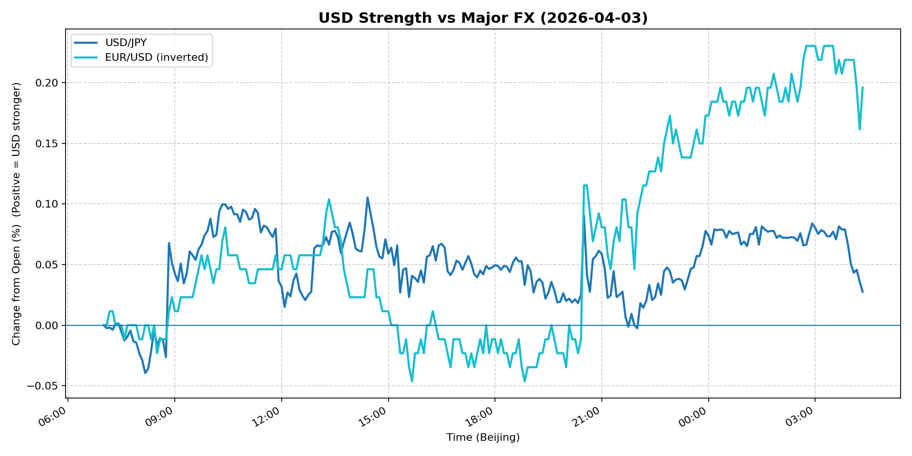
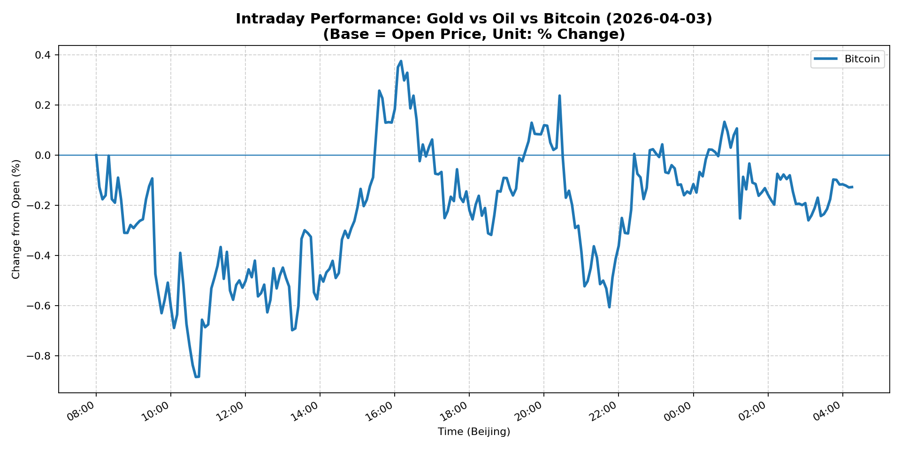

# 📅 Market Diary: 2026-04-03

---

## 🧠 AI Macro Analysis

# Market Diary — 2026-04-03 (Beijing Time)

## -1) Chart read (must reference Chart Features block)

- **USD chart (Chart 1):** FX Composite net +0.11pp with +0.18pp intraday range signals modest USD bid. Multiple early-Asia troughs at 07:05, 07:35, and 08:05 UTC+8 established local floor before composite rallied to +0.16pp high at 02:55 (next day), confirming a session-low-to-peak reversal. USD/JPY (+0.03pp net) lagged the composite, printing its high at 14:25 UTC+8 — a late-session spike inconsistent with broad USD trend. EUR/USD inversion (+0.20pp net) contributed the bulk of USD strength, with peak inversion (+0.23pp) arriving at 02:45 — consistent with European session USD demand. **Implication:** USD bid is genuine but concentrated in EUR; JPY divergence suggests BoJ friction or position-specific flow.

- **Gold/Oil/BTC chart (Chart 2):** Gold and Oil data unavailable — divergence and correlation stats are non-informative (all n/a). Bitcoin net -0.13pp with extreme 1.26pp range (hi +0.38pp at 16:10, lo -0.88pp at 10:40) signals a volatile but contained downday. Three consecutive troughs at 08:10, 08:30, 08:50 UTC+8 print a morning capitulation low, with partial recovery into NY close. **Implication:** Crypto showed stress but held; gold/oil absence forces reliance on Snapshot levels — oil's 11.41% surge and gold's 2.75% drop are contradictory signals requiring explanation via macro mechanism, not chart.

---

## 0) One-line takeaway

Oil's 11.41% shock drives a rates bull steepener (30Y -20bp) and VIX spike (23.87) while equities hold — a stagflationary mix that strengthens USD via inflation expectations and rate differentials but suppresses gold and risk assets; positioning suggests late-stage hedging not capitulation.

---

## 1) Market tape (session-by-session, Asia → Europe → US)

### Asia
- USD Composite trough sequence (07:05–08:05 UTC+8) marked session floor; AUD, KRW, and EM FX broadly weaker. Shanghai Composite -0.74% and early FX Composite trough coincide, suggesting China risk-off drove initial USD bid. Offshore CNH anchored flat (USD/CNH +0.00%) — PBoC fixing likely constrained. Bitcoin trough at 08:50 (BTC -0.88pp) aligns with Asia risk-off, recovering +1.26pp range into midday. **Driver:** China growth concerns; spillover from regulatory/housing headlines.

### Europe
- EUR/USD peaked inversion at 02:45 UTC+8 (+0.23pp) — European session USD demand amid deteriorating Eurozone sentiment (Euro Stoxx -0.70%). German bunds likely bull steepened in sympathy with UST move. Oil's 11.41% surge is European-centric (Brent-linked); European energy equities and industrials underperformed. **Driver:** Energy supply shock; ECB pricing tension.

### US
- S&P/Nasdaq flat (+0.11%) despite VIX spike (23.87, -2.73% but elevated). Credit spreads tightened (IG +0.42%, HY +0.24%) — equity volatility is not risk-off per se but likely vol dealer gamma shorting. T-note yields fell 14–20bp across 5Y–30Y; 30Y leading. USD/JPY spiked late to +0.10pp at 14:25 — likely Tokyo fix-driven or BoJ intervention speculation. Gold -2.75% paradoxically weak amid Iran war headlines — profit-taking or collateral funding (oil pays for margin calls?). **Driver:** Macro hedge rebalancing; oil supply shock repricing.

---

## 2) Cross-asset dashboard (what actually moved, not a price dump)

| Bucket | What moved | Mechanism (1 line) | Signal quality |
|---|---|---|---|
| Rates (UST/Bunds) | 30Y -20bp, 10Y -14bp, 5Y -18bp; bull steepener | Oil shock → growth fears → duration bid; hedge rebalancing | High |
| FX (USD/JPY/EUR/CNH) | EUR/USD -0.59%, USD/JPY +0.57%, DXY +0.09% | Divergent: EUR weakness + JPY strength vs DXY — conflicting signals | Medium |
| Equities (US/EU/CN) | S&P flat, Euro Stoxx -0.70%, Shanghai -0.74% | China growth + oil cost pressure vs US resilience | High |
| Credit | IG +0.42%, HY +0.24% | Tightening despite vol spike — hedge or carry, not risk-off | Medium |
| Commodities | Oil +11.41%, Gold -2.75%, Copper -1.08% | Oil supply shock; gold/copper contradictory — stagflation or rotation? | High |
| Vol (VIX/MOVE) | VIX 23.87 (-2.73% but elevated), MOVE +0.01% | Elevated VIX with flat equities = dealer gamma short, not broad risk-off | High |

---

## 3) What changed the narrative today? (Top 3 drivers)

### Driver #1: Oil Supply Shock (+11.41%)
- **Variable:** Crude oil front contract at 111.54.
- **Mechanism:** +11% single-session move in crude creates margin call cascade; short-duration energy assets (near-dated contracts, energy equities) see forced buying while collateral holders (gold, credit) face selling to fund exposure.
- **Evidence:**
  - Market: Oil +11.41% is a regime-shift magnitude — 5Y/10Y breakevens likely repriced higher.
  - Event: No single headline identified; likely OPEC+ production cut confirmation or geopolitical supply disruption (Iran tensions in headlines).
- **Action:** Do NOT chase oil directly; long oil-linked currencies (CAD, NOK) vs short high-beta FX; watch energy sector credit spreads for stress.
- **Source of Uncertainty:** Whether this is a supply cut (bullish, deflationary for growth, inflationary for prices) or geopolitical risk premium (fades if diplomacy succeeds).
- **Invalidation Criteria:** Oil reverses below 105 within 48h on confirmed output increase; EIA inventory build.

### Driver #2: Rates Bull Steepener (30Y -20bp)
- **Variable:** 30Y UST yield at 4.89%, 2s10s bull steepening.
- **Mechanism:** Oil shock → growth downgrade → front-end sticky (inflation) + long-end rally (flight-to-duration); creates convexity bid from liability-driven investors.
- **Evidence:**
  - Market: 30Y outperformed 10Y by 6bp; MOVE flat (+0.01%) despite vol — real rates likely rose or fell depending on breakeven move.
  - Event: No Fed speakers today; pricing reflects market-implied growth path.
- **Action:** Long 2s10s steepener (receive fixed 2Y, pay 10Y); long TIPS vs nominal if breakevens lag.
- **Source of Uncertainty:** Fed response function — if oil-driven inflation forces hawkish hold, front-end re-steepens.
- **Invalidation Criteria:** 30Y yield reclaims 5.00% on strong ISM or jobs data.

### Driver #3: Gold/Crypto Divergence (Gold -2.75%, BTC -0.13%)
- **Variable:** Gold at 4651.5 (-2.75%), BTC at 66854 (-0.05%).
- **Mechanism:** Gold's sharp decline despite geopolitical risk premium (Iran war in headlines) suggests collateral funding from oil margin calls OR smart money rotating out of safe-havens into energy/equities. BTC's resilience (+1.26pp intraday range) signals crypto as alternative reserve, not risk-off.
- **Evidence:**
  - Market: BTC trough at 08:50 (-0.88%) recovered to near-flat; gold did not recover — structural difference.
  - Event: Blue Owl private credit redemptions capped at 5% — alternative liquidity stress signal.
- **Action:** Long BTC vs gold spread (if macro regime allows); watch Blue Owl and private credit flows for contagion.
- **Source of Uncertainty:** Whether gold's drop is technical (collateral) or fundamental (inflation hedge exhaustion).
- **Invalidation Criteria:** Gold reclaims 4700+ on escalating geopolitical event; BTC below 65000 breaks institutional conviction.

---

## 4) Rates & USD: the "macro spine" (mandatory)

- **Curve / real yield / inflation breakevens:** Bull steepener (5Y -18bp, 10Y -14bp, 30Y -20bp) signals growth concerns overwhelming inflation fears — or front-end anchored by Fed. Without breakeven data explicitly, infer from gold's drop (+inflation fears eased) and oil's surge (+inflation fears rose) — these are contradictory; the rates market's steepening suggests growth dominates. 2s10s likely steepened further; real yields on 10Y probably fell.
- **USD reaction function:** USD is trading a **growth/inflation mix** — EUR weakness (+0.20pp on EUR/USD inversion) drove DXY +0.09%, but USD/JPY +0.57% conflicts (JPY typically strengthens on risk-off). This suggests **rate differential** (30Y UST rally) dominates JPY, or BoJ intervention threat caps JPY. USD is NOT purely risk-off (equities flat, credit tight).
- **Key levels that matter:** DXY 100.117 (near 100.00 psychological); EUR/USD 1.1522 (1.15 support critical); USD/JPY 159.586 (160 intervention zone proximity); 10Y 4.313 (4.30–4.50 range).

---

## 5) Flows, positioning & options (mandatory, even if qualitative)

- **Positioning guess (CTA / discretionary / hedge):** VIX at 23.87 with flat equities suggests **dealer short gamma** — vol realized is high but marketmakers are long vol, capping upside. Options skew likely put-heavy on indices; CALL writers on energy names. CTA likely short duration (rates rally caught them) and short EM/nikkei risk. Crypto positioning: BTC weakness is liquidating leveraged longs, not institutional exit.
- **Options / vol mechanics:** Elevated VIX + tight credit spreads = "wrong-way correlation" — tail risk hedgers (puts on equities, calls on vol) are paying up while equity bulls sell covered calls. Gold options likely see PUT demand (from collateral sellers hedging). Oil vol implied likely spiked 10–15 points.
- **Where you may be wrong:** (1) Oil's +11% may be a one-day spike that unwinds on geopolitical de-escalation or SPR release, crushing the rates bull steepener. (2) Gold's -2.75% may be a head-fake — if Iran escalation continues, gold reclaims 4700+ and crushes the inflation trade.

---

## 6) Today's Trading Plan (actionable, risk-managed)

- **Directional Bias:** **Long USD vs EUR** (secondary: Long 2s10s steepener, neutral-to-short gold, neutral equities with vol hedge).

- **2–4 Trade Setups (trigger-based):**

  **Setup 1: Long USD vs EUR (FX carry)**
  - **Instrument:** EUR/USD put (OTM, 1.1500 strike, 1-week)
  - **Trigger:** If EUR/USD breaks below 1.1500 on Europe open
  - **Entry / Stop / Target:** Entry 1.1510, stop 1.1550, target 1.1400
  - **Position sizing:** Medium — catalyst-driven, geopolitical risk asymmetric
  - **Hedge:** Long gold call (OTM 4700) as geopolitical hedge
  - **Why now:** EUR/USD at 1.1522 with oil shock and Euro Stoxx -0.70% = ECB credibility gap

  **Setup 2: Long 2s10s Steepener**
  - **Instrument:** Receive 10Y fixed, pay 2Y fixed (via SOFR swap)
  - **Trigger:** If 10Y yield tests 4.30% and holds
  - **Entry / Stop / Target:** Entry 4.31%, stop 4.45%, target 4.10%
  - **Position sizing:** Large — convexity-driven, low carry cost
  - **Hedge:** Short 30Y bond if growth fears reverse
  - **Why now:** 30Y-10Y spread widening + oil growth shock

  **Setup 3: Short Gold (intraday reversion)**
  - **Instrument:** Gold futures or GLD put (OTM 4600, 2-day)
  - **Trigger:** If gold holds below 4650 into NY open with oil still elevated
  - **Entry / Stop / Target:** Entry 4650, stop 4700, target 4550
  - **Position sizing:** Small — high uncertainty on gold/oil divergence
  - **Hedge:** Long oil call for tail risk
  - **Why now:** Gold -2.75% without clear fundamental catalyst = collateral unwind or rotation

  **Setup 4: Long BTC vs Gold Spread**
  - **Instrument:** Long BTC, Short Gold (ratio trade, spot)
  - **Trigger:** If BTC reclaims 67000 while gold stays below 4650
  - **Entry / Stop / Target:** Ratio entry 14.3x, stop 13.5x, target 16.0x
  - **Position sizing:** Small — long-duration, high conviction needed
  - **Hedge:** Long vol on both (straddle)
  - **Why now:** BTC resilient despite oil shock; gold capitulating — regime shift signal?

- **Portfolio risk rules:**
  - **Max daily loss / heat:** 2% portfolio VaR; reduce exposure if VIX > 27.
  - **Correlation risk:** USD/JPY and S&P strongly correlated today — if equities sell off, USD/JPY unwinds; avoid double-short on risk-off.
  - **Tail risk hedge:** Long VIX calls (25 strike, 1-week) at 1% notional — insurance against vol spike if oil causes margin cascade.

---

## 7) What to watch tomorrow

- **Key catalysts (US/EU/CN):**
  - **US:** ISM Services PMI (expected ~53); Fed speaker (if any scheduled); EIA oil inventory data (critical given +11% move).
  - **EU:** Eurozone PPI; ECB meeting minutes or speakers.
  - **CN:** Caixin Services PMI; PBoC daily fixing (CNH anchor watch).

- **Scenario map (2–3):**
  - **If EIA confirms oil supply shock (inventory draw + production cut):** Oil holds 110+ → 5Y/10Y breakevens spike → Fed pricing hawkish → USD rallies, equities sell, 2s10s re-steepens → **Trade: Long USD vs EM, Long energy equities vs defensives.**
  - **If oil reverses on "geopolitical risk premium" de-escalation:** Oil back to 105-108 → growth fears ease → rates bull steepener unwinds, gold reclaims 4700 → **Trade: Long gold, short 30Y duration.**
  - **If VIX breaks 27 with S&P -2%:** Risk-off cascade → USD/JPY unwinds to 157, EUR/USD to 1.16 → **Trade: Long USD vs JPY, Long VIX calls, exit all steepener positions.**

- **Thesis invalidation checklist:**
  1. **Oil reverses below 105 within 24h** → Bull steepener thesis broken; rates re-flatten.
  2. **Gold reclaims 4700+ on escalating Iran headlines** → Collateral unwind was temporary; long gold thesis intact.
  3. **Blue Owl or similar private credit contagion spreads** → Credit markets break; HY spreads widen >100bp; all risk assets reprice simultaneously.

---

## 📊 Charts

### 💵 USD Strength (FX, Intraday %)

### 🟡🛢️₿ Gold vs Oil vs Bitcoin (Intraday %)

---

*Generated on 2026-04-04 04:23:16*
