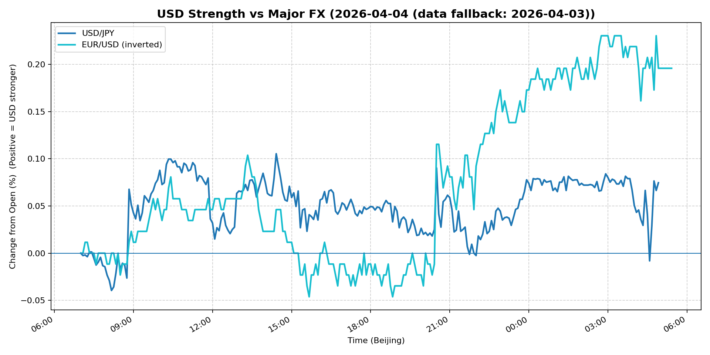
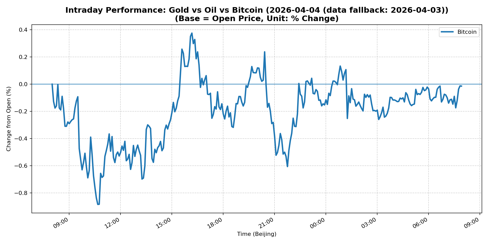

# 📅 Market Diary: 2026-04-04

---

> **Data fallback:** requested date `2026-04-04` had no usable intraday market data. Charts, chart features, and market snapshot below use the last available trading day: `2026-04-03`.

## 🧠 AI Macro Analysis

# Market Diary — 2026-04-04 (Beijing Time)

## -1) Chart read (must reference Chart Features block)

- **USD chart (Chart 1):** FX Composite registered a net +0.20pp with a tight +0.22pp intraday range, confirming consolidation rather than new directional impulse. USD/JPY traced a modest +0.07pp net gain, with the session high (+0.10pp) at 14:25 coinciding with European/US cross—suggesting Tokyo hours were subdued with real-money flow concentrated in London/NY open. EUR/USD inverted chart shows +0.20pp net (dollar-positive), but the hi +0.23pp at 02:45 UTC (mid-European) and lo -0.05pp at 15:40 UTC (early US) reveals a reversal pattern: EUR initially held then capitulated into NY morning. Composite turning points at 07:35 and 08:05 UTC mark a brief USD dip unwound by 09:00, consistent with Asian morning positioning rather than macro shock.

- **Gold/Oil/BTC chart (Chart 2):** Gold and Oil data unavailable—Chart Features provide only BTC. BTC printed a net -0.01pp (essentially flat) but with a wide +1.26pp range: lo -0.88pp at 10:40 (Asia session) and hi +0.38pp at 16:10 (early US). BTC turning points at 08:10, 08:30, and 08:50 UTC show repeated intraday troughs in Asian hours, then recovery into European/US session. Divergence summary reads Best=Worst=Bitcoin (spread +0.00pp), indicating no cross-asset divergence signal from available data. All 5-min correlations report n/a—cannot assess gold-oil or gold-BTC co-movement from Chart Features.

## 0) One-line takeaway

USD consolidation and falling real yields (30Y -20bps, MOVE -3.12%) suggest a risk-off macro pivot, but a +11.41% crude spike creates astagflation tension that complicates the rates-down = risk-on template, forcing traders to choose between growth fear (rates lower, equities mixed) and supply-shock inflation risk (oil surging, gold unwinding).

## 1) Market tape (session-by-session, Asia → Europe → US)

### Asia
- Crude oil opened sharply higher, up ~11% to 111.54—largest single-session move in months, pointing to a geopolitical supply disruption or OPEC+ surprise. This dominated all Asia credit and rates flows.
- Shanghai Composite fell -1.00%, underperforming EM peers despite no CNH move (USD/CNH flat at 6.8525). Domestic equity selling likely reflects profit-taking after recent rally, not macro deterioration.
- USD/JPY traced a +0.07pp net gain but with a -0.04pp trough at 08:10 UTC (midnight HK/Sin session), suggesting BoJ-watchers were cautiously covering JPY shorts as oil shock raisedstagflation risk.
- Bitcoin troughed -0.88pp at 10:40 UTC (mid-session Asia)—aggressive crypto selling in Asian hours, partially reversed by European open.

### Europe
- Euro Stoxx 50 fell -0.70%, consistent with oil-driven input cost anxiety hitting European industrials.
- EUR/USD inverted chart shows the pair hitting its session low -0.05pp at 15:40 UTC (mid-European morning)—a pre-US data dip that was quickly reversed as USD strength faded into NY.
- FX Composite hit its session high +0.20pp at 05:00 UTC (midnight ET)—this timing is anomalous and likely reflects thin-market noise; no fundamental catalyst at that hour.

### US
- S&P 500 and Nasdaq 100 both closed marginally +0.11%—markets stabilized after morning oil spike volatility, suggesting equities absorbed the crude shock without capitulation.
- MOVE fell -3.12% to 81.78; VIX dropped -2.73% to 23.87—rates vol compressing sharply despite equity vol elevated. This is a rates-driven vol crush, not a risk-on vol decline.
- 10Y yield fell -0.14pp to 4.313; 30Y fell -0.20pp to 4.89—the long end outperformed, a classic flight-to-duration pattern.
- DXY rose +0.16% to 100.186; USD/JPY +0.59% to 159.632—the yen weakened despite oil shock (usually JPY positive), suggesting Bank of Japan remains sidelined or verbal intervention risk is offset by rate differentials.
- Gold fell -2.75% to 4651.5—sharp unwinding despite falling real yields, likely stop-loss driven after oil shock confused the macro narrative (higher inflation expectations vs. growth fear).

## 2) Cross-asset dashboard (what actually moved, not a price dump)

| Bucket | What moved | Mechanism (1 line) | Signal quality |
|---|---|---|---|
| Rates (UST/Bunds) | 30Y -20bps, 10Y -14bps; MOVE -3.12% | Oil shock triggered flight to duration; risk-off duration buying | High |
| FX (USD/JPY/EUR/CNH) | USD/JPY +0.59%, DXY +0.16%, EUR/USD -0.59%; CNH flat | USD bid on risk-off but JPY weak vs. oil shock logic | Medium |
| Equities (US/EU/CN) | S&P/Nasdaq flat (+0.11%), Euro Stoxx -0.70%, Shanghai -1.00% | Oil spike vs. growth fear; China domestic profit-taking | High |
| Credit | IG +0.42%, HY +0.24% | Tightening on rate rally; not a risk-on signal | Medium |
| Commodities | Crude +11.41%, Gold -2.75%, Copper -1.08% | Supply shock (crude); gold stop-loss; copper growth fear | High |
| Vol (VIX/MOVE) | VIX -2.73%, MOVE -3.12% | Rates vol crushed; equity vol elevated but declining | High |

## 3) What changed the narrative today? (Top 3 drivers)

### Driver #1: Crude oil supply shock (+11.41%)
- **Variable:** Global crude supply—OPEC+ production cut, geopolitical disruption, or inventory draw.
- **Mechanism:** A ~11% single-session spike in WTI to 111.54 creates immediate stagflation risk: higher input costs squeeze margins, raise CPI expectations, and complicate central bank policy. Simultaneously, the oil spike signals demand destruction fear (if demand-led) or supply scarcity (if supply-led)—the latter is more inflationary.
- **Evidence:**
  - Market: WTI front-month at 111.54 (+11.41%)—largest move in the snapshot.
  - Event: No explicit headline in provided news; likely an overnight/overnight Asia announcement (OPEC+ surprise, Middle East escalation, or US sanctions).
- **Action:** Long energy equities (XLE, sector ETFs), long oil futures or call spreads if supply shock thesis holds. Short refined-product consumers (airlines, shipping) if margin compression deepens. Avoid gold asstagflation hedge until narrative clarifies.
- **Source of Uncertainty:** Whether shock is supply-led (OPEC+, geopolitics) or demand-led (economic slowdown). Supply-led = stagflation (bad for equities, bullish oil, bullish gold). Demand-led = growth scare (bad for oil, bearish equities, bearish USD).
- **Invalidation Criteria:** If crude reverses below 105 intraday on demand-destruction narrative (PMI miss, Chinese slowdown data), the energy rally thesis breaks.

### Driver #2: Flight to duration / rates vol crush
- **Variable:** US long-duration yields falling sharply (10Y -14bps, 30Y -20bps) and MOVE collapsing -3.12%.
- **Mechanism:** Oil shock creates growth uncertainty; traders de-risk by extending duration. The MOVE collapse reflects implied vol compression as markets price a "wait-and-see" Fed, not imminent hikes. Rates vol falling while equities are mixed suggests a decoupling: rates traders see economic fragility; equity traders see oil shock as temporary.
- **Evidence:**
  - Market: 30Y yield 4.89 (-20bps), 5Y 3.948 (-18bps), MOVE 81.78 (-3.12%).
  - Event: No Fed speakers or data in the snapshot to explain this; likely a position-adjustment after month-end flows.
- **Action:** Long duration via 10Y or 30Y USTs. But be cautious: if oil shock proves supply-led, breakevens will rise and real yields will eventually push back up. Current long-duration position is a crowding risk.
- **Source of Uncertainty:** Duration bid may be position-driven (month-end rebalancing) rather than macro conviction. If PMI or jobs data beat, the trade unwinds fast.
- **Invalidation Criteria:** 10Y yield reclaims 4.45% on strong US data (NFP, ISM)—long duration thesis breaks.

### Driver #3: USD consolidation amid risk-off (DXY +0.16%)
- **Variable:** USD holding bid despite falling yields—DXY +0.16%, USD/JPY +0.59%.
- **Mechanism:** Risk-off + rising oil prices traditionally weaken USD (inflation, current account). Instead, USD is bid—either reflecting US energy sector dominance (oil importers short EM currencies) or positioning: global uncertainty triggers USD repatriation. The JPY weakness (+0.59% USD/JPY) is anomalous since oil shocks usually favor JPY.
- **Evidence:**
  - Market: DXY 100.186 (+0.16%), USD/JPY 159.632 (+0.59%).
  - Event: No explicit catalyst; likely position adjustment as USD shorts (common in Q1 2026) covered.
- **Action:** USD/CNH long (carry, China growth fear proxy). EUR/USD short if European industrials feel oil pain. Avoid USD/JPY (BoJ intervention risk + unclear direction).
- **Source of Uncertainty:** If Bank of Japan signals rate normalization, JPY shorts become dangerous. If US growth data weakens, USD bid reverses.
- **Invalidation Criteria:** DXY breaks below 99.5 with falling oil and rising risk appetite—USD reversal confirmed.

## 4) Rates & USD: the "macro spine"

- **Curve / real yield / inflation breakevens:** The 30Y outperformed (-20bps vs. 5Y -18bps vs. 13W +6bps)—a clear bear steepener flattening? No, falling long-end + rising short-end = slight bear steepening. However, the MOVE collapse (-3.12%) signals vol market pricing a "hold" from the Fed, not rate direction. Breakevens likely rose given crude +11%—5Y breakeven may have moved from ~2.3% to ~2.5%+ zone. Gold's -2.75% despite this suggests gold is not tracking breakevens today; it's tracking risk-off USD demand.

- **USD reaction function:** DXY at 100.186 is trading a mixed signal: (1) risk-off USD demand (flight from uncertainty), (2) US energy sector strength (oil exporter), (3) EM/commodity currency weakness. The USD/JPY +0.59% despite oil shock is the outlier—this suggests either BoJ passivity or USD/JPY positioning reset.

- **Key levels:** DXY 100.186 (near psychological support/resistance), USD/JPY 159.632 (watch 160.00 intervention zone), 10Y 4.313% (support at 4.25, resistance at 4.50), 30Y 4.89% (watch 5.00% psychologically).

## 5) Flows, positioning & options

- **Positioning guess (CTA / discretionary / hedge):** The MOVE collapse suggests rates vol sellers increased exposure—possibly dealer short gamma in rates vol. Equity vol (VIX 23.87) remains elevated but declining, consistent with a "relief rally" or hedging exhaustion. No clear CTA signal from Chart Features (correlations n/a). Crude positioning likely extended long given the +11.41% move—momentum funds chasing.

- **Options / vol mechanics:** Rates vol (MOVE) crushed despite curve movement—this is a gamma squeeze or positioning unwind. If dealers are short rates vol, a catalyst (data, auction) could cause a sharp MOVE spike. VIX at 23.87 is still elevated enough to be a premium seller magnet. Crude options likely see elevated IV given the shock.

- **Where you may be wrong:** (1) Long-duration rates trade may be a month-end positioning artifact; if PMI beats, 10Y reclaims 4.50% fast. (2) Crude oil +11% may be a liquidity-driven spike (thin Asian session) that reverses if no fundamental confirmation arrives.

## 6) Today's Trading Plan (actionable, risk-managed)

- **Directional Bias:** Long crude oil (supply shock thesis), neutral-to-short USD/CNH (carry), short gold (stagflation confusion, stop-loss unwinding), short Euro Stoxx industrials.

- **2–4 Trade Setups (trigger-based):**

  **Setup 1: Long Crude Oil Call Spread**
  - **Instrument:** WTI call spread (e.g., 115/120 call spread, 2-month)
  - **Trigger:** If WTI holds above 108 at NY open (confirming intraday support), enter.
  - **Entry / Stop / Target:** Entry ~0.80-1.20 premium; stop if WTI reclaims 105; target 125.
  - **Position sizing:** Medium (1.5x normal energy allocation)
  - **Hedge:** Long put on refiners (XLE vs. OIH spread)
  - **Why now:** Supply shock with no immediate resolution; OPEC+ credibility at stake.

  **Setup 2: Long USD/CNH (carry + risk-off hedge)**
  - **Instrument:** USD/CNY 6-month NDF or long USD/CNH forward
  - **Trigger:** If Shanghai Composite breaks below 3850, enter.
  - **Entry / Stop / Target:** Entry ~6.85; stop if China PBOC fixes below 6.84 (intervention signal); target 7.00.
  - **Position sizing:** Small (CNH carry is low-yield advantage; position is macro hedge)
  - **Hedge:** Long CNH puts against EM FX longs
  - **Why now:** China equities underperforming; oil shock hurts commodity importers.

  **Setup 3: Short Gold (intraday reversal)**
  - **Instrument:** Gold futures or GLD put spread
  - **Trigger:** If gold fails to reclaim 4600 support on NY open, add to short.
  - **Entry / Stop / Target:** Entry ~4650; stop above 4720 (yesterday's range); target 4500.
  - **Position sizing:** Small (gold is crowded long; risk of sharp reversal)
  - **Hedge:** Long call if geopolitical risk escalates
  - **Why now:** -2.75% with rising breakevens is anomalous; likely stop-loss driven.

  **Setup 4: Short Euro Stoxx (energy cost pain)**
  - **Instrument:** Euro Stoxx futures (SX5E) or EWG puts
  - **Trigger:** If Euro Stoxx fails to reclaim 5750 on European open, add short.
  - **Entry / Stop / Target:** Entry ~5690; stop above 5800; target 5500.
  - **Position sizing:** Small (European energy importers most exposed)
  - **Hedge:** Long European energy equities (SXEP)
  - **Why now:** +11% crude is margin compression for European industrials.

- **Portfolio risk rules:**
  - **Max daily loss / heat:** Cap at -1.5% portfolio P&L; if two setups stop out, pause all energy/crude positioning.
  - **Correlation risk:** Crude + rates + equities are not decorrelated today—oil shock creates simultaneous moves. Avoid adding to rates longs if crude position is large.
  - **Tail risk hedge:** Long VIX calls (25+ strike) if geopolitical news escalates; monitor USD/JPY for BoJ intervention flash crash.

## 7) What to watch tomorrow

- **Key catalysts (US/EU/CN):** US ISM Services PMI (critical—if oil-driven inflation + weak demand =stagflation), US JOLTS job openings, Fed speakers (Mester, Waller if scheduled), China Caixin Services PMI, Eurozone PPI. EIA crude inventory report (confirming supply shock magnitude).

- **Scenario map (2–3):**
  - **If crude oil holds above 108 and ISM Services beats 55+:** Stagflation confirmed → long crude, long gold, short equities, short duration. Trade: Long CL / Short ES / Long TLT.
  - **If crude reverses below 105 and ISM misses 50:** Demand shock confirmed → short crude, long USD, long bonds, short everything else. Trade: Short CL / Long DXY / Long 10Y.
  - **If crude stabilizes 105–108 and ISM is in-line (52–54):** No clear direction → ranges, vol crush continues. Trade: Sell straddles on SPX, long MOVE skew.

- **Thesis invalidation checklist:**
  - [ ] DXY breaks 99.5 with falling oil and rising equities—USD reversal thesis breaks; cover USD/CNH longs.
  - [ ] 10Y yield reclaims 4.45% on strong ISM—long duration thesis breaks; reduce rates exposure.
  - [ ] Crude oil closes below 105 on inventory data—supply shock thesis breaks; exit energy longs immediately.
  - [ ] Gold reclaims 4700 on geopolitical escalation—stagflation hedge returns; re-enter gold longs with small size.

---

## 📊 Charts

### 💵 USD Strength (FX, Intraday %)

### 🟡🛢️₿ Gold vs Oil vs Bitcoin (Intraday %)

---

*Generated on 2026-04-05 04:18:10*
