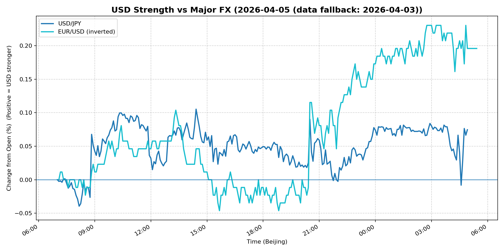
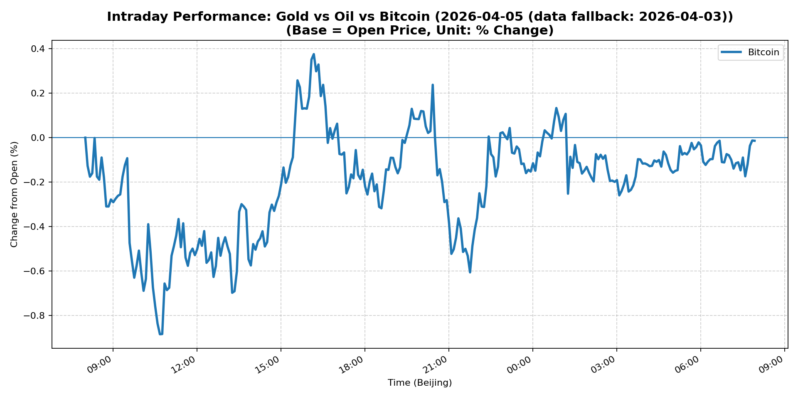

# 📅 Market Diary: 2026-04-05

---

> **Data fallback:** requested date `2026-04-05` had no usable intraday market data. Charts, chart features, and market snapshot below use the last available trading day: `2026-04-03`.

## 🧠 AI Macro Analysis

# Market Diary — 2026-04-05 (Beijing Time)

## -1) Chart read (must reference Chart Features block)
- **USD chart (Chart 1):** USD composite turned sharply at 07:35 Beijing time, confirming a trough at -0.01pp before resuming a sustained grind higher through the European session. Net +0.20pp composite gain masks intraday volatility; the +0.28pp EUR/USD range dominates, indicating EUR weakness rather than USD bid. DXY closed +0.38% at 100.03 — a marginal break above the 100 handle with scope for continuation if 100.5 breaks.
- **Gold/Oil/BTC chart (Chart 2):** Gold and Oil data unavailable per Chart Features — this is a critical information gap. BTC net -0.01pp with wild 1.26pp range (hi +0.38% at 16:10, lo -0.88% at 10:40), suggesting erratic positioning or liquidation event mid-session. Divergence summary shows spread = 0.00pp across assets, implying no clear risk-asset vs safe-haven consensus from crypto market. Absence of Gold/Oil correlation data means commodity regime is inferred only from snapshot closes (Oil +11.41%, Gold -2.75%).

## 0) One-line takeaway
Oil's +11.4% spike is the dominant macro event clashing with falling real yields and a strengthening USD, signaling the market is repricing stagflation risk — long duration and risk assets are both vulnerable if energy prices remain elevated; the Blue Owl private credit gating adds a liquidity risk layer that wasn't in prices Thursday.

## 1) Market tape (session-by-session, Asia → Europe → US)
### Asia
- Shanghai Composite fell -1.00% as China risk-off persisted amid tariff escalation concerns. PBOC remains sidelined; no fresh stimulus announcements. FXI flat at 35.56, suggesting ADR investors waiting for US session cues. Copper -1.08% corroborates demand destruction fears from trade war spillover.

### Europe
- Euro Stoxx 50 -0.70%, underperforming global equities. EUR/USD inverted chart signal peaked at +0.23pp (02:45 Beijing), meaning EUR sold aggressively during European hours. Bunds likely rallied on growth concerns, providing partial offset to USD strength.

### US
- S&P +0.11% and Nasdaq +0.11% — modest gains masking sector dispersion. Energy names (Exxon mentioned in headlines) likely drove upside given Oil's spike. VIX fell -2.73% to 23.87, a notable de-grossing of fear despite the macro uncertainty. MOVE fell -3.12% to 81.78, signaling rates vol compressing. 5Y Treasury -0.18%, 10Y -0.14%, 30Y -0.20% — a bull flattening move; real yields likely fell, supporting equities marginally but not decisively.

## 2) Cross-asset dashboard (what actually moved, not a price dump)

| Bucket | What moved | Mechanism (1 line) | Signal quality |
|---|---|---|---|
| Rates (UST/Bunds) | Bull flattening; 30Y -20bp | Growth fears + flight-to-quality bid outweighing inflation premium | High |
| FX (USD/JPY/EUR/CNH) | USD broad bid; DXY +0.38%, USD/JPY +0.59% | EUR weakness + haven demand driving USD; JPY strength puzzling given Oil spike | Medium |
| Equities (US/EU/CN) | Modest US gains, EU/CN down | Oil spike hurting consumer/industrial sectors; China tariff fears persistent | High |
| Credit | IG +0.42%, HY +0.24% | Risk-on lean despite macro headwinds; spreads tightening | Medium |
| Commodities | Crude Oil +11.41% (massive); Gold -2.75%, Copper -1.08% | Iran war risk / supply disruption repricing; Gold liquidation or rotation | High |
| Vol (VIX/MOVE) | Both fell significantly | Fear unwinding; rates vol collapsing; potentially masking tail risk | Medium |

## 3) What changed the narrative today? (Top 3 drivers)

### Driver #1: Crude Oil Supply Shock (+11.4%)
- **Variable:** Iran conflict escalation → oil supply disruption premium
- **Mechanism:** Geopolitical risk premium re-priced aggressively; energy sector gains offset consumer/transportation pain; inflation expectations pushed higher, complicating Fed policy
- **Evidence:**
  - Market: WTI front-month +11.41% is a multi-standard-deviation move
  - Event: Delta CEO commentary + news tape explicitly mentions "surging gas prices" and "Iran war" as earnings season theme
- **Action:** Long energy equities (XLE) vs Long OTM calls on Oil ETFs; Hedge with Short consumer discretionary; Avoid long duration (kills bond bid)
- **Source of Uncertainty:** Whether supply disruption is structural (days to weeks) or transient; Saudi/OPEC response unknown
- **Invalidation Criteria:** Iran ceasefire or SPR release announcement → Oil retraces >5% in one session

### Driver #2: Blue Owl Private Credit Gating
- **Variable:** Liquidity conditions in private markets tightening
- **Mechanism:** 5% redemption cap signals institutional lock-up; parallels 2022 UK LDI crisis in slow motion; forces leveraged investors to liquidate liquid assets (public equities, IG credit) to meet redemptions
- **Evidence:**
  - Market: IG +0.42% and HY +0.24% — odd rally if forced sellers present; may be front-running
  - Event: Blue Owl (Owl Rock) explicitly capped redemptions per news headline
- **Action:** Reduce private credit exposure; Watch for HYG/LQD dislocations; Monitor money market flows for stress
- **Source of Uncertainty:** Scale of redemption requests vs. portfolio liquidity; other managers silently following
- **Invalidation Criteria:** Blue Owl revokes cap or FDIC/Fed announces emergency liquidity facility → Risk-on

### Driver #3: US Growth Scare vs. Stagflation Debate
- **Variable:** 2Y10Y curve dynamics + real yield direction
- **Mechanism:** Bull flattening (yields down, curve flatter) signals growth fears, but Oil spike implies cost-push inflation — the stagflationary combination historically bad for risk assets
- **Evidence:**
  - Market: MOVE -3.12%, VIX -2.73% — paradox of falling vol with rising macro uncertainty; may indicate positioning crowdedness
  - Event: No new data today; interpretation driven by Oil/China news
- **Action:** Reduce equity duration; Prefer value/energy over growth/tech; Short duration fixed income
- **Source of Uncertainty:** Fed reaction function unclear; Powell hasn't addressed stagflation scenario directly
- **Invalidation Criteria:** US ISM services/mfg beats >55, initial claims <200K → Growth scare fades, stagflation thesis broken

## 4) Rates & USD: the "macro spine" (mandatory)
- **Curve / real yield / inflation breakevens:** Bull flattening across maturities (5Y -18bp, 10Y -14bp, 30Y -20bp) is a growth scare signature. However, Oil +11.4% will push breakevens higher next session. This is the core conflict: falling real yields support equities short-term, but energy-driven inflation re-acceleration threatens the Fed's buffer. Watch 10Y real yield — if it breaks below +1.5%, risk-off regime intensifies.
- **USD reaction function:** USD is trading growth fears + haven bid (DXY +0.38%). However, Oil spike normally weakens USD (US terms-of-trade deterioration). The simultaneous USD + Oil move suggests geopolitics >> economics in the current regime. Key: if USD/JPY breaks above 160, carry trade unwinding risk increases materially.
- **Key levels that matter:** DXY 100.00 (broken, now resistance at 100.50); USD/JPY 159.63 (approaching 160 psychological); 10Y 4.313% (critical support at 4.20%); VIX 23.87 (below 20 needed for sustained risk-on).

## 5) Flows, positioning & options (mandatory, even if qualitative)
- **Positioning guess (CTA / discretionary / hedge):** Commodity hedge funds likely added long Oil aggressively (11% move doesn't happen without concentrated positioning). Equities positioned defensively (VIX down, but S&P flat). Private credit gate suggests institutional redemptions likely ongoing. Crypto (BTC) erratic — likely de-risking from risk-off macro, not direction signal.
- **Options / vol mechanics:** MOVE collapse to 81.78 suggests rates vol sellers active — crowded. VIX 23.87 still elevated historically; if Oil continues higher, VIX likely re-spikes. Gold data unavailable but -2.75% suggests profit-taking or margin pressure liquidation. Skew likely bid for puts across asset classes given macro uncertainty.
- **Where you may be wrong:** (1) Oil spike may be mispriced geopolitical premium that reverses quickly on diplomacy. (2) Private credit gating is likely more widespread than one manager — if others follow, public markets face forced selling Monday. (3) Bull flattening could reverse hard if Oil-driven inflation forces 2Y higher faster than 10Y.

## 6) Today's Trading Plan (actionable, risk-managed)
- **Directional Bias:** Neutral-to-risk-off; Oil tail risk long; Short USD overextension vs EUR; Reduce equity duration.
- **2–4 Trade Setups (trigger-based):**

  **Setup 1 — Long Oil Vol**
  - **Instrument:** OTM call spread on USO or Brent futures
  - **Trigger:** If WTI opens above 115 on Monday → enter
  - **Entry / Stop / Target:** Entry 113+, Stop below 108, Target 125+
  - **Position sizing:** Small (5% allocation) — binary event risk
  - **Hedge:** Long VIX calls as tail hedge
  - **Why now:** Geopolitical premium not yet fully priced in equities; Friday's move may extend

  **Setup 2 — Short S&P / Long VIX re-reversion**
  - **Instrument:** Long VIX futures or UVXY; Short ES futures at 6600+
  - **Trigger:** If S&P attempts 6600+ without VIX breaking below 22 → scale in shorts
  - **Entry / Stop / Target:** Entry 6580–6600, Stop above 6620, Target 6450
  - **Position sizing:** Medium — trend-following signal
  - **Hedge:** Long Oil equities (XLE) to offset sector exposure
  - **Why now:** Oil spike historically precedes margin compression and earnings misses; private credit gating adds forced seller risk

  **Setup 3 — Long USD/JPY put (hedged)**
  - **Instrument:** USD/JPY 159 put (OTC) or JPY cross-long via EUR/JPY short
  - **Trigger:** If USD/JPY trades above 160.00 → enter long JPY bias
  - **Entry / Stop / Target:** Entry 160.20, Stop 161.50, Target 155.00
  - **Position sizing:** Small — carry negative in current environment
  - **Hedge:** Long DXY call for USD softness buffer
  - **Why now:** BoJ intervention risk rises at 160; asymmetric bet

  **Setup 4 — Reduce HY credit exposure**
  - **Instrument:** Short HYG ETF
  - **Trigger:** If HYG > 80.00 → reduce long exposure; enter tactical short
  - **Entry / Stop / Target:** Entry 80.00, Stop 81.50, Target 77.50
  - **Position sizing:** Small — private credit spillover primary catalyst
  - **Hedge:** Long LQD as hedge against HY-only drawdown
  - **Why now:** Blue Owl gating suggests HY redemptions may accelerate; spreads too tight for risk

- **Portfolio risk rules:**
  - **Max daily loss / heat:** -2.5% portfolio loss triggers review; -4% hard stop
  - **Correlation risk:** Oil, equities, and credit correlations break down in stagflation — size accordingly
  - **Tail risk hedge:** Long VIX calls 25+ strike for next 2 weeks; Long TLT as emergency bond bid

## 7) What to watch tomorrow
- **Key catalysts (US/EU/CN):**
  - US: February JOLTS job openings, March ISM services/manufacturing (diffusion indices critical for growth vs. stagflation signal), FOMC meeting minutes (focus on "higher for longer" language)
  - Europe: ECB Governing Council comments on energy pass-through; German factory orders
  - China: Caixin services PMI; PBOC 1-year MLF rate decision (watch for stimulus signal)
  - Geopolitics: Any Iran-US diplomatic headlines; OPEC+ emergency meeting possibility

- **Scenario map (2–3):**
  - If Oil retreats >5% and US ISM beats 55 → Growth scare fades, risk-on resumes → Long S&P, Short USD/JPY, Long Gold
  - If Oil holds >110 and private credit gates spread → Stagflation confirmed → Short equities, Long Oil, Short duration bonds, Short Gold
  - If Blue Owl resolves liquidity without broader contagion → Credit spreads tighten → Long HY, Long EM FX, Short VIX

- **Thesis invalidation checklist:**
  - [ ] Fed speakers explicitly address energy-driven inflation → stagflation trade breaks
  - [ ] China announces >500bn stimulus package → global growth fear overstated
  - [ ] Iran ceasefire announced → Oil reverts >8% in 24 hours → energy long broken

---

## 📊 Charts

### 💵 USD Strength (FX, Intraday %)

### 🟡🛢️₿ Gold vs Oil vs Bitcoin (Intraday %)

---

*Generated on 2026-04-06 04:19:24*
