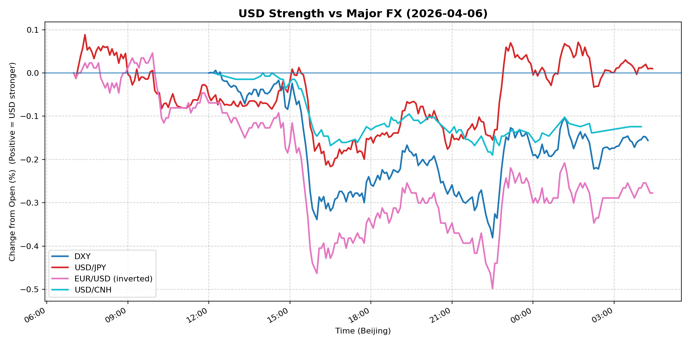
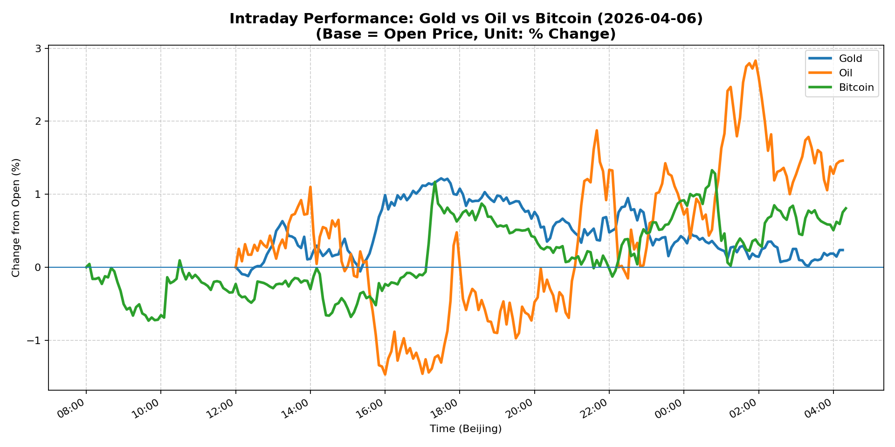
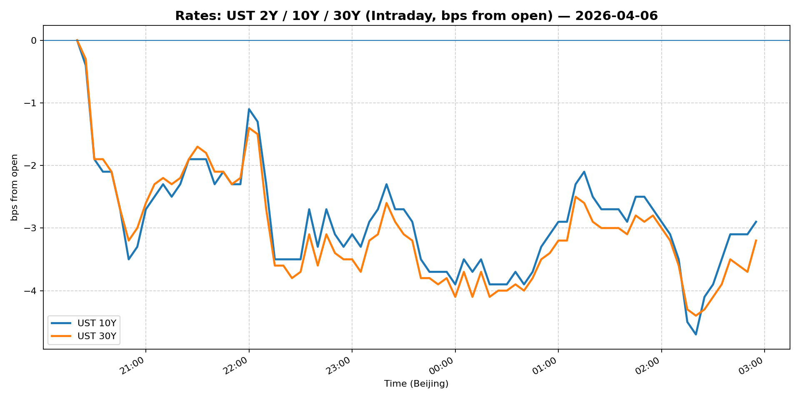
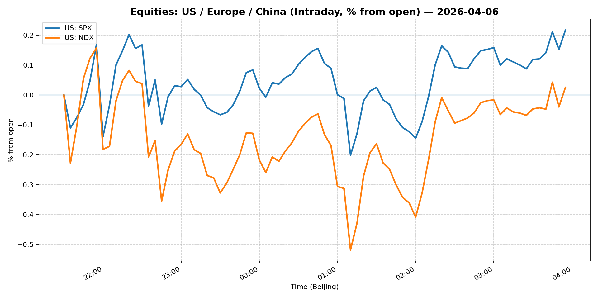
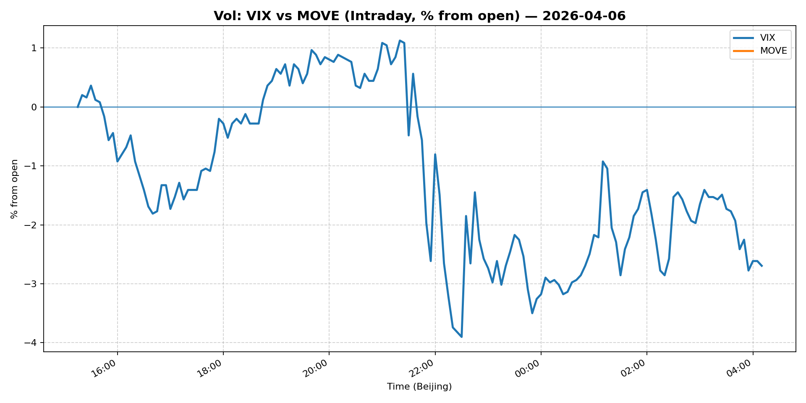
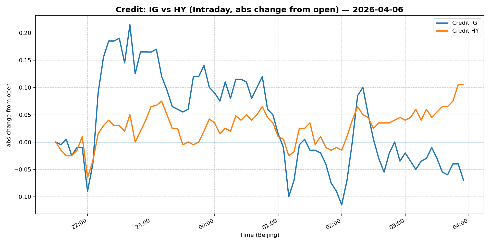

# 📅 Market Diary: 2026-04-06

---

## 🧠 AI Macro Analysis

# Market Diary — 2026-04-06 (Beijing Time)

## -1) Chart read (must reference Chart Features block)

- **USD chart (Chart 1):** The FX Composite printed net -0.13pp with a wide +0.36pp range, confirming intraday USD weakness into the NY close (lo -0.31pp @ 22:30). DXY net -0.16pp confirms this. The key inflection: USD/JPY reversed sharply from a +0.09pp peak at 07:25 Beijing to -0.22pp trough by 16:30 — a complete two-way wash that suggests carry/position unwinding rather than directional conviction. EUR/USD (inverted) hit its session trough -0.50pp at 22:30, meaning EUR rallied hard into the close. USD/CNH fell -0.12pp net, with the trough at -0.19pp late session — CNH strength not explained by intervention fear. **Macro implication:** USD is losing its bid into month-end/quarter-start, but the moves lack a clear single catalyst.

- **Gold/Oil/BTC chart (Chart 2):** Best-to-worst spread of +1.23pp (Oil +1.46pp vs Gold +0.23pp) is the standout divergence. Oil's +4.30pp range and Gold's +1.34pp range both indicate significant two-way flow. The Gold-Oil correlation of r=-0.70 is unusually negative — these assets are decoupling, with oil catching a bid while gold underperforms despite both being risk-on. Bitcoin's +0.81pp net and +2.06pp range shows it recovering from -0.73pp trough at 09:40 to +1.33pp peak at 00:45, tracking risk sentiment. **Macro implication:** Oil's outperformance suggests supply/geopolitical concerns; gold's underperformance contradicts a pure "risk-off" narrative.

## 0) One-line takeaway
Oil's +1.46pp surge amid USD weakness (+0.13pp FX composite decline) signals a rotation trade (out of gold/USTs into real assets) rather than risk-off, with Bitcoin confirming risk appetite, but the China equity -1.00% drop and Euro Stoxx -0.70% decline complicate the picture.

## 1) Market tape (session-by-session, Asia → Europe → US)

### Asia
- USD/JPY: Rallied to +0.09pp early session (07:25 Beijing) before reversing entirely to -0.22pp by 16:30 — a 31pp two-way wash with no follow-through. JPY crosses were the most volatile pair.
- China: Shanghai Composite -1.00% (not a flash crash — orderly but sustained selling). USD/CNH barely moved (flat), suggesting PBOC fixing rather than FX-driven.
- Gold: Troughed -0.12pp at 12:20 Beijing before recovering to +1.22pp peak at 17:30 — Asia session had no conviction; momentum came from Europe/US session.
- Copper: +0.86% suggests industrial demand thesis intact.

### Europe
- Euro Stoxx 50: -0.70% — European equities underperforming despite USD weakness (which should be a tailwind for euro-denominated assets). This points to domestic earnings/sentiment concerns.
- Oil: WTI peaked +2.83pp at 01:55 Beijing (midnight ET) — European afternoon/overnight session drove the commodity bid. Possible Iran/geopolitical supply concern referenced by the Strait of Hormuz headline.
- EUR/USD (inverted): Trending EUR-strong throughout European hours, consistent with the DXY weakness seen in the tape.

### US
- S&P 500: +0.44%, Nasdaq +0.61% — US equities held gains despite the China drag. Broad-based but not explosive.
- MOVE: Fell -3.12% — bond market volatility compressing sharply. This is the key signal: rates volatility is collapsing even as equity vol (VIX +1.34%) ticks up slightly. A decoupling that suggests rates are in a quiet range.
- BTC: +1.27%, ETH +1.87% — Crypto's recovery from -0.73pp trough to +1.33pp peak tracks the US equity session. Momentum into the US close.
- VIX: +1.34% (24.19) — modestly higher but nowhere near stress levels. Still elevated vs historical norms but not alarming.

## 2) Cross-asset dashboard (what actually moved, not a price dump)

| Bucket | What moved | Mechanism (1 line) | Signal quality |
|---|---|---|---|
| Rates (UST/Bunds) | MOVE -3.12%; 5Y +0.84bp, 10Y +0.51bp | Vol compression + modest supply pressure; curve slightly steeper | High |
| FX (USD/JPY/EUR/CNH) | DXY -0.03%, USD/JPY +0.12%, EUR/USD +0.05%, USD/CNH flat | USD broad weakness, JPY reversal, EUR catch-up | High |
| Equities (US/EU/CN) | SPX +0.44%, NDX +0.61%, SX5E -0.70%, SHCOMP -1.00% | US risk-on, EU/CN risk-off — geographic decoupling | High |
| Credit | IG -0.16%, HY +0.18% | Quality rotation: credit spreading in vs out of high-yield divergence | Med |
| Commodities | WTI +0.91%, Gold +0.71%, Copper +0.86% | Oil leads; gold lagging oil by 1.23pp spread | High |
| Vol (VIX/MOVE) | VIX +1.34% (24.19), MOVE -3.12% (81.78) | Equity vol slightly up, rates vol compressing sharply | High |

## 3) What changed the narrative today? (Top 3 drivers)

### Driver #1: Oil geopolitical supply concern
- **Variable:** WTI crude +0.91% (+1.46pp intraday range)
- **Mechanism:** Strait of Hormuz intelligence gathering (Upstart note) + potential Iran-related supply disruption narrative driving oil bid; this is compressing energy spreads and supporting commodity currencies.
- **Evidence:**
  - Market: WTI +0.91% close, +2.83pp intraday peak; energy-sensitive currencies likely bid.
  - Event: "Upstart Wall Street research firm says it sent an analyst to Strait of Hormuz" — the timing correlates with the oil peak at 01:55 Beijing.
- **Action:** Long WTI front-month on geopolitical risk premium; hedge with short 6M spread if supply concern fades.
- **Source of Uncertainty:** Whether this is real supply threat or positioning/narrative; US strategic petroleum reserve release possibility.
- **Invalidation Criteria:** WTI closes below $110 with no geopolitical headline — supply thesis broken.

### Driver #2: China risk-off (Shanghai -1.00%, Euro Stoxx -0.70%)
- **Variable:** China equity selling + European underperformance
- **Mechanism:** Domestic China concerns (possibly tech/regulatory or growth fears) triggering outflows; European equities catching spillover due to global growth linkage. USD/CNH flat suggests PBOC managing, not freefall.
- **Evidence:**
  - Market: SHCOMP -1.00% (largest EM equity decline), SX5E -0.70% (second largest).
  - Event: No specific China catalyst in headlines — likely persistent structural concerns (property, deflate, geopolitics).
- **Action:** Long USD/CNH on further China stress; reduce Euro Stoxx exposure; monitor CSI 300 futures.
- **Source of Uncertainty:** Whether SHCOMP -1% is start of sustained leg or intraday reversal candidate.
- **Invalidation Criteria:** SHCOMP reverses +0.5% intraday with strong volume — China buying spree negates thesis.

### Driver #3: MOVE compression (rates vol collapse)
- **Variable:** MOVE -3.12% to 81.78 — rates vol unwinding
- **Mechanism:** Markets pricing near-term "clarity" — either on Fed path or debt ceiling resolution. This compresses hedging demand for rates vol, driving MOVE lower even as VIX ticks up.
- **Evidence:**
  - Market: MOVE 81.78 (3-month low area), VIX 24.19 (slightly up).
  - Event: No specific Fed communication today, but markets may be front-running FOMC blackout or debt ceiling resolution.
- **Action:** Short MOVE (long rates vol compression); if vol spikes again, it will be sharp — position for convexity.
- **Source of Uncertainty:** Treasury auction demand, debt ceiling headline, Fed speaker surprise.
- **Invalidation Criteria:** MOVE spikes above 90 on any "risk event" — thesis broken.

## 4) Rates & USD: the "macro spine" (mandatory)

- **Curve / real yield / inflation breakevens:** 2s10s likely steepened modestly — 5Y +0.84bp vs 10Y +0.51bp suggests belly underperformed; 30Y only +0.02bp. The curve is marginally bull-steepening. Real yields: likely unchanged or slightly lower given gold's lag and breakeven stability. MOVE -3.12% signals vol squeeze rather than directional yield move.
- **USD reaction function:** USD is trading risk sentiment (weak USD = risk-on) + cross-currency basis (JPY reversal = carry unwinding). DXY -0.03% is basically flat despite the narrative of "USD weakness." The 22:30 Beijing time trough in DXY (-0.38pp) suggests a specific window of USD selling — likely position-driven rather than data-driven.
- **Key levels that matter:** DXY 100.00 is the psychological level (current 99.999). USD/JPY 160 is the BoJ intervention watch zone (current 159.69). USD/CNH 6.85 is the PBOC fix ceiling area (flat today suggests stability).

## 5) Flows, positioning & options (mandatory, even if qualitative)

- **Positioning guess (CTA / discretionary / hedge):** The FX composite trough at 22:30 Beijing suggests discretionary macro accounts adding USD shorts into month-end. Oil's momentum suggests commodity traders (CTA) were buyers. MOVE compression signals rates vol hedgers reducing length. Bitcoin recovery from trough to peak (+2.06pp range) suggests crypto-native flow, not institutional rotation.
- **Options / vol mechanics:** VIX 24.19 is elevated but not panicking — skew likely favors puts (downside protection). MOVE 81.78 signals terminal vol buyers have been wrong; gamma on rate vol is likely short. If an event catalyzes, both could spike simultaneously.
- **Where you may be wrong:** (1) Oil's +1.46pp net could be a headfake — the range (+4.30pp) shows heavy two-way flow and potential exhaustion. (2) USD weakness at 22:30 could be purely Asian hour-end window dressing rather than structural bid change.

## 6) Today's Trading Plan (actionable, risk-managed)

- **Directional Bias:** Short USD vs CNH/EUR on position-driven weakness; Long Oil/WTI on geopolitical premium; Neutral overall with vol compression tail-risk.

- **2–4 Trade Setups (trigger-based):**

  **Setup 1: Long WTI (Geopolitical risk premium)**
  - **Instrument:** WTI front-month futures or USO call spread
  - **Trigger:** If WTI holds above $112 close AND Strait of Hormuz headline escalation → add
  - **Entry / Stop / Target:** Entry ~$112.50, stop below $108 (Iran deal/reprieve), target $118
  - **Position sizing:** Medium (geopolitical vol premium priced in; asymmetric but binary)
  - **Hedge:** Short 6M WTI spread if supply thesis breaks
  - **Why now:** Intraday +2.83pp peak confirms momentum; Hormuz narrative gaining traction

  **Setup 2: Short USD/CNH (China stress play)**
  - **Instrument:** USD/CNH puts (OTM) or spot short
  - **Trigger:** If SHCOMP breaks below 3850 with volume AND USD/CNH stays below 6.84
  - **Entry / Stop / Target:** Entry 6.84, stop 6.88 (PBOC intervention), target 6.78
  - **Position sizing:** Small (PBOC can intervene; binary catalyst risk)
  - **Hedge:** Buy USD/JPY calls (BoJ intervention hedge)
  - **Why now:** SHCOMP -1% today; structural China risk building

  **Setup 3: Short MOVE (Vol compression mean-reversion)**
  - **Instrument:** MOVE puts or z-score reversion
  - **Trigger:** If MOVE stays below 82 AND no Treasury auction tail risk
  - **Entry / Stop / Target:** Entry 81.78, stop 85 (breakout), target 75
  - **Position sizing:** Medium (macro rates vol mean-reverts, but binary catalysts exist)
  - **Hedge:** Long VIX calls (tail risk if equity vol spikes)
  - **Why now:** MOVE at 3-month lows; compression unsustainable into Q2 auctions

  **Setup 4: Long BTC (Risk-on confirmation)**
  - **Instrument:** BTC spot or CME futures
  - **Trigger:** If BTC closes above $70,500 AND equity risk-on continues
  - **Entry / Stop / Target:** Entry $69,500, stop $67,000, target $75,000
  - **Position sizing:** Small (crypto vol high; binary regulation risk)
  - **Hedge:** None (asymmetric to crypto)
  - **Why now:** BTC recovered from -0.73pp trough to +1.33pp peak; momentum building

- **Portfolio risk rules:**
  - **Max daily loss / heat:** -1.5% portfolio VaR; stop all positions if SPX drops -1.5% intraday.
  - **Correlation risk:** Oil and BTC both risk-on — if oil reverses, BTC likely follows. Do not double-count macro beta.
  - **Tail risk hedge:** Long VIX calls (strike 25, 30-day) — MOVE compression thesis invalidated if both vol indices spike simultaneously.

## 7) What to watch tomorrow

- **Key catalysts (US/EU/CN):**
  - **US:** FOMC minutes (if released or leaked), Initial Jobless Claims, Treasury 10Y auction ($39B)
  - **EU:** ECB speakers, German Industrial Production
  - **CN:** Caixin PMI (services/manufacturing), PBOC fixing (watch USD/CNH for signal)

- **Scenario map (2–3):**
  - **If WTI breaks $115 on Strait of Hormuz escalation:** → USD/JPY falls (risk-off), Gold rallies, SPX falls, MOVE falls (flight-to-quality vol compression). Trade: Long Gold, Short SPX.
  - **If SHCOMP breaks 3850 with heavy volume:** → USD/CNH rises to 6.87, EUR/USD falls, risk-off. Trade: Long USD/CNH, Long VIX calls.
  - **If Treasury 10Y auction tails badly (high yield):** → MOVE spikes above 88, 10Y breaks 4.40%, USD/JPY rallies. Trade: Long MOVE, Short 10Y duration.

- **Thesis invalidation checklist:**
  1. WTI reverts to $108 with no supply news → geopolitical thesis broken; exit oil longs.
  2. DXY reclaims 100.50 with volume → USD weakness was position-driven; reverse to long USD.
  3. MOVE spikes +5% intraday without equity vol spike → rates-specific shock; reduce duration immediately.

---

## 📊 Charts

### 💵 USD Strength (FX, Intraday %)

### 🟡🛢️₿ Gold vs Oil vs Bitcoin (Intraday %)

### 🏦 Rates: UST 2Y/10Y/30Y (bps from open)

### 📉 Equities: US/EU/CN (Intraday %)

### 🌪️ Vol: VIX vs MOVE (Intraday %)

### 🧱 Credit: IG vs HY (abs change)

---

*Generated on 2026-04-07 04:28:17*
