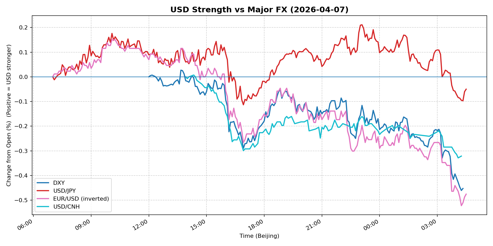
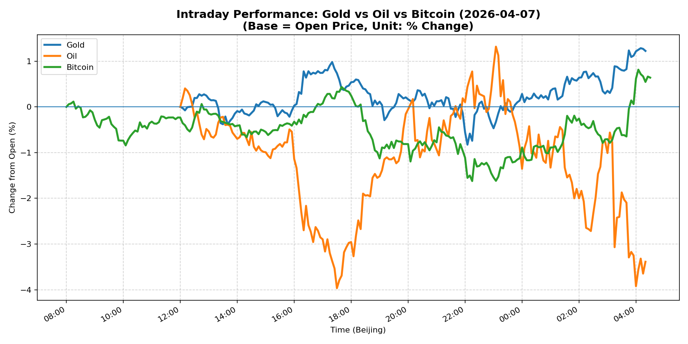
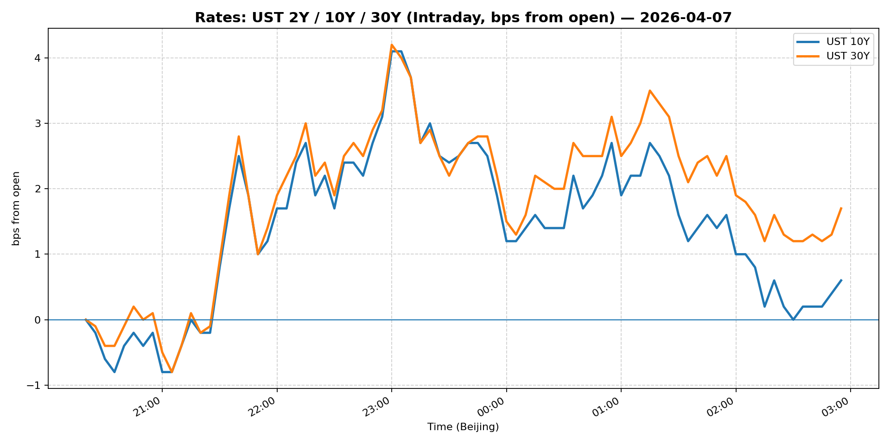
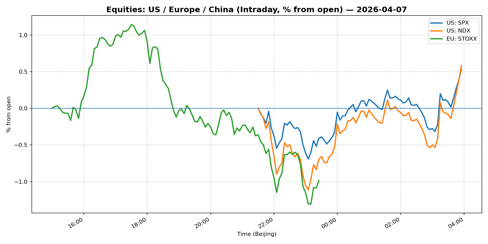
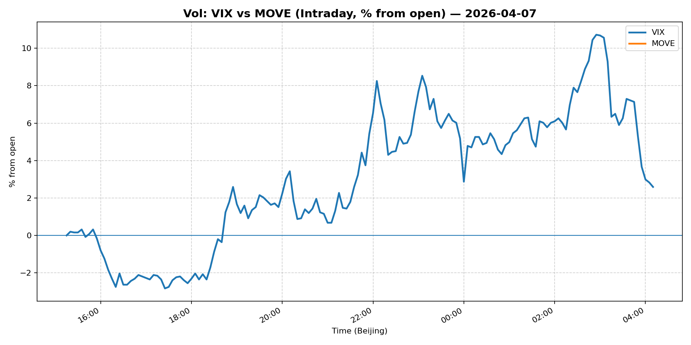
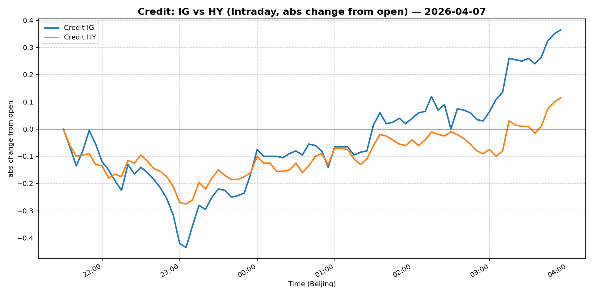

# 📅 Market Diary: 2026-04-07

---

## 🧠 AI Macro Analysis

# Market Diary — 2026-04-07 (Beijing Time)

## -1) Chart read (Chart Features block)

- **USD chart (Chart 1):** DXY net -0.45pp on a +0.49pp intraday range, finishing near session lows (lo -0.46pp @ 04:15). FX Composite similarly closed at lo -0.35pp @ 04:20, confirming a late-session capitulation in USD bid tone. EUR/USD drove the move: inverted composite hit hi +0.15pp @ 10:05 and accelerated through European hours. USD/CNH net -0.32pp with trough at -0.33pp @ 04:05—CNH outperformed on the day. JPY was the laggard (net -0.05pp vs. broader -0.26pp composite), suggesting carry unwind or intervention shadow not yet active. Macro signal: broad USD rejection at Asian highs, regime shift bias tilted toward further DXY weakness.

- **Gold/Oil/BTC chart (Chart 2):** Triple divergence: Gold +1.23pp vs. Oil -3.39pp vs. BTC +0.64pp; spread of +4.61pp. Gold hit hi +1.29pp @ 04:10 on the back of safe-haven demand. Oil's net -3.39pp with a +5.28pp intraday range—massive volatility spike (lo -3.97pp @ 17:30), likely geopolitical risk premium being priced out rapidly. Correlations: Gold–Oil r=-0.84 (classic risk-off divergence), Gold–Bitcoin r=+0.65 (both bid in late session), Oil–Bitcoin r=-0.76 (macro risk liquidating together). Signal quality: High—clear regime split between safe-haven (gold) and risk/energy (oil).

## 0) One-line takeaway

USD rejection at Asian session highs, driven by EUR strength and CNH outperformance, coincides with a sharp Gold–Oil divergence (+4.61pp spread) that signals risk-off positioning escalating—macro spine weakening while safe-haven premium widens.

## 1) Market tape (session-by-session)

### Asia
- USD Composite turned at 07:05 Beijing time (trough flat), then peaked +0.04pp at 07:35–08:00 before reversing. No clear macro catalyst from Asian data; positioning adjustment ahead of European session likely drove early FX range. CNH outperformance notable—USD/CNH trough -0.01pp @ 14:00 suggests state bank activity or PBOC fixing signal. Equities: Shanghai Composite -1.00%, FXI -0.20%—China risk-off despite steadier CNH.

### Europe
- EUR/USD hit peak +0.06pp @ 08:35, driving DXY to trough -0.04pp. Euro Stoxx 50 -1.05%—largest mover of the day, confirming risk-off spillover. Oil began its volatile session: WTI spiked +1.32pp @ 23:05 then reversed sharply to trough -3.97pp @ 17:30 (earlier timestamps suggest WTI data aligned to Asia/Europe overlap). No ECB speakers cited; move appears reactive to geopolitical headlines (see Driver #1).

### US
- S&P 500 flat (+0.08%), Nasdaq +0.04%—equities resilient despite VIX spike to 25.78 (+6.66%). DXY collapsed: lo -0.46pp @ 04:15 Beijing (early US session). Gold surged to hi +1.29pp @ 04:10; Bitcoin +0.64pp @ 04:05—late-session safe-haven bid confirms risk-off momentum. MOVE unchanged at 81.68; no rate-vol relief despite equity turbulence.

## 2) Cross-asset dashboard

| Bucket | What moved | Mechanism (1 line) | Signal quality |
|---|---|---|---|
| Rates (UST/Bunds) | 2Y down (-0.13% on 5Y), 10Y/30Y up; curve steepened | Front-end bid (growth fear) vs. long-end sell (inflation risk premium) | High |
| FX (USD/JPY/EUR/CNH) | DXY -0.45pp; EUR/USD +0.80%; USD/CNH flat | Broad USD liquidation; EUR outperformance on EU risk repricing | High |
| Equities (US/EU/CN) | US flat; Euro Stoxx -1.05%; Shanghai -1.00% | Europe/China risk-off; US decoupling (VIX up but SPX flat) | Med |
| Credit | IG LQD +0.11%; HY HYG +0.03% | Modest risk-off bid; spreads contained despite vol spike | Low |
| Commodities | Gold +1.64%; Oil -0.24% (WTI -3.39pp intraday); Copper +0.16% | Gold bid (geopolitics); Oil volatility (supply/risk premium collapse) | High |
| Vol (VIX/MOVE) | VIX +6.66% to 25.78; MOVE flat | VIX spike confirms equity fear; MOVE disconnect (rates not following) | High |

## 3) What changed the narrative today?

### Driver #1: Strait of Hormuz geopolitics + Dalio's WWIII comment
- **Variable:** Geopolitical risk premium in energy and safe-haven assets
- **Mechanism:** WTI intraday range of +5.28pp (hi +1.32pp to lo -3.97pp) suggests rapid pricing of conflict risk then repricing out. Gold surge to +1.29pp @ 04:10 confirms safe-haven bid. Ray Dalio's public comparison to potential world war amplifies tail-risk framing.
- **Evidence:**
  - Market: Oil +5.28pp range, Gold +2.11pp range, VIX +6.66%
  - Event: Strait of Hormuz analyst dispatch headline; Dalio WWIII comment; Dimon annual letter risk warnings
- **Action:** Long Gold (intact), reduce Oil exposure (uncertainty too high), hedge equity downside with VIX instruments
- **Source of Uncertainty:** Whether Hormuz disruption is nascent threat or already priced; US/China response not yet quantified
- **Invalidation Criteria:** WTI recovers above 115 on sustained basis, or Gold fails to hold 4700—geopolitical premium unwinds cleanly

### Driver #2: Blue Owl private credit redemptions capped at 5%
- **Variable:** Liquidity stress signal in private markets / credit contagion
- **Mechanism:** Blue Owl capping redemptions after "steep request levels" suggests institutional liquidity squeeze. Cross-asset: IG/HY spreads contained but VIX elevated—this is the pattern preceding broader credit de-levering.
- **Evidence:**
  - Market: VIX +6.66% to 25.78, MOVE flat (disconnected from equity vol)
  - Event: Headline confirming private credit fund gate activation
- **Action:** Monitor HY carefully; consider reducing high-yield exposure; watch for contagion to public credit markets
- **Source of Uncertainty:** Size of redemption queue, other managers similarly constrained (not yet visible)
- **Invalidation Criteria:** Blue Owl or peers announce redemption queue cleared; HY spreads tighten below current levels

### Driver #3: USD rejection / EUR outperformance
- **Variable:** Dollar weakness / EUR bid on European resilience
- **Mechanism:** DXY -0.45pp with FX Composite at lo -0.35pp; EUR/USD +0.80% (hi +0.15pp intraday). USD/CNH flat despite CNH outperformance elsewhere—implies broad USD liquidation vs. China-specific story.
- **Evidence:**
  - Market: EUR/USD peak +0.06pp @ 08:35, DXY trough -0.04pp @ 12:30, late session -0.46pp
  - Event: No EU data catalyst; appears positioning-driven or risk-flow related
- **Action:** Reduce USD long exposure; consider EUR/USD long on pullback if 1.16 holds
- **Source of Uncertainty:** Whether USD weakness is fundamental (growth downgrade) or positioning unwind
- **Invalidation Criteria:** DXY reclaims 100; EUR/USD fails at 1.16

## 4) Rates & USD: the "macro spine"

- **Curve / real yield / breakevens:** Curve steepened: 5Y -0.13%, 10Y +0.18%, 30Y +0.61%. Front-end bid (growth fear) vs. long-end sell (inflation/tail-risk premium). 2s10s likely steeper on the day. Breakevens not provided in snapshot but implied move: 10Y +0.18% with real yields likely unchanged or slightly lower—breakeven widening = inflation risk premium rising. Key risk: if oil re-prices higher on geopolitical escalation, 30Y could test 5.00%.

- **USD reaction function:** USD is trading a mixture of risk-off (safe haven bid wanes) + growth downgrade (DXY collateral). However, DXY -0.45pp contradicts pure risk-off (typically USD benefits). Explanation: EUR is the key driver—EUR/USD +0.80% reflects European-specific resilience or ECB hawkish repricing, not pure USD weakness. USD/JPY -0.12% (JPY bid) confirms modest risk-off component. USD/CNH flat—PBOC anchoring.

- **Key levels:** DXY 99.62 (close); 100 is resistance; 98.50-99.00 is next support cluster. EUR/USD 1.16 hold critical; break above 1.1650 opens 1.18. USD/JPY 159.59—watch 160 as intervention threshold.

## 5) Flows, positioning & options

- **Positioning guess:** Gold positioning likely extended (safe-haven crowding); Oil positioning confused (geopolitical long vs. demand destruction short). USD positioning ambiguous—DXY rejection suggests speculative net long liquidation, but late-session bid (Gold, BTC) implies flight capital entering. CTA likely short equities, long vol. Discretionary: reducing risk exposure.

- **Options / vol mechanics:** VIX 25.78 is elevated—call skew likely steep. Oil implied vol (not provided) probably spiked given +5.28pp range. Gold vol likely elevated but contained. 1-month VIX > 25 suggests market pricing tail risk; potential for vol crush if geopolitical headlines fade. EUR/USD vol: skew may favor calls given momentum.

- **Where you may be wrong:** (1) Oil collapse may be overstated—OPEC+ response function not visible; could snap back violently. (2) VIX/equity disconnect (VIX +6.66% but SPX flat) suggests optionality market pricing fear not yet confirmed by spot equities—either equities sell off tomorrow or VIX mean-reverts.

## 6) Today's Trading Plan (trigger-based)

- **Directional Bias:** Moderate risk-off; Gold over Oil; reduce USD exposure; neutral equities with hedge

- **Trade Setup 1:**
  - **Instrument:** Long Gold (futures or spot)
  - **Trigger:** If Gold holds above 4650 on any pullback to 4650–4700 zone
  - **Entry / Stop / Target:** Entry ~4700; stop below 4600; target 4900
  - **Position sizing:** Medium (geopolitical uncertainty elevated but not certain)
  - **Hedge:** Small short Silver (r=-0.74 implied from Gold/Oil divergence)
  - **Why now:** Gold–Oil spread +4.61pp signals safe-haven bid intact; late-session momentum confirms

- **Trade Setup 2:**
  - **Instrument:** Short WTI Crude (front-month futures or USO)
  - **Trigger:** If WTI cannot reclaim 115 after initial geopolitical bid fade; or if Iran ceasefire/solution headline
  - **Entry / Stop / Target:** Entry ~112–113; stop above 118; target 102–105
  - **Position sizing:** Small (high vol environment; geopolitical tail risk)
  - **Hedge:** Long OTM calls (125 strike) as tail hedge
  - **Why now:** +5.28pp intraday range + net -3.39pp confirms demand destruction or risk-premium unwinding

- **Trade Setup 3:**
  - **Instrument:** Short EUR/USD (if rejected at 1.1650)
  - **Trigger:** EUR/USD fails to break 1.1650 with DXY reclaiming 100
  - **Entry / Stop / Target:** Entry 1.1630–1.1650; stop above 1.17; target 1.15
  - **Position sizing:** Small-Medium (USD positioning ambiguous)
  - **Hedge:** Long 1.18 calls (OTM)
  - **Why now:** EUR strength may be positioning-driven; USD rejection could reverse

- **Trade Setup 4:**
  - **Instrument:** VIX calls (1-month, 28–30 strike)
  - **Trigger:** If VIX holds above 25 and SPX tests 6500 support
  - **Entry / Stop / Target:** Entry ~1.50–2.00; stop below VIX 22; target VIX 35
  - **Position sizing:** Small (tail hedge, not directional)
  - **Hedge:** N/A
  - **Why now:** VIX/equity disconnect suggests vol not fully priced for downside

- **Portfolio risk rules:**
  - **Max daily loss / heat:** -2.5% portfolio-level; reduce gross exposure if >1.5% intraday drawdown
  - **Correlation risk:** Gold–BTC +0.65 correlation means cannot treat as independent hedges; treat as same risk factor
  - **Tail risk hedge:** Maintain 5–10% portfolio in long-duration Treasuries (30Y bid today confirms institutional demand); OTM VIX calls as equity hedge

## 7) What to watch tomorrow

- **Key catalysts:**
  - US: No major data scheduled; Fed speakers (any hawkish pivot language would support USD and front-end rates)
  - EU: ECB minutes or speakers—if hawkish, EUR/USD test of 1.1650+ accelerates
  - China: FXI/CSI reaction to any policy support announcements; USD/CNH fix direction critical

- **Scenario map:**
  - If Oil reclaims 115+ on geopolitical escalation → Gold to 4850+, SPX -1.5%+, VIX 30+ → Long Gold, Long VIX puts
  - If Blue Owl-style credit event expands → HY spreads widen >50bp → Short HY, Long IG (defensive rotation)
  - If USD reclaims 100 and EUR fails at 1.16 → DXY reversal → Short EUR/USD, Long USD/JPY

- **Thesis invalidation checklist:**
  - [ ] DXY reclaims 100 with >+0.3% daily gain → USD reversal thesis intact; reduce EUR, Gold
  - [ ] WTI holds above 115 with geopolitical headlines fading → Energy bid intact; close Oil shorts
  - [ ] VIX reverts below 22 despite current 25.78 → Vol crush; close VIX calls, reduce equity hedges
  - [ ] China FXI breaks below 34 → Domestic demand collapse signal; increase China equity short

---

## 📊 Charts

### 💵 USD Strength (FX, Intraday %)

### 🟡🛢️₿ Gold vs Oil vs Bitcoin (Intraday %)

### 🏦 Rates: UST 2Y/10Y/30Y (bps from open)

### 📉 Equities: US/EU/CN (Intraday %)

### 🌪️ Vol: VIX vs MOVE (Intraday %)

### 🧱 Credit: IG vs HY (abs change)

---

*Generated on 2026-04-08 04:34:55*
