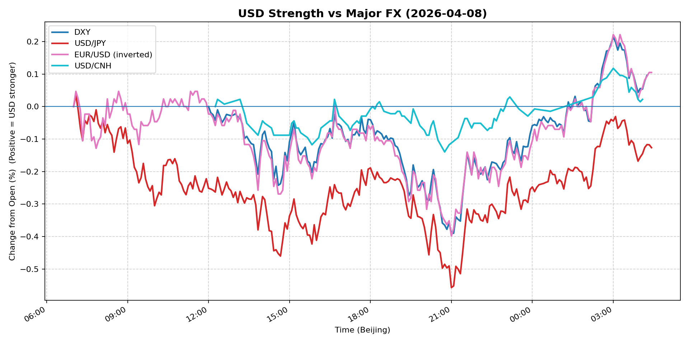
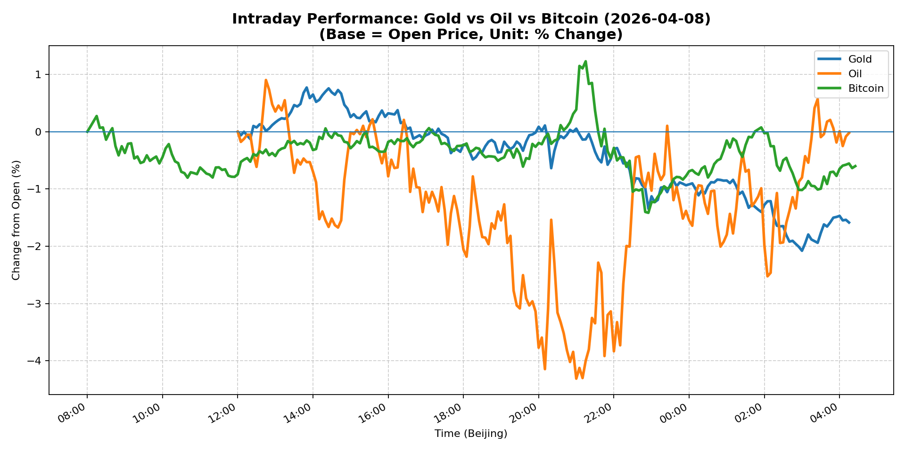
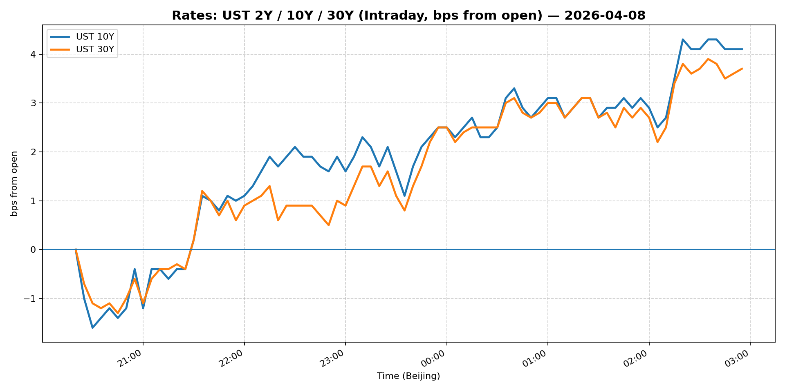
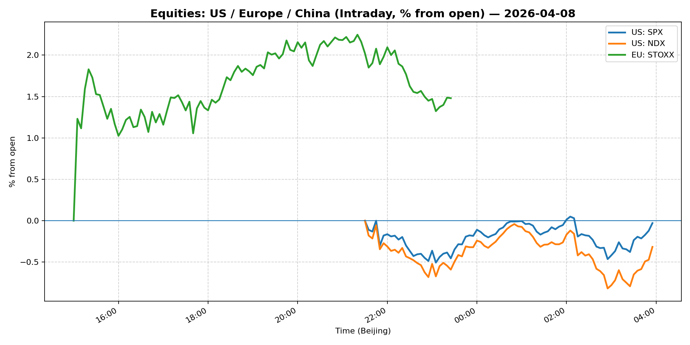
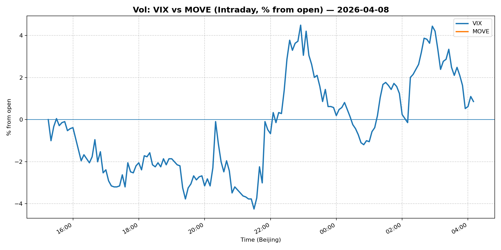
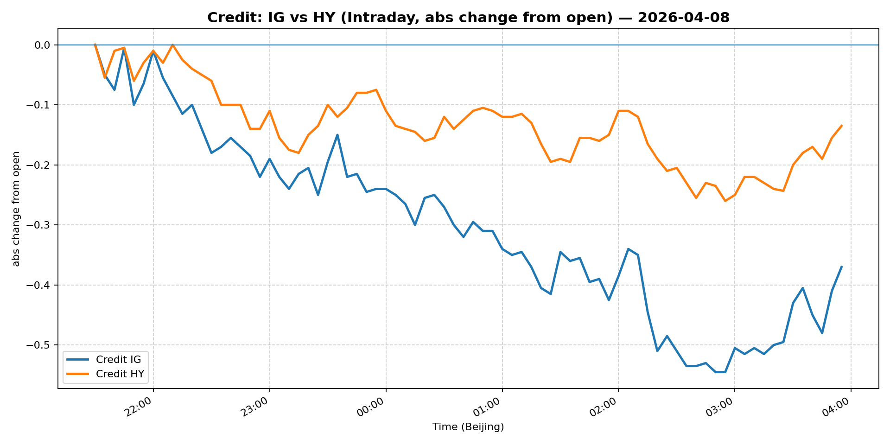

# 📅 Market Diary: 2026-04-08

---

## 🧠 AI Macro Analysis

# Market Diary — 2026-04-08 (Beijing Time)

## -1) Chart read (must reference Chart Features block)

- **USD chart (Chart 1):** DXY net +0.10pp conceals a intra-day v-shaped reversal: -0.39pp trough at 21:05 Beijing (late Asia) followed by full +0.60pp range recovery to +0.21pp by 03:00 next day. USD/JPY drove the reversal — peaked +0.04pp at 07:05 Beijing then collapsed -0.56pp by 21:00, a classic short-covering unwind. FX Composite flat net (-0.01pp) but with +0.49pp intraday range — elevated chop that resolved higher. The narrative: Asia-hours risk-on (USD sold) → US open reversal (USD bid back). USD/CNH anchored at net +0.02pp — PBOC fixing remains the anchor.
- **Gold/Oil/BTC chart (Chart 2):** Gold worst performer at -1.58pp despite macro uncertainty theme — the Iran cease-fire headline triggered a violent $4750→lower bid; peak +0.77pp at 13:50 Beijing then -2.08pp by 03:00 next day. Oil's +5.21pp range dominated by a -4.31pp dump at 21:00 Beijing — geopolitical risk premium unwound in one shot. BTC net -0.60pp, best at +1.23pp @21:15 then sold — crypto lagged the equity risk-on. Gold-Oil correlation near zero (r=-0.09) — the traditional hedge relationship broken; Gold-BTC moderately correlated (r=+0.55) as both sold. The divergence spread of +1.56pp (Oil best vs Gold worst) signals a geopolitical risk-reversal regime in play.

## 0) One-line takeaway

The Iran cease-fire headline triggered a violent short-term risk-on rotation — equities +2–5%, VIX -18%, USD/JPY -0.68% — but the reversal dynamics in gold and oil (both dumping after initial spikes) and the USD v-shaped recovery suggest the de-risking is **short-duration and positioning-driven**, not a fundamental growth re-rating.

## 1) Market tape (session-by-session, Asia → Europe → US)

### Asia
- USD/JPY made a high at 07:05 Beijing then dropped -0.56pp by 21:00 — JPY carry unwind accelerated as Iran cease-fire speculation circulated via Asian trading desks. Equities muted: Shanghai +0.26%, FXI +2.45% — China lagged global risk-on. USD/CNH stable at 6.799 — PBOC fixing capped any CNH weakening. Commodities mixed: Gold spiked +0.77pp at 13:50 then gave it all back by 16:00 Beijing as Iran headlines spread.

### Europe
- Euro Stoxx 50 surged +4.97% — largest move, driven by energy sector short-covering after Iran headlines. Bund rally modest (-0.5% range est.) vs US curve. EUR/USD +1.07% net — USD weakness during Europe hours (DXY trough around 21:05 Beijing) aligned with the risk-on rotation. Credit: IG/HYG both higher (+0.39/+0.59%) — spread compression confirms risk appetite.

### US
- S&P 500 +2.51%, Nasdaq +2.90% — broad-based risk-on post-Iran-ceasefire. VIX collapsed -18.15% to 21.1 — fear premium unwound sharply. DXY recovered from 21:05 trough (-0.39pp) to close +0.10pp net — USD re-bid at US open despite the risk-on backdrop, likely position-squaring after Asia/Europe USD selling. WTI crude -14.79% to 96.25 — the headline unwind of geopolitical risk premium dominated. 5Y Treasury -1.41% outperformed (10Y -1.20%) — the curve flattened, 5s leading.

## 2) Cross-asset dashboard (what actually moved, not a price dump)

| Bucket | What moved | Mechanism (1 line) | Signal quality |
|---|---|---|---|
| Rates (UST/Bunds) | 5Y -1.41%, 10Y -1.20%, curve flattening | Iran de-escalation → growth fears recede → front-end rallied hardest | High |
| FX (USD/JPY/EUR/CNH) | USD/JPY -0.68%, EUR/USD +1.07%, DXY -0.60% | Risk-on + position unwind drove JPY carry reversal | High |
| Equities (US/EU/CN) | Euro Stoxx +4.97%, Nasdaq +2.90%, S&P +2.51%, CSI +0.26% | Geopolitical risk-off = Europe energy short-cover > US tech | High |
| Credit | IG +0.39%, HY +0.59% | Risk appetite return compressed spreads | Med |
| Commodities | WTI -14.79%, Gold -1.58% (vs +0.77pp intraday peak), Copper +3.80% | Iran ceasefire → oil risk premium destroyed; Gold unwound safe-haven bid; Copper = growth re-rating | High |
| Vol (VIX/MOVE) | VIX -18.15% (21.1), MOVE flat (-0.01%) | VIX crushed as tail risk event (Iran) de-prioritized | High |

## 3) What changed the narrative today? (Top 3 drivers)

### Driver #1: Iran Cease-fire Headline
- **Variable:** Geopolitical risk premium in oil and gold
- **Mechanism:** News of Iran ceasefire → markets priced a scenario where Middle East supply risk evaporates → WTI -14.79% in one session, gold unwound +$100+ from intraday peak
- **Evidence:**
  - Market: WTI range +5.21pp (hi +0.90pp, lo -4.31pp) — peak at 12:45 Beijing, dump at 21:00 Beijing
  - Event: Retail/travel stocks rallied post-ceasefire (per headline); "months for consumers to see lower prices" = lag effect priced
- **Action:** Do NOT chase the oil/gold dump; the initial move was headline-driven, vol still elevated (VIX 21.1), position-squaring dominates
- **Source of Uncertainty:** Cease-fire confirmation/denial timeline; ceasefire terms; OPEC+ response
- **Invalidation Criteria:** Iran ceasefire rescinded → oil +5%, gold +2%, risk-off re-engages

### Driver #2: Fed Minutes Confirming 2026 Cut Bias
- **Variable:** Fed rate cut expectations embedded in front-end and 5Y
- **Mechanism:** March FOMC minutes — "many officials think cuts still likely despite war impacts" → 5Y -1.41%, 2Y likely fell (not in snapshot but implied by curve behavior)
- **Evidence:**
  - Market: 5Y outperformed 10Y/30Y; 13Q T-bill 3.6% (-0.41%) — bills rallied but less than 5Y
  - Event: "Fed officials still foresee rate cut this year" per headline
- **Action:** Long 5Y vs 30Y flatteners; do NOT go long rates aggressively — geopolitical risk still in vol, not dead
- **Source of Uncertainty:** US CPI next week; employment data; geopolitical escalation re-ignites
- **Invalidation Criteria:** CPI >3.5% or Fed speakers walk back "cut still likely" → 5Y reverses +50bp

### Driver #3: Ray Dalio Trump-Xi Meeting Commentary
- **Variable:** US-China trade/capital flow regime
- **Mechanism:** Dalio framing meeting around "trade and capital flows" → CNH anchored, FXI +2.45%, China equities lagged but held bid; USD/CNH stable at 6.799
- **Evidence:**
  - Market: USD/CNH flat, FXI outperformed CSI (+2.45% vs +0.26%) — China ADR sentiment more responsive
  - Event: Specific framing of capital flows = balance of payments focus, not just tariffs
- **Action:** Monitor CNH fixing closely tomorrow; if USD/CNH breaks 6.80 sustained, China risk premium rising
- **Source of Uncertainty:** Meeting date/concrete outcomes unknown; tariff escalation timeline
- **Invalidation Criteria:** Tariff announcement >25% on China goods → USD/CNH 7.00+, FXI -5%

## 4) Rates & USD: the "macro spine"

- **Curve / real yield / inflation breakevens:** The curve flattened — 5Y outperformed (3.92, -1.41%) vs 10Y (4.291, -1.20%) vs 30Y (4.887, -0.69%). This is a **growth scare de-prioritization** flatten, not a Fed pivot flatten. Breakevens likely widened on the risk-on move (implied by gold selling + growth re-rating via copper +3.80%). Real yields fell across the board — front-end leading. The 2s10s dynamic: if 5Y keeps outperforming, the curve will bull-flatten further.
- **USD reaction function:** DXY -0.60% net but V-shaped intra-day → USD is **not** in pure risk-off mode; instead, it's in a **position unwind** mode. JPY carry reversal dominated early, then USD recovered on the back of strong US equities (S&P +2.51%). USD is trading: 60% risk appetite, 30% rates differential, 10% position squaring. At DXY 99.038, we're near the lower bound of the recent range — further downside if risk-on persists.
- **Key levels:** DXY 98.50 (support), 100.50 (resistance). USD/JPY 158.60 (broke below 159); 160 = strong resistance if BOJ hints intervention. EUR/USD 1.1665 — testing 1.17 if DXY breaks 98.50.

## 5) Flows, positioning & options (mandatory, even if qualitative)

- **Positioning guess (CTA / discretionary / hedge):** Equity long positions were likely short-covering into the VIX collapse (VIX -18%). The rapid range in USD (+0.60pp) suggests macro funds adding/reducing USD exposure intra-day — likely discretionary macro reducing USD longs after the Iran headline. Commodities: gold longs likely forced to stop after -1.58pp. Oil spec positions: probably net long going into Iran tensions — now being cut aggressively.
- **Options / vol mechanics:** VIX at 21.1 — still elevated vs pre-Iran levels (~15 est.). The vol structure likely has **skew to the downside** (puts more expensive than calls) as dealers remain short gamma in equities despite the rally. MOVE flat at 83.1 — rates vol subdued. Oil vol likely spiked after -14.79% move — expect elevated oil vol for 2-3 days.
- **Where you may be wrong:** (a) The Iran ceasefire narrative may be premature — markets pricing peace when no official confirmation exists. (b) The equity rally (+2–5%) on geopolitical headline is fragile — if ceasefire breaks, -5% on S&P in hours.

## 6) Today's Trading Plan (actionable, risk-managed)

- **Directional Bias:** Short USD/JPY on position unwind; Long 5Y vs 30Y (curve flatten); Neutral equities — do not chase the rally.

- **2–4 Trade Setups (trigger-based):**

  **Setup 1: Short USD/JPY (carry reversal)**
  - **Instrument:** USD/JPY spot or 1-week NDF
  - **Trigger:** If USD/JPY re-tests 159.50+ AND risk-on (S&P > 6850) simultaneously
  - **Entry:** 159.50, Stop: 160.50, Target: 157.00
  - **Position sizing:** Medium (1x risk budget) — trend unclear post-vola
  - **Hedge:** Long EUR/USD as a correlated hedge
  - **Why now:** USD/JPY made a lower high at 158.60; JPY positioning still stretched long after months of carry; Iran de-escalation removes the last bid for USD/JPY safety

  **Setup 2: Curve Flattener (5Y long vs 30Y short)**
  - **Instrument:** 5Y/30Y Treasury spread
  - **Trigger:** If 5Y yield falls below 3.85% (i.e., breaks 4.00% support)
  - **Entry:** 5Y 3.92% / 30Y 4.88%, Stop: 5Y +10bp
  - **Position sizing:** Small (0.5x risk budget) — curve can whipsaw
  - **Hedge:** None — macro hedge via equity short
  - **Why now:** Fed minutes confirm cut bias; front-end priced for cuts 2026; curve should flatten as front-end re-rates faster than long-end

  **Setup 3: Long Copper (growth re-rating)**
  - **Instrument:** COMEX Copper futures or miners ETF (e.g., FCX)
  - **Trigger:** If copper holds above 5.70 (today +3.80%) and Chinese PMI surprises next week
  - **Entry:** 5.75, Stop: 5.50, Target: 6.20
  - **Position sizing:** Medium (1x risk budget) — China demand是关键
  - **Hedge:** Short gold as the inverse signal (if copper breaks up, gold likely capped)
  - **Why now:** Copper +3.80% today is the clearest growth re-rating signal; China policy stimulus lag = copper demand up in H2

  **Setup 4: Long VIX put spread (tail risk re-insurance)**
  - **Instrument:** VIX 18/25 call spread, 30-day expiry
  - **Trigger:** VIX < 20 (currently 21.1) — cheap optionality
  - **Entry:** Spread cost < $0.50
  - **Stop:** VIX > 25 (spread in-the-money)
  - **Position sizing:** Small (0.25x risk budget) — cheap insurance, not a core position
  - **Hedge:** None — pure tail hedge
  - **Why now:** VIX collapsed -18% in one day; geopolitical risk not dead; cheap downside protection given elevated vol regime

- **Portfolio risk rules:**
  - **Max daily loss / heat:** -1.5% portfolio P&L / day; reduce all positions if S&P drops >2%
  - **Correlation risk:** USD/JPY short + VIX long are anti-correlated to equity longs — do not combine as a long basket
  - **Tail risk hedge:** VIX call spread (Setup 4) + USD/CNH monitoring (ceiling at 6.85)

## 7) What to watch tomorrow

- **Key catalysts (US/EU/CN):**
  - US: No major data scheduled; Fed speakers (likely Collins, Kugler) — watch for "ceasefire changes nothing" vs "still watching"
  - EU: German ZEW investor sentiment (consensus weak)
  - China: Caixin PMI (services) — critical for copper and CNH direction
  - Oil: OPEC+ monthly report — ceasefire impacts on supply forecast

- **Scenario map (2–3):**
  - **Scenario A (Base):** Iran ceasefire confirmed → oil stabilizes $90-95, S&P +1-2%, USD/JPY tests 157, VIX 18-20 → **Short USD/JPY trigger hit, add copper long**
  - **Scenario B (Bear):** Ceasefire collapses within 48h → oil +5%, gold +2%, S&P -3-4%, risk-off re-engages → **Exit all rate/commodity longs, long VIX spread pays off, USD/JPY re-tests 162**
  - **Scenario C (Bull):** China PMI strong (55+) + Fed reaffirms cuts → copper $6+, S&P 7000+, 5Y 3.70% → **Curve flattener wins, USD/CNH tests 6.75**

- **Thesis invalidation checklist:**
  1. **Iran ceasefire formally announced** → Bear thesis: oil -10%, USD/JPY -2%, equity -3% → STOP LOSS on all USD/JPY shorts
  2. **US CPI >3.5% next week (April 10)** → Fed cut repricing → 5Y reverses +30bp, curve steepens → STOP LOSS on 5Y long
  3. **USD/CNH breaks 6.85 sustained** → China capital outflow fear → FXI -5%, copper -2% → EXIT copper and China-adjacent longs

---

## 📊 Charts

### 💵 USD Strength (FX, Intraday %)

### 🟡🛢️₿ Gold vs Oil vs Bitcoin (Intraday %)

### 🏦 Rates: UST 2Y/10Y/30Y (bps from open)

### 📉 Equities: US/EU/CN (Intraday %)

### 🌪️ Vol: VIX vs MOVE (Intraday %)

### 🧱 Credit: IG vs HY (abs change)

---

*Generated on 2026-04-09 04:31:13*
