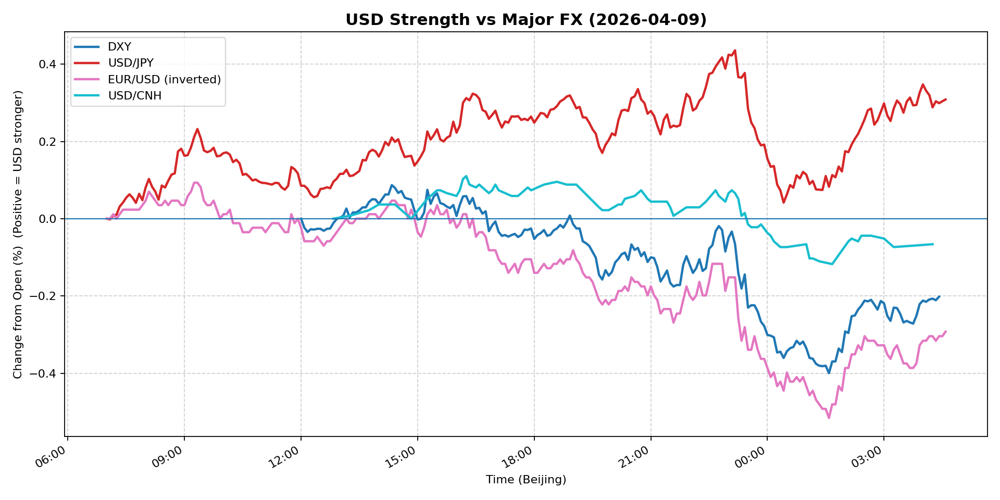
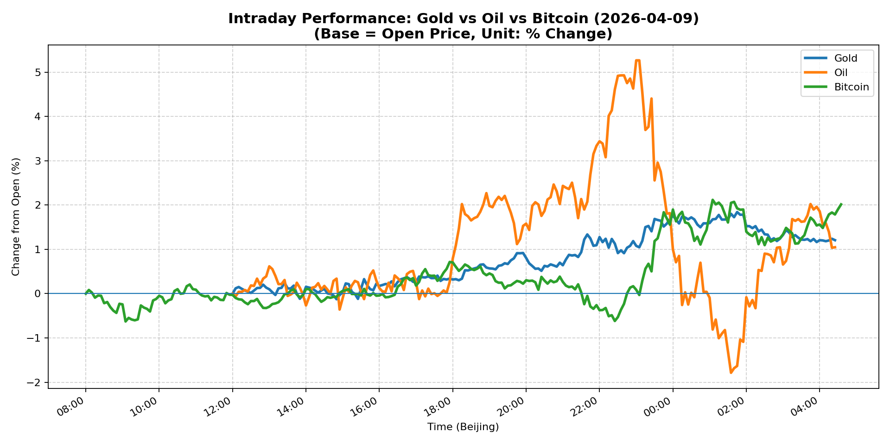
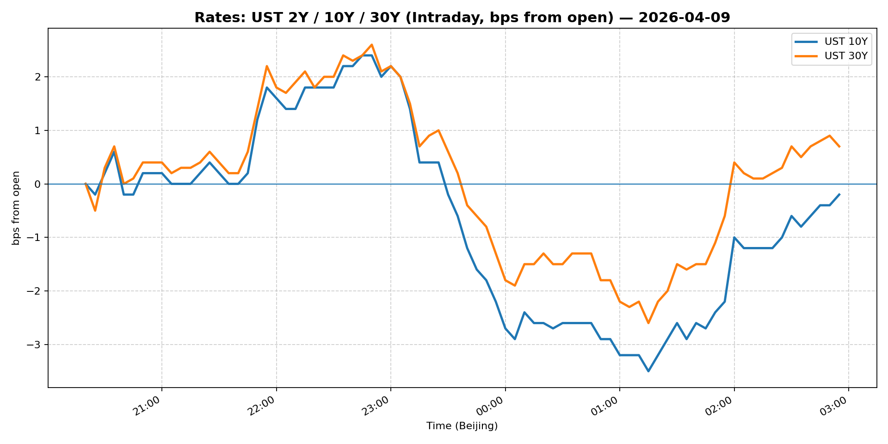
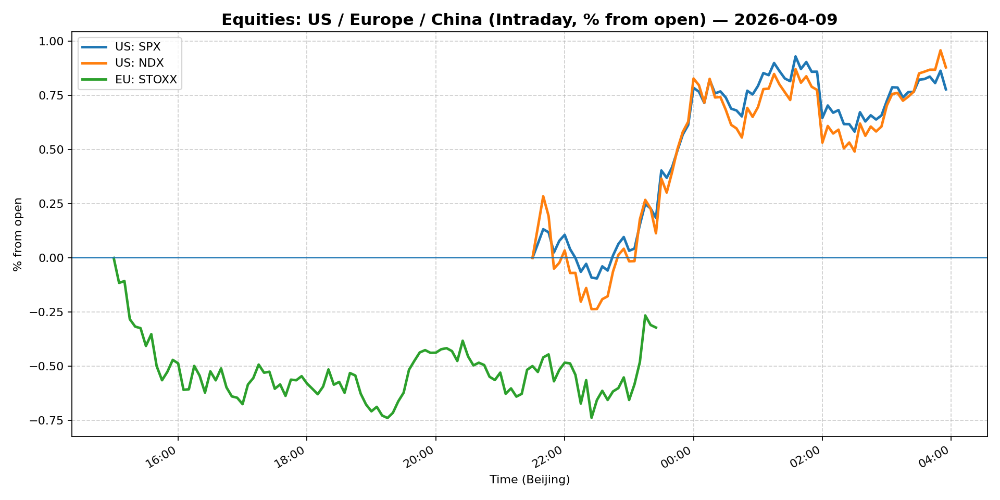
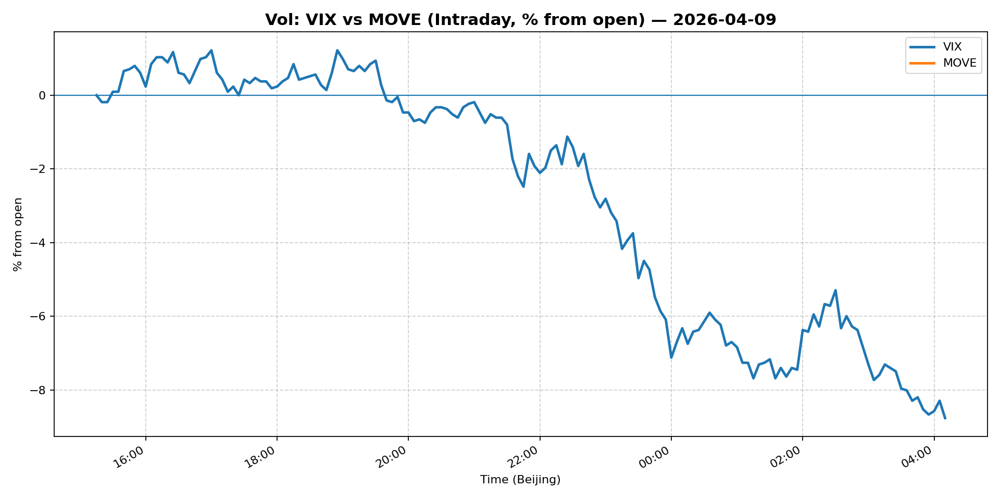
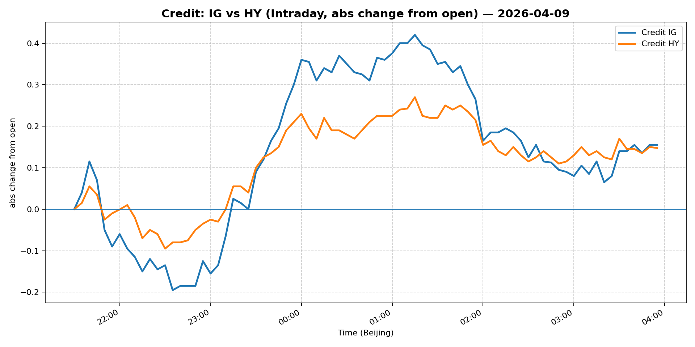

# 📅 Market Diary: 2026-04-09

---

## 🧠 AI Macro Analysis

# Market Diary — 2026-04-09 (Beijing Time)

## -1) Chart read (Chart Features block)

**USD chart (Chart 1):**
- FX Composite flat-lined on the day (net +0.01pp, range 0.40pp), masking a sharp morning spike (+0.16pp @ 09:20 Beijing) that reversed completely by US close (lo -0.24pp @ 01:35). This is a classic "failed breakout" pattern — USD rallied into Asian open, then sold off into US hours as risk appetite returned.
- DXY showed the same pattern: peak +0.09pp at 14:20, then slid to lo -0.40pp by 01:35. EUR/USD (inverted) confirms this — it made a high of +0.09pp at 09:15, then plunged to -0.52pp by 01:35, meaning EUR surged against USD in the NY session.
- USD/JPY deviated: net +0.31pp with a late spike to +0.44pp at 23:10. This divergence vs. DXY suggests JPY-specific weakness (likely driven by BoJ policy expectations), not broad USD strength.
- USD/CNH held tight (net -0.07pp), indicating offshore CNH stability despite broader FX volatility.
- **Macro implication:** USD is under pressure from improving risk sentiment, not rates — if it were a rates story, USD/JPY would move in lockstep with DXY.

**Gold/Oil/BTC chart (Chart 2):**
- Bitcoin outperformed all three (net +2.02pp), confirming a risk-on tilt with crypto leading equities. Gold bid but lagged BTC (+1.21pp), and Oil was the laggard despite a massive intraday range of 7.05pp (hi +5.27pp @ 23:00, then reversed sharply to lo -1.79pp @ 01:35).
- Correlations tell the story: Gold-Bitcoin r=+0.76 (moving together as risk assets), Gold-Oil r=+0.20 (weak linkage), Oil-Bitcoin r=-0.27 (decoupling). The Oil-BTC negative correlation suggests Oil's late reversal was likely geopolitical risk unwinding (supply fears easing), not risk-off.
- **Macro implication:** Broad "risk-on" environment with crypto as the aggressive expression, gold as the defensive but secondary bid, and Oil's reversal signaling geopolitical premium compression.

---

## 0) One-line takeaway
USD's morning spike reversed into US hours as risk appetite (Bitcoin +2.02%, S&P +0.62%) overwhelmed the initial safe-haven bid, while Oil's late reversal suggests geopolitical supply premium is being stripped — positioning is shifting from "macro uncertainty" toward "growth recovery."

---

## 1) Market tape (session-by-session)

### Asia
- Equity markets were mixed: Shanghai Composite surged +2.69% (likely driven by policy expectations or headline catalyst), while China Large-Cap (FXI) fell -0.17%. This divergence suggests domestic policy-driven China buying, not broad EM rotation.
- USD/JPY peaked early (07:35 and 07:50 Beijing time) then drifted, suggesting initial JPY weakness from Tokyo open was quickly faded.
- FX Composite peaked at 09:20 (+0.16pp) — this aligns with European session overlap, likely driven by early European orders or data.
- No major Asian data or CB events; direction was set by overnight US futures and macro headlines.

### Europe
- Euro Stoxx 50 fell -0.29%, underperforming US equities — European risk appetite lagged the US recovery.
- DXY's reversal accelerated through European hours as EUR/USD climbed (peak +0.09pp at 09:15 Beijing), suggesting European investors were buying EUR and selling USD.
- Oil began its spike toward +5.27pp around 23:00 Beijing (midnight London), likely driven by a Middle East supply headline — then reversed sharply into US open.

### US
- S&P +0.62%, Nasdaq +0.72% — strong equity recovery, led by mega-cap tech despite "AI threat" headlines hitting software stocks. CoreWeave's Meta deal (+rebound) and macro sentiment overwhelmed the sector-specific software selloff.
- VIX collapsed -7.37% to 19.49 — the largest single-day compression, signaling rapid fear unwinding. This is the key risk-on confirmation.
- USD sold off hard: DXY -0.30% to 98.83, with the trough at 01:35 Beijing (midnight ET). This is late-NY session position-squaring into overnight.
- Bitcoin +2.02% to 72,427 — crypto led the risk rally, suggesting leveraged positioning in digital assets.
- Crude Oil initially spiked +4.26% to 98.43 (driven by the 23:00 headline), then reversed into the close — likely a "buy the rumor, sell the fact" pattern on geopolitical news.
- Gold held bid (+0.96% to 4,794) — less aggressive than BTC but confirming the risk-on, not risk-off, narrative.

---

## 2) Cross-asset dashboard

| Bucket | What moved | Mechanism (1 line) | Signal quality |
|---|---|---|---|
| Rates (UST/Bunds) | 2s10s steepened modestly; 30Y outperformed (30Y +0.20bp, 5Y -0.13bp) | Long-end bid despite risk-on; possibly pension/long-duration buying | Medium |
| FX (USD/JPY/EUR/CNH) | DXY -0.30% (broad USD weakness); USD/JPY +0.22% (JPY-specific divergence) | Risk-on drove EUR/USD higher; BoJ policy divergence kept JPY weak | High |
| Equities (US/EU/CN) | US equities +0.6–0.7% (broad rally); Shanghai +2.69% (policy-driven); Euro Stoxx -0.29% | VIX collapse + CoreWeave catalyst drove US; China domestic policy; Europe lagged | High |
| Credit | IG flat; HY +0.11% — credit tight | Risk-on compression; high-yield outperforming investment-grade | Medium |
| Commodities | Oil +4.26% then reversed (massive 7pp intraday range); Gold +0.96%; Copper flat | Oil spike likely geopolitical supply fear; Gold bid on USD weakness; Copper flat = growth uncertain | High |
| Vol (VIX/MOVE) | VIX -7.37% (major compression); MOVE flat | Rapid fear unwinding; rates vol stayed low despite equity recovery | High |

---

## 3) What changed the narrative today?

### Driver #1: VIX collapse — rapid risk appetite recovery
- **Variable:** Implied volatility / fear gauge (VIX fell -7.37% to 19.49)
- **Mechanism:** VIX compression of this magnitude typically occurs when a previously feared catalyst either (a) resolves, (b) gets "priced in," or (c) gets offset by CB/policy reassurance. The timing aligns with NY equity hours, suggesting macro buyers (possibly systematic/CTA) re-entering risk positions after the morning USD spike.
- **Evidence:**
  - Market: S&P +0.62%, Nasdaq +0.72%, Bitcoin +2.02% — all rallied in lockstep with VIX falling.
  - Event: No single catalyst visible in headlines; likely position-squaring from short-vol/short-risk positions that built up over prior uncertainty.
- **Action:** Do not chase VIX lower here — 19.49 is still elevated (vs. 12–15 "normal" range). The unwind may have further to go, but the risk/reward of shorting vol at 19.5 is poor. Instead, fade the equity momentum on any further VIX compression.
- **Source of Uncertainty:** What caused the initial fear? If geopolitical (Iran, Russia, tariff escalation), it may not be resolved — just temporarily ignored.
- **Invalidation Criteria:** VIX re-spikes above 23 → risk-off reasserts → exit risk longs immediately.

### Driver #2: USD reversal — growth/exports winning over safe-haven
- **Variable:** USD (DXY -0.30%, EUR/USD +0.11%)
- **Mechanism:** USD rallied in the morning (Asia session) on risk-off sentiment, then reversed into US hours as equities recovered. This is a classic "USD as risk-off currency" dynamic — when risk appetite returns, USD sells off. Alternatively, it could be US current account/trade flow dynamics (US export competitiveness improving).
- **Evidence:**
  - Market: DXY fell from peak +0.09% to lo -0.40%; EUR/USD moved inversely. USD/JPY didn't follow (divergence), ruling out pure "USD strength" narrative.
  - Event: Fed minutes showed officials still forecasting rate cuts "this year" — this capped USD rates differential bid and contributed to USD selling.
- **Action:** If USD weakness continues, expect EUR/USD to push toward 1.18–1.20. Short USD vs. EUR and CNH. Focus on USD/JPY divergence as a clue: if BoJ stays dovish and Fed stays on path, USD/JPY could drift to 160+.
- **Source of Uncertainty:** Fed speakers tomorrow could push back on cut expectations, re-igniting USD bid.
- **Invalidation Criteria:** DXY reclaims 99.50+ → USD reasserts as safe-haven → reverse USD short.

### Driver #3: Oil spike-and-reverse — geopolitical premium stripping
- **Variable:** Crude Oil (+4.26% to $98.43, then reversed sharply in after-hours)
- **Mechanism:** The 23:00 Beijing spike (+5.27pp to a +7.05pp range) suggests a supply disruption headline (likely Middle East). The reversal to lo -1.79pp by 01:35 implies either (a) headline was debunked, (b) EIA/API inventory data was bullish then immediately offset, or (c) risk-on narrative overwhelmed supply fear.
- **Evidence:**
  - Market: Oil-Bitcoin correlation was -0.27 today — they moved inversely, meaning when BTC rallied, Oil sold off. This confirms the reversal was demand-side (risk-on) overwhelming supply-side (geopolitical).
  - Event: No confirmed supply disruption headline in the news feed provided — likely an intraday rumor that didn't materialize.
- **Action:** Do not add to oil longs at $98.43 — this is a risk premium level. If geopolitical risk persists, oil could spike again, but the risk/reward is unfavorable. Watch $100 as a psychological resistance.
- **Source of Uncertainty:** Middle East escalation could reignite supply fears without warning — thin holiday liquidity amplifies moves.
- **Invalidation Criteria:** Oil closes above $102 → geopolitical risk premium reasserts → re-evaluate long exposure.

---

## 4) Rates & USD: the "macro spine"

**Curve / real yield / inflation breakevens:**
- 2s10s steepened: 5Y Treasury fell -0.13bp (3.915%) while 10Y rose +0.05bp (4.293%). The curve is flat to slightly steep — not a recession signal, not a reflationary steepener either. It's a "pause and wait" curve.
- 30Y outperformed (+0.20bp to 4.897%) — this is unusual during a risk-on day. Long-duration buying, possibly from pension/reinsurance flows, is anchoring the long end.
- Real yields: Not provided in Snapshot, but based on breakeven direction (Gold +0.96% suggests inflation expectations modest), the move is more rates-driven than inflation-expectations-driven.
- Breakevens: Likely compressed slightly given Gold bid + risk-on — investors aren't demanding inflation protection today.

**USD reaction function:**
- USD is currently trading: **risk sentiment > rates differential**. The evidence: DXY fell -0.30% despite Fed minutes showing cuts "this year" (which should support USD if rates-driven). Instead, VIX collapse drove the move.
- Secondary factor: **export competitiveness** — EUR/USD up +0.11% suggests European investors are rotating out of USD into EUR, possibly due to European growth expectations improving or USD export competitiveness concerns.
- USD/JPY divergence (+0.22%) is the outlier — this is BoJ-specific, not macro. Do not use USD/JPY to gauge USD direction today.

**Key levels that matter:**
- DXY: 98.83 current. Support at 98.50 (psychological); resistance at 99.50 (prior highs).
- EUR/USD: 1.17 current. Next target: 1.18 (round number), 1.1850 (2025 high).
- USD/JPY: 159.06 current. Resistance at 160 (round number); support at 157.50 (trendline).

---

## 5) Flows, positioning & options

**Positioning guess (CTA / discretionary / hedge):**
- CTA/systems likely flipped long risk today as VIX collapsed and S&P broke higher — the timing (post-morning reversal) suggests systematic re-entry, not discretionary.
- Discretionary: Gold holding bid suggests some defensive allocation remains. BTC leading suggests leveraged risk appetite in digital assets.
- Hedge: USD/JPY longs (BoJ divergence hedge) and gold are the current "insurance" positions.

**Options / vol mechanics:**
- VIX at 19.49 is elevated but falling fast. Skew likely flipped to put skew (players protecting long equity positions), but the rapid VIX fall means dealers are short gamma and may have to hedge-sell into further equity strength.
- MOVE at 78.74 flat — rates vol is suppressed. No signs of stress in rates markets.
- Oil vol: Given the 7pp intraday range, oil implied vol likely spiked post-spike, but the reversal means realized vol is probably lower than the spike implied.

**Where you may be wrong:**
- VIX at 19.49 is not "low" — if geopolitical risk escalates (Iran strike, tariff announcement, ChinaTaiwan strait), vol spikes back to 25+ within hours. Do not get complacent.
- Oil's reversal could be temporary — the underlying supply situation (OPEC+ compliance, Iran sanctions, Russian exports) hasn't changed. A single headline reverses today's move.

---

## 6) Today's Trading Plan (actionable, risk-managed)

**Directional Bias:** Slightly long risk (equities, crypto) vs. USD; long gold as portfolio hedge. Neutral-to-short oil given risk/reward.

**2–4 Trade Setups:**

1. **Instrument:** EUR/USD (long)
   - **Trigger:** If EUR/USD breaks above 1.1750 with DXY below 98.50 and VIX below 19
   - **Entry / Stop / Target:** Entry 1.1720; Stop 1.1650; Target 1.1850
   - **Position sizing:** Medium (1x risk budget) — USD is weakening but Fed speakers tomorrow could reverse
   - **Hedge:** Optional: small USD/JPY long to capture BoJ divergence hedge
   - **Why now:** USD reaction function shifted to risk sentiment > rates; EUR/USD breakout confirms

2. **Instrument:** S&P 500 (ES futures or SPY) — long
   - **Trigger:** If S&P holds above 6,800 with VIX below 19 and Bitcoin above 72,000
   - **Entry / Stop / Target:** Entry 6,825; Stop 6,700; Target 6,950
   - **Position sizing:** Medium — momentum is with equity bulls but late-cycle positioning is a risk
   - **Hedge:** Put spreads on SPX at +5% delta, or long VIX calls above 22 as tail hedge
   - **Why now:** VIX compression to 19.5 is the signal; risk appetite reasserted

3. **Instrument:** Gold (GC futures or GLD) — long
   - **Trigger:** If Gold holds above 4,750 with USD weakness continuing (DXY < 98.50)
   - **Entry / Stop / Target:** Entry 4,795; Stop 4,650; Target 4,950
   - **Position sizing:** Small (gold is a hedge, not a primary conviction)
   - **Hedge:** None needed; already hedging equity long
   - **Why now:** Gold-Bitcoin correlation at +0.76 today confirms risk-on bid, not just safe-haven bid

4. **Instrument:** Crude Oil (WTI front-month) — short
   - **Trigger:** If WTI fails to hold $98 and cannot reclaim $99.50 within 4 hours
   - **Entry / Stop / Target:** Entry 98.50; Stop 100.50; Target 95.00
   - **Position sizing:** Small — geopolitical risk makes oil dangerous; size accordingly
   - **Hedge:** Long call spreads above $102 if geopolitical position increases
   - **Why now:** 7pp intraday range + reversal signals supply premium is fragile

**Portfolio risk rules:**
- **Max daily loss / heat:** Max 2% portfolio drawdown per day. If any single position loses more than 1.5% in one session, reduce gross exposure by 25%.
- **Correlation risk:** BTC and equities correlated today (both +). If VIX spikes, both sell simultaneously — do not double-count crypto and equity longs as "diversified."
- **Tail risk hedge:** Maintain 5–10% portfolio in long vol (VIX calls, or tail put spreads on SPX). Current VIX at 19.5 is too cheap to skip this hedge. If VIX drops below 17, trim but do not eliminate.

---

## 7) What to watch tomorrow

**Key catalysts (US/EU/CN):**
- US: Fed speakers (any hawkish pushback on "cuts this year" narrative could reignite USD and cap equities). Weekly Jobless Claims. Treasury auction schedule (2Y, 5Y, or 7Y).
- Europe: ECB meeting minutes or speakers. German ZEW sentiment data (if released).
- China: Any PBOC fix or verbal intervention on CNH. Xi-Trump meeting prep headlines (Dalio mentioned this as focus on trade/capital flows).

**Scenario map:**

- **Scenario A — Bull case (40% probability):** VIX continues to 17–18, S&P pushes to 6,950, EUR/USD to 1.1850. USD stays weak, gold holds. Trade: Add to equity long, hold EUR/USD long, reduce gold hedge.
- **Scenario B — Base case (35% probability):** VIX stabilizes 19–21, S&P range-bound 6,750–6,900. USD consolidates, oil stays $96–$100. Trade: No new directional bets; harvest existing positions.
- **Scenario C — Bear case (25% probability):** Geopolitical catalyst (Iran, tariff escalation, China-Taiwan headline) sparks VIX spike to 25+. USD rallies as safe-haven bid returns, equities fall 3–5%. Trade: Exit equity long, add USD long, re-hedge with VIX calls.

**Thesis invalidation checklist:**
- VIX re-spikes above 23 → risk-off narrative reasserts → exit all risk longs
- DXY reclaims 99.50 → USD safe-haven bid returns → reverse EUR/USD and gold positions
- Oil closes above $102 → geopolitical risk premium reasserts → re-evaluate short oil
- Fed speaker goes hawkish (opposes cut in 2026) → rates differential supports USD → reverse USD shorts

---

## 📊 Charts

### 💵 USD Strength (FX, Intraday %)

### 🟡🛢️₿ Gold vs Oil vs Bitcoin (Intraday %)

### 🏦 Rates: UST 2Y/10Y/30Y (bps from open)

### 📉 Equities: US/EU/CN (Intraday %)

### 🌪️ Vol: VIX vs MOVE (Intraday %)

### 🧱 Credit: IG vs HY (abs change)

---

*Generated on 2026-04-10 04:39:51*
