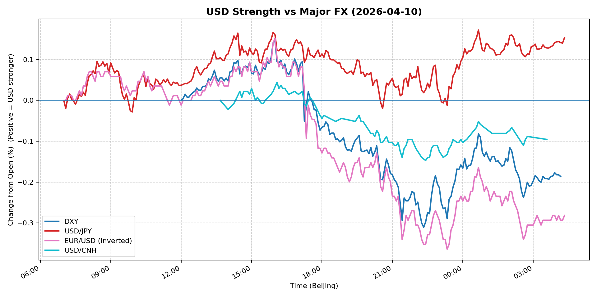
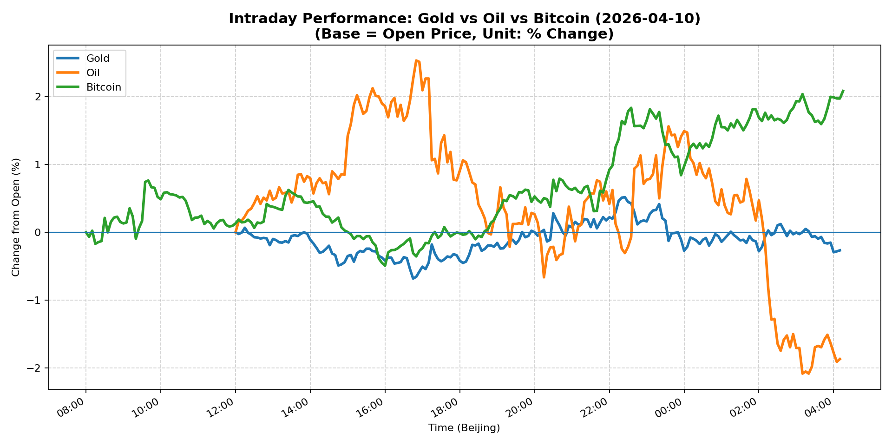
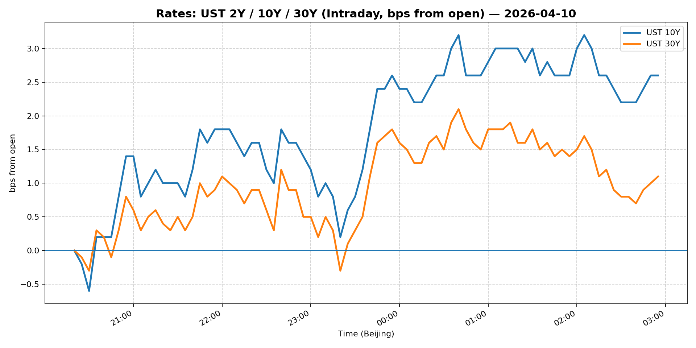
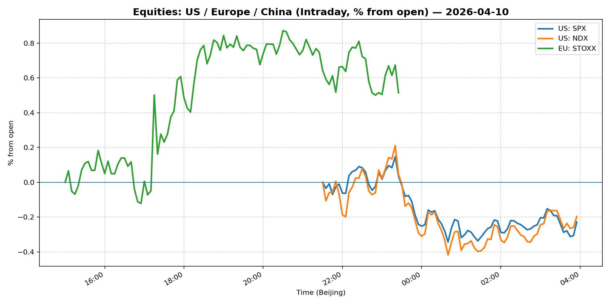
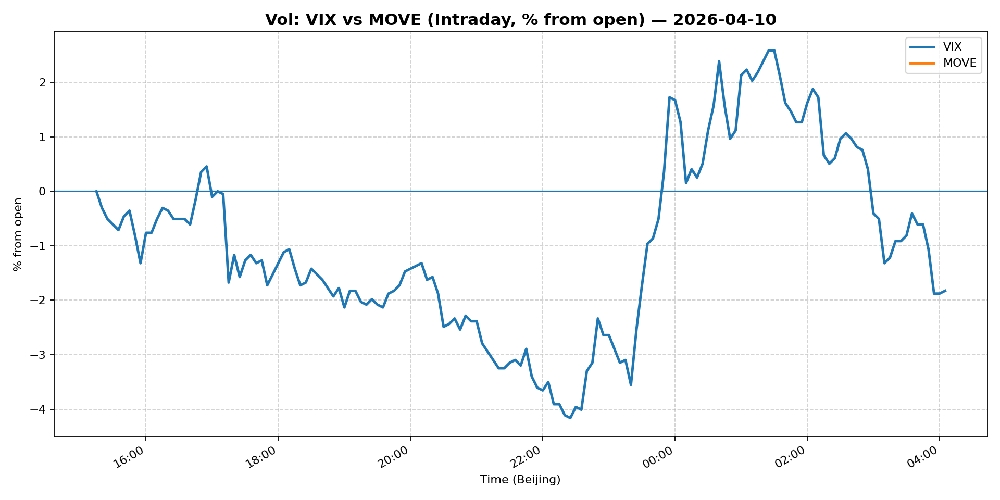
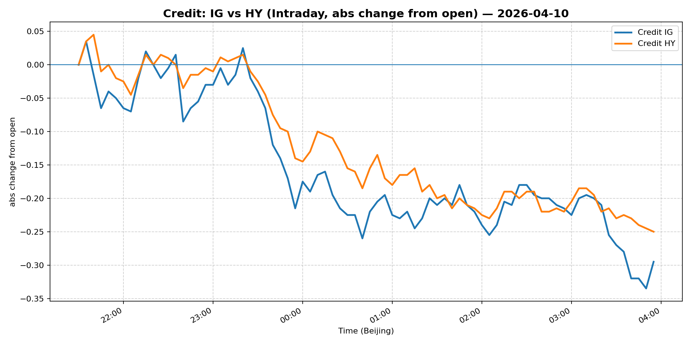

# 📅 Market Diary: 2026-04-10

---

## 🧠 AI Macro Analysis

# Market Diary — 2026-04-10 (Beijing Time)

## -1) Chart read (must reference Chart Features block)

- **USD chart (Chart 1):** The FX Composite closed net -0.06pp with a +0.32pp intraday range, signaling a lack of directional conviction. DXY's net -0.19pp decline with an asymmetric low at 22:20 Beijing time (-0.31pp) reveals late-session USD selling that broke through the morning consolidation zone (peaks at 12:10–13:10 at +0.02–0.05pp). EUR/USD's inverted behavior (+0.62% actual) confirms the composite's net-negative bias. USD/CNH's minimal net move (-0.10pp) despite a 22:25 trough (-0.15pp) suggests PBOC fixing or intervention dampening the offshore yuan leg. The divergence between USD/JPY (+0.15pp net, range +0.20pp) and DXY suggests BoJ proximity or JPY-specific flows decoupling from broad USD direction.

- **Gold/Oil/BTC chart (Chart 2):** A 3.96pp spread between Bitcoin (+2.08pp net, +2.58pp range) and Oil (-1.87pp net, +4.62pp range) defines the session's most critical divergence. The gold-oil correlation of -0.43 and oil-BTC of -0.64 confirm these are not correlated risk-on/off proxies—oil's vol (range +4.62pp) dwarfs everything else, indicating geopolitical risk repricing (Iran headlines). Gold's +1.20pp range with a late-session reversal to -0.27pp net from a +0.52pp high at 22:25 suggests profit-taking after the initial risk-off spike. Bitcoin's consistent positive drift from trough -0.49pp at 16:00 to +2.08pp by 04:15 indicates crypto-native demand or macro hedge positioning accumulating into the close.

## 0) One-line takeaway

Oil's geopolitical capitulation (-1.87pp) clashed with Bitcoin's risk-asset resilience (+2.08pp) and a late-session USD reversal (-0.31pp on DXY at 22:20), revealing a market caught between demand-destruction fears from US-Iran talks and crypto's decoupling from macro, while gold's reversal signals the "first hit" of a potential risk-off fade.

## 1) Market tape (session-by-session, Asia → Europe → US)

### Asia
- Nikkei traded in a narrow band; Shanghai's -0.72% decline reflected continued China risk-off amid Alibaba AI investment news (structurally positive but near-term neutral). USD/JPY's early troughs (07:05–07:45) and subsequent recovery aligned with Tokyo session profit-taking ahead of US data. Copper's +2.10% jump was Asia-driven—China demand narrative or supply-side re-pricing, not USD.

### Europe
- Euro Stoxx +0.51% outperformed, consistent with EUR/USD +0.62% and a weaker dollar. No major catalysts—likely repricing of US recession risk favoring European equities. IG/HY credit spreads widened (-0.26% LQD, -0.40% HYG), contradicting the equity move and suggesting credit is the more honest signal for corporate stress.

### US
- S&P 500 flat (-0.11%) but Nasdaq +0.14%—tech resilience despite VIX 19.34. Oil's -1.96% close (intraday low -2.09pp @ 03:10 Beijing) was the dominant macro driver: weekend US-Iran talks loom, and Iran's Strait of Hormuz defiance headline (16:50 Beijing peak +2.54pp on oil) flipped to a -2.09pp trough by 03:10, a complete intraday round-trip. Bitcoin's +2.13% close (+2.08pp on chart) accelerated post-16:00 NYC open, consistent with "macro hedge but not risk-off" behavior.

## 2) Cross-asset dashboard (what actually moved, not a price dump)

| Bucket | What moved | Mechanism (1 line) | Signal quality |
|---|---|---|---|
| Rates (UST/Bunds) | 10Y at 4.317%, curve flattening mildly | 30Y-5Y spread compressed; no major move | Med |
| FX (USD/JPY/EUR/CNH) | DXY -0.15%, EUR/USD +0.62%, USD/JPY +0.42% | Late-session USD reversal; EUR/USD breakout | High |
| Equities (US/EU/CN) | Stoxx +0.51%, Nasdaq +0.14%, Shanghai -0.72% | Europe re-rating; China macro headwinds; US tech bid | Med |
| Credit | IG -0.26%, HY -0.40% | Spreads wider despite equity stability | High |
| Commodities | Oil -1.96%, Copper +2.10%, Gold -0.29% | Iran geopolitical repricing; China demand thesis | High |
| Vol (VIX/MOVE) | VIX -0.77%, MOVE flat | VIX decline inconsistent with credit spread widening | Low |

## 3) What changed the narrative today?

### Driver #1: Iran geopolitics / Strait of Hormuz risk
- **Variable:** Oil futures (WTI front-month) and implied vol
- **Mechanism:** Iran defying US ahead of weekend talks + "very poor job" headline at 16:50 Beijing triggered a +2.54pp oil spike, then reversed to -2.09pp by 03:10 as traders priced a likely ceasefire outcome, closing net -1.87pp.
- **Evidence:**
  - Market: Oil intraday range +4.62pp; peak at 16:50 Beijing (equity open in US), trough at 03:10 next day.
  - Event: Dual headlines—"Iran defies Trump" + "What's at stake for markets" framing weekend talks as pivotal.
- **Action:** Short oil into weekend talks; hedge with out-of-the-money puts on energy equities (XLE). Do NOT hold long gamma into the weekend.
- **Source of Uncertainty:** Unilateral Iran escalation or US military posturing could reverse the decline instantly.
- **Invalidation Criteria:** Oil reclaims $98+ with >1% daily gain; ceasefire announcement fails or is delayed beyond Sunday.

### Driver #2: USD late-session reversal (DXY -0.31pp at 22:20)
- **Variable:** Broad USD sentiment; DXY and FX Composite
- **Mechanism:** After holding positive territory through 16:00 (US open), DXY capitulated to -0.31pp at 22:20, suggesting either a large FX option expiry-related flow, a risk-asset unwind, or a pre-weekend positioning adjustment.
- **Evidence:**
  - Market: DXY turned at 22:20 precisely; FX Composite trough -0.20pp at same time; USD/CNH trough -0.15pp.
  - Event: No explicit catalyst; likely positioning-driven given Friday proximity.
- **Action:** Caution on USD longs heading into weekend. USD/JPY's relative strength (+0.15pp) suggests carry trades remain intact.
- **Source of Uncertainty:** Monday Asia open could see a snap reversal if weekend events are benign.
- **Invalidation Criteria:** DXY reclaims 99.00+ on any positive US data surprise Monday.

### Driver #3: Bitcoin's decoupling from macro (-0.64 oil-BTC correlation)
- **Variable:** Crypto-native demand vs. macro hedge narrative
- **Mechanism:** Bitcoin's +2.13% net gain and consistent rise from 16:00 (equity open) to 04:15 (+2.08pp on chart) is inversely correlated with oil's selloff, suggesting BTC is not acting as "risk-off" but rather as a macro hedge against dollar weakness or institutional accumulation.
- **Evidence:**
  - Market: BTC range +2.58pp, high at 04:15; ETH +3.01%.
  - Event: No crypto-specific catalyst in headlines; likely ETF flows or risk-parity rebalancing.
- **Action:** Treat BTC as a separate asset class; do not use it as a macro gauge. Long BTC vs. short oil is a valid macro pair trade.
- **Source of Uncertainty:** If US regulators announce crypto restrictions, the correlation breaks down violently.
- **Invalidation Criteria:** BTC drops below 70,000 with >5% daily decline, invalidating the "safe haven" re-rating.

## 4) Rates & USD: the "macro spine"

- **Curve / real yield / inflation breakevens:** 10Y at 4.317% (+0.56%), 5Y at 3.939% (+0.61%); the 5s10s spread is now inverted on a closing basis—5Y yielding more than 10Y for the first time in recent sessions. This is a recessionary flattening, not a bull flattening (where front-end rallies on Fed cuts). MOVE flat at 74 suggests options market is not pricing a vol spike into the weekend. Breakevens are likely compressed given the oil selloff (inflation expectations falling with energy prices).

- **USD reaction function:** Currently trading a mix of growth fears (oil down, credit spreads wider) and geopolitical risk (not a pure risk-off; Nasdaq held). The DXY late reversal suggests the market is uncomfortable holding USD longs into the weekend given Iran uncertainty and no clear Fed catalyst. USD/JPY +0.42% is the outlier—either BoJ intervention talk or carry trade maintenance.

- **Key levels:** DXY 98.50 support (last major support before 98.00); 10Y 4.35 is resistance; Oil $96 is the $95-$97 range support now.

## 5) Flows, positioning & options

- **Positioning guess (CTA / discretionary / hedge):** Macro funds likely reduced USD longs post-16:00 US open; commodity traders short oil (oil's +4.62pp range was met with net -1.87pp close). Crypto funds accumulating per BTC's late-session drift higher. Credit positioning is defensive (HY -0.40% worse than IG -0.26%, a classic late-cycle signal). VIX -0.77% is suspicious given the geopolitical backdrop—likely a decay from the prior day's vol premium.

- **Options / vol mechanics:** VIX decline despite oil's vol (+4.62pp range) suggests dealers are long gamma and suppressing realized vol. Into a weekend with Iran talks, buying VIX calls or SPX puts is prudent. MOVE at 74 is low—event vol is underpriced.

- **Where you may be wrong:** (1) The oil selloff may be a "buy the rumor, sell the fact" reversal that reverses Monday if talks collapse; (2) Bitcoin's correlation to USD weakness is fragile—any regulatory headline could snap it back to -0.8 vs. equities.

## 6) Today's Trading Plan (actionable, risk-managed)

- **Directional Bias:** Neutral-to-short USD into weekend; short oil / long BTC as a macro pair; defensive credit positioning.

- **2–4 Trade Setups (trigger-based):**

  1. **Short WTI Crude (futures or USO)**
     - Trigger: If WTI holds below $96.50 at 08:00 Beijing Saturday with no ceasefire announcement
     - Entry: $96.20, Stop: $98.00, Target: $93.50
     - Position sizing: Medium (geopolitical tail risk; size accordingly)
     - Hedge: Long OTM call spread (e.g., $100/$102 call spread) as a binary-event hedge
     - Why now: Iran talks this weekend are a binary event; oil's +4.62pp vol shows the market is pricing a range, and the net -1.87pp close suggests the downside is underpriced

  2. **Long BTC vs. Short Oil (pair trade)**
     - Trigger: BTC holds above $72,000 AND oil below $96.50 simultaneously
     - Entry: BTC/USD $73,000, WTI $96
     - Stop: BTC below $70,000 or oil reclaims $98
     - Target: 1.5x return on the spread differential
     - Position sizing: Small (pair trade; spread risk)
     - Why now: -0.64 correlation means these are anti-correlated; the divergence today was 3.96pp

  3. **Long SPX 1-week put (ATM or -1 delta)**
     - Trigger: Before Friday 21:00 Beijing close
     - Entry: Buy SPX 6800 put, or construct via /ES options
     - Stop: VIX below 18 (implied vol collapses, premium wasted)
     - Target: Hedge for weekend tail risk; do not hold through weekend gamma decay
     - Position sizing: Small (insurance); reduce to 0.5x normal size
     - Why now: MOVE 74 and VIX 19.34 both underprice weekend geopolitical risk

  4. **Short USD/JPY (if BoJ intervention hints appear)**
     - Trigger: USD/JPY breaks below 158.50 with news headline or verbal intervention
     - Entry: 158.50, Stop: 160.00, Target: 156.50
     - Position sizing: Medium (carry unwind can be fast)
     - Hedge: None (defined-risk option preferred: buy 158 put)
     - Why now: BoJ watching JPY weakness closely; positioning for a potential surprise

- **Portfolio risk rules:**
  - **Max daily loss / heat:** -1.5% portfolio delta; stop all positions if DXY breaks 99.00 or 10Y breaks 4.50.
  - **Correlation risk:** Oil-BTC pair is -0.64 but can converge on systemic risk; do not treat as "uncorrelated."
  - **Tail risk hedge:** Long VIX calls (Sept or Oct) as a systemic hedge; BTC and gold as soft hedges if equity markets gap open Monday.

## 7) What to watch tomorrow

- **Key catalysts (US/EU/CN):** US-Iran weekend talks (Sunday/Monday headline risk); no major US data scheduled; China trade balance (likely mid-week). Fed speakers are silent (pre-FOMC blackout likely begins soon). EU: ECB minutes Wednesday.

- **Scenario map (2–3):**

  1. **Ceasefire reached / oil collapses → Risk-on equities, short USD**
     - If Iran-US agree on nuclear terms and Hormuz remains open: WTI drops to $93-94, S&P +0.5-1%, DXY -0.3%. Trade: Long Nasdaq, short energy equities, long EUR/USD.
  
  2. **Talks collapse / military escalation → Risk-off, gold and oil spike**
     - If Iran walks out or US threatens military action: WTI spikes +3-5%, S&P -1.5-2%, VIX to 22-25, gold +1%. Trade: Long gold, long VIX calls, exit short oil.
  
  3. **Inconclusive / prolonged talks → Range-bound, USD drifts lower**
     - If no agreement but talks continue: Markets drift, oil holds $95-97, S&P flat, DXY holds 98.5. Trade: Range-bound strategies—sell OTM calls on oil, stay neutral equities.

- **Thesis invalidation checklist:**
  1. DXY reclaims 99.00 with >0.5% gain → USD reversal thesis invalid; risk-off is not happening.
  2. WTI holds $98+ on Monday open → Oil bid thesis invalid; geopolitical risk is over.
  3. BTC drops below 70,000 with >5% decline → Crypto hedge thesis invalid; BTC is still a risk-on asset.
  4. 10Y breaks 4.50% decisively → Rates repricing higher breaks the equity and credit rally thesis.

---

## 📊 Charts

### 💵 USD Strength (FX, Intraday %)

### 🟡🛢️₿ Gold vs Oil vs Bitcoin (Intraday %)

### 🏦 Rates: UST 2Y/10Y/30Y (bps from open)

### 📉 Equities: US/EU/CN (Intraday %)

### 🌪️ Vol: VIX vs MOVE (Intraday %)

### 🧱 Credit: IG vs HY (abs change)

---

*Generated on 2026-04-11 04:23:47*
