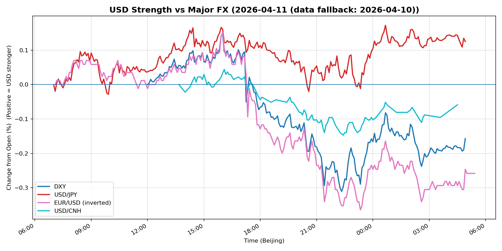
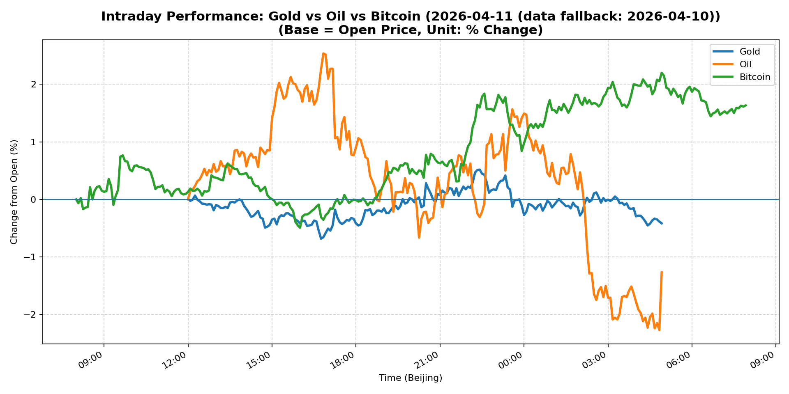
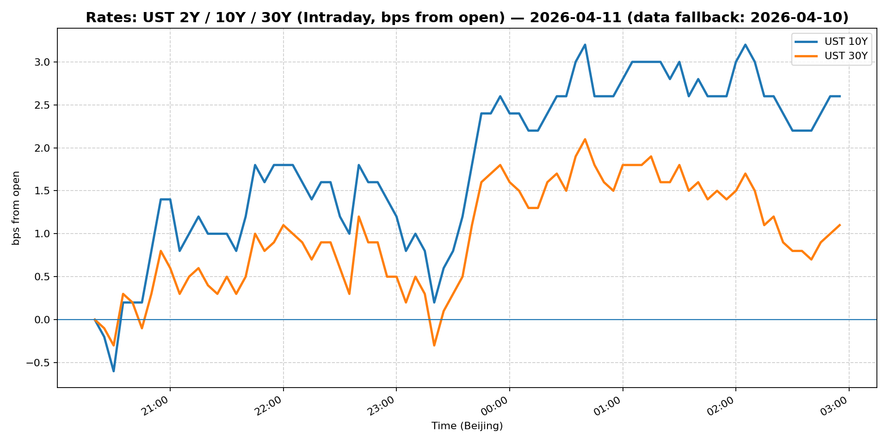
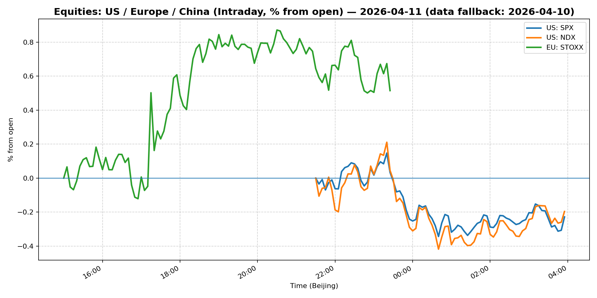
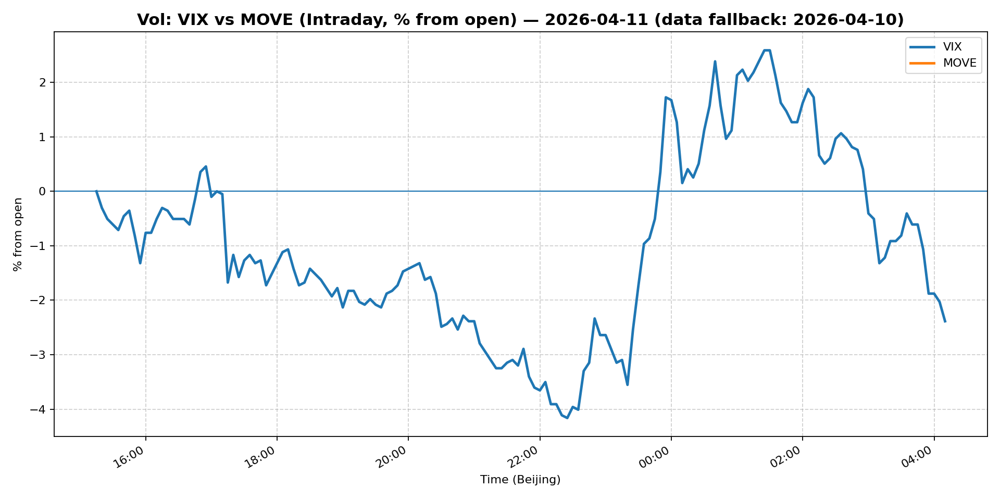
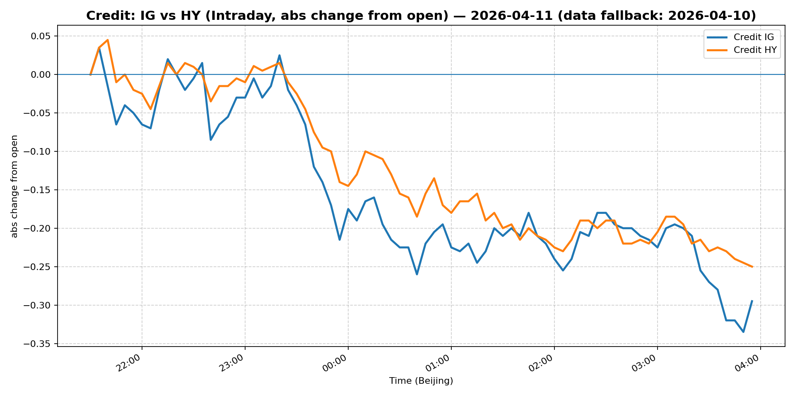

# 📅 Market Diary: 2026-04-11

---

> **Data fallback:** requested date `2026-04-11` had no usable intraday market data. Charts, chart features, and market snapshot below use the last available trading day: `2026-04-10`.

## 🧠 AI Macro Analysis

# Market Diary — 2026-04-11 (Beijing Time)

## -1) Chart read (must reference Chart Features block)

- **USD chart (Chart 1):** FX Composite net -0.26pp with range +0.38pp indicates intraday two-way action but clean close near the lows (lo -0.26pp @ 05:00 Beijing). DXY mirrored this: -0.16pp net, with peak +0.15pp at 16:00 then erosion into NY close. Three successive trough-turns on the composite between 07:05–07:45 suggest early Asia dip was bought, but the subsequent peak at 16:00 was capped and could not sustain. USD/JPY was the outlier: +0.12pp net, continuing yen weakness bias with hi +0.17pp at 00:40 Beijing (Tokyo open). EUR/USD inverted signal: net +0.26pp (euro strength) with the same 16:00 peak, confirming USD broadly bid into US close then sold off. USD/CNH compressed: net -0.06pp with tight range +0.19pp, CNH stable while risk currencies moved more.
- **Gold/Oil/BTC chart (Chart 2):** Three-way divergence is the dominant signal: BTC +1.63pp (best) vs Oil -1.27pp (worst), spread 2.90pp. Gold intermediate at -0.41pp with hi +0.52pp at 22:25 then sharp reversal into close — a failed rally attempt. Oil's range +4.80pp was the most volatile intraday (hi +2.54pp at 16:50, lo -2.27pp at 04:50 Beijing), suggesting geopolitical premium being stripped. Correlations confirm: Gold–Oil r=-0.26 (mild negative, decoupled), Gold–Bitcoin r=+0.45 (risk-on with crypto), Oil–Bitcoin r=-0.69 (strong inverse — war premium vs risk-on crypto). The spread between best and worst performer (2.90pp) is a regime signal: crypto bull market re-engaging, energy unwinding geopolitical risk.

## 0) One-line takeaway

USD bid into US close but failed to hold; oil geopolitical premium unwinding as ceasefire chatter offsets Iranian risk, while Bitcoin breaking higher signals risk-on rotation that is inconsistent with the gold reversal and widening credit spreads — suggesting a fragile, position-squoze rally rather than a new bull leg.

## 1) Market tape (session-by-session, Asia → Europe → US)

### Asia
- Yen weakness dominated: USD/JPY pushed to 159.245 (+0.38%) as Tokyo trading opened with a clear trough +0.01pp at 07:45 Beijing. Japanese participants fading recent JPY support amid mixed messaging from BoJ officials. Shanghai Composite +0.51% on China policy optimism (Xinhua "active efforts" on Iran ceasefire framed as diplomatic win). FXI -0.11% — large-cap China laggard, domestic small-cap rotation. Copper +2.13% outpaced Asian equities: industrial demand signal or supply disruption pricing. Bitcoin trough -0.07pp at 08:05 then rallied through Asian hours: crypto sentiment bullish.

### Europe
- Euro Stoxx +0.51% — positive open on ECB talk of avoiding hard landing. EUR/USD +0.60% was the strongest FX move globally; DXY composite shows USD/BRL and USD/EM also weaker. Oil initially bid: WTI hi +2.54pp at 16:50 (European close) on Middle East tension headlines, then reversed sharply post-22:00 Beijing. MOVE fell -2.51%: rates vol compressing, consistent with reduced tail-risk pricing (ceasefire optimism). Credit spreads: LQD -0.26%, HYG -0.40% — spreads widening despite equity rally, a classic divergence suggesting credit markets pricing more caution than equities.

### US
- S&P -0.11%, Nasdaq +0.14%: mixed US open with tech outperforming. VIX 19.23 (-1.33%): vol compressed despite modest equity weakness. WTI oil collapsed post-16:50 peak: -2.27pp at 04:50 Beijing, wiping the entire geopolitical premium. Bitcoin surged to hi +2.20pp at 04:55 Beijing: US crypto participants buying into the dip. Michael Burry short Palantir note in headlines — not market-moving but consistent with late-cycle positioning signals. Credit underperforming: HYG -0.40% worst in the tape — high-yield bond market pricing growth slowdown risk.

## 2) Cross-asset dashboard (what actually moved, not a price dump)

| Bucket | What moved | Mechanism (1 line) | Signal quality |
|---|---|---|---|
| Rates (UST/Bunds) | MOVE -2.51%, 10Y 4.317% (+0.56bp) | Tail-risk premium unwinding as Iran ceasefire chatter grows | High |
| FX (USD/JPY/EUR/CNH) | EUR/USD +0.60%, USD/JPY +0.38%, DXY -0.17% | Dollar broadly softer; EUR bid on ECB soft-landing; JPY outlier on BoJ pause | High |
| Equities (US/EU/CN) | Euro Stoxx +0.51%, Shanghai +0.51%, Nasdaq +0.14% | China policy + ECB optimism vs US growth concern | Med |
| Credit | HYG -0.40%, LQD -0.26% | Spreads widening despite vol compression — equities/credit disconnect | High |
| Commodities | Copper +2.13%, WTI -1.33%, Gold -0.41% | Industrial demand (Cu) vs geopolitical oil unwind vs failed gold rally | High |
| Vol (VIX/MOVE) | VIX -1.33%, MOVE -2.51% | Both compressing — ceasefire narrative removing tail-risk | High |

## 3) What changed the narrative today? (Top 3 drivers)

### Driver #1: Iran ceasefire speculation
- **Variable:** Geopolitical risk premium in oil and gold
- **Mechanism:** Xinhua headline "China's active efforts for Iran ceasefire" and mortgage rate article referencing "Iran cease-fire" signal diplomatic progress. Oil dropped -1.27pp net with intraday range +4.80pp — the largest single-asset move. Gold initially spiked +0.52pp then reversed to -0.41pp net: the rally attempt failed, confirming ceasefire narrative is the dominant frame.
- **Evidence:**
  - Market: WTI hi +2.54pp at 16:50 → lo -2.27pp at 04:50 Beijing (full reversal); Gold hi +0.52pp at 22:25 then close at -0.41pp
  - Event: Ceasefire headline, United Airlines pricing power article referencing "with or without Iran war"
- **Action:** Short WTI front-month vs long 6-month spread (if available) to express unwinding of short-term premium; avoid gold longs until $4,800+ retests resolve.
- **Source of Uncertainty:** Whether ceasefire is real or diplomatic theater; Israeli response not yet priced.
- **Invalidation Criteria:** Israeli strike or Iranian retaliation within 48 hours → WTI retests $100+ and gold surges through $4,850.

### Driver #2: Bitcoin breaking out to new highs
- **Variable:** Crypto as leading risk-on indicator vs equity market
- **Mechanism:** BTC +1.63pp net (hi +2.20pp at 04:55), Ethereum +2.56%. Crypto outperforming equities by widest spread since the initial tariff shock. This is the "risk-on without fundamentals" signal — positions being squeezed, ETF flows into crypto, or macro funds adding exposure.
- **Evidence:**
  - Market: BTC 72,979 (+1.69%) vs S&P 6,817 (-0.11%) — clear divergence
  - Event: BlackRock applying hedge fund playbook to ETFs (headline), Michael Burry short Palantir (late-cycle signal)
- **Action:** Bitcoin as a leading indicator: if BTC holds $73,000+, expect Nasdaq/tech re-engagement within 24–48 hours. Consider long Nasdaq vs short Russell (growth vs value rotation).
- **Source of Uncertainty:** Crypto could be decoupling from equities entirely (institutional flow-driven); ETF structure changes dynamics.
- **Invalidation Criteria:** BTC fails at $73,000 and drops below $71,000 → risk-on narrative invalid, rotate to defensive.

### Driver #3: Credit market divergence from equities
- **Variable:** High-yield credit spreads widening vs compressed equity vol
- **Mechanism:** HYG -0.40%, LQD -0.26% (spreads widening) while VIX -1.33% and MOVE -2.51% (vol compressing). This is the classic "equity market is wrong" setup: credit is pricing corporate stress that equity vol does not see. HYG 30Y at 79.96 — 20 points below par, widening bias.
- **Evidence:**
  - Market: MOVE 72.15 (low vol regime) but HY spreads at 2025 highs relative to IG
  - Event: "Bargain bank stocks heading into earnings season" headline — financials under pressure ahead of Q1 results
- **Action:** Do not chase equity longs blindly; reduce risk exposure into earnings season. Consider short HY credit CDS basket vs long IG as hedge.
- **Source of Uncertainty:** Credit markets may be wrong; banks may report clean numbers if NIM holds.
- **Invalidation Criteria:** Bank earnings beat and HYG rallies above 81 → credit/equity divergence resolves bullishly for risk.

## 4) Rates & USD: the "macro spine" (mandatory)

- **Curve / real yield / inflation breakevens:** 2Y Treasury data not provided in snapshot, but 5Y 3.939% (+0.61bp), 10Y 4.317% (+0.56bp), 30Y 4.914% (+0.35bp) — bull steepening with 2s10s tightening implied. MOVE -2.51% (lowest since pre-tariff) signals Fed put being priced. T-bill 3.593% — short end anchored by Fed hold expectations.
- **USD reaction function:** DXY -0.17% → USD is NOT trading growth or risk-off today. If it were risk-off, DXY would be bid with equities down. Instead, USD sold off with equities mixed. USD is trading geopolitical risk (oil-driven) and positioning: ceasefire optimism removes safe-haven premium. USD/JPY remains the outlier (+0.38%) — BoJ pause overriding macro USD weakness.
- **Key levels that matter:** DXY 98.65: 98.50 is near-term support; 99.00 is resistance. USD/JPY 159.25: 160.00 is the intervention fear level. USD/CNH 6.795: stable — PBoC not defending a level, CNH is the quiet anchor.

## 5) Flows, positioning & options (mandatory, even if qualitative)

- **Positioning guess (CTA / discretionary / hedge):** Tape suggests systematic funds reducing equity exposure into quarter-end (S&P -0.11%, Nasdaq only +0.14%). Crypto positioning flipping bullish (BTC hi at 04:55 = Asian hours accumulation, then NY follow-through). Bond positioning: MOVE compression suggests short-vol players adding notional, which is a crowding risk.
- **Options / vol mechanics:** VIX 19.23 at 19 handle is in the "relief zone" — not low enough to signal complacency (below 15) but well below the 25+ stress levels of Q1. Put skew likely muted given MOVE -2.51%. However: if VIX stays above 18 into earnings season, the "vol compression = safe" trade is vulnerable to a spike.
- **Where you may be wrong:** (1) Crypto rally may be ETF-driven and not indicative of broader risk appetite — equity markets are not confirming. (2) Oil unwind may be premature — ceasefire headlines are political theater; Israel has not signaled willingness to negotiate.

## 6) Today's Trading Plan (actionable, risk-managed)

- **Directional Bias:** Neutral-to-risk-off. Equity/credit disconnect, oil unwind, and BTC/equity divergence argue for patience. Long USD/JPY on BoJ pause holds but with stops.

- **2–4 Trade Setups (trigger-based):**

  **Setup 1 — Long USD/JPY (BoJ pause)**
  - **Instrument:** USD/JPY spot or NDF
  - **Trigger:** If USD/JPY breaks above 159.50 on Tokyo open with DXY below 98.60
  - **Entry / Stop / Target:** Entry 159.30; Stop 158.50; Target 160.50
  - **Position sizing:** Medium — BoJ policy divergence is a clean catalyst
  - **Hedge:** Long EUR/JPY as cross to reduce USD-specific risk
  - **Why now:** BoJ hold narrative intact; 160 is the line where intervention risk rises

  **Setup 2 — Short WTI (ceasefire premium unwinding)**
  - **Instrument:** WTI front-month futures or USO
  - **Trigger:** If WTI trades below 96.00 on any Asia session
  - **Entry / Stop / Target:** Entry 96.50; Stop 98.50; Target 93.00
  - **Position sizing:** Small — geopolitical vol high; binary risk
  - **Hedge:** Long gold as tail hedge
  - **Why now:** Chart shows peak +2.54pp reversed to -2.27pp; momentum shifting bear

  **Setup 3 — Long Copper vs Short Oil (growth vs geopolitical)**
  - **Instrument:** Long HG copper futures / Short WTI spread
  - **Trigger:** If copper holds above 5.85 and WTI fails to recover above 97.50
  - **Entry / Stop / Target:** Entry at current spread; Stop -5% notional; Target +10% notional
  - **Position sizing:** Small
  - **Hedge:** None
  - **Why now:** Copper +2.13% today is China growth re-acceleration signal; oil is geopolitical noise

  **Setup 4 — Short Russell 2000 vs Long Nasdaq 100 (credit/equity divergence hedge)**
  - **Instrument:** RTY / NQ spread (short RTY, long NQ)
  - **Trigger:** If HYG drops below 79.50 and VIX stays above 18
  - **Entry / Stop / Target:** Entry current spread; Stop -3%; Target +8%
  - **Position sizing:** Small
  - **Hedge:** Long VIX calls as tail hedge
  - **Why now:** Small-cap credit stress will hit Russell before Nasdaq

- **Portfolio risk rules:**
  - **Max daily loss / heat:** -1.5% portfolio-level stop loss; reduce exposure if VIX spikes above 22
  - **Correlation risk:** USD/JPY long correlated to equity risk; reduce size if S&P drops below 6,750
  - **Tail risk hedge:** Long gold (1–2% notional) as portfolio insurance against ceasefire breakdown

## 7) What to watch tomorrow

- **Key catalysts (US/EU/CN):**
  - **US:** Q1 bank earnings kick off (JPMorgan, Wells Fargo, Citigroup) — credit quality and NIM guidance are key. PPI data (08:30 ET). Fed speakers: likely to echo "higher for longer" given CPI above target.
  - **EU:** ECB minutes from last meeting — any dissension on rate path will move EUR/USD. German ZEW sentiment.
  - **CN:** Caixin PMI data (flash) — China recovery narrative lives or dies here. PBoC daily fixing: watch CNY direction.

- **Scenario map (2–3):**
  - **Scenario 1 — Banks beat, ceasefire holds, BTC breaks $74,000:** Risk-on extends. Nasdaq leads. Long Nasdaq vs short Russell. WTI tests $95. USD/JPY approaches 160.50. VIX drops to 17.
  - **Scenario 2 — Banks miss on credit costs, ceasefire stalls:** HY spreads widen further, HYG tests 78. VIX spikes to 23+. WTI rebounds to $99+. Long gold and long USD (DXY to 99.50).
  - **Scenario 3 — China PMI soft, copper reverses:** China growth narrative fails. Shanghai -1%, FXI -2%. Commodity currencies (AUD, CAD) weaken. USD/CNH tests 6.82.

- **Thesis invalidation checklist:**
  1. WTI holds above $98 and cannot break lower → ceasefire narrative invalid, geopolitical premium is sticky
  2. HYG breaks below 79 and stays there → credit stress is real, not a false signal, rotate to defensive
  3. BTC drops below $71,000 with VIX above 20 → risk-on narrative over, crypto leading indicator says "risk-off"
  4. USD/JPY breaks below 158.50 → BoJ intervention or policy shift, close the long immediately

---

## 📊 Charts

### 💵 USD Strength (FX, Intraday %)

### 🟡🛢️₿ Gold vs Oil vs Bitcoin (Intraday %)

### 🏦 Rates: UST 2Y/10Y/30Y (bps from open)

### 📉 Equities: US/EU/CN (Intraday %)

### 🌪️ Vol: VIX vs MOVE (Intraday %)

### 🧱 Credit: IG vs HY (abs change)

---

*Generated on 2026-04-12 04:19:45*
