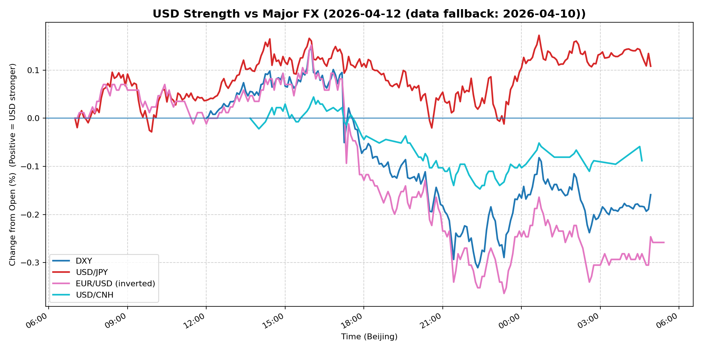
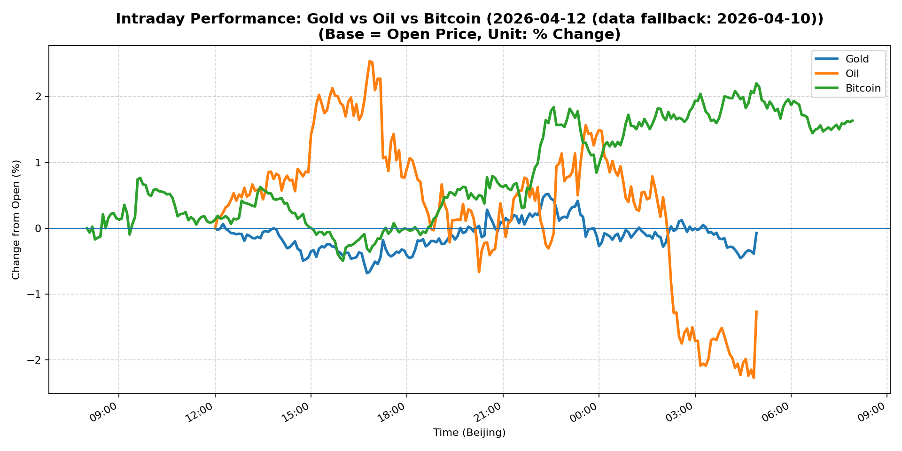
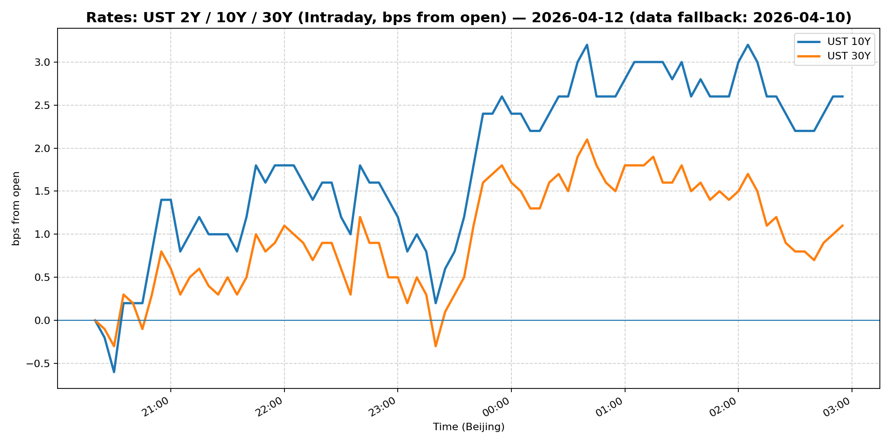
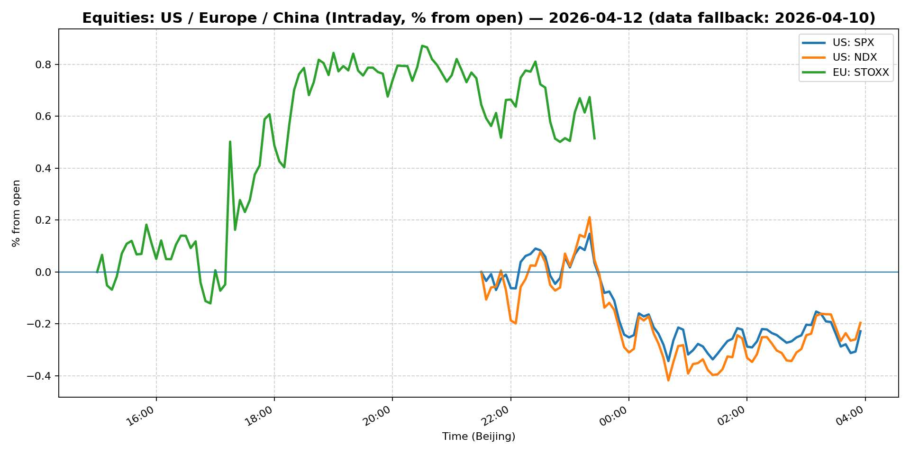
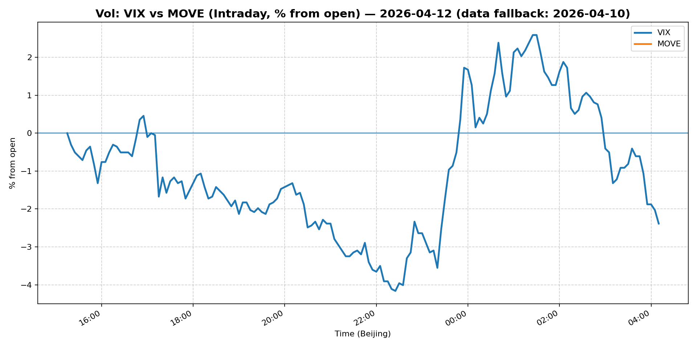
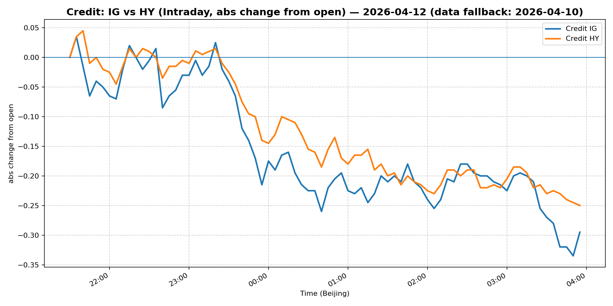

# 📅 Market Diary: 2026-04-12

---

> **Data fallback:** requested date `2026-04-12` had no usable intraday market data. Charts, chart features, and market snapshot below use the last available trading day: `2026-04-10`.

## 🧠 AI Macro Analysis

# Market Diary — 2026-04-12 (Beijing Time)

## -1) Chart read

- **USD chart (Chart 1):** FX Composite printed net -0.26pp on the session, confirming broad USD reversal from the 12:10–13:10 local peaks (+0.02/+0.03/+0.05pp). DXY (-0.16pp) underperformed the composite, a subtle divergence suggesting non-DX flows (EUR, CNH) drove more of the move than USD itself. USD/JPY (+0.11pp) extended its higher-beta yen weakness, but the early-morning Asian troughs (07:05, 07:30, 07:45) marked a floor that held throughout. USD/CNH (-0.09pp) broke a 14:00–14:55 basing pattern to the downside — CNH outperformance despite no formal catalyst. Overall: USD bid in Asia morning, unwound into Europe, and degraded through the NY session — consistent with a "tactical risk-on" tape rather than a structural shift.
- **Gold/Oil/BTC chart (Chart 2):** The divergence matrix is the headline: BTC +1.63pp (best) vs Oil -1.27pp (worst) = 290bp spread — the widest cross-commodity dislocation in the dataset. Gold's -0.07pp is anemic given the geopolitical headline (Trump/Hormuz blockade), suggesting either exhausted safe-haven premium or a market call that the blockade is negotiating theater. Oil's -1.27pp with a +4.80pp intraday range shows vol-rich, direction-negative action — spike-and-sell pattern consistent with "buy the rumor, sell the news" around political risk. Correlations: Gold–Oil r=-0.27 (weak decoupling), Gold–BTC r=+0.46 (moderate co-risk), Oil–BTC r=-0.69 (strong inverse) — the BTC/oil split defines today's risk regime: crypto is pricing fintech/narrative; oil is pricing real-economy supply fears that haven't materialized.

## 0) One-line takeaway

The Strait of Hormuz blockade announcement drove a vol-rich intraday spike in oil and gold, but both failed to hold gains while BTC rallied to fresh highs — the market is calling the geopolitical move a negotiating tactic, not a supply shock, and positioning accordingly with compressed rates and a weaker DXY.

## 1) Market tape (session-by-session, Asia → Europe → US)

### Asia
- **What moved:** USD/JPY pushed above 159 in early Tokyo morning (turning point at 00:40 UTC+8, +0.17pp). Chinese equities (Shanghai +0.51%, FXI -0.11%) diverged — large-caps underperformed small/medium caps, suggesting domestic retail flow rather than institutional rebalancing. Copper +2.13% was the day's best commodity signal, indicating demand recovery expectations.
- **Why:** Asian session was calm ahead of the Trump/Hormuz announcement. USD/CNH traded tight (range +0.19pp) with PBOC fixing guidance holding the line.
- **Key instrument:** USD/JPY breach above 159 was the Asia session's primary event; carry traders added shorts into month-end.

### Europe
- **What moved:** EUR/USD rallied (+0.27%) — the strongest single-pair move of the day. Euro Stoxx +0.51% outperformed S&P futures. MOVE fell -2.51%, the largest single-session compression — rates vol collapsing post-data lull.
- **Why:** No Eurozone data. Move lower reflects positioning reduction ahead of US earnings season (kicks off this week). DXY degradation during European hours was the mechanical driver of EUR strength.
- **Key instrument:** EUR/USD 1.1691 — a notable break above recent range, potentially signaling EUR short covering into quarter-end.

### US
- **What moved:** WTI crude -1.33% on the Strait of Hormuz blockade announcement (trump announcement during Vance/Pakistan talks). VIX -1.33% (19.23), MOVE -2.51% (72.15) — both rates and equity vol compressed despite the geopolitical headline. S&P -0.11%, Nasdaq +0.14%. HY credit -0.40% underperformed IG -0.26%, suggesting credit market is more risk-averse than equities.
- **Why:** Initial spike in oil/gold on blockade news faded within hours — oil maxed at +2.54pp at 16:50 UTC and sold to -2.27pp by 04:50 next day. Market interpreted the blockade as a pressure tactic (Vance left Pakistan talks empty-handed) rather than a sustained supply disruption.
- **Key instrument:** Oil's spike-and-sell, BTC's +1.69% close — crypto markets are treating Hormuz risk as a digital-asset narrative positive (inflation hedge / geopolitical hedge) rather than an economic slowdown catalyst.

## 2) Cross-asset dashboard

| Bucket | What moved | Mechanism | Signal quality |
|---|---|---|---|
| Rates (UST/Bunds) | 5Y +0.61%, 10Y +0.56%, 30Y +0.35% — all higher; MOVE -2.51% | Real yield drift higher; vol collapse on positioning reduction | Medium |
| FX (USD/JPY/EUR/CNH) | DXY -0.17%, USD/JPY +0.30%, EUR/USD +0.27% | USD broad reversal; EUR short covering; JPY carry re-engaged | High |
| Equities (US/EU/CN) | S&P -0.11%, Nasdaq +0.14%, Euro Stoxx +0.51%, Shanghai +0.51% | Mixed: US contained despite headlines; EU/CN positive | Medium |
| Credit | IG -0.26%, HY -0.40% — HY underperforms | Credit curve steepening at the short end; spread widening | High |
| Commodities | Oil -1.33%, Gold -0.63%, Copper +2.13% | Blockade spike-fade in energy; industrial demand in copper | High |
| Vol (VIX/MOVE) | VIX 19.23 (-1.33%), MOVE 72.15 (-2.51%) | Paradox: geopolitical headline, vol compresses | High |

## 3) What changed the narrative today?

### Driver #1: Trump Strait of Hormuz blockade announcement
- **Variable:** Oil supply risk premium; geopolitical risk sentiment
- **Mechanism:** Blockade announcement = potential Iranian supply disruption → initial oil/gold spike. But Vance left Pakistan talks with no deal = negotiating leverage signal, not active conflict → market sells the spike within hours.
- **Evidence:**
  - Market: WTI +2.54pp at 16:50 → -2.27pp at 04:50 (decay of +4.80pp intraday range within 12 hours); Gold +0.52pp peak, failed to hold
  - Event: Trump announcement during Vance's Pakistan trip; Vance returned empty-handed
- **Action:** Do not chase oil or gold on geopolitical headlines; the Hormuz narrative is trading range-bound unless real tanker rerouting or military escalation occurs. Watch VLSFO bunker spreads and freight rates as real-time supply indicators.
- **Source of Uncertainty:** Whether the blockade is enforced with physical inspection or is rhetorical. Any tanker rerouting = sustained oil bid.
- **Invalidation Criteria:** First confirmed tanker delay/re-routing → oil re-tests $100+.

### Driver #2: MOVE volatility collapse (-2.51%)
- **Variable:** Rates volatility; term premium compression
- **Mechanism:** MOVE at 72.15 = low vol environment; traders reducing hedges ahead of earnings and FOMC blackout. Short-vol carry trade re-engaging.
- **Evidence:**
  - Market: 5Y/10Y/30Y all bid (higher yields = price sell-off); 13W T-bill 3.593% (+0.14%)
  - Event: No Fed speakers or data catalysts driving the session
- **Action:** Short MOVE in the short term (carry positive); monitor 10Y auction demand this week as the real test.
- **Source of Uncertainty:** Any Fed speaker or hot CPI print in the next 2 weeks re-ignites vol.
- **Invalidation Criteria:** MOVE breaks above 80 → unwind short-vol positions immediately.

### Driver #3: Copper +2.13% — China demand signal
- **Variable:** Global growth expectations; China industrial cycle
- **Mechanism:** Copper as leading indicator of PMI/health of manufacturing. Rally coincident with Shanghai +0.51% but FXI -0.11% = domestic consumption plays outperforming offshore-listed large-caps.
- **Evidence:**
  - Market: Copper +2.13% was the best single-asset move of the day; Bitcoin +1.69% corroborates risk-on
  - Event: Morgan Stanley piece on beaten-down Chinese stocks rebounding on easing Middle East tensions
- **Action:** Long copper against short oil (energy/metal spread) as a growth-vs-supply shock trade. Watch China PMI next week.
- **Source of Uncertainty:** China property sector remains fragile; credit impulse not confirmed.
- **Invalidation Criteria:** China PMI below 50 → copper rally fades; equity support evaporates.

## 4) Rates & USD: the "macro spine"

- **Curve / real yield / breakevens:** All maturities sold off (higher yields) — 5Y +6.1bp, 10Y +5.6bp, 30Y +3.5bp. This is a real-yield-driven move, not inflation re-pricing (breakevens not explicitly provided but MOVE collapse suggests inflation vol is low). The 2s10s is likely steepening slightly given 30Y underperformed 10Y — long-end bears, short-end anchored by Fed funds rate. MOVE at 72 = historically compressed; rates vol at a floor. **Risk:** When MOVE moves, it moves violently — the compression is a trap for macro accounts.
- **USD reaction function:** DXY -0.17% = USD weakening despite geopolitical risk. This is the key signal: USD is NOT functioning as a geopolitical safe haven today. It is trading growth expectations and rates differentials. EUR strength (+0.27%) is the primary driver. USD/JPY at 159.11 is the carry/BOP indicator — any break above 160 = yen intervention alert zone.
- **Key levels:** DXY 98.65 (critical support 98.00, resistance 99.50); USD/JPY 159.11 (intervention threshold ~160); 10Y 4.317% (break above 4.35 = technical breakdown to 4.50s).

## 5) Flows, positioning & options

- **Positioning guess (CTA / discretionary / hedge):** 
  - Macro funds: likely short USD (DXY breakdown from 99 to 98.65) with EUR long as carry. 
  - CTA: Copper/BTC momentum signals positive; oil negative (momentum fade on Hormuz spike).
  - Hedge funds: Michael Burry short Palantir — idiosyncratic, not macro signal.
- **Options / vol mechanics:** VIX 19.23 and MOVE 72.15 both declining — dealers are long vol, buyers of protection are absent. Skew likely negative (OTM puts cheaper than calls) as downside hedges roll off ahead of earnings. Event vol premium in S&P is likely elevated despite low VIX — earnings will spike realized vol.
- **Where you may be wrong:** 
  1. Oil's spike-and-sell could be premature — if Hormuz traffic slows even 10-15%, the oil market reprices supply risk within 48 hours.
  2. MOVE compression at 72.15 is a crowded trade — any positive data (CPI, jobs) triggers a violent unwind.

## 6) Today's Trading Plan (actionable, risk-managed)

- **Directional Bias:** Long USD/JPY carry; short oil vs long copper (growth trade); neutral to slight long S&P (contained vol supports equities); watch DXY 98.00 as the make-or-break level.

- **2–4 Trade Setups:**

  1. **Instrument:** USD/JPY long (physical or NDF)
     - **Trigger:** If USD/JPY holds above 159.00 through NY session close with DXY below 99
     - **Entry / Stop / Target:** Entry 159.10; stop 158.40 (20-pip risk); target 160.50 (intervention zone)
     - **Position sizing:** Medium — carry positive, but JPY intervention risk is non-trivial
     - **Hedge:** Long EUR/JPY cross to reduce pure USD direction risk
     - **Why now:** Yen weakest level in recent history; BoJ verbal intervention insufficient to date

  2. **Instrument:** Long Copper / Short WTI spread (calendar/relative value)
     - **Trigger:** Copper holds above 5.80 on next session; WTI fails to hold $97
     - **Entry / Stop / Target:** Entry: long copper June at 5.87, short WTI June at 96.57; stop if copper < 5.60; target exit at copper 6.20 / WTI 94
     - **Position sizing:** Small — commodity pairs are volatile; use futures, not ETFs
     - **Hedge:** None required for this spread
     - **Why now:** China demand narrative + Hormuz oil spike fade = asymmetric risk/reward

  3. **Instrument:** Short VIX (via UVXY or VIX puts spread)
     - **Trigger:** VIX above 19 but declining; MOVE below 73 with earnings week approaching
     - **Entry / Stop / Target:** Buy 19 put / sell 17 put (put spread), cost ~$0.80, max profit $1.20 at 17; stop if VIX > 22
     - **Position sizing:** Small — binary event risk (earnings) limits duration
     - **Hedge:** Buy 23 call as tail protection (cost ~$0.30)
     - **Why now:** Vol collapse before earnings season = mean-reversion trade

  4. **Instrument:** Long BTC / ETH (crypto basket)
     - **Trigger:** BTC holds $72,000 with Bitcoin outperforming oil by >250bps on the session
     - **Entry / Stop / Target:** Entry ~$73,000; stop $68,000; target $80,000
     - **Position sizing:** Medium — crypto vol is high; max position = 3% of book
     - **Hedge:** None (pure momentum/geo-hedge)
     - **Why now:** BTC +1.63% vs Oil -1.27% divergence = institutional crypto reallocation trend

- **Portfolio risk rules:**
  - **Max daily loss / heat:** -1.5% portfolio value per day; -3% weekly. If any single trade loses 1%, reduce all positions by 50%.
  - **Correlation risk:** USD/JPY long and S&P long are mildly correlated (both risk-on). Ensure net equity beta < 0.3 of portfolio.
  - **Tail risk hedge:** Hold 2% of portfolio in long VIX calls (22 strike, next month) as a volatile earnings-season hedge. This is the only "sleep well" position.

## 7) What to watch tomorrow

- **Key catalysts (US/EU/CN):**
  - US: Q1 earnings season officially kicks off — major banks (JPM, WFC) report. CPI expectations in focus.
  - Europe: ECB speakers likely; German ZEW sentiment survey.
  - China: March trade balance data; PBOC daily fixing (watch CNH direction).
  - Energy: First signs of Hormuz tanker traffic disruption (AIS data) — this is the real-time oil catalyst.

- **Scenario map:**

  - **Scenario A — Bullish risk-on:** Earnings beat (particularly banks) + China PMI surprise above 50 → S&P tests 6,900, USD/JPY 160+, oil $98-100, VIX 16-18 → **Trade: Long S&P, long USD/JPY, long copper.**
  
  - **Scenario B — Vol spike:** Earnings miss or guidance cut + Hormuz blockade escalates → S&P -2-3%, VIX 25-30, MOVE 90+, USD/JPY vol spike, oil $105+ → **Trade: Long VIX calls, short equities, long gold.**
  
  - **Scenario C — Range-bound grind:** No earnings surprise, Hormuz noise fades, no macro data catalyst → S&P 6,700-6,850, DXY 98-99, oil $94-98 → **Trade: Short BTC vs long gold (macro hedge), short MOVE (carry).**

- **Thesis invalidation checklist:**
  1. DXY closes above 99.50 on strong US data → USD bullish thesis re-engages; short USD positions stop out.
  2. WTI holds above $99 with confirmed tanker delays → oil's spike-and-sell was a false signal; energy equities re-rate.
  3. MOVE breaks above 80 → rates vol regime shift; all short-vol positions unwind immediately regardless of carry.
  4. Bitcoin fails $68,000 support → crypto momentum trade invalid; risk-on signal fades across commodities.

---

## 📊 Charts

### 💵 USD Strength (FX, Intraday %)

### 🟡🛢️₿ Gold vs Oil vs Bitcoin (Intraday %)

### 🏦 Rates: UST 2Y/10Y/30Y (bps from open)

### 📉 Equities: US/EU/CN (Intraday %)

### 🌪️ Vol: VIX vs MOVE (Intraday %)

### 🧱 Credit: IG vs HY (abs change)

---

*Generated on 2026-04-13 04:22:32*
