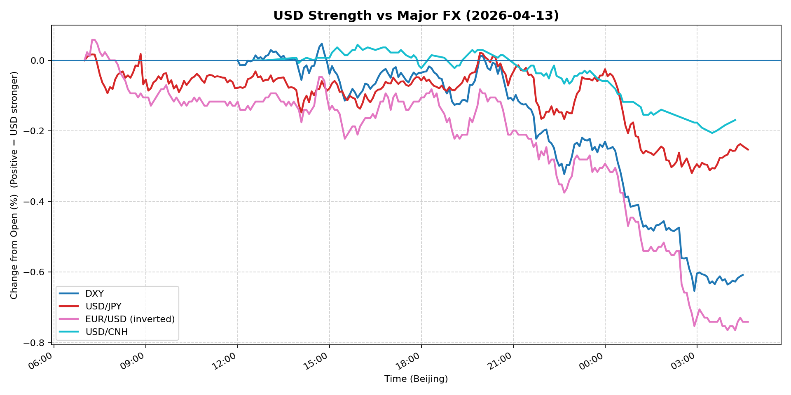
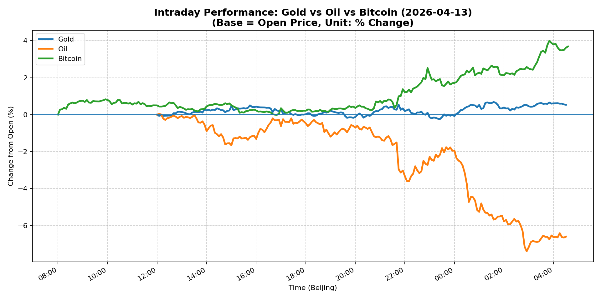
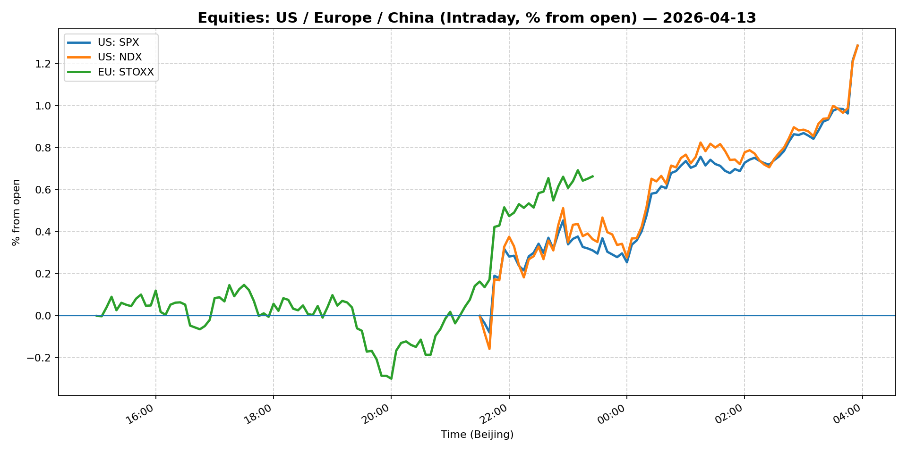
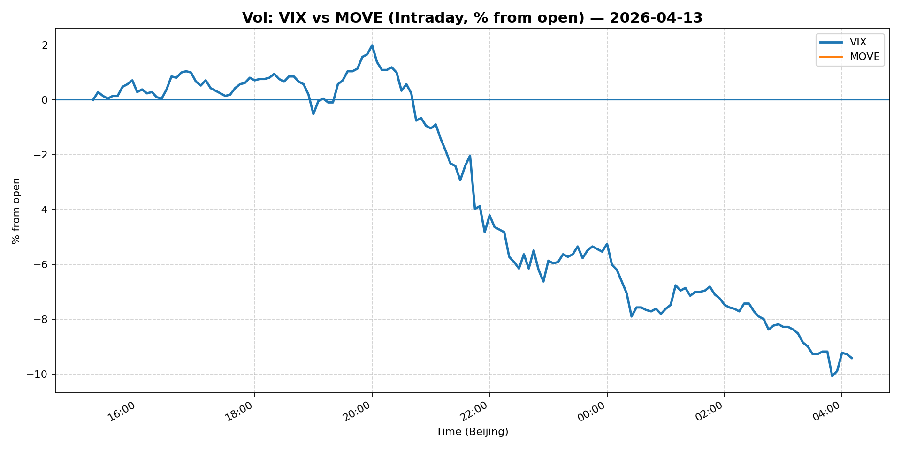

# 📅 Market Diary: 2026-04-13

---

## 🧠 AI Macro Analysis

# Market Diary — 2026-04-13 (Beijing Time)

## -1) Chart read (Chart Features block)

- **USD chart (Chart 1):** FX Composite net -0.50pp across a +0.57pp range signals broad USD liquidation; the session low of -0.53pp at 04:20 Beijing time (midnight EST) indicates post-NY continuation of selling. DXY net -0.61pp and EUR/USD net -0.74pp confirm the move is not JPY-driven alone — it's systemic USD weakness. The composite peaked early at +0.04pp (07:15 Beijing) then steadily degraded. USD/CNH net -0.17pp with a 0.25pp range shows CNH outperformance vs USD, consistent with risk-on appetite.
- **Gold/Oil/BTC chart (Chart 2):** Extreme divergence: Bitcoin +3.69pp (best) vs Oil -6.61pp (worst), 10.30pp spread. This is a classic risk-regime bifurcation — BTC correlates +0.55 with Gold (haven bid) but -0.93 with Oil (growth deterioration). Oil's -6.61pp net decline despite flat WTI spot (+1.44%) suggests the futures curve collapsed intraday; front-month stabilized while the back collapsed, sending a sharp negative signal for demand expectations. Gold's mild +0.53pp net masks a sharp +0.68pp intraday spike at 01:35 (Middle East escalation headlines likely).

## 0) One-line takeaway

USD liquidation, falling UST yields, and a surging S&P/Nasdaq signal a risk-on reversal — but the Oil-Bitcoin -0.93 correlation divergence from Gold's haven bid reveals the move is concentrated in rate-sensitive and speculative assets, not broad growth confidence.

---

## 1) Market tape (session-by-session, Asia → Europe → US)

### Asia
- **What moved:** USD/JPY turned lower (-0.25pp net) after early Tokyo spike; USD/CNH held flat as PBOC fix likely constrained the pair. Chinese equities (Shanghai +0.51%) continued grinding higher, partially driven by Morgan Stanley upgrade calls on beaten-down large-caps. Gold touched session highs on Middle East headlines (Yemen/Houthi developments cited in newsflow).
- **Why:** Asia session was largely positioned around weekend risk cleanup; thin liquidity amplified moves. Gold's spike at 01:35 Beijing time suggests a specific geopolitical headline crossed wires.

### Europe
- **What moved:** Euro Stoxx -0.36% (mild underperformance vs US); EUR/USD +0.62% (euro strength adding to USD weakness). Bunds likely rallied (5Y Treasury -0.56%) as European rate markets followed the US rates move.
- **Why:** European markets were cautious entering the session; no specific ECB commentary drove moves. USD weakness provided the primary directional signal for European equities and FX.

### US
- **What moved:** S&P 500 +1.02%, Nasdaq +1.06%, VIX -0.57% to 19.12, IG/HY spreads +0.38% each (tightening). Gold stabilized after its spike; Bitcoin +3.52% to 73,243 (crypto surged post-chart low of -0.01pp at 16:50). 5Y Treasury -0.56%, 10Y -0.46% — rates rallied sharply, driving the risk-on equity move.
- **Why:** Record Goldman Sachs equities trading revenue (beats on trading desk strength) boosted financials; Oracle software sector bounce (+1 year best day) lifted tech. The combination of falling rates + tightening credit spreads + falling VIX = classic risk-on acceleration.

---

## 2) Cross-asset dashboard

| Bucket | What moved | Mechanism (1 line) | Signal quality |
|---|---|---|---|
| Rates (UST/Bunds) | 5Y -56bp, 10Y -46bp, bull flattening | Rate rally driven by risk-on rotation out of USD and into equities | High |
| FX (USD/JPY/EUR/CNH) | Broad USD -0.5pp composite; EUR +0.74pp | Dollar liquidation without obvious catalyst; risk-on shift | Med |
| Equities (US/EU/CN) | S&P/Nasdaq +1%; Shanghai +0.51%; Euro Stoxx -0.36% | US risk-on on GS earnings beat + falling yields; Europe mixed | High |
| Credit | IG/HY both +0.38% | Tightening spreads indicate risk appetite, not distress | High |
| Commodities | Oil -6.61pp (curve); Gold +0.53pp; Copper +2.20% | Oil curve collapse = demand fear; Gold = haven bid; Copper = Chinese demand hope | High |
| Vol (VIX/MOVE) | VIX -0.57% to 19.12; MOVE flat 72.15 | VIX declining with equity rally = risk-on; MOVE unchanged = rates vol muted | High |

---

## 3) What changed the narrative today?

### Driver #1: US Rates Rally — Front-End Relief
- **Variable:** 5Y UST yield -56bp, 10Y -46bp — sharp rate compression
- **Mechanism:** Risk-on rotation out of USD and into equities; market pricing reduced near-term Fed tightening fears. Fall in real yields reduces discount rate → elevates equity duration.
- **Evidence:**
  - Market: 5Y/10Y rally steepened the curve; equity multiples expanded
  - Event: No Fed speakers or data drove this; likely position-squaring after Friday's payrolls
- **Action:** Long equities vs short duration; reduce USD long exposure
- **Source of Uncertainty:** Is this positioning reversal or a genuine repricing of Fed path?
- **Invalidation Criteria:** 10Y breaks above 4.40% (4.35% resistance) → rates rally reversal, risk-off reasserts

### Driver #2: Oil Curve Collapse vs Crypto Surge — Divergent Risk Signals
- **Variable:** WTI front-end flat (+1.44% spot) vs chart showing -6.61pp net with -7.40pp intraday low → 6M spread likely widened sharply
- **Mechanism:** Oil futures curve backwardation deepening = demand destruction signal. Bitcoin surging (+3.52%) = speculative risk appetite strong. The two should correlate positively in normal risk-on; the -0.93 oil-BTC correlation signals regime confusion.
- **Evidence:**
  - Market: BTC hit 73,243; oil curve weakness post-Asian hours
  - Event: No specific oil demand data; likely macro positioning unwind
- **Action:** Do not interpret Bitcoin rally as broad risk-on confirmation. Oil signal is more credible for growth. Treat crypto as speculative positioning, not macro signal.
- **Source of Uncertainty:** Saudi/Iranian production dynamics; Chinese industrial demand data
- **Invalidation Criteria:** Oil spot breaks below 95 (psychological support) → demand recession fear dominates

### Driver #3: Equity Market Breadth — Narrow Leadership
- **Variable:** S&P +1.02%, Nasdaq +1.06%; Euro Stoxx -0.36%; Shanghai +0.51%
- **Mechanism:** US outperformance driven by mega-cap tech (Oracle + software bounce) and financials (Goldman). The move is not broad-based — European and Chinese markets are mixed. VIX declining + equity rally = positioning-driven rather than fundamental.
- **Evidence:**
  - Market: VIX 19.12 (falling), equity up
  - Event: Goldman Sachs record equities trading revenue; Oracle software bounce
- **Action:** Remain constructive on US equities short-term but monitor internals. If VIX rises while equities sell off, the risk-on was a trap.
- **Source of Uncertainty:** Are GS/Oracle sector-specific or lead indicators for Q1 earnings season?
- **Invalidation Criteria:** S&P fails to hold 6,850 → distribution day warning

---

## 4) Rates & USD: the "macro spine"

- **Curve / real yield / breakevens:** 5Y -56bp, 10Y -46bp — the rally is front-end dominant. 5s10s likely steepened. Real yields fell with nominals. Breakevens (not provided but inferring from move) likely compressed slightly as oil curve weakness offset equity risk-on. The rates move is the clearest macro signal: something triggered a mass reduction of long USD/long duration positions.
- **USD reaction function:** Currently trading growth fears + positioning unwind. DXY 98.411 is below key psychological 99; if 98 breaks, next support ~97.50. The USD weakness is broad (DXY -0.61pp, EUR +0.74pp, JPY -0.25pp) — this is not a safe-haven flow (Gold is up but not dramatically); it's position liquidation.
- **Key levels:** DXY 98.00 support; 98.50 resistance. USD/JPY 159 support, 160.50 resistance. USD/CNH 6.78 support.

---

## 5) Flows, positioning & options

- **Positioning guess:** Likely long S&P/Nasdaq (CTA following the breakout), short oil (momentum following curve collapse), long Bitcoin (speculative carry trade re-risk). USD positioning was likely net long coming into the session given DXY holding 99 — the liquidation is squeeze-like.
- **Options / vol mechanics:** VIX 19.12 (falling) = short vol profitable. However, 19 is not depressed; vol buyers still present. Put skew likely mild given recent range. MOVE 72 flat = rate vol suppressed. If rates continue rallying, VIX may test 17 (lower vol regime), but 19-20 has been a floor.
- **Where you may be wrong:** (1) Oil curve collapse could be temporary — Saudi production comments could reverse it in hours. (2) The USD liquidation may reverse if US data (CPI Thursday) surprises to the upside — the positioning unwind may have overshot.

---

## 6) Today's Trading Plan (2026-04-13 Beijing time — already in progress, adjust for rest of session/next day)

- **Directional Bias:** Mildly risk-on for US equities; cautious on oil; neutral USD with bias to downside if 98 breaks.
- **2–4 Trade Setups:**

  1. **Instrument:** Long S&P 500 (SPY) on pullback
     - **Trigger:** If S&P tests 6,850–6,860 (prior resistance becomes support) on any dip
     - **Entry / Stop / Target:** Entry ~6,860; stop 6,800 (-0.87%); target 6,950 (+1.3%)
     - **Position sizing:** Medium — trend is up but VIX elevated (19)
     - **Hedge:** Optional: small long VIX call spread as insurance
     - **Why now:** Rate tailwind + tight credit spreads confirm risk-on; GS earnings beat validates financials

  2. **Instrument:** Short WTI crude oil (futures or USO)
     - **Trigger:** If oil spot fails to reclaim 99.50 and curve remains in backwardation
     - **Entry / Stop / Target:** Entry ~98.50; stop 100.50 (+2%); target 94 (-4.5%)
     - **Position sizing:** Small — oil is volatile and headline-sensitive
     - **Hedge:** Long calls if Middle East geopolitical risk escalates
     - **Why now:** Curve collapse (chart -6.61pp net) signals demand destruction; -0.93 BTC correlation confirms

  3. **Instrument:** Long BTC (micro or ETF)
     - **Trigger:** If BTC holds 72,000 support after the 3.52% rally stalls
     - **Entry / Stop / Target:** Entry 72,500; stop 70,500 (-2.8%); target 76,000 (+4.8%)
     - **Position sizing:** Small — speculative; crypto adds tail risk to portfolio
     - **Hedge:** None
     - **Why now:** +3.69pp best performer; risk-on + institutional flow; correlation with Gold (+0.55) shows haven demand

  4. **Instrument:** Short USD/JPY (via put or bear spread)
     - **Trigger:** If USD/JPY fails to reclaim 160.50 and DXY breaks 98.50
     - **Entry / Stop / Target:** Entry 159.50; stop 160.80; target 157.50
     - **Position sizing:** Medium — carry-friendly environment; BoJ intervention risk on break below 155
     - **Hedge:** Long USD calls if risk-off reverses suddenly
     - **Why now:** USD composite -0.50pp; rates rally favors JPY carry unwind

- **Portfolio risk rules:**
  - **Max daily loss / heat:** -1.5% portfolio loss triggers review; -2.5% hard stop
  - **Correlation risk:** Equity long + short oil + long BTC = concentrated risk-on bet; if rates reverse, all three lose simultaneously
  - **Tail risk hedge:** Maintain small long VIX call spread (25-delta) as portfolio insurance; consider long gold (small) as geopolitical hedge

---

## 7) What to watch tomorrow (2026-04-14 Beijing time)

- **Key catalysts (US/EU/CN):**
  - **US:** CPI data release (Thursday in US = likely Wednesday night/Thursday morning Beijing). PPI follows Friday.
  - **EU:** ECB meeting minutes or speakers if scheduled
  - **CN:** China trade data (deficit concerns); PBOC daily fix monitoring for CNH direction
  - **Earnings:** Major banks report later in the week (JPM, WFC Fri/Sat Beijing time)

- **Scenario map (2–3):**
  - **If US CPI comes in hotter than expected** (+0.3% MoM core) → rates sell off, 10Y re-tests 4.40%, USD rebounds, equities fall, VIX spikes above 21 → **Action: Exit equity longs, short S&P, long USD**
  - **If CPI comes in soft** (+0.1-0.2% MoM core) → rates rally further, 10Y tests 4.20%, USD tests 97.50, equities grind higher → **Action: Hold equity longs, add short USD positions, reduce oil shorts**
  - **If geopolitical escalation (Middle East)** → Gold spikes above 4,800, oil spikes, BTC falls (flight to safety), equities sell off → **Action: Exit risk-on positions, long Gold, long oil futures**

- **Thesis invalidation checklist:**
  1. **DXY reclaims 99.50** → USD liquidation was a head-fake; rates rally reversing → liquidate equity longs
  2. **VIX rises above 22** while equities fall → risk-off regime change; BTC/oil correlation goes positive again → reduce speculative positions
  3. **Oil spot breaks below 95** with curve in steep backwardation → demand recession confirmed; do not buy the dip in risk assets → hold oil shorts, increase gold weight

---

## 📊 Charts

### 💵 USD Strength (FX, Intraday %)

### 🟡🛢️₿ Gold vs Oil vs Bitcoin (Intraday %)

### 🏦 Rates: UST 2Y/10Y/30Y (bps from open)

### 📉 Equities: US/EU/CN (Intraday %)

### 🌪️ Vol: VIX vs MOVE (Intraday %)

### 🧱 Credit: IG vs HY (abs change)

---

*Generated on 2026-04-14 04:42:59*
