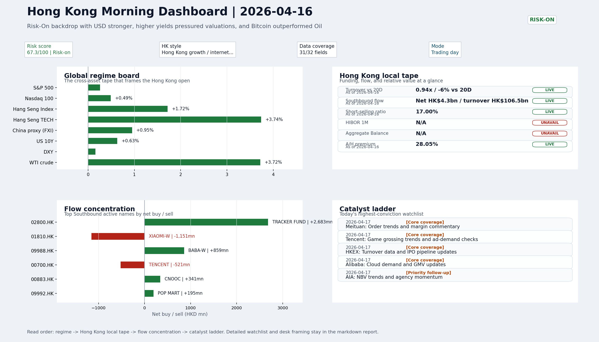

# Archived Professional Report | 2026-04-17

This is the GitHub landing page for the archived report dated `2026-04-17`.

- Report date: `2026-04-17`
- Report mode: `Trading day`
- Quality: `78.3/100`
- Latest published entry: [latest/README.md](../../latest/README.md)
- Archive gallery: [archive/README.md](../README.md)
- Direct markdown file: [morning_briefing.md](./morning_briefing.md)
- Dashboard: [Open image](charts/dashboard_2026-04-17.png)
- Daily One Chart: [Open image](charts/daily_one_chart_2026-04-17.png)
- Trend Pack: [Open image](charts/hk_trend_pack_2026-04-17.png)
- Raw bundle: [Open bundle](raw/2026-04-17_bundle.json)

## Dashboard Preview

---

# Morning Research Workbench | 2026-04-17

> Designed for a Hong Kong sell-side commute: Layer 1 `Scan`, Layer 2 `Deep Read`, Layer 3 `Thinking`
> Mode: `Trading day` | Keep the report execution-oriented: what matters by the Hong Kong open, what can move leadership, and what needs fast follow-up.
> Briefing date: `2026-04-17` | Review date: `2026-04-16` | Global request: `2026-04-16` | HK/China request: `2026-04-16` | Market effective date: `2026-04-16` | Generated at: `2026-04-20 09:58:55`
> Market data quality: Coverage: `31/32` | Fallbacks used: `2` | Missing: `1`

> Report quality: `78.3/100` | Grade `C` | Status `usable with caveats`

## Visual Dashboard

## Layer 1 | Scan (5-10 min)

### 1.1 One-Line Market Pulse
Risk-On backdrop with USD stronger, higher yields pressured valuations, and Bitcoin outperformed Oil

### 1.2 Global Asset Price Dashboard
| Asset | Last | 1D move | Read |
| --- | --- | --- | --- |
| S&P 500 | 7,041.28 | +0.26% | US large-cap risk appetite |
| Nasdaq 100 | 26,333.00 | +0.49% | Growth and duration leadership |
| Dow Jones | 48,578.72 | +0.24% | Old-economy and cyclicals |
| Hang Seng Index | 26,394.26 | **+1.72%** | Hong Kong broad beta |
| Hang Seng TECH | 4.9940 | **+3.74%** | Hong Kong growth / platform read-through |
| CSI 300 | 4,736.61 | +1.10% | Mainland large-cap tone |
| ChiNext | 3,629.42 | **+2.64%** | Mainland growth risk appetite |
| Nikkei 225 | 59,518.34 | **+2.38%** | Asia developed-market leadership |
| Euro Stoxx 50 | 5,933.28 | -0.12% | Europe macro risk |
| US 10Y | 4.3090 | +0.63% | Global discount-rate anchor |
| China 10Y | 1.78% | +0.0bp | China local rates anchor \| Live public \| Eastmoney Treasury Yield History \| 2026-04-16 |
| CN-US 10Y spread | -253.9bp | -3.0bp | Relative carry and macro-pressure gauge \| Live public \| Eastmoney Treasury Yield History \| 2026-04-16 |
| DXY | 98.22 | +0.16% | Dollar liquidity impulse |
| USD/CNH | 6.8000 | +0.17% | Offshore China risk appetite |
| USD/HKD | 7.8324 | -0.01% | Linked-exchange regime stress check |
| USD/JPY | 158.81 | +0.01% | Asia funding and carry read |
| Brent crude | 99.39 | **+4.70%** | Energy / geopolitics |
| COMEX gold | 4,785.40 | -0.30% | Hedge demand / real yields |
| Copper | 6.0665 | -0.09% | Global growth proxy |
| VIX | 17.94 | -1.27% | US stress barometer |
| HSI volatility | N/A | N/A | No stable public HSI volatility feed is configured |

### 1.3 Hong Kong Key Data Quick Check
| Check | Value | Status | Source / as of | Why it matters |
| --- | --- | --- | --- | --- |
| Main Board turnover vs 20D | 0.94x \| -6% vs 20D | Live local | HKEX Daily Quotations \| 2026-04-16 | Trailing 20-session average turnover was HK$272.4bn. |
| HIBOR 1M | N/A | Unavailable | HKMA Daily Figures - Interbank Liquidity | HKMA liquidity record was unavailable for this date. |
| Aggregate Balance | N/A | Unavailable | HKMA Daily Figures - Interbank Liquidity | HKMA liquidity record was unavailable for this date. |
| Base Rate / linked band | Base rate N/A \| band N/A | Unavailable | HKMA Daily Figures - Interbank Liquidity | HKMA liquidity record was unavailable for this date. |
| USD/HKD spot vs band | 7.8324 | Live quote | Yahoo Finance \| 2026-04-16 | Inside the linked-exchange band without immediate boundary stress. |
| Short-selling ratio | 17.00% | Live local | HKEX Daily Quotations - Short Selling Turnover \| 2026-04-16 | Official HKEX stock-level short-selling table, aggregated as a share of total market... |
| Southbound / Northbound net flow | Southbound Net HK$4.3bn \| turnover HK$106.5bn \| Northbound Turnover HK$292.5bn \| net unavailable | Live public | HKEX Stock Connect Historical Daily \| 2026-04-16 | Southbound net buy is calculated from HKEX disclosed buy and sell turnover. |
| AH premium index | 28.05% | Live public | Public Yahoo Finance quotes - calculated A/H premium \| 2026-04-16 | Simple average across 17 A/H pairs; use dispersion rather than the average alone. |
| Hong Kong leadership | Hong Kong growth / internet led | Proxy fallback | HSI / HSCEI / HSTECH relative performance \| 2026-04-16 | Use HSI / HSCEI / HSTECH relative moves as the opening style read. |
| HSI vs HSTECH | HSI +1.72% \| HSTECH +3.74% | Proxy fallback | Yahoo Finance summary snapshot \| 2026-04-16 | This is the fastest check for whether the day is beta-led or growth-led in Hong Kong. |
| HK ETF flow proxy | 2828.HK +0.24% on 0.06x volume (inflow); 3033.HK +0.24% on 0.06x volume (inflow); 2800.HK +0.30% on 0.17x volume (inflow) | Proxy fallback | Hong Kong ETF volume proxy | Use only as a fallback lens when official Stock Connect flow evidence is incomplete. |

### 1.4 Risk Dashboard
- **Composite risk score:** 67.3/100 | **Regime:** Risk-on
| Component | Score impact | Evidence |
| --- | --- | --- |
| US beta | +1.6 | S&P 500 +0.26% |
| HK growth | +10 | HSTECH +3.74% |
| Offshore China proxy | +4.8 | FXI +0.95% |
| Dollar pressure | -1.6 | DXY +0.16% |
| Volatility | +2.5 | VIX -1.27% |
| HK short-selling | +0 | Short-selling ratio 17.00% |

### 1.5 Morning Checklist
1. **INTC -6.33%**
   Mover attribution | Announcement / expectations | Guidance reset and margin pressure
2. **Risk-On backdrop with USD stronger, higher yields pressured valuations, and Bitcoin outperformed Oil**
   Overnight regime | Start by deciding whether the day is about Risk-On conditions or a style pivot.
3. **CPI MoM (Released)**
   Macro / policy | Rates expectations, the dollar, and growth-equity valuation | Industries: Technology, Internet, Brokers
4. **[A] Hong Kong Exchange Tightens Rules to Avoid Auditor Shopping**
   News / announcements | Policy and regulation can reshape the Financials industry logic
5. **Trade Balance (Released)**
   Macro / policy | Watch whether it changes the day's core market narrative | Industries: To be assessed
6. **Retail Sales MoM (Upcoming)**
   Macro / policy | Consumer resilience, growth expectations, and risk-asset pricing | Industries: Consumer, E-commerce, Consum...

## Layer 2 | Deep Read (20-30 min)

### 2.1 Overnight Overseas Market Review
The overnight tape still looks like a `Risk-On` setup. Risk appetite snapshot: S&P 500 +0.26% / Nasdaq 100 +0.49% / Hang Seng +1.72% / HSTECH +3.74% / FXI +0.95%. Rates and liquidity: US 10Y +0.63% / DXY +0.16% / VIX -1.27%. Commodities and hedges: WTI +3.72% / Gold -0.30%.

- **Hong Kong desk lens:** Hong Kong growth / internet led
- Hang Seng +1.72% / HSCEI +2.14% / HSTECH +3.74%.
- Offshore China proxy FXI +0.95% and USD/CNH +0.17% frame cross-border risk appetite.
- USD/HKD last traded around 7.8324, which keeps the Hong Kong funding lens in focus.

- USD composite moved higher by +0.27pct intraday, with a 0.428pct range.
- Main turning points appeared around 2026-04-16 08:10 trough / 2026-04-16 08:25 trough / 2026-04-16 09:05 trough, suggesting event-driven repricing rather than a clean one-way USD move.

- The biggest cross-asset divergence was Bitcoin versus Oil, a spread of 2.54pct.
- Gold moved -0.72pct intraday with a 1.157pct high-low range.
- Oil moved -1.85pct intraday with a 4.001pct high-low range.
- Bitcoin moved +0.69pct intraday with a 2.627pct high-low range.

### 2.2 Hong Kong / A-share Previous-Day Review

- Use Hong Kong style leadership first: HSI / HSCEI / HSTECH tell you whether the market is broad-beta, old-economy, or growth-led.
- For cross-market read-through, keep CSI 300, ChiNext, FXI, and USD/CNH together rather than reading any single market in isolation.
- **LLM local leadership read:** No extra leadership read was generated.
- **Follow-through check:** No extra follow-through check was generated.
- Hong Kong / offshore-China ETF proxies:
| Ticker | Last | 1D | Volume ratio | Flow bias |
| --- | --- | --- | --- | --- |
| 2828.HK | 90.72 | +0.24% | 0.06x | inflow |
| 3033.HK | 4.9500 | +0.24% | 0.06x | inflow |
| 2800.HK | 26.52 | +0.30% | 0.17x | inflow |
| KWEB | 30.45 | +1.16% | 1.51x | inflow |

### 2.3 Flow Tracker and Attribution
#### Cross-Asset Attribution v1
| Driver | Direction | Score | Evidence | HK implication |
| --- | --- | --- | --- | --- |
| Oil and geopolitics | mixed | 3.76 | Oil moved +4.70%. | Split the read between energy/cyclicals support and margin/geopolitical pressure. |
| Rates impulse | drag | 0.76 | US 10Y yield proxy moved +0.63%. | Lower yields help long-duration growth; higher yields pressure valuation-sensitive sect... |

#### Flow Tracker
Local flow evidence is not yet strong enough to override the cross-asset setup.

#### Local Flow and Funding Checks
| Metric | Value | Status | Source / as of | Read |
| --- | --- | --- | --- | --- |
| Main Board turnover vs 20D | 0.94x \| -6% vs 20D | Live local | HKEX Daily Quotations \| 2026-04-16 | Trailing 20-session average turnover was HK$272.4bn. |
| Short-selling ratio | 17.00% | Live local | HKEX Daily Quotations - Short Selling Turnover \| 2026-04-16 | Official HKEX stock-level short-selling table, aggregated as a share of t... |
| Southbound / Northbound net flow | Southbound Net HK$4.3bn \| turnover HK$106.5bn \| Northbound Turnover HK$292.5bn \| net unavailable | Live public | HKEX Stock Connect Historical Daily \| 2026-04-16 | Southbound net buy is calculated from HKEX disclosed buy and sell turnover. |
| AH premium index | 28.05% | Live public | Public Yahoo Finance quotes - calculated A/H premium \| 2026-04-16 | Simple average across 17 A/H pairs; use dispersion rather than the averag... |
| HIBOR 1M | N/A | Unavailable | HKMA Daily Figures - Interbank Liquidity | HKMA liquidity record was unavailable for this date. |
| Aggregate Balance | N/A | Unavailable | HKMA Daily Figures - Interbank Liquidity | HKMA liquidity record was unavailable for this date. |
| HK ETF flow proxy | 2828.HK +0.24% on 0.06x volume (inflow); 3033.HK +0.24% on 0.06x volume (inflow); 2800.HK +0.30% on 0.17x volume (inflow) | Proxy fallback | Hong Kong ETF volume proxy | Use only as a fallback lens when official Stock Connect flow evidence is... |

#### Flow Notes
- Stock Connect Southbound: net HK$4.3bn on turnover HK$106.5bn (as of 2026-04-16).
- Stock Connect Northbound: turnover RMB292.5bn; public file provides total turnover/top active names, not full net-buy.
- AH premium: simple covered-pair average +28.05%; widest premium: China Communications Construction 59.08%.
- ETF flow anomalies were concentrated in: 2828.HK +0.24% / volume ratio 0.06x / inflow; 3033.HK +0.24% / volume ratio 0.06x / inflow; USO -7.79% / volume ratio 1.85x / outflow.
- HKEX short selling: 17.00% of market turnover (HK$43.9bn short turnover, as of 2026-04-16).
- Highest stock-level short ratios were concentrated in: 07552.HK 73.06%; 03081.HK 63.46%; 03433.HK 61.22%.

#### Stock Connect Southbound Active Names
| Rank | Ticker | Name | Buy | Sell | Net buy |
| --- | --- | --- | --- | --- | --- |
| 3 | 02800.HK | TRACKER FUND | HK$2,949.0mn | HK$265.6mn | HK$2,683.4mn |
| 4 | 01810.HK | XIAOMI-W | HK$1,205.4mn | HK$2,356.8mn | HK$-1,151.3mn |
| 1 | 09988.HK | BABA-W | HK$4,844.1mn | HK$3,985.3mn | HK$858.7mn |
| 2 | 00700.HK | TENCENT | HK$2,573.7mn | HK$3,095.2mn | HK$-521.4mn |
| 7 | 00883.HK | CNOOC | HK$1,188.6mn | HK$847.9mn | HK$340.7mn |
| 5 | 09992.HK | POP MART | HK$1,554.5mn | HK$1,359.9mn | HK$194.6mn |
| 8 | 03317.HK | XUNCE | HK$1,150.1mn | HK$1,041.2mn | HK$108.8mn |
| 6 | 00981.HK | SMIC | HK$1,109.4mn | HK$1,167.1mn | HK$-57.7mn |

#### AH Premium Dispersion
| Name | A ticker | H ticker | Premium | As of |
| --- | --- | --- | --- | --- |
| China Communications Construction | 601800.SS | 1800.HK | +59.08% | 2026-04-16 |
| China Life | 601628.SS | 2628.HK | +55.01% | 2026-04-16 |
| China Railway | 601390.SS | 0390.HK | +48.83% | 2026-04-16 |
| China Railway Construction | 601186.SS | 1186.HK | +45.87% | 2026-04-16 |
| Sinopec | 600028.SS | 0386.HK | +41.32% | 2026-04-16 |
| CRRC | 601766.SS | 1766.HK | +38.05% | 2026-04-16 |
| Agricultural Bank of China | 601288.SS | 1288.HK | +34.22% | 2026-04-16 |
| Bank of China | 601988.SS | 3988.HK | +29.63% | 2026-04-16 |

#### HKEX Short-Selling Watch
| Ticker | Name | Short ratio | Short turnover | Total turnover |
| --- | --- | --- | --- | --- |
| 00388.HK | HKEX | 13.11% | HK$0.2bn | HK$1.7bn |
| 00700.HK | TENCENT | 15.03% | HK$1.7bn | HK$11.5bn |
| 00941.HK | CHINA MOBILE | 14.18% | HK$0.2bn | HK$1.5bn |
| 01211.HK | BYD COMPANY | 24.89% | HK$1.0bn | HK$4.2bn |
| 01299.HK | AIA | 26.16% | HK$0.6bn | HK$2.3bn |
| 02800.HK | TRACKER FUND | 37.64% | HK$5.5bn | HK$14.7bn |
| 02828.HK | HSCEI ETF | 44.68% | HK$3.5bn | HK$7.9bn |
| 03033.HK | CSOP HS TECH | 52.00% | HK$3.8bn | HK$7.3bn |

- **Short-value leaders:** 02800.HK TRACKER FUND (HK$5.5bn); 03033.HK CSOP HS TECH (HK$3.8bn); 02828.HK HSCEI ETF (HK$3.5bn); 09988.HK BABA-W (HK$2.9bn).
#### ETF Proxy Flow
| Ticker | Last | 1D | Volume ratio | Flow bias |
| --- | --- | --- | --- | --- |
| 2828.HK | 90.72 | +0.24% | 0.06x | inflow |
| 3033.HK | 4.9500 | +0.24% | 0.06x | inflow |
| 2800.HK | 26.52 | +0.30% | 0.17x | inflow |
| KWEB | 30.45 | +1.16% | 1.51x | inflow |

### 2.4 Macro and Policy Tracking

| Time | Country | Event | Status | Impact | Industries | Attention |
| --- | --- | --- | --- | --- | --- | --- |
| 20:30 | US | CPI MoM | Released | Rates expectations, the dollar, and growth-equity valuation | Technology, Internet, Brokers | 5 |
| 09:30 | China | Trade Balance | Released | Watch whether it changes the day's core market narrative | To be assessed | 3 |
| 20:30 | US | Retail Sales MoM | Upcoming | Consumer resilience, growth expectations, and risk-asset pricing | Consumer, E-commerce, Consumer discretionary | 5 |
| 09:20 | China | Loan Prime Rate | Upcoming | Watch whether it changes the day's core market narrative | To be assessed | 3 |
| 22:00 | Federal Reserve | Jerome Powell: Economic outlook remarks | Central bank | Policy path, liquidity conditions, and cross-asset risk appetite | Technology, Financials, Gold | 5 |
| 10:00 | PBOC | Open Market Operations Desk: Daily liquidity operation window | Central bank | Policy path, liquidity conditions, and cross-asset risk appetite | Technology, Financials, Gold | 3 |

#### Positioning and Risk Backdrop
- ETF flow anomalies were concentrated in: 2828.HK +0.24% / volume ratio 0.06x / inflow; 3033.HK +0.24% / volume ratio 0.06x / inflow; USO -7.79% / volume ratio 1.85x / outflow.
- HKEX short selling: 17.00% of market turnover (HK$43.9bn short turnover, as of 2026-04-16).
- Highest stock-level short ratios were concentrated in: 07552.HK 73.06%; 03081.HK 63.46%; 03433.HK 61.22%.
- Options activity centered on KWEB Call, with Vol/OI at 1.88x and a bullish bias.
- Put/Call structure shows equity 0.68 / index 1.15, implying Single-stock optimism with index hedging.
- Geopolitics: Middle East | Regional tension remains elevated | Impact: Oil, freight costs, and safe-haven demand
- Geopolitics: US-China | Technology export-control rhetoric remains active | Impact: China internet, semiconductors, and supply chains

### 2.5 Key Company and Sector Events
| Grade | Sector | Headline | Why it matters | Horizon |
| --- | --- | --- | --- | --- |
| A | Financials | Hong Kong Exchange Tightens Rules to Avoid Auditor Shopping | Policy and regulation can reshape the Financials industry logic | Medium-term trend |
| A | Financials | Bank of America tops estimates as CEO Brian Moynihan says consumer... | This can directly reshape earnings forecasts and the valuation framework | Short-term catalyst |
| A | Other | Australian Pension Chiefs Target Private Assets in European Trip | Capital allocation or shareholder-return events can trigger a valuation... | Medium-term trend |
| B | China Internet | From AI shopping to video, Alibaba is making the investments analys... | Assess whether the story can propagate through the China Internet value... | Monitor |
| B | Autos and EV | China Revives Coal-to-Gas Projects as Energy Security Frays | This is more about order visibility and product-cycle validation | Short-term catalyst |
| B | Semiconductors and AI | Chinese robotaxi companies forge ahead with UAE expansion despite I... | Assess whether the story can propagate through the Semiconductors and A... | Monitor |
| C | Financials | Philippine Central Banker Urges Banks to Promote FX Hedging | Assess whether the story can propagate through the Financials value chain | Monitor |
| C | Autos and EV | AI’s Token Economy Revolution Creates New China Tech Winners | Assess whether the story can propagate through the Autos and EV value c... | Monitor |

#### HKEX Announcements
| Grade | Ticker | Type | Release time | Title |
| --- | --- | --- | --- | --- |
| A | 01772.HK | Profit warning | 2026-04-16 | Profit warning / alert announcement |
| A | 00178.HK | Profit warning | 2026-04-15 | Profit warning / alert announcement |
| A | 01756.HK | Profit warning | 2026-04-15 | Profit warning / alert announcement |
| A | 02465.HK | Profit warning | 2026-04-15 | Profit warning / alert announcement |
| A | 03908.HK | Profit warning | 2026-04-15 | Profit warning / alert announcement |
| A | 00317.HK | Profit warning | 2026-04-13 | Profit warning / alert announcement |
| A | 00382.HK | Profit warning | 2026-04-13 | Profit warning / alert announcement |
| A | 01313.HK | Profit warning | 2026-04-13 | Profit warning / alert announcement |

#### Earnings / Results Watch
| Ticker | Company | Timing | Expectation framing |
| --- | --- | --- | --- |
| 0700.HK | Tencent Holdings | After Market Close | EPS est. 4.15 HKD \| revenue est. 163.2bn HKD |
| 0388.HK | Hong Kong Exchanges and Clearing | Before Market Open | EPS est. 2.81 HKD \| revenue est. 6.0bn HKD |

#### Rating Changes
- **9988.HK** | Morgan Stanley | Upgrade | Equal Weight -> Overweight | PT 92 -> 105

#### IPO Watch
- IPO / grey-market / first-day performance should be wired to a dedicated Hong Kong ECM adapter.

### 2.6 Coverage Pools
### Core coverage
| Name | Ticker | Last | 1D | Range position | Morning note |
| --- | --- | --- | --- | --- | --- |
| Meituan | 3690.HK | 84.95 | -1.79% | Mid-range | Positioning is neutral for now, so use it mainly to monitor marginal information... |
| Tencent | 0700.HK | 512.00 | +0.29% | Bottom of range | The name sits near the bottom of its recent range and is worth monitoring for a c... |
| HKEX | 0388.HK | 409.40 | +0.20% | Mid-range | Positioning is neutral for now, so use it mainly to monitor marginal information... |
| Alibaba | 9988.HK | 136.60 | +0.15% | Mid-range | Positioning is neutral for now, so use it mainly to monitor marginal information... |
**Recent headlines for Meituan:**
- [Alibaba Stock Is Getting Hit Again, but Qwen and Cloud Growth Are Surging](https://www.marketbeat.com/originals/alibaba-stock-is-getting-hit-again-but-qwen-and-cloud-growth-are-surging/?utm_source=yahoofinance&utm_medium=yahoofinance) (MarketBeat)
- [JD.com Stock Falls as Profits Dive Despite Rising Revenue](https://www.barrons.com/articles/jd-com-earnings-stock-price-1dec392c?siteid=yhoof2&yptr=yahoo) (Barrons.com)
**Recent headlines for Tencent:**
- [Alibaba Just Launched New AI Models for Video Games. Does That Make BABA Stock a Buy?](https://www.barchart.com/story/news/1389777/alibaba-just-launched-new-ai-models-for-video-games-does-that-make-baba-stock-a-buy) (Barchart)
- [Tencent Holdings (SEHK:700) Valuation Check After Recent Share Pullback And Fintech Expansion Steps](https://finance.yahoo.com/markets/stocks/articles/tencent-holdings-sehk-700-valuation-160642823.html) (Simply Wall St.)
**Recent headlines for HKEX:**
- [Trading in Metals Contracts on London Metal Exchange Restarted](https://www.wsj.com/finance/commodities-futures/trading-in-metals-contracts-on-london-metal-exchange-halted-ab53f06c?siteid=yhoof2&yptr=yahoo) (The Wall Street Journal)
- [Assessing Hong Kong Exchanges And Clearing (SEHK:388) Valuation After A Strong 1 Year Shareholder Return](https://finance.yahoo.com/news/assessing-hong-kong-exchanges-clearing-042649400.html) (Simply Wall St.)
**Recent headlines for Alibaba:**
- [Alibaba Just Launched New AI Models for Video Games. Does That Make BABA Stock a Buy?](https://www.barchart.com/story/news/1389777/alibaba-just-launched-new-ai-models-for-video-games-does-that-make-baba-stock-a-buy) (Barchart)
- [Alibaba Faces Record Food Safety Fines And Rising Valuation Questions](https://finance.yahoo.com/markets/stocks/articles/alibaba-faces-record-food-safety-130515531.html) (Simply Wall St.)

### Priority follow-up
| Name | Ticker | Last | 1D | Range position | Morning note |
| --- | --- | --- | --- | --- | --- |
| AIA | 1299.HK | 83.00 | +1.72% | Mid-range | Positioning is neutral for now, so use it mainly to monitor marginal information... |
| BYD Company | 1211.HK | 111.00 | -0.36% | Top of range | The name sits near the top of its recent range, so watch for profit-taking under... |
| China Mobile | 0941.HK | 81.45 | +0.00% | Top of range | The name sits near the top of its recent range, so watch for profit-taking under... |
**Recent headlines for AIA:**
- [Is It Too Late To Consider AIA Group (SEHK:1299) After Its 82% One Year Rally?](https://finance.yahoo.com/markets/stocks/articles/too-consider-aia-group-sehk-042100864.html) (Simply Wall St.)
- [Is AIA (AAGIY) Outperforming Other Finance Stocks This Year?](https://finance.yahoo.com/markets/stocks/articles/aia-aagiy-outperforming-other-finance-134003763.html) (Zacks)
**Recent headlines for BYD Company:**
- [Tesla Has Reclaimed Its Spot as the Leading Global EV Manufacturer, but Is the Stock a Buy?](https://www.fool.com/investing/2026/04/19/tesla-has-reclaimed-its-spot-as-the-leading-global/) (Motley Fool)
- [Assessing the Rise of Chinese EV Manufacturers](https://www.fool.com/investing/2026/04/18/assessing-the-rise-of-chinese-ev-manufacturers/) (Motley Fool)
**Recent headlines for China Mobile:**
- [China Mobile (SEHK:941): A Closer Look at Valuation After Steady Share Price Gains This Year](https://finance.yahoo.com/news/china-mobile-sehk-941-closer-154022664.html) (Simply Wall St.)
- [FCC says China Mobile could face US fines for failing to cooperate in probe](https://tech.yahoo.com/business/articles/fcc-says-china-mobile-could-155327397.html) (Reuters)

### Learning watchlist
| Name | Ticker | Last | 1D | Range position | Morning note |
| --- | --- | --- | --- | --- | --- |
| Tracker Fund of Hong Kong | 2800.HK | 26.52 | +0.30% | Mid-range | Positioning is neutral for now, so use it mainly to monitor marginal information... |
| HSCEI ETF | 2828.HK | 90.70 | +0.22% | Mid-range | Positioning is neutral for now, so use it mainly to monitor marginal information... |
| Hang Seng TECH ETF | 3033.HK | 4.9400 | +0.08% | Mid-range | Positioning is neutral for now, so use it mainly to monitor marginal information... |

## Layer 3 | Thinking (10-15 min)

### 3.1 Rotating Theme Deep Dive
- **Theme:** Hong Kong Market Structure and Flows
- **Angle for the day:** Focus on turnover, Stock Connect, ETF flows, HKEX activity, and style leadership to understand whether Hong Kong is being driven by fundamentals or positioning.
- **Signals to keep in mind:**
  - Hong Kong Exchange Tightens Rules to Avoid Auditor Shopping: Policy and regulation can reshape the Financials industry logic
  - WTI crude +3.72%: A strong crude move needs to be split between geopolitics and demand repair.
  - VIX -1.27%: Keep tracking it to confirm whether the core daily narrative is holding.

**Related names to keep close:**
| Name | Ticker | Bucket | Morning read |
| --- | --- | --- | --- |
| HKEX | 0388.HK | Core coverage | Positioning is neutral for now, so use it mainly to monitor marginal information ch... |
| BYD Company | 1211.HK | Priority follow-up | The name sits near the top of its recent range, so watch for profit-taking under hi... |
| Tracker Fund of Hong Kong | 2800.HK | Learning watchlist | Positioning is neutral for now, so use it mainly to monitor marginal information ch... |
| HSCEI ETF | 2828.HK | Learning watchlist | Positioning is neutral for now, so use it mainly to monitor marginal information ch... |

**Upcoming catalysts tied to the theme:**
- 2026-04-17 | HKEX: Turnover data and IPO pipeline updates | Direct proxy for Hong Kong market turnover, listings, and southbound interest
- 2026-04-17 | BYD Company: Weekly sales data and model rollout cadence | Hong Kong-listed proxy for EV volumes, export mix, and price competition
- 2026-04-17 | Tracker Fund of Hong Kong: Index-turnover shifts and ETF flows | Clean listed proxy for broad HSI positioning and passive flows
- 2026-04-17 | HSCEI ETF: Policy flow-through and financial/energy leadership | Useful proxy for state-owned and old-economy H-share leadership

**Relevant headlines:**
- [Hong Kong Exchange Tightens Rules to Avoid Auditor Shopping](https://www.bloomberg.com/news/articles/2026-04-20/hong-kong-exchange-tightens-rules-to-avoid-auditor-shopping)

### 3.2 Today Ahead and Trading Calendar
- Macro: CPI MoM is the first item to anchor the open and the rates/FX response.
- Corporate / event: Meituan: Order trends and margin commentary is the cleanest same-day catalyst to prepare for.

**Same-day macro docket**
| Time | Country | Event | Status | Detail |
| --- | --- | --- | --- | --- |
| 20:30 | US | CPI MoM | Released | Actual 0.3% / Forecast 0.2% / Prior 0.4% |
| 09:30 | China | Trade Balance | Released | Actual USD 85.2bn / Forecast USD 79.0bn / Prior USD 80.6bn |
| 20:30 | US | Retail Sales MoM | Upcoming | Forecast 0.3% / Prior 0.6% |
| 09:20 | China | Loan Prime Rate | Upcoming | Forecast 3.45% / Prior 3.45% |
| 22:00 | Federal Reserve | Jerome Powell: Economic outlook remarks | Central bank | speech |

**Same-day catalyst list**
| Date | Time | Category | Event | Importance |
| --- | --- | --- | --- | --- |
| 2026-04-17 |  | Core coverage | Meituan: Order trends and margin commentary | 3 |
| 2026-04-17 |  | Core coverage | Tencent: Game grossing trends and ad-demand checks | 3 |
| 2026-04-17 |  | Core coverage | HKEX: Turnover data and IPO pipeline updates | 3 |
| 2026-04-17 |  | Core coverage | Alibaba: Cloud demand and GMV updates | 3 |
| 2026-04-17 |  | Priority follow-up | AIA: NBV trends and agency momentum | 3 |
| 2026-04-17 |  | Priority follow-up | BYD Company: Weekly sales data and model rollout cadence | 3 |

**Next few sessions**
| Date | Category | Event | Impact |
| --- | --- | --- | --- |
| 2026-04-17 | Core coverage | Meituan: Order trends and margin commentary | High-frequency read on local services demand and platform competition |
| 2026-04-17 | Core coverage | Tencent: Game grossing trends and ad-demand checks | Core offshore China platform proxy for gaming, ads, and AI monetization |
| 2026-04-17 | Core coverage | HKEX: Turnover data and IPO pipeline updates | Direct proxy for Hong Kong market turnover, listings, and southbound... |
| 2026-04-17 | Core coverage | Alibaba: Cloud demand and GMV updates | Key read-through for China consumption, cloud, and platform regulation |
| 2026-04-17 | Priority follow-up | AIA: NBV trends and agency momentum | Read-through for wealth demand, mainland visitor activity, and HK fin... |
| 2026-04-17 | Priority follow-up | BYD Company: Weekly sales data and model rollout cadence | Hong Kong-listed proxy for EV volumes, export mix, and price competition |
| 2026-04-17 | Priority follow-up | China Mobile: Capex updates and dividend policy signals | Defensive SOE benchmark for yield trade and domestic digital-infrastr... |
| 2026-04-17 | Learning watchlist | Tracker Fund of Hong Kong: Index-turnover shifts and ETF flows | Clean listed proxy for broad HSI positioning and passive flows |

### 3.3 Daily One Chart
No dedicated Daily One Chart image was available. This section should not reuse the Visual Dashboard.

### 3.4 Hong Kong Trend Pack
No dedicated Hong Kong Trend Pack image was available.

### 3.5 Personal View Pad
- Does the overnight tape still read as `Risk-On`, or do I expect a different Hong Kong cash-session outcome?
- Is today's Hong Kong setup better described as `Hong Kong growth / internet led`, and does that match my current mental model?
- What was the most important overnight surprise, and does it change my base case?
- Which sector or stock view now deserves a tighter follow-up or a revised assumption?
- If I were asked for a two-minute market view this morning, what would my answer be?
- My own view after the commute:
- What changed versus yesterday:
- Which name / sector deserves extra prep before the open:

## Traceable Appendix

### Key Questions to Keep in Mind
- Is risk appetite rising or fading? The overnight tape reads closer to `Risk-On`.
- Did rates expectations move? Focus on whether US 10Y, DXY, and growth style moved together.
- Were commodities the real story? Watch WTI and gold for geopolitics versus inflation signals.
- Is Hong Kong setup internet-led, SOE-led, or broad beta-led? Compare HSTECH, HSCEI, and HSI.
- Did offshore markets move China risk appetite? Focus on HSI, FXI, USD/CNH, and USD/HKD.

### Report Quality and Validation
- **Quality score:** 78.3/100 | **Grade:** C | **Status:** usable with caveats
| Component | Score | Weight | Read |
| --- | --- | --- | --- |
| Market data coverage | 96.9 | 0.3 | 31/32 core market fields available. |
| Hong Kong local metrics | 54.1 | 0.25 | 5 live, 3 proxy, 3 unavailable local checks. |
| Key public adapters | 100.0 | 0.2 | 4/4 key adapters were available or partially available. |
| LLM task health | 55.0 | 0.15 | LLM overlay was not run or did not provide task metadata. |
| Fact-check guardrail | 75.0 | 0.1 | No LLM-generated text was available for validation. |

**Quality warnings**
- Hong Kong local metrics is weak: 5 live, 3 proxy, 3 unavailable local checks.
- LLM task health is weak: LLM overlay was not run or did not provide task metadata.

**LLM fact-check guardrail**
- No LLM-generated text was available for validation.

**Adapter status**
| Adapter | Status |
| --- | --- |
| Stock Connect | ok |
| A/H premium | ok |
| HKEX announcements | ok |
| China rates | ok |

### Source Links
- [Hong Kong Exchange Tightens Rules to Avoid Auditor Shopping](https://www.bloomberg.com/news/articles/2026-04-20/hong-kong-exchange-tightens-rules-to-avoid-auditor-shopping) (bloomberg_markets)
- [Bank of America tops estimates as CEO Brian Moynihan says consumer banking is 'healthy'](https://www.cnbc.com/2026/04/15/bank-of-america-bac-earnings-q1-2026.html) (cnbc_markets)
- [Australian Pension Chiefs Target Private Assets in European Trip](https://www.bloomberg.com/news/articles/2026-04-20/australian-pension-chiefs-target-private-assets-in-european-trip) (bloomberg_markets)
- [From AI shopping to video, Alibaba is making the investments analysts want to see](https://www.cnbc.com/2026/04/19/baba-makes-ai-investments-stock-analysts-want-to-see.html) (cnbc_markets)
- [China Revives Coal-to-Gas Projects as Energy Security Frays](https://www.bloomberg.com/news/articles/2026-04-20/china-revives-coal-to-gas-projects-as-energy-security-frays) (bloomberg_markets)
- [Chinese robotaxi companies forge ahead with UAE expansion despite Iran war](https://www.cnbc.com/2026/04/15/china-robotaxi-didi-weride-baidu-dubai-uae-expansion.html) (cnbc_markets)
- [Philippine Central Banker Urges Banks to Promote FX Hedging](https://www.bloomberg.com/news/articles/2026-04-19/philippine-central-banker-urges-banks-to-promote-fx-hedging-amid-iran-war) (bloomberg_markets)
- [AI’s Token Economy Revolution Creates New China Tech Winners](https://www.bloomberg.com/news/articles/2026-04-20/ai-s-token-economy-revolution-creates-new-china-tech-winners) (bloomberg_markets)
- [Gold Falls as Renewed Hormuz Disruption Stokes Inflation Concern](https://www.bloomberg.com/news/articles/2026-04-19/gold-falls-as-renewed-hormuz-disruption-stokes-inflation-concern) (bloomberg_markets)
- [Oil Jumps on Renewed Iran Tensions, Dollar Gains: Markets Wrap](https://www.bloomberg.com/news/articles/2026-04-19/us-futures-fall-oil-jumps-as-iran-tensions-worsen-markets-wrap) (bloomberg_markets)
- [Copper Drops From Two-Month High as US-Iran Tensions Escalate](https://www.bloomberg.com/news/articles/2026-04-20/copper-drops-from-two-month-high-as-us-iran-tensions-escalate) (bloomberg_markets)
- [Asia Private Credit Debate Changes to Soothe Jittery Investors](https://www.bloomberg.com/news/articles/2026-04-19/asia-private-credit-debates-changes-to-soothe-jittery-investors) (bloomberg_markets)
- [Alibaba Stock Is Getting Hit Again, but Qwen and Cloud Growth Are Surging](https://www.marketbeat.com/originals/alibaba-stock-is-getting-hit-again-but-qwen-and-cloud-growth-are-surging/?utm_source=yahoofinance&utm_medium=yahoofinance) (MarketBeat)
- [JD.com Stock Falls as Profits Dive Despite Rising Revenue](https://www.barrons.com/articles/jd-com-earnings-stock-price-1dec392c?siteid=yhoof2&yptr=yahoo) (Barrons.com)
- [Alibaba Just Launched New AI Models for Video Games. Does That Make BABA Stock a Buy?](https://www.barchart.com/story/news/1389777/alibaba-just-launched-new-ai-models-for-video-games-does-that-make-baba-stock-a-buy) (Barchart)

## Supplementary Visual Appendix

This appendix is professional-path only. It keeps a traceable index of the report visuals and the deterministic chart cues used to frame the morning note, without injecting the legacy intraday chart pack.

### Visual Index
| Visual | Path | Role |
| --- | --- | --- |
| Visual Dashboard | `charts/dashboard_2026-04-17.png` | Cross-asset regime board and Hong Kong local tape snapshot. |

### Deterministic Chart Cues
- FX / liquidity: USD composite moved higher by +0.27pct intraday, with a 0.428pct range.
- FX / liquidity: Main turning points appeared around 2026-04-16 08:10 trough / 2026-04-16 08:25 trough / 2026-04-16 09:05 trough, suggesting event-driven repricing rather than a clean one-way USD move.
- Cross-asset: The biggest cross-asset divergence was Bitcoin versus Oil, a spread of 2.54pct.
- Cross-asset: Gold moved -0.72pct intraday with a 1.157pct high-low range.
- Cross-asset: Oil moved -1.85pct intraday with a 4.001pct high-low range.
- Cross-asset: Bitcoin moved +0.69pct intraday with a 2.627pct high-low range.

### Risk Dashboard Components
| Component | Score impact | Evidence |
| --- | --- | --- |
| US beta | +1.6 | S&P 500 +0.26% |
| HK growth | +10 | HSTECH +3.74% |
| Offshore China proxy | +4.8 | FXI +0.95% |
| Dollar pressure | -1.6 | DXY +0.16% |
| Volatility | +2.5 | VIX -1.27% |
| HK short-selling | +0 | Short-selling ratio 17.00% |

