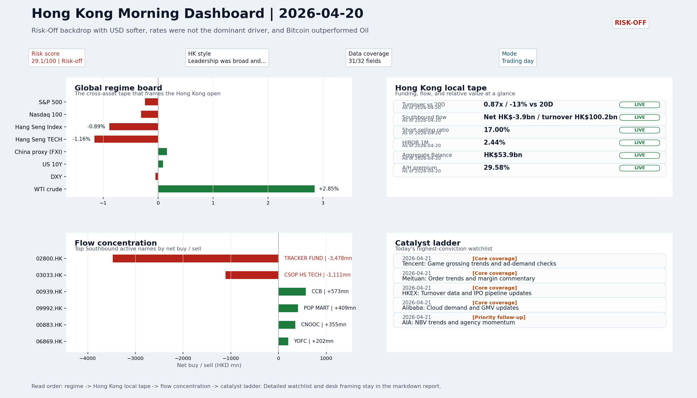
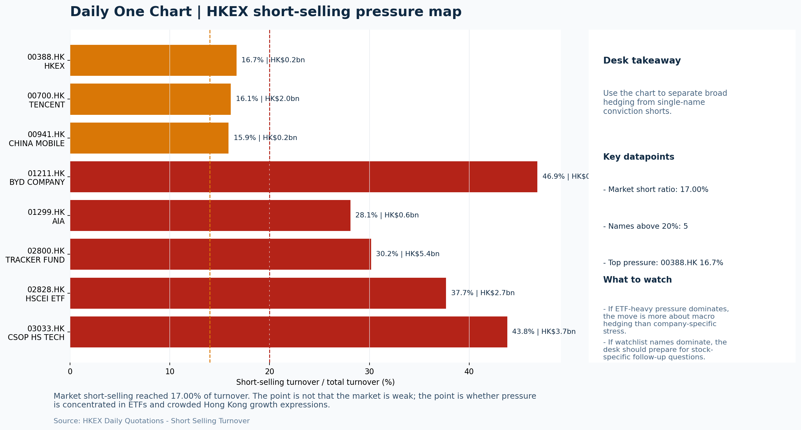
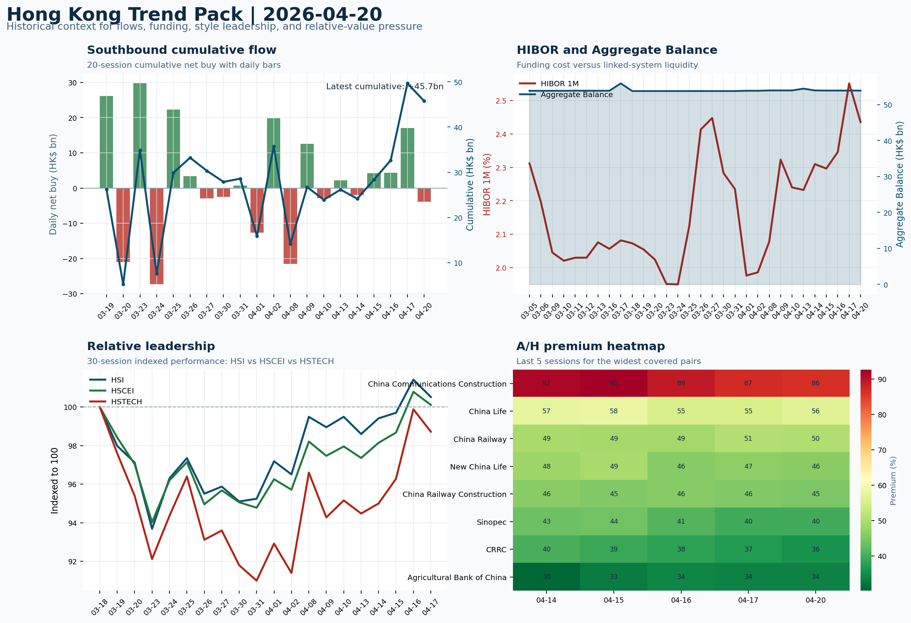

# Archived Professional Report | 2026-04-21

This is the GitHub landing page for the archived report dated `2026-04-21`.

- Report date: `2026-04-21`
- Report mode: `Trading day`
- Quality: `89.2/100`
- Latest published entry: [latest/README.md](../../latest/README.md)
- Archive gallery: [archive/README.md](../README.md)
- Direct markdown file: [morning_briefing.md](./morning_briefing.md)
- Dashboard: [Open image](charts/dashboard_2026-04-21.png)
- Daily One Chart: [Open image](charts/daily_one_chart_2026-04-21.png)
- Trend Pack: [Open image](charts/hk_trend_pack_2026-04-21.png)
- Raw bundle: [Open bundle](raw/2026-04-21_bundle.json)

## Dashboard Preview

---

# Morning Research Workbench | 2026-04-21

> Designed for a Hong Kong sell-side commute: Layer 1 `Scan`, Layer 2 `Deep Read`, Layer 3 `Thinking`
> Mode: `Trading day` | Keep the report execution-oriented: what matters by the Hong Kong open, what can move leadership, and what needs fast follow-up.
> Briefing date: `2026-04-21` | Review date: `2026-04-20` | Global request: `2026-04-20` | HK/China request: `2026-04-20` | Market effective date: `2026-04-20` | Generated at: `2026-04-21 07:55:09`
> Date policy: Review date 2026-04-20 is treated as `Trading day`. | Global request date is 2026-04-20; adapter effective date is 2026-04-20 and summary date is 2026-04-20. | HK/China local data date is 2026-04-20; role: same-session local cash tape.

> Market data quality: Coverage: `31/32` | Stale items (>1d): `7` | Missing: `1`

> Report quality: `89.2/100` | Grade `B` | Status `production ready`

## Visual Dashboard

## Layer 1 | Scan (5-10 min)

### 1.1 One-Line Market Pulse
Risk-Off setup with VIX elevated and Intel's guidance cut weighing on semis, but FXI holding flat and Alibaba's AI investment framing offer partial insulation for offshore China at the HK open, with thin turnover keeping conviction low.

### 1.2 Global Asset Price Dashboard
| Asset | Last | 1D move | Read |
| --- | --- | --- | --- |
| S&P 500 | 7,109.14 | -0.24% | US large-cap risk appetite |
| Nasdaq 100 | 26,590.34 | -0.31% | Growth and duration leadership |
| Hang Seng Index | 26,160.33 | -0.89% | Hong Kong broad beta |
| Hang Seng TECH | 4.9360 | -1.16% | Hong Kong growth / platform read-through |
| CSI 300 | 4,728.67 | -0.17% | Mainland large-cap tone |
| US 10Y | 4.2500 | +0.09% | Global discount-rate anchor |
| China 10Y | 1.76% | +0.0bp | China local rates anchor \| Live public \| Eastmoney Treasury Yield History \| 2026-04-20 |
| CN-US 10Y spread | -249.7bp | +0.0bp | Relative carry and macro-pressure gauge \| Live public \| Eastmoney Treasury Yield History \| 2026-04-20 |
| DXY | 98.05 | -0.05% | Dollar liquidity impulse |
| USD/CNH | 6.7880 | +0.00% | Offshore China risk appetite |
| USD/HKD | 7.8312 | +0.11% | Linked-exchange regime stress check |
| Brent crude | 94.84 | **+4.93%** | Energy / geopolitics |
| COMEX gold | 4,844.30 | -0.27% | Hedge demand / real yields |
| Copper | 6.0445 | -0.97% | Global growth proxy |
| VIX | 18.87 | **+7.95%** | US stress barometer |

### 1.3 Hong Kong Key Data Quick Check
| Check | Value | Status | Source / as of | Why it matters |
| --- | --- | --- | --- | --- |
| Main Board turnover vs 20D | 0.87x \| -13% vs 20D | Live local | HKEX Daily Quotations \| 2026-04-20 | Trailing 20-session average turnover was HK$278.1bn. |
| Southbound / Northbound net flow | Southbound Net HK$-3.9bn \| turnover HK$100.2bn \| Northbound Turnover HK$310.6bn \| net unavailable | Live local | HKEX Stock Connect Historical Daily \| 2026-04-20 | Southbound net buy is calculated from HKEX disclosed buy and sell turnover. |
| Short-selling ratio | 17.00% | Live local | HKEX Daily Quotations - Short Selling Turnover \| 2026-04-20 | Official HKEX stock-level short-selling table, aggregated as a share of total market... |
| AH premium index | 29.58% | Live public | Public Yahoo Finance quotes - calculated A/H premium \| 2026-04-20 | Simple average across 20 A/H pairs; use dispersion rather than the average alone. |
| USD/HKD spot vs band | 7.8312 \| band 7.7500 to 7.8500 | Live quote + local | Yahoo Finance + HKMA linked band \| 2026-04-20 | Inside the linked-exchange band without immediate boundary stress. Official Convertib... |
| HIBOR 1M | 2.44% | Live local | HKMA Daily Figures - Interbank Liquidity \| 2026-04-20 | 1M HIBOR is the cleanest quick read for Hong Kong funding conditions and equity-durat... |
| Aggregate Balance | HK$53.9bn | Live local | HKMA Daily Figures - Interbank Liquidity \| 2026-04-20 | Aggregate Balance helps frame whether linked-rate liquidity conditions are tight or c... |
| Hong Kong leadership | Leadership was broad and balanced | Proxy fallback | HSI / HSCEI / HSTECH relative performance \| 2026-04-20 | Use HSI / HSCEI / HSTECH relative moves as the opening style read. |

### 1.4 Risk Dashboard
- **Composite risk score:** 29.1/100 | **Regime:** Risk-off
| Component | Score impact | Evidence |
| --- | --- | --- |
| US beta | -1.4 | S&P 500 -0.24% |
| HK growth | -5.8 | HSTECH -1.16% |
| Offshore China proxy | +0.8 | FXI +0.16% |
| Dollar pressure | +0.5 | DXY -0.05% |
| Volatility | -10 | VIX +7.95% |
| HK short-selling | +0 | Short-selling ratio 17.00% |

### 1.5 Morning Checklist
1. **VIX +7.95%**
   High-frequency data | Higher volatility argues for tighter sizing and tighter stops.
2. **INTC -6.33%**
   Mover attribution | Announcement / expectations | Guidance reset and margin pressure
3. **Risk-Off backdrop with USD softer, rates were not the dominant driver, and Bitcoin outperformed Oil**
   Overnight regime | Start by deciding whether the day is about Risk-Off conditions or a style pivot.
4. **CPI MoM (Released)**
   Macro / policy | Rates expectations, the dollar, and growth-equity valuation | Industries: Technology, Internet, Brokers
5. **Trade Balance (Released)**
   Macro / policy | Watch whether it changes the day's core market narrative | Industries: To be assessed

## Layer 2 | Deep Read (20-30 min)

### 2.1 Overnight Overseas Market Review
Overnight trading on 2026-04-20 settled into a Risk-Off regime. The VIX surged 7.95% to 18.87, the largest single-day spike in the recent session, while USD composite softened (DXY -0.05%, intraday range 0.238%) without a clean directional catalyst—the intraday trough around 08:30 suggests event-driven repricing rather than a structural USD unwind. Intel's guidance reset dragged the stock -6.33%, which was the single largest individual mover attribution, weighing on Nasdaq (-0.31%) and the broader SOX complex; this adds a specific caution flag for HK-listed hardware and semiconductor-adjacent names at open. The headline Risk-Off split was clearest in cross-asset divergence: Bitcoin +2.75% (intraday high-low 3.273%) outperformed crude's +2.85% (intraday high-low 2.598%), which in attribution_v1 registers as +4.93%—the divergence between crypto's risk-appetite signal and oil's geopolitical premium is a tension worth monitoring rather than a clean read in either direction. Gold held -0.27% intraday and copper -0.97%, both consistent with cautious cyclical demand expectations. Euro Stoxx 50 +2.1% was the relative outperformer offshore, likely reflecting a China-reopening narrative catching a bid rather than a Europe-specific catalyst. Hong Kong itself was the weaker link domestically: HSI -0.89%, HSCEI -0.67%, HSTECH -1.16%, with Main Board turnover at only 0.87x the 20-session average—thin volume means index moves are easier to fade and carry lower conviction. The one constructive domestic data point is FXI +0.16%, which alongside USD/CNH flat at 6.788 suggests offshore China sentiment is not breaking down in sympathy with the broader Risk-Off tape. USD/HKD at 7.8312 sits inside the linked band (7.7500–7.8500) without boundary stress, and the Aggregate Balance at HK$53.9bn with 1M HIBOR at 2.44% frames Hong Kong funding conditions as comfortable rather than a near-term constraint. Short-selling ratio at 17.00% is elevated but not alarming. Alibaba's AI investment framing was graded A-importance and is the most direct near-term catalyst for HK tech leadership; if it carries through to the HK open, it could provide a sector-specific floor even in a Risk-Off tape.

**Curated overnight stories:**
- **Intel Drops 6.33% After Guidance Reset and Margin Pressure** | A large-cap semiconductor name cuts guidance with margin commentary, pulling the SOX and related hardware supply chains lower. This is the single largest individual mover attribution from the session. | HK read-through: Relevant for HK-listed tech hardware, EMS, and semiconductor adjacent names that trade with US semi sentiment. Adds caution to growth/AI thesis entering HK open.
- **VIX Jumps 7.95%, Risk-Off Backdrop Tightens** | Volatility spike signals elevated caution among global participants. USD softer, Bitcoin outperforms oil—classic risk-off rotation. Trade Balance data released shows flow dynamics in focus. | HK read-through: Supports defensive positioning for HK equities at open. Risk-off bias may favor dividend payers, H-bond proxies, or short-duration names over high-beta growth.
- **Alibaba AI Investments on Track for Best Month Since January** | China Internet leader demonstrates capital allocation discipline in AI and video. Institutional analysts are responding positively, indicating a potential reset in earnings framing for mega-cap internet. | HK read-through: Most direct HK market touchpoint from the graded news. Alibaba and peers like Tencent, Meituan may benefit from renewed AI investment narrative and better earnings optics at HK open.
- **Stocks Rally Pauses as Middle East Peace Deal Faces Uncertainty** | Iran-US ceasefire talks hit a complication, keeping oil supply expectations in flux and dampening the risk-reflation thesis. Broader equities pause rather than break. | HK read-through: Oil weakness is a marginal positive for HK importers and energy cost-sensitive sectors. Peace deal uncertainty keeps energy equity upside capped—neutral to slightly constructive for non-energy HK sectors.
- **Emerging Market Currencies Trade Mixed on Middle East Focus** | EM FX reflects the same uncertainty as equity markets—risk-off creating divergent flows. Asia EM currencies are not uniformly under pressure, suggesting selective rather than systemic stress. | HK read-through: Mixed EM FX is a secondary data point confirming Risk-Off regime but not a crisis signal. HKD peg dynamics remain stable. Monitor for any RMB onshore weakness spillover to HK USD peg.

- **Hong Kong desk lens:** Leadership was broad and balanced
- Hang Seng -0.89% / HSCEI -0.67% / HSTECH -1.16%.
- Offshore China proxy FXI +0.16% and USD/CNH +0.00% frame cross-border risk appetite.
- USD/HKD last traded around 7.8312, which keeps the Hong Kong funding lens in focus.

- Driver: VIX +7.95% signals elevated caution; Risk-Off posture elevated across the session.
- Driver: Intel guidance reset (-6.33%) was the single largest single-stock drag, weighing on Nasdaq and semis.
- Driver: USD softer on event-driven intraday repricing; not a clean one-way move.
- Driver: FXI +0.16% and USD/CNH flat suggest offshore China sentiment is not capitulating.

- Hong Kong implication: A Risk-Off open with a thin-volume caveat. The case for defensive sizing is supported by VIX elevation and the Intel semi drag, but FXI holding and Alibaba's AI framing provide two reasons not to be aggressively short HK tech at open. Monitor whether HSTECH can hold versus HSI at the open—if it does, the China internet thesis is more defensible than the headline index implies. HKD funding conditions remain comfortable (Agg Bal HK$53.9bn, 1M HIBOR 2.44%), which limits linked-rate dislocation risk. The most credible follow-up is whether HK tech volume picks up; without it, any HSTECH bounce lacks the institutional fingerprint needed for a sustained move.

- USD composite moved lower by -0.23pct intraday, with a 0.238pct range.
- Main turning points appeared around 2026-04-20 08:10 peak / 2026-04-20 08:30 trough / 2026-04-20 08:45 trough, suggesting event-driven repricing rather than a clean one-way USD move.

- The biggest cross-asset divergence was Bitcoin versus Oil, a spread of 3.766pct.
- Gold moved +0.75pct intraday with a 0.923pct high-low range.
- Oil moved -1.34pct intraday with a 2.598pct high-low range.
- Bitcoin moved +2.43pct intraday with a 3.273pct high-low range.

### 2.2 Hong Kong / A-share Previous-Day Review
HK and A-share review for 2026-04-20: Risk-Off regime with USD softer creates a mixed local read-through. HSTECH (-1.16%) underperformed HSI (-0.89%) and HSCEI (-0.67%), confirming growth style leadership under pressure, while FXI (+0.16%) held as a constructive signal for offshore China sentiment. Turnover at 0.87x the 20-session average limits the conviction of any index move. Southbound net flow was -HK$3.9bn, but the composition is more important than the headline: TRACKER FUND (2800.HK) accounted for -HK$3.5bn of net selling and CSOP HS TECH (03033.HK) for -HK$1.1bn, while Tencent (00700.HK) was broadly balanced and CNOOC (00883.HK) saw +HK$355mn net buy. The ETF-driven net flow means core name conviction is not breaking, just institutional passive positioning adjusting to Risk-Off. Northbound turnover was RMB310.6bn with Zijin Mining and Cambricon as top active names, but net-buy data remains unavailable after the disclosure change, making the directional read incomplete. FXI inflow (volume ratio 0.57x) versus KWEB outflow (volume ratio 0.52x) is a clean cross-market signal: offshore large-cap China is holding more defensively than internet-specific proxies, likely supported by the Alibaba AI investment framing. The short-selling ratio at 17.00% and stock-level concentration in 03419.HK (85.29%) and 02809.HK (74.23%) do not indicate broad bear sentiment, just specific names under pressure. Watch whether HSTECH can hold versus HSI at the open; if it does, the offshore China thesis holds more defensibly than the index move implies. HKD funding conditions remain comfortable (Agg Bal HK$53.9bn, 1M HIBOR 2.44%, USD/HKD 7.8312 inside band), which limits linked-rate dislocation risk.

- **Style leadership:** Leadership was broad and balanced.
- **Cross-market read:** Hang Seng -0.89% / HSCEI -0.67% / HSTECH -1.16%.
- **Cross-market read:** Offshore China proxy FXI +0.16% and USD/CNH +0.00% frame cross-border risk appetite.
- **Cross-market read:** USD/HKD last traded around 7.8312, which keeps the Hong Kong funding lens in focus.
- **LLM local leadership read:** Defensive style within Risk-Off: HSCEI (-0.67%) outperformed HSTECH (-1.16%), but FXI (+0.16%) signals offshore China large-caps holding better than internet-specific names. Growth led lower, but not in a capitulation pattern.
- **Follow-through check:** Confirm whether HSTECH can hold versus HSI at HK open. Southbound ETF-driven net flow is not conviction-based selling; monitor whether core mega-cap names (Tencent, BABA, SMIC) see renewed institutional demand. Northbound net-buy data is unavailable, so the A-share read-through is incomplete. FXI/KWEB flow divergence is the most actionable cross-market signal heading into the session.

### 2.3 Flow Tracker and Attribution
#### Cross-Asset Attribution v1
| Driver | Direction | Score | Evidence | HK implication |
| --- | --- | --- | --- | --- |
| Oil and geopolitics | mixed | 3.94 | Oil moved +4.93%. | Split the read between energy/cyclicals support and margin/geopolitical pressure. |
| Hong Kong participation | drag | 1.32 | Main Board turnover was 0.87x the 20-session average. | Thin turnover makes index moves easier to fade. |

#### Flow Tracker
##### Flow Takeaways
- Turnover is light versus the 20-session baseline, so local moves have weaker conviction.
- Stock Connect Southbound: net HK$-3.9bn on turnover HK$100.2bn (as of 2026-04-20).
- Stock Connect Northbound: turnover RMB310.6bn; public file provides total turnover/top active names, not full net-buy.
- AH premium: simple covered-pair average +29.58%; widest premium: China Communications Construction 86.45%.

##### Key Flow / Funding Metrics
| Metric | Value | Status | Source / as of | Read |
| --- | --- | --- | --- | --- |
| Southbound / Northbound net flow | Southbound Net HK$-3.9bn \| turnover HK$100.2bn \| Northbound Turnover HK$310.6bn \| net unavailable | Live local | HKEX Stock Connect Historical Daily \| 2026-04-20 | Southbound net buy is calculated from HKEX disclosed buy and sell turnover. |
| Main Board turnover vs 20D | 0.87x \| -13% vs 20D | Live local | HKEX Daily Quotations \| 2026-04-20 | Trailing 20-session average turnover was HK$278.1bn. |
| Short-selling ratio | 17.00% | Live local | HKEX Daily Quotations - Short Selling Turnover \| 2026-04-20 | Official HKEX stock-level short-selling table, aggregated as a share of t... |
| AH premium index | 29.58% | Live public | Public Yahoo Finance quotes - calculated A/H premium \| 2026-04-20 | Simple average across 20 A/H pairs; use dispersion rather than the averag... |
| HIBOR 1M | 2.44% | Live local | HKMA Daily Figures - Interbank Liquidity \| 2026-04-20 | 1M HIBOR is the cleanest quick read for Hong Kong funding conditions and... |
| Aggregate Balance | HK$53.9bn | Live local | HKMA Daily Figures - Interbank Liquidity \| 2026-04-20 | Aggregate Balance helps frame whether linked-rate liquidity conditions ar... |

##### Stock Connect Southbound Active Names
| Rank | Ticker | Name | Buy | Sell | Net buy |
| --- | --- | --- | --- | --- | --- |
| 2 | 02800.HK | TRACKER FUND | HK$1.6mn | HK$3,479.3mn | HK$-3,477.7mn |
| 6 | 03033.HK | CSOP HS TECH | HK$17.3mn | HK$1,128.0mn | HK$-1,110.7mn |
| 10 | 00939.HK | CCB | HK$774.2mn | HK$201.2mn | HK$573.0mn |
| 6 | 09992.HK | POP MART | HK$1,314.1mn | HK$904.8mn | HK$409.3mn |
| 1 | 00883.HK | CNOOC | HK$2,755.4mn | HK$2,400.5mn | HK$354.9mn |

##### AH Premium Dispersion
| Name | A ticker | H ticker | Premium | As of |
| --- | --- | --- | --- | --- |
| China Communications Construction | 601800.SS | 1800.HK | +86.45% | 2026-04-20 |
| China Life | 601628.SS | 2628.HK | +56.45% | 2026-04-20 |
| China Railway | 601390.SS | 0390.HK | +50.28% | 2026-04-20 |
| New China Life | 601336.SS | 1336.HK | +46.19% | 2026-04-20 |
| China Railway Construction | 601186.SS | 1186.HK | +44.86% | 2026-04-20 |

##### HKEX Short-Selling Watch
| Ticker | Name | Short ratio | Short turnover | Total turnover |
| --- | --- | --- | --- | --- |
| 00388.HK | HKEX | 16.68% | HK$0.2bn | HK$1.3bn |
| 00700.HK | TENCENT | 16.11% | HK$2.0bn | HK$12.2bn |
| 00941.HK | CHINA MOBILE | 15.89% | HK$0.2bn | HK$1.5bn |
| 01211.HK | BYD COMPANY | 46.85% | HK$0.9bn | HK$1.8bn |
| 01299.HK | AIA | 28.10% | HK$0.6bn | HK$2.0bn |

- **Short-value leaders:** 02800.HK TRACKER FUND (HK$5.4bn); 03033.HK CSOP HS TECH (HK$3.7bn); 02828.HK HSCEI ETF (HK$2.7bn); 00700.HK TENCENT (HK$2.0bn).

### 2.4 Macro and Policy Tracking

| Time | Country | Event | Status | Impact | Industries | Attention |
| --- | --- | --- | --- | --- | --- | --- |
| 20:30 | US | CPI MoM | Released | Rates expectations, the dollar, and growth-equity valuation | Technology, Internet, Brokers | 5 |
| 09:30 | China | Trade Balance | Released | Watch whether it changes the day's core market narrative | To be assessed | 3 |
| 20:30 | US | Retail Sales MoM | Upcoming | Consumer resilience, growth expectations, and risk-asset pricing | Consumer, E-commerce, Consumer discretionary | 5 |
| 09:20 | China | Loan Prime Rate | Upcoming | Watch whether it changes the day's core market narrative | To be assessed | 3 |
| 22:00 | Federal Reserve | Jerome Powell: Economic outlook remarks | Central bank | Policy path, liquidity conditions, and cross-asset risk appetite | Technology, Financials, Gold | 5 |
| 10:00 | PBOC | Open Market Operations Desk: Daily liquidity operation window | Central bank | Policy path, liquidity conditions, and cross-asset risk appetite | Technology, Financials, Gold | 3 |

#### Positioning and Risk Backdrop
- Options activity centered on KWEB Call, with Vol/OI at 1.88x and a bullish bias.
- Put/Call structure shows equity 0.68 / index 1.15, implying Single-stock optimism with index hedging.
- Geopolitics: Middle East | Regional tension remains elevated | Impact: Oil, freight costs, and safe-haven demand
- Geopolitics: US-China | Technology export-control rhetoric remains active | Impact: China internet, semiconductors, and supply chains

### 2.5 Key Company and Sector Events
| Grade | Sector | Headline | Why it matters | Horizon |
| --- | --- | --- | --- | --- |
| A | Autos and EV | Rally on Pause with Peace Deal Uncertainty \| Closing Bell | Capital allocation or shareholder-return events can trigger a valuation... | Medium-term trend |
| A | Semiconductors and AI | Stocks Set for Gains, Oil Dips on Peace Deal Hopes: Markets Wrap | Capital allocation or shareholder-return events can trigger a valuation... | Medium-term trend |
| A | Semiconductors and AI | Caesars Extends Talks for $18 Billion Takeover by Golden Nugget Owner | Capital allocation or shareholder-return events can trigger a valuation... | Medium-term trend |
| A | Other | Agnico Expands in Finland With C$3.7 Billion Gold Deal Trio | Capital allocation or shareholder-return events can trigger a valuation... | Medium-term trend |
| A | Other | Emerging Currencies Trade Mixed With Middle East War in Focus | Capital allocation or shareholder-return events can trigger a valuation... | Medium-term trend |
| B | China Internet | From AI shopping to video, Alibaba is making the investments analys... | Assess whether the story can propagate through the China Internet value... | Monitor |
| B | Semiconductors and AI | AST SpaceMobile’s stock falls after failure of Jeff Bezos-backed sa... | This is more about order visibility and product-cycle validation | Short-term catalyst |
| C | Autos and EV | MSCI to Assess Indonesia Stock Reforms, Update on Status in June | Assess whether the story can propagate through the Autos and EV value c... | Monitor |

#### HKEX Announcements
| Grade | Ticker | Type | Release time | Title |
| --- | --- | --- | --- | --- |
| A | 02158.HK | Profit warning | 2026-04-20 | Profit warning / alert announcement |
| A | 09696.HK | Profit warning | 2026-04-20 | Profit warning / alert announcement |
| A | 01070.HK | Profit warning | 2026-04-19 | Profit warning / alert announcement |
| A | 00743.HK | Profit warning | 2026-04-17 | Profit warning / alert announcement |
| A | 01565.HK | Profit warning | 2026-04-17 | Profit warning / alert announcement |
| A | 01693.HK | Profit warning | 2026-04-17 | Profit warning / alert announcement |
| A | 02039.HK | Profit warning | 2026-04-17 | Profit warning / alert announcement |
| A | 03323.HK | Profit warning | 2026-04-17 | Profit warning / alert announcement |

#### Earnings / Results Watch
| Ticker | Company | Timing | Expectation framing |
| --- | --- | --- | --- |
| 0700.HK | Tencent Holdings | After Market Close | EPS est. 4.15 HKD \| revenue est. 163.2bn HKD |
| 0388.HK | Hong Kong Exchanges and Clearing | Before Market Open | EPS est. 2.81 HKD \| revenue est. 6.0bn HKD |

#### Rating Changes
- **9988.HK** | Morgan Stanley | Upgrade | Equal Weight -> Overweight | PT 92 -> 105

#### IPO Watch
- IPO / grey-market / first-day performance should be wired to a dedicated Hong Kong ECM adapter.

### 2.6 Coverage Pools
### Core coverage
| Name | Ticker | Last | 1D | Range position | Morning note |
| --- | --- | --- | --- | --- | --- |
| Tencent | 0700.HK | 522.50 | +2.35% | Mid-range | Short-term price strength is clear; fresh catalysts could trigger broader group f... |
| Meituan | 3690.HK | 85.15 | -1.56% | Mid-range | Positioning is neutral for now, so use it mainly to monitor marginal information... |
| HKEX | 0388.HK | 411.60 | +0.73% | Mid-range | Positioning is neutral for now, so use it mainly to monitor marginal information... |
| Alibaba | 9988.HK | 137.00 | +0.44% | Mid-range | Positioning is neutral for now, so use it mainly to monitor marginal information... |
**Recent headlines for Tencent:**
- [Alibaba’s Happy Oyster AI Puts 3D Game Simulation At Center Stage](https://finance.yahoo.com/markets/stocks/articles/alibaba-happy-oyster-ai-puts-170446750.html) (Simply Wall St.)
- [AI’s Token Economy Revolution Creates New China Tech Winners](https://finance.yahoo.com/news/ais-token-economy-revolution-creates-new-china-tech-winners-035211861.html) (Bloomberg)
**Recent headlines for Meituan:**
- [Alibaba Stock Is Getting Hit Again, but Qwen and Cloud Growth Are Surging](https://www.marketbeat.com/originals/alibaba-stock-is-getting-hit-again-but-qwen-and-cloud-growth-are-surging/?utm_source=yahoofinance&utm_medium=yahoofinance) (MarketBeat)
- [JD.com Stock Falls as Profits Dive Despite Rising Revenue](https://www.barrons.com/articles/jd-com-earnings-stock-price-1dec392c?siteid=yhoof2&yptr=yahoo) (Barrons.com)
**Recent headlines for HKEX:**
- [HKEX strengthens governance with tougher auditor change rules](https://www.internationalaccountingbulletin.com/news/hkex-strengthens-governance-with-tougher-auditor-change-rules/) (International Accounting Bulletin)
- [Trading in Metals Contracts on London Metal Exchange Restarted](https://www.wsj.com/finance/commodities-futures/trading-in-metals-contracts-on-london-metal-exchange-halted-ab53f06c?siteid=yhoof2&yptr=yahoo) (The Wall Street Journal)
**Recent headlines for Alibaba:**
- [Alibaba’s Happy Oyster AI Puts 3D Game Simulation At Center Stage](https://finance.yahoo.com/markets/stocks/articles/alibaba-happy-oyster-ai-puts-170446750.html) (Simply Wall St.)
- [Alibaba Group Holding Limited (BABA) Is a Trending Stock: Facts to Know Before Betting on It](https://finance.yahoo.com/markets/stocks/articles/alibaba-group-holding-limited-baba-130005113.html) (Zacks)

### Priority follow-up
| Name | Ticker | Last | 1D | Range position | Morning note |
| --- | --- | --- | --- | --- | --- |
| AIA | 1299.HK | 83.50 | +2.33% | Mid-range | Short-term price strength is clear; fresh catalysts could trigger broader group f... |
| BYD Company | 1211.HK | 110.00 | -1.26% | Top of range | The name sits near the top of its recent range, so watch for profit-taking under... |
| China Mobile | 0941.HK | 81.80 | +0.43% | Top of range | The name sits near the top of its recent range, so watch for profit-taking under... |
**Recent headlines for AIA:**
- [Is It Too Late To Consider AIA Group (SEHK:1299) After Its 82% One Year Rally?](https://finance.yahoo.com/markets/stocks/articles/too-consider-aia-group-sehk-042100864.html) (Simply Wall St.)
- [Is AIA (AAGIY) Outperforming Other Finance Stocks This Year?](https://finance.yahoo.com/markets/stocks/articles/aia-aagiy-outperforming-other-finance-134003763.html) (Zacks)
**Recent headlines for BYD Company:**
- [Did Ford CEO Jim Farley just take a shot at Tesla?](https://www.thestreet.com/automotive/did-ford-ceo-jim-farley-just-take-a-shot-at-tesla) (TheStreet)
- [Tesla 'worries us,' Apple a 'dead stock' right now, CIO says](https://finance.yahoo.com/video/tesla-worries-us-apple-dead-201408484.html) (Reuters Videos)
**Recent headlines for China Mobile:**
- [China Mobile (SEHK:941): A Closer Look at Valuation After Steady Share Price Gains This Year](https://finance.yahoo.com/news/china-mobile-sehk-941-closer-154022664.html) (Simply Wall St.)
- [FCC says China Mobile could face US fines for failing to cooperate in probe](https://tech.yahoo.com/business/articles/fcc-says-china-mobile-could-155327397.html) (Reuters)

### Learning watchlist
| Name | Ticker | Last | 1D | Range position | Morning note |
| --- | --- | --- | --- | --- | --- |
| Hang Seng TECH ETF | 3033.HK | 4.9400 | -1.16% | Mid-range | Positioning is neutral for now, so use it mainly to monitor marginal information... |
| Tracker Fund of Hong Kong | 2800.HK | 26.44 | -0.97% | Mid-range | Positioning is neutral for now, so use it mainly to monitor marginal information... |
| HSCEI ETF | 2828.HK | 90.50 | -0.77% | Mid-range | Positioning is neutral for now, so use it mainly to monitor marginal information... |

## Layer 3 | Thinking (10-15 min)

### 3.1 Rotating Theme Deep Dive
- **Theme:** China Consumption Recovery
- **Angle for the day:** Focus on whether travel, retail, internet local services, and premium consumption data still support a demand-repair narrative.

The Risk-Off reading holds, but it carries internal contradictions worth monitoring. VIX spiked +7.95% to 18.87, which argues for tighter sizing and tighter stops on positioning—this is not a backdrop that rewards casual risk-taking. However, Bitcoin outperformed Oil (+2.75% vs. +2.85%) and crude firmed materially, which usually signals a more selective rather than uniform risk-off regime. The China trade balance print (USD 85.2bn vs. USD 79.0bn forecast) is a meaningful beat and, if the market chooses to anchor on it, could shift intraday sentiment toward better-supported names. Within core coverage, Meituan (3690.HK) is mid-range at 44.2% of its 52-week band and came off -1.56% today. That positioning is neither constructive nor distressed, which makes it useful as a marginal information barometer rather than a directional call. INTC -6.33% is worth tracking for its broader tech sentiment read, even if not in core coverage. The key near-term test is the US Retail Sales print tonight (20:30): at a 0.3% forecast vs. 0.6% prior, any beat could compress the Risk-Off signal and re-open the China consumption recovery trade, while any miss would confirm the VIX-driven setup. Meituan's own catalyst—order trends and margin commentary on April 21—will either validate or stress-test the demand-repair narrative at a time when copper (-0.97%) is still arguing for more cyclical caution.
- **Signals to keep in mind:**
  - VIX +7.95%: Higher volatility argues for tighter sizing and tighter stops.
  - WTI crude +2.85%: A strong crude move needs to be split between geopolitics and demand repair.

**LLM watch items:**
- US Retail Sales MoM (20:30): beat or miss will confirm or compress the Risk-Off signal
- China Loan Prime Rate (09:20): expected unchanged at 3.45%, any surprise reshapes rate-sensitive names
- Meituan order trends and margin commentary (April 21): key catalyst for the consumption recovery thesis
- Bitcoin/Oil relative performance: if crypto holds while oil cools, the Risk-Off read becomes more nuanced
- Copper price trajectory: continued weakness reinforces cyclical caution and caps re-rating potential for demand-sensitive names

**Related names to keep close:**
| Name | Ticker | Bucket | Morning read |
| --- | --- | --- | --- |
| Meituan | 3690.HK | Core coverage | Positioning is neutral for now, so use it mainly to monitor marginal information ch... |

**Upcoming catalysts tied to the theme:**
- 2026-04-21 | Meituan: Order trends and margin commentary | High-frequency read on local services demand and platform competition
- 2026-04-21 | Retail Sales MoM | Consumer resilience, growth expectations, and risk-asset pricing

### 3.2 Today Ahead and Trading Calendar
- Macro: CPI MoM is the first item to anchor the open and the rates/FX response.
- Corporate / event: Tencent: Game grossing trends and ad-demand checks is the cleanest same-day catalyst to prepare for.

**Same-day macro docket**
| Time | Country | Event | Status | Detail |
| --- | --- | --- | --- | --- |
| 20:30 | US | CPI MoM | Released | Actual 0.3% / Forecast 0.2% / Prior 0.4% |
| 09:30 | China | Trade Balance | Released | Actual USD 85.2bn / Forecast USD 79.0bn / Prior USD 80.6bn |
| 20:30 | US | Retail Sales MoM | Upcoming | Forecast 0.3% / Prior 0.6% |
| 09:20 | China | Loan Prime Rate | Upcoming | Forecast 3.45% / Prior 3.45% |
| 22:00 | Federal Reserve | Jerome Powell: Economic outlook remarks | Central bank | speech |

**Same-day catalyst list**
| Date | Time | Category | Event | Importance |
| --- | --- | --- | --- | --- |
| 2026-04-21 |  | Core coverage | Tencent: Game grossing trends and ad-demand checks | 3 |
| 2026-04-21 |  | Core coverage | Meituan: Order trends and margin commentary | 3 |
| 2026-04-21 |  | Core coverage | HKEX: Turnover data and IPO pipeline updates | 3 |
| 2026-04-21 |  | Core coverage | Alibaba: Cloud demand and GMV updates | 3 |
| 2026-04-21 |  | Priority follow-up | AIA: NBV trends and agency momentum | 3 |
| 2026-04-21 |  | Priority follow-up | BYD Company: Weekly sales data and model rollout cadence | 3 |

**Next few sessions**
| Date | Category | Event | Impact |
| --- | --- | --- | --- |
| 2026-04-21 | Core coverage | Tencent: Game grossing trends and ad-demand checks | Core offshore China platform proxy for gaming, ads, and AI monetization |
| 2026-04-21 | Core coverage | Meituan: Order trends and margin commentary | High-frequency read on local services demand and platform competition |
| 2026-04-21 | Core coverage | HKEX: Turnover data and IPO pipeline updates | Direct proxy for Hong Kong market turnover, listings, and southbound... |
| 2026-04-21 | Core coverage | Alibaba: Cloud demand and GMV updates | Key read-through for China consumption, cloud, and platform regulation |
| 2026-04-21 | Priority follow-up | AIA: NBV trends and agency momentum | Read-through for wealth demand, mainland visitor activity, and HK fin... |
| 2026-04-21 | Priority follow-up | BYD Company: Weekly sales data and model rollout cadence | Hong Kong-listed proxy for EV volumes, export mix, and price competition |
| 2026-04-21 | Priority follow-up | China Mobile: Capex updates and dividend policy signals | Defensive SOE benchmark for yield trade and domestic digital-infrastr... |
| 2026-04-21 | Learning watchlist | Hang Seng TECH ETF: AI narrative shifts and China platform... | Fast proxy for Hong Kong internet and growth leadership |

### 3.3 Daily One Chart
**Daily One Chart | HKEX short-selling pressure map**

Market short-selling reached 17.00% of turnover. The point is not that the market is weak; the point is whether pressure is concentrated in ETFs and crowded Hong Kong growth expressions.

_Source: HKEX Daily Quotations - Short Selling Turnover_

### 3.4 Hong Kong Trend Pack
**Hong Kong Trend Pack**

Four historical lenses: Southbound cumulative flow, HKMA funding and liquidity, HSI/HSCEI/HSTECH relative leadership, and A/H premium dispersion.

_Source: HKEX Stock Connect, HKMA liquidity data, and public Yahoo Finance quotes_

### 3.5 Personal View Pad
- **Thinking note:** The session argues for measured, conditionally constructive positioning rather than a clean risk-on or risk-off call: VIX's +7.95% spike argues for tighter sizing and stops, the Intel drag adds caution on hardware adjacents, but FXI's +0.16% and the FXI/KWEB flow divergence suggest offshore large-cap China is not capitulating in sympathy with the broader tape. Watch whether HSTECH can hold relative to HSI at open—if it does, the AI/China internet thesis survives the Risk-Off move better than the headline index implies. Southbound ETF-driven selling (Tracker Fund -HK$3.5bn, CSOP HS Tech -HK$1.1bn) is passive repositioning rather than conviction-based, and HKD funding conditions remain comfortable (Agg Bal HK$53.9bn, HIBOR 1M 2.44%), limiting linked-rate dislocation risk. The most actionable follow-up is whether HK tech volume picks up; without it, any bounce lacks the institutional fingerprint for a sustained move.
- **Suggested two-sentence market answer:** The setup is constructive but conditional: Risk-Off features are present, but FXI holding and Alibaba AI framing keep the offshore China thesis defensible at open. Tonight's US Retail Sales is the key near-term test—if it comes in soft, the VIX-driven Risk-Off holds; a beat could re-open the China recovery trade.
- **What could break the view:** A fast VIX reversal lower, a stronger-than-expected US Retail Sales print tonight (20:30), or renewed semiconductor contagion from Intel's guidance reset could all compress the Risk-Off setup quickly—while the thin 0.87x turnover backdrop means any directional move is easier to fade and carries lower conviction until volume confirms.
- Does the overnight tape still read as `Risk-Off`, or do I expect a different Hong Kong cash-session outcome?
- Is today's Hong Kong setup better described as `Leadership was broad and balanced`, and does that match my current mental model?
- What was the most important overnight surprise, and does it change my base case?
- Which sector or stock view now deserves a tighter follow-up or a revised assumption?
- If I were asked for a two-minute market view this morning, what would my answer be?
- My own view after the commute:
- What changed versus yesterday:
- Which name / sector deserves extra prep before the open:

## Traceable Appendix

### Key Questions to Keep in Mind
- Is risk appetite rising or fading? The overnight tape reads closer to `Risk-Off`.
- Did rates expectations move? Focus on whether US 10Y, DXY, and growth style moved together.
- Were commodities the real story? Watch WTI and gold for geopolitics versus inflation signals.
- Is Hong Kong setup internet-led, SOE-led, or broad beta-led? Compare HSTECH, HSCEI, and HSI.
- Did offshore markets move China risk appetite? Focus on HSI, FXI, USD/CNH, and USD/HKD.

### Report Quality and Validation
- **Quality score:** 89.2/100 | **Grade:** B | **Status:** production ready
| Component | Score | Weight | Read |
| --- | --- | --- | --- |
| Market data coverage | 96.9 | 0.3 | 31/32 core market fields available. |
| Hong Kong local metrics | 82.3 | 0.25 | 8 live, 3 proxy, 0 unavailable local checks. |
| Key public adapters | 100.0 | 0.2 | 4/4 key adapters were available or partially available. |
| LLM task health | 71.4 | 0.15 | 5/7 LLM tasks succeeded or used validated cache; 2 error(s). |
| Fact-check guardrail | 87.5 | 0.1 | Checked 6 numeric claims; 0 numeric mismatch(es), 1 logic warning(s). |

**Quality warnings**
- LLM fact-check guardrail produced warnings; review the validation table before relying on narrative sections.

**LLM fact-check guardrail**
- Checked 6 numeric claims; 0 numeric mismatch(es), 1 logic warning(s).
- Logic warning: Narrative mentions risk-on while the deterministic overview is risk-off.

**Adapter status**
| Adapter | Status |
| --- | --- |
| Stock Connect | ok |
| A/H premium | ok |
| HKEX announcements | ok |
| China rates | ok |

### Source Links
- [Rally on Pause with Peace Deal Uncertainty | Closing Bell](https://www.bloomberg.com/news/videos/2026-04-20/rally-on-pause-with-peace-deal-in-limbo-closing-bell-video) (bloomberg_markets)
- [Stocks Set for Gains, Oil Dips on Peace Deal Hopes: Markets Wrap](https://www.bloomberg.com/news/articles/2026-04-20/-stock-market-today-dow-s-p-live-updates) (bloomberg_markets)
- [Caesars Extends Talks for $18 Billion Takeover by Golden Nugget Owner](https://www.bloomberg.com/news/articles/2026-04-20/fertitta-extends-talks-for-caesars-takeover-at-18-billion) (bloomberg_markets)
- [Agnico Expands in Finland With C$3.7 Billion Gold Deal Trio](https://www.bloomberg.com/news/articles/2026-04-20/agnico-pushes-into-finland-with-c-3-7-billion-trio-of-gold-deals) (bloomberg_markets)
- [Emerging Currencies Trade Mixed With Middle East War in Focus](https://www.bloomberg.com/news/articles/2026-04-20/emerging-market-currencies-fall-as-us-iran-tensions-resurface) (bloomberg_markets)
- [From AI shopping to video, Alibaba is making the investments analysts want to see](https://www.cnbc.com/2026/04/19/baba-makes-ai-investments-stock-analysts-want-to-see.html) (cnbc_markets)
- [AST SpaceMobile’s stock falls after failure of Jeff Bezos-backed satellite launch](https://www.marketwatch.com/story/ast-spacemobiles-stock-is-falling-after-failure-of-jeff-bezos-backed-satellite-launch-a46cb653?mod=mw_rss_topstories) (wsj_markets)
- [MSCI to Assess Indonesia Stock Reforms, Update on Status in June](https://www.bloomberg.com/news/articles/2026-04-20/msci-to-assess-indonesia-stock-reforms-update-on-status-in-june) (bloomberg_markets)
- [Steel Dynamics Revenue Grows Most Since 2022, Beating Estimates](https://www.bloomberg.com/news/articles/2026-04-20/steel-dynamics-revenue-grows-most-since-2022-beating-estimates) (bloomberg_markets)
- [Oil Slips as Iran Set to Attend Negotiations With US in Pakistan](https://www.bloomberg.com/news/articles/2026-04-20/latest-oil-market-news-and-analysis-for-april-21) (bloomberg_markets)
- [Gold Steadies as Traders Weigh Next Round of US-Iran Peace Talks](https://www.bloomberg.com/news/articles/2026-04-20/gold-steadies-as-traders-weigh-next-round-of-us-iran-peace-talks) (bloomberg_markets)
- [If a violent downturn strikes the market, new ETF strategies may be vulnerable. Here's why](https://www.cnbc.com/2026/04/17/violent-downturns-could-test-new-etf-strategies-warns-mfs-investment.html) (cnbc_markets)
- [Alibaba’s Happy Oyster AI Puts 3D Game Simulation At Center Stage](https://finance.yahoo.com/markets/stocks/articles/alibaba-happy-oyster-ai-puts-170446750.html) (Simply Wall St.)
- [AI’s Token Economy Revolution Creates New China Tech Winners](https://finance.yahoo.com/news/ais-token-economy-revolution-creates-new-china-tech-winners-035211861.html) (Bloomberg)
- [Alibaba Stock Is Getting Hit Again, but Qwen and Cloud Growth Are Surging](https://www.marketbeat.com/originals/alibaba-stock-is-getting-hit-again-but-qwen-and-cloud-growth-are-surging/?utm_source=yahoofinance&utm_medium=yahoofinance) (MarketBeat)

## Supplementary Visual Appendix

This appendix is professional-path only. It keeps a traceable index of the report visuals and the deterministic chart cues used to frame the morning note, without injecting the legacy intraday chart pack.

### Visual Index
| Visual | Path | Role |
| --- | --- | --- |
| Visual Dashboard | `charts/dashboard_2026-04-21.png` | Cross-asset regime board and Hong Kong local tape snapshot. |
| Daily One Chart | `charts/daily_one_chart_2026-04-21.png` | Single highest-conviction visual story for the day. |
| Hong Kong Trend Pack | `charts/hk_trend_pack_2026-04-21.png` | Historical context for flows, liquidity, leadership, and A/H dispersion. |

### Deterministic Chart Cues
- FX / liquidity: USD composite moved lower by -0.23pct intraday, with a 0.238pct range.
- FX / liquidity: Main turning points appeared around 2026-04-20 08:10 peak / 2026-04-20 08:30 trough / 2026-04-20 08:45 trough, suggesting event-driven repricing rather than a clean one-way USD move.
- Cross-asset: The biggest cross-asset divergence was Bitcoin versus Oil, a spread of 3.766pct.
- Cross-asset: Gold moved +0.75pct intraday with a 0.923pct high-low range.
- Cross-asset: Oil moved -1.34pct intraday with a 2.598pct high-low range.
- Cross-asset: Bitcoin moved +2.43pct intraday with a 3.273pct high-low range.

### Risk Dashboard Components
| Component | Score impact | Evidence |
| --- | --- | --- |
| US beta | -1.4 | S&P 500 -0.24% |
| HK growth | -5.8 | HSTECH -1.16% |
| Offshore China proxy | +0.8 | FXI +0.16% |
| Dollar pressure | +0.5 | DXY -0.05% |
| Volatility | -10 | VIX +7.95% |
| HK short-selling | +0 | Short-selling ratio 17.00% |

