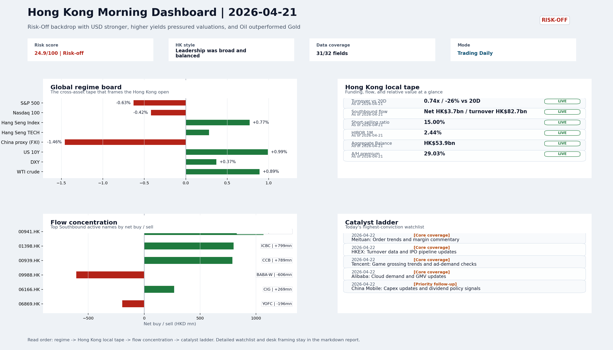

# Archived Professional Report | 2026-04-22

This is the GitHub landing page for the archived report dated `2026-04-22`.

- Report date: `2026-04-22`
- Report mode: `Trading Daily`
- Quality: `94.7/100`
- One-line pulse: Risk-Off conditions persist with USD strength and higher yields creating a credibility test for the Hang Seng's mod...
- Latest published entry: [latest/README.md](../../latest/README.md)
- Archive gallery: [archive/README.md](../README.md)
- Direct markdown file: [morning_briefing.md](./morning_briefing.md)
- Dashboard: [Open image](charts/dashboard_2026-04-22.png)
- Daily One Chart: [Open image](charts/daily_one_chart_2026-04-22.png)
- Trend Pack: [Open image](charts/hk_trend_pack_2026-04-22.png)
- Raw bundle: [Open bundle](raw/2026-04-22_bundle.json)

## Dashboard Preview

## How to use this folder

1. Start with the dashboard preview for a quick visual read.
2. Open [morning_briefing.md](./morning_briefing.md) for the full report text.
3. Use `charts/` and `raw/` only when you need supporting assets or audit data.
