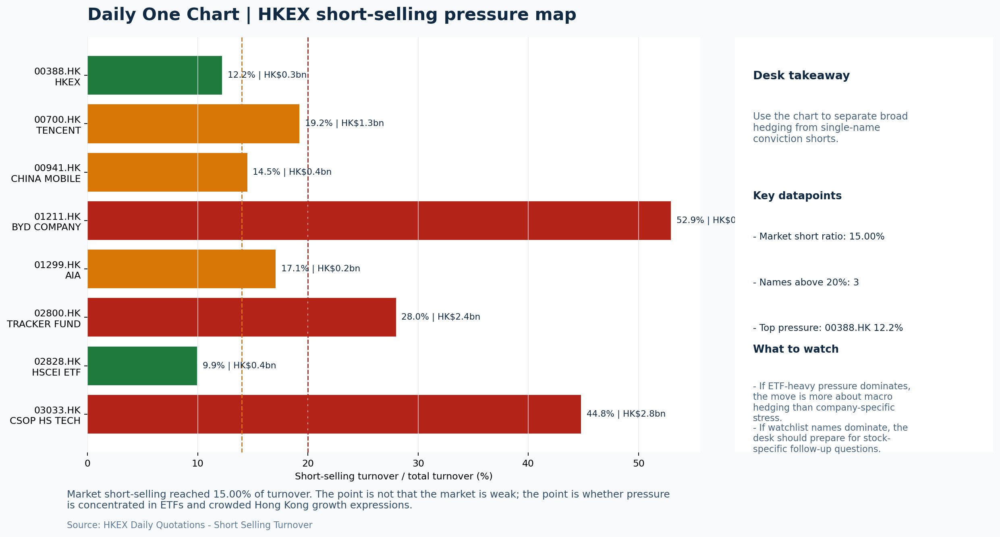
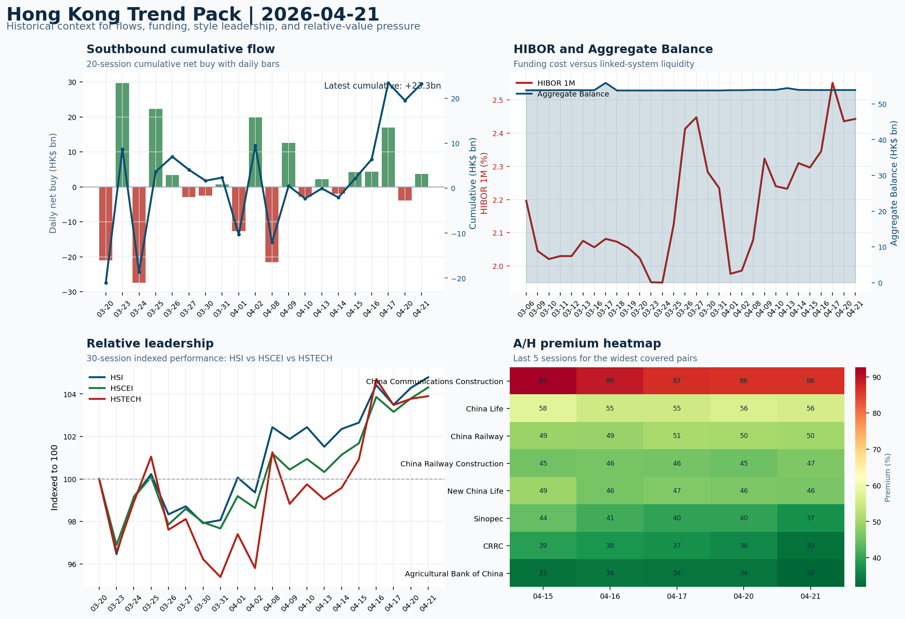

# Morning Research Workbench | 2026-04-22

> Designed for a Hong Kong sell-side commute: Layer 1 `Scan`, Layer 2 `Deep Read`, Layer 3 `Thinking`
> Mode: `Trading Daily` | Keep the report execution-oriented: what mattered in the completed session, what can move Hong Kong leadership, and what needs fast follow-up.
> Briefing date: `2026-04-22` | Review date: `2026-04-21` | Global request: `2026-04-21` | HK/China request: `2026-04-21` | Market effective date: `2026-04-21` | Generated at: `2026-04-22 07:44:30`
> Date policy: Review date 2026-04-21 is treated as `Trading Daily`. | Global request date is 2026-04-21; adapter effective date is 2026-04-21 and summary date is 2026-04-21. | HK/China local data date is 2026-04-21; role: same-session local cash tape.

> Market data quality: Coverage: `31/32` | Missing: `1`

> Report quality: `94.7/100` | Grade `A` | Status `production ready`

## Visual Dashboard

## Layer 1 | Scan (5-10 min)

### 1.1 One-Line Market Pulse
Risk-Off conditions persist with USD strength and higher yields creating a credibility test for the Hang Seng's modest April 21 gains, where thin turnover (0.74x 20D) and FXI's -1.46% decline signal weak cross-border conviction despite value/financial leadership.

### 1.2 Global Asset Price Dashboard

| Asset | Last | 1D move | Read |
| --- | --- | --- | --- |
| S&P 500 | 7,064.01 | -0.63% | US large-cap risk appetite |
| Nasdaq 100 | 26,479.47 | -0.42% | Growth and duration leadership |
| Hang Seng Index | 26,361.07 | +0.77% | Hong Kong broad beta |
| Hang Seng TECH | 4.9500 | +0.28% | Hong Kong growth / platform read-through |
| CSI 300 | 4,757.44 | +0.61% | Mainland large-cap tone |
| US 10Y | 4.2920 | +0.99% | Global discount-rate anchor |
| China 10Y | 1.75% | -1.2bp | China local rates anchor \| Live public \| Eastmoney \| 2026-04-21 |
| CN-US 10Y spread | -254.9bp | -5.2bp | Relative carry and macro-pressure gauge \| Live public \| Eastmoney \| 2026-04-21 |
| DXY | 98.41 | +0.37% | Dollar liquidity impulse |
| USD/CNH | 6.8010 | +0.00% | Offshore China risk appetite |
| USD/HKD | 7.8299 | -0.02% | Linked-exchange regime stress check |
| Brent crude | 93.90 | **-1.65%** | Energy / geopolitics |
| COMEX gold | 4,750.50 | -1.17% | Hedge demand / real yields |
| Copper | 6.0150 | -0.35% | Global growth proxy |
| VIX | 19.50 | **+3.34%** | US stress barometer |

### 1.3 Hong Kong Key Data Quick Check

| Check | Value | Status | Source / as of | Why it matters |
| --- | --- | --- | --- | --- |
| Main Board turnover vs 20D | 0.74x \| -26% vs 20D | Live local | HKEX \| 2026-04-21 | Trailing 20-session average turnover was HK$278.1bn. |
| Southbound / Northbound net flow | Southbound Net HK$3.7bn \| turnover HK$82.7bn \| Northbound Turnover HK$301.0bn \| net unavailable | Live local | HKEX Connect \| 2026-04-21 | Southbound net buy is calculated from HKEX disclosed buy and sell turnover. |
| Short-selling ratio | 15.00% | Live local | HKEX \| 2026-04-21 | Official HKEX stock-level short-selling table, aggregated as a share of total market turnover. |
| AH premium index | 29.03% | Live public | Yahoo \| 2026-04-21 | Simple average across 20 A/H pairs; use dispersion rather than the average alone. |
| USD/HKD spot vs band | 7.8299 \| band 7.7500 to 7.8500 | Live quote + local | Yahoo \| 2026-04-21 | Inside the linked-exchange band without immediate boundary stress. Official Convertibility Undertakings define the linked-rate stress boundaries for USD/HKD. |
| HIBOR 1M | 2.44% | Live local | HKMA \| 2026-04-21 | 1M HIBOR is the cleanest quick read for Hong Kong funding conditions and equity-duration pressure. |
| Aggregate Balance | HK$53.9bn | Live local | HKMA \| 2026-04-21 | Aggregate Balance helps frame whether linked-rate liquidity conditions are tight or comfortable. |
| Hong Kong leadership | Leadership was broad and balanced | Proxy fallback | HSI / HSCEI / HSTECH relative perf \| 2026-04-21 | Use HSI / HSCEI / HSTECH relative moves as the opening style read. |

### 1.4 Risk Dashboard
**Composite risk score:** `24.9/100` | **Regime:** `Risk-off`

| Component | Score impact | Evidence |
| --- | --- | --- |
| US beta | -3.8 | S&P 500 -0.63% |
| HK growth | +1.4 | HSTECH +0.28% |
| Offshore China proxy | -7.3 | FXI -1.46% |
| Dollar pressure | -3.7 | DXY +0.37% |
| Volatility | -6.7 | VIX +3.34% |
| HK short-selling | +0 | Short-selling ratio 15.00% |

### 1.5 Morning Checklist
1. **INTC -6.33%**
 Mover attribution | Announcement / expectations | Guidance reset and margin pressure
2. **Risk-Off backdrop with USD stronger, higher yields pressured valuations, and Oil outperformed Gold**
 Overnight regime | Start by deciding whether the day is about Risk-Off conditions or a style pivot.
3. **CPI MoM (Released)**
 Macro / policy | Rates expectations, the dollar, and growth-equity valuation | Industries: Technology, Internet, Brokers
4. **Trade Balance (Released)**
 Macro / policy | Watch whether it changes the day's core market narrative | Industries: To be assessed
5. **Retail Sales MoM (Upcoming)**
 Macro / policy | Consumer resilience, growth expectations, and risk-asset pricing | Industries: Consumer, E-commerce, Consumer discretionary

## Layer 2 | Deep Read (20-30 min)

### 2.1 Overnight Overseas Market Review
#### Market Setup
**Core tape.** Risk-Off dominated the April 21 session as US and European equities fell on higher yields and tech-sector weakness, while the USD strengthened against a mixed FX basket.
**Main driver.** The most significant cross-asset divergence was Oil versus Gold, with oil supported by ongoing Iran-conflict supply concerns and gold selling off as a safe-haven.
**HK relevance.** Hong Kong indices managed modest gains despite thin turnover, though the offshore China proxy FXI fell sharply, suggesting the local move lacked broad cross-border conviction.

#### Key Drivers
- Intel's -6.33% guidance reset weighed on tech/growth sentiment globally, though Hong Kong growth names held relatively better.
- Iran conflict escalation is sustaining an elevated oil price regime, with traders expecting supply disruptions to persist months.
- US 10Y yield rose +0.99% to 4.292%, pressuring duration-sensitive sectors and amplifying the risk-off tone in rates-sensitive assets.
- DXY +0.37% confirms a defensive dollar regime, which historically correlates with weaker cross-border EM/China allocation.

#### Hong Kong Read-Through
**Desk lens.** Leadership was broad and balanced.
**Opening implication.** The Hong Kong open on April 22 faces a credibility test - the local Hang Seng gains need FXI and HSTECH to confirm rather than fade. If oil holds and Retail Sales data does not deepen the Risk-Off narrative, energy names may lead.
- **Cross-market read:** Hang Seng +0.77% / HSCEI +0.61% / HSTECH +0.28%.
- **Cross-market read:** Offshore China proxy FXI -1.46% and USD/CNH +0.00% frame cross-border risk appetite.
- **Cross-market read:** USD/HKD last traded around 7.8299, which keeps the Hong Kong funding lens in focus.

#### Watch Points
- USD composite moved higher by +0.17pct intraday, with a 0.34pct range.
- Main turning points appeared around 2026-04-21 08:05 peak / 2026-04-21 08:25 peak / 2026-04-21 08:40 trough, suggesting event-driven repricing.
- The biggest cross-asset divergence was Oil versus Gold, a spread of 5.792pct.
- Gold moved -1.37pct intraday with a 2.616pct high-low range.

**Curated overnight stories**
1. **INTC -6.33%: Guidance reset and margin pressure**
 Why it matters: Intel's guidance reset signals ongoing execution challenges in semiconductors. The margin pressure narrative adds to the growth-valuation concerns already present in.
 HK read-through: Most relevant for Hong Kong tech and semiconductor names. Could pressure Hang Seng Tech Index and related ETFs given sentiment linkage to US chip sector.
2. **GE sees fuel prices higher than they are now through the summer due to the Iran conflict**
 Why it matters: Iran conflict implications extend beyond immediate headlines. Sustained fuel price elevation reshapes cost assumptions for industrials and transport sectors through mid-2026.
 HK read-through: Affects Hong Kong-listed airlines, shipping, and energy-linked names. Also reinforces the Oil-outperformed-Gold theme that dominated the April 21 session.
3. **Oil Traders Say Billion-Barrel Hole Will Linger Long After War**
 Why it matters: Traders expect supply disruption to persist months after any Hormuz resolution. Some assess flows may never return to normal, supporting an elevated oil price regime into.
 HK read-through: Supports sustained energy-sector allocation calls. Relevant for PetroChina, CNOOC, and broader energy exposure in Hang Seng Composite.
4. **CPI MoM Released; Retail Sales MoM upcoming**
 Why it matters: Released CPI data already moved rates expectations and dollar direction in the completed session.
 HK read-through: Critical for Hong Kong-linked consumer, e-commerce, and consumer-discretionary names. Data-dependent: stronger reading eases Risk-Off, weaker reinforces it.
5. **Trump administration discussing currency swap line with United Arab Emirates**
 Why it matters: Dollar liquidity provision to a key oil-trading hub has implications for petrodollar flows and USD sentiment.
 HK read-through: Secondary impact on HKD-linked dynamics and offshore CNH sentiment. Worth monitoring for USD/CNH direction heading into Hong Kong open.

### 2.2 Hong Kong / A-share Previous-Day Review
#### Local Tape Setup
**Local read.** The April 21 session delivered a mixed local read: HSI (+0.77%) and HSCEI (+0.61%) outperformed HSTECH (+0.28%) and FXI (-1.46%), suggesting a value-versus-growth split within the Hong Kong-China complex.
**Verification point.** Southbound flow of HK$3.7bn net was concentrated in financials (China Mobile +HK$1.07bn, CCB +HK$0.79bn, ICBC +HK$0.80bn) rather than internet names, while BABA-W and Tencent saw net selling.
**Risk to watch.** Main Board turnover was 0.74x the 20-session average, confirming light participation that makes the index move easier to fade.

#### Style and Local Leadership
**Style leadership.** Leadership was broad and balanced.
- **Cross-market read:** Hang Seng +0.77% / HSCEI +0.61% / HSTECH +0.28%.
- **Cross-market read:** Offshore China proxy FXI -1.46% and USD/CNH +0.00% frame cross-border risk appetite.
- **Cross-market read:** USD/HKD last traded around 7.8299, which keeps the Hong Kong funding lens in focus.
**LLM local leadership read.** Value/SOE-led: HSCEI (+0.61%) outperformed HSTECH (+0.28%), and Southbound net buying was in financials rather than internet names.

#### Flow Confirmation
Official Stock Connect evidence is available; use Section 2.3 to confirm whether local money supports the price action.

#### Follow-Through Checklist
**Follow-through check.** Confirm whether FXI recovers on April 22 and whether HSTECH ETF (3033.HK) volume picks up above 0.84x.

### 2.3 Flow Tracker and Attribution
#### Cross-Asset Attribution v1

| Driver | Direction | Score | Evidence | HK implication |
| --- | --- | --- | --- | --- |
| Hong Kong participation | drag | 2.62 | Main Board turnover was 0.74x the 20-session average. | Thin turnover makes index moves easier to fade. |
| Oil and geopolitics | supportive | 1.32 | Oil moved -1.65%. | Split the read between energy/cyclicals support and margin/geopolitical pressure. |
| Rates impulse | drag | 1.19 | US 10Y yield proxy moved +0.99%. | Lower yields help long-duration growth; higher yields pressure valuation-sensitive |
| Dollar / CNH pressure | drag | 0.55 | DXY +0.37% / USD-CNH +0.00% | A stable or softer CNH makes Hong Kong follow-through more credible. |

#### Flow Tracker
##### Flow Takeaways
- Turnover is light versus the 20-session baseline, so local moves have weaker conviction.
- Stock Connect Southbound: net HK$3.7bn on turnover HK$82.7bn (as of 2026-04-21).
- Stock Connect Northbound: turnover RMB301.0bn; public file provides total turnover/top active names, not full net-buy.
- AH premium: simple covered-pair average +29.03%; widest premium: China Communications Construction 86.42%.

##### Key Flow / Funding Metrics

| Metric | Value | Status | Source / as of | Read |
| --- | --- | --- | --- | --- |
| Southbound / Northbound net flow | Southbound Net HK$3.7bn \| turnover HK$82.7bn \| Northbound Turnover HK$301.0bn \| net unavailable | Live local | HKEX Connect \| 2026-04-21 | Southbound net buy is calculated from HKEX disclosed buy and sell turnover. |
| Main Board turnover vs 20D | 0.74x \| -26% vs 20D | Live local | HKEX \| 2026-04-21 | Trailing 20-session average turnover was HK$278.1bn. |
| Short-selling ratio | 15.00% | Live local | HKEX \| 2026-04-21 | Official HKEX stock-level short-selling table, aggregated as a share of total market turnover. |
| AH premium index | 29.03% | Live public | Yahoo \| 2026-04-21 | Simple average across 20 A/H pairs; use dispersion rather than the average alone. |
| HIBOR 1M | 2.44% | Live local | HKMA \| 2026-04-21 | 1M HIBOR is the cleanest quick read for Hong Kong funding conditions and equity-duration pressure. |
| Aggregate Balance | HK$53.9bn | Live local | HKMA \| 2026-04-21 | Aggregate Balance helps frame whether linked-rate liquidity conditions are tight or comfortable. |

##### Stock Connect Southbound Active Names

| Rank | Ticker | Name | Buy | Sell | Net buy |
| --- | --- | --- | --- | --- | --- |
| 4 | 00941.HK | CHINA MOBILE | HK$1,631.2mn | HK$564.5mn | HK$1,066.7mn |
| 10 | 01398.HK | ICBC | HK$922.3mn | HK$123.5mn | HK$798.8mn |
| 8 | 00939.HK | CCB | HK$962.5mn | HK$173.1mn | HK$789.4mn |
| 3 | 09988.HK | BABA-W | HK$917.5mn | HK$1,523.7mn | HK$-606.3mn |
| 4 | 06166.HK | CIG | HK$1,154.7mn | HK$886.2mn | HK$268.5mn |

##### AH Premium Dispersion

| Name | A ticker | H ticker | Premium | As of |
| --- | --- | --- | --- | --- |
| China Communications Construction | 601800.SS | 1800.HK | +86.42% | 2026-04-21 |
| China Life | 601628.SS | 2628.HK | +55.86% | 2026-04-21 |
| China Railway | 601390.SS | 0390.HK | +49.91% | 2026-04-21 |
| China Railway Construction | 601186.SS | 1186.HK | +46.52% | 2026-04-21 |
| New China Life | 601336.SS | 1336.HK | +46.08% | 2026-04-21 |

##### HKEX Short-Selling Watch

| Ticker | Name | Short ratio | Short turnover | Total turnover |
| --- | --- | --- | --- | --- |
| 00388.HK | HKEX | 12.22% | HK$0.3bn | HK$2.3bn |
| 00700.HK | TENCENT | 19.24% | HK$1.3bn | HK$6.8bn |
| 00941.HK | CHINA MOBILE | 14.49% | HK$0.4bn | HK$3.0bn |
| 01211.HK | BYD COMPANY | 52.94% | HK$0.9bn | HK$1.8bn |
| 01299.HK | AIA | 17.07% | HK$0.2bn | HK$1.4bn |

- **Short-value leaders:** 03033.HK CSOP HS TECH (HK$2.8bn); 02800.HK TRACKER FUND (HK$2.4bn); 00700.HK TENCENT (HK$1.3bn); 09988.HK BABA-W (HK$1.0bn).

### 2.4 Macro and Policy Tracking
**Desk read.** The completed session confirmed a Risk-Off regime: VIX at 19.5 (+3.34%) signals elevated volatility demand, while USD strength and a rising US 10Y yield at 4.292% (+0.99%) pressured duration-sensitive valuations.

**Market sensitivity.** Notably, oil outperformed gold (WTI +0.89% vs Gold -1.17%), a divergence that may reflect supply-specific dynamics rather than a pure risk appetite shift.

**HK implication.** The US CPI print for the reference period came in at 0.3% MoM, matching the consensus forecast after a prior 0.4% reading - neither sufficiently cool to ease Fed cut expectations nor hot enough to reprice aggressive tightening.

**Macro watchpoints**
- US 10Y yield direction after Powell remarks and any surprise in Retail Sales.
- VIX sustained elevation above 19 - further spike would reinforce defensive positioning.
- HK tech and internet sector leadership if growth proxies weaken on softer consumer data.
- DXY response to Retail Sales and whether USD strength persists into HK open.

| Time | Region | Event | Status | Desk read |
| --- | --- | --- | --- | --- |
| 20:30 | US | CPI MoM | Released | Impact: Rates expectations, the dollar, and growth-equity valuation \| Attention: 5/5 \| Industries: Technology, Internet, Brokers |
| 09:30 | China | Trade Balance | Released | Impact: Watch whether it changes the day's core market narrative \| Attention: 3/5 \| Industries: To be assessed |
| 20:30 | US | Retail Sales MoM | Upcoming | Impact: Consumer resilience, growth expectations, and risk-asset pricing \| Attention: 5/5 \| Industries: Consumer, E-commerce, Consumer discretionary |
| 09:20 | China | Loan Prime Rate | Upcoming | Impact: Watch whether it changes the day's core market narrative \| Attention: 3/5 \| Industries: To be assessed |
| 22:00 | Federal Reserve | Jerome Powell: Economic outlook remarks | Central bank | Impact: Policy path, liquidity conditions, and cross-asset risk appetite \| Attention: 5/5 \| Industries: Technology, Financials, Gold |
| 10:00 | PBOC | Open Market Operations Desk: Daily liquidity operation window | Central bank | Impact: Policy path, liquidity conditions, and cross-asset risk appetite \| Attention: 3/5 \| Industries: Technology, Financials, Gold |

#### Positioning and Risk Backdrop
- Options activity centered on KWEB Call, with Vol/OI at 1.88x and a bullish bias.
- Put/Call structure shows equity 0.68 / index 1.15, implying Single-stock optimism with index hedging.
- Geopolitics: Middle East | Regional tension remains elevated | Impact: Oil, freight costs, and safe-haven demand
- Geopolitics: US-China | Technology export-control rhetoric remains active | Impact: China internet, semiconductors, and supply chains

### 2.5 Key Company and Sector Events

| Grade | Sector | Headline | Why it matters | Horizon |
| --- | --- | --- | --- | --- |
| A | Autos and EV | Here's what will really matter to Tesla investors when the company | This can directly reshape earnings forecasts and the valuation framework | Short-term catalyst |
| A | Industrials | GE sees fuel prices higher than they are now through the summer due | This can directly reshape earnings forecasts and the valuation framework | Short-term catalyst |
| A | Autos and EV | Oil Traders Say Billion-Barrel Hole Will Linger Long After War | Capital allocation or shareholder-return events can trigger a valuation | Medium-term trend |
| B | China Internet | From AI shopping to video, Alibaba is making the investments | Assess whether the story can propagate through the China Internet value | Monitor |
| B | Financials | Optiver Taps Former Citadel Trader for Options Expansion | Assess whether the story can propagate through the Financials value chain | Monitor |
| C | Financials | Men's Wearhouse Owner Files Confidentially for IPO | Assess whether the story can propagate through the Financials value chain | Monitor |
| C | Autos and EV | Ambassador James F. Jeffrey on Trump extends Iran truce, blockade | Assess whether the story can propagate through the Autos and EV value | Monitor |
| C | Semiconductors and AI | US Stock Futures Rise as Trump Extends Iran Truce: Markets Wrap | Assess whether the story can propagate through the Semiconductors and AI | Monitor |

#### Company Event Takeaway
**Desk read.** Risk-off sentiment dominated the session with USD strength and higher yields compressing valuations broadly.
**Why it matters.** Oil outperformed Gold as the Iran conflict keeps energy markets on edge.
**Follow-up.** The session's most actionable item for HK markets is Morgan Stanley's upgrade of 9988.HK (Alibaba) to Overweight with a target raise to 105, signaling conviction in the AI investment story and potentially resetting.

#### LLM Quick Takes
- **9988.HK** | Morgan Stanley upgrade from Equal Weight to Overweight with target 92 to 105 is the clearest rating action.
- **0700.HK** | Reports after-market April 21. Consensus EPS 4.15 HKD and revenue 163.2bn HKD. Risk-off session may have set a lower floor for positioning ahead of results
- **0388.HK** | Reports pre-market April 22. Estimates: EPS 2.81 HKD, revenue 6.0bn HKD. Recently strengthened auditor change rules
- **0941.HK** | Closed at top of 52-week range (100% range position) on defensive flow amid risk-off. Up 2.32% today. Strong momentum but limited buffer for disappointment
- **1299.HK** | Slight underperformance at -0.84% in risk-off session. Range position at 29.7% suggests downside cushion.
- **00179.HK** | Profit warning issued April 21 (Grade A). Johnson Electric sector leadership makes it worth monitoring for industrials peer contagion.

#### HKEX Announcements

| Grade | Ticker | Type | Release time | Title |
| --- | --- | --- | --- | --- |
| A | 00179.HK | Profit warning | 2026-04-21 | Profit warning / alert announcement |
| A | 00551.HK | Profit warning | 2026-04-21 | Profit warning / alert announcement |
| A | 01651.HK | Profit warning | 2026-04-21 | Profit warning / alert announcement |
| A | 01758.HK | Profit warning | 2026-04-21 | Profit warning / alert announcement |
| A | 06068.HK | Profit warning | 2026-04-21 | Profit warning / alert announcement |
| A | 09611.HK | Profit warning | 2026-04-21 | Profit warning / alert announcement |
| A | 02158.HK | Profit warning | 2026-04-20 | Profit warning / alert announcement |
| A | 09696.HK | Profit warning | 2026-04-20 | Profit warning / alert announcement |

#### Earnings / Results Watch

| Ticker | Company | Timing | Expectation framing |
| --- | --- | --- | --- |
| 0700.HK | Tencent Holdings | After Market Close | EPS est. 4.15 HKD \| revenue est. 163.2bn HKD |
| 0388.HK | Hong Kong Exchanges and Clearing | Before Market Open | EPS est. 2.81 HKD \| revenue est. 6.0bn HKD |

#### Rating Changes
- **9988.HK** | Morgan Stanley | Upgrade | Equal Weight -> Overweight | PT 92 -> 105

#### IPO Watch
- IPO / grey-market / first-day performance should be wired to a dedicated Hong Kong ECM adapter.

### 2.6 Coverage Pools
#### Core coverage

| Name | Ticker | Last | 1D | Range position | Morning note |
| --- | --- | --- | --- | --- | --- |
| Meituan | 3690.HK | 86.45 | +1.53% | Mid-range | Positioning is neutral for now, so use it mainly to monitor marginal information |
| HKEX | 0388.HK | 417.20 | +1.36% | Mid-range | Positioning is neutral for now, so use it mainly to monitor marginal information |
| Tencent | 0700.HK | 519.00 | -0.67% | Mid-range | Positioning is neutral for now, so use it mainly to monitor marginal information |
| Alibaba | 9988.HK | 136.30 | -0.51% | Mid-range | Positioning is neutral for now, so use it mainly to monitor marginal information |

**Recent headlines for Meituan:**
- [Alibaba Stock Is Getting Hit Again, but Qwen and Cloud Growth Are Surging](https://www.marketbeat.com/originals/alibaba-stock-is-getting-hit-again-but-qwen-and-cloud-growth-are-surging/?utm_source=yahoofinance&utm_medium=yahoofinance) (MarketBeat)
- [JD.com Stock Falls as Profits Dive Despite Rising Revenue](https://www.barrons.com/articles/jd-com-earnings-stock-price-1dec392c?siteid=yhoof2&yptr=yahoo) (Barrons.com)
**Recent headlines for HKEX:**
- [HKEX strengthens governance with tougher auditor change rules](https://www.internationalaccountingbulletin.com/news/hkex-strengthens-governance-with-tougher-auditor-change-rules/) (International Accounting Bulletin)
- [Trading in Metals Contracts on London Metal Exchange Restarted](https://www.wsj.com/finance/commodities-futures/trading-in-metals-contracts-on-london-metal-exchange-halted-ab53f06c?siteid=yhoof2&yptr=yahoo) (The Wall Street Journal)
**Recent headlines for Tencent:**
- [Alibaba's Happy Oyster AI Puts 3D Game Simulation At Center Stage](https://finance.yahoo.com/markets/stocks/articles/alibaba-happy-oyster-ai-puts-170446750.html) (Simply Wall St.)
- [AI's Token Economy Revolution Creates New China Tech Winners](https://finance.yahoo.com/news/ais-token-economy-revolution-creates-new-china-tech-winners-035211861.html) (Bloomberg)
**Recent headlines for Alibaba:**
- [Alibaba (BABA) Declines More Than Market: Some Information for Investors](https://finance.yahoo.com/markets/stocks/articles/alibaba-baba-declines-more-market-214505960.html) (Zacks)
- [Microsoft must face $2.8 billion UK lawsuit over cloud computing licences](https://finance.yahoo.com/sectors/technology/articles/microsoft-must-face-2-8-164222406.html) (Reuters)

#### Priority follow-up

| Name | Ticker | Last | 1D | Range position | Morning note |
| --- | --- | --- | --- | --- | --- |
| China Mobile | 0941.HK | 83.70 | +2.32% | Top of range | Short-term price strength is clear; fresh catalysts could trigger broader group |
| AIA | 1299.HK | 82.80 | -0.84% | Mid-range | Positioning is neutral for now, so use it mainly to monitor marginal information |
| BYD Company | 1211.HK | 109.10 | -0.82% | Top of range | The name sits near the top of its recent range, so watch for profit-taking under |

**Recent headlines for China Mobile:**
- [Deutsche Telekom exploring merger with T-Mobile, Bloomberg News reports](https://finance.yahoo.com/markets/stocks/articles/deutsche-telekom-exploring-merger-t-182010144.html) (Reuters)
- [China Mobile (SEHK:941): A Closer Look at Valuation After Steady Share Price Gains This Year](https://finance.yahoo.com/news/china-mobile-sehk-941-closer-154022664.html) (Simply Wall St.)
**Recent headlines for AIA:**
- [Is It Too Late To Consider AIA Group (SEHK:1299) After Its 82% One Year Rally?](https://finance.yahoo.com/markets/stocks/articles/too-consider-aia-group-sehk-042100864.html) (Simply Wall St.)
- [Is AIA (AAGIY) Outperforming Other Finance Stocks This Year?](https://finance.yahoo.com/markets/stocks/articles/aia-aagiy-outperforming-other-finance-134003763.html) (Zacks)
**Recent headlines for BYD Company:**
- [Is BYD (SEHK:1211) Still Fairly Priced After Recent Electric Vehicle Market Headlines](https://finance.yahoo.com/markets/stocks/articles/byd-sehk-1211-still-fairly-140336704.html) (Simply Wall St.)
- [Ford CEO Jim Farley takes unexpected turn on EVs](https://www.thestreet.com/automotive/did-ford-ceo-jim-farley-just-take-a-shot-at-tesla) (TheStreet)

#### Learning watchlist

| Name | Ticker | Last | 1D | Range position | Morning note |
| --- | --- | --- | --- | --- | --- |
| Tracker Fund of Hong Kong | 2800.HK | 26.66 | +0.83% | Mid-range | Positioning is neutral for now, so use it mainly to monitor marginal information |
| HSCEI ETF | 2828.HK | 91.02 | +0.57% | Mid-range | Positioning is neutral for now, so use it mainly to monitor marginal information |
| Hang Seng TECH ETF | 3033.HK | 4.9500 | +0.28% | Mid-range | Positioning is neutral for now, so use it mainly to monitor marginal information |

## Layer 3 | Thinking (10-15 min)

### 3.1 Rotating Theme Deep Dive

| Field | Read |
| --- | --- |
| Theme | Innovative Biotech and Out-Licensing |
| Angle for the day | Watch whether clinical data, approvals, and licensing momentum are still supporting the innovative-healthcare rerating story. |

**Theme desk read**
**Core thesis.** The Risk-Off backdrop from Monday's session - USD strength, 10Y at 4.292%, VIX +3.34% - creates a harder environment for growth and long-duration positioning.
**Evidence.** The weekly Innovative Biotech/Out-Licensing theme remains worth tracking, not as a new entry case but as a watchlist builder.
**What to test.** Gold -1.17% and oil +0.89% (Oil outperforming Gold) fit the broader defensive but commodity-supported narrative.

**Signals to keep in mind**
- CVC, GTCR Weigh Take-Private of Medical Equipment Provider Teleflex: Assess whether the story can propagate through the Healthcare value
- VIX +3.34%: Higher volatility argues for tighter sizing and tighter stops.
- Gold -1.17%: Keep tracking it to confirm whether the core daily narrative is holding.

**LLM watch items:**
- Teleflex (US-listed) follow-through: if take-private story gains traction, map into Chinese CDMO/CRO names and their licensing partners for spillover.
- US CPI at 0.3% (vs 0.2% forecast): reinforces the higher-for-longer narrative; watch how HSI and tech names open Wednesday.
- US Retail Sales Wednesday 20:30 (forecast 0.3%): if soft, it could ease the rates pressure and create an intraday window for growth names.
- China Trade Balance beat (USD 85.2bn): stronger-than-expected; assess whether the market treats this as offset to US inflation concerns.
- VIX at 19.5 (+3.34%): elevated volatility supports tighter stops and reduced position sizing across the board.

**Related names to keep close:**

| Name | Ticker | Bucket | Morning read |
| --- | --- | --- | --- |
| Meituan | 3690.HK | Core coverage | Positioning is neutral for now, so use it mainly to monitor marginal information |
| China Mobile | 0941.HK | Priority follow-up | Short-term price strength is clear; fresh catalysts could trigger broader group |
| Tracker Fund of Hong Kong | 2800.HK | Learning watchlist | Positioning is neutral for now, so use it mainly to monitor marginal information |

**Relevant headlines:**
- [CVC, GTCR Weigh Take-Private of Medical Equipment Provider Teleflex](https://www.bloomberg.com/news/articles/2026-04-21/cvc-gtcr-weigh-take-private-of-medical-equipment-provider-teleflex)

### 3.2 Today Ahead and Trading Calendar
- Macro: CPI MoM is the first item to anchor the open and the rates/FX response.
- Corporate / event: Meituan: Order trends and margin commentary is the cleanest same-day catalyst to prepare for.

**Same-day macro docket**

| Time | Country | Event | Status | Detail |
| --- | --- | --- | --- | --- |
| 20:30 | US | CPI MoM | Released | Actual 0.3% / Forecast 0.2% / Prior 0.4% |
| 09:30 | China | Trade Balance | Released | Actual USD 85.2bn / Forecast USD 79.0bn / Prior USD 80.6bn |
| 20:30 | US | Retail Sales MoM | Upcoming | Forecast 0.3% / Prior 0.6% |
| 09:20 | China | Loan Prime Rate | Upcoming | Forecast 3.45% / Prior 3.45% |
| 22:00 | Federal Reserve | Jerome Powell: Economic outlook remarks | Central bank | speech |

**Same-day catalyst list**

| Date | Time | Category | Event | Importance |
| --- | --- | --- | --- | --- |
| 2026-04-22 | | Core coverage | Meituan: Order trends and margin commentary | 3 |
| 2026-04-22 | | Core coverage | HKEX: Turnover data and IPO pipeline updates | 3 |
| 2026-04-22 | | Core coverage | Tencent: Game grossing trends and ad-demand checks | 3 |
| 2026-04-22 | | Core coverage | Alibaba: Cloud demand and GMV updates | 3 |
| 2026-04-22 | | Priority follow-up | China Mobile: Capex updates and dividend policy signals | 3 |
| 2026-04-22 | | Priority follow-up | AIA: NBV trends and agency momentum | 3 |

**Next few sessions**

| Date | Category | Event | Impact |
| --- | --- | --- | --- |
| 2026-04-22 | Core coverage | Meituan: Order trends and margin commentary | High-frequency read on local services demand and platform competition |
| 2026-04-22 | Core coverage | HKEX: Turnover data and IPO pipeline updates | Direct proxy for Hong Kong market turnover, listings, and southbound |
| 2026-04-22 | Core coverage | Tencent: Game grossing trends and ad-demand checks | Core offshore China platform proxy for gaming, ads, and AI monetization |
| 2026-04-22 | Core coverage | Alibaba: Cloud demand and GMV updates | Key read-through for China consumption, cloud, and platform regulation |
| 2026-04-22 | Priority follow-up | China Mobile: Capex updates and dividend policy signals | Defensive SOE benchmark for yield trade and domestic |
| 2026-04-22 | Priority follow-up | AIA: NBV trends and agency momentum | Read-through for wealth demand, mainland visitor activity, and HK |
| 2026-04-22 | Priority follow-up | BYD Company: Weekly sales data and model rollout cadence | Hong Kong-listed proxy for EV volumes, export mix, and price competition |
| 2026-04-22 | Learning watchlist | Tracker Fund of Hong Kong: Index-turnover shifts and ETF flows | Clean listed proxy for broad HSI positioning and passive flows |

### 3.3 Daily One Chart
**Daily One Chart | HKEX short-selling pressure map**

**Chart read.** Market short-selling reached 15.00% of turnover.
**Why it matters.** The point is not that the market is weak; the point is whether pressure is concentrated in ETFs and crowded Hong Kong growth expressions.

_Source: HKEX Daily Quotations - Short Selling Turnover_

### 3.4 Hong Kong Trend Pack
**Hong Kong Trend Pack**

**Trend read.** Four historical lenses: Southbound cumulative flow, HKMA funding and liquidity, HSI/HSCEI/HSTECH relative leadership, and A/H premium dispersion.

_Source: HKEX Stock Connect, HKMA liquidity data, and public Yahoo Finance quotes_

### 3.5 Personal View Pad
- **Thinking note:** The April 21 session delivered a split read: local Hang Seng indices held firmer on financials and SOE inflows.
- **Action:** Southbound flow of HK$3.7bn net was concentrated in China Mobile (+HK$1.07bn), CCB (+HK$0.79bn), and ICBC (+HK$0.80bn).
- **Suggested market answer:** The April 21 Hang Seng move lacks conviction given thin turnover and FXI's sharp decline, so treat it as conditional rather than confirmed growth leadership.
- **Second sentence:** Today's confirmation test hinges on whether FXI stabilizes and whether US Retail Sales and Powell provide relief from the rates-driven headwind rather than extending it.
- **What could break the view:** A sharp VIX spike above 20, a hawkish Powell deviation, or weaker-than-expected Retail Sales (forecast 0.3%) could reinforce the Risk-Off narrative and quickly reverse.
- **Risk trigger:** USD/CNH direction and the failure of FXI to recover remain the most direct signals that local resilience is fading.
- Does the overnight tape still read as `Risk-Off`, or do I expect a different Hong Kong cash-session outcome?
- Is today's Hong Kong setup better described as `Leadership was broad and balanced`, and does that match my current mental model?
- What was the most important overnight surprise, and does it change my base case?
- Which sector or stock view now deserves a tighter follow-up or a revised assumption?
- If I were asked for a two-minute market view this morning, what would my answer be?
- My own view after the commute:
- What changed versus yesterday:
- Which name / sector deserves extra prep before the open:

## Traceable Appendix

### Key Questions to Keep in Mind
- Is risk appetite rising or fading? The overnight tape reads closer to `Risk-Off`.
- Did rates expectations move? Focus on whether US 10Y, DXY, and growth style moved together.
- Were commodities the real story? Watch WTI and gold for geopolitics versus inflation signals.
- Is Hong Kong setup internet-led, SOE-led, or broad beta-led? Compare HSTECH, HSCEI, and HSI.
- Did offshore markets move China risk appetite? Focus on HSI, FXI, USD/CNH, and USD/HKD.

### Report Quality and Validation
- **Quality score:** 94.7/100 | **Grade:** A | **Status:** production ready

| Component | Score | Weight | Read |
| --- | --- | --- | --- |
| Market data coverage | 96.9 | 0.3 | 31/32 core market fields available. |
| Hong Kong local metrics | 82.3 | 0.25 | 8 live, 3 proxy, 0 unavailable local checks. |
| Key public adapters | 100.0 | 0.2 | 4/4 key adapters were available or partially available. |
| LLM task health | 100.0 | 0.15 | 7/7 LLM tasks succeeded or used validated cache; 0 error(s). |
| Fact-check guardrail | 100.0 | 0.1 | Checked 6 numeric claims; 0 numeric mismatch(es), 0 logic warning(s); 0 critical, 0 review. |

**LLM fact-check guardrail**
- Checked 6 numeric claims; 0 numeric mismatch(es), 0 logic warning(s); 0 critical, 0 review.

**Adapter status**

| Adapter | Status |
| --- | --- |
| Stock Connect | ok |
| A/H premium | ok |
| HKEX announcements | ok |
| China rates | ok |

### Source Links
- [Here's what will really matter to Tesla investors when the company reports earnings](https://www.marketwatch.com/story/heres-what-will-really-matter-to-tesla-investors-when-it-reports-earnings-ba621f85?mod=mw_rss_topstories) (wsj_markets)
- [GE sees fuel prices higher than they are now through the summer due to the Iran conflict](https://www.marketwatch.com/story/ges-profit-beats-by-wide-margin-sending-its-stock-into-positive-territory-for-the-year-8463b635?mod=mw_rss_topstories) (wsj_markets)
- [Oil Traders Say Billion-Barrel Hole Will Linger Long After War](https://www.bloomberg.com/news/videos/2026-04-21/oil-traders-say-billion-barrel-hole-will-linger-post-war-video) (bloomberg_markets)
- [From AI shopping to video, Alibaba is making the investments analysts want to see](https://www.cnbc.com/2026/04/19/baba-makes-ai-investments-stock-analysts-want-to-see.html) (cnbc_markets)
- [Optiver Taps Former Citadel Trader for Options Expansion](https://www.bloomberg.com/news/articles/2026-04-21/optiver-taps-former-citadel-trader-for-options-expansion) (bloomberg_markets)
- [Men's Wearhouse Owner Files Confidentially for IPO](https://www.bloomberg.com/news/articles/2026-04-21/men-s-wearhouse-owner-files-confidentially-for-ipo) (bloomberg_markets)
- [Ambassador James F. Jeffrey on Trump extends Iran truce, blockade](https://www.bloomberg.com/news/videos/2026-04-21/fmr-deputy-natsec-advisor-on-iran-ceasefire-extension-video) (bloomberg_markets)
- [US Stock Futures Rise as Trump Extends Iran Truce: Markets Wrap](https://www.bloomberg.com/news/articles/2026-04-21/stock-market-today-dow-s-p-live-updates) (bloomberg_markets)
- [Memory Stock Valuations Spark Debate Over 'Supercycle' Potential](https://www.bloomberg.com/news/articles/2026-04-21/memory-stock-valuations-spark-debate-over-supercycle-potential) (bloomberg_markets)
- [BHP Says It Has Concluded Iron Ore Sales Negotiations With CMRG](https://www.bloomberg.com/news/articles/2026-04-21/bhp-says-it-has-concluded-iron-ore-sales-negotiations-with-cmrg) (bloomberg_markets)
- [CVC, GTCR Weigh Take-Private of Medical Equipment Provider Teleflex](https://www.bloomberg.com/news/articles/2026-04-21/cvc-gtcr-weigh-take-private-of-medical-equipment-provider-teleflex) (bloomberg_markets)
- [Commodity Traders Reap Billions in Profit as War Upends Markets](https://www.bloomberg.com/news/articles/2026-04-21/commodity-traders-reap-billions-in-profit-as-war-upends-markets) (bloomberg_markets)
- [Alibaba Stock Is Getting Hit Again, but Qwen and Cloud Growth Are Surging](https://www.marketbeat.com/originals/alibaba-stock-is-getting-hit-again-but-qwen-and-cloud-growth-are-surging/?utm_source=yahoofinance&utm_medium=yahoofinance) (MarketBeat)
- [JD.com Stock Falls as Profits Dive Despite Rising Revenue](https://www.barrons.com/articles/jd-com-earnings-stock-price-1dec392c?siteid=yhoof2&yptr=yahoo) (Barrons.com)
- [HKEX strengthens governance with tougher auditor change rules](https://www.internationalaccountingbulletin.com/news/hkex-strengthens-governance-with-tougher-auditor-change-rules/) (International Accounting Bulletin)

## Supplementary Visual Appendix

This appendix is professional-path only. It keeps a traceable index of the report visuals and the deterministic chart cues used to frame the morning note, without injecting the legacy intraday chart pack.

### Visual Index

| Visual | Path | Role |
| --- | --- | --- |
| Visual Dashboard | `charts/dashboard_2026-04-22.png` | Cross-asset regime board and Hong Kong local tape snapshot. |
| Daily One Chart | `charts/daily_one_chart_2026-04-22.png` | Single highest-conviction visual story for the day. |
| Hong Kong Trend Pack | `charts/hk_trend_pack_2026-04-22.png` | Historical context for flows, liquidity, leadership, and A/H dispersion. |

### Deterministic Chart Cues
- FX / liquidity: USD composite moved higher by +0.17pct intraday, with a 0.34pct range.
- FX / liquidity: Main turning points appeared around 2026-04-21 08:05 peak / 2026-04-21 08:25 peak / 2026-04-21 08:40 trough, suggesting event-driven repricing rather than a clean one-way USD move.
- Cross-asset: The biggest cross-asset divergence was Oil versus Gold, a spread of 5.792pct.
- Cross-asset: Gold moved -1.37pct intraday with a 2.616pct high-low range.
- Cross-asset: Oil moved +4.42pct intraday with a 7.288pct high-low range.
- Cross-asset: Bitcoin moved +0.30pct intraday with a 2.629pct high-low range.

### Risk Dashboard Components

| Component | Score impact | Evidence |
| --- | --- | --- |
| US beta | -3.8 | S&P 500 -0.63% |
| HK growth | +1.4 | HSTECH +0.28% |
| Offshore China proxy | -7.3 | FXI -1.46% |
| Dollar pressure | -3.7 | DXY +0.37% |
| Volatility | -6.7 | VIX +3.34% |
| HK short-selling | +0 | Short-selling ratio 15.00% |
