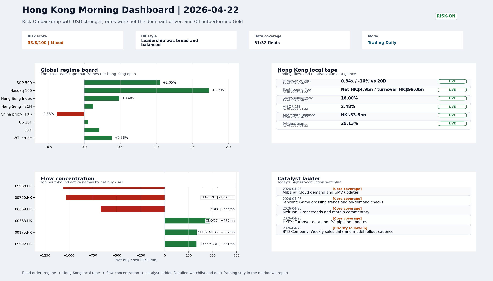
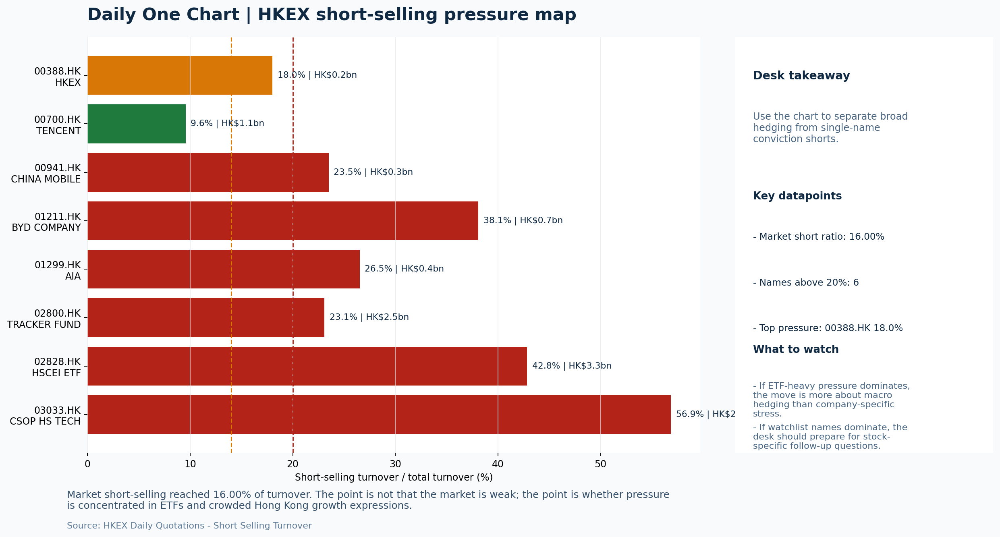
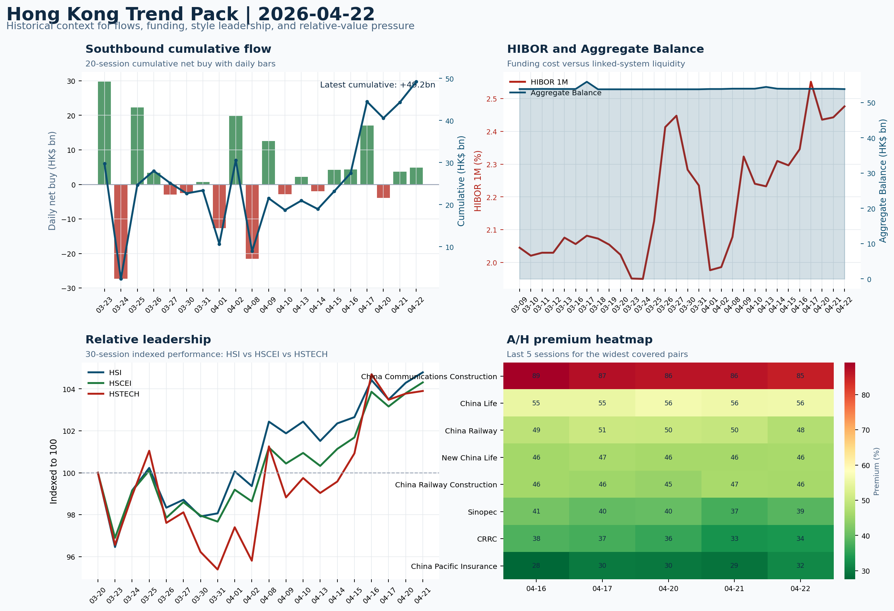

# Archived Professional Report | 2026-04-23

This is the GitHub landing page for the archived report dated `2026-04-23`.

- Report date: `2026-04-23`
- Report mode: `Trading Daily`
- Quality: `90.1/100`
- Latest published entry: [latest/README.md](../../latest/README.md)
- Archive gallery: [archive/README.md](../README.md)
- Direct markdown file: [morning_briefing.md](./morning_briefing.md)
- Dashboard: [Open image](charts/dashboard_2026-04-23.png)
- Daily One Chart: [Open image](charts/daily_one_chart_2026-04-23.png)
- Trend Pack: [Open image](charts/hk_trend_pack_2026-04-23.png)
- Raw bundle: [Open bundle](raw/2026-04-23_bundle.json)

## Dashboard Preview

---

# Morning Research Workbench | 2026-04-23

> Designed for a Hong Kong sell-side commute: Layer 1 `Scan`, Layer 2 `Deep Read`, Layer 3 `Thinking`
> Mode: `Trading Daily` | Keep the report execution-oriented: what mattered in the completed session, what can move Hong Kong leadership, and what needs fast follow-up.
> Briefing date: `2026-04-23` | Review date: `2026-04-22` | Global request: `2026-04-22` | HK/China request: `2026-04-22` | Market effective date: `2026-04-22` | Generated at: `2026-04-23 07:54:53`
> Date policy: Review date 2026-04-22 is treated as `Trading Daily`. | Global request date is 2026-04-22; adapter effective date is 2026-04-22 and summary date is 2026-04-22. | HK/China local data date is 2026-04-22; role: same-session local cash tape.

> Market data quality: Coverage: `31/32` | Missing: `1`

> Report quality: `90.1/100` | Grade `A` | Status `production ready`

## Visual Dashboard

## Layer 1 | Scan (5-10 min)

### 1.1 One-Line Market Pulse
Risk-On with a stronger USD gave Nasdaq a +1.73% lead but HSTECH (+0.12%) lagged both HSI and HSCEI on light turnover, leaving the Hong Kong open constructive in template but unconfirmed in local participation.

### 1.2 Global Asset Price Dashboard
| Asset | Last | 1D move | Read |
| --- | --- | --- | --- |
| S&P 500 | 7,137.90 | +1.05% | US large-cap risk appetite |
| Nasdaq 100 | 26,937.28 | **+1.73%** | Growth and duration leadership |
| Hang Seng Index | 26,487.48 | +0.48% | Hong Kong broad beta |
| Hang Seng TECH | 4.9560 | +0.12% | Hong Kong growth / platform read-through |
| CSI 300 | 4,768.00 | +0.22% | Mainland large-cap tone |
| US 10Y | 4.2940 | +0.05% | Global discount-rate anchor |
| China 10Y | 1.74% | -1.2bp | China local rates anchor \| Live public \| Eastmoney \| 2026-04-22 |
| CN-US 10Y spread | -256.1bp | -1.2bp | Relative carry and macro-pressure gauge \| Live public \| Eastmoney \| 2026-04-22 |
| DXY | 98.62 | +0.21% | Dollar liquidity impulse |
| USD/CNH | 6.8070 | +0.00% | Offshore China risk appetite |
| USD/HKD | 7.8303 | +0.01% | Linked-exchange regime stress check |
| Brent crude | 101.44 | **+3.01%** | Energy / geopolitics |
| COMEX gold | 4,741.60 | +0.92% | Hedge demand / real yields |
| Copper | 6.1320 | **+2.17%** | Global growth proxy |
| VIX | 18.92 | **-2.97%** | US stress barometer |

### 1.3 Hong Kong Key Data Quick Check
| Check | Value | Status | Source / as of | Why it matters |
| --- | --- | --- | --- | --- |
| Main Board turnover vs 20D | 0.84x \| -16% vs 20D | Live local | HKEX \| 2026-04-22 | Trailing 20-session average turnover was HK$273.1bn. |
| Southbound / Northbound net flow | Southbound Net HK$4.9bn \| turnover HK$99.0bn \| Northbound Turnover HK$306.4bn \| net unavailable | Live local | HKEX Connect \| 2026-04-22 | Southbound net buy is calculated from HKEX disclosed buy and sell turnover. |
| Short-selling ratio | 16.00% | Live local | HKEX \| 2026-04-22 | Official HKEX stock-level short-selling table, aggregated as a share of total market |
| AH premium index | 29.13% | Live public | Yahoo \| 2026-04-22 | Simple average across 20 A/H pairs; use dispersion rather than the average alone. |
| USD/HKD spot vs band | 7.8303 \| band 7.7500 to 7.8500 | Live quote + local | Yahoo \| 2026-04-22 | Inside the linked-exchange band without immediate boundary stress. |
| HIBOR 1M | 2.48% | Live local | HKMA \| 2026-04-22 | 1M HIBOR is the cleanest quick read for Hong Kong funding conditions and |
| Aggregate Balance | HK$53.8bn | Live local | HKMA \| 2026-04-22 | Aggregate Balance helps frame whether linked-rate liquidity conditions are tight or |
| Hong Kong leadership | Leadership was broad and balanced | Proxy fallback | HSI / HSCEI / HSTECH relative perf \| 2026-04-22 | Use HSI / HSCEI / HSTECH relative moves as the opening style read. |

### 1.4 Risk Dashboard
**Composite risk score:** `53.8/100` | **Regime:** `Mixed`

| Component | Score impact | Evidence |
| --- | --- | --- |
| US beta | +6.3 | S&P 500 +1.05% |
| HK growth | +0.6 | HSTECH +0.12% |
| Offshore China proxy | -1.9 | FXI -0.38% |
| Dollar pressure | -2.1 | DXY +0.21% |
| Volatility | +5.9 | VIX -2.97% |
| HK short-selling | +0 | Short-selling ratio 16.00% |

### 1.5 Morning Checklist
1. **INTC -6.33%**
   Mover attribution | Announcement / expectations | Guidance reset and margin pressure
2. **Risk-On backdrop with USD stronger, rates were not the dominant driver, and Oil outperformed Gold**
   Overnight regime | Start by deciding whether the day is about Risk-On conditions or a style pivot.
3. **CPI MoM (Released)**
   Macro / policy | Rates expectations, the dollar, and growth-equity valuation | Industries: Technology, Internet, Brokers
4. **[A] Tesla’s Earnings Beat Expectations Amid Focus on Robotics, Driverless Cars**
   News / announcements | This can directly reshape earnings forecasts and the valuation framework
5. **[A] Tesla 1Q Earnings Beat Estimates Sending Share Higher**
   News / announcements | This can directly reshape earnings forecasts and the valuation framework

## Layer 2 | Deep Read (20-30 min)

### 2.1 Overnight Overseas Market Review
#### Market Setup
- **Core tape:** Overnight markets exhibited a clear Risk-On character despite USD strengthening to 98.616 (+0.21%), a combination that typically signals confidence in global growth rather.
- **Main driver:** The Nasdaq 100 led at +1.73%, tracking earnings beats from Tesla and renewed AI investment framing around Alibaba, though Intel's -6.33% guidance reset kept semiconductor.
- **HK relevance:** Oil's +3.62% intraday surge versus Gold's -0.73% decline drove the largest cross-asset spread at 4.352pct.

#### Key Drivers
- Tesla earnings beat reinforces EV and robotics narrative, supportive for BYD and related HK-listed autonomous driving names.
- Intel's margin reset (-6.33%) creates mixed read-through for HK chip and hardware plays including SMIC.
- Alibaba AI investment framing improving provides incremental internet sector support at Thursday's open.
- Oil surge driven by geopolitical or demand signals; energy and cyclical names receive tailwind while margin pressure on importers warrants

#### Hong Kong Read-Through
- **Desk lens:** Leadership was broad and balanced.
- **Opening implication:** Nasdaq's +1.73% provides a constructive template for HSTECH at Thursday's open, but FXI's -0.38% decline and thin Main Board turnover (0.84x 20D)
- **Cross-market read:** Hang Seng +0.48% / HSCEI +0.50% / HSTECH +0.12%.
- **Cross-market read:** Offshore China proxy FXI -0.38% and USD/CNH +0.00% frame cross-border risk appetite.
- **Cross-market read:** USD/HKD last traded around 7.8303, which keeps the Hong Kong funding lens in focus.

#### Watch Points
- USD composite moved higher by +0.23pct intraday, with a 0.304pct range.
- Main turning points appeared around 2026-04-22 08:05 trough / 2026-04-22 08:25 peak / 2026-04-22 08:40 trough, suggesting event-driven repricing
- The biggest cross-asset divergence was Oil versus Gold, a spread of 4.352pct.
- Gold moved -0.73pct intraday with a 0.986pct high-low range.

**Curated overnight stories**
1. **Intel Falls 6.33% on Guidance Reset and Margin Pressure**
   Why it matters: Intel's guidance reset signals persistent semiconductor sector headwinds, with margin pressure pointing to structural
   HK read-through: Direct read-through to HK-listed hardware, chip design, and semiconductor names including SMIC and associated supply
2. **Tesla 1Q Earnings Beat Estimates; Shares Rise Sharply After Hours**
   Why it matters: Tesla beat adjusted EPS at 41 cents vs. 34 cents estimate. The robotics and autonomous driving narrative is
   HK read-through: Constructive for BYD and HK-listed EV/autonomous driving plays. Robotics framing also supports related tech names in
3. **CPI MoM Released; Anchors Fed Rate Expectations**
   Why it matters: US CPI data released is a key input for Fed policy trajectory. Risk-On regime noted alongside stronger USD suggests
   HK read-through: USD strength under the HK peg warrants monitoring. Stable Fed expectations support the current Risk-On backdrop
4. **Alibaba AI Investments Improving; Shares Set for Best Month Since January**
   Why it matters: Alibaba's AI-driven shopping and video investments are receiving analyst endorsement.
   HK read-through: Most directly relevant for Hong Kong China Internet names. Positive momentum in BABA sentiment can lift the broader
5. **Capital One Increases Bad-Debt Provisions 72% YoY; Earnings Miss**
   Why it matters: US regional bank credit quality deterioration. Provisions for credit losses jumped materially, suggesting consumer
   HK read-through: Limited direct exposure for HK-listed financials, but adds a data point to global credit cycle concerns.

### 2.2 Hong Kong / A-share Previous-Day Review
#### Local Tape Setup
- **Local read:** Risk-On with a stronger USD is a mixed signal for Hong Kong growth.
- **Verification point:** Southbound flows of net HK$4.9bn were concentrated in energy (CNOOC +HK$475m net), autos (Geely +HK$332m), and POP MART (+HK$331m).
- **Risk to watch:** Thin Main Board turnover at 0.84x the 20-session average means index-level moves have lower conviction.

#### Style and Local Leadership
- **Style leadership:** Leadership was broad and balanced.
- **Cross-market read:** Hang Seng +0.48% / HSCEI +0.50% / HSTECH +0.12%.
- **Cross-market read:** Offshore China proxy FXI -0.38% and USD/CNH +0.00% frame cross-border risk appetite.
- **Cross-market read:** USD/HKD last traded around 7.8303, which keeps the Hong Kong funding lens in focus.
- **LLM local leadership read:** Growth underperformed; H-shares and energy-led within the HSI basket, while HSTECH and China internet proxies (FXI) lagged.

#### Flow Confirmation
- Official Stock Connect evidence is available; use Section 2.3 to confirm whether local money supports the price action.

#### Follow-Through Checklist
- **Follow-through check:** Confirm whether HSTECH and the internet sector (Tencent, Alibaba, Meituan) can hold or build on the Nasdaq signal on 2026-04-23 despite continued short pressure

### 2.3 Flow Tracker and Attribution
#### Cross-Asset Attribution v1
| Driver | Direction | Score | Evidence | HK implication |
| --- | --- | --- | --- | --- |
| US growth-style transmission | supportive | 2.42 | Nasdaq 100 moved +1.73%. | Hong Kong growth and platform names should be tested first at the open. |
| Oil and geopolitics | mixed | 2.41 | Oil moved +3.01%. | Split the read between energy/cyclicals support and margin/geopolitical pressure. |
| Hong Kong participation | drag | 1.64 | Main Board turnover was 0.84x the 20-session average. | Thin turnover makes index moves easier to fade. |
| Global equity beta | supportive | 1.05 | S&P 500 moved +1.05%. | Broad beta matters if Hong Kong breadth confirms the overseas signal. |

#### Flow Tracker
##### Flow Takeaways
- Turnover is light versus the 20-session baseline, so local moves have weaker conviction.
- Stock Connect Southbound: net HK$4.9bn on turnover HK$99.0bn (as of 2026-04-22).
- Stock Connect Northbound: turnover RMB306.4bn; public file provides total turnover/top active names, not full net-buy.
- AH premium: simple covered-pair average +29.13%; widest premium: China Communications Construction 85.13%.

##### Key Flow / Funding Metrics
| Metric | Value | Status | Source / as of | Read |
| --- | --- | --- | --- | --- |
| Southbound / Northbound net flow | Southbound Net HK$4.9bn \| turnover HK$99.0bn \| Northbound Turnover HK$306.4bn \| net unavailable | Live local | HKEX Connect \| 2026-04-22 | Southbound net buy is calculated from HKEX disclosed buy and sell turnover. |
| Main Board turnover vs 20D | 0.84x \| -16% vs 20D | Live local | HKEX \| 2026-04-22 | Trailing 20-session average turnover was HK$273.1bn. |
| Short-selling ratio | 16.00% | Live local | HKEX \| 2026-04-22 | Official HKEX stock-level short-selling table, aggregated as a share of |
| AH premium index | 29.13% | Live public | Yahoo \| 2026-04-22 | Simple average across 20 A/H pairs; use dispersion rather than the average |
| HIBOR 1M | 2.48% | Live local | HKMA \| 2026-04-22 | 1M HIBOR is the cleanest quick read for Hong Kong funding conditions and |
| Aggregate Balance | HK$53.8bn | Live local | HKMA \| 2026-04-22 | Aggregate Balance helps frame whether linked-rate liquidity conditions are |

##### Stock Connect Southbound Active Names
| Rank | Ticker | Name | Buy | Sell | Net buy |
| --- | --- | --- | --- | --- | --- |
| 2 | 09988.HK | BABA-W | HK$2,479.0mn | HK$3,540.9mn | HK$-1,061.9mn |
| 1 | 00700.HK | TENCENT | HK$2,796.9mn | HK$3,825.3mn | HK$-1,028.4mn |
| 1 | 06869.HK | YOFC | HK$2,473.1mn | HK$3,139.2mn | HK$-666.1mn |
| 6 | 00883.HK | CNOOC | HK$1,238.0mn | HK$762.7mn | HK$475.3mn |
| 9 | 00175.HK | GEELY AUTO | HK$428.0mn | HK$95.9mn | HK$332.1mn |

##### AH Premium Dispersion
| Name | A ticker | H ticker | Premium | As of |
| --- | --- | --- | --- | --- |
| China Communications Construction | 601800.SS | 1800.HK | +85.13% | 2026-04-22 |
| China Life | 601628.SS | 2628.HK | +56.02% | 2026-04-22 |
| China Railway | 601390.SS | 0390.HK | +47.62% | 2026-04-22 |
| New China Life | 601336.SS | 1336.HK | +46.45% | 2026-04-22 |
| China Railway Construction | 601186.SS | 1186.HK | +46.24% | 2026-04-22 |

##### HKEX Short-Selling Watch
| Ticker | Name | Short ratio | Short turnover | Total turnover |
| --- | --- | --- | --- | --- |
| 00388.HK | HKEX | 18.02% | HK$0.2bn | HK$1.2bn |
| 00700.HK | TENCENT | 9.55% | HK$1.1bn | HK$11.7bn |
| 00941.HK | CHINA MOBILE | 23.49% | HK$0.3bn | HK$1.2bn |
| 01211.HK | BYD COMPANY | 38.08% | HK$0.7bn | HK$1.8bn |
| 01299.HK | AIA | 26.52% | HK$0.4bn | HK$1.5bn |

- **Short-value leaders:** 02828.HK HSCEI ETF (HK$3.3bn); 03033.HK CSOP HS TECH (HK$2.9bn); 02800.HK TRACKER FUND (HK$2.5bn); 09988.HK BABA-W (HK$1.3bn).

### 2.4 Macro and Policy Tracking
- **Desk read:** The completed session (2026-04-22) confirmed a Risk-On backdrop with USD strength and Oil outperforming Gold, which was not rates-driven.
- **Market sensitivity:** The key overnight macro events for the 2026-04-23 session are stacked.
- **HK implication:** US CPI MoM was released hot at 0.3% vs.

**Macro watchpoints**
- US 2-year and 10-year yields reaction to the hot CPI print and ahead of Powell.
- DXY direction post-CPI; stronger USD limits HK equity upside but supports HKD peg stability.
- US Retail Sales MoM actual vs. 0.3% forecast — a miss could shift Risk-On sentiment.
- Powell speech tone — any hawkish surprise would pressure duration assets and tech leadership.
| Time | Country | Event | Status | Impact | Industries | Attention |
| --- | --- | --- | --- | --- | --- | --- |
| 20:30 | US | CPI MoM | Released | Rates expectations, the dollar, and growth-equity valuation | Technology, Internet, Brokers | 5 |
| 09:30 | China | Trade Balance | Released | Watch whether it changes the day's core market narrative | To be assessed | 3 |
| 20:30 | US | Retail Sales MoM | Upcoming | Consumer resilience, growth expectations, and risk-asset pricing | Consumer, E-commerce, Consumer discretionary | 5 |
| 09:20 | China | Loan Prime Rate | Upcoming | Watch whether it changes the day's core market narrative | To be assessed | 3 |
| 22:00 | Federal Reserve | Jerome Powell: Economic outlook remarks | Central bank | Policy path, liquidity conditions, and cross-asset risk appetite | Technology, Financials, Gold | 5 |
| 10:00 | PBOC | Open Market Operations Desk: Daily liquidity operation window | Central bank | Policy path, liquidity conditions, and cross-asset risk appetite | Technology, Financials, Gold | 3 |

#### Positioning and Risk Backdrop
- Options activity centered on KWEB Call, with Vol/OI at 1.88x and a bullish bias.
- Put/Call structure shows equity 0.68 / index 1.15, implying Single-stock optimism with index hedging.
- Geopolitics: Middle East | Regional tension remains elevated | Impact: Oil, freight costs, and safe-haven demand
- Geopolitics: US-China | Technology export-control rhetoric remains active | Impact: China internet, semiconductors, and supply chains

### 2.5 Key Company and Sector Events
| Grade | Sector | Headline | Why it matters | Horizon |
| --- | --- | --- | --- | --- |
| A | Autos and EV | Tesla’s Earnings Beat Expectations Amid Focus on Robotics | This can directly reshape earnings forecasts and the valuation framework | Short-term catalyst |
| A | Autos and EV | Tesla 1Q Earnings Beat Estimates Sending Share Higher | This can directly reshape earnings forecasts and the valuation framework | Short-term catalyst |
| A | Semiconductors and AI | Rogers Hits Estimates, Boosts Cash Outlook on Spending Cut | This can directly reshape earnings forecasts and the valuation framework | Short-term catalyst |
| A | Financials | Capital One increases provision for bad-debt expenses as earnings | This can directly reshape earnings forecasts and the valuation framework | Short-term catalyst |
| A | Semiconductors and AI | KKR Invests $1.5 Billion in Tower Operator Vertical Bridge | Capital allocation or shareholder-return events can trigger a valuation | Medium-term trend |
| A | Other | Activists Want to Avoid 'Expensive' Proxy Fights: Mehrotra | Capital allocation or shareholder-return events can trigger a valuation | Medium-term trend |
| B | China Internet | From AI shopping to video, Alibaba is making the investments | Assess whether the story can propagate through the China Internet value | Monitor |
| B | Autos and EV | Boeing’s defense business is booming at a time when airplanes are | Assess whether the story can propagate through the Autos and EV value | Monitor |

#### HKEX Announcements
| Grade | Ticker | Type | Release time | Title |
| --- | --- | --- | --- | --- |
| A | 03839.HK | Profit warning | 2026-04-22 | Profit warning / alert announcement |
| A | 05834.HK | Profit warning | 2026-04-22 | Profit warning / alert announcement |
| A | 06680.HK | Profit warning | 2026-04-22 | Profit warning / alert announcement |
| A | 00179.HK | Profit warning | 2026-04-21 | Profit warning / alert announcement |
| A | 00551.HK | Profit warning | 2026-04-21 | Profit warning / alert announcement |
| A | 01651.HK | Profit warning | 2026-04-21 | Profit warning / alert announcement |
| A | 01758.HK | Profit warning | 2026-04-21 | Profit warning / alert announcement |
| A | 06068.HK | Profit warning | 2026-04-21 | Profit warning / alert announcement |

#### Earnings / Results Watch
| Ticker | Company | Timing | Expectation framing |
| --- | --- | --- | --- |
| 0700.HK | Tencent Holdings | After Market Close | EPS est. 4.15 HKD \| revenue est. 163.2bn HKD |
| 0388.HK | Hong Kong Exchanges and Clearing | Before Market Open | EPS est. 2.81 HKD \| revenue est. 6.0bn HKD |

#### Rating Changes
- **9988.HK** | Morgan Stanley | Upgrade | Equal Weight -> Overweight | PT 92 -> 105

#### IPO Watch
- IPO / grey-market / first-day performance should be wired to a dedicated Hong Kong ECM adapter.

### 2.6 Coverage Pools
#### Core coverage
| Name | Ticker | Last | 1D | Range position | Morning note |
| --- | --- | --- | --- | --- | --- |
| Alibaba | 9988.HK | 131.50 | -3.52% | Bottom of range | Short-term pressure is visible; check for a fundamental or regulatory reason. |
| Tencent | 0700.HK | 504.00 | -2.89% | Bottom of range | Short-term pressure is visible; check for a fundamental or regulatory reason. |
| Meituan | 3690.HK | 84.25 | -2.54% | Mid-range | Short-term pressure is visible; check for a fundamental or regulatory reason. |
| HKEX | 0388.HK | 416.60 | -0.14% | Mid-range | Positioning is neutral for now, so use it mainly to monitor marginal information |

**Recent headlines for Alibaba:**
- [Alibaba Weighs DeepSeek AI Stake As Social Commerce Role Expands](https://finance.yahoo.com/markets/stocks/articles/alibaba-weighs-deepseek-ai-stake-220658463.html) (Simply Wall St.)
- [Nasdaq Composite Captures Gains From Big Tech Revival and Easing Mideast Tensions](https://247wallst.com/investing/2026/04/22/nasdaq-composite-captures-gains-from-big-tech-revival-and-easing-mideast-tensions/) (24/7 Wall St.)
**Recent headlines for Tencent:**
- [Alibaba Weighs DeepSeek AI Stake As Social Commerce Role Expands](https://finance.yahoo.com/markets/stocks/articles/alibaba-weighs-deepseek-ai-stake-220658463.html) (Simply Wall St.)
- [Tencent, Alibaba in talks to invest in DeepSeek at over $20 billion valuation, The Information reports](https://finance.yahoo.com/sectors/technology/articles/tencent-alibaba-talks-invest-deepseek-113338468.html) (Reuters)
**Recent headlines for Meituan:**
- [Alibaba Stock Is Getting Hit Again, but Qwen and Cloud Growth Are Surging](https://www.marketbeat.com/originals/alibaba-stock-is-getting-hit-again-but-qwen-and-cloud-growth-are-surging/?utm_source=yahoofinance&utm_medium=yahoofinance) (MarketBeat)
- [JD.com Stock Falls as Profits Dive Despite Rising Revenue](https://www.barrons.com/articles/jd-com-earnings-stock-price-1dec392c?siteid=yhoof2&yptr=yahoo) (Barrons.com)
**Recent headlines for HKEX:**
- [HKEX strengthens governance with tougher auditor change rules](https://www.internationalaccountingbulletin.com/news/hkex-strengthens-governance-with-tougher-auditor-change-rules/) (International Accounting Bulletin)
- [Trading in Metals Contracts on London Metal Exchange Restarted](https://www.wsj.com/finance/commodities-futures/trading-in-metals-contracts-on-london-metal-exchange-halted-ab53f06c?siteid=yhoof2&yptr=yahoo) (The Wall Street Journal)

#### Priority follow-up
| Name | Ticker | Last | 1D | Range position | Morning note |
| --- | --- | --- | --- | --- | --- |
| BYD Company | 1211.HK | 107.00 | -1.92% | Mid-range | Positioning is neutral for now, so use it mainly to monitor marginal information |
| AIA | 1299.HK | 83.20 | +0.48% | Mid-range | Positioning is neutral for now, so use it mainly to monitor marginal information |
| China Mobile | 0941.HK | 83.40 | -0.36% | Top of range | The name sits near the top of its recent range, so watch for profit-taking under |

**Recent headlines for BYD Company:**
- [Tesla profits rose in the first quarter as Musk teases debut of new Roadster](https://finance.yahoo.com/markets/stocks/articles/tesla-profits-rose-first-quarter-213429595.html) (Associated Press)
- [Top Stocks That Are Powering the EV and AV Revolution](https://finance.yahoo.com/markets/stocks/articles/top-stocks-powering-ev-av-151800188.html) (Zacks)
**Recent headlines for AIA:**
- [Is It Too Late To Consider AIA Group (SEHK:1299) After Its 82% One Year Rally?](https://finance.yahoo.com/markets/stocks/articles/too-consider-aia-group-sehk-042100864.html) (Simply Wall St.)
- [Is AIA (AAGIY) Outperforming Other Finance Stocks This Year?](https://finance.yahoo.com/markets/stocks/articles/aia-aagiy-outperforming-other-finance-134003763.html) (Zacks)
**Recent headlines for China Mobile:**
- [Deutsche Telekom Weighs Full Combination With T-Mobile](https://finance.yahoo.com/markets/stocks/articles/deutsche-telekom-weighs-full-combination-115107414.html) (Bloomberg)
- [Deutsche Telekom exploring merger with T-Mobile, Bloomberg News reports](https://finance.yahoo.com/markets/stocks/articles/deutsche-telekom-exploring-merger-t-182010144.html) (Reuters)

#### Learning watchlist
| Name | Ticker | Last | 1D | Range position | Morning note |
| --- | --- | --- | --- | --- | --- |
| HSCEI ETF | 2828.HK | 91.44 | +0.46% | Mid-range | Positioning is neutral for now, so use it mainly to monitor marginal information |
| Tracker Fund of Hong Kong | 2800.HK | 26.76 | +0.38% | Mid-range | Positioning is neutral for now, so use it mainly to monitor marginal information |
| Hang Seng TECH ETF | 3033.HK | 4.9600 | +0.12% | Mid-range | Positioning is neutral for now, so use it mainly to monitor marginal information |

## Layer 3 | Thinking (10-15 min)

### 3.1 Rotating Theme Deep Dive
| Field | Read |
| --- | --- |
| Theme | China Exports and Supply-Chain Relocation |
| Angle for the day | Track tariffs, trade policy, shipping, and manufacturing orders to see whether export resilience is still the cleaner China macro expression. |

**Theme desk read**
- **Core thesis:** The Risk-On backdrop persists with VIX down 2.97% and Bitcoin up 2.52%, reinforcing a cleaner tape than last week.
- **Evidence:** USD strength and Oil outperforming Gold suggest the market is pricing growth rather than safety.
- **What to test:** Against this, the weekly China Export theme stays relevant.

**Signals to keep in mind**
- VIX -2.97%: Lower volatility signals easing stress in the tape.
- Bitcoin +2.52%: A strong crypto tape reinforces the risk-on read.

**LLM watch items:**
- Verify whether China Trade Balance beat reprices export-sector sentiment materially in Thursday HK session.
- Monitor BYD (1211.HK) for marginal information changes given neutral range positioning.
- Watch China Mobile (0941.HK) for potential profit-taking at top-of-range levels.
- Track whether US Retail Sales print (forecast 0.3% vs prior 0.6%) sustains or disrupts the Risk-On read.
- Monitor Oil vs Gold spread to confirm growth narrative integrity for the China export theme.

**Related names to keep close:**
| Name | Ticker | Bucket | Morning read |
| --- | --- | --- | --- |
| BYD Company | 1211.HK | Priority follow-up | Positioning is neutral for now, so use it mainly to monitor marginal information |
| China Mobile | 0941.HK | Priority follow-up | The name sits near the top of its recent range, so watch for profit-taking under |

**Upcoming catalysts tied to the theme:**
- 2026-04-23 | BYD Company: Weekly sales data and model rollout cadence | Hong Kong-listed proxy for EV volumes, export mix, and price competition
- 2026-04-23 | China Mobile: Capex updates and dividend policy signals | Defensive SOE benchmark for yield trade and domestic digital-infrastructure spend

### 3.2 Today Ahead and Trading Calendar
- Macro: CPI MoM is the first item to anchor the open and the rates/FX response.
- Corporate / event: Alibaba: Cloud demand and GMV updates is the cleanest same-day catalyst to prepare for.

**Same-day macro docket**
| Time | Country | Event | Status | Detail |
| --- | --- | --- | --- | --- |
| 20:30 | US | CPI MoM | Released | Actual 0.3% / Forecast 0.2% / Prior 0.4% |
| 09:30 | China | Trade Balance | Released | Actual USD 85.2bn / Forecast USD 79.0bn / Prior USD 80.6bn |
| 20:30 | US | Retail Sales MoM | Upcoming | Forecast 0.3% / Prior 0.6% |
| 09:20 | China | Loan Prime Rate | Upcoming | Forecast 3.45% / Prior 3.45% |
| 22:00 | Federal Reserve | Jerome Powell: Economic outlook remarks | Central bank | speech |

**Same-day catalyst list**
| Date | Time | Category | Event | Importance |
| --- | --- | --- | --- | --- |
| 2026-04-23 |  | Core coverage | Alibaba: Cloud demand and GMV updates | 3 |
| 2026-04-23 |  | Core coverage | Tencent: Game grossing trends and ad-demand checks | 3 |
| 2026-04-23 |  | Core coverage | Meituan: Order trends and margin commentary | 3 |
| 2026-04-23 |  | Core coverage | HKEX: Turnover data and IPO pipeline updates | 3 |
| 2026-04-23 |  | Priority follow-up | BYD Company: Weekly sales data and model rollout cadence | 3 |
| 2026-04-23 |  | Priority follow-up | AIA: NBV trends and agency momentum | 3 |

**Next few sessions**
| Date | Category | Event | Impact |
| --- | --- | --- | --- |
| 2026-04-23 | Core coverage | Alibaba: Cloud demand and GMV updates | Key read-through for China consumption, cloud, and platform regulation |
| 2026-04-23 | Core coverage | Tencent: Game grossing trends and ad-demand checks | Core offshore China platform proxy for gaming, ads, and AI monetization |
| 2026-04-23 | Core coverage | Meituan: Order trends and margin commentary | High-frequency read on local services demand and platform competition |
| 2026-04-23 | Core coverage | HKEX: Turnover data and IPO pipeline updates | Direct proxy for Hong Kong market turnover, listings, and southbound |
| 2026-04-23 | Priority follow-up | BYD Company: Weekly sales data and model rollout cadence | Hong Kong-listed proxy for EV volumes, export mix, and price competition |
| 2026-04-23 | Priority follow-up | AIA: NBV trends and agency momentum | Read-through for wealth demand, mainland visitor activity, and HK |
| 2026-04-23 | Priority follow-up | China Mobile: Capex updates and dividend policy signals | Defensive SOE benchmark for yield trade and domestic |
| 2026-04-23 | Learning watchlist | HSCEI ETF: Policy flow-through and financial/energy leadership | Useful proxy for state-owned and old-economy H-share leadership |

### 3.3 Daily One Chart
**Daily One Chart | HKEX short-selling pressure map**

- **Chart read:** Market short-selling reached 16.00% of turnover.
- **Why it matters:** The point is not that the market is weak; the point is whether pressure is concentrated in ETFs and crowded Hong Kong growth expressions.

_Source: HKEX Daily Quotations - Short Selling Turnover_

### 3.4 Hong Kong Trend Pack
**Hong Kong Trend Pack**

- **Trend read:** Four historical lenses: Southbound cumulative flow, HKMA funding and liquidity, HSI/HSCEI/HSTECH relative leadership, and A/H premium dispersion.

_Source: HKEX Stock Connect, HKMA liquidity data, and public Yahoo Finance quotes_

### 3.5 Personal View Pad
- **Thinking note:** The overnight signal is mixed rather than uniform: Tesla earnings and Alibaba AI framing support growth/tech, Intel's guidance reset warns on semiconductor sentiment.
- **Action:** Light Main Board turnover (0.84x 20D) and elevated HSCEI/HSTECH ETF short ratios (42.84%/56.86%) mean Thursday's open needs broad confirmation rather than index-only.
- **Suggested market answer:** The setup is constructive but bifurcated: Nasdaq provides a growth lead, but HSTECH underperformed and offshore China proxies (FXI -0.38%) are not confirming.
- **Second sentence:** I would treat Thursday as a confirmation test for Hong Kong tech leadership rather than a directional risk-on call, with Powell's remarks tonight as the next major.
- **What could break the view:** A hawkish Powell surprise, a hotter-than-expected US Retail Sales print, or renewed USD strength would quickly qualify the Risk-On backdrop and put pressure on.
- Does the overnight tape still read as `Risk-On`, or do I expect a different Hong Kong cash-session outcome?
- Is today's Hong Kong setup better described as `Leadership was broad and balanced`, and does that match my current mental model?
- What was the most important overnight surprise, and does it change my base case?
- Which sector or stock view now deserves a tighter follow-up or a revised assumption?
- If I were asked for a two-minute market view this morning, what would my answer be?
- My own view after the commute:
- What changed versus yesterday:
- Which name / sector deserves extra prep before the open:

## Traceable Appendix

### Key Questions to Keep in Mind
- Is risk appetite rising or fading? The overnight tape reads closer to `Risk-On`.
- Did rates expectations move? Focus on whether US 10Y, DXY, and growth style moved together.
- Were commodities the real story? Watch WTI and gold for geopolitics versus inflation signals.
- Is Hong Kong setup internet-led, SOE-led, or broad beta-led? Compare HSTECH, HSCEI, and HSI.
- Did offshore markets move China risk appetite? Focus on HSI, FXI, USD/CNH, and USD/HKD.

### Report Quality and Validation
- **Quality score:** 90.1/100 | **Grade:** A | **Status:** production ready
| Component | Score | Weight | Read |
| --- | --- | --- | --- |
| Market data coverage | 96.9 | 0.3 | 31/32 core market fields available. |
| Hong Kong local metrics | 82.3 | 0.25 | 8 live, 3 proxy, 0 unavailable local checks. |
| Key public adapters | 100.0 | 0.2 | 4/4 key adapters were available or partially available. |
| LLM task health | 85.7 | 0.15 | 6/7 LLM tasks succeeded or used validated cache; 1 error(s). |
| Fact-check guardrail | 75.0 | 0.1 | Checked 8 numeric claims; 1 numeric mismatch(es), 0 logic warning(s). |

**Quality warnings**
- LLM fact-check guardrail produced warnings; review the validation table before relying on narrative sections.

**LLM fact-check guardrail**
- Checked 8 numeric claims; 1 numeric mismatch(es), 0 logic warning(s).
| Field | Claim | Claimed | Expected | Snippet |
| --- | --- | --- | --- | --- |
| tasks.theme_deep_dive.paragraph | VIX | 2.97 | -2.97 | Risk-On backdrop persists with VIX down 2.97% and Bitcoin [trimmed] |

**Adapter status**
| Adapter | Status |
| --- | --- |
| Stock Connect | ok |
| A/H premium | ok |
| HKEX announcements | ok |
| China rates | ok |

### Source Links
- [Tesla’s Earnings Beat Expectations Amid Focus on Robotics, Driverless Cars](https://www.bloomberg.com/news/videos/2026-04-22/tesla-earnings-beat-expectations-amid-focus-on-robotics-video) (bloomberg_markets)
- [Tesla 1Q Earnings Beat Estimates Sending Share Higher](https://www.bloomberg.com/news/videos/2026-04-22/tesla-1q-earnings-beat-estimates-sending-share-higher-video) (bloomberg_markets)
- [Rogers Hits Estimates, Boosts Cash Outlook on Spending Cut](https://www.bloomberg.com/news/articles/2026-04-22/rogers-matches-estimates-as-sports-assets-drive-media-growth) (bloomberg_markets)
- [Capital One increases provision for bad-debt expenses as earnings miss Wall Street consensus](https://www.marketwatch.com/story/capital-one-increases-provision-for-bad-debt-expenses-as-earnings-miss-wall-street-consensus-842d3c98?mod=mw_rss_topstories) (wsj_markets)
- [KKR Invests $1.5 Billion in Tower Operator Vertical Bridge](https://www.bloomberg.com/news/articles/2026-04-22/kkr-is-said-to-invest-1-5-billion-in-tower-firm-vertical-bridge) (bloomberg_markets)
- [Activists Want to Avoid 'Expensive' Proxy Fights: Mehrotra](https://www.bloomberg.com/news/videos/2026-04-22/activists-want-to-avoid-expensive-proxy-fights-mehrotra-video) (bloomberg_markets)
- [From AI shopping to video, Alibaba is making the investments analysts want to see](https://www.cnbc.com/2026/04/19/baba-makes-ai-investments-stock-analysts-want-to-see.html) (cnbc_markets)
- [Boeing’s defense business is booming at a time when airplanes are disappointing](https://www.marketwatch.com/story/boeings-defense-business-is-booming-at-a-time-when-airplanes-are-disappointing-1a5ff1ac?mod=mw_rss_topstories) (wsj_markets)
- [Hassett Says He Supports Fed Chair Powell Staying On ‘Pro Tempore’](https://www.bloomberg.com/news/videos/2026-04-22/hassett-says-he-supports-powell-staying-on-pro-tempore-video) (bloomberg_markets)
- [BofA's Theisen: Markets Adapting Well to Volatility](https://www.bloomberg.com/news/videos/2026-04-22/bofa-s-theisen-markets-adapting-well-to-volatility-video) (bloomberg_markets)
- [Gold Steadies as Hormuz Standoff Keeps Inflation Risk High](https://www.bloomberg.com/news/articles/2026-04-22/gold-steadies-as-hormuz-standoff-keeps-inflation-risk-high) (bloomberg_markets)
- [Flight cuts are spreading as fuel costs surge — and higher summer fares look likely](https://www.marketwatch.com/story/airlines-cut-flights-as-fuel-costs-surge-an-economic-fallout-from-the-iran-war-that-markets-may-be-missing-8b92f5ff?mod=mw_rss_topstories) (wsj_markets)
- [Alibaba Weighs DeepSeek AI Stake As Social Commerce Role Expands](https://finance.yahoo.com/markets/stocks/articles/alibaba-weighs-deepseek-ai-stake-220658463.html) (Simply Wall St.)
- [Nasdaq Composite Captures Gains From Big Tech Revival and Easing Mideast Tensions](https://247wallst.com/investing/2026/04/22/nasdaq-composite-captures-gains-from-big-tech-revival-and-easing-mideast-tensions/) (24/7 Wall St.)
- [Tencent, Alibaba in talks to invest in DeepSeek at over $20 billion valuation, The Information reports](https://finance.yahoo.com/sectors/technology/articles/tencent-alibaba-talks-invest-deepseek-113338468.html) (Reuters)

## Supplementary Visual Appendix

This appendix is professional-path only. It keeps a traceable index of the report visuals and the deterministic chart cues used to frame the morning note, without injecting the legacy intraday chart pack.

### Visual Index
| Visual | Path | Role |
| --- | --- | --- |
| Visual Dashboard | `charts/dashboard_2026-04-23.png` | Cross-asset regime board and Hong Kong local tape snapshot. |
| Daily One Chart | `charts/daily_one_chart_2026-04-23.png` | Single highest-conviction visual story for the day. |
| Hong Kong Trend Pack | `charts/hk_trend_pack_2026-04-23.png` | Historical context for flows, liquidity, leadership, and A/H dispersion. |

### Deterministic Chart Cues
- FX / liquidity: USD composite moved higher by +0.23pct intraday, with a 0.304pct range.
- FX / liquidity: Main turning points appeared around 2026-04-22 08:05 trough / 2026-04-22 08:25 peak / 2026-04-22 08:40 trough, suggesting event-driven repricing rather than a clean one-way USD move.
- Cross-asset: The biggest cross-asset divergence was Oil versus Gold, a spread of 4.352pct.
- Cross-asset: Gold moved -0.73pct intraday with a 0.986pct high-low range.
- Cross-asset: Oil moved +3.62pct intraday with a 6.465pct high-low range.
- Cross-asset: Bitcoin moved +2.51pct intraday with a 4.315pct high-low range.

### Risk Dashboard Components
| Component | Score impact | Evidence |
| --- | --- | --- |
| US beta | +6.3 | S&P 500 +1.05% |
| HK growth | +0.6 | HSTECH +0.12% |
| Offshore China proxy | -1.9 | FXI -0.38% |
| Dollar pressure | -2.1 | DXY +0.21% |
| Volatility | +5.9 | VIX -2.97% |
| HK short-selling | +0 | Short-selling ratio 16.00% |

