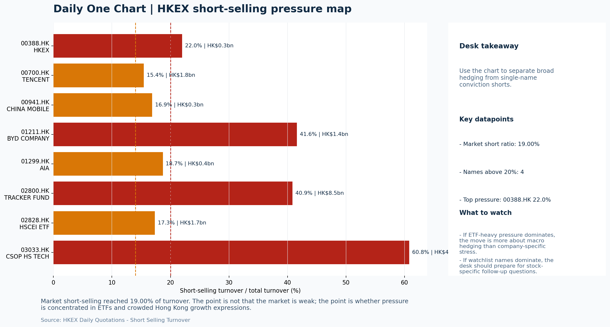
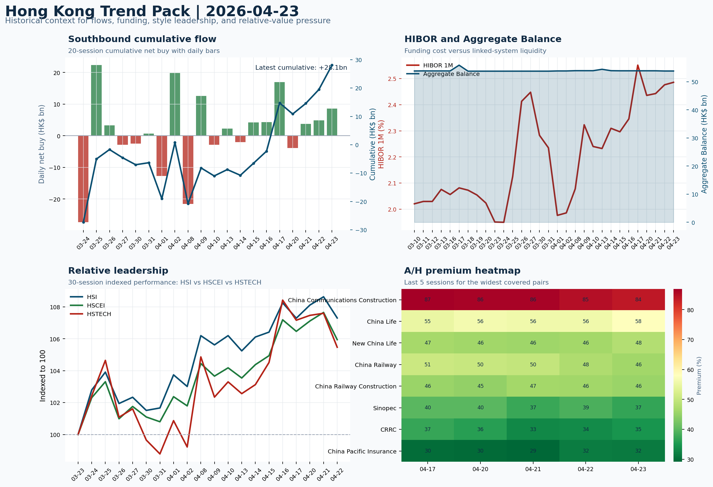

# Morning Research Workbench | 2026-04-24

> Designed for a Hong Kong sell-side commute: Layer 1 `Scan`, Layer 2 `Deep Read`, Layer 3 `Thinking`
> Mode: `Trading Daily` | Keep the report execution-oriented: what mattered in the completed session, what can move Hong Kong leadership, and what needs fast follow-up.
> Briefing date: `2026-04-24` | Review date: `2026-04-23` | Global request: `2026-04-23` | HK/China request: `2026-04-23` | Market effective date: `2026-04-23` | Generated at: `2026-04-24 07:56:20`
> Date policy: Review date 2026-04-23 is treated as `Trading Daily`. | Global request date is 2026-04-23; adapter effective date is 2026-04-23 and summary date is 2026-04-23. | HK/China local data date is 2026-04-23; role: same-session local cash tape.

> Market data quality: Coverage: `31/32` | Missing: `1`

> Report quality: `92.6/100` | Grade `A` | Status `production ready`

## Visual Dashboard

## Layer 1 | Scan (5-10 min)

### 1.1 One-Line Market Pulse
Risk-Off session on April 23 saw HSTECH (-1.98%) underperform HSCEI (-1.59%) with 19% short-selling and ETF-led flows, setting a cautious open as Intel's guidance cut (-6.33%) pressures semiconductor proxies and US Retail Sales/Powell become the next catalysts.

### 1.2 Global Asset Price Dashboard

| Asset | Last | 1D move | Read |
| --- | --- | --- | --- |
| S&P 500 | 7,108.40 | -0.41% | US large-cap risk appetite |
| Nasdaq 100 | 26,782.62 | -0.57% | Growth and duration leadership |
| Hang Seng Index | 26,163.24 | -1.22% | Hong Kong broad beta |
| Hang Seng TECH | 4.8580 | **-1.98%** | Hong Kong growth / platform read-through |
| CSI 300 | 4,799.63 | +0.66% | Mainland large-cap tone |
| US 10Y | 4.3230 | +0.68% | Global discount-rate anchor |
| China 10Y | 1.75% | +1.6bp | China local rates anchor \| Live public \| Eastmoney \| 2026-04-23 |
| CN-US 10Y spread | -258.5bp | -2.4bp | Relative carry and macro-pressure gauge \| Live public \| Eastmoney \| 2026-04-23 |
| DXY | 98.83 | +0.24% | Dollar liquidity impulse |
| USD/CNH | 6.8120 | +0.00% | Offshore China risk appetite |
| USD/HKD | 7.8320 | +0.02% | Linked-exchange regime stress check |
| Brent crude | 106.29 | **+4.30%** | Energy / geopolitics |
| COMEX gold | 4,711.90 | -0.44% | Hedge demand / real yields |
| Copper | 6.0375 | -1.35% | Global growth proxy |
| VIX | 19.31 | **+2.06%** | US stress barometer |

### 1.3 Hong Kong Key Data Quick Check

| Check | Value | Status | Source / as of | Why it matters |
| --- | --- | --- | --- | --- |
| Main Board turnover vs 20D | 0.96x \| -4% vs 20D | Live local | HKEX \| 2026-04-23 | Trailing 20-session average turnover was HK$267.3bn. |
| Southbound / Northbound net flow | Southbound Net HK$8.6bn \| turnover HK$110.5bn \| Northbound Turnover HK$353.1bn \| net unavailable | Live local | HKEX Connect \| 2026-04-23 | Southbound net buy is calculated from HKEX disclosed buy and sell turnover. |
| Short-selling ratio | 19.00% | Live local | HKEX \| 2026-04-23 | Official HKEX stock-level short-selling table, aggregated as a share of total market turnover. |
| AH premium index | 29.04% | Live public | Yahoo \| 2026-04-23 | Simple average across 20 A/H pairs; use dispersion rather than the average alone. |
| USD/HKD spot vs band | 7.8320 \| band 7.7500 to 7.8500 | Live quote + local | Yahoo \| 2026-04-23 | Inside the linked-exchange band without immediate boundary stress. Official Convertibility Undertakings define the linked-rate stress boundaries for USD/HKD. |
| HIBOR 1M | 2.49% | Live local | HKMA \| 2026-04-23 | 1M HIBOR is the cleanest quick read for Hong Kong funding conditions and equity-duration pressure. |
| Aggregate Balance | HK$53.8bn | Live local | HKMA \| 2026-04-23 | Aggregate Balance helps frame whether linked-rate liquidity conditions are tight or comfortable. |
| Hong Kong leadership | Leadership was broad and balanced | Proxy fallback | HSI / HSCEI / HSTECH relative perf \| 2026-04-23 | Use HSI / HSCEI / HSTECH relative moves as the opening style read. |

### 1.4 Risk Dashboard
**Composite risk score:** `16.6/100` | **Regime:** `Risk-off`

| Component | Score impact | Evidence |
| --- | --- | --- |
| US beta | -2.5 | S&P 500 -0.41% |
| HK growth | -9.9 | HSTECH -1.98% |
| Offshore China proxy | -6.5 | FXI -1.30% |
| Dollar pressure | -2.4 | DXY +0.24% |
| Volatility | -4.1 | VIX +2.06% |
| HK short-selling | -8 | Short-selling ratio 19.00% |

### 1.5 Morning Checklist
1. **INTC -6.33%**
 Mover attribution | Announcement / expectations | Guidance reset and margin pressure
2. **Risk-Off backdrop with USD range-bound, higher yields pressured valuations, and Oil outperformed Bitcoin**
 Overnight regime | Start by deciding whether the day is about Risk-Off conditions or a style pivot.
3. **CPI MoM (Released)**
 Macro / policy | Rates expectations, the dollar, and growth-equity valuation | Industries: Technology, Internet, Brokers
4. **[A] United's CEO Is Here to Buy Your Struggling Airline**
 News / announcements | Capital allocation or shareholder-return events can trigger a valuation reset
5. **Trade Balance (Released)**
 Macro / policy | Watch whether it changes the day's core market narrative | Industries: To be assessed

## Layer 2 | Deep Read (20-30 min)

### 2.1 Overnight Overseas Market Review
#### Market Setup
**Core tape.** Overnight markets operated in a Risk-Off regime with USD range-bound and higher yields weighing on equity valuations.
**Main driver.** Intel's post-earnings guidance cut of -6.33% was the dominant catalyst, directly threatening semiconductor proxy sentiment that matters for Hang Seng Tech given its exposure to global tech leadership.
**HK relevance.** CPI data released the same session added uncertainty on Fed path, while oil's +4.26% surge versus bitcoin's -0.13% confirmed a classic safe-haven rotation rather than a demand-recovery narrative.

#### Key Drivers
- Intel guidance reset (-6.33%) is the single highest-scoring overnight catalyst with direct implications for semiconductor proxy plays.
- US 10Y yield rose +0.68%, adding duration pressure on growth and tech-heavy indices across regions.
- Short-selling ratio of 19.00% on HKEX indicates elevated intra-session bear-side activity that argues against chasing rebounds.
- VIX rose +2.06% to 19.31, signaling elevated volatility regime that warrants tighter position sizing and stops.

#### Hong Kong Read-Through
**Desk lens.** Leadership was broad and balanced.
**Opening implication.** A lower open is the base case given HSI after-hours futures direction, HSTECH -1.98% weakness, and the Intel-driven semiconductor sentiment headwind. A rebound would need FXI and HSCEI to confirm with lighter short-selling ratios.
- **Cross-market read:** Hang Seng -1.22% / HSCEI -1.59% / HSTECH -1.98%.
- **Cross-market read:** Offshore China proxy FXI -1.30% and USD/CNH +0.00% frame cross-border risk appetite.
- **Cross-market read:** USD/HKD last traded around 7.8320, which keeps the Hong Kong funding lens in focus.

#### Watch Points
- USD composite moved higher by +0.13pct intraday, with a 0.234pct range.
- Main turning points appeared around 2026-04-23 08:10 peak / 2026-04-23 08:30 trough / 2026-04-23 08:45 peak, suggesting event-driven repricing.
- The biggest cross-asset divergence was Oil versus Bitcoin, a spread of 2.7pct.
- Gold moved -0.11pct intraday with a 1.361pct high-low range.

**Curated overnight stories**
1. **INTC -6.33% post earnings: guidance reset and margin pressure**
 Why it matters: Intel cut guidance and highlighted margin pressure, triggering a sharp selloff. This is the single highest-scoring overnight catalyst and will shape semiconductor proxy.
 HK read-through: Hang Seng Tech and local semiconductor-related names (e.g., SMIC, Hua Hong) face indirect sentiment pressure despite differing fundamentals.
2. **Risk-Off overnight regime: USD range-bound, yields higher, Oil outperforms Bitcoin**
 Why it matters: Higher yields erode growth/tech equity valuations simultaneously with geopolitical uncertainty. Oil outperforming Bitcoin confirms safe-haven rotation.
 HK read-through: Negative for Hong Kong growth and tech-heavy indices. HSI and HSTech likely open under pressure. Defensive sectors (utilities, high-dividend payers) may outperform.
3. **CPI MoM released (date: 2026-04-23)**
 Why it matters: Consumer price data shapes Fed rate expectations, dollar direction, and growth-equity multiples. Released on the same session as Intel, it could amplify or offset.
 HK read-through: Hot CPI would confirm stickier inflation and delay Fed cuts, adding to USD strength and growth-stock headwinds for Hong Kong.
4. **Bessent: 'many' U.S. allies have asked for currency swaps amid Iran war turbulence**
 Why it matters: Geopolitical risk from Iran escalation is prompting sovereigns to seek bilateral swap lines. This signals ongoing Middle East instability and elevated risk premiums in EM.
 HK read-through: Keeps USD strength narrative alive, which matters for the HK dollar peg and HK-based EM capital flows. Watch for HKD weakness or interbank rate spikes as risk indicators.
5. **United CEO signals potential airline M&A activity**
 Why it matters: Scott Kirby's acquisition ambitions signal capital allocation activity resuming in a high fuel-cost environment.
 HK read-through: Lower direct relevance to Hong Kong. Indirect impact via global travel and aviation-linked names (e.g., Cathay Pacific if airline consolidation reshapes competitive dynamics).

### 2.2 Hong Kong / A-share Previous-Day Review
#### Local Tape Setup
**Local read.** Risk-Off session on April 23 saw HSTECH (-1.98%) underperform HSCEI (-1.59%), confirming a growth-underperforming-value pattern.
**Verification point.** Southbound flows provided partial support at HK$8.6bn net, but the composition matters: TRACKER FUND (HK$3.66bn net), CSOP HS TECH (HK$849.5mn net), and HSCEI ETF (HK$823.5mn net) dominated.
**Risk to watch.** Short-selling at 19.0% of turnover with 03033.HK at 60.8% short ratio adds a mechanical headwind to any rebound attempt.

#### Style and Local Leadership
**Style leadership.** Leadership was broad and balanced.
- **Cross-market read:** Hang Seng -1.22% / HSCEI -1.59% / HSTECH -1.98%.
- **Cross-market read:** Offshore China proxy FXI -1.30% and USD/CNH +0.00% frame cross-border risk appetite.
- **Cross-market read:** USD/HKD last traded around 7.8320, which keeps the Hong Kong funding lens in focus.
**LLM local leadership read.** Value/defensive if HSTECH fails to reclaim HSCEI outperformance; ETF-led if Southbound passive buying stabilizes HSI without single-stock breadth improvement.

#### Flow Confirmation
Official Stock Connect evidence is available; use Section 2.3 to confirm whether local money supports the price action.

#### Follow-Through Checklist
**Follow-through check.** Confirm whether 03033.HK and 02800.HK short ratios compress on April 24; confirm whether FXI and HSTECH recover the style leadership read versus HSCEI; confirm whether Northbound net-buy file becomes available for the same session.

### 2.3 Flow Tracker and Attribution
#### Cross-Asset Attribution v1

| Driver | Direction | Score | Evidence | HK implication |
| --- | --- | --- | --- | --- |
| Oil and geopolitics | mixed | 3.44 | Oil moved +4.30%. | Split the read between energy/cyclicals support and margin/geopolitical pressure. |
| Short-selling pressure | drag | 2.8 | HKEX short-selling ratio was 19.00%. | Elevated short activity argues for extra confirmation before chasing rebounds. |
| Rates impulse | drag | 0.82 | US 10Y yield proxy moved +0.68%. | Lower yields help long-duration growth; higher yields pressure valuation-sensitive |

#### Flow Tracker
##### Flow Takeaways
- Short-selling pressure is elevated, so local rebounds need cleaner breadth and flow confirmation.
- Stock Connect Southbound: net HK$8.6bn on turnover HK$110.5bn (as of 2026-04-23).
- Stock Connect Northbound: turnover RMB353.1bn; public file provides total turnover/top active names, not full net-buy.
- AH premium: simple covered-pair average +29.04%; widest premium: China Communications Construction 84.01%.

##### Key Flow / Funding Metrics

| Metric | Value | Status | Source / as of | Read |
| --- | --- | --- | --- | --- |
| Southbound / Northbound net flow | Southbound Net HK$8.6bn \| turnover HK$110.5bn \| Northbound Turnover HK$353.1bn \| net unavailable | Live local | HKEX Connect \| 2026-04-23 | Southbound net buy is calculated from HKEX disclosed buy and sell turnover. |
| Main Board turnover vs 20D | 0.96x \| -4% vs 20D | Live local | HKEX \| 2026-04-23 | Trailing 20-session average turnover was HK$267.3bn. |
| Short-selling ratio | 19.00% | Live local | HKEX \| 2026-04-23 | Official HKEX stock-level short-selling table, aggregated as a share of total market turnover. |
| AH premium index | 29.04% | Live public | Yahoo \| 2026-04-23 | Simple average across 20 A/H pairs; use dispersion rather than the average alone. |
| HIBOR 1M | 2.49% | Live local | HKMA \| 2026-04-23 | 1M HIBOR is the cleanest quick read for Hong Kong funding conditions and equity-duration pressure. |
| Aggregate Balance | HK$53.8bn | Live local | HKMA \| 2026-04-23 | Aggregate Balance helps frame whether linked-rate liquidity conditions are tight or comfortable. |

##### Stock Connect Southbound Active Names

| Rank | Ticker | Name | Buy | Sell | Net buy |
| --- | --- | --- | --- | --- | --- |
| 1 | 02800.HK | TRACKER FUND | HK$3,900.1mn | HK$238.4mn | HK$3,661.7mn |
| 8 | 03033.HK | CSOP HS TECH | HK$898.9mn | HK$49.3mn | HK$849.5mn |
| 10 | 02828.HK | HSCEI ETF | HK$823.5mn | HK$0.0mn | HK$823.5mn |
| 9 | 00175.HK | GEELY AUTO | HK$102.3mn | HK$753.7mn | HK$-651.3mn |
| 4 | 09988.HK | BABA-W | HK$1,395.8mn | HK$1,991.7mn | HK$-596.0mn |

##### AH Premium Dispersion

| Name | A ticker | H ticker | Premium | As of |
| --- | --- | --- | --- | --- |
| China Communications Construction | 601800.SS | 1800.HK | +84.01% | 2026-04-23 |
| China Life | 601628.SS | 2628.HK | +57.91% | 2026-04-23 |
| New China Life | 601336.SS | 1336.HK | +47.91% | 2026-04-23 |
| China Railway | 601390.SS | 0390.HK | +46.30% | 2026-04-23 |
| China Railway Construction | 601186.SS | 1186.HK | +45.51% | 2026-04-23 |

##### HKEX Short-Selling Watch

| Ticker | Name | Short ratio | Short turnover | Total turnover |
| --- | --- | --- | --- | --- |
| 00388.HK | HKEX | 21.98% | HK$0.3bn | HK$1.2bn |
| 00700.HK | TENCENT | 15.43% | HK$1.8bn | HK$11.7bn |
| 00941.HK | CHINA MOBILE | 16.86% | HK$0.3bn | HK$1.9bn |
| 01211.HK | BYD COMPANY | 41.63% | HK$1.4bn | HK$3.3bn |
| 01299.HK | AIA | 18.70% | HK$0.4bn | HK$2.3bn |

- **Short-value leaders:** 02800.HK TRACKER FUND (HK$8.5bn); 03033.HK CSOP HS TECH (HK$4.1bn); 00700.HK TENCENT (HK$1.8bn); 02828.HK HSCEI ETF (HK$1.7bn).

### 2.4 Macro and Policy Tracking
**Desk read.** The risk-off tone that dominated Thursday's session carries into Friday with a hotter-than-expected US CPI release (0.3% actual vs 0.2% forecast) already in hand.

**Market sensitivity.** The 10-year Treasury at 4.32% and VIX at 19.3 confirm elevated risk aversion.

**HK implication.** WTI crude's 4.3% surge (+$96.9/bbl) reflects a commodity move that needs to be disaggregated between geopolitical risk premium and demand-repair dynamics.

**Macro watchpoints**
- US 10Y yield reaction to CPI release - above 4.35% would deepen pressure on HK long-duration and tech names.
- USD/HKD and HKD-linked assets as dollar liquidity conditions tighten post-CPI.
- US Retail Sales at 20:30 HKT - a below-forecast print could temporarily ease the rates blow-off but a beat extends risk-off.
- Fed Powell tone at 22:00 HKT - hawkish surprise would amplify DXY strength and cap HK equity leadership.

| Time | Region | Event | Status | Desk read |
| --- | --- | --- | --- | --- |
| 20:30 | US | CPI MoM | Released | Impact: Rates expectations, the dollar, and growth-equity valuation \| Attention: 5/5 \| Industries: Technology, Internet, Brokers |
| 09:30 | China | Trade Balance | Released | Impact: Watch whether it changes the day's core market narrative \| Attention: 3/5 \| Industries: To be assessed |
| 20:30 | US | Retail Sales MoM | Upcoming | Impact: Consumer resilience, growth expectations, and risk-asset pricing \| Attention: 5/5 \| Industries: Consumer, E-commerce, Consumer discretionary |
| 09:20 | China | Loan Prime Rate | Upcoming | Impact: Watch whether it changes the day's core market narrative \| Attention: 3/5 \| Industries: To be assessed |
| 22:00 | Federal Reserve | Jerome Powell: Economic outlook remarks | Central bank | Impact: Policy path, liquidity conditions, and cross-asset risk appetite \| Attention: 5/5 \| Industries: Technology, Financials, Gold |
| 10:00 | PBOC | Open Market Operations Desk: Daily liquidity operation window | Central bank | Impact: Policy path, liquidity conditions, and cross-asset risk appetite \| Attention: 3/5 \| Industries: Technology, Financials, Gold |

#### Positioning and Risk Backdrop
- Options activity centered on KWEB Call, with Vol/OI at 1.88x and a bullish bias.
- Put/Call structure shows equity 0.68 / index 1.15, implying Single-stock optimism with index hedging.
- Geopolitics: Middle East | Regional tension remains elevated | Impact: Oil, freight costs, and safe-haven demand
- Geopolitics: US-China | Technology export-control rhetoric remains active | Impact: China internet, semiconductors, and supply chains

### 2.5 Key Company and Sector Events

| Grade | Sector | Headline | Why it matters | Horizon |
| --- | --- | --- | --- | --- |
| A | Semiconductors and AI | United's CEO Is Here to Buy Your Struggling Airline | Capital allocation or shareholder-return events can trigger a valuation | Medium-term trend |
| A | Semiconductors and AI | Traders are betting on big moves in Intel on earnings | This can directly reshape earnings forecasts and the valuation framework | Short-term catalyst |
| A | Semiconductors and AI | Why Intel's stock is on track for a historic surge after earnings | This can directly reshape earnings forecasts and the valuation framework | Short-term catalyst |
| A | Financials | Goldman's Varadhan Signals Dealmaking Amid Volatility | Capital allocation or shareholder-return events can trigger a valuation | Medium-term trend |
| A | Autos and EV | Fmr. NFL Network, ESPN CEO on Draft, Media Deals | Capital allocation or shareholder-return events can trigger a valuation | Medium-term trend |
| A | Other | Avis Stock Collapse Sparks Drop in Dow Transports It Lifted | Assess whether the story can propagate through the Other value chain | Monitor |
| B | Other | Australia's IFM Targets Europe Defense Investment as NATO Rearms | Assess whether the story can propagate through the Other value chain | Monitor |
| C | Financials | Indian Rupee's Big Swings Under Central Bank Chief Malhotra's Watch | Assess whether the story can propagate through the Financials value chain | Monitor |

#### HKEX Announcements

| Grade | Ticker | Type | Release time | Title |
| --- | --- | --- | --- | --- |
| A | 02530.HK | Profit warning | 2026-04-23 | Profit warning / alert announcement |
| A | 03839.HK | Profit warning | 2026-04-22 | Profit warning / alert announcement |
| A | 05834.HK | Profit warning | 2026-04-22 | Profit warning / alert announcement |
| A | 06680.HK | Profit warning | 2026-04-22 | Profit warning / alert announcement |
| A | 00179.HK | Profit warning | 2026-04-21 | Profit warning / alert announcement |
| A | 00551.HK | Profit warning | 2026-04-21 | Profit warning / alert announcement |
| A | 01651.HK | Profit warning | 2026-04-21 | Profit warning / alert announcement |
| A | 01758.HK | Profit warning | 2026-04-21 | Profit warning / alert announcement |

#### Earnings / Results Watch

| Ticker | Company | Timing | Expectation framing |
| --- | --- | --- | --- |
| 0700.HK | Tencent Holdings | After Market Close | EPS est. 4.15 HKD \| revenue est. 163.2bn HKD |
| 0388.HK | Hong Kong Exchanges and Clearing | Before Market Open | EPS est. 2.81 HKD \| revenue est. 6.0bn HKD |

#### Rating Changes
- **9988.HK** | Morgan Stanley | Upgrade | Equal Weight -> Overweight | PT 92 -> 105

#### IPO Watch
- IPO / grey-market / first-day performance should be wired to a dedicated Hong Kong ECM adapter.

### 2.6 Coverage Pools
#### Core coverage

| Name | Ticker | Last | 1D | Range position | Morning note |
| --- | --- | --- | --- | --- | --- |
| Tencent | 0700.HK | 495.20 | -1.75% | Bottom of range | The name sits near the bottom of its recent range and is worth monitoring for a |
| Meituan | 3690.HK | 83.10 | -1.36% | Mid-range | Positioning is neutral for now, so use it mainly to monitor marginal information |
| HKEX | 0388.HK | 412.20 | -1.06% | Mid-range | Positioning is neutral for now, so use it mainly to monitor marginal information |
| Alibaba | 9988.HK | 130.40 | -0.84% | Bottom of range | The name sits near the bottom of its recent range and is worth monitoring for a |

**Recent headlines for Tencent:**
- [Tencent Unveils AI Model in High-Stakes Test for OpenAI Hire](https://finance.yahoo.com/sectors/technology/articles/tencent-unveils-ai-model-high-103407484.html) (Bloomberg)
- [China's DeepSeek Looks to Tap External Investors Including Alibaba, Tencent](https://www.wsj.com/tech/ai/chinas-deepseek-looks-to-tap-external-investors-including-alibaba-tencent-4fcb607d?siteid=yhoof2&yptr=yahoo) (The Wall Street Journal)
**Recent headlines for Meituan:**
- [Alibaba Stock Is Getting Hit Again, but Qwen and Cloud Growth Are Surging](https://www.marketbeat.com/originals/alibaba-stock-is-getting-hit-again-but-qwen-and-cloud-growth-are-surging/?utm_source=yahoofinance&utm_medium=yahoofinance) (MarketBeat)
- [JD.com Stock Falls as Profits Dive Despite Rising Revenue](https://www.barrons.com/articles/jd-com-earnings-stock-price-1dec392c?siteid=yhoof2&yptr=yahoo) (Barrons.com)
**Recent headlines for HKEX:**
- [HKEX strengthens governance with tougher auditor change rules](https://www.internationalaccountingbulletin.com/news/hkex-strengthens-governance-with-tougher-auditor-change-rules/) (International Accounting Bulletin)
- [Trading in Metals Contracts on London Metal Exchange Restarted](https://www.wsj.com/finance/commodities-futures/trading-in-metals-contracts-on-london-metal-exchange-halted-ab53f06c?siteid=yhoof2&yptr=yahoo) (The Wall Street Journal)
**Recent headlines for Alibaba:**
- [Alibaba.com president: How small businesses win online](https://finance.yahoo.com/video/alibabacom-president-how-small-businesses-win-online-100000967.html) (Yahoo Finance Video)
- [Zelos Technology Targets $600 Million Hong Kong IPO With Autonomous Delivery Scale](https://finance.yahoo.com/markets/stocks/articles/zelos-technology-targets-600-million-181528135.html) (GuruFocus.com)

#### Priority follow-up

| Name | Ticker | Last | 1D | Range position | Morning note |
| --- | --- | --- | --- | --- | --- |
| BYD Company | 1211.HK | 103.50 | -3.27% | Mid-range | Short-term pressure is visible; check for a fundamental or regulatory reason. |
| AIA | 1299.HK | 81.75 | -1.74% | Bottom of range | The name sits near the bottom of its recent range and is worth monitoring for a |
| China Mobile | 0941.HK | 84.00 | +0.72% | Top of range | The name sits near the top of its recent range, so watch for profit-taking under |

**Recent headlines for BYD Company:**
- [Tesla profits up but growth concerns linger as Musk lays out spending plans](https://www.euronews.com/2026/04/23/tesla-profits-up-but-growth-concerns-linger-as-musk-lays-out-spending-plans?utm_source=yahoo&utm_campaign=feeds_business_articles_2024&utm_medium=referral) (Euronews)
- [Now Even Volvo Is Putting Tesla in the Rearview Mirror?](https://www.fool.com/investing/2026/04/23/now-even-volvo-is-putting-tesla-in-the-rearview-mi/) (Motley Fool)
**Recent headlines for AIA:**
- [Is It Too Late To Consider AIA Group (SEHK:1299) After Its 82% One Year Rally?](https://finance.yahoo.com/markets/stocks/articles/too-consider-aia-group-sehk-042100864.html) (Simply Wall St.)
- [Is AIA (AAGIY) Outperforming Other Finance Stocks This Year?](https://finance.yahoo.com/markets/stocks/articles/aia-aagiy-outperforming-other-finance-134003763.html) (Zacks)
**Recent headlines for China Mobile:**
- [Deutsche Telekom Weighs Full Combination With T-Mobile](https://finance.yahoo.com/markets/stocks/articles/deutsche-telekom-weighs-full-combination-115107414.html) (Bloomberg)
- [Deutsche Telekom exploring merger with T-Mobile, Bloomberg News reports](https://finance.yahoo.com/markets/stocks/articles/deutsche-telekom-exploring-merger-t-182010144.html) (Reuters)

#### Learning watchlist

| Name | Ticker | Last | 1D | Range position | Morning note |
| --- | --- | --- | --- | --- | --- |
| Hang Seng TECH ETF | 3033.HK | 4.8600 | -1.98% | Mid-range | Positioning is neutral for now, so use it mainly to monitor marginal information |
| HSCEI ETF | 2828.HK | 90.18 | -1.38% | Mid-range | Positioning is neutral for now, so use it mainly to monitor marginal information |
| Tracker Fund of Hong Kong | 2800.HK | 26.46 | -1.12% | Mid-range | Positioning is neutral for now, so use it mainly to monitor marginal information |

## Layer 3 | Thinking (10-15 min)

### 3.1 Rotating Theme Deep Dive

| Field | Read |
| --- | --- |
| Theme | Hong Kong Market Structure and Flows |
| Angle for the day | Focus on turnover, Stock Connect, ETF flows, HKEX activity, and style leadership to understand whether Hong Kong is being driven by fundamentals or positioning. |

**Theme desk read**
**Core thesis.** The Risk-Off backdrop persists in the Hong Kong session as yields inch higher and volatility elevated.
**Evidence.** WTI crude jumped 4.26% to USD 96.92 while the VIX rose 2.06% to 19.31, a combination that argues for tighter sizing and shorter duration exposure in growth names.
**What to test.** Copper's 1.35% decline further weakens the cyclical growth signal.

**Signals to keep in mind**
- WTI crude +4.26%: A strong crude move needs to be split between geopolitics and demand repair.
- VIX +2.06%: Higher volatility argues for tighter sizing and tighter stops.

**LLM watch items:**
- US Retail Sales MoM (forecast 0.3%, prior 0.6%) - the result will determine whether Risk-Off continues as the dominant theme
- BYD (1211.HK) attribution - clarify whether the 3.27% decline is sector rotation or company-specific catalyst
- HKEX (0388.HK) turnover data and IPO pipeline updates - confirm whether southbound flows respond to Risk-Off
- China Loan Prime Rate decision at 09:20 HKT - watch for any surprise versus the 3.45% forecast hold
- WTI crude above USD 96 - if the geopolitics component persists, energy names on the HSCEI warrant closer monitoring

**Related names to keep close:**

| Name | Ticker | Bucket | Morning read |
| --- | --- | --- | --- |
| HKEX | 0388.HK | Core coverage | Positioning is neutral for now, so use it mainly to monitor marginal information |
| BYD Company | 1211.HK | Priority follow-up | Short-term pressure is visible; check for a fundamental or regulatory reason. |
| Hang Seng TECH ETF | 3033.HK | Learning watchlist | Positioning is neutral for now, so use it mainly to monitor marginal information |
| HSCEI ETF | 2828.HK | Learning watchlist | Positioning is neutral for now, so use it mainly to monitor marginal information |

**Upcoming catalysts tied to the theme:**
- 2026-04-24 | HKEX: Turnover data and IPO pipeline updates | Direct proxy for Hong Kong market turnover, listings, and southbound interest
- 2026-04-24 | BYD Company: Weekly sales data and model rollout cadence | Hong Kong-listed proxy for EV volumes, export mix, and price competition
- 2026-04-24 | Hang Seng TECH ETF: AI narrative shifts and China platform regulation headlines | Fast proxy for Hong Kong internet and growth leadership
- 2026-04-24 | HSCEI ETF: Policy flow-through and financial/energy leadership | Useful proxy for state-owned and old-economy H-share leadership

### 3.2 Today Ahead and Trading Calendar
- Macro: CPI MoM is the first item to anchor the open and the rates/FX response.
- Corporate / event: Tencent: Game grossing trends and ad-demand checks is the cleanest same-day catalyst to prepare for.

**Same-day macro docket**

| Time | Country | Event | Status | Detail |
| --- | --- | --- | --- | --- |
| 20:30 | US | CPI MoM | Released | Actual 0.3% / Forecast 0.2% / Prior 0.4% |
| 09:30 | China | Trade Balance | Released | Actual USD 85.2bn / Forecast USD 79.0bn / Prior USD 80.6bn |
| 20:30 | US | Retail Sales MoM | Upcoming | Forecast 0.3% / Prior 0.6% |
| 09:20 | China | Loan Prime Rate | Upcoming | Forecast 3.45% / Prior 3.45% |
| 22:00 | Federal Reserve | Jerome Powell: Economic outlook remarks | Central bank | speech |

**Same-day catalyst list**

| Date | Time | Category | Event | Importance |
| --- | --- | --- | --- | --- |
| 2026-04-24 | | Core coverage | Tencent: Game grossing trends and ad-demand checks | 3 |
| 2026-04-24 | | Core coverage | Meituan: Order trends and margin commentary | 3 |
| 2026-04-24 | | Core coverage | HKEX: Turnover data and IPO pipeline updates | 3 |
| 2026-04-24 | | Core coverage | Alibaba: Cloud demand and GMV updates | 3 |
| 2026-04-24 | | Priority follow-up | BYD Company: Weekly sales data and model rollout cadence | 3 |
| 2026-04-24 | | Priority follow-up | AIA: NBV trends and agency momentum | 3 |

**Next few sessions**

| Date | Category | Event | Impact |
| --- | --- | --- | --- |
| 2026-04-24 | Core coverage | Tencent: Game grossing trends and ad-demand checks | Core offshore China platform proxy for gaming, ads, and AI monetization |
| 2026-04-24 | Core coverage | Meituan: Order trends and margin commentary | High-frequency read on local services demand and platform competition |
| 2026-04-24 | Core coverage | HKEX: Turnover data and IPO pipeline updates | Direct proxy for Hong Kong market turnover, listings, and southbound |
| 2026-04-24 | Core coverage | Alibaba: Cloud demand and GMV updates | Key read-through for China consumption, cloud, and platform regulation |
| 2026-04-24 | Priority follow-up | BYD Company: Weekly sales data and model rollout cadence | Hong Kong-listed proxy for EV volumes, export mix, and price competition |
| 2026-04-24 | Priority follow-up | AIA: NBV trends and agency momentum | Read-through for wealth demand, mainland visitor activity, and HK |
| 2026-04-24 | Priority follow-up | China Mobile: Capex updates and dividend policy signals | Defensive SOE benchmark for yield trade and domestic |
| 2026-04-24 | Learning watchlist | Hang Seng TECH ETF: AI narrative shifts and China platform | Fast proxy for Hong Kong internet and growth leadership |

### 3.3 Daily One Chart
**Daily One Chart | HKEX short-selling pressure map**

**Chart read.** Market short-selling reached 19.00% of turnover.
**Why it matters.** The point is not that the market is weak; the point is whether pressure is concentrated in ETFs and crowded Hong Kong growth expressions.

_Source: HKEX Daily Quotations - Short Selling Turnover_

### 3.4 Hong Kong Trend Pack
**Hong Kong Trend Pack**

**Trend read.** Four historical lenses: Southbound cumulative flow, HKMA funding and liquidity, HSI/HSCEI/HSTECH relative leadership, and A/H premium dispersion.

_Source: HKEX Stock Connect, HKMA liquidity data, and public Yahoo Finance quotes_

### 3.5 Personal View Pad
- **Thinking note:** Treat today as a confirmation test rather than a risk-on trigger.
- **Suggested market answer:** The setup is cautious rather than bearish: ETF flows provide some floor but short-selling concentration argues for waiting on flow confirmation.
- **Second sentence:** I would frame today as a Risk-Off hold until either short ratios compress on 03033.HK or northbound institutional data becomes available for the same session.
- **What could break the view:** A fast reversal in US yields, a hawkish Powell surprise at 22:00 HKT, or DXY strength beyond the current range would extend Risk-Off and deepen pressure on HK tech.
- Does the overnight tape still read as `Risk-Off`, or do I expect a different Hong Kong cash-session outcome?
- Is today's Hong Kong setup better described as `Leadership was broad and balanced`, and does that match my current mental model?
- What was the most important overnight surprise, and does it change my base case?
- Which sector or stock view now deserves a tighter follow-up or a revised assumption?
- If I were asked for a two-minute market view this morning, what would my answer be?
- My own view after the commute:
- What changed versus yesterday:
- Which name / sector deserves extra prep before the open:

## Traceable Appendix

### Key Questions to Keep in Mind
- Is risk appetite rising or fading? The overnight tape reads closer to `Risk-Off`.
- Did rates expectations move? Focus on whether US 10Y, DXY, and growth style moved together.
- Were commodities the real story? Watch WTI and gold for geopolitics versus inflation signals.
- Is Hong Kong setup internet-led, SOE-led, or broad beta-led? Compare HSTECH, HSCEI, and HSI.
- Did offshore markets move China risk appetite? Focus on HSI, FXI, USD/CNH, and USD/HKD.

### Report Quality and Validation
- **Quality score:** 92.6/100 | **Grade:** A | **Status:** production ready

| Component | Score | Weight | Read |
| --- | --- | --- | --- |
| Market data coverage | 96.9 | 0.3 | 31/32 core market fields available. |
| Hong Kong local metrics | 82.3 | 0.25 | 8 live, 3 proxy, 0 unavailable local checks. |
| Key public adapters | 100.0 | 0.2 | 4/4 key adapters were available or partially available. |
| LLM task health | 85.7 | 0.15 | 6/7 LLM tasks succeeded or used validated cache; 1 error(s). |
| Fact-check guardrail | 100.0 | 0.1 | Checked 6 numeric claims; 0 numeric mismatch(es), 0 logic warning(s); 0 critical, 0 review. |

**LLM fact-check guardrail**
- Checked 6 numeric claims; 0 numeric mismatch(es), 0 logic warning(s); 0 critical, 0 review.

**Adapter status**

| Adapter | Status |
| --- | --- |
| Stock Connect | ok |
| A/H premium | ok |
| HKEX announcements | ok |
| China rates | ok |

### Source Links
- [United's CEO Is Here to Buy Your Struggling Airline](https://www.bloomberg.com/news/features/2026-04-23/united-ceo-scott-kirby-faces-merger-talk-fuel-prices-turf-wars) (bloomberg_markets)
- [Traders are betting on big moves in Intel on earnings](https://www.cnbc.com/2026/04/23/traders-are-betting-on-big-moves-in-intel-on-earnings.html) (cnbc_markets)
- [Why Intel's stock is on track for a historic surge after earnings](https://www.marketwatch.com/story/why-intels-stock-is-on-track-for-a-historic-surge-after-earnings-5128afa7?mod=mw_rss_topstories) (wsj_markets)
- [Goldman's Varadhan Signals Dealmaking Amid Volatility](https://www.bloomberg.com/news/videos/2026-04-23/goldman-s-varadhan-signals-dealmaking-amid-volatility-video) (bloomberg_markets)
- [Fmr. NFL Network, ESPN CEO on Draft, Media Deals](https://www.bloomberg.com/news/videos/2026-04-23/fmr-nfl-network-espn-ceo-on-draft-media-deals-video) (bloomberg_markets)
- [Avis Stock Collapse Sparks Drop in Dow Transports It Lifted](https://www.bloomberg.com/news/articles/2026-04-23/avis-stock-collapse-sparks-plunge-in-dow-transports-it-lifted) (bloomberg_markets)
- [Australia's IFM Targets Europe Defense Investment as NATO Rearms](https://www.bloomberg.com/news/articles/2026-04-23/australia-s-ifm-targets-europe-defense-investment-as-nato-rearms) (bloomberg_markets)
- [Indian Rupee's Big Swings Under Central Bank Chief Malhotra's Watch](https://www.bloomberg.com/graphics/2026-india-rupee-moves-timeline-history/) (bloomberg_markets)
- [RBC Hires Industrials Bankers Gandhi, Choi in Advisory Push](https://www.bloomberg.com/news/articles/2026-04-23/rbc-hires-industrials-bankers-gandhi-choi-in-advisory-push) (bloomberg_markets)
- [Avis Sinks 70% in Two Days, Setting Off Cascade of Trading Halts](https://www.bloomberg.com/news/articles/2026-04-23/avis-shares-sink-57-in-two-days-as-rally-meets-a-crashing-halt) (bloomberg_markets)
- [US Stocks Decline on Rising Uncertainty Over US-Iran Ceasefire](https://www.bloomberg.com/news/articles/2026-04-23/us-futures-decline-as-us-iran-impasse-continues-oil-price-jumps) (bloomberg_markets)
- [Oil Rises Fifth Day as Trump Rhetoric Seen Hindering Iran Talks](https://www.bloomberg.com/news/articles/2026-04-23/latest-oil-market-news-and-analysis-for-april-24) (bloomberg_markets)
- [Tencent Unveils AI Model in High-Stakes Test for OpenAI Hire](https://finance.yahoo.com/sectors/technology/articles/tencent-unveils-ai-model-high-103407484.html) (Bloomberg)
- [China's DeepSeek Looks to Tap External Investors Including Alibaba, Tencent](https://www.wsj.com/tech/ai/chinas-deepseek-looks-to-tap-external-investors-including-alibaba-tencent-4fcb607d?siteid=yhoof2&yptr=yahoo) (The Wall Street Journal)
- [Alibaba Stock Is Getting Hit Again, but Qwen and Cloud Growth Are Surging](https://www.marketbeat.com/originals/alibaba-stock-is-getting-hit-again-but-qwen-and-cloud-growth-are-surging/?utm_source=yahoofinance&utm_medium=yahoofinance) (MarketBeat)

## Supplementary Visual Appendix

This appendix is professional-path only. It keeps a traceable index of the report visuals and the deterministic chart cues used to frame the morning note, without injecting the legacy intraday chart pack.

### Visual Index

| Visual | Path | Role |
| --- | --- | --- |
| Visual Dashboard | `charts/dashboard_2026-04-24.png` | Cross-asset regime board and Hong Kong local tape snapshot. |
| Daily One Chart | `charts/daily_one_chart_2026-04-24.png` | Single highest-conviction visual story for the day. |
| Hong Kong Trend Pack | `charts/hk_trend_pack_2026-04-24.png` | Historical context for flows, liquidity, leadership, and A/H dispersion. |

### Deterministic Chart Cues
- FX / liquidity: USD composite moved higher by +0.13pct intraday, with a 0.234pct range.
- FX / liquidity: Main turning points appeared around 2026-04-23 08:10 peak / 2026-04-23 08:30 trough / 2026-04-23 08:45 peak, suggesting event-driven repricing rather than a clean one-way USD move.
- Cross-asset: The biggest cross-asset divergence was Oil versus Bitcoin, a spread of 2.7pct.
- Cross-asset: Gold moved -0.11pct intraday with a 1.361pct high-low range.
- Cross-asset: Oil moved +2.57pct intraday with a 5.503pct high-low range.
- Cross-asset: Bitcoin moved -0.13pct intraday with a 1.796pct high-low range.

### Risk Dashboard Components

| Component | Score impact | Evidence |
| --- | --- | --- |
| US beta | -2.5 | S&P 500 -0.41% |
| HK growth | -9.9 | HSTECH -1.98% |
| Offshore China proxy | -6.5 | FXI -1.30% |
| Dollar pressure | -2.4 | DXY +0.24% |
| Volatility | -4.1 | VIX +2.06% |
| HK short-selling | -8 | Short-selling ratio 19.00% |
