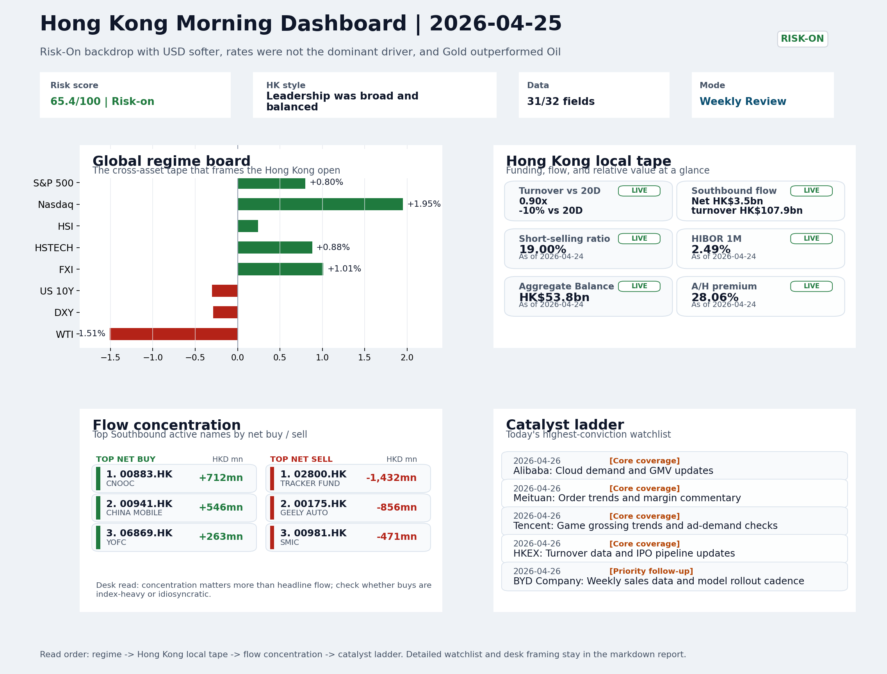
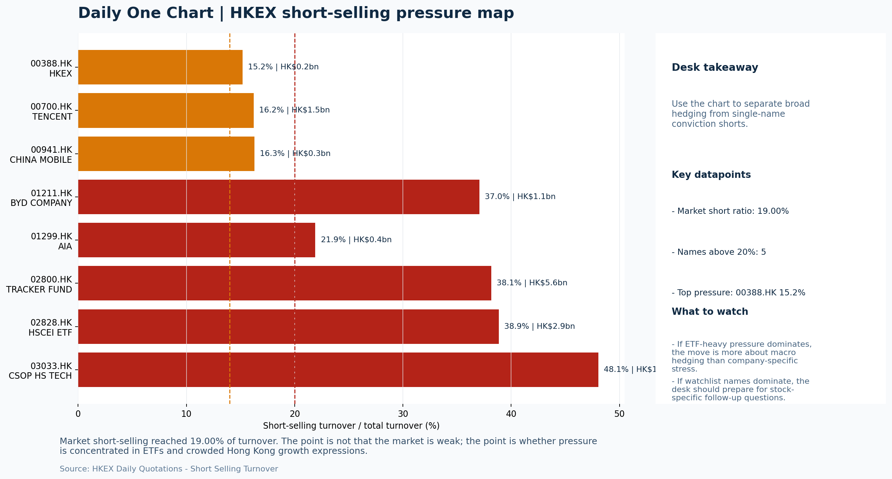
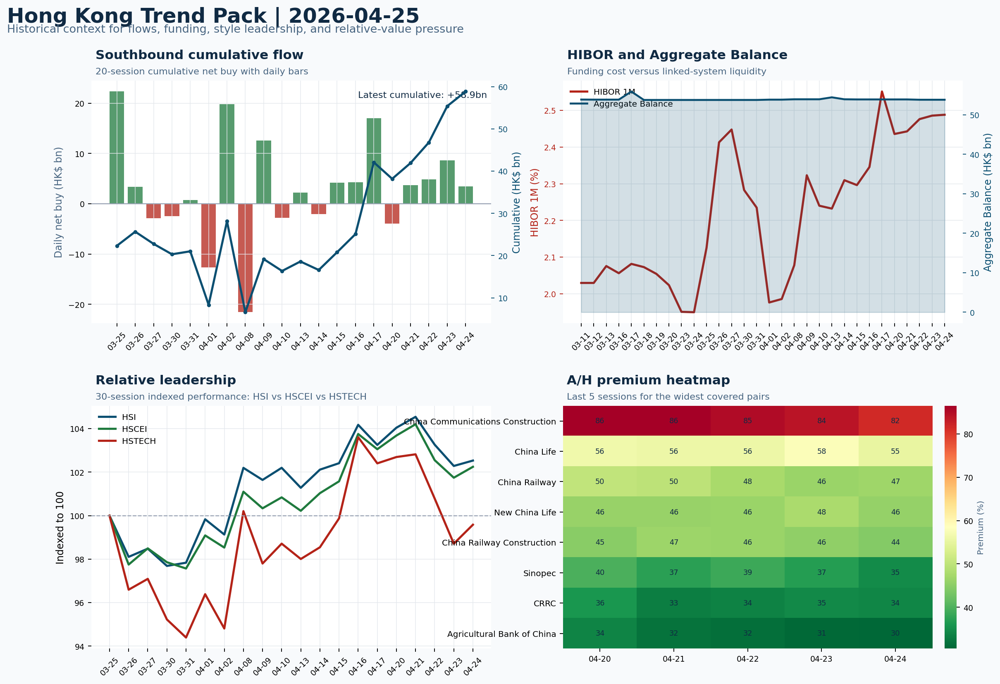

# Morning Research Workbench | 2026-04-26

> Designed for a Hong Kong sell-side commute: Layer 1 `Scan`, Layer 2 `Deep Read`, Layer 3 `Thinking`
> Mode: `Weekly Review` | Use Saturday's non-trading review date to synthesize the completed Hong Kong week and prepare next week's work plan.
> Briefing date: `2026-04-26` | Review date: `2026-04-25` | Global request: `2026-04-25` | HK/China request: `2026-04-24` | Market effective date: `2026-04-24` | Generated at: `2026-04-26 07:50:33`
> Date policy: Review date 2026-04-25 is treated as `Weekly Review`. | Global request date is 2026-04-25; adapter effective date is 2026-04-24 and summary date is 2026-04-24. | HK/China local data date is 2026-04-24; role: last completed HK/China cash-market reference tape.

> Market data quality: Coverage: `31/32` | Missing: `1`

> Report quality: `90.4/100` | Grade `A` | Status `production ready`

## Visual Dashboard

## Layer 1 | Weekly Scan (5-10 min)

### 1.1 One-Line Market Pulse
Risk-On week for Hong Kong (HSI +0.24%) was confirmed by southbound flow (+HK$16.8bn cumulative), USD softness (DXY -0.29%), and FXI (+1.01%), but elevated short-selling (19.00%) and HKD funding tightening (HIBOR +5bp) warrant confirmation before assuming sustained follow-through into next week.

### 1.2 Global Asset Price Dashboard

| Asset | Last | 1D move | Read |
| --- | --- | --- | --- |
| S&P 500 | 7,165.08 | +0.80% | US large-cap risk appetite |
| Nasdaq 100 | 27,303.67 | **+1.95%** | Growth and duration leadership |
| Hang Seng Index | 25,978.07 | +0.24% | Hong Kong broad beta |
| Hang Seng TECH | 4.8000 | +0.88% | Hong Kong growth / platform read-through |
| CSI 300 | 4,769.37 | -0.35% | Mainland large-cap tone |
| US 10Y | 4.3100 | -0.30% | Global discount-rate anchor |
| China 10Y | 1.76% | +0.5bp | China local rates anchor \| Live public \| Eastmoney \| 2026-04-24 |
| CN-US 10Y spread | -255.0bp | +3.5bp | Relative carry and macro-pressure gauge \| Live public \| Eastmoney \| 2026-04-24 |
| DXY | 98.51 | -0.29% | Dollar liquidity impulse |
| USD/CNH | 6.8110 | +0.00% | Offshore China risk appetite |
| USD/HKD | 7.8323 | +0.00% | Linked-exchange regime stress check |
| Brent crude | 105.33 | +0.25% | Energy / geopolitics |
| COMEX gold | 4,722.30 | +0.37% | Hedge demand / real yields |
| Copper | 6.0235 | -0.86% | Global growth proxy |
| VIX | 18.71 | **-3.11%** | US stress barometer |

### 1.3 Hong Kong Weekly Tape Quick Check

| Check | Value | Status | Source / as of | Why it matters |
| --- | --- | --- | --- | --- |
| Main Board turnover vs 20D | 0.90x \| -10% vs 20D | Live local | HKEX \| 2026-04-24 | Trailing 20-session average turnover was HK$261.7bn. |
| Southbound / Northbound net flow | Southbound Net HK$3.5bn \| turnover HK$107.9bn \| Northbound Turnover HK$342.9bn \| net unavailable | Live local | HKEX Connect \| 2026-04-24 | Southbound net buy is calculated from HKEX disclosed buy and sell turnover. |
| Short-selling ratio | 19.00% | Live local | HKEX \| 2026-04-24 | Official HKEX stock-level short-selling table, aggregated as a share of total market turnover. |
| AH premium index | 28.06% | Live public | Yahoo \| 2026-04-24 | Simple average across 20 A/H pairs; use dispersion rather than the average alone. |
| USD/HKD spot vs band | 7.8323 \| band 7.7500 to 7.8500 | Live quote + local | Yahoo \| 2026-04-24 | Inside the linked-exchange band without immediate boundary stress. Official Convertibility Undertakings define the linked-rate stress boundaries for USD/HKD. |
| HIBOR 1M | 2.49% | Live local | HKMA \| 2026-04-24 | 1M HIBOR is the cleanest quick read for Hong Kong funding conditions and equity-duration pressure. |
| Aggregate Balance | HK$53.8bn | Live local | HKMA \| 2026-04-24 | Aggregate Balance helps frame whether linked-rate liquidity conditions are tight or comfortable. |
| Hong Kong leadership | Leadership was broad and balanced | Proxy fallback | HSI / HSCEI / HSTECH relative perf \| 2026-04-24 | Use HSI / HSCEI / HSTECH relative moves as the opening style read. |

### 1.4 Risk Dashboard
**Composite risk score:** `65.4/100` | **Regime:** `Risk-on`

| Component | Score impact | Evidence |
| --- | --- | --- |
| US beta | +4.8 | S&P 500 +0.80% |
| HK growth | +4.4 | HSTECH +0.88% |
| Offshore China proxy | +5.0 | FXI +1.01% |
| Dollar pressure | +2.9 | DXY -0.29% |
| Volatility | +6.2 | VIX -3.11% |
| HK short-selling | -8 | Short-selling ratio 19.00% |

### 1.5 Next Week Checklist
1. **Risk-On backdrop with USD softer, rates were not the dominant driver, and Gold outperformed Oil**
 Still-moving markets | No fresh Hong Kong cash session is assumed; use global active assets and policy/event flow to prepare the next open.
2. **CPI MoM (Released)**
 Macro / policy | Rates expectations, the dollar, and growth-equity valuation | Industries: Technology, Internet, Brokers
3. **Trade Balance (Released)**
 Macro / policy | Watch whether it changes the day's core market narrative | Industries: To be assessed
4. **Retail Sales MoM (Upcoming)**
 Macro / policy | Consumer resilience, growth expectations, and risk-asset pricing | Industries: Consumer, E-commerce, Consumer discretionary
5. **[A] Traders are betting on big moves in Intel on earnings**
 News / announcements | This can directly reshape earnings forecasts and the valuation framework

## Layer 2 | Deep Read (20-30 min)

### 2.1 Weekly Cross-Asset Review
> Weekly review mode: synthesize the completed Hong Kong week, retain the main cross-asset and policy lessons, and convert them into next-week preparation rather than treating Saturday as a fresh cash-market session.

#### Market Setup
**Core tape.** Risk-On dominated the week as USD softness (DXY -0.29%) provided a marginal tailwind to EM and offshore China assets, while rates (US 10Y -0.30%) were not the dominant driver.
**Main driver.** The Gold-over-Oil spread (Gold +0.37%, Oil -1.51%) and the US-Iran war backdrop point to geopolitical risk premium that remains elevated without resolution.
**HK relevance.** Intel earnings tonight (after Friday's close) are the highest-sensitivity near-term catalyst for semiconductor and AI-adjacent HK names.

#### Key Drivers
- Short-selling ratio of 19.00% is elevated, which argues for extra confirmation before chasing rebounds or assuming sustained follow-through.
- Nasdaq 100 outperformed (+1.95%) and FXI gained +1.01%, suggesting the Risk-On tone translated into growth-style and offshore China beta.
- Southbound flow of +16.8bn over five sessions (4/5 positive) provides flow-confirmation that the week was not merely offshore beta.
- HIBOR 1M rose +5bp while Aggregate Balance contracted -HK$0.1bn.

#### Hong Kong Read-Through
**Desk lens.** Leadership was broad and balanced.
**Opening implication.** A constructive Monday open is more credible if HSTECH and FXI confirm the move with cleaner breadth.
- **Cross-market read:** Hang Seng +0.24% / HSCEI +0.49% / HSTECH +0.88%.
- **Cross-market read:** Offshore China proxy FXI +1.01% and USD/CNH +0.00% frame cross-border risk appetite.
- **Cross-market read:** USD/HKD last traded around 7.8323, which keeps the Hong Kong funding lens in focus.

#### Watch Points
- USD composite moved lower by -0.34pct intraday, with a 0.388pct range.
- Main turning points appeared around 2026-04-24 08:10 trough / 2026-04-24 08:30 trough / 2026-04-24 08:45 peak, suggesting event-driven repricing.
- The biggest cross-asset divergence was Gold versus Oil, a spread of 3.074pct.
- Gold moved +1.18pct intraday with a 1.567pct high-low range.

#### Weekly Review Map
- Weekly review window: 2026-04-20 to 2026-04-24. Core regime: Risk-On backdrop with USD softer, rates were not the dominant driver, and Gold outperformed Oil. Hong Kong leadership: Leadership was broad and balanced.
- Method note: Trend summary uses the latest available five observations from the Hong Kong Trend Pack inputs.

**Cross-asset weekly dashboard**

| Asset | Latest move | Weekly read |
| --- | --- | --- |
| S&P 500 | +0.80% | Risk appetite |
| Nasdaq 100 | +1.95% | Growth style |
| Hang Seng Index | +0.24% | Hong Kong beta |
| Hang Seng TECH | +0.88% | Hong Kong growth / internet tone |
| DXY | -0.29% | Global liquidity |
| US 10Y | -0.30% | Rates path |
| Gold | +0.37% | Hedge / real yields |
| VIX | -3.11% | Volatility and hedging |

**Hong Kong / China weekly tape**

| Signal | Latest move | Read |
| --- | --- | --- |
| Hang Seng Index | +0.24% | Hong Kong beta |
| HSCEI | +0.49% | China SOE / H-share tone |
| Hang Seng TECH | +0.88% | Hong Kong growth / internet tone |
| China proxy (FXI) | +1.01% | China sentiment |
| USD/CNH | +0.00% | China FX sentiment |
| USD/HKD | +0.00% | Hong Kong funding lens |

**Five-session trend evidence**
_Window: 2026-04-20 to 2026-04-24_

| Signal | Five-session change | Latest | Desk read |
| --- | --- | --- | --- |
| Southbound flow | +16.8bn over 5 sessions | +3.5bn | 4/5 positive sessions; cumulative buying is the flow-confirmation test for next week. |
| HKD funding | HIBOR +5bp; Aggregate Balance -0.1bn | 2.49% / HK$53.8bn | Funding stress matters if HIBOR rises while Aggregate Balance contracts. |
| HK style leadership | HSCEI led (-1.4pp); HSTECH lagged (-3.1pp) | HSCEI leadership | Use HSI / HSCEI / HSTECH spread to separate broad beta from growth-led rerating. |
| A/H premium dispersion | -2.6pp average change | 46.7% average premium | Premium narrowing can support H-share relative demand |

**Flow and attribution clues**
- :
- :
- :

**Next-week desk questions**
- Did Southbound flow confirm the index move, or was the week mainly offshore beta without local money follow-through?
- Did HIBOR and Aggregate Balance point to benign funding, or should tighter HKD liquidity be part of next week's risk case?
- Was leadership broad enough beyond HSTECH / platform beta, or was the week concentrated in a narrow style pocket?
- Which dated macro, policy, earnings, or IPO catalyst can realistically change the next-week narrative?
- What single data point would invalidate the base-case market pulse by Monday or Tuesday morning?

**Key developments to retain**

| Bucket | Item | Why it matters |
| --- | --- | --- |
| A | Traders are betting on big moves in Intel on earnings | This can directly reshape earnings forecasts and the valuation framework |
| A | EU Leaders Convene in Cyprus Amid Iran War | Capital allocation or shareholder-return events can trigger a valuation reset |
| B | Fernando Mendoza to make $54 million as the No. | Capital allocation or shareholder-return events can trigger a valuation reset |
| C | Hungary's Next Premier Warns Investors to Shun Orban-Tied Assets | Assess whether the story can propagate through the Financials value chain |
| Released | CPI MoM | Rates expectations, the dollar, and growth-equity valuation |
| Released | Trade Balance | Watch whether it changes the day's core market narrative |

**Next-week playbook**

| Date | Catalyst | Desk read |
| --- | --- | --- |
| 2026-04-26 | Alibaba: Cloud demand and GMV updates | Key read-through for China consumption, cloud, and platform regulation |
| 2026-04-26 | Meituan: Order trends and margin commentary | High-frequency read on local services demand and platform competition |
| 2026-04-26 | Tencent: Game grossing trends and ad-demand checks | Core offshore China platform proxy for gaming, ads, and AI monetization |
| 2026-04-26 | HKEX: Turnover data and IPO pipeline updates | Direct proxy for Hong Kong market turnover, listings, and southbound interest |
| 2026-04-26 | BYD Company: Weekly sales data and model rollout cadence | Hong Kong-listed proxy for EV volumes, export mix, and price competition |
| 2026-04-26 | AIA: NBV trends and agency momentum | Read-through for wealth demand, mainland visitor activity, and HK financial sentiment |
| 2026-04-26 | China Mobile: Capex updates and dividend policy signals | Defensive SOE benchmark for yield trade and domestic digital-infrastructure spend |
| 2026-04-26 | Hang Seng TECH ETF: AI narrative shifts and China platform | Fast proxy for Hong Kong internet and growth leadership |

**Curated overnight stories**
1. **Intel earnings after Friday close; traders anticipate elevated volatility**
 Why it matters: Semiconductor earnings outcomes can recalibrate the peer-valuation framework for HK-listed chip and AI-adjacent names within a Risk-On session.
 HK read-through: Most relevant for Hong Kong semiconductor, AI infrastructure, and related tech hardware sentiment. Could drive Monday pre-market positioning in HSI tech sub-basket.
2. **US-Iran war persists; ETFs linked to conflict up 600%+; USD swap lines under scrutiny**
 Why it matters: The Iran war backdrop keeps geopolitical risk premium elevated. USD swap line availability and global financial-stability concerns are being tested, which.
 HK read-through: Supports the observed Gold-over-Oil dynamic and USD softness. Indirectly supports HK defensive/gold names and keeps energy-linked HK stocks under a cloud.
3. **CPI MoM and Trade Balance both released; no major narrative break on rates**
 Why it matters: US inflation and trade data confirmed that rates were not the dominant driver this week, aligning with the Risk-On backdrop.
 HK read-through: Supports continued Risk-On tone for HK growth and internet names. Dollar softness is a marginal tailwind for HKD/HKD-pegged assets and Chinese equity inflows.
4. **Foreign car companies bet on technology to retain share in China auto market**
 Why it matters: BYD's continued global dominance reinforces the competitive pressure on traditional foreign OEMs.
 HK read-through: Direct relevance to HK-listed EV supply chain, battery names, and auto-tech. Supports the existing bullish structural thesis but adds nuance around competitive moats.
5. **Retail Sales MoM due next week; consumer resilience will be tested post-holiday**
 Why it matters: Upcoming US consumer data will shape whether Risk-On can sustain into next week. Softness would challenge growth-equity multiples.
 HK read-through: Indirect but material for HK consumer discretionary and e-commerce sector sentiment entering next week. Monitor for guidance implications on HK-listed platform companies.

### 2.2 Hong Kong / A-share Weekly Review
> Weekly review mode: synthesize the completed Hong Kong week, retain the main cross-asset and policy lessons, and convert them into next-week preparation rather than treating Saturday as a fresh cash-market session.

#### Local Tape Setup
**Local read.** The week ended with a Risk-On regime confirmed across asset classes: USD softness (DXY -0.29%), Gold outperforming Oil, and a +0.24% HSI all aligned.
**Verification point.** Hong Kong leadership was broad and balanced rather than concentrated, with HSCEI (+0.49%) leading HSCEI (+0.88%) by 1.4pp over the week, suggesting the rebound was partially SOE and financial-driven rather than purely.
**Risk to watch.** Southbound flow of +HK$3.5bn (cumulative +HK$16.8bn over 4/5 positive sessions) confirms local institutional follow-through rather than offshore beta alone.

#### Style and Local Leadership
**Style leadership.** Leadership was broad and balanced.
- **Cross-market read:** Hang Seng +0.24% / HSCEI +0.49% / HSTECH +0.88%.
- **Cross-market read:** Offshore China proxy FXI +1.01% and USD/CNH +0.00% frame cross-border risk appetite.
- **Cross-market read:** USD/HKD last traded around 7.8323, which keeps the Hong Kong funding lens in focus.
**LLM local leadership read.** Broad and balanced; HSCEI led HSI and HSTECH over the week, suggesting a partial SOE and financial-sector contribution alongside growth beta.

#### Flow Confirmation
Official Stock Connect evidence is available; use Section 2.3 to confirm whether local money supports the price action.

#### Follow-Through Checklist
**Follow-through check.** Watch whether Monday's platform and EV earnings reports confirm or reverse the broad leadership pattern, and whether Southbound flow continues beyond the index move into next week.

### 2.3 Flow Tracker and Attribution
#### Cross-Asset Attribution v1

| Driver | Direction | Score | Evidence | HK implication |
| --- | --- | --- | --- | --- |
| Short-selling pressure | drag | 2.8 | HKEX short-selling ratio was 19.00%. | Elevated short activity argues for extra confirmation before chasing rebounds. |
| US growth-style transmission | supportive | 2.73 | Nasdaq 100 moved +1.95%. | Hong Kong growth and platform names should be tested first at the open. |
| Global equity beta | supportive | 0.8 | S&P 500 moved +0.80%. | Broad beta matters if Hong Kong breadth confirms the overseas signal. |
| Dollar / CNH pressure | supportive | 0.43 | DXY -0.29% / USD-CNH +0.00% | A stable or softer CNH makes Hong Kong follow-through more credible. |

#### Flow Tracker
##### Flow Takeaways
- Short-selling pressure is elevated, so local rebounds need cleaner breadth and flow confirmation.
- Stock Connect Southbound: net HK$3.5bn on turnover HK$107.9bn (as of 2026-04-24).
- Stock Connect Northbound: turnover RMB342.9bn; public file provides total turnover/top active names, not full net-buy.
- AH premium: simple covered-pair average +28.06%; widest premium: China Communications Construction 81.54%.

##### Key Flow / Funding Metrics

| Metric | Value | Status | Source / as of | Read |
| --- | --- | --- | --- | --- |
| Southbound / Northbound net flow | Southbound Net HK$3.5bn \| turnover HK$107.9bn \| Northbound Turnover HK$342.9bn \| net unavailable | Live local | HKEX Connect \| 2026-04-24 | Southbound net buy is calculated from HKEX disclosed buy and sell turnover. |
| Main Board turnover vs 20D | 0.90x \| -10% vs 20D | Live local | HKEX \| 2026-04-24 | Trailing 20-session average turnover was HK$261.7bn. |
| Short-selling ratio | 19.00% | Live local | HKEX \| 2026-04-24 | Official HKEX stock-level short-selling table, aggregated as a share of total market turnover. |
| AH premium index | 28.06% | Live public | Yahoo \| 2026-04-24 | Simple average across 20 A/H pairs; use dispersion rather than the average alone. |
| HIBOR 1M | 2.49% | Live local | HKMA \| 2026-04-24 | 1M HIBOR is the cleanest quick read for Hong Kong funding conditions and equity-duration pressure. |
| Aggregate Balance | HK$53.8bn | Live local | HKMA \| 2026-04-24 | Aggregate Balance helps frame whether linked-rate liquidity conditions are tight or comfortable. |

##### Stock Connect Southbound Active Names

| Rank | Ticker | Name | Buy | Sell | Net buy |
| --- | --- | --- | --- | --- | --- |
| 9 | 02800.HK | TRACKER FUND | HK$266.1mn | HK$1,698.5mn | HK$-1,432.4mn |
| 6 | 00175.HK | GEELY AUTO | HK$127.2mn | HK$982.8mn | HK$-855.6mn |
| 5 | 00883.HK | CNOOC | HK$1,698.4mn | HK$986.5mn | HK$711.9mn |
| 10 | 00941.HK | CHINA MOBILE | HK$835.9mn | HK$289.6mn | HK$546.4mn |
| 1 | 00981.HK | SMIC | HK$4,366.9mn | HK$4,838.0mn | HK$-471.2mn |

##### AH Premium Dispersion

| Name | A ticker | H ticker | Premium | As of |
| --- | --- | --- | --- | --- |
| China Communications Construction | 601800.SS | 1800.HK | +81.54% | 2026-04-24 |
| China Life | 601628.SS | 2628.HK | +55.38% | 2026-04-24 |
| China Railway | 601390.SS | 0390.HK | +46.87% | 2026-04-24 |
| New China Life | 601336.SS | 1336.HK | +45.90% | 2026-04-24 |
| China Railway Construction | 601186.SS | 1186.HK | +44.43% | 2026-04-24 |

##### HKEX Short-Selling Watch

| Ticker | Name | Short ratio | Short turnover | Total turnover |
| --- | --- | --- | --- | --- |
| 00388.HK | HKEX | 15.18% | HK$0.2bn | HK$1.2bn |
| 00700.HK | TENCENT | 16.23% | HK$1.5bn | HK$9.1bn |
| 00941.HK | CHINA MOBILE | 16.27% | HK$0.3bn | HK$1.9bn |
| 01211.HK | BYD COMPANY | 37.05% | HK$1.1bn | HK$3.0bn |
| 01299.HK | AIA | 21.91% | HK$0.4bn | HK$2.0bn |

- **Short-value leaders:** 02800.HK TRACKER FUND (HK$5.6bn); 02828.HK HSCEI ETF (HK$2.9bn); 03033.HK CSOP HS TECH (HK$1.9bn); 00981.HK SMIC (HK$1.5bn).

### 2.4 Macro and Policy Tracking
**Desk read.** No LLM macro interpretation was available; rely on the calendar table and released data below.

| Time | Region | Event | Status | Desk read |
| --- | --- | --- | --- | --- |
| 20:30 | US | CPI MoM | Released | Impact: Rates expectations, the dollar, and growth-equity valuation \| Attention: 5/5 \| Industries: Technology, Internet, Brokers |
| 09:30 | China | Trade Balance | Released | Impact: Watch whether it changes the day's core market narrative \| Attention: 3/5 \| Industries: To be assessed |
| 20:30 | US | Retail Sales MoM | Upcoming | Impact: Consumer resilience, growth expectations, and risk-asset pricing \| Attention: 5/5 \| Industries: Consumer, E-commerce, Consumer discretionary |
| 09:20 | China | Loan Prime Rate | Upcoming | Impact: Watch whether it changes the day's core market narrative \| Attention: 3/5 \| Industries: To be assessed |
| 22:00 | Federal Reserve | Jerome Powell: Economic outlook remarks | Central bank | Impact: Policy path, liquidity conditions, and cross-asset risk appetite \| Attention: 5/5 \| Industries: Technology, Financials, Gold |
| 10:00 | PBOC | Open Market Operations Desk: Daily liquidity operation window | Central bank | Impact: Policy path, liquidity conditions, and cross-asset risk appetite \| Attention: 3/5 \| Industries: Technology, Financials, Gold |

#### Positioning and Risk Backdrop
- Options activity centered on KWEB Call, with Vol/OI at 1.88x and a bullish bias.
- Put/Call structure shows equity 0.68 / index 1.15, implying Single-stock optimism with index hedging.
- Geopolitics: Middle East | Regional tension remains elevated | Impact: Oil, freight costs, and safe-haven demand
- Geopolitics: US-China | Technology export-control rhetoric remains active | Impact: China internet, semiconductors, and supply chains

### 2.5 Key Company and Sector Events

| Grade | Sector | Headline | Why it matters | Horizon |
| --- | --- | --- | --- | --- |
| A | Semiconductors and AI | Traders are betting on big moves in Intel on earnings | This can directly reshape earnings forecasts and the valuation framework | Short-term catalyst |
| A | Semiconductors and AI | EU Leaders Convene in Cyprus Amid Iran War | Capital allocation or shareholder-return events can trigger a valuation | Medium-term trend |
| B | Semiconductors and AI | Fernando Mendoza to make $54 million as the No. 1 NFL draft pick. | Capital allocation or shareholder-return events can trigger a valuation | Medium-term trend |
| C | Financials | Hungary's Next Premier Warns Investors to Shun Orban-Tied Assets | Assess whether the story can propagate through the Financials value chain | Monitor |
| C | Financials | Pointed News Quiz \| Insurance, Crypto, Media | Assess whether the story can propagate through the Financials value chain | Monitor |
| C | Autos and EV | Fed Set to Lead Uneasy G-7 With Rates Kept on Hold This Week | Policy and regulation can reshape the Autos and EV industry logic | Medium-term trend |
| C | Autos and EV | The Diplomacy Behind the World Cup | Assess whether the story can propagate through the Autos and EV value | Monitor |
| C | Autos and EV | Inside the Rise of BYD, China's Top EV Maker | Assess whether the story can propagate through the Autos and EV value | Monitor |

#### HKEX Announcements

| Grade | Ticker | Type | Release time | Title |
| --- | --- | --- | --- | --- |
| A | 01593.HK | Profit warning | 2026-04-24 | Profit warning / alert announcement |
| A | 02530.HK | Profit warning | 2026-04-23 | Profit warning / alert announcement |
| A | 03839.HK | Profit warning | 2026-04-22 | Profit warning / alert announcement |
| A | 05834.HK | Profit warning | 2026-04-22 | Profit warning / alert announcement |
| A | 06680.HK | Profit warning | 2026-04-22 | Profit warning / alert announcement |
| A | 00179.HK | Profit warning | 2026-04-21 | Profit warning / alert announcement |
| A | 00551.HK | Profit warning | 2026-04-21 | Profit warning / alert announcement |
| A | 01651.HK | Profit warning | 2026-04-21 | Profit warning / alert announcement |

#### Earnings / Results Watch

| Ticker | Company | Timing | Expectation framing |
| --- | --- | --- | --- |
| 0700.HK | Tencent Holdings | After Market Close | EPS est. 4.15 HKD \| revenue est. 163.2bn HKD |
| 0388.HK | Hong Kong Exchanges and Clearing | Before Market Open | EPS est. 2.81 HKD \| revenue est. 6.0bn HKD |

#### Rating Changes
- **9988.HK** | Morgan Stanley | Upgrade | Equal Weight -> Overweight | PT 92 -> 105

#### IPO Watch
- IPO / grey-market / first-day performance should be wired to a dedicated Hong Kong ECM adapter.

### 2.6 Coverage Pools
#### Core coverage

| Name | Ticker | Last | 1D | Range position | Morning note |
| --- | --- | --- | --- | --- | --- |
| Alibaba | 9988.HK | 131.80 | +1.07% | Bottom of range | The name sits near the bottom of its recent range and is worth monitoring for a |
| Meituan | 3690.HK | 82.45 | -0.78% | Mid-range | Positioning is neutral for now, so use it mainly to monitor marginal information |
| Tencent | 0700.HK | 493.40 | -0.36% | Bottom of range | The name sits near the bottom of its recent range and is worth monitoring for a |
| HKEX | 0388.HK | 411.60 | -0.15% | Mid-range | Positioning is neutral for now, so use it mainly to monitor marginal information |

**Recent headlines for Alibaba:**
- [Microsoft (MSFT) Must Face a UK lawsuit Over Cloud Computing Licenses](https://finance.yahoo.com/markets/stocks/articles/microsoft-msft-must-face-uk-055714218.html) (Insider Monkey)
- [DEM's 4% Yield Hides a Taiwan Bet as China Falters in 2026](https://247wallst.com/investing/2026/04/24/dems-4-yield-hides-a-taiwan-bet-as-china-falters-in-2026/) (24/7 Wall St.)
**Recent headlines for Meituan:**
- [Alibaba Stock Is Getting Hit Again, but Qwen and Cloud Growth Are Surging](https://www.marketbeat.com/originals/alibaba-stock-is-getting-hit-again-but-qwen-and-cloud-growth-are-surging/?utm_source=yahoofinance&utm_medium=yahoofinance) (MarketBeat)
- [JD.com Stock Falls as Profits Dive Despite Rising Revenue](https://www.barrons.com/articles/jd-com-earnings-stock-price-1dec392c?siteid=yhoof2&yptr=yahoo) (Barrons.com)
**Recent headlines for Tencent:**
- [The GDP-employment disconnect is deepening in China](https://finance.yahoo.com/economy/policy/articles/gdp-employment-disconnect-deepening-china-093345118.html) (Investing.com)
- [Tencent Hy3 AI And TVU Cloud Deal Put Valuation In Focus](https://finance.yahoo.com/markets/stocks/articles/tencent-hy3-ai-tvu-cloud-001711699.html) (Simply Wall St.)
**Recent headlines for HKEX:**
- [HKEX strengthens governance with tougher auditor change rules](https://www.internationalaccountingbulletin.com/news/hkex-strengthens-governance-with-tougher-auditor-change-rules/) (International Accounting Bulletin)
- [Trading in Metals Contracts on London Metal Exchange Restarted](https://www.wsj.com/finance/commodities-futures/trading-in-metals-contracts-on-london-metal-exchange-halted-ab53f06c?siteid=yhoof2&yptr=yahoo) (The Wall Street Journal)

#### Priority follow-up

| Name | Ticker | Last | 1D | Range position | Morning note |
| --- | --- | --- | --- | --- | --- |
| BYD Company | 1211.HK | 101.20 | -2.22% | Mid-range | Short-term pressure is visible; check for a fundamental or regulatory reason. |
| AIA | 1299.HK | 81.65 | -0.12% | Bottom of range | The name sits near the bottom of its recent range and is worth monitoring for a |
| China Mobile | 0941.HK | 83.90 | -0.12% | Top of range | The name sits near the top of its recent range, so watch for profit-taking under |

**Recent headlines for BYD Company:**
- ['We will not survive': Toyota, Honda and Ford CEOs issue chilling warning about China - and it could hit your portfolio](https://finance.yahoo.com/markets/stocks/articles/not-survive-toyota-honda-ford-130000088.html) (Moneywise)
- [3 Profitable Stocks We Steer Clear Of](https://finance.yahoo.com/markets/stocks/articles/3-profitable-stocks-steer-clear-023723230.html) (StockStory)
**Recent headlines for AIA:**
- [Is It Too Late To Consider AIA Group (SEHK:1299) After Its 82% One Year Rally?](https://finance.yahoo.com/markets/stocks/articles/too-consider-aia-group-sehk-042100864.html) (Simply Wall St.)
- [Is AIA (AAGIY) Outperforming Other Finance Stocks This Year?](https://finance.yahoo.com/markets/stocks/articles/aia-aagiy-outperforming-other-finance-134003763.html) (Zacks)
**Recent headlines for China Mobile:**
- [Deutsche Telekom Weighs Full Combination With T-Mobile](https://finance.yahoo.com/markets/stocks/articles/deutsche-telekom-weighs-full-combination-115107414.html) (Bloomberg)
- [Deutsche Telekom exploring merger with T-Mobile, Bloomberg News reports](https://finance.yahoo.com/markets/stocks/articles/deutsche-telekom-exploring-merger-t-182010144.html) (Reuters)

#### Learning watchlist

| Name | Ticker | Last | 1D | Range position | Morning note |
| --- | --- | --- | --- | --- | --- |
| Hang Seng TECH ETF | 3033.HK | 4.8000 | +0.88% | Bottom of range | The name sits near the bottom of its recent range and is worth monitoring for a |
| HSCEI ETF | 2828.HK | 89.94 | +0.63% | Mid-range | Positioning is neutral for now, so use it mainly to monitor marginal information |
| Tracker Fund of Hong Kong | 2800.HK | 26.26 | +0.23% | Mid-range | Positioning is neutral for now, so use it mainly to monitor marginal information |

## Layer 3 | Thinking (10-15 min)

### 3.1 Rotating Theme Deep Dive

| Field | Read |
| --- | --- |
| Theme | AI and Compute Chain |
| Angle for the day | Track whether global AI capex, semis, cloud, and server demand are still carrying offshore China internet and hardware sentiment. |

**Theme desk read**
**Core thesis.** The HK week (2026-04-20 - 24) confirmed a Risk-On regime with USD softness, non-dominant rates, and Gold outperforming Oil.
**Evidence.** Southbound flow delivered +16.8bn cumulative over 5 sessions (4/5 positive, latest +3.5bn) - a flow-confirmation test that still holds.
**What to test.** HKD funding, however, warrants monitoring: HIBOR rose +5bp to 2.49% while Aggregate Balance edged down -0.1bn to HK$53.8bn.

**Signals to keep in mind**
- Traders are betting on big moves in Intel on earnings: This can directly reshape earnings forecasts and the valuation framework
- EU Leaders Convene in Cyprus Amid Iran War: Capital allocation or shareholder-return events can trigger a valuation reset
- VIX -3.11%: Lower volatility signals easing stress in the tape.
- WTI crude -1.51%: Softer oil argues for a more cautious cyclical-growth read.

**LLM watch items:**
- Intel earnings tonight: outcome to shape AI capex narrative and semis sentiment
- US Retail Sales MoM (2026-04-26): result determines whether consumer-resilience thesis holds
- Tencent (0700.HK): game grossing trends and ad-demand checks as near-bottom-range name
- Alibaba (9988.HK): cloud demand and GMV updates for platform/regulation read-through
- Southbound flow trajectory: confirm whether +16.8bn weekly cumulative can extend into next week

**Related names to keep close:**

| Name | Ticker | Bucket | Morning read |
| --- | --- | --- | --- |
| Alibaba | 9988.HK | Core coverage | The name sits near the bottom of its recent range and is worth monitoring for a |
| Meituan | 3690.HK | Core coverage | Positioning is neutral for now, so use it mainly to monitor marginal information |
| Tencent | 0700.HK | Core coverage | The name sits near the bottom of its recent range and is worth monitoring for a |
| HKEX | 0388.HK | Core coverage | Positioning is neutral for now, so use it mainly to monitor marginal information |

**Upcoming catalysts tied to the theme:**
- 2026-04-26 | Alibaba: Cloud demand and GMV updates | Key read-through for China consumption, cloud, and platform regulation
- 2026-04-26 | Tencent: Game grossing trends and ad-demand checks | Core offshore China platform proxy for gaming, ads, and AI monetization
- 2026-04-26 | AIA: NBV trends and agency momentum | Read-through for wealth demand, mainland visitor activity, and HK financial sentiment
- 2026-04-26 | Hang Seng TECH ETF: AI narrative shifts and China platform regulation headlines | Fast proxy for Hong Kong internet and growth leadership

**Relevant headlines:**
- [Traders are betting on big moves in Intel on earnings](https://www.cnbc.com/2026/04/23/traders-are-betting-on-big-moves-in-intel-on-earnings.html)
- [EU Leaders Convene in Cyprus Amid Iran War](https://www.bloomberg.com/news/videos/2026-04-25/eu-leaders-convene-in-cyprus-amid-iran-war-video)
- [Fernando Mendoza to make $54 million as the No. 1 NFL draft pick. Here are the other big winners - and losers.](https://www.marketwatch.com/story/heres-how-much-money-the-2026-nfl-draft-picks-will-make-and-whos-at-risk-of-losing-millions-e2ddee40?mod=mw_rss_topstories)

### 3.2 Next Week Calendar and Reopen Prep
- Non-trading review: use today's calendar to prepare the next Hong Kong open rather than treating the last cash tape as a fresh signal.
- Macro: CPI MoM is the first item to anchor the open and the rates/FX response.
- Corporate / event: Alibaba: Cloud demand and GMV updates is the cleanest same-day catalyst to prepare for.

**Same-day macro docket**

| Time | Country | Event | Status | Detail |
| --- | --- | --- | --- | --- |
| 20:30 | US | CPI MoM | Released | Actual 0.3% / Forecast 0.2% / Prior 0.4% |
| 09:30 | China | Trade Balance | Released | Actual USD 85.2bn / Forecast USD 79.0bn / Prior USD 80.6bn |
| 20:30 | US | Retail Sales MoM | Upcoming | Forecast 0.3% / Prior 0.6% |
| 09:20 | China | Loan Prime Rate | Upcoming | Forecast 3.45% / Prior 3.45% |
| 22:00 | Federal Reserve | Jerome Powell: Economic outlook remarks | Central bank | speech |

**Same-day catalyst list**

| Date | Time | Category | Event | Importance |
| --- | --- | --- | --- | --- |
| 2026-04-26 | | Core coverage | Alibaba: Cloud demand and GMV updates | 3 |
| 2026-04-26 | | Core coverage | Meituan: Order trends and margin commentary | 3 |
| 2026-04-26 | | Core coverage | Tencent: Game grossing trends and ad-demand checks | 3 |
| 2026-04-26 | | Core coverage | HKEX: Turnover data and IPO pipeline updates | 3 |
| 2026-04-26 | | Priority follow-up | BYD Company: Weekly sales data and model rollout cadence | 3 |
| 2026-04-26 | | Priority follow-up | AIA: NBV trends and agency momentum | 3 |

**Next few sessions**

| Date | Category | Event | Impact |
| --- | --- | --- | --- |
| 2026-04-26 | Core coverage | Alibaba: Cloud demand and GMV updates | Key read-through for China consumption, cloud, and platform regulation |
| 2026-04-26 | Core coverage | Meituan: Order trends and margin commentary | High-frequency read on local services demand and platform competition |
| 2026-04-26 | Core coverage | Tencent: Game grossing trends and ad-demand checks | Core offshore China platform proxy for gaming, ads, and AI monetization |
| 2026-04-26 | Core coverage | HKEX: Turnover data and IPO pipeline updates | Direct proxy for Hong Kong market turnover, listings, and southbound |
| 2026-04-26 | Priority follow-up | BYD Company: Weekly sales data and model rollout cadence | Hong Kong-listed proxy for EV volumes, export mix, and price competition |
| 2026-04-26 | Priority follow-up | AIA: NBV trends and agency momentum | Read-through for wealth demand, mainland visitor activity, and HK |
| 2026-04-26 | Priority follow-up | China Mobile: Capex updates and dividend policy signals | Defensive SOE benchmark for yield trade and domestic |
| 2026-04-26 | Learning watchlist | Hang Seng TECH ETF: AI narrative shifts and China platform | Fast proxy for Hong Kong internet and growth leadership |

### 3.3 Daily One Chart
**Daily One Chart | HKEX short-selling pressure map**

**Chart read.** Market short-selling reached 19.00% of turnover.
**Why it matters.** The point is not that the market is weak; the point is whether pressure is concentrated in ETFs and crowded Hong Kong growth expressions.

_Source: HKEX Daily Quotations - Short Selling Turnover_

### 3.4 Hong Kong Trend Pack
**Hong Kong Trend Pack**

**Trend read.** Four historical lenses: Southbound cumulative flow, HKMA funding and liquidity, HSI/HSCEI/HSTECH relative leadership, and A/H premium dispersion.

_Source: HKEX Stock Connect, HKMA liquidity data, and public Yahoo Finance quotes_

### 3.5 Personal View Pad
- **Thinking note:** The week passed the flow-confirmation test: southbound buying across 4/5 sessions is a meaningful signal rather than offshore beta alone.
- **Action:** However, HSCEI leading HSTECH by 1.4pp and HSTECH lagging by -3.1pp means the rebound was broad-beta and partially SOE/financial-driven rather than a pure growth-led.
- **Suggested market answer:** The week was constructive for Hong Kong but the setup is conditional rather than a clean risk-on call.
- **Second sentence:** Elevated short-selling and HKD funding tightening are the two specific watch points heading into Monday's platform earnings reports.
- **What could break the view:** Three conditions could undermine the constructive weekly framing.
- Does the overnight tape still read as `Risk-On`, or do I expect a different Hong Kong cash-session outcome?
- Is today's Hong Kong setup better described as `Leadership was broad and balanced`, and does that match my current mental model?
- What was the most important overnight surprise, and does it change my base case?
- Which sector or stock view now deserves a tighter follow-up or a revised assumption?
- If I were asked for a two-minute market view this morning, what would my answer be?
- My own view after the commute:
- What changed versus yesterday:
- Which name / sector deserves extra prep before the open:

## Traceable Appendix

### Key Questions to Keep in Mind
- Is risk appetite rising or fading? The overnight tape reads closer to `Risk-On`.
- Did rates expectations move? Focus on whether US 10Y, DXY, and growth style moved together.
- Were commodities the real story? Watch WTI and gold for geopolitics versus inflation signals.
- Is Hong Kong setup internet-led, SOE-led, or broad beta-led? Compare HSTECH, HSCEI, and HSI.
- Did offshore markets move China risk appetite? Focus on HSI, FXI, USD/CNH, and USD/HKD.

### Report Quality and Validation
- **Quality score:** 90.4/100 | **Grade:** A | **Status:** production ready

| Component | Score | Weight | Read |
| --- | --- | --- | --- |
| Market data coverage | 96.9 | 0.3 | 31/32 core market fields available. |
| Hong Kong local metrics | 82.3 | 0.25 | 8 live, 3 proxy, 0 unavailable local checks. |
| Key public adapters | 100.0 | 0.2 | 4/4 key adapters were available or partially available. |
| LLM task health | 71.4 | 0.15 | 5/7 LLM tasks succeeded or used validated cache; 2 error(s). |
| Fact-check guardrail | 100.0 | 0.1 | Checked 2 numeric claims; 0 numeric mismatch(es), 0 logic warning(s); 0 critical, 0 review. |

**LLM fact-check guardrail**
- Checked 2 numeric claims; 0 numeric mismatch(es), 0 logic warning(s); 0 critical, 0 review.

**Adapter status**

| Adapter | Status |
| --- | --- |
| Stock Connect | ok |
| A/H premium | ok |
| HKEX announcements | ok |
| China rates | ok |

### Source Links
- [Traders are betting on big moves in Intel on earnings](https://www.cnbc.com/2026/04/23/traders-are-betting-on-big-moves-in-intel-on-earnings.html) (cnbc_markets)
- [EU Leaders Convene in Cyprus Amid Iran War](https://www.bloomberg.com/news/videos/2026-04-25/eu-leaders-convene-in-cyprus-amid-iran-war-video) (bloomberg_markets)
- [Fernando Mendoza to make $54 million as the No. 1 NFL draft pick. Here are the other big winners - and losers.](https://www.marketwatch.com/story/heres-how-much-money-the-2026-nfl-draft-picks-will-make-and-whos-at-risk-of-losing-millions-e2ddee40?mod=mw_rss_topstories) (wsj_markets)
- [Hungary's Next Premier Warns Investors to Shun Orban-Tied Assets](https://www.bloomberg.com/news/articles/2026-04-25/hungary-s-next-premier-warns-investors-to-shun-orban-tied-assets) (bloomberg_markets)
- [Pointed News Quiz | Insurance, Crypto, Media](https://www.bloomberg.com/news/videos/2026-04-25/pointed-news-quiz-insurance-crypto-media-video) (bloomberg_markets)
- [Fed Set to Lead Uneasy G-7 With Rates Kept on Hold This Week](https://www.bloomberg.com/news/articles/2026-04-25/fed-set-to-lead-uneasy-g-7-with-rates-kept-on-hold-this-week) (bloomberg_markets)
- [The Diplomacy Behind the World Cup](https://www.bloomberg.com/news/videos/2026-04-25/the-diplomacy-behind-the-world-cup-video) (bloomberg_markets)
- [Inside the Rise of BYD, China's Top EV Maker](https://www.bloomberg.com/news/videos/2026-04-25/inside-the-shocking-rise-of-byd-china-s-top-ev-maker-video) (bloomberg_markets)
- [Bloomberg This Weekend 04/25/2026](https://www.bloomberg.com/news/videos/2026-04-25/bloomberg-this-weekend-04-25-2026-video) (bloomberg_markets)
- [BTW | FIFA World Cup, Chili, Pokémon](https://www.bloomberg.com/news/videos/2026-04-25/btw-fifa-world-cup-chili-pokemon-video) (bloomberg_markets)
- [Triumphal Arch: How Trump is Leaving His Mark on DC](https://www.bloomberg.com/news/videos/2026-04-25/triumphal-arch-how-trump-is-leaving-his-mark-on-dc-video) (bloomberg_markets)
- [Stocks making the biggest moves after hours: Intel, SAP, Boyd Gaming, MaxLinear and more](https://www.cnbc.com/2026/04/23/stocks-making-the-biggest-moves-after-hours-intc-sap-byd-mxl.html) (cnbc_markets)
- [Microsoft (MSFT) Must Face a UK lawsuit Over Cloud Computing Licenses](https://finance.yahoo.com/markets/stocks/articles/microsoft-msft-must-face-uk-055714218.html) (Insider Monkey)
- [DEM's 4% Yield Hides a Taiwan Bet as China Falters in 2026](https://247wallst.com/investing/2026/04/24/dems-4-yield-hides-a-taiwan-bet-as-china-falters-in-2026/) (24/7 Wall St.)
- [Alibaba Stock Is Getting Hit Again, but Qwen and Cloud Growth Are Surging](https://www.marketbeat.com/originals/alibaba-stock-is-getting-hit-again-but-qwen-and-cloud-growth-are-surging/?utm_source=yahoofinance&utm_medium=yahoofinance) (MarketBeat)

## Supplementary Visual Appendix

This appendix is professional-path only. It keeps a traceable index of the report visuals and the deterministic chart cues used to frame the morning note, without injecting the legacy intraday chart pack.

### Visual Index

| Visual | Path | Role |
| --- | --- | --- |
| Visual Dashboard | `charts/dashboard_2026-04-26.png` | Cross-asset regime board and Hong Kong local tape snapshot. |
| Daily One Chart | `charts/daily_one_chart_2026-04-26.png` | Single highest-conviction visual story for the day. |
| Hong Kong Trend Pack | `charts/hk_trend_pack_2026-04-26.png` | Historical context for flows, liquidity, leadership, and A/H dispersion. |

### Deterministic Chart Cues
- FX / liquidity: USD composite moved lower by -0.34pct intraday, with a 0.388pct range.
- FX / liquidity: Main turning points appeared around 2026-04-24 08:10 trough / 2026-04-24 08:30 trough / 2026-04-24 08:45 peak, suggesting event-driven repricing rather than a clean one-way USD move.
- Cross-asset: The biggest cross-asset divergence was Gold versus Oil, a spread of 3.074pct.
- Cross-asset: Gold moved +1.18pct intraday with a 1.567pct high-low range.
- Cross-asset: Oil moved -1.89pct intraday with a 4.87pct high-low range.
- Cross-asset: Bitcoin moved -0.95pct intraday with a 1.487pct high-low range.

### Risk Dashboard Components

| Component | Score impact | Evidence |
| --- | --- | --- |
| US beta | +4.8 | S&P 500 +0.80% |
| HK growth | +4.4 | HSTECH +0.88% |
| Offshore China proxy | +5.0 | FXI +1.01% |
| Dollar pressure | +2.9 | DXY -0.29% |
| Volatility | +6.2 | VIX -3.11% |
| HK short-selling | -8 | Short-selling ratio 19.00% |
