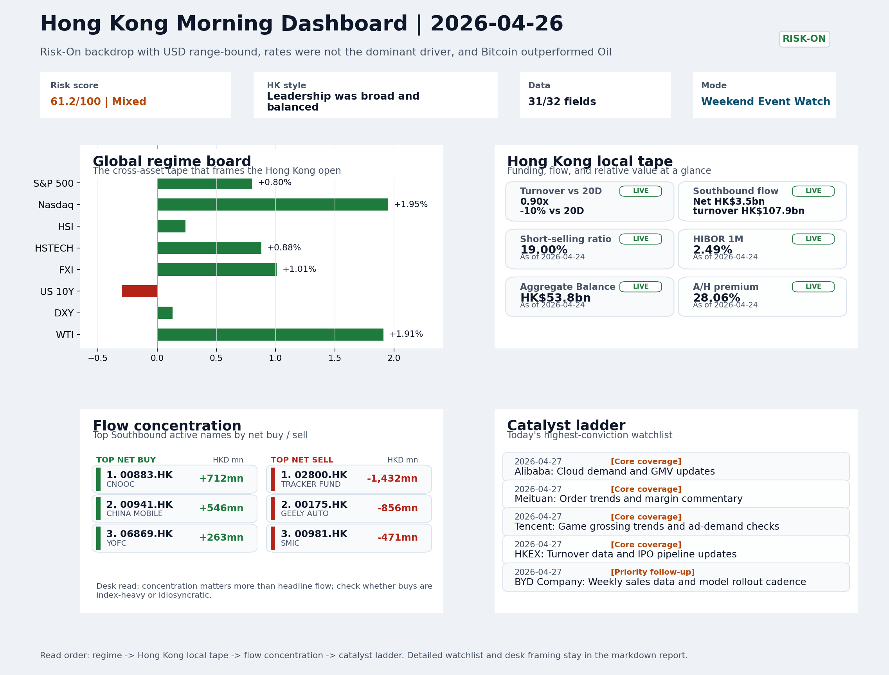
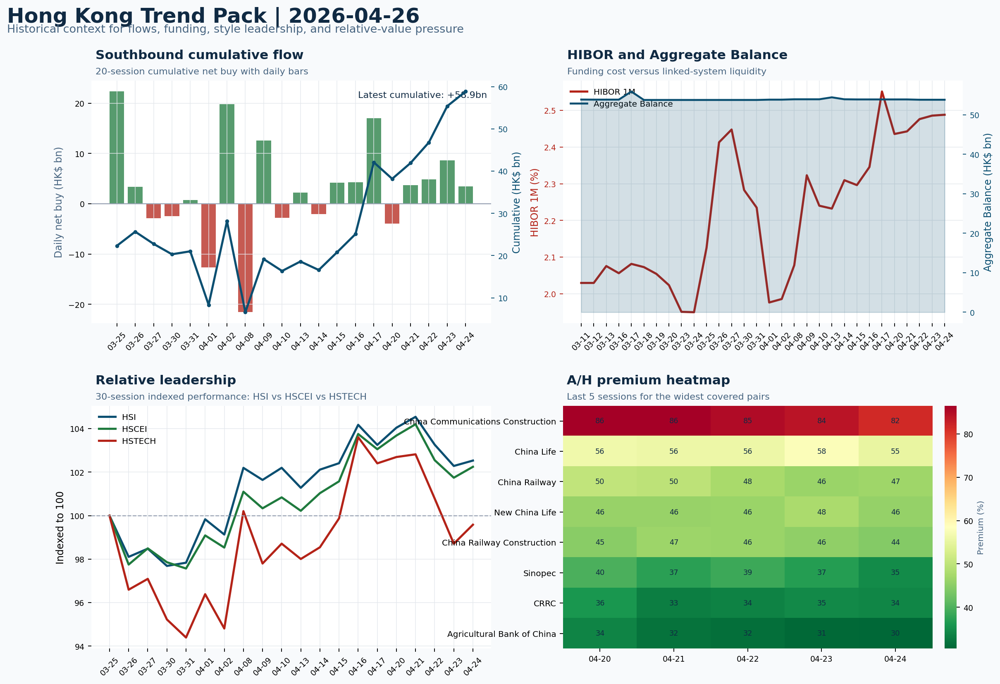

# Morning Research Workbench | 2026-04-27

> Designed for a Hong Kong sell-side commute: Layer 1 `Scan`, Layer 2 `Deep Read`, Layer 3 `Thinking`
> Mode: `Weekend Event Watch` | Track weekend policy, geopolitics, still-moving assets, and Monday open preparation rather than replaying stale cash-market tape.
> Briefing date: `2026-04-27` | Review date: `2026-04-26` | Global request: `2026-04-26` | HK/China request: `2026-04-24` | Market effective date: `2026-04-26` | Generated at: `2026-04-27 07:51:19`
> Date policy: Review date 2026-04-26 is treated as `Weekend Event Watch`. | Global request date is 2026-04-26; adapter effective date is 2026-04-26 and summary date is 2026-04-26. | HK/China local data date is 2026-04-24; role: last completed HK/China cash-market reference tape.

> Market data quality: Coverage: `31/32` | Stale items (>1d): `24` | Missing: `1`

> Report quality: `90.4/100` | Grade `A` | Status `production ready`

## Visual Dashboard

## Layer 1 | Reset (5-10 min)

### 1.1 One-Line Market Pulse
Risk-On weekend setup is constructive for Monday's open - Nasdaq momentum, VIX contraction, and crypto outperforming oil confirm the narrative - but the 19% short-selling ratio means breadth above 1,800 stocks up remains the gating condition for a durable rebound rather than a fade.

### 1.2 Global Asset Price Dashboard

| Asset | Last | 1D move | Read |
| --- | --- | --- | --- |
| S&P 500 | 7,165.08 | +0.80% | US large-cap risk appetite |
| Nasdaq 100 | 27,303.67 | **+1.95%** | Growth and duration leadership |
| Hang Seng Index | 25,978.07 | +0.24% | Hong Kong broad beta |
| Hang Seng TECH | 4.8000 | +0.88% | Hong Kong growth / platform read-through |
| CSI 300 | 4,769.37 | -0.35% | Mainland large-cap tone |
| US 10Y | 4.3100 | -0.30% | Global discount-rate anchor |
| China 10Y | 1.76% | +0.5bp | China local rates anchor \| Live public \| Eastmoney \| 2026-04-24 |
| CN-US 10Y spread | -255.0bp | +3.5bp | Relative carry and macro-pressure gauge \| Live public \| Eastmoney \| 2026-04-24 |
| DXY | 98.64 | +0.13% | Dollar liquidity impulse |
| USD/CNH | 6.8110 | +0.00% | Offshore China risk appetite |
| USD/HKD | 7.8323 | +0.00% | Linked-exchange regime stress check |
| Brent crude | 101.30 | **-3.83%** | Energy / geopolitics |
| COMEX gold | 4,690.10 | -0.68% | Hedge demand / real yields |
| Copper | 6.0100 | -0.22% | Global growth proxy |
| VIX | 18.71 | **-3.11%** | US stress barometer |

### 1.3 Hong Kong Last Cash-Tape Quick Check (Reference)

| Check | Value | Status | Source / as of | Why it matters |
| --- | --- | --- | --- | --- |
| Main Board turnover vs 20D | 0.90x \| -10% vs 20D | Live local | HKEX \| 2026-04-24 | Trailing 20-session average turnover was HK$261.7bn. |
| Southbound / Northbound net flow | Southbound Net HK$3.5bn \| turnover HK$107.9bn \| Northbound Turnover HK$342.9bn \| net unavailable | Live local | HKEX Connect \| 2026-04-24 | Southbound net buy is calculated from HKEX disclosed buy and sell turnover. |
| Short-selling ratio | 19.00% | Live local | HKEX \| 2026-04-24 | Official HKEX stock-level short-selling table, aggregated as a share of total market turnover. |
| AH premium index | 28.06% | Live public | Yahoo \| 2026-04-24 | Simple average across 20 A/H pairs; use dispersion rather than the average alone. |
| USD/HKD spot vs band | 7.8323 \| band 7.7500 to 7.8500 | Live quote + local | Yahoo \| 2026-04-24 | Inside the linked-exchange band without immediate boundary stress. Official Convertibility Undertakings define the linked-rate stress boundaries for USD/HKD. |
| HIBOR 1M | 2.49% | Live local | HKMA \| 2026-04-24 | 1M HIBOR is the cleanest quick read for Hong Kong funding conditions and equity-duration pressure. |
| Aggregate Balance | HK$53.8bn | Live local | HKMA \| 2026-04-24 | Aggregate Balance helps frame whether linked-rate liquidity conditions are tight or comfortable. |
| Hong Kong leadership | Leadership was broad and balanced | Proxy fallback | HSI / HSCEI / HSTECH relative perf \| 2026-04-24 | Use HSI / HSCEI / HSTECH relative moves as the opening style read. |

### 1.4 Risk Dashboard
**Composite risk score:** `61.2/100` | **Regime:** `Mixed`

| Component | Score impact | Evidence |
| --- | --- | --- |
| US beta | +4.8 | S&P 500 +0.80% |
| HK growth | +4.4 | HSTECH +0.88% |
| Offshore China proxy | +5.0 | FXI +1.01% |
| Dollar pressure | -1.3 | DXY +0.13% |
| Volatility | +6.2 | VIX -3.11% |
| HK short-selling | -8 | Short-selling ratio 19.00% |

### 1.5 Next Open Checklist
1. **Risk-On backdrop with USD range-bound, rates were not the dominant driver, and Bitcoin outperformed Oil**
 Still-moving markets | No fresh Hong Kong cash session is assumed; use global active assets and policy/event flow to prepare the next open.
2. **CPI MoM (Released)**
 Macro / policy | Rates expectations, the dollar, and growth-equity valuation | Industries: Technology, Internet, Brokers
3. **[A] Big Tech's $16 Trillion Earnings Week Is Make-Or-Break for Rally**
 News / announcements | This can directly reshape earnings forecasts and the valuation framework
4. **[A] Asia's Busiest Earnings Week May Offer Early Taste of War Impact**
 News / announcements | This can directly reshape earnings forecasts and the valuation framework
5. **[A] Goldman, JPMorgan Show Wall Street's Split in Quantum Computing Race**
 News / announcements | This can directly reshape earnings forecasts and the valuation framework

## Layer 2 | Deep Read (20-30 min)

### 2.1 Still-Moving Global Financial Actions
> Non-trading mode: treat the cash-market tape below as last-available reference, not a fresh trading signal. Priority shifts to policy headlines, geopolitics, central-bank repricing, FX/commodities/crypto, corporate actions, and next-open preparation.

#### Market Setup
**Core tape.** Risk-On persisted through the weekend, with Bitcoin outperforming oil as the dominant cross-asset signal.
**Main driver.** US growth names extended their lead (Nasdaq 100 +1.95%), the VIX fell further (-3.11%), and US 10Y yields dipped slightly (-0.3%), confirming that rates are not the dominant driver this week.
**HK relevance.** Oil remained elevated and geopolitics-driven (Strait of Hormuz stays shut), but the relative strength of crypto and growth equities over energy keeps the macro backdrop supportive for Risk-On assets.

#### Key Drivers
- Nasdaq 100 +1.95% extended the US growth-style lead, transmitting directly to HK tech and internet proxies (Tencent, Meituan, Baidu).
- VIX -3.11% and Bitcoin +1.47% confirm easing stress in the tape and persistent crypto Risk-On, respectively.
- Oil +1.91% remains geopolitics-driven (Hormuz closed, US-Iran talks stalled), keeping a cost-pressure tax on Asian industrials and shipping.
- The 19% short-selling ratio is an elevated drag on local momentum; cleaner breadth is needed to confirm any rebound rather than fade it.

#### Hong Kong Read-Through
**Desk lens.** Leadership was broad and balanced.
**Opening implication.** A constructive Monday open is framed by Nasdaq-100 momentum, FXI confirmation, and the VIX decline. The base case is HSI +0.5 to +1.0% if breadth holds above 1,800 stocks up and short-selling does not re-emerge. Confirm the move with HSTECH and FXI.
- **Cross-market read:** Hang Seng +0.24% / HSCEI +0.49% / HSTECH +0.88%.
- **Cross-market read:** Offshore China proxy FXI +1.01% and USD/CNH +0.00% frame cross-border risk appetite.
- **Cross-market read:** USD/HKD last traded around 7.8323, which keeps the Hong Kong funding lens in focus.

#### Watch Points
- USD composite moved higher by +0.01pct intraday, with a 0.025pct range.
- Main turning points appeared around 2026-04-27 06:05 trough / 2026-04-27 06:20 peak / 2026-04-27 06:35 trough, suggesting event-driven repricing.
- The biggest cross-asset divergence was Bitcoin versus Oil, a spread of 1.672pct.
- Gold moved -0.22pct intraday with a 0.294pct high-low range.

#### Non-Trading Focus Map
- No fresh Hong Kong cash-market session is assumed for 2026-04-26; HK local tape is last completed HK/China cash-market reference tape from 2026-04-24.

| Monitor | Bucket | Last | Move | Why it matters |
| --- | --- | --- | --- | --- |
| VIX | Vol | 18.71 | -3.11% | Lower volatility signals easing stress in the tape. |
| WTI crude | Commodities | 96.20 | +1.91% | A strong crude move needs to be split between geopolitics and demand repair. |
| Bitcoin | Crypto | 78,752.80 | +1.47% | Keep tracking it to confirm whether the core daily narrative is holding. |
| Gold | Commodities | 4,690.10 | -0.68% | Keep tracking it to confirm whether the core daily narrative is holding. |
| US 10Y | Rates | 4.3100 | -0.30% | Keep tracking it to confirm whether the core daily narrative is holding. |
| Copper | Commodities | 6.0100 | -0.22% | Keep tracking it to confirm whether the core daily narrative is holding. |

**Weekend / Holiday Event Docket**

| Channel | Signal | Why monitor | Next check |
| --- | --- | --- | --- |
| Vol | VIX -3.11% | Lower volatility signals easing stress in the tape. | Keep this as the bridge signal until the next Hong Kong cash close confirms or |
| Commodities | WTI crude +1.91% | A strong crude move needs to be split between geopolitics and demand repair. | Keep this as the bridge signal until the next Hong Kong cash close confirms or |
| Crypto | Bitcoin +1.47% | Keep tracking it to confirm whether the core daily narrative is holding. | Keep this as the bridge signal until the next Hong Kong cash close confirms or |
| Commodities | Gold -0.68% | Keep tracking it to confirm whether the core daily narrative is holding. | Keep this as the bridge signal until the next Hong Kong cash close confirms or |
| Released | CPI MoM | Rates expectations, the dollar, and growth-equity valuation | Check the rates, FX, and China-proxy reaction after release or official |
| Released | Trade Balance | Watch whether it changes the day's core market narrative | Check the rates, FX, and China-proxy reaction after release or official |
| Upcoming | Retail Sales MoM | Consumer resilience, growth expectations, and risk-asset pricing | Check the rates, FX, and China-proxy reaction after release or official |
| Geopolitics | Middle East: Regional tension remains elevated | Oil, freight costs, and safe-haven demand | Map any escalation first into oil, gold, USD, CNH, and HK growth-beta sensitivity. |

**Still-moving actions to track**
- **Geopolitics:** Middle East: Regional tension remains elevated | Oil, freight costs, and safe-haven demand
- **Geopolitics:** US-China: Technology export-control rhetoric remains active | China internet, semiconductors, and supply chains
- **Policy / company tape:** Big Tech's $16 Trillion Earnings Week Is Make-Or-Break for Rally | This can directly reshape earnings forecasts and the valuation framework
- **Policy / company tape:** Asia's Busiest Earnings Week May Offer Early Taste of War Impact | This can directly reshape earnings forecasts and the valuation framework
- **Policy / company tape:** Goldman, JPMorgan Show Wall Street's Split in Quantum Computing Race | This can directly reshape earnings forecasts and the valuation framework

**Next-open preparation**
- First dated catalyst to prepare: 2026-04-27 | Alibaba: Cloud demand and GMV updates.
- Refresh HKEX turnover, Stock Connect, short-selling, and AH dispersion once the next HK cash session closes.
- Use USD/CNH, USD/HKD, DXY, oil, gold, and crypto as bridge signals before cash markets reopen.
- Prepare one base case and one risk case for the next Hong Kong open instead of over-reading stale cash-market moves.

**Curated overnight stories**
1. **Big Tech's $16 Trillion Earnings Week Is Make-Or-Break for Rally**
 Why it matters: Google, Microsoft, Meta, Amazon and Apple all report this week. Their combined market cap represents the largest single earnings catalyst of 2026.
 HK read-through: HK internet and AI-adjacent names (Tencent, Meituan, Baidu, EV makers) typically correlate with US tech sentiment.
2. **Asia's Busiest Earnings Week May Offer Early Taste of Iran War Impact**
 Why it matters: For the first time, Asian corporates are reporting results after the US-Iran conflict began and Strait of Hormuz was disrupted.
 HK read-through: Closely watched by HK portfolio managers for signs of how China manufacturing and logistics have been affected by elevated energy costs and rerouted shipping.
3. **US-Iran Peace Talks Stall; Strait of Hormuz Remains Closed**
 Why it matters: Diplomatic resolution appears delayed, sustaining elevated oil prices and keeping energy input costs elevated for Asian manufacturers.
 HK read-through: Elevated oil inflates costs for China/HK industrial and transportation companies. Airlines and shipping firms most directly exposed.
4. **Goldman Retreats, JPMorgan Invests: Wall Street's Split on Quantum Computing**
 Why it matters: Two major banks are taking opposite stances on near-term quantum deployment. This signals a structural divergence in how financial services will approach the technology.
 HK read-through: HK-listed semiconductors and advanced tech names are increasingly evaluated through the lens of AI/quantum readiness.
5. **Fed Set to Lead Uneasy G-7 With Rates Kept on Hold This Week**
 Why it matters: Powell's communication will be scrutinized for any shift in tone on inflation risk from energy prices. Markets currently price no cuts in 2026.
 HK read-through: USD/HKD linkage means HK monetary conditions follow the Fed. A hawkish hold would keep HKD lending rates elevated, capping valuation expansion for HK equities.

### 2.2 Last Available Hong Kong / A-share Tape (Reference Only)
> Non-trading mode: treat the cash-market tape below as last-available reference, not a fresh trading signal. Priority shifts to policy headlines, geopolitics, central-bank repricing, FX/commodities/crypto, corporate actions, and next-open preparation.

#### Local Tape Setup
**Local read.** This weekend's Risk-On framing rests on Nasdaq-100 momentum (+1.95%), a declining VIX (-3.11%), and crypto outperforming oil - the last a signal that speculative appetite is more dominant than energy-cost anxiety.
**Verification point.** HK local leadership is growth-led (HSTECH +0.88%, FXI +1.01%) against a softer HSI (+0.24%), and KWEB inflows confirm offshore China follows the same style.
**Risk to watch.** Southbound net HK$3.5bn provides constructive institutional context.

#### Style and Local Leadership
**Style leadership.** Leadership was broad and balanced.
- **Cross-market read:** Hang Seng +0.24% / HSCEI +0.49% / HSTECH +0.88%.
- **Cross-market read:** Offshore China proxy FXI +1.01% and USD/CNH +0.00% frame cross-border risk appetite.
- **Cross-market read:** USD/HKD last traded around 7.8323, which keeps the Hong Kong funding lens in focus.
**LLM local leadership read.** Growth-led; HSTECH outperformed HSCEI and HSI, FXI led China proxies, KWEB and 3033.HK ETF both showed inflow with price gains, and northbound activity centered on semiconductors and AI infrastructure names.

#### Flow Confirmation
Official Stock Connect evidence is available; use Section 2.3 to confirm whether local money supports the price action.

#### Follow-Through Checklist
**Follow-through check.** Confirm whether HSTECH and FXI sustain their growth leadership relative to HSCEI at Monday's open.

### 2.3 Flow Tracker and Attribution
#### Cross-Asset Attribution v1

| Driver | Direction | Score | Evidence | HK implication |
| --- | --- | --- | --- | --- |
| Oil and geopolitics | supportive | 3.06 | Oil moved -3.83%. | Split the read between energy/cyclicals support and margin/geopolitical pressure. |
| Short-selling pressure | drag | 2.8 | HKEX short-selling ratio was 19.00%. | Elevated short activity argues for extra confirmation before chasing rebounds. |
| US growth-style transmission | supportive | 2.73 | Nasdaq 100 moved +1.95%. | Hong Kong growth and platform names should be tested first at the open. |
| Global equity beta | supportive | 0.8 | S&P 500 moved +0.80%. | Broad beta matters if Hong Kong breadth confirms the overseas signal. |

#### Flow Tracker
##### Flow Takeaways
- Short-selling pressure is elevated, so local rebounds need cleaner breadth and flow confirmation.
- Stock Connect Southbound: net HK$3.5bn on turnover HK$107.9bn (as of 2026-04-24).
- Stock Connect Northbound: turnover RMB342.9bn; public file provides total turnover/top active names, not full net-buy.
- AH premium: simple covered-pair average +28.06%; widest premium: China Communications Construction 81.54%.

##### Key Flow / Funding Metrics

| Metric | Value | Status | Source / as of | Read |
| --- | --- | --- | --- | --- |
| Southbound / Northbound net flow | Southbound Net HK$3.5bn \| turnover HK$107.9bn \| Northbound Turnover HK$342.9bn \| net unavailable | Live local | HKEX Connect \| 2026-04-24 | Southbound net buy is calculated from HKEX disclosed buy and sell turnover. |
| Main Board turnover vs 20D | 0.90x \| -10% vs 20D | Live local | HKEX \| 2026-04-24 | Trailing 20-session average turnover was HK$261.7bn. |
| Short-selling ratio | 19.00% | Live local | HKEX \| 2026-04-24 | Official HKEX stock-level short-selling table, aggregated as a share of total market turnover. |
| AH premium index | 28.06% | Live public | Yahoo \| 2026-04-24 | Simple average across 20 A/H pairs; use dispersion rather than the average alone. |
| HIBOR 1M | 2.49% | Live local | HKMA \| 2026-04-24 | 1M HIBOR is the cleanest quick read for Hong Kong funding conditions and equity-duration pressure. |
| Aggregate Balance | HK$53.8bn | Live local | HKMA \| 2026-04-24 | Aggregate Balance helps frame whether linked-rate liquidity conditions are tight or comfortable. |

##### Stock Connect Southbound Active Names

| Rank | Ticker | Name | Buy | Sell | Net buy |
| --- | --- | --- | --- | --- | --- |
| 9 | 02800.HK | TRACKER FUND | HK$266.1mn | HK$1,698.5mn | HK$-1,432.4mn |
| 6 | 00175.HK | GEELY AUTO | HK$127.2mn | HK$982.8mn | HK$-855.6mn |
| 5 | 00883.HK | CNOOC | HK$1,698.4mn | HK$986.5mn | HK$711.9mn |
| 10 | 00941.HK | CHINA MOBILE | HK$835.9mn | HK$289.6mn | HK$546.4mn |
| 1 | 00981.HK | SMIC | HK$4,366.9mn | HK$4,838.0mn | HK$-471.2mn |

##### AH Premium Dispersion

| Name | A ticker | H ticker | Premium | As of |
| --- | --- | --- | --- | --- |
| China Communications Construction | 601800.SS | 1800.HK | +81.54% | 2026-04-24 |
| China Life | 601628.SS | 2628.HK | +55.38% | 2026-04-24 |
| China Railway | 601390.SS | 0390.HK | +46.87% | 2026-04-24 |
| New China Life | 601336.SS | 1336.HK | +45.90% | 2026-04-24 |
| China Railway Construction | 601186.SS | 1186.HK | +44.43% | 2026-04-24 |

##### HKEX Short-Selling Watch

| Ticker | Name | Short ratio | Short turnover | Total turnover |
| --- | --- | --- | --- | --- |
| 00388.HK | HKEX | 15.18% | HK$0.2bn | HK$1.2bn |
| 00700.HK | TENCENT | 16.23% | HK$1.5bn | HK$9.1bn |
| 00941.HK | CHINA MOBILE | 16.27% | HK$0.3bn | HK$1.9bn |
| 01211.HK | BYD COMPANY | 37.05% | HK$1.1bn | HK$3.0bn |
| 01299.HK | AIA | 21.91% | HK$0.4bn | HK$2.0bn |

- **Short-value leaders:** 02800.HK TRACKER FUND (HK$5.6bn); 02828.HK HSCEI ETF (HK$2.9bn); 03033.HK CSOP HS TECH (HK$1.9bn); 00981.HK SMIC (HK$1.5bn).

### 2.4 Macro and Policy Tracking
**Desk read.** No LLM macro interpretation was available; rely on the calendar table and released data below.

| Time | Region | Event | Status | Desk read |
| --- | --- | --- | --- | --- |
| 20:30 | US | CPI MoM | Released | Impact: Rates expectations, the dollar, and growth-equity valuation \| Attention: 5/5 \| Industries: Technology, Internet, Brokers |
| 09:30 | China | Trade Balance | Released | Impact: Watch whether it changes the day's core market narrative \| Attention: 3/5 \| Industries: To be assessed |
| 20:30 | US | Retail Sales MoM | Upcoming | Impact: Consumer resilience, growth expectations, and risk-asset pricing \| Attention: 5/5 \| Industries: Consumer, E-commerce, Consumer discretionary |
| 09:20 | China | Loan Prime Rate | Upcoming | Impact: Watch whether it changes the day's core market narrative \| Attention: 3/5 \| Industries: To be assessed |
| 22:00 | Federal Reserve | Jerome Powell: Economic outlook remarks | Central bank | Impact: Policy path, liquidity conditions, and cross-asset risk appetite \| Attention: 5/5 \| Industries: Technology, Financials, Gold |
| 10:00 | PBOC | Open Market Operations Desk: Daily liquidity operation window | Central bank | Impact: Policy path, liquidity conditions, and cross-asset risk appetite \| Attention: 3/5 \| Industries: Technology, Financials, Gold |

#### Positioning and Risk Backdrop
- Options activity centered on KWEB Call, with Vol/OI at 1.88x and a bullish bias.
- Put/Call structure shows equity 0.68 / index 1.15, implying Single-stock optimism with index hedging.
- Geopolitics: Middle East | Regional tension remains elevated | Impact: Oil, freight costs, and safe-haven demand
- Geopolitics: US-China | Technology export-control rhetoric remains active | Impact: China internet, semiconductors, and supply chains

### 2.5 Key Company and Sector Events

| Grade | Sector | Headline | Why it matters | Horizon |
| --- | --- | --- | --- | --- |
| A | Autos and EV | Big Tech's $16 Trillion Earnings Week Is Make-Or-Break for Rally | This can directly reshape earnings forecasts and the valuation framework | Short-term catalyst |
| A | Other | Asia's Busiest Earnings Week May Offer Early Taste of War Impact | This can directly reshape earnings forecasts and the valuation framework | Short-term catalyst |
| A | Other | Goldman, JPMorgan Show Wall Street's Split in Quantum Computing Race | This can directly reshape earnings forecasts and the valuation framework | Short-term catalyst |
| A | Semiconductors and AI | Traders are betting on big moves in Intel on earnings | This can directly reshape earnings forecasts and the valuation framework | Short-term catalyst |
| C | Financials | Record-Setting Momentum Rally Is Drawing Doubters | Assess whether the story can propagate through the Financials value chain | Monitor |
| C | Autos and EV | Bond Traders Await Powell Update, Slate of US Treasury Auctions | This can directly reshape earnings forecasts and the valuation framework | Short-term catalyst |
| C | Autos and EV | Fed Set to Lead Uneasy G-7 With Rates Kept on Hold This Week | Policy and regulation can reshape the Autos and EV industry logic | Medium-term trend |
| C | Semiconductors and AI | US Stock Futures Dip as Iran Talks Stall, Oil Up: Markets Wrap | Assess whether the story can propagate through the Semiconductors and AI | Monitor |

#### HKEX Announcements

| Grade | Ticker | Type | Release time | Title |
| --- | --- | --- | --- | --- |
| A | 01593.HK | Profit warning | 2026-04-24 | Profit warning / alert announcement |
| A | 02530.HK | Profit warning | 2026-04-23 | Profit warning / alert announcement |
| A | 03839.HK | Profit warning | 2026-04-22 | Profit warning / alert announcement |
| A | 05834.HK | Profit warning | 2026-04-22 | Profit warning / alert announcement |
| A | 06680.HK | Profit warning | 2026-04-22 | Profit warning / alert announcement |
| A | 00179.HK | Profit warning | 2026-04-21 | Profit warning / alert announcement |
| A | 00551.HK | Profit warning | 2026-04-21 | Profit warning / alert announcement |
| A | 01651.HK | Profit warning | 2026-04-21 | Profit warning / alert announcement |

#### Earnings / Results Watch

| Ticker | Company | Timing | Expectation framing |
| --- | --- | --- | --- |
| 0700.HK | Tencent Holdings | After Market Close | EPS est. 4.15 HKD \| revenue est. 163.2bn HKD |
| 0388.HK | Hong Kong Exchanges and Clearing | Before Market Open | EPS est. 2.81 HKD \| revenue est. 6.0bn HKD |

#### Rating Changes
- **9988.HK** | Morgan Stanley | Upgrade | Equal Weight -> Overweight | PT 92 -> 105

#### IPO Watch
- IPO / grey-market / first-day performance should be wired to a dedicated Hong Kong ECM adapter.

### 2.6 Coverage Pools
#### Core coverage

| Name | Ticker | Last | 1D | Range position | Morning note |
| --- | --- | --- | --- | --- | --- |
| Alibaba | 9988.HK | 131.80 | +1.07% | Bottom of range | The name sits near the bottom of its recent range and is worth monitoring for a |
| Meituan | 3690.HK | 82.45 | -0.78% | Mid-range | Positioning is neutral for now, so use it mainly to monitor marginal information |
| Tencent | 0700.HK | 493.40 | -0.36% | Bottom of range | The name sits near the bottom of its recent range and is worth monitoring for a |
| HKEX | 0388.HK | 411.60 | -0.15% | Mid-range | Positioning is neutral for now, so use it mainly to monitor marginal information |

**Recent headlines for Alibaba:**
- [Alibaba Group Holding (NYSE:BABA) Valuation Check As New Qwen AI Partnerships Take Shape](https://finance.yahoo.com/markets/stocks/articles/alibaba-group-holding-nyse-baba-220428832.html) (Simply Wall St.)
- [The $1.75 Trillion Launch: Is SpaceX's IPO a Generational Buy -- or the Ultimate Bubble?](https://www.fool.com/investing/2026/04/26/the-175-trillion-launch-is-spacexs-ipo-a-generatio/) (Motley Fool)
**Recent headlines for Meituan:**
- [Alibaba Stock Is Getting Hit Again, but Qwen and Cloud Growth Are Surging](https://www.marketbeat.com/originals/alibaba-stock-is-getting-hit-again-but-qwen-and-cloud-growth-are-surging/?utm_source=yahoofinance&utm_medium=yahoofinance) (MarketBeat)
- [JD.com Stock Falls as Profits Dive Despite Rising Revenue](https://www.barrons.com/articles/jd-com-earnings-stock-price-1dec392c?siteid=yhoof2&yptr=yahoo) (Barrons.com)
**Recent headlines for Tencent:**
- [The GDP-employment disconnect is deepening in China](https://finance.yahoo.com/economy/policy/articles/gdp-employment-disconnect-deepening-china-093345118.html) (Investing.com)
- [Tencent Hy3 AI And TVU Cloud Deal Put Valuation In Focus](https://finance.yahoo.com/markets/stocks/articles/tencent-hy3-ai-tvu-cloud-001711699.html) (Simply Wall St.)
**Recent headlines for HKEX:**
- [Hong Kong maintains IPO dominance, though regulatory headwinds mount](https://finance.yahoo.com/markets/stocks/articles/hong-kong-maintains-ipo-dominance-074955086.html) (Investing.com)
- [HKEX strengthens governance with tougher auditor change rules](https://www.internationalaccountingbulletin.com/news/hkex-strengthens-governance-with-tougher-auditor-change-rules/) (International Accounting Bulletin)

#### Priority follow-up

| Name | Ticker | Last | 1D | Range position | Morning note |
| --- | --- | --- | --- | --- | --- |
| BYD Company | 1211.HK | 101.20 | -2.22% | Mid-range | Short-term pressure is visible; check for a fundamental or regulatory reason. |
| China Mobile | 0941.HK | 83.90 | -0.12% | Top of range | The name sits near the top of its recent range, so watch for profit-taking under |
| AIA | 1299.HK | 81.65 | -0.12% | Bottom of range | The name sits near the bottom of its recent range and is worth monitoring for a |

**Recent headlines for BYD Company:**
- ['We will not survive': Toyota, Honda and Ford CEOs issue chilling warning about China - and it could hit your portfolio](https://finance.yahoo.com/markets/stocks/articles/not-survive-toyota-honda-ford-130000088.html) (Moneywise)
- [3 Profitable Stocks We Steer Clear Of](https://finance.yahoo.com/markets/stocks/articles/3-profitable-stocks-steer-clear-023723230.html) (StockStory)
**Recent headlines for China Mobile:**
- [Deutsche Telekom Weighs Full Combination With T-Mobile](https://finance.yahoo.com/markets/stocks/articles/deutsche-telekom-weighs-full-combination-115107414.html) (Bloomberg)
- [Deutsche Telekom exploring merger with T-Mobile, Bloomberg News reports](https://finance.yahoo.com/markets/stocks/articles/deutsche-telekom-exploring-merger-t-182010144.html) (Reuters)
**Recent headlines for AIA:**
- [Is It Too Late To Consider AIA Group (SEHK:1299) After Its 82% One Year Rally?](https://finance.yahoo.com/markets/stocks/articles/too-consider-aia-group-sehk-042100864.html) (Simply Wall St.)
- [Is AIA (AAGIY) Outperforming Other Finance Stocks This Year?](https://finance.yahoo.com/markets/stocks/articles/aia-aagiy-outperforming-other-finance-134003763.html) (Zacks)

#### Learning watchlist

| Name | Ticker | Last | 1D | Range position | Morning note |
| --- | --- | --- | --- | --- | --- |
| Hang Seng TECH ETF | 3033.HK | 4.8000 | +0.88% | Bottom of range | The name sits near the bottom of its recent range and is worth monitoring for a |
| HSCEI ETF | 2828.HK | 89.94 | +0.63% | Mid-range | Positioning is neutral for now, so use it mainly to monitor marginal information |
| Tracker Fund of Hong Kong | 2800.HK | 26.26 | +0.23% | Mid-range | Positioning is neutral for now, so use it mainly to monitor marginal information |

## Layer 3 | Thinking (10-15 min)

### 3.1 Rotating Theme Deep Dive

| Field | Read |
| --- | --- |
| Theme | AI and Compute Chain |
| Angle for the day | Track whether global AI capex, semis, cloud, and server demand are still carrying offshore China internet and hardware sentiment. |

**Theme desk read**
**Core thesis.** The Risk-On regime remains intact heading into the Monday open.
**Evidence.** The VIX contracting 3.1% to 18.71 signals reduced stress in the global tape, Bitcoin holding near $78,753 (+1.5%) keeps the risk-asset narrative supported.
**What to test.** The weekly AI and Compute Chain angle remains relevant because Big Tech's $16 trillion earnings week and Intel's earnings tonight are positioned to reshape semiconductor and cloud-demand forecasts directly, with downstream.

**Signals to keep in mind**
- Big Tech's $16 Trillion Earnings Week Is Make-Or-Break for Rally: This can directly reshape earnings forecasts and the valuation framework
- Traders are betting on big moves in Intel on earnings: This can directly reshape earnings forecasts and the valuation framework
- VIX -3.11%: Lower volatility signals easing stress in the tape.
- WTI crude +1.91%: A strong crude move needs to be split between geopolitics and demand repair.

**LLM watch items:**
- Intel earnings tonight: high-strike catalyst for semis and compute-chain sentiment; map read-through to SMIC and Hua Hong semiconductor names Monday.
- Big Tech earnings week: $16 trillion in market cap reporting; AI capex guidance is the critical variable for offshore China cloud and platform names.
- China Trade Balance (USD 85.2bn): beat print reduces near-term export-scare risk; verify whether CNY or China-proxy HK stocks react positively Monday.
- US CPI (0.3% actual vs 0.2% forecast): hotter-than-expected inflation print; watch USD/CNH, DXY, and US 10Y reaction post-release for growth-equity
- US Retail Sales (Forecast 0.3%): consumer-resilience check; direction matters for risk-asset positioning ahead of the next open.

**Related names to keep close:**

| Name | Ticker | Bucket | Morning read |
| --- | --- | --- | --- |
| Alibaba | 9988.HK | Core coverage | The name sits near the bottom of its recent range and is worth monitoring for a |
| Meituan | 3690.HK | Core coverage | Positioning is neutral for now, so use it mainly to monitor marginal information |
| Tencent | 0700.HK | Core coverage | The name sits near the bottom of its recent range and is worth monitoring for a |
| HKEX | 0388.HK | Core coverage | Positioning is neutral for now, so use it mainly to monitor marginal information |

**Upcoming catalysts tied to the theme:**
- 2026-04-27 | Alibaba: Cloud demand and GMV updates | Key read-through for China consumption, cloud, and platform regulation
- 2026-04-27 | Tencent: Game grossing trends and ad-demand checks | Core offshore China platform proxy for gaming, ads, and AI monetization
- 2026-04-27 | AIA: NBV trends and agency momentum | Read-through for wealth demand, mainland visitor activity, and HK financial sentiment
- 2026-04-27 | Hang Seng TECH ETF: AI narrative shifts and China platform regulation headlines | Fast proxy for Hong Kong internet and growth leadership

**Relevant headlines:**
- [Big Tech's $16 Trillion Earnings Week Is Make-Or-Break for Rally](https://www.bloomberg.com/news/articles/2026-04-26/big-tech-s-16-trillion-earnings-week-is-make-or-break-for-rally)
- [Traders are betting on big moves in Intel on earnings](https://www.cnbc.com/2026/04/23/traders-are-betting-on-big-moves-in-intel-on-earnings.html)
- [Record-Setting Momentum Rally Is Drawing Doubters](https://www.bloomberg.com/news/articles/2026-04-26/record-setting-momentum-rally-is-drawing-doubters-markets-wrap)

### 3.2 Next Session Outlook and Calendar
- Non-trading review: use today's calendar to prepare the next Hong Kong open rather than treating the last cash tape as a fresh signal.
- Macro: CPI MoM is the first item to anchor the open and the rates/FX response.
- Corporate / event: Alibaba: Cloud demand and GMV updates is the cleanest same-day catalyst to prepare for.

**Same-day macro docket**

| Time | Country | Event | Status | Detail |
| --- | --- | --- | --- | --- |
| 20:30 | US | CPI MoM | Released | Actual 0.3% / Forecast 0.2% / Prior 0.4% |
| 09:30 | China | Trade Balance | Released | Actual USD 85.2bn / Forecast USD 79.0bn / Prior USD 80.6bn |
| 20:30 | US | Retail Sales MoM | Upcoming | Forecast 0.3% / Prior 0.6% |
| 09:20 | China | Loan Prime Rate | Upcoming | Forecast 3.45% / Prior 3.45% |
| 22:00 | Federal Reserve | Jerome Powell: Economic outlook remarks | Central bank | speech |

**Same-day catalyst list**

| Date | Time | Category | Event | Importance |
| --- | --- | --- | --- | --- |
| 2026-04-27 | | Core coverage | Alibaba: Cloud demand and GMV updates | 3 |
| 2026-04-27 | | Core coverage | Meituan: Order trends and margin commentary | 3 |
| 2026-04-27 | | Core coverage | Tencent: Game grossing trends and ad-demand checks | 3 |
| 2026-04-27 | | Core coverage | HKEX: Turnover data and IPO pipeline updates | 3 |
| 2026-04-27 | | Priority follow-up | BYD Company: Weekly sales data and model rollout cadence | 3 |
| 2026-04-27 | | Priority follow-up | China Mobile: Capex updates and dividend policy signals | 3 |

**Next few sessions**

| Date | Category | Event | Impact |
| --- | --- | --- | --- |
| 2026-04-27 | Core coverage | Alibaba: Cloud demand and GMV updates | Key read-through for China consumption, cloud, and platform regulation |
| 2026-04-27 | Core coverage | Meituan: Order trends and margin commentary | High-frequency read on local services demand and platform competition |
| 2026-04-27 | Core coverage | Tencent: Game grossing trends and ad-demand checks | Core offshore China platform proxy for gaming, ads, and AI monetization |
| 2026-04-27 | Core coverage | HKEX: Turnover data and IPO pipeline updates | Direct proxy for Hong Kong market turnover, listings, and southbound |
| 2026-04-27 | Priority follow-up | BYD Company: Weekly sales data and model rollout cadence | Hong Kong-listed proxy for EV volumes, export mix, and price competition |
| 2026-04-27 | Priority follow-up | China Mobile: Capex updates and dividend policy signals | Defensive SOE benchmark for yield trade and domestic |
| 2026-04-27 | Priority follow-up | AIA: NBV trends and agency momentum | Read-through for wealth demand, mainland visitor activity, and HK |
| 2026-04-27 | Learning watchlist | Hang Seng TECH ETF: AI narrative shifts and China platform | Fast proxy for Hong Kong internet and growth leadership |

### 3.3 Daily One Chart
**Daily One Chart | HKEX short-selling pressure map**

**Chart read.** Market short-selling reached 19.00% of turnover.
**Why it matters.** The point is not that the market is weak; the point is whether pressure is concentrated in ETFs and crowded Hong Kong growth expressions.

_Source: HKEX Daily Quotations - Short Selling Turnover_

### 3.4 Hong Kong Trend Pack
**Hong Kong Trend Pack**

**Trend read.** Four historical lenses: Southbound cumulative flow, HKMA funding and liquidity, HSI/HSCEI/HSTECH relative leadership, and A/H premium dispersion.

_Source: HKEX Stock Connect, HKMA liquidity data, and public Yahoo Finance quotes_

### 3.5 Personal View Pad
- **Thinking note:** Treat this weekend as an active preparation frame rather than a replay of stale tape.
- **Action:** The critical event sequence is Intel earnings tonight followed by Google, Microsoft, Meta, Amazon.
- **Suggested market answer:** The setup is constructive but conditional on Monday breadth and US growth leadership confirming rather than fading.
- **Second sentence:** I would treat Big Tech guidance tonight as the swing catalyst that either validates the Risk-On transmission to HK tech and internet names or resets the tape.
- **What could break the view:** Three risks frame the weekend-to-Mondow transition.
- Does the overnight tape still read as `Risk-On`, or do I expect a different Hong Kong cash-session outcome?
- Is today's Hong Kong setup better described as `Leadership was broad and balanced`, and does that match my current mental model?
- What was the most important overnight surprise, and does it change my base case?
- Which sector or stock view now deserves a tighter follow-up or a revised assumption?
- If I were asked for a two-minute market view this morning, what would my answer be?
- My own view after the commute:
- What changed versus yesterday:
- Which name / sector deserves extra prep before the open:

## Traceable Appendix

### Key Questions to Keep in Mind
- Is risk appetite rising or fading? The overnight tape reads closer to `Risk-On`.
- Did rates expectations move? Focus on whether US 10Y, DXY, and growth style moved together.
- Were commodities the real story? Watch WTI and gold for geopolitics versus inflation signals.
- Is Hong Kong setup internet-led, SOE-led, or broad beta-led? Compare HSTECH, HSCEI, and HSI.
- Did offshore markets move China risk appetite? Focus on HSI, FXI, USD/CNH, and USD/HKD.

### Report Quality and Validation
- **Quality score:** 90.4/100 | **Grade:** A | **Status:** production ready

| Component | Score | Weight | Read |
| --- | --- | --- | --- |
| Market data coverage | 96.9 | 0.3 | 31/32 core market fields available. |
| Hong Kong local metrics | 82.3 | 0.25 | 8 live, 3 proxy, 0 unavailable local checks. |
| Key public adapters | 100.0 | 0.2 | 4/4 key adapters were available or partially available. |
| LLM task health | 71.4 | 0.15 | 5/7 LLM tasks succeeded or used validated cache; 2 error(s). |
| Fact-check guardrail | 100.0 | 0.1 | Checked 2 numeric claims; 0 numeric mismatch(es), 0 logic warning(s); 0 critical, 0 review. |

**LLM fact-check guardrail**
- Checked 2 numeric claims; 0 numeric mismatch(es), 0 logic warning(s); 0 critical, 0 review.

**Adapter status**

| Adapter | Status |
| --- | --- |
| Stock Connect | ok |
| A/H premium | ok |
| HKEX announcements | ok |
| China rates | ok |

### Source Links
- [Big Tech's $16 Trillion Earnings Week Is Make-Or-Break for Rally](https://www.bloomberg.com/news/articles/2026-04-26/big-tech-s-16-trillion-earnings-week-is-make-or-break-for-rally) (bloomberg_markets)
- [Asia's Busiest Earnings Week May Offer Early Taste of War Impact](https://www.bloomberg.com/news/articles/2026-04-26/asia-s-busiest-earnings-week-may-offer-early-taste-of-war-impact) (bloomberg_markets)
- [Goldman, JPMorgan Show Wall Street's Split in Quantum Computing Race](https://www.bloomberg.com/news/features/2026-04-26/wall-street-s-quantum-computing-divide-goldman-retreats-jpmorgan-invests) (bloomberg_markets)
- [Traders are betting on big moves in Intel on earnings](https://www.cnbc.com/2026/04/23/traders-are-betting-on-big-moves-in-intel-on-earnings.html) (cnbc_markets)
- [Record-Setting Momentum Rally Is Drawing Doubters](https://www.bloomberg.com/news/articles/2026-04-26/record-setting-momentum-rally-is-drawing-doubters-markets-wrap) (bloomberg_markets)
- [Bond Traders Await Powell Update, Slate of US Treasury Auctions](https://www.bloomberg.com/news/articles/2026-04-26/bond-traders-await-powell-update-slate-of-us-treasury-auctions) (bloomberg_markets)
- [Fed Set to Lead Uneasy G-7 With Rates Kept on Hold This Week](https://www.bloomberg.com/news/articles/2026-04-25/fed-set-to-lead-uneasy-g-7-with-rates-kept-on-hold-this-week) (bloomberg_markets)
- [US Stock Futures Dip as Iran Talks Stall, Oil Up: Markets Wrap](https://www.bloomberg.com/news/articles/2026-04-26/us-stock-futures-decline-as-iran-talks-stall-markets-wrap) (bloomberg_markets)
- [Oil Rises as Hormuz Stays Shut for Third Month After Talks Stall](https://www.bloomberg.com/news/articles/2026-04-26/latest-oil-market-news-and-analysis-for-april-27) (bloomberg_markets)
- [The Stock Picking Philosophy to Find the Next Amazon: Masters in Business](https://www.bloomberg.com/news/videos/2026-04-23/philosophy-to-find-the-next-amazon-masters-in-business-video) (bloomberg_markets)
- [Stocks making the biggest moves after hours: Intel, SAP, Boyd Gaming, MaxLinear and more](https://www.cnbc.com/2026/04/23/stocks-making-the-biggest-moves-after-hours-intc-sap-byd-mxl.html) (cnbc_markets)
- [The aerospace and defense trade is taking investors deeper into space, and more ETFs are up for the mission](https://www.cnbc.com/2026/04/24/aerospace-and-defense-as-growth-drivers-for-etfs-amid-iran-war.html) (cnbc_markets)
- [Alibaba Group Holding (NYSE:BABA) Valuation Check As New Qwen AI Partnerships Take Shape](https://finance.yahoo.com/markets/stocks/articles/alibaba-group-holding-nyse-baba-220428832.html) (Simply Wall St.)
- [The $1.75 Trillion Launch: Is SpaceX's IPO a Generational Buy -- or the Ultimate Bubble?](https://www.fool.com/investing/2026/04/26/the-175-trillion-launch-is-spacexs-ipo-a-generatio/) (Motley Fool)
- [Alibaba Stock Is Getting Hit Again, but Qwen and Cloud Growth Are Surging](https://www.marketbeat.com/originals/alibaba-stock-is-getting-hit-again-but-qwen-and-cloud-growth-are-surging/?utm_source=yahoofinance&utm_medium=yahoofinance) (MarketBeat)

## Supplementary Visual Appendix

This appendix is professional-path only. It keeps a traceable index of the report visuals and the deterministic chart cues used to frame the morning note, without injecting the legacy intraday chart pack.

### Visual Index

| Visual | Path | Role |
| --- | --- | --- |
| Visual Dashboard | `charts/dashboard_2026-04-27.png` | Cross-asset regime board and Hong Kong local tape snapshot. |
| Daily One Chart | `charts/daily_one_chart_2026-04-27.png` | Single highest-conviction visual story for the day. |
| Hong Kong Trend Pack | `charts/hk_trend_pack_2026-04-27.png` | Historical context for flows, liquidity, leadership, and A/H dispersion. |

### Deterministic Chart Cues
- FX / liquidity: USD composite moved higher by +0.01pct intraday, with a 0.025pct range.
- FX / liquidity: Main turning points appeared around 2026-04-27 06:05 trough / 2026-04-27 06:20 peak / 2026-04-27 06:35 trough, suggesting event-driven repricing rather than a clean one-way USD move.
- Cross-asset: The biggest cross-asset divergence was Bitcoin versus Oil, a spread of 1.672pct.
- Cross-asset: Gold moved -0.22pct intraday with a 0.294pct high-low range.
- Cross-asset: Oil moved -0.26pct intraday with a 0.55pct high-low range.
- Cross-asset: Bitcoin moved +1.41pct intraday with a 1.804pct high-low range.

### Risk Dashboard Components

| Component | Score impact | Evidence |
| --- | --- | --- |
| US beta | +4.8 | S&P 500 +0.80% |
| HK growth | +4.4 | HSTECH +0.88% |
| Offshore China proxy | +5.0 | FXI +1.01% |
| Dollar pressure | -1.3 | DXY +0.13% |
| Volatility | +6.2 | VIX -3.11% |
| HK short-selling | -8 | Short-selling ratio 19.00% |
